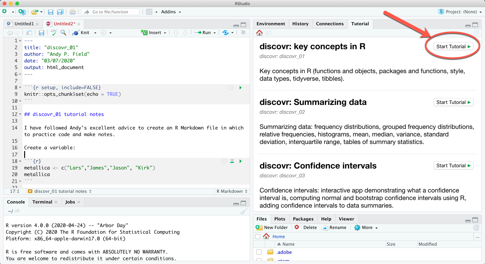

<!-- README.md is generated from README.Rmd. Please edit that file -->

```{r, include = FALSE}
knitr::opts_chunk$set(
  collapse = TRUE,
  comment = "#>",
  fig.path = "man/figures/README-",
  out.width = "100%"
)
```

# discovr: Resources for Discovering Statistics Using R and RStudio (Field, 2026)

<!-- badges: start -->

[](https://CRAN.R-project.org/package=discovr)
[](https://cran.r-project.org/package=discovr)

<!-- badges: end -->

<div style="float: right"></div>


The `discovr` package contains resources for my 2026 textbook [Discovering Statistics Using  and ](https://www.discovr.rocks/). There are tutorials written using [learnr](https://rstudio.github.io/learnr/). Once a tutorial is running it's a bit like reading a book but with places where you can practice the  code that you have just been taught. The `discovr` package is free and offered to support tutors and students using my textbook who want to learn .

> **NOTE**
> Over summer 2025 the tutorials within this package were fully updated (see News).

## Installing `discovr`

To use `discovr` you first need to install  and  and familiarise yourself with ,  and good workflow practice. You can do this using [this interactive tutorial](https://milton-the-cat.rocks/learnr/r/r_getting_started/). Once you have installed  and  you can install `discovr`.

The current released version is available from CRAN:

```{r, eval = F}
install.packages("discovr")
```

I don't currently plan any major updates because the entire package was overhauled in 2025 to match the published version of the book. That said, minor tweaks, typo fixes and so on will be available in the development version, which can be installed using

```{r, eval = F}
if(!require(remotes)){
  install.packages('remotes')
}

remotes::install_github("profandyfield/discovr")
```


## Interactive tutorials

I recommend working through [this playlist of tutorials](https://www.youtube.com/playlist?list=PLEzw67WWDg83weG3idsgy4wuOIJAashA2&si=PiI-sDvqc1DkaWOq) on how to install, set up and work within  and  before starting the interactive tutorials.

### List of tutorials

- `discovr_01`: Introducing , RStudio and Quarto: What is R, tour of RStudio and Quarto, getting help, installing packages, coding style and loading packages.
- `discovr_02`: Code fundamentals: Functions and objects, packages and functions, style, data types.
- `discovr_03`: The tidyverse: tidy and messy data, tibbles, adding and selecting variables, filtering cases.
- `discovr_04`: Summarizing data: mean, median, variance, standard deviation, interquartile range,  normal and bootstrap confidence intervals, tables of summary statistics. Includes an interactive app demonstrating what a confidence interval is.
- `discovr_05`: Visualizing data. The ggplot2 package, boxplots, plotting means, violin plots, scatterplots, grouping by colour, grouping using facets, adjusting scales, adjusting positions."
- `discovr_06`: The beast of bias. Restructuring data from messy to tidy format (and back). Spotting outliers using histograms and boxplots. Calculating *z*-scores (standardizing scores). Writing your own function. Using *z*-scores to detect outliers. Q-Q plots. Calculating skewness, kurtosis and the number of valid cases. Grouping summary statistics by multiple categorical/grouping variables.
- `discovr_07`: Associations. Plotting data with GGally. Pearson's *r*, Spearman's Rho, Kendall's tau, robust correlations. Using `display()` to round output more flexibly.
- `discovr_08`: The general linear model (GLM). Visualizing the data, fitting GLMs with one and two predictors. Viewing model parameters with broom, model parameters, standard errors, confidence intervals, fit statistics, significance.
- `discovr_09`: Categorical predictors with two categories (comparing two means). Comparing two independent means, comparing two related means, effect sizes, robust comparisons of means (independent and related), Bayes factors and estimation (independent and related means).
- `discovr_10`: Moderation and mediation. Centring variables (grand mean centring), specifying interaction terms, moderation analysis, simple slopes analysis, Johnson-Neyman intervals, mediation with one predictor, direct and indirect effects, mediation using `lavaan`.
- `discovr_11`: Comparing several means. Essentially 'One-way independent ANOVA' but taught using a general linear model framework. Covers setting contrasts (dummy coding, contrast coding, and linear and quadratic trends), the *F*-statistic and Welch's robust *F*, robust parameter estimation, heteroscedasticity-consistent tests of parameters, robust tests of means based on trimmed data, *post hoc* tests.
- `discovr_12`: Linear models involving continuous and categorical predictors. The first example looks at the case o moderation (non-paralell slopes models), whereas the second explores comparing means adjusted for other variables (a parallel slopes model or 'Analysis of Covariance (ANCOVA)'). The tutorial covers setting contrasts, fitting the models, evaluating effects using *F*-statistics based on Type III sums of squares and diagnostic plots, and interpretting the model using heteroscedasticity-consistent tests of parameters and *post hoc* tests.
- `discovr_13`: Factorial designs. Fitting models for two-way factorial designs (independent measures) using `lm()`. This tutorial builds on previous ones to show how models can be fit with two categorical predictors to look at the interaction between them. We look at fitting the models, setting contrasts for the two categorical predictors, interaction plots, simple effects analysis, diagnostic plots and robust models.
- `discovr_13_afex`: Factorial designs. Fitting models for two-way factorial designs (independent measures) using the `afex` package. This tutorial takes an ANOVA approach to factorical designs. We look at fitting the models, interaction plots, simple effects analysis, diagnostic plots, partial omega-squared and robust models.
- `discovr_14`: Multilevel models. This tutorial looks at fitting multilevel models using the `glmmTMB` package (all code will also work with `lme4`). It begins with an optional section on checking and coding categorical variables before moving on to show you how to fit and interpret a multilevel model. We also look briefly at the `purrr` package.
- `discovr_15`: Repeated measures designs. Fitting models for one- and two-way repeated measures designs using the `afex` package. This tutorial builds on previous ones to show how models can be fit with one or two categorical predictors when these variables have been manipulated within the same entities. We look at fitting the models, setting contrasts for the categorical predictors, obtaining estimated marginal means, interaction plots, simple effects analysis, diagnostic plots and robust models.
- `discovr_15_growth`: Modelling change over time. Growth models using multilevel modelling and the `glmmTMB` package. (All code will also work with `lme4`.) First we explore growth over time by building up a model to include a random intercept and slope for time. We then model non-linear change using both an exponential effect of time and a polynomials. We then extend the model to an example based on a clinical trial in which a fixed effect of an intervention moderates change over time.
- `discovr_15_mlm`: Repeated measures designs. Fitting models for one- and two-way repeated measures designs using a multilevel model framework using `glmmTMB`. (All code will also work with `lme4`.) The examples match `discovr_15` but the modelling approach differs. This tutorial builds on previous ones to show how models can be fit with one or two categorical predictors when these variables have been manipulated within the same entities. We look at fitting the models, setting contrasts for the categorical predictors and diagnostic plots.
- `discovr_16`: Mixed designs. Fitting models for mixed designs using the `afex` package. This tutorial builds on previous ones to show how models can be fit with one or two categorical predictors when at least one of these variables has been manipulated within the same entities and at least one other has been manipulated using different entities. We look at fitting the models, setting contrasts for the categorical predictors, obtaining estimated marginal means, and interaction plots.
- `discovr_17`: Exploratory factor analysis (EFA). This tutorial looks at using exploratory factor analysis in the context of questionnaire design. It covers factor analysis, parallel analysis and reliability analysis using MacDonald's Omega.".
- `discovr_18`: Categorical variables. Entering categorical data, contingency tables, associations between categorical variables, the chi-square test, standardized residuals, Fisher's exact test.
- `discovr_19`: Categorical outcomes (logistic regression). This tutorial builds on previous ones to show how the general linear model model extends to situations where you want to predict a binary outcome (logistic regression). We look at fitting the models and interpreting the odds ratio.
- `discovr_19_xmas`: Christmas edition of `discovr_19` to match the lecture I give [https://youtu.be/yniFrp8vQLQ?si=DaUVAmAL6sZQ2tkT](https://youtu.be/yniFrp8vQLQ?si=DaUVAmAL6sZQ2tkT).
- `discovr_bayes`: Bayesian taster tutorial. This tutorial offers a taster of Bayesian statistics by showing how to estimate models from other tutorials within a Bayesian framework using `rstanarm`. We also look at Bayes factors. The tutorial includes five examples of linear models: (1) predicting a continuous outcome from several continuous predictors; (2) comparing two means; (3) comparing multiple means; (4) comparing means adjusted for a covariate (ANCOVA); and (5) predicting a continuous outcome from two continuous predictors (a factorial design).


### Running a tutorial

In  Version 1.3 onwards there is a tutorial pane. Having executed

```{r, eval = F}
library(discovr)
```

A list of tutorials appears in this pane. Scroll through them and click on the  button to run the tutorial:



Alternatively, to run a particular tutorial from the console execute:

```{r, eval = F}
library(discovr)
learnr::run_tutorial("name_of_tutorial", package = "discovr")
```

and replace "name of tutorial" with the name of the tutorial you want to run. For example, to run tutorial 2 execute:

```{r, eval = F}
learnr::run_tutorial("discovr_02", package = "discovr")
```

The name of each tutorial is in bold in the list above. Once the command to run the tutorial is executed it will spring to life in a web browser.

### Suggested workflow

The tutorials are self-contained (you practice code in code boxes) so you don't need to use  at the same time. However, to get the most from them I would recommend that you create an  project and within that open (and save) a new RMarkdown file each time to work through a tutorial. Within that Markdown file, replicate parts of the code from the tutorial (in code chunks) and use Markdown to write notes about what you have done, and to reflect on things that you have struggled with, or note useful tips to help you remember things. Basically, write a learning journal. This workflow has the advantage of not just teaching you the code that you need to do certain things, but also provides practice in using  itself.

See this video explaining my suggested workflow:

<iframe width="560" height="315" src="https://www.youtube.com/embed/FhoYCsZttGc" frameborder="0" allow="accelerometer; autoplay; clipboard-write; encrypted-media; gyroscope; picture-in-picture" allowfullscreen></iframe>

## Colour palettes

Inspired  by the [rockthemes](https://github.com/johnmackintosh/rockthemes) package and adapting code form that package I have come up with a bunch of colour themes based around the studio albums of my favourite band [Iron Maiden](https://www.ironmaiden.com). Full disclosure, I'm not a designer, so this largely involved uploading images of their sleeves to [colorpalettefromimage.com](https://colorpalettefromimage.com) and seeing what happened. If you have a better palette design send me the hex codes for the colours! If you're wondering why some albums are missing, here's the explanation: X Factor (would basically be 8 shades of gray), Fear of the Dark (shit album), The Book of Souls (would basically be 8 shades of black).

There are also colour blind accessible pallettes based on [Okabe and Ito](https://jfly.uni-koeln.de/color/) and [Paul Tol's muted palette](https://sronpersonalpages.nl/~pault/data/colourschemes.pdf).

The following palettes exist.

* `amolad_pal()`: Colour palette (8 colour) based on Iron Maiden's [A Matter of Life and Death](https://www.ironmaiden.com/studio-album/a-matter-of-life-and-death/) album sleeve. In `ggplot2` use `scale_color_amolad()` and `scale_fill_amolad()`.
* `bnw_pal()`: Colour palette (8 colour) based on Iron Maiden's [Brave New World](https://www.ironmaiden.com/studio-album/brave-new-world/) album sleeve. In `ggplot2` use `scale_color_bnw()` and `scale_fill_bnw()`.
* `dod_pal()`: Colour palette (8 colour) based on Iron Maiden's [Dance of Death](https://www.ironmaiden.com/studio-album/dance-of-death/) album sleeve. In `ggplot2` use `scale_color_dod()` and `scale_fill_dod()`.
* `frontier_pal()`: Colour palette (8 colour) based on Iron Maiden's [The Final Frontier](https://www.ironmaiden.com/studio-album/the-final-frontier/) album sleeve. In `ggplot2` use `scale_color_frontier()` and `scale_fill_frontier()`.
* `im_pal()`: Colour palette (8 colour) based on Iron Maiden's [eponymous](https://www.ironmaiden.com/studio-album/iron-maiden/) album sleeve. In `ggplot2` use `scale_color_im()` and `scale_fill_im()`.
* `killers_pal()`: Colour palette (8 colour) based on Iron Maiden's [Killers](https://www.ironmaiden.com/studio-album/killers/) album sleeve. In `ggplot2` use `scale_color_killers()` and `scale_fill_killers()`.
* `nob_pal()`: Colour palette (8 colour) based on Iron Maiden's [The Number of the Beast](https://www.ironmaiden.com/studio-album/the-number-of-the-beast/) album sleeve. In `ggplot2` use `scale_color_nob()` and `scale_fill_nob()`.
* `okabe_ito_pal`: Colourblind-friendly palette (8 colour) from [Okabe and Ito](https://jfly.uni-koeln.de/color/). In `ggplot2` use `scale_color_oi()` and `scale_fill_oi()`.
* `pom_pal()`: Colour palette (8 colour) based on Iron Maiden's [Piece of Mind](https://www.ironmaiden.com/studio-album/piece-of-mind/) album sleeve. In `ggplot2` use `scale_color_pom()` and `scale_fill_pom()`.
* `power_pal()`: Colour palette (8 colour) based on Iron Maiden's [Powerslave](https://www.ironmaiden.com/studio-album/powerslave/) album sleeve. In `ggplot2` use `scale_color_power()` and `scale_fill_power()`.
* `prayer_pal()`: Colour palette (8 colour) based on Iron Maiden's [No Prayer for the Dying](https://www.ironmaiden.com/studio-album/no-prayer-for-the-dying/) album sleeve. Use `scale_color_prayer()` and `scale_fill_prayer()`.
* `senjutsu_pal()`: Colour palette (10 colour) based on the inner gatefold image of Iron Maiden's [Senjutsu album](https://www.ironmaiden.com/studio-album/senjutsu/) album sleeve. In `ggplot2` use `scale_color_senjutsu()` and `scale_fill_senjutsu()`.
* `sit_pal()`: Colour palette (8 colour) based on Iron Maiden's [Somewhere in Time](https://www.ironmaiden.com/studio-album/somewhere-in-time/) album sleeve. In `ggplot2` use `scale_color_sit()` and `scale_fill_sit()`.
* `ssoass_pal()`: Colour palette (8 colour) based on Iron Maiden's [Seventh Son of a Seventh Son](https://www.ironmaiden.com/studio-album/seventh-son-of-a-seventh-son/) album sleeve. In `ggplot2` use `scale_color_ssoass()` and `scale_fill_ssoass()`.
* `virtual_pal()`: Colour palette (8 colour) based on Iron Maiden's [Virtual IX](https://www.ironmaiden.com/studio-album/virtual-xi/) album sleeve. In `ggplot2` use `scale_color_virtual()` and `scale_fill_virtual()`.

To view the palette execute

```{r, eval = F}
scales::show_col(name_of_palette()(8))
```

Replacing `name_of_palette()` with the name, for example

```{r, eval = F}
scales::show_col(pom_pal()(8))
```

To apply, for example, the Powerslave palette to the colours of a `ggplot2` plot add `scale_color_power()` as a layer:

```{r}
library(ggplot2)

# Get albums in the classic era from the discovr::eddiefy data.
# I'm not including fear of the dark because it's not in any way classic.
# No prayer for the dying was pushing its luck too if I'm honest.

classic_era <- subset(discovr::eddiefy, year < 1992)
 
ggplot(classic_era, aes(x = energy, y = valence, color = album_name)) +
  geom_point(size = 2) +
  discovr::scale_color_power() +
  theme_minimal()
```

Similarly to apply the Powerslave palette to the fill of objects in a ggplot add `scale_fill_power()` as a layer:

```{r}
ggplot(classic_era, aes(x = album_name, y = valence, fill = album_name)) +
  geom_violin() +
  discovr::scale_fill_power() + 
  theme(axis.text.x = element_text(angle = 45)) +
  theme_minimal()
```


## Datasets

See the book or data descriptions for more details. This is a list of available datasets within the package. Raw CSV files are available from the book's website.

* **acdc**: Data about whether Bon Scott or Brian Johnson is the best singer of AC/DC. For details execute `?acdc`.
* **album_sales**: fictitious data about predicting album sales from advertising, airplay and the band's image. For details execute `?album_sales`.
* **alien_scents**: fictitious data about training sniffer dogs to detect alien space lizards when they try to mask their identity with different scents. For details execute `?alien_scents`.
* **angry_pigs**: fictitious data about whether playing the video game angry pigs makes people more aggressive towards pigs. For details execute `?angry_pigs`.
* **angry_real**: fictitious data about whether playing the video game angry pigs makes people more aggressive in everyday life. For details execute `?angry_real`.
* **animal_dance**: Fictitious data about training cats and dogs to dance.`?animal_dance`
* **beckham_1929**: Data from a study by Beckham (1929). For details execute `?beckham_1929`.
* **big_hairy_spider**: fictitious data about whether anxiety is greater after exposure to real spiders or pictures of spiders. For details execute `?big_hairy_spider`.
* **biggest_liar**: fictitious data about creativity and telling lies. For details execute `?biggest_liar`.
* **bronstein_2019**: Data about whether delusion proneness predicts belief in fake news because of less analytic thinking. For details execute `?bronstein_2019`.
* **bronstein_miss_2019**: The data in [bronstein_2019] but with missing values inserted using MCAR amputation. For details execute `?bronstein_miss_2019`.
* **catterplot**: fictitious data for plotting a catterplot. For details execute `?catterplot`.
* **cat_dance**: fictitious data about training cats to dance. For details execute `?cat_dance`.
* **cat_reg**: fictitious data about training cats to dance. For details execute `?cat_reg`.
* **cetinkaya_2006**: data from a study by Cetinkaya and Domjan (2006) about quails with sexual fetishes. Seriously. For details execute `?cetinkaya_2006`.
* **chamorro_premuzic**: Data about what students want (personality wise) from their lecturers. For details execute `?chamorro_premuzic`.
* **child_aggression**: fictitious data (based on real research) about predicting aggression in children. For details execute `?child_aggression`.
* **coldwell_2006**: Data predicting childhood adjustment from various parenting variables. For details execute `?coldwell_2006`.
* **cosmetic**: Fictitious multilevel data predicting quality of life from cosmetic surgery. For details execute `?cosmetic`.
* **daniels_2012**: Data about the effects of sexualised sports images on self-image. For details execute `?daniels_2012`.
* **dark_lord**: fictitious data about the subliminal messages in songs. For details execute `?dark_lord`.
* **davey_2003**: Data about the effects mood and stop rules on checking behaviour. For details execute `?davey_2003`.
* **dog_training**: Data about the training dogs to vocalise when they sniff alien life forms. For details execute `?dog_training`.
* **download**: fictitious data about the download music festival and being smelly. For details execute `?download`.
* **df_beta**: fictitious data used to illustrate the DF Beta statistic. For details execute `?df_beta`.
* **eel**: Fictitious data about a randomized control trial to test whether eel therapy is an effective treatment of constipation. For details execute `?eel`.
* **elephooty**: Fictitious data about elephants playing football (soccer). For details execute `?elephooty`.
* **escape**: Fictitious data about whether I'm a better songwriter than my old bandmate Malcolm `?escape`.
* **essay_marks**: fictitious data about essay marking. For details execute `?essay_marks`.
* **exam_anxiety**: fictitious data about exam performance, anxiety and revision. For details execute `?exam_anxiety`.
* **exercise**: Fictitious data from a randomised control trial of the effect of exercise on emotional well-being. For details execute `?exercise`.
* **field_2006**: Data that tests a hypothesis that threat information affects children's avoidance of novel animals. For details execute `?field_2006`.
* **gallup_2003**: Data that tests a hypothesis about why penises have a bell end. For details execute `?gallup_2003`.
* **gelman_2009**: Data used to critically evaluate the explanations (and claim) that there are more beautiful women than men in the world. For details execute `?gelman_2009`.
* **glastonbury**: More fictitious data about music festivals and being smelly. For details execute `?glastonbury`.
* **goggles**: fictitious data about whether alcohol affects perception of physical attractiveness. For details execute `?goggles`.
* **goggles_lighting**: fictitious data about the moderating effect of lighting on the ratings of attractivenesses of faces after different doses of alcohol. For details execute `?goggles_lighting`.
* **grades**: fictitious data about statistics grades. For details execute `?grades`.
* **hangover**: fictitious data about the efficacy of different drinks as cures for a hangover. For details execute `?hangover`
* **hiccups**: fictitious data on digital rectal stimulation and hiccups. For details execute `?hiccups`.
* **hill_2007**: Data from Hill et al. (2007) testing the effect of different forms of psychoeducation on exercise behaviour. For details execute `?hill_2007`.
* **honesty_lab**: fictitious data about perceptions of honesty. For details execute `?honesty_lab`.
* **ice_bucket**: Data about the ice bucket challenge. For details execute `?ice_bucket`.
* **invisibility_base**: Fictitious data about how much mischief people would get up to if they had an invisibility cloak using a pre-post study design.`?invisibility_base`
* **invisibility_cloak**: fictitious data about how much mischief people would get up to if they had an invisibility cloak using an independent design. For details execute `?invisibility_cloak`.
* **invisibility_rm**: fictitious data about how much mischief people would get up to if they had an invisibility cloak but using a repeated measures design. For details execute `?invisibility_rm`.
* **jiminy_cricket**: fictitious data about whether wishing on a star makes you successful. For details execute `?jiminy_cricket`.
* **johns_2012**: Data about whether the colour red is a mating signal to men. For details execute `?johns_2012`.
* **lambert_2012**: Data about whether pornography use is related to relationhsip commitment and infidelity. For details execute `?lambert_2012`.
* **massar_2012**: Data about whether gossiping has an evolutionary function. For details execute `?massar_2012`.
* **mcnulty_2008**: Simulated data to match the results of a study about whether attractivenes sis linked to the support given within a relationship. For details execute `?mcnulty_2008`.
* **men_dogs**: fictitious data about whether men exhibit dog-like behaviours (compared to dogs). For details execute `?men_dogs`.
* **metal**: Fictitious data about whether listening to metal music makes you angry `?metal`.
* **metal_health**: fictitious data about whether listening to heavy metal negatively affects mental health. For details execute `?metal_health`.
* **metallica**: Data about thrash metal band, Metallica. For details execute `?metallica`.
* **miller_2007**: Data from Miller et al. (2007) testing the hidden-estrus theory. For details execute `?miller_2007`.
* **mixed_attitude**: Fictitious data about whether different type of imagery in advertising affect ratings of different types of drinks based on the gender identity of the participant. For details execute `?mixed_attitude`.
* **murder**: fictitious data about the number of murder each month at three street locations (Ruskin Avenue, Acacia Avenue and Rue Morgue). For details execute `?murder`.
* **muris_2008**: Data about whether you can train children to interpret ambiguous situations in a particular way. For details execute `?muris_2008`.
* **nichols_2004**: Data from the development of the Internet Addiction Scale, IAS (Nichols & Nicki, 2004). For details execute `?nichols_2004`.
* **notebook**: fictitious data about whether watching the film the notebook is emotionally arousing. For details execute `?notebook`.
* **ocd**: Fictitious data about interventions for obsessive compulsive disorder. For details execute `?ocd`.
* **ong_2011**: Data about social media profile pictures and personality traits. For details execute `?ong_2011`.
* **ong_tidy**: Data about social media profile pictures and personality traits. For details execute `?ong_tidy`.
* **penalty_shootout**: Fictitious data about predictors of penalty kick success in soccer (or whatever sport you enjoy). For details execute `?penalty`.
* **pets**: Fictitious data about life satisfaction and whether you own a fish or a cat as a pet. `?pets`. 
* **profile_pic**: Fictitious data related to whether the number of friend requests from random people on social media is affected by whether your profile picture depicts you as single or part of a romantic couple. For details execute `?profile_pic`.
* **pubs**: Data illustrating the difference between an outlier and an influencial case. For details execute `?pubs`.
* **puppies**: Fictitious data related to whether puppy therapy works. For details execute `?puppies`.
* **puppy_rct**: Fictitious data related to whether puppy therapy works when you adjust for a person's baseline happiness. For details execute `?puppy_rct`.
* **puppy_love**: Fictitious data related to whether puppy therapy works when you adjust for a person's love of puppies. For details execute `?puppy_love`.
* **r_exam**: Fictitious data relating to an R exam at two universities. For details execute `?r_exam`.
* **reality_tv**: Fictitious data relating to whether being on a reality TV show exacerbates personality disorder traits. For details execute `?reality_tv`.
* **raq**: Fictitious data relating to a fictional questionnaire about R anxiety that is not an actual questionnaire. For details execute `?raq`.
* **roaming_cats**: fictitious data about how far cats roam from their homes. For details execute `?roaming_cats`.
* **rollercoaster**: Fictitious data about how roller-coaster induced fear affects attractiveness ratings. For details execute `?rollercoaster`.
* **santas_log**: Fictitious data related to whether the type and quantity of treat consumed on Christmas night affects whether elves successfully deliver presents. For details execute `?santas_log`.
* **self_help**: fictitious data about whether self-help books improve relationship satisfaction. For details execute `?self_help`.
* **self_help_dsur**: fictitious data about whether self-help books improve relationship satisfaction compared to statistics books. For details execute `?self_help_dsur`.
* **sharman_2015**: Data from Sharman & Dingle (2015) about whether listening to metal music increases anger `?sharman_2015`.
* **shopping**: fictitious data about shopping For details execute `?shopping_exercise`.
* **sniffer_dogs**: fictitious data about training sniffer dogs to detect alien space lizards. For details execute `?sniffer_dogs`.
* **social_anxiety**: fictitious (I think) data about whether social anxiety symptoms are specific to social anxiety. For details execute `?social_anxiety`.
* **social_media**: fictitious data about the effects of social media on grammar. For details execute `?social_media`.
* **soya**: fictitious data about the effects of eating soya on sperm count. For details execute `?soya`.
* **speed_date**: Fictitious data related to the extent to which interest in dating someone is affected by their looks, personality or the dating strategy they adopt. For details execute `?speed_date`.
* **stalker**: fictitious data about therapy for stalking. For details execute `?stalker`.
* **students**: I can't even remember what this data file contains. For details execute `?student`.
* **superhero**: fictitious data about whether wearing different superhero costumes leads to more severe physical injuries. For details execute `?superhero`.
* **supermodel**: fictitious data about supermodel salaries. For details execute `?supermodel`.
* **switch**: Fictitious data relating to whether injuries from playing video console games can be mitigated by a warm up.`?switch`
* **tablets**: fictitious data about predicting the desirability of computing tablets. For details execute `?tablets`.
* **tea_15**: fictitious data based on real data about cognitive functioning and drinking tea. For details execute `?tea_makes_you_brainy_15`.
* **tea_716**: fictitious data based on real data about cognitive functioning and drinking tea. For details execute `?tea_makes_you_brainy_716`.
* **teaching**: fictitious data about the success of different methods of teaching. For details execute `?teaching`.
* **teach_method**: more fictitious data about the success of different methods of teaching. For details execute `?teach_method`.
* **text_messages**: fictitious data about whether use of messaging apps ruins your grammar. For details execute `?text_messages`.
* **tosser**: Fictitious data relating to a fictional questionnaire about The Teaching of Statistics for Scientific Experiments, which is fictional. For details execute `?tosser`.
* **tuk_2011**: Data about whether needing to urinate helps decision making. For details execute `?tuk_2011`.
* **tumour**: fictitious data about mobile phone use and brain tumours. For details execute `?tumour`.
* **tutor_marks**: fictitious data comparing 4 tutors marks of the same essays. For details execute `?tutor_marks`.
* **van_bourg_2020**: Data from van Bourg et al (2020) relating to whether dogs would release their distressed owners from a box. For details execute `?van_bourg_2020`.
* **video_games**: fictitious data about the relationship between video game use, callous unemotional traits and aggression. For details execute `?video_games`.
* **williams**: Data relating to the development of a questionnaire to measure organizational ability. For details execute `?williams`
* **xbox**: Fictitious data relating injuries to the type of video console game played and the console it was played on. For details execute `?xbox`.
* **zhang_sample**: Data about whether performing a maths test under a different name assists performance. For details execute `?zhang_2013_subsample`.
* **zibarras_2008**: Data from Zibarras, Port, and Woods (2008) relating to the relationship between personality and creativity. For details execute `?zibarras_2008`.
* **zombie_growth**: fictitious data that mimics a randomised control trial over time testing an intervention to transform zombies back to their pre-zombified state. For details execute `?zombie_growth`.
* **zombie_rehab**: fictitious data that mimics a randomised control trial testing an intervention to transform zombies back to their pre-zombified state in different clinics. For details execute `?zombie_rehab`.


## Smart Alex solutions

Solutions for end of chapter tasks are available at [www.discovr.rocks](https://www.discovr.rocks/solutions/alex/).

## Labcoat Leni solutions

Solutions for the Labcoat Leni tasks are available at [www.discovr.rocks](https://www.discovr.rocks/solutions/leni/).

## Chapter code

Although I recommend working through the interactive solutions, each book Chapter has online code and a downloadable R Markdown file available from [www.discovr.rocks](https://www.discovr.rocks/solutions/code/).
