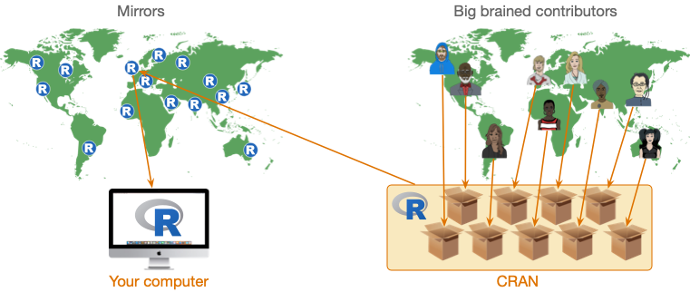

```{r setup, include=FALSE}
knitr::opts_chunk$set(echo = FALSE)
library(learnr)

hint_text <- function(text, text_color = "#E69F00"){
  hint <- paste("<font color='", text_color, "'>", text, "</font>", sep = "")
  return(hint)
}
```

# discovr: Key Concepts in R

## Overview

This tutorial is one of a series that accompanies [Discovering Statistics Using R and RStudio](https://www.discoveringstatistics.com/books/discovering-statistics-using-r/) [@fieldDiscoveringStatisticsUsing2020] by me, [Andy Field](https://en.wikipedia.org/wiki/Andy_Field_(academic)). These tutorials contain abridged sections from the book so there are some copyright considerations but I offer them under a [Creative Commons Attribution-NonCommercial-NoDerivatives 4.0 International License](http://creativecommons.org/licenses/by-nc-nd/4.0/), ^[Basically you can use this tutorial for teaching and non-profit activities but do not meddle with it or claim it as your own work.]

* Who is the tutorial aimed at?
    - Anyone teaching from or reading [Discovering Statistics Using R and RStudio](https://www.discoveringstatistics.com/books/discovering-statistics-using-r/)  may find them useful.
* What is covered?
    - This tutorial looks at some key concepts in using **R** and **RStudio**. It would be a useful tutorial to run at the start of a module, or alongside teaching based on Chapter 1 of [Discovering Statistics Using R and RStudio](https://www.discoveringstatistics.com/books/discovering-statistics-using-r/).
    - This tutorial *does not* teach the background theory: it is assumed you have either attended my lecture or read the relevant chapter in the aforementioned book (or someone else's)


## The relationship between R and RStudio

Having installed R, the best advice is to forget about it because once you launch RStudio it finds whatever version of R you have installed, negating the need for you to ever witness the horrors of the native R interface. By all means launch the native R app if you want to, but don’t expect me to treat the ensuing trauma.

## Packages and the CRAN

R exists as a base package with a reasonable amount of functionality. However, its beauty is that it can be expanded by downloading packages that add specific functionality to the base software. These packages, as well as the software itself, are stored in a central location known as the CRAN (Comprehensive R Archive Network). Once a package is stored in the CRAN, anyone with an internet connection can download it from the CRAN and install it to use within their own copy of R. The CRAN is central to using R: it is the place from where you download the software and any packages that you want to install. It would be a shame, therefore, if the CRAN were one day to explode or be eaten by cyber-lizards. The statistical world might collapse. Even assuming the cyber-lizards don’t rise up and overthrow the Internet, it is still a busy place. Therefore, rather than have a single CRAN location that everyone accesses, the CRAN is ‘mirrored’ at different places across the globe. ‘Mirrored’ means that there are identical versions of the CRAN scattered across the world. In general, access a mirror of the CRAN close to you. Figure 1.5 shows schematically what we have just learnt. At the centre of the diagram is the CRAN: a repository of the base R software and thousands of packages. People with big brains from all over the world write new packages and upload them into the CRAN for others to use. The CRAN itself is mirrored at different places across the globe (which means there are multiple copies of it). As a user of R, you download the software and install any packages that you want to use via your nearest CRAN.


 

```{r cran_quiz}
learnr::quiz(
  learnr::question("What is the CRAN?",
    learnr::answer("A repository from which you download **R** and install packages", correct = TRUE),
    learnr::answer("The part of **R** that processes commands"),
    learnr::answer("The place from where you download **RStudio**"),
    learnr::answer("The institutions where people develop packages for **R**"),
    correct = "Correct - well done!",
    incorrect = "Sorry, that's incorrect. Try again.",
    random_answer_order = TRUE,
    allow_retry = T
  ),
  learnr::question("What is a package?",
    learnr::answer("A bunch of code that when installed and loaded into **R** provides additional functionality", correct = TRUE),
    learnr::answer("An exact copy of the CRAN at a specific location on the planet", message = "This answer describes a 'mirror'."),
    learnr::answer("A repository from which you download **R** and install packages", message = "This answer describes the CRAN"),
    correct = "Correct - well done!",
    random_answer_order = TRUE,
    allow_retry = T
  )
)

```

To use a package you need to do two things:

1. Install the package (usually from CRAN): You need to install the package into R’s repository of packages on your computer. Every time you update or re-install R you need to re-install packages to use them. Also if you switch to a computer that doesn't already have the package installed, you'll need to install it. (Note that many universities and businesses use networks set up so that packages are installed to your account on the network, meaning that they are available to you on any machine connected to that network.)
2. Load the package: to use a particular package in a current session/document you need to load it from your computer's repository.

In RStudio you can install packages using the *Tools > Install Packages ...* menu, more commonly people use the `install.packages()` function, which takes the general form:

```
install.packages("package_name")
```

in which `package_name` is replaced by the name of the package that you’d like installed. For example, to install the package **tidyverse** you’d execute:

```
install.packages("tidyverse")
```
Note that the name of the package must be enclosed in straight (not curly) quotes.

Having installed a package, you can use it by loading it within the current session. If you close R or RStudio and re-open it you will need to reload the packages to use them again (but not re-install them). To load a package use the `library()` function , which takes the general form:
```
library(package_name)
```

in which `package_name` is replaced by the name of the package that you’d like to use. Note that the name of the package is not enclosed in quotes. For example, to load the **tidyverse** package execute:
```
library(tidyverse)
```
Having executed the command, the functions from the package become available to use.

```{r fuckage_quiz}
learnr::quiz(
  learnr::question("Which of these statements is TRUE?",
    learnr::answer("To use a package you must first load it in the current session using `library()`", correct = TRUE),
    learnr::answer("Packages must be installed every time you want to use them", message = "No, they need to be *loaded* every time you want to use them."),
    learnr::answer("Packages do not need to be re-installed when you switch computers", message = "No, packages are installed to a particular machine, so if you move to a different machine you will need to reinstall any packages you want to use."),
    learnr::answer("I need to install packages everytime I use a different computer on campus", message = "If you're at the University of Sussex, this stagment is FALSE. We use a network on which packages are installed to your account meaning that they are accessible from any machine on campus where you can login to your account."),
    correct = "Correct - well done!",
    random_answer_order = TRUE,
    allow_retry = T
  )
)

```


## Functions and objects

To communicate with R you type commands that tell it what to do. This process might seem strange to you because you are probably used to interacting with software by using your mouse to click on options and on-screen buttons. The problem with poiting and clicking is that the process isn't reproducible (unless you note down your every movement and click). Often when analysing data we want to reproduce what we have done, by typing commands, and saving those commands, we are able to reproduce the exact steps that we previously took when analysing the data.

The conversation that you have with R consists of you typing instructions, then doing something to execute those instructions. R will either dutifully carry out your instructions or complain that your instructions weren’t clear enough or asked it to do something that it couldn’t do. In short, you type commands, try to execute them and R either does it or throws an error. In the early days of learning R you will become very familiar with error messages, they are typically indecipherable so fear not if they seem like gibberish. 

A simple ‘conversation’ with R is made up of commands that follow the common structure shown in Figure 2.

```
object <- instructions
```

Which you can read as object is created from instructions. In the middle of each command is an arrow (`<-`) known as the **assignment operator**, so called because it assigns the stuff on the right of the command to the thing on the left (hence the arrow points right-to-left). The ‘thing’ on the left is an **object** that is created when the command is executed. An object could be a variable, a table of data, a collection of variables, a statistical model, output from a statistical model, a plot or anything that R can create. An object can be a single value (e.g., a median of a set of scores) or collections of information (e.g. the details of a statistical model). The ‘stuff’ on the right, which I’ve called instructions, are typically a set of operations or the results of applying a function.


For example, the first command in Figure 2:

```
metallica <- c("Lars","James","Jason", "Kirk")
```

creates an object called *metallica*, consisting of the four band members’ first names (pre 2001). The ‘instructions’ used to create the object *metallica* include the concatenate function, `c()`, which collects things together. A function is a bit of code that someone has written (and that you can write yourself) that typically has at least one argument and an output. **Functions** have a name followed by parenthesis, for example, `ggplot()`, `mean()` and `plot()`. **Arguments** are inputs to the function, which are pre-defined things that you specify within the parentheses. You can think of them like options that you set for the function. These ‘options’ can do things like specify the data on which the function operates, specify a model that you want to fit, or determining how the function behaves, for example, what it does when it encounters missing values in the data.  Most functions return an output, which could be a new data set, a value, information about a statistical model, a graph and so on.
 
In the first command in Figure 2 the arguments passed into the `c()` function are the band member’s names as four separate strings of text, and the output returned by the function is these strings collected together as a single entity. So, we input each band member’s name (in straight quotes and separated by commas), and by enclosing them in `c()` we bind them into a single entity, which is assigned (using <-) to an object that we have called ‘metallica’. Once this command is executed the object that we called ‘metallica’ is created and stored in memory so we can use it in future commands.

`r hint_text("Tip: Simultaneously press the **alt** + **−** keys to insert the assignment operator (<-)") `

Let's try this out. In the code box below type `metallica <- c("Lars","James","Jason", "Kirk")` and then click {width=10%}.

```{r met_data, exercise=TRUE}

```

```{r met_data-solution}
metallica <- c("Lars","James","Jason", "Kirk")
```

You should find that nothing happened, which will be disconcerting. That's because we told R to create the object *metallica* but not to show it to us. So, the object *metallica* has been created and stored in R’s memory and we can refer back to it, use it to do other things, change it, and view it. To view it we execute its name. So, let's try the exercise above but now ask to see the object *metallica* that we have created by executing:

```
metallica <- c("Lars","James","Jason", "Kirk")
metallica
```

```{r met_data_2, exercise=TRUE}

```

```{r met_data_2-solution}
metallica <- c("Lars","James","Jason", "Kirk")
metallica
```

Notice that the contents of the object *metallica* are displayed:

```{r}
metallica <- c("Lars","James","Jason", "Kirk")
metallica
```

We can do other things with our newly created object too, but we'll save that fun for another time.

```{r fun_quiz}
learnr::quiz(
  learnr::question("What is a function in R?",
    learnr::answer("An instruction that typically creates an output from at least one input", correct = TRUE),
    learnr::answer("A lady who loves to boogie to Parliament and Funkadelic", message = "No, that's a funk Sian."),
    learnr::answer("Something created by R", message = "No, that's an object."),
    learnr::answer("The weird arrow thing (`<-`)", message = "No, that's the assignment operator (`<-`)."),
    correct = "Correct - well done!",
    random_answer_order = TRUE,
    allow_retry = T
  ),
  learnr::question("What is an argument in R?",
    learnr::answer("An option that can be set within a function that controls what it does", correct = TRUE),
    learnr::answer("When you tell R to do something and it throws an error message", message = "No, that's your life for the next few years."),
    learnr::answer("An instruction that typically creates an output from at least one input", message = "No, that's a function"),
    learnr::answer("The weird arrow thing (`<-`)", message = "No, that's the assignment operator (`<-`)."),
    correct = "Correct - well done!",
    random_answer_order = TRUE,
    allow_retry = T
  )
)

```


### Optional: still confused about functions and arguments then read on

If the idea of functions and arguments seem confusing, try to think of a function as activating a dialog box and arguments as setting options within that dialog box. To see what I mean, let’s take a simple function `mean()`, which (no surprises here) calculates the mean (or average) of a set of scores. This function takes the general form:

```
mean(variable_name, na.rm = FALSE, trim = 0)
```

The function takes three arguments:

*	`variable_name` is the name of the variable for which you want to compute a mean. In other words, you name the object containing the scores of which you want the mean
* `na.rm = FALSE` is an argument that sets whether to remove missing values (TRUE) or not (FALSE)
*	`Trim = 0` is an argument that determines by how much you trim the scores before computing the mean. The default is 0 (include all scores) but you can set another value, such as 5 (trim 5% of scores from both extremes of the scores before computing the mean).

Don't worry too much about understanding what the arguments do for now, we'll come back to this function in a later tutorial. Figure 3 maps this process of setting arguments within functions to ticking check boxes in a dialog box. In this imaginary statistics software, we have selected a menu called ‘mean’ that opens the dialog box in the figure. This action is comparable to typing `mean()`: it activates the function, but if we were to click *OK* nothing would happen because we haven’t told the computer which variable to compute the mean on. Put another way, without setting any arguments, the function doesn’t do anything. Our imaginary dialog box has three ‘arguments’ or ‘things you can do’. The first is to drag a variable from a list of variables to a space, in doing so you select the variable to analyse. In the diagram I’ve chosen to analyse a variable called **songs_written.** Having selected the variable, two options are available: the first determines what we do with missing values, and the second determines how much we trim the scores. Each option or ‘argument’ has a tick box. Having specified a variable, we could click on *OK* and we’d get some output because the options/arguments have default values (Figure 3 left): the tick box for removing missing values is unchecked, which is the same as typing `na.rm = FALSE` into the function, and the checkbox for trimming the mean is unchecked which is the same as typing `trim = 0` into the function. In other words it would be like executing:

```
mean(songs_written)
```

We don’t need to write `na.rm = FALSE, trim = 0` explicitly within the function because these are the defaults values that the function will use. However, we could change these defaults by changing these arguments. Going back to our imaginary dialog box, the right side of Figure 3 shows that same variable is selected (**songs_written**), but this time the user has selected the option for removing missing values, which equates to typing `na.rm = TRUE` into the function. The user has also selected to trim means and type in a value of 5 to set the amount of trim, which is equivalent to typing `trim = 5` into the function. Now, when we click on *OK* the mean will be calculated having trimmed 5% of scores from either side and excluding missing values. This process is equivalent to executing:

```
mean(songs_written, na.rm = TRUE, trim = 5)
```


##	Packages and functions

When you load a package into your session you are loading in a collection of new functions that you can use in R.  You can refer to a function directly, to use a general example:

```
function()
```

or you can include a reference to the package from which the function came, in general:

```
package::function()
```

For example, you can use the `ggplot()` function from the **ggplot2** package within a command by executing either of these:
```
ggplot()
ggplot2::ggplot()
```

Although many people don’t include the package name, it is good style to include it when you refer to a function because you will occasionally stumble across two functions in two different packages that have the same name. For example, there is a `recode()` function in both the **Hmisc** and **car** packages. If you have both packages loaded and you try to use `recode()`, R won’t know which one to use or will guess incorrectly and throw an error. If you always specify the package as well as the function then R (and everyone else) will know which function you're using. For example, if we want to use the recode function in the car package we would use:
```
car::recode()
```

but to use the one in Hmisc we would use:
```
Hmisc::recode()
```

Another benefit of referencing the package name when you use a function is that it helps you to remember which packages you need to load to use functions that you commonly use. If you don’t reference the package it becomes difficult to remember which functions come from which packages. I will follow the ‘good style’ of specifying packages in code, but it’s not essential to do so and many people don’t.

```{r packfun_quiz}
  question("In the R command `dplyr::select()` ...",
    answer("`dplyr` is the name of a package and `select()` is a function within that package.", correct = TRUE),
    answer("`select()` is the name of a package and `dplyr` is a function within that package."),
    correct = "Correct - well done!",
    incorrect = "Sorry, that's incorrect. Try again.",
    random_answer_order = TRUE,
    allow_retry = T
  )
```


## Style

While we’re discussing good style, another tip is to adopt consistent principles about how to name the objects you create in R. I recommend following Hadley Wickham's [tidyverse style guide](http://style.tidyverse.org/). The style guide has a lot to take in, so a few key tips are:

* *Use lower case when naming things*: **R** is case sensitive so it will treat *myData* as a completely different object to *mydata*. One of the most common reasons why your code won't run will be because you forgot to capitalize an object that you capitalized when you created it. The simplest solution is to use lower case all of the time when naming objects.
* *Use underscores to separate words*: when creating objects it improves readability if you use underscores to distinguish words. For example, you might import the data relating to mathematical achievement as *maths_data*, which is easier to read than *mathsdata*. (I used to use camelBack, which results in *mathsData* which is easy to read but introduces a capital letter. I am trying to unlearn this habit!)
* *Avoid long names*: naming something *great_experiment_to_test_whether_listening_to_heavy_metal_improves_your_statistical_ability_data* is certainly descriptive but you're going to really regret it when you want to refer to that object again - think of the potential for typos which would mean **R** doesn't recognise the object, not to mention the time wasted in typing it out. Keep it short but meaningful.
* *consider consistent suffixes*: Although not in the style guide, and not essential, I find it useful to have a set of suffixes to indicate the types of objects that I have created. For example, you might use *dat* for data, *tib* for *tibbles* (they'll be explained in a later tutorial), *m* or *mod* for model, and *out* for output. For example, I might create these objects:
    - *maths_dat*: data frame containing my data on mathematical achievement
    - *maths_tib*: tibble containing my data on mathematical achievement
    - *maths_3x_m*: object specifying a model in which maths achievement was predicted from 3 variables (i.e., 3 *X*s).
    - *maths_3x_out*: object containing the summary output from the above model.
* *Comment*: You can annotate your code by prefixing text with **#**. This enables you to describe what you are doing. You have no idea how helpful this can be when you revisit code 6 months later and can't remember what you were trying to do. It's a really good habit to get into.
* *Spacing*: Your code will be much easier to read if you put spaces around operators such as '+', '==', '<-'. Put spaces after commas (but not before), but don't put them around :, :: and ::: (because these have special functions in **R**).

**Good**:

```{r style_good, echo = TRUE}
# object containing the first names of the members of metallica
metallica <- c("Lars","James","Jason", "Kirk")
```

This example shows good practice. Note how I have annotated what I am doing by using '#', put spaces around the assignment operator (`<-`) and after commas, used lower case and an underscore for my object name and kept the name short.

**Bad**:

```{r style_bad, echo = TRUE}
First_names_of_The.members_of.MetalliCa<-c("Lars","James","Jason", "Kirk")
```

This example shows bad practice. Note that I have not annotated what I am doing, there are no spaces around the assignment operator (<-) or after commas, I have some capital letters in my object name, have not been consistent with how I separate words in the object name, and have a name that is unnecessarily long.


```{r style_quiz}
  question("Which of these is **not** an example of good style?",
    answer("Use upper case letters for important words when naming objects.", correct = TRUE, message = "This is poor style because capital letters increase the chance of making errors when later referring to objects that you have created. Use lower case throughout when naming objects."),
    answer("Avoid long names when naming objects."),
    answer("Place spaces around operators such as `+`, `<-`, `-` etc.."),
    answer("Use comments to remind yourself of what your code is doing."),
    correct = "Correct - well done!",
    incorrect = "Sorry, that's incorrect. Try again.",
    random_answer_order = TRUE,
    allow_retry = T
  )
```


## Getting help

The good news is that there is an enormous amount of in-built help in R, the bad news is that most of it is written by statisticians and is incomprehensible to us mortals. If you want to try your luck, then you can access the help files for any package or function by executing:

```
help(thing_you_want_help_with)
```

or

```
?thing_you_want_help_with
```

(Note that there is no space after the ?) In both cases, thing_you_want_help_with is the name of a function or package that is currently making your brain hurt. For example, if you want to open the help files for the **tidyverse** package, you’d execute:

```
?tidyverse
```

Try that in the code box:

```{r tidyhelp, exercise=TRUE}

```

```{r tidyhelp-solution}
?tidyverse
```

You should find that you get an error message:

```
No documentation for ‘tidyverse’ in specified packages and libraries:
you could try ‘??tidyverse’
```
This error means that R can’t find the help files for the thing you asked for help with. This will usually be because you have forgotten to load the package containing the thing that you’re trying to get help with (in this case tidyverse) but it’s also worth checking that your command doesn’t have a typo in it. Assuming there’s no spelling error, the solution is to load the relevant package and ask for help again:

```
library(tidyverse)
?tidyverse 
```

Try this below:

```{r tidyhelp2, exercise=TRUE}

```

```{r tidyhelp2-solution}
library(tidyverse)
?tidyverse
```


## Other resources

### Statistics

* The tutorials typically follow examples described in detail in @fieldDiscoveringStatisticsUsing2020, so that book is an obvious place to go for further reading.
* If any of the statistical content doesn't make sense, you could try my more introductory book *An adventure in statistics* [@fieldAdventureStatisticsReality2016].
* There are free lectures and screencasts on my [YouTube channel](https://www.youtube.com/user/ProfAndyField/)
* There are free statistical resources on my website [www.discoveringstatistics.com](http://www.discoveringstatistics.com)

### R

* [R for data science](http://r4ds.had.co.nz/index.html) by @wickhamDataScience2017 is an open-access book by the creator of the tidyverse (Hadley Wickham). It covers the *tidyverse* and data management.
* [ModernDive](http://moderndive.com/index.html) is an open-access textbook on **R** and **RStudio**
* [RStudio cheat sheets](https://www.rstudio.com/resources/cheatsheets/)
* [RStudio list of online resources](https://www.rstudio.com/online-learning/)
* [SwirlStats](http://swirlstats.com/students.html) is a package for *R* that launches a bunch of interactive tutorials.

## References


