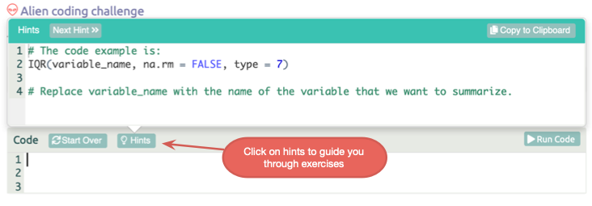
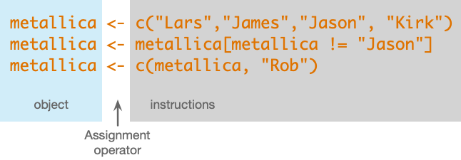
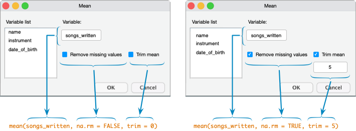
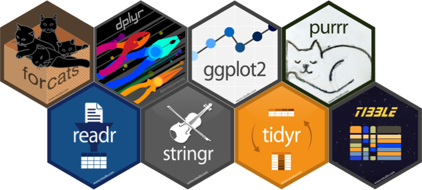

<html lang="en">

```{r setup, include=FALSE}
knitr::opts_chunk$set(
	echo = TRUE,
	message = FALSE,
	warning = FALSE
)

library(learnr) #necessary to render tutorial correctly

library(forcats)
library(ggplot2)
library(htmltools)
library(kableExtra)
library(lubridate)
library(magrittr)
library(tibble)


source("./www/discovr_helpers.R")
```

# discovr: Key Concepts in `r rproj()`

## Overview

<div class="infobox">
  
  
  **Usage:** This tutorial accompanies [Discovering Statistics Using R and RStudio](https://www.discovr.rocks/) [@field_discovering_2021] by [Andy Field](https://en.wikipedia.org/wiki/Andy_Field_(academic)). It contains material from the book so there are some copyright considerations but I offer them under a [Creative Commons Attribution-NonCommercial-NoDerivatives 4.0 International License](http://creativecommons.org/licenses/by-nc-nd/4.0/). Tl;dr: you can use this tutorial for teaching and non-profit activities but please don't meddle with it or claim it as your own work.
  
</div>

### `r cat_space(fill = "h3", height = 2)` Welcome to the `discovr` space pirate academy

Hi, welcome to **discovr** space pirate academy. Well done on embarking on this brave mission to planet `r rproj()`s, which is a bit like Mars, but a less red and more hostile environment. That's right, more hostile than a planet without water. Fear not though, the fact you are here means that you *can* master `r rproj()`, and before you know it you'll be as brilliant as our pirate leader Mae Jemstone (she's the badass with the gun). I am the space cat-det, and I will pop up to offer you tips along your journey.

On your way you will face many challenges, but follow Mae's system to keep yourself on track:

* `r bmu(height = 2)` This icon flags materials for *teleporters*. That's what we like to call the new cat-dets, you know, the ones who have just teleported into the academy. This material is the core knowledge that everyone arriving at space academy must learn and practice. For accessibility, these sections will also be labelled with [(1)]{.alt}.
* `r user_visor(height = 2)` Once you have been at space pirate academy for a while, you get your own funky visor. It has various modes. My favourite is the one that allows you to see everything as a large plate of tuna. More important, sections marked for cat-dets with visors goes beyond the core material but is still important and should be studied by all cat-dets. However, try not to be disheartened if you find it difficult. For accessibility, these sections will also be labelled with [(2)]{.alt}.
* `r user_astronaut(height = 2)` Those almost as brilliant as Mae (because no-one is quite as brilliant as her) get their own space suits so that they can go on space pirate adventures. They get to shout *RRRRRR* really loudly too. Actually, everyone here gets to should *RRRRRR* really loudly. Try it now. Go on. It feels good. Anyway, this material is the most advanced and you can consider it optional unless you are a postgraduate cat-det. For accessibility, these sections will also be labelled with [(3)]{.alt}.

It's not just me that's here to help though, you will meet other characters along the way:

* `r alien(height = 2)` aliens love dropping down onto the planet and probing humanoids. Unfortunately you'll find them probing you quite a lot with little coding challenges. Helps is at hand though. 
* `r robot(height = 2)` **bend-R** is our coding robot. She will help you to try out bits of `r rproj()` by writing the code for you before you encounter each coding challenge.
* `r bug(height = 2)` we also have our friendly alien bugs that will, erm, help you to avoid bugs in your code by highlighting common mistakes that even Mae Jemstone sometimes makes (but don't tell her I said that or my tuna supply will end). 

Also, use hints and solutions to guide you through the exercises (Figure 1).

<figure>

<figcaption>Figure 1: In a code exercise click the hints button to guide you through the exercise.</figcaption>
</figure> 
 

By for now and good luck - you'll be amazing!

### Workflow

* Before attempting this tutorial it's a good idea to work through [this tutorial on how to install, set up and work within `r rproj()` and `r rstudio()`](http://milton-the-cat.rocks/learnr/r/r_getting_started/).

* The tutorials are self-contained (you practice code in code boxes). However, so you get practice at working in `r rstudio()` I strongly recommend that you create an `r rproj()` markdown file within an `r rstudio()` project and practice everything you do in the tutorial in the `r rproj()` markdown file, make notes on things that confused you or that you want to remember, and save it. Within this markdown file you will need to load the relevant packages and data. 


## `r bmu()` Functions and objects [(1)]{.alt}

To communicate with `r rproj()` you type commands that tell it what to do. This process might seem strange to you if you are used to interacting with software by using your mouse to click on options and on-screen buttons. The problem with pointing and clicking is that the process isn't easily reproducible. Often when analysing data we want to reproduce what we have done. By typing commands and saving those commands as a script, we are able to reproduce our analysis exactly.

The conversation that you have with `r rproj()` consists of you typing instructions, then doing something to execute those instructions. `r rproj()` will either dutifully carry out your instructions or complain that your instructions weren’t clear enough. In short, you type commands, try to execute them and `r rproj()` either does what you ask or throws an error. In the early days of learning `r rproj()` you will become very familiar with error messages, they are typically indecipherable so fear not if they seem like gibberish. 

A simple ‘conversation’ with `r rproj()` is made up of commands that follow the common structure shown in Figure 1.

```{r, eval=FALSE}
object <- instructions
```

Which you can read as object is created from instructions. In the middle of each command is an arrow (`<-`) known as the **assignment operator**, so called because it assigns the stuff on the right of the command to the thing on the left (hence the arrow points right-to-left). The ‘thing’ on the left is an **object** that is created when the command is executed. An object can be a single value (e.g., a median of a set of scores) or collections of information (e.g. the details of a statistical model). The ‘stuff’ on the right, which I’ve called instructions, are typically a set of operations or the results of applying a function.


<figure>

<figcaption>Figure 2: Examples of R commands.</figcaption>
</figure> 

For example, the first command in Figure 2:

```{r, eval=FALSE}
metallica <- c("Lars","James","Jason", "Kirk")
```

creates an object called [metallica]{.alt}, consisting of the first names of the members (pre 2001) of the band [Metallica](https://www.metallica.com/). The ‘instructions’ used to create the object [metallica]{.alt} include the concatenate function, `c()`, which collects things together. A function is a bit of code that someone has written (and that you can write yourself) that typically has at least one argument and an output. **Functions** have a name followed by parenthesis, for example, `ggplot()`, `mean()` and `plot()`. **Arguments** are inputs to the function, which are pre-defined things that you specify within the parentheses. You can think of arguments like options that you set for the function.  Most functions return an output, which could be a new data set, a value, information about a statistical model, a graph and so on.
 
In the first command in Figure 1 the arguments passed into the `c()` function are the band member’s names as four separate strings of text, and the output returned by the function is these strings collected together as a single entity. So, we input each band member’s name (in straight quotes and separated by commas), and by enclosing them in `c()` we bind them into a single entity, which is assigned (using `<-`) to an object that we have called ‘metallica’. Once this command is executed the object that we called ‘metallica’ is created and stored in memory so we can use it in future commands.

<div class="tip">
  `r cat_space()` **Tip: Keyboard shortcut**
  
  Simultaneously press the {height=1em} + {height=1em} keys to insert the assignment operator `<-`.
</div>

#### `r alien()` Alien coding challenge

Let's try this out. In the code box below type

```{r, eval = FALSE}
metallica <- c("Lars","James","Jason", "Kirk")
```

and then click {height=1em}.

```{r met_data, exercise=TRUE}

```

```{r met_data-solution}
metallica <- c("Lars","James","Jason", "Kirk")
```

You should find that nothing happened, which will be disconcerting. That's because we told `r rproj()` to create the object [metallica]{.alt} but not to show it to us. So, the object [metallica]{.alt} has been created and stored in `r rproj()`’s memory and we can refer back to it, use it to do other things, change it, and view it. To view it we execute its name. So, let's ask to see the object [metallica]{.alt} that we have created by executing its name:

```{r met_data_2-setup}
metallica <- c("Lars","James","Jason", "Kirk")
```

```{r met_data_2, exercise=TRUE}

```

```{r met_data_2-solution}
metallica
```

Notice that the contents of the object [metallica]{.alt} are displayed:

```{r, echo = FALSE}
metallica <- c("Lars","James","Jason", "Kirk")
metallica
```

We can do other things with our newly created object too, but we'll save that fun for another time.

```{r fun_quiz, echo=FALSE}
learnr::quiz(
  learnr::question("What is a function in R?",
    learnr::answer("An instruction that typically creates an output from at least one input", correct = TRUE),
    learnr::answer("A lady who loves to boogie to Parliament and Funkadelic", message = "No, that's a funk Sian."),
    learnr::answer("Something created by R", message = "No, that's an object."),
    learnr::answer("The weird arrow thing (`<-`)", message = "No, that's the assignment operator (`<-`)."),
    correct = "Correct - well done!",
    random_answer_order = TRUE,
    allow_retry = T
  ),
  learnr::question("What is an argument in R?",
    learnr::answer("An option that can be set within a function that controls what it does", correct = TRUE),
    learnr::answer("When you tell R to do something and it throws an error message", message = "No, that's your life for the next few years."),
    learnr::answer("An instruction that typically creates an output from at least one input", message = "No, that's a function"),
    learnr::answer("The weird arrow thing (`<-`)", message = "No, that's the assignment operator (`<-`)."),
    correct = "Correct - well done!",
    random_answer_order = TRUE,
    allow_retry = T
  )
)

```


### `r bmu()` Still confused about functions and arguments? [(1)]{.alt}

This section is optional. It's for people struggling to understand what a function is. Try to think of a function as activating a dialog box and arguments as setting options within that dialog box. Let’s take a simple function `mean()`, which (no surprises here) calculates the mean (or average) of a set of scores. This function takes the general form:

```{r, eval=FALSE}
mean(variable_name, na.rm = FALSE, trim = 0)
```

The function takes three arguments:

*	[variable_name]{.alt} is the name of the variable for which you want to compute a mean.
* [na.rm = FALSE]{.alt} is an argument that sets whether to remove missing values (TRUE) or not (FALSE)
*	[Trim = 0]{.alt} is an argument that determines by how much you trim the scores before computing the mean. The default is 0 (include all scores) but you can set another value, such as 5 (trim 5% of scores from both extremes of the scores before computing the mean).

Don't worry too much about understanding what the arguments do for now, we'll come back to this function in a later tutorial. Figure 3 maps this process of setting arguments within functions to ticking check boxes in a dialog box. In this imaginary statistics software, we have selected a menu called ‘mean’ that opens the dialog box in the figure. This action is comparable to typing `mean()`: it activates the function, but if we were to click *OK* nothing would happen because we haven’t told the computer which variable to compute the mean on. Imagine I've dragged the variable **songs_written** to the space labelled *Variable:*. Having selected the variable, two options are available: the first determines what we do with missing values, and the second determines how much we trim the scores. Each option or ‘argument’ has a tick box. Having specified a variable, we could click on *OK* and we’d get some output because the options/arguments have default values (Figure 2 left): the tick box for removing missing values is unchecked, which is the same as typing [na.rm = FALSE]{.alt} into the function, and the checkbox for trimming the mean is unchecked which is the same as typing [trim = 0]{.alt} into the function. In other words it would be like executing:

```{r, eval=FALSE}
mean(songs_written)
```

We don’t need to write [na.rm = FALSE, trim = 0]{.alt} explicitly within the function because these are the defaults values that the function will use. However, we could change these defaults by changing these arguments. Going back to our imaginary dialog box, the right side of Figure 2 shows that same variable is selected (**songs_written**), but this time the user has selected the option for removing missing values, which equates to typing [na.rm = TRUE]{.alt} into the function. The user has also selected to trim means and type in a value of 5 to set the amount of trim, which is equivalent to typing [trim = 5]{.alt} into the function. Now, when we click on *OK* the mean will be calculated having trimmed 5% of scores from either side and excluding missing values. This process is equivalent to executing:

```{r, eval=FALSE}
mean(songs_written, na.rm = TRUE, trim = 5)
```

<figure>

<figcaption>Figure 3: An imaginary dialog box to help you map the idea of setting arguments to selecting options in dialog boxes.</figcaption>
</figure> 


## `r bmu()`	Packages and functions [(1)]{.alt}

When you load a package (see [this tutorial](http://milton-the-cat.rocks/learnr/r/r_getting_started/#section-installing-and-loading-packages)) into your session you are loading in a collection of new functions that you can use in`r rproj()`.  You can refer to a function directly, to use a general example:

```{r, eval=FALSE}
function()
```

or you can include a reference to the package (a.k.a. *namespace*) from which the function came, in general:

```{r, eval=FALSE}
package::function()
```

For example, you can use the `ggplot()` function from the **ggplot2** package within a command by executing either of these:

```{r, eval=FALSE}
ggplot()
ggplot2::ggplot()
```

Although many people don’t include the package name, it is good style to include it when you refer to a function because you will occasionally stumble across two functions in two different packages that have the same name. For example, there is a `recode()` function in both the `Hmisc` and `car` packages. If you have both packages loaded and you try to use `recode()`, `r rproj()` won’t know which one to use or will guess incorrectly and throw an error. If you always specify the package as well as the function then `r rproj()` (and everyone else) will know which function you're using. For example, if we want to use the recode function in the car package we would use:

```{r, eval=FALSE}
car::recode()
```

but to use the one in Hmisc we would use:

```{r, eval=FALSE}
Hmisc::recode()
```

<div class="tip">
  `r cat_space()` **Tip: Using package names**
  
  If you use the format `package::function()` when you refer to functions you don't need to use `library()` to first load the package (although some people consider it good practice to do so anyway).

</div>


```{r packfun_quiz, echo=FALSE}
  question("In the R command `dplyr::select()` ...",
    answer("`dplyr` is the name of a package and `select()` is a function within that package.", correct = TRUE),
    answer("`select()` is the name of a package and `dplyr` is a function within that package."),
    correct = "Correct - well done!",
    incorrect = "Sorry, that's incorrect. Try again.",
    random_answer_order = TRUE,
    allow_retry = T
  )
```


## `r bmu()` Style [(1)]{.alt}

While we’re discussing good style, it is important to adopt consistent principles about how to name the objects you create in `r rproj()`. I recommend following Hadley Wickham's [tidyverse style guide](http://style.tidyverse.org/). The style guide has a lot to take in, so a few key tips are:

* **Use lower case when naming things**: `r rproj()` is case sensitive so it will treat [myData]{.alt} as a completely different object to [mydata]{.alt}. One of the most common reasons why your code won't run will be because you forgot to capitalize an object that you capitalized when you created it. The simplest solution is to use lower case all of the time when naming objects.
* **Use underscores to separate words**: when creating objects it improves readability if you use underscores to distinguish words. For example, you might import the data relating to mathematical achievement as [maths_data]{.alt}, which is easier to read than [mathsdata]{.alt}.
* **Avoid long names**: naming something [great_experiment_to_test_whether_listening_to_heavy_metal_improves_your_statistical_ability_data]{.alt} is certainly descriptive but you're going to really regret it when you want to refer to that object again - think of the potential for typos which would mean `r rproj()` doesn't recognise the object, not to mention the time wasted in typing it out. Keep it short but meaningful.
* **Consider consistent suffixes**: Although not in the style guide, I find it useful to have a set of suffixes to indicate the types of objects that I have created. For example, you might use [dat]{.alt} for data, [tib]{.alt} for [tibbles](#tibbles) (they'll be explained later), [m]{.alt} or [mod]{.alt} for model, and [ou]{.alt} for output. For example, I might create these objects:
    - [maths_dat]{.alt}: data frame containing my data on mathematical achievement
    - [maths_tib]{.alt}: tibble containing my data on mathematical achievement
    - [maths_3x_m]{.alt}: object specifying a model in which maths achievement was predicted from 3 variables (i.e., 3 *X*s).
    - [maths_3x_out]{.alt}: object containing the summary output from the above model.
* **Comment**: You can annotate your code by prefixing text with `#`. This prefix enables you to describe what you are doing. You have no idea how helpful this can be when you revisit code 6 months later and can't remember what you were trying to do. It's a great habit to get into.
* **Spacing**: Your code will be much easier to read if you put spaces around operators such as `+`, `==`, `<-`. Put spaces after commas (but not before), but don't put them around `:`, `::` and `:::` (because these have special functions in `r rproj()`).

#### Good style

```{r style_good, echo = TRUE}
# object containing the first names of the members of metallica
metallica <- c("Lars","James","Jason", "Kirk")
```

This example shows good practice. Note how I have annotated what I am doing by using `#`, put spaces around the assignment operator (`<-`) and after commas, used lower case and an underscore for my object name and kept the name short.

#### Poor style

```{r style_bad, echo = TRUE}
First_names_of_The.members_of.MetalliCa<-c("Lars","James","Jason", "Kirk")
```

This example shows poor style. Note that I have not annotated what I am doing, there are no spaces around the assignment operator (`<-`) or after commas, I have some capital letters in my object name, have not been consistent with how I separate words in the object name, and have a name that is unnecessarily long.


```{r style_quiz, echo=FALSE}
  question("Which of these is **not** an example of good style?",
    answer("Use upper case letters for important words when naming objects.", correct = TRUE, message = "This is poor style because capital letters increase the chance of making errors when later referring to objects that you have created. Use lower case throughout when naming objects."),
    answer("Avoid long names when naming objects."),
    answer("Place spaces around operators such as `+`, `<-`, `-` etc.."),
    answer("Use comments to remind yourself of what your code is doing."),
    correct = "Correct - well done!",
    incorrect = "Sorry, that's incorrect. Try again.",
    random_answer_order = TRUE,
    allow_retry = T
  )
```


##	`r bmu() ` Tidyverse and the pipe operator (`%>%`) [(1)]{.alt}

The tidyverse is a set of packages built upon a common philosophy of data science developed by Hadley Wickham [@wickhamAdvanced2014; @wickhamDataScience2017; @wickhamGgplot2ElegantGraphics2016]. Some of them are shown in Figure 4.

<figure>

<figcaption>Figure 4: some of the tidyverse packages.</figcaption>
</figure> 


In `r rproj()` there are always multiple ways to achieve the same goal, in general I will try to follow the tidyverse approach. You [install and load](http://milton-the-cat.rocks/learnr/r/r_getting_started/#section-installing-and-loading-packages) the tidyverse packages as you would any package in `r rproj()`. Having done that, all of the tidyverse packages will be at your disposal (i.e. you don’t need to load them individually).

The tidyverse approach to `r rproj()` makes use of something called the pipe operator (`%>%`) to link functions together. To use the pipe operator the `magrttr` package  needs to be installed and loaded but this happens automatically if you install and load `tidyverse`.

As the name suggests, the pipe operator involves thinking of any command as a ‘pipe’ through which instructions flow from left to right. To take a really simple example, in the [introduction tutorial](http://milton-the-cat.rocks/learnr/r/r_getting_started/) to `r rproj()` and `r rstudio()`, we used the `here::here()` function to create a path to a file that we wanted to open with the function `readr::read_csv()`. The command we used was:

```{r, eval=FALSE}
my_data <- readr::read_csv(here::here("data/metallica.csv"))
```

We can pipe this command to make it clearer:

```{r, eval=FALSE}
my_data <- here::here("data/metallica.csv") %>% readr::read_csv(.)
```

Instead of embedding the `here::here()` function within `readr::read_csv()`, we put it first and feed or ‘pipe’ its output into `readr::read_csv(.)` using `%>%`.The code is easier to read, it makes clear that we’re using  `here::here()` to generate a path to the file that we want to open, and that we’re feeding that file path into `readr::read_csv(.)`. Note that the `readr::read_csv(.)` function has a period ([.]]{.alt}) within it. This period represents whatever is coming through the pipe from the left. Often, you don't need the period but sometimes you do so it's worth being aware of it.

```{r pipe_quiz, echo=FALSE}
  question("What's going on in the command `here::here(\"data/metallica.csv\") %>% readr::read_csv(.)`?",
    answer("`here::here(\"data/metallica.csv\")` generates the filepath to the data file called 'metallica.csv' and this filepath is fed into `readr::read_csv(.)`, which reads in that file.", correct = TRUE, message = "Well done."),
    answer("`here::here(\"data/metallica.csv\")` opens the data file called 'metallica.csv' and `readr::read_csv(.)` converts it to a CSV file`", message = "the `here()` function generates a file path, it doesn;t open the file."),
    answer("The `%>%` reads the data file back into the `here()` function", message = "The flow of commands is in the opposite direction"),
    random_answer_order = TRUE,
    allow_retry = T
  )
```


## `r bmu()` Data types [(1)]{.alt}

Often when analysing data you will [input your data with an external software](http://milton-the-cat.rocks/learnr/r/r_getting_started/) such as Microsoft Excel, Google sheets, or Numbers and then import it into `r rproj()`. However, you can enter data directly. It's also useful to know about the different ways in which `r rproj()` stores data. `r rproj()` can store information using several different data types:

* [int]{.alt}: variables containing integers (i.e., whole numbers).
*	[dbl]{.alt}: variables containing doubles (i.e., real numbers).
* [chr]{.alt}: variables containing characters, or strings (i.e. text).
*	[lgl]{.alt}: variables that contain the logical values of TRUE or FALSE.
*	[fctr]{.alt}: variables that represent categories with fixed numeric values (so called factors, for example a variable where you have coded biological sex as 0 = male, 1 = female)
*	[date]{.alt}: variables that contain dates.

We’re going to extend our earlier Metallica example to explore these different data types. Table 1 shows the data that we’re going to enter, which contains a character variable (name), two date variables (birth_date and death_date), a factor (the instrument they play), a logical (whether it is true or false that they are a current member of the band), two integers (how many songs they have written for Metallica and their **net_worth**).

```{r, results = 'asis', echo=FALSE}
tibble::tribble(
  ~name, ~birth_date, ~death_date, ~instrument, ~current_member, ~songs_written, ~net_worth,
  "Lars Ulrich", "1963-12-26", NA, "Drums", TRUE, 111, 300000000,
  "James Hetfield", "1963-08-03", NA, "Guitar", TRUE, 112, 300000000,
  "Kirk Hammett", "1962-11-18", NA, "Guitar", TRUE, 56, 200000000,
  "Rob Trujillo", "1964-10-23", NA, "Bass",  TRUE, 16, 20000000,
  "Jason Newsted", "1963-03-04", NA, "Bass", FALSE, 3, 40000000,
  "Cliff Burton", "1962-02-10", "1986-09-27", "Bass", FALSE, 11, 1000000,
  "Dave Mustaine", "1961-09-13", NA, "Guitar", FALSE, 6, 20000000
  ) %>% 
  knitr::kable(caption = "Some data about the rock band Metallica", format = "html") %>% 
  kableExtra::kable_styling(bootstrap_options = "striped")
```


### `r bmu()` Character variables [(1)]{.alt}

We created a character variable (also called a string variable) when we entered the names of the members of Metallica. To recap, we used the `c()` function to ‘collect’ together values. Each value (known as a character string) is separated by commas and placed in straight quotes so that `r rproj()` knows that it is text:

#### `r robot()` Code example

```{r, eval=FALSE}
metallica <- c("Lars","James","Jason", "Kirk")
```

#### `r alien()` Alien coding challenge

Adapt the above code to enter the names in Table 1 and store these in an object called [name]]{.alt} by executing:


```{r met_name, exercise = TRUE, exercise.lines = 4}

```

```{r met_name-hint-1}
# You were asked to call the object name, so start with:
#

name <- c()
```

```{r met_name-hint-2}
# To complete the right hand side adapt the sample code to include surnames, and add the pre-2001 members:

c("Lars", "James", "Jason", "Kirk")
```

```{r met_name-hint-3}
# Put this together, this gives you:

name <- c("Lars Ulrich", "James Hetfield", "Kirk Hammett", "Rob Trujillo", "Jason Newsted", "Cliff Burton", "Dave Mustaine")

# Don't forget that to see the object execute its name
```

```{r met_name-solution}
name <- c("Lars Ulrich", "James Hetfield", "Kirk Hammett", "Rob Trujillo", "Jason Newsted", "Cliff Burton", "Dave Mustaine")
name
```

###	`r bmu()` Double or integer variables [(1)]{.alt}

We have two numeric variables in Table 1: the number of Metallica songs written by each member, and their net worth. A variable that contain numbers is called a numeric variable. By default, `r rproj()` stores numbers as double precision floating point numbers (double), which basically means it includes decimal places, but you can force `r rproj()` to store them as whole numbers (integer). Other things being equal storing numbers as doubles makes sense. To create a numeric variable, type the numeric values into the `c()` function in the order you want them. For example, to create the variables **songs_written** and **net_worth** we would execute:

#### `r robot()` Code example

```{r, eval=FALSE}
songs_written <-  c(111, 112, 56, 16, 3, 11, 6)
net_worth <- c(300000000, 300000000, 200000000, 20000000, 40000000, 1000000, 20000000)
```

#### `r alien()` Alien coding challenge

Try entering these variables in the code box.

```{r met_numeric, exercise=TRUE}

```

```{r met_numeric-solution}
songs_written <-  c(111, 112, 56, 16, 3, 11, 6)
net_worth <- c(300000000, 300000000, 200000000, 20000000, 40000000, 1000000, 20000000)

# To view these variables:
songs_written
net_worth
```

### `r user_visor()` Date variables [(2)]{.alt}

The second column of Table 1 contains dates. To create a date variable we do much the same as for a character variable except that we also need to tell `r rproj()` that the values are dates. The conversion from text to dates is important if you want to do computations on the dates. If your dates are stored as characters (rather than dates) computations won’t work. The most versatile way to handle dates is the `lubridate` package (part of the tidyverse), which contains a suite of functions specifically designed for working with times and dates.

One function for converting character strings to dates is `ymd()`. The letters ‘ymd’ stand for ‘year’, ‘month’ and ‘day’ which expects the dates to be entered with the year first, then the month, then the day.

#### `r robot()` Code example

To create a variable using `lubridate::ymd()` you'd execute something like:

```{r, eval=FALSE}
variable <- c("date 1", "date 2", "date 3", ... "final date") %>%
  lubridate::ymd()
```

Notice that I have used the pipe operator (`%>%`) to connect two commands, the first inputs the dates (`c("date 1", "date 2", "date 3", ... "final date")`) and this information is fed into `lubridate::ymd()` to convert it to date format. Using `ymd()` each date would need to be in the format "year-month-day". For example, to enter Lars Ulrich's birthday we'd replace "date 1" with "1963-12-26".

#### `r alien()` Alien coding challenge

Create the variable called **birth_date** containing the dates of birth in Table 1.

```{r met_dob, exercise=TRUE}

```

```{r met_dob-hint-1}
# The variable is called birth_date, so start with:

birth_date <- c()
```

```{r met_dob-hint-2}
# To complete the right hand side adapt the sample code:

c("date 1", "date 2", "date 3", ...)

# Now replace date 1 with the first date, date 2 with the second and so on until all the dates are entered.
```

```{r met_dob-hint-3}
# Together, this gives you

birth_date <- c("1963-12-26", "1963-08-03", "1962-11-18", "1964-10-23", "1963-03-04", "1962-02-10", "1961-09-13")

# Now pipe it into lubridate::ymd
```

```{r met_name-hint-4}
birth_date <- c("1963-12-26", "1963-08-03", "1962-11-18", "1964-10-23", "1963-03-04", "1962-02-10", "1961-09-13") %>%
  lubridate::ymd()
```

```{r met_name-hint-5}
# To see the object execute its name

birth_date <- c("1963-12-26", "1963-08-03", "1962-11-18", "1964-10-23", "1963-03-04", "1962-02-10", "1961-09-13") %>%
  lubridate::ymd()

birth_date
```

###	`r bmu()` Missing values [(1)]{.alt}

Although as researchers we strive to collect complete sets of data, it is often the case that we have missing data. We denote missing values with [NA]{.alt} (in capital letters), which stands for ‘not available’. Many functions in `r rproj()` have arguments to specify how you handle missing values so if you have missing values remember to set a value for these arguments.
The dates of the member’s deaths are included in Table 1. At the time of writing all but one of the members are alive (Cliff Burton was tragically killed in a tour bus accident), so we (thankfully) have a lot of missing values. We enter these values as [NA]{.alt} (not in quotes).

#### `r alien()` Alien coding challenge

Use what you learnt in the previous section to create a variable called **death_date** containing the corresponding dates in Table 1. Whenever the data is missing, use NA (no quotes) instead of a date.

```{r met_dod, exercise=TRUE}
              
```

```{r met_dod-hint-1}
# To get you started
death_date <- c(NA, ...)
                
# Now enter the rest of the NAs and dates. 
```

```{r met_dod-hint-2}
# The completed data is:
death_date <- c(NA, NA, NA, NA, NA, "1986-09-27", NA)

# Now use the pipe and ymd() function like you did before
```

```{r met_dod-hint-3}
# This creates the variable death_date
death_date <- c(NA, NA, NA, NA, NA, "1986-09-27", NA) %>%
  lubridate::ymd()

# If we want to view the object remember we need to execute its name
```

```{r met_dod-hint-4}
# Solution
death_date <- c(NA, NA, NA, NA, NA, "1986-09-27", NA) %>%
  lubridate::ymd()
death_date
```

### `r bmu()` logical variables [(1)]{.alt}

Table 1 contains a logical variable, which is one that contains values of true and false. In this case true and false relate to whether the member is currently in the band. Logical variables are created much the same as integers and doubles except that you enter TRUE and FALSE (in upper case) instead of numbers into the `c()` function.

#### `r robot()` Code example

In general you create a logical variable as:

```{r, eval=FALSE}
variable_name <- c(TRUE, TRUE, FALSE, TRUE ...)
```

#### `r alien()` Alien coding challenge

Create the variable **current_member** containing the corresponding dates in Table 1.

```{r met_current, exercise=TRUE}
              
```

```{r met_current-hint-1}
# To get you started
current_member <- c(TRUE, ...)
                
# Now enter the rest of the TRUEs and FALSEs. 
```

```{r met_current-hint-2}
# The completed data is:
current_member <- c(TRUE, TRUE, TRUE, TRUE, FALSE, FALSE, FALSE)

# If we want to view the object remember we need to execute its name
```

```{r met_current-hint-3}
# Solution
current_member <- c(TRUE, TRUE, TRUE, TRUE, FALSE, FALSE, FALSE)
current_member
```

### `r bmu()` Factor variables [(1)]{.alt}

A factor variable is one that uses numbers to represent different categories or groups of data. It is a numeric variable, but the numbers represent names (i.e., it is a nominal variable). These groups of data could be levels of a treatment variable in an experiment, different groups of people, different geographic locations, different organisations, etc. In Table 1 we have a factor variable that codes the instrument played by each member. We could enter this variable as a character variable and hope that `r rproj()` treats the variable sensibly when we try to enter it into a statistical model. Often it will, but it is usually a good idea to explicitly define these variables as factors and assign the numeric codes that you want to each category.

When it comes to what instrument is played the codes can be somewhat arbitrary; for the sake of convention people typically use 0, 1, 2, 3, etc. We will use 0 = Guitar, 1 = Bass, 2 = drums.
There are several ways to create factors in `r rproj()`. The first is to enter numeric values and then convert these values to a factor using the `factor()` function, the second is to enter the text and convert it to a factor using the `forcats::as_factor()` function (which is part of tidyverse). We’ll use each in turn.

We want to enter the values Drums, Guitar, Guitar, Bass, Bass, Bass, Guitar. Using the coding I suggest above that means entering the numbers 2, 0, 0, 1, 1, 1, 0. To turn these values into a factor, we use the `factor()` function, which takes the general form:

```{r, eval=FALSE}
factor(variable, levels = c(x, y, … z), labels = c("label_1", "label_2", … "label_3"))
```

This function looks a bit scary, but it’s not too bad really. Let’s break it down:

*	[factor(variable_name)]{.alt}: this is all you really need to create the factor—in our case [factor(instrument)]{.alt} would do the trick.
*	[levels = c(x, y, … z)]{.alt}: we need to tell `r rproj()` which values we want to use to denote different groups and we do this with the levels = argument. Often we use the `c()` function to list the values we have used. For example, with the Metallica data where we have used values of 0, 1 and 2, we could use [levels = c(0, 1, 2)]{.alt}. However, if you have used a regular series such as 1, 2, 3, 4 we can abbreviate this as [1:4]{.alt}, the colon means ‘all the values between’. So, [1:4]{.alt} is the same as [c(1, 2, 3, 4)]{.alt}. For the Metallica data we could, therefore, use [levels = 0:2]{.alt} or [levels = c(0, 1, 2)]{.alt}.
*	[labels = c("label_1", "label_2", … "label_3")]{.alt}: The final step is to assign labels to these levels. Again, we use `c()` to collect the labels that we wish to assign. You must list these labels in the same order as your numeric levels, and you must provide a label for each level. In our case, 0 corresponds to Guitar, 1 to Bass, and 2 to drums  so the argument would be [labels = c("Guitar", "Bass", "Drums")]{.alt}.

#### `r robot()` Code example

Putting all of this together we could execute:

```{r met_inst, exercise=TRUE}
instrument <- c(2, 0, 0, 1, 1, 1, 0)
instrument <- factor(instrument, levels = 0:2, labels = c("Guitar", "Bass", "Drums"))
instrument
```

The first line enters the numeric values, the second line converts the variable to a factor and applies labels to each numeric value, and the last line shows us the variable. Note that the variable is made up of the category labels and not the numeric values.

#### `r alien()` Alien coding challenge

Rather than using two commands, we could create **instrument** in a single command by linking the data entry and the conversion to a factor with a pipe. Try to do that below. 

<div class="tip">
  `r cat_space()` **Tip: Using a dot for data in pipes**
  
  When a function requires data (i.e., a variable or tibble), but that data is being fed forward through a pipe we denote it with a period (.). The '.' means 'whatever is coming through the pipe'. So, for example, if we piped the data into the `factor()` function we would write:
  
  `factor(., ...)`
  
  instead of:
  
  `factor(instrument, ...)`
  
  Notice that we replace the explicit reference to the variable **instrument** with a dot.
</div>

```{r met_inst_pipe, exercise = TRUE, exercise.lines = 4}

```

```{r met_inst_pipe-hint-1}
# First enter the data
instrument <- c(2, 0, ...)

# Complete the data entry and add a pipe               
```

```{r met_inst_pipe-hint-2}
instrument <- c(2, 0, 0, 1, 1, 1, 0) %>%

# Now add the factor() function remembering to denote the data
#coming through the pipe as a '.'
```

```{r met_inst_pipe-hint-3}
# Solution:
instrument <- c(2, 0, 0, 1, 1, 1, 0) %>%
  factor(., levels = 0:2, labels = c("Guitar", "Bass", "Drums"))
# To view this variable:
instrument
```

The tidyverse method is slightly different. First, we create a character variable and then use the `forcats::as_factor()` function to convert it to a factor.

#### `r robot()` Code example

This generic code shows how to create factors the tidyverse way

```{r, eval=FALSE}
instrument <- c("Instrument 1", "Instrument 2", ... "Final instrument") %>%
  forcats::as_factor()
```

#### `r alien()` Alien coding challenge

Try creating the variable *instrument* the tidyverse way 

```{r met_insttidy, exercise=TRUE}

```

```{r met_insttidy-solution}
instrument <- c("Drums", "Guitar", "Guitar", "Bass", "Bass", "Bass", "Guitar") %>%
  forcats::as_factor()
# To view this variable:
instrument
```

Notice that with this method we don’t specify the levels or labels of the factor, they are set automatically with levels ordered by the order they appear in the data. In this case entered drums first, so this is the first level. Guitar was entered second and so is the second level and so on. Were told this in the output by [Levels: Drums Guitar Bass]{.alt}.

#### `r robot()` Code example

If we don’t want instruments ordered in this way we can use the `forcats::fct_relevel()` function to change the order. For example, to order the levels as we did in the earlier example (guitar, bass, drums) we would execute:

```{r, met_relevel-setup}
instrument <- c("Drums", "Guitar", "Guitar", "Bass", "Bass", "Bass", "Guitar") %>%
  forcats::as_factor()
```

```{r met_relevel, exercise=TRUE}
instrument <- instrument %>%
  forcats::fct_relevel("Guitar", "Bass", "Drums")
instrument
```

Notice that the order of levels has changed from [Levels: Drums Guitar Bass]{.alt} in the previous output to [Levels: Guitar Bass Drums]{.alt} in the current output.


#### `r alien()` Alien coding challenge

We could have incorporated the `fct_relevel()` function in the original command by using the pipe. See if you can do this.

```{r met_relevel2, exercise=TRUE}

```

```{r met_relevel2-hint-1}
# Set up the variable and enter the data:
instrument <- c("Drums", "Guitar", "Guitar", "Bass", "Bass", "Bass", "Guitar")

# Now pipe this into as_factor() like we did before
```

```{r met_relevel2-hint-2}
# The variable is created with default factor levels:

instrument <- c("Drums", "Guitar", "Guitar", "Bass", "Bass", "Bass", "Guitar") %>%
  forcats::as_factor()

# Now pipe the results into the fct_relevel() function
```

```{r met_relevel2-hint-3}
# Solution
instrument <- c("Drums", "Guitar", "Guitar", "Bass", "Bass", "Bass", "Guitar") %>%
  forcats::as_factor() %>%
  forcats::fct_relevel("Guitar", "Bass", "Drums")
# To view this variable:
instrument
```

#### `r alien()` Alien coding challenge

With any factor variable you can see the factor levels and their order by using the `levels()` function, in which you enter the name of the factor. So, to see the levels of our variable instrument variable we would execute: `levels(instrument)`, try this:

```{r met_level-setup}
instrument <- c("Drums", "Guitar", "Guitar", "Bass", "Bass", "Bass", "Guitar") %>%
  forcats::as_factor() %>%
  forcats::fct_relevel("Guitar", "Bass", "Drums")
```

```{r met_level, exercise=TRUE}

```

```{r met_level-solution}
levels(instrument)
```


##	`r bmu()` Tibbles [(1)]{.alt}

We have looked at how to create variables, but what if we want to combine these variables into a tabulated data set. The tidyverse way to do this is to create something called a **tibble**. 

#### `r robot()` Code example

To create a tibble we use the `tibble::tibble()` function, and input into it the names of the variables you have created.

```{r, eval=FALSE}
my_tib <- tibble::tibble(variable_1, variable_2, variable_3, ... variable_n)
```

This command creates an object called [my_tib]{.alt} (I tend to use [_tib]{.alt} to denote a tibble) that contains all of the variables listed in `tibble()`. They will be arranged in columns. You view a tibbles by executing its name. The contents of the tibble will be printed within the `r rproj()` markdown document below the code chunk. By default the first 10 rows will be displayed and as many columns as the width of the pane allows. The display is interactive so you can navigate across columns or down beyond the first 10 rows.

#### `r alien()` Alien coding challenge

Create a tibble of the Metallica data called [metalli_tib]{.alt}, which is made up of all of the variables from Table 1 that we have created in this tutorial (don't forget to execute its name to view it):

```{r met_tibble-setup}
current_member <- c(TRUE, TRUE, TRUE, TRUE, FALSE, FALSE, FALSE)
instrument <- c("Drums", "Guitar", "Guitar", "Bass", "Bass", "Bass", "Guitar") %>% forcats::as_factor() %>% forcats::fct_relevel("Guitar", "Bass", "Drums")
name <- c("Lars Ulrich", "James Hetfield", "Kirk Hammett", "Rob Trujillo", "Jason Newsted", "Cliff Burton", "Dave Mustaine")
songs_written <-  c(111, 112, 56, 16, 3, 11, 6)
net_worth <- c(300000000, 300000000, 200000000, 20000000, 40000000, 1000000, 20000000)
birth_date <- c("1963-12-26", "1963-08-03", "1962-11-18", "1964-10-23", "1963-03-04", "1962-02-10", "1961-09-13") %>%
  lubridate::ymd()
death_date <- c(NA, NA, NA, NA, NA, "1986-09-27", NA) %>% 
  lubridate::ymd()
```

```{r met_tibble, exercise=TRUE}

```

```{r met_tibble-hint-1}
# To get you started ...
metalli_tib <- tibble::tibble(name, ...)
                              
# Add the other variables (birth_date, death_date, instrument, current_member, songs_written, net_worth)
```

```{r met_tibble-hint-2}
#Solution
metalli_tib <- tibble::tibble(name, birth_date, death_date, instrument, current_member, songs_written, net_worth)
# To view the tibble
metalli_tib
```

From viewing the tibble, you can see that it collects together the objects called **name**, **birth_date**, **death_date**, **instrument**, **current_member**, **songs_written**, and **net_worth** into columns. When we created these variables we consistently entered the data in the order of Lars, James, Kirk, Rob, Jason, Cliff and Dave, therefore, each row represents the data for each member. For example, we can see that Lars plays drums and has a song writing credit on 111 songs. The whole thing looks like Table 1.
 
###	`r bmu()` Creating new variables within a tibble [(1)]{.alt}

We can create new variables within a tibble using the `mutate()` function from the `dplyr` (which is part of `tidyverse` package).

#### `r robot()` Code example

The `dplyr::mutate()` function  takes the general form:

```{r, eval=FALSE}
dplyr::mutate(tibble_name,
              variable_name_1 = data_for_variable,
              variable_name_2 = data_for_variable
              ...
              )
```
In other words, we pass into the function the name of the tibble to which we want to add variables, followed by one or more commands that name the variables that we want to create and include the data for those variables or instructions to create that data (more on this later). We can also pipe a tibble into the function rather than specifying the tibble within the function itself:
```{r, eval=FALSE}
tibble_name %>%
  dplyr::mutate(
    variable_name_1 = data_for_variable,
    variable_name_2 = data_for_variable
    ...
    )
```

<div class="warning">
  `r bug()` **De-bug: common mistakes when using mutate()** 
  
  1. In `mutate()`, variables are created using an equal sign (`=`), not the assignment operator (`<-`). Remember to use an equals sign within mutate.
  2. Every line within the `mutate()` function ends with a comma except for the last. When `r rproj()` sees a comma it expects to see another command, so the lack of comma after the last command tells `r rproj()` that it is the last command. If you get an error message when using `mutate()` check you have remembered commas at the end of each line except the last.
</div>

#### `r robot()` Code example

Imagine that having created [metalli_tib]{.alt} we decide that we’d like to include information about how many of their 10 studio albums of original songs each member played on. The data are 10 (Lars), 10 (James), 10 (Kirk), 2 (Rob), 4 (Jason), 3 (Cliff), 0 (Dave). We can create a variable called albums like this

```{r met_setup}
metalli_tib <- discovr::metallica %>% 
  dplyr::select(-c(albums, worth_per_song))
```

```{r met_mutate, exercise=TRUE, exercise.setup = "met_setup"}
metalli_tib <- metalli_tib %>% 
  dplyr::mutate(
    	albums = c(10, 10, 10, 2, 4, 3, 0)
  )
metalli_tib
```

```{r met_mutate-solution}
metalli_tib <- metalli_tib %>% 
  dplyr::mutate(
    	albums = c(10, 10, 10, 2, 4, 3, 0)
  )
metalli_tib
```

The first line creates the object [metalli_tib]{.alt} from a version of itself in which the original tibble is passed through the pipe into `dplyr::mutate()`, where the new variable is created. You’ll see that the new version of [metalli_tib]{.alt} has an extra column called **albums** that contains the values we entered.

###	`r bmu()` Creating new variables from existing variables [(1)]{.alt}

We can also compute variables from existing variables. Let’s imagine we now wanted to work out how much money per song contributed each band member made. We know how many songs each member contributed to (**songs_written**) and their net worth (**net_worth**) so their ‘worth per song’ will be their net worth divided by the number of songs written. We can create a variable that takes the values for net_worth and divides them by the corresponding value of **songs_written** using one of the arithmetic operators built into `r rproj()`. Amongst other things, we can add, subtract, multiply and divide using [+]{.alt}, [-]{.alt}, [\*]{.alt} and [/]{.alt} respectively. So, let’s use [/]{.alt} to create a new variable that we’ll call **worth_per_song** that is **net_worth** divided by **songs_written**. The command within `mutate()` to create this variable will be:

```{r, eval = FALSE}
worth_per_song = net_worth/songs_written
```

#### `r alien()` Alien coding challenge

By adapting the code in the previous section and using the code above that computes the worth per song to, add the variable **worth_per_song** to the [metalli_tib]{.alt} tibble:

```{r met_setup_albums}
metalli_tib <- discovr::metallica %>% 
  dplyr::select(-worth_per_song)
```

```{r met_mutate2, exercise=TRUE, exercise.lines = 5, exercise.setup = "met_setup_albums"}

```

```{r met_mutate2-hint-1}
# Start with the code form the previous section, but remove the stuff
# from within the mutate function:

metalli_tib <- metalli_tib %>% 
  dplyr::mutate(
    
  )
```

```{r met_mutate2-hint-2}
# Now place the code that computes worth_per_song within mutate()
metalli_tib <- metalli_tib %>% 
  dplyr::mutate(
    	worth_per_song = net_worth/songs_written
  )
```

```{r met_mutate2-hint-3}
# Nice to view the tibble to see that the variable has, in fact, been added
metalli_tib <- metalli_tib %>% 
  dplyr::mutate(
    	worth_per_song = net_worth/songs_written
  )
metalli_tib
```

Note that within the `mutate()` function we create the new variable (which we name on the left hand side of the equals sign) by taking the existing variable **net_worth** from the tibble and divided it by another existing variable in the tibble, **songs_written**. If you look at the resulting tibble you’ll see that James and Lars earn about \$2.7 million per song they write, but the real winner here is Jason who contributed to only 3 songs which puts his earnings per song at around \$13 million. Nice work if you can get it.

### `r bmu()` Selecting variables [(1)]{.alt}

Sometimes we might want to subset tibbles to focus on specific variables or cases of data. First we’ll look at selecting variables. The most extreme case would to look at or retain only at a single variable. To select variables from within a tibble we use the `select()` function from the `dplyr` package (which is loaded as part of tidyverse). The function takes this general form:

```{r, eval=FALSE}
dplyr::select(tibble_name, list of variables)
```

Within the function you insert the name of the tibble and a list of the variable or variables that you want to retain. For example, to select the variables **name** and **instrument** we could execute:

```{r, eval=FALSE}
dplyr::select(metalli_tib, name, instrument)
```

#### `r robot()` Code example

Better still, we could use a pipe (`%>%`) that takes the tibble and feeds it into the function:

```{r met_select_ce1, exercise=TRUE, exercise.setup = "met_setup_albums"}
metalli_tib %>% 
  dplyr::select(name, instrument)
```

You can also use `dplyr::select()` to drop variables from a tibble by placing a minus sign in front of the variable. For example, to show every variable *except* **name** we’d execute:

```{r, eval=FALSE}
metalli_tib %>% 
  dplyr::select(-name)
```

This command displays the tibble but *without* the column containing the band member’s names.

#### `r robot()` Code example

To remove multiple variables, place them within `c()`. Remembering to place the minus sign outside of the function so that it applies to everything within it:

```{r met_select_ce2, exercise=TRUE, exercise.setup = "met_setup_albums"}
metalli_tib %>% 
  dplyr::select(-c(name, instrument))
```

This command will display the tibble but *without* the columns containing the band member’s names and instruments.

Sometimes we’d like to store the subset of variables within a new object for future use. To do this you would need to assign the commands that subset the tibble to an object, using the assignment operator (`<-`). For example, to save a version of [metalli_tib]{.alt} but without the band member’s names into an object called [metalli_anon_tib]{.alt}, we’d execute:

```{r met_select_ce3, exercise=TRUE, exercise.setup = "met_setup_albums"}
metalli_anon_tib <- metalli_tib %>% 
  dplyr::select(-name)

metalli_anon_tib
```

The object [metalli_anon_tib]{.alt}` is the same as [metalli_tib]{.alt} except that it doesn’t contain the variable **name**.

<div class="tip">
  `r cat_space()` **Tip: Using `x:y` to specify 'all the consecutive variables between'**

When selecting lots of variables it can be useful to use `x:y` to indicate 'all of the consecutive variables between x and y, including x and y'. For example the variables in [metalli_tib]{.alt} are now: **name**, **birth_date**, **death_date**, **instrument**, **current_member**, **songs_written**, **net_worth**, **albums**, and **worth_per_song**. If we wanted to select the variables **name**, **songs_written**, **net_worth**, **albums** and **worth_per_song** we could use:

`dplyr::select(name, songs_written:worth_per_song)`

The [songs_written:worth_per_song]{.alt} is shorthand for selecting **songs_written**, **worth_per_song** and all variables in between them in the tibble.
</div>

#### `r alien()` Alien coding challenge

Select the variables **name**, **instrument**, and **net_worth**.

```{r met_setup_all}
current_member <- c(TRUE, TRUE, TRUE, TRUE, FALSE, FALSE, FALSE)
instrument <- c("Drums", "Guitar", "Guitar", "Bass", "Bass", "Bass", "Guitar") %>% forcats::as_factor() %>% forcats::fct_relevel("Guitar", "Bass", "Drums")
name <- c("Lars Ulrich", "James Hetfield", "Kirk Hammett", "Rob Trujillo", "Jason Newsted", "Cliff Burton", "Dave Mustaine")
songs_written <-  c(111, 112, 56, 16, 3, 11, 6)
net_worth <- c(300000000, 300000000, 200000000, 20000000, 40000000, 1000000, 20000000)
birth_date <- c("1963-12-26", "1963-08-03", "1962-11-18", "1964-10-23", "1963-03-04", "1962-02-10", "1961-09-13") %>%
  lubridate::ymd()
death_date <- c(NA, NA, NA, NA, NA, "1986-09-27", NA) %>% 
  lubridate::ymd()
metalli_tib <- tibble::tibble(name, birth_date, death_date, instrument, current_member, songs_written, net_worth) %>% 
  dplyr::mutate(
    albums = c(10, 10, 10, 2, 4, 3, 0),
    worth_per_song = net_worth/songs_written
  )
```


```{r met_select_ex1, exercise=TRUE, exercise.setup = "met_setup_all"}

```

```{r met_select_ex1-solution}
# Selecting the variables **name**, **instrument**, and **net_worth**
metalli_tib %>% 
  dplyr::select(name, instrument, net_worth)
```

#### `r alien()` Alien coding challenge

Exclude the variables **death_date** and **net_worth**.

```{r met_select_ex2, exercise=TRUE, exercise.setup = "met_setup_all"}

```

```{r met_select_ex2-solution}
# Excluding the variables **death_date**, and **net_worth**
metalli_tib %>% 
  dplyr::select(-c(death_date, net_worth))
```

#### `r alien()` Alien coding challenge

Include the variables **name**, **birth_date**, **death_date**, **instrument**, **current_member** and **worth_per_song**.

```{r met_select_ex3, exercise=TRUE, exercise.setup = "met_setup_all"}

```

```{r met_select_ex3-solution}
# Include the variables **name**, **birth_date**, **death_date**, **instrument**, **current_member** and **worth_per_song**
metalli_tib %>% 
  dplyr::select(name:current_member, worth_per_song)

# OR (this removes the three variables that we don't want to see)
metalli_tib %>% 
  dplyr::select(-c(songs_written:albums))
```
<div class="tip">
  `r cat_space()` **Tip: Don't forget about $**
  
  Sometimes, when you want to select only one variable from a tibble it is quicker to use the `$` symbol. For example, to select the variable **instrument** from the [metalli_tib]{.alt} tibble, we could execute:

```{r, eval = FALSE}
metalli_tib$instrument
```

which you can read as 'the variable **instrument** within the tibble [metalli_tib]{.alt}'. This will return the raw values not wrapped in a tibble (it can be handy sometimes to have the raw values).

</div>

#### `r alien()` Alien coding challenge

Inspect the variable **worth_per_song** from [metalli_tib]{.alt}.


```{r met_select_base, exercise=TRUE, exercise.setup = "met_setup_all"}

```

```{r met_select_base-solution}
# Selecting the variable instrument from the metalli_tib tibble
metalli_tib$worth_per_song
```

###	`r bmu()` Selecting cases (filtering tibbles) [(1)]{.alt}

Sometimes we want to select cases rather than (or as well as) variables. For example, maybe we want to work with only the current members of Metallica. To do this, we’d need to select rows of the tibble on the basis of whether the variable **current_member** was true. To filter rows of a tibble you use the `filter()` function from `dplyr`. Like the `select()` function in the previous section, you feed in the name of the tibble and some instructions about how to filter:

```{r, eval=FALSE}
dplyr::filter(tibble_name, statement_about_how_to_filter)
```

Or using a pipe:

```{r, eval=FALSE}
tibble_name %>%
dplyr::filter(statement_about_how_to_filter)
```

#### `r robot()` Code example

For example, to select the rows that represent current band members, we need to filter the rows where the variable **current_member** is was equal to [TRUE]{.alt}. We could do this by executing:

```{r met_filter_ce1, exercise=TRUE, exercise.setup = "met_setup_all"}
metalli_tib %>% 
  dplyr::filter(current_member == TRUE)
```


Note that we use `==` to mean 'equal to'. We can also use `!=` to mean 'not equal to', `<` to mean 'less than' and `>` to mean 'more than'. 

#### `r robot()` Code example

For example, if we wanted to return the rows of members who had written more than 50 songs, we could execute:

```{r met_filter_ce2, exercise=TRUE, exercise.setup = "met_setup_all"}
metalli_tib %>% 
  dplyr::filter(songs_written > 50)
```

This command returns the data for Lars, James and Kirk, who are the only members to have contributed to the writing of more than 50 songs.

We can also combine conditions to select rows of a tibble. First, we can ask for rows that match both of two conditions by using the `&` operator. For example, if we want the members of Metallica who play drums *and* have written more than 50 songs, we could combine the condition [songs_written > 50]{.alt} with the condition of [instrument == "Drums"]]{.alt}. By using `&` we require both conditions to be true. The value of **songs_written** must be greater than 50 AND the value of instrument must be equal to ‘Drums’.

#### `r robot()` Code example

To filter [metalli_tib]{.alt} according to the above conditions, we can insert those condition into the `filter()` function:

```{r met_filter_ce3, exercise=TRUE, exercise.setup = "met_setup_all"}
metalli_tib %>% 
  dplyr::filter(songs_written > 50 & instrument == "Drums")
```


We can also use the OR operator (`|`) to select cases based on whether one of many conditions is met. For example, let’s say we want to isolate the rhythm section, we need to include cases that either play drums or bass. We can achieve this with a statement such as:
[instrument == "Drums" | instrument == "Bass"]{.alt}. The `|` denotes 'or', so this command would read as ‘the value of the variable **instrument** is equal to the word ‘Drums’ OR the value of the variable instrument is equal to the phrase ‘Bass’. Again, we’d insert this statement into the `filter()` function.

#### `r robot()` Code example

To filter [metalli_tib]{.alt} according to the above conditions, we can insert those condition into the `filter()` function:

```{r met_filter_ce4, exercise=TRUE, exercise.setup = "met_setup_all"}
metalli_tib %>% 
  dplyr::filter(instrument == "Drums" | instrument == "Bass")
```

Notice that the result displays only the bassists and drummers.

###	`r bmu()` Combining selecting cases with selecting variables [(1)]{.alt}

We can combine what we have learnt in the previous sections to select variables *and* cases in a single command. For example, let’s say we want to create a new object called [metalli_worth]{.alt} that contains only the names and net worth of the current members who have played on every album (i.e., Lars, James and Kirk). This involves two operations:

1. Filter the cases to exclude everyone except Lars, James and Kirk.
2. We want to exclude all of the variables except for net worth.

Let’s first select the cases we want. We can do this in several ways, but one is to set a condition that the variable **current_member** is TRUE (this will give us Lars, James, Kirk and Rob) and a second condition that instrument is not equal (`!=`) to ‘Bass’, which will exclude Rob. This condition would be written as [current_member == TRUE & instrument != "Bass"]{.alt}. We could place this command into the `filter()` function:

#### `r robot()` Code example

To filter [metalli_tib]{.alt} according to the above conditions, we can insert those condition into the `filter()` function:

```{r met_filter_ce5, exercise=TRUE, exercise.setup = "met_setup_all"}
metalli_worth <- metalli_tib %>% 
  dplyr::filter(current_member == TRUE & instrument != "Bass")
metalli_worth
```

This command creates an object called [metalli_worth]{.alt} that contains the rows of [metalli_tib]{.alt} that meet the conditions that the variable **current_member** is equal to TRUE and the variable **instrument** is NOT equal to (`!=`) the phrase "Bass".

#### `r robot()` Code example

Having created this object, we could re-create it from itself but passed through the `select()` function to select only the variables called **name** and **net_worth**:

```{r met_filter_ce6-setup}
metalli_worth <- discovr::metallica %>% 
  dplyr::filter(current_member == TRUE & instrument != "Bass")
```


```{r met_filter_ce6, exercise=TRUE}
metalli_worth <- metalli_worth %>% 
  dplyr::select(name, net_worth)
metalli_worth
```

Notice that by executing this command we overwrite the original object [metalli_worth]{.alt} with a new version that contains only the variables **name** and **net_worth**.

#### `r alien()` Alien coding challenge

The method just described is inefficient (but helpful for showing you the explicit steps that we want to take). A more efficient way to do achieve the same goal is to do both operations as part of the same pipe. See if you can combine the previous two code examples to create [metalli_worth]{.alt} using a single pipe.

```{r met_filter_select, exercise=TRUE, exercise.setup = "met_setup_all"}

```

```{r met_filter_select-hint-1}
# Start by creating metalli_worth from metalli_tib
metalli_worth <- metalli_tib
# Now use the pipe to apply the filter command from the code example
```

```{r met_filter_select-hint-2}
# So far:
metalli_worth <- metalli_tib %>% 
  dplyr::filter(current_member == TRUE & instrument != "Bass") 

# Next use another pipe to apply the select function from the code example
```

```{r met_filter_select-hint-3}
# Solution to create metalli_worth:
metalli_worth <- metalli_tib %>% 
  dplyr::filter(current_member == TRUE & instrument != "Bass") %>% 
  dplyr::select(name, net_worth)
# To view this tibble:
metalli_worth
```

We now begin to see the beauty of the pipe: it enables us to put together a sequence of operations in very clear, readable, code. The above code creates an object called [metalli_worth]{.alt} by taking the tibble called [metalli_tib]{.alt} and passing it into the `filter()` function, where cases are selected if they are current members and don’t play bass, this filtered version of [metalli_tib]{.alt} is then passed again through the pipe to the `select()` command in which the variables name and net_worth are selected. The result is a tibble containing Lars’, James’, and Kirk’s names and net worth.

<div class="infobox">
  
  
  **A message from Mae Jemstone:**
  
  Well done on completing this mission! You have worked very hard and gained a good foundation in how to use `r rproj()`. You know how to enter data, how to store it as a tibble, and how to filter cases and select variables within a tibble. Fantastic work!
  
</div>

## Resources {data-progressive=FALSE}

### Statistics

* The tutorials typically follow examples described in detail in @field_discovering_2021. That book covers the theoretical side of the statistical models, and has more depth on conducting and interpreting the models in these tutorials.
* If any of the statistical content doesn't make sense, you could try my more introductory book *An adventure in statistics* [@fieldAdventureStatisticsReality2016].
* There are free lectures and screencasts on my [YouTube channel](https://www.youtube.com/user/ProfAndyField/).
* There are free statistical resources on my websites [www.discoveringstatistics.com](http://www.discoveringstatistics.com) and [milton-the-cat.rocks](http://milton-the-cat.rocks).

### `r rproj("h3")`

* [R for data science](http://r4ds.had.co.nz/index.html) by @wickhamDataScience2017 is an open-access book by the creator of the tidyverse (Hadley Wickham). It covers the *tidyverse* and data management.
* [ModernDive](http://moderndive.com/index.html) is an open-access textbook on `r rproj("h3")` and `r rstudio()`.
* [`r rstudio()` cheat sheets](https://www.rstudio.com/resources/cheatsheets/).
* [`r rstudio()` list of online resources](https://www.rstudio.com/online-learning/).

### Acknowledgement

I'm extremely grateful to [Allison Horst](https://www.allisonhorst.com/) for her very informative blog post on [styling learnr tutorials with CSS](https://education.rstudio.com/blog/2020/05/learnr-for-remote/) and also for sending me a CSS template file and allowing me to adapt it. Without Allison, these tutorials would look a lot worse (but she can't be blamed for my colour scheme).

## References


