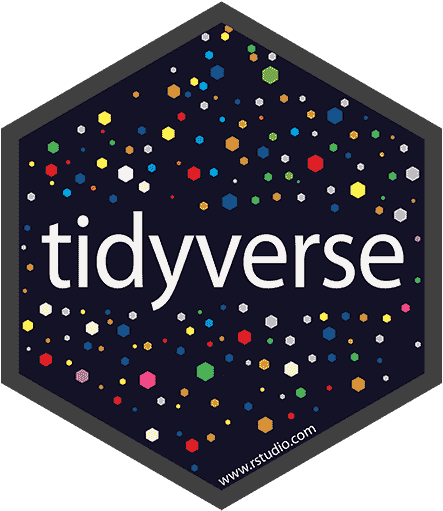
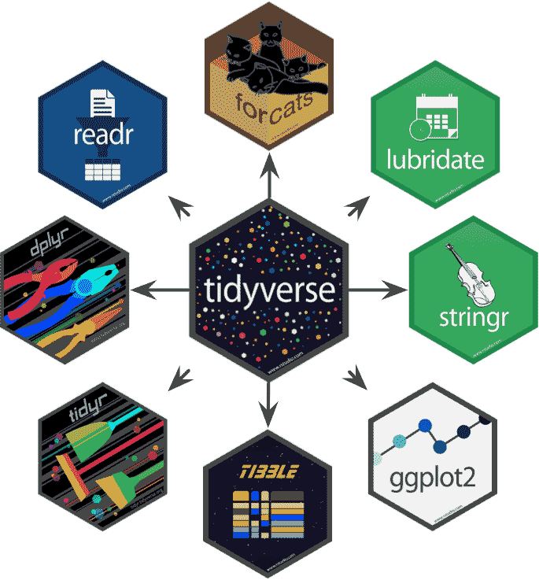
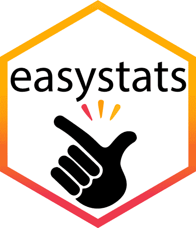
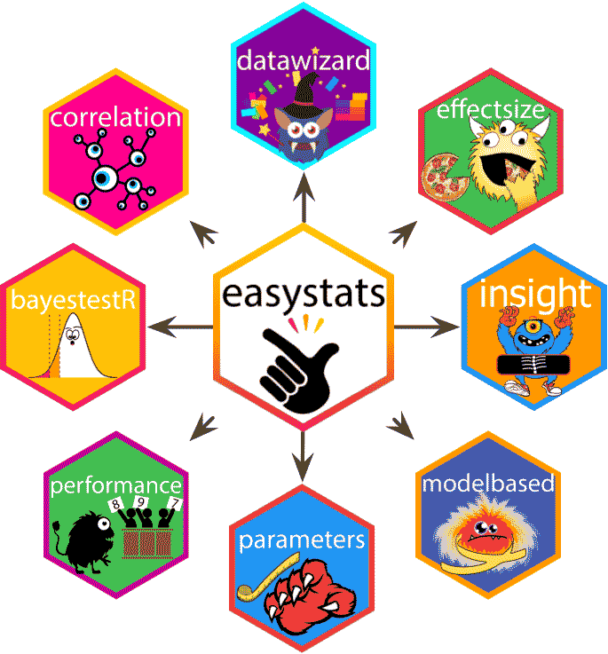
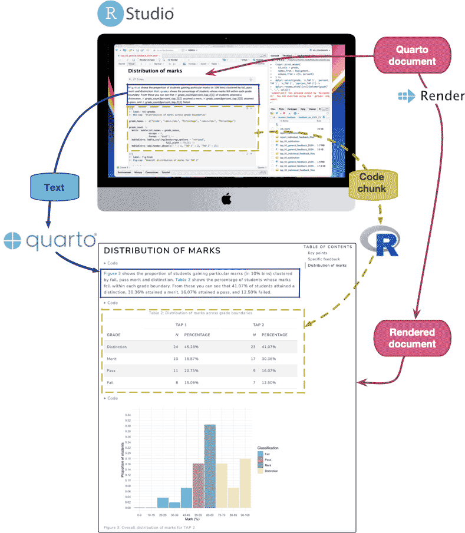

<html lang="en">

```{r setup, include=FALSE}
knitr::opts_chunk$set(
	echo = TRUE,
	message = FALSE,
	warning = FALSE
)

#necessary to render tutorial correctly
library(learnr) 
library(htmltools)

source("./www/discovr_helpers.R")
```


```{r, eval = F, echo = F}
# Create bib file for R packages

tidylist <- c('tidyverse', 'dplyr', 'forcats', 'ggplot2', 'lubridate', 'purrr', 'readr', 'stringr', 'tibble', 'tidyr')
easylist <- c("easystats", "correlation", "datawizard", "effectsize", "insight", "modelbased", "performance", "parameters")
otherlist <- c('base')

here::here("inst/tutorials/discovr_01/packages.bib") |>
  knitr::write_bib(c(easylist, tidylist, otherlist), file = _)
```

# discovr R, RStudio and Quarto


```{r, child = "./docs/intro.Rmd"}

```


##	`r bmu()` What is R? [(A)]{.lbl}

`r rproj()` [@R-base] is a free software environment for statistical analysis and graphics that was released in 2000. The application itself (so called 'base R') has a reasonable amount of functionality, but R's real power is that it can be extended by installing and loading [packages]{.kt}. So, what are packages and how do we get them?

###	`r bmu()`	Packages and the CRAN [(A)]{.lbl}

A package is a bundle of code that implements something in `r rproj()`. For example, the [ggplot2]{.pkg} package [@R-ggplot2] bestows upon you the gift of being able to create just about any data visualisation you can think of. Packages, as well as `r rproj()` itself, are typically stored in a central location known as the [CRAN]{.kt} (Comprehensive R Archive Network).  Once a package is stored in the CRAN, anyone with an internet connection can download and install it to use within their own copy of `r rproj()`. To use a package, you need to do two things:

1.	**Install the package**: you need to install the package into `r rproj()`'s repository of packages on your computer. When you update or re-install `r rproj()` you need to re-install packages. 
2.	**Load the package**: to use a particular package in a current session/document you need to load it from the repository.

We'll look at how to do these two things in due course.

###	`r bmu()`	The tidyverse [(A)]{.lbl}



The [tidyverse]{.kt} [@R-tidyverse] is a suite of packages that we use extensively in the book and these tutorials. The packages within tidyverse are built upon a common philosophy of data science developed by Hadley Wickham [@wickham_r_2023]. In `r rproj()` there are always multiple ways to achieve the same goal, and in these tutorials we typically use the tidyverse way. The main [tidyverse]{.pkg} packages are (Figure 1):

- [dplyr]{.pkg} [@R-dplyr]
- [forcats]{.pkg} [@R-forcats]
- [ggplot2]{.pkg} [@R-ggplot2; @wickham_ggplot2_2016]
- [lubridate]{.pkg} [@R-lubridate]
- [purrr]{.pkg} [@R-purrr]
- [readr]{.pkg} [@R-readr]
- [stringr]{.pkg} [@R-stringr]
- [tibble]{.pkg} [@R-tibble]
- [tidyr]{.pkg} [@R-tidyr]

<figure>

<figcaption>Figure 1: the [tidyverse]{.pkg} packages.</figcaption>
</figure> 

###	`r bmu()`	The easystats package [(A)]{.lbl}



Another suite of packages that we'll use in the book and these tutorials is [easystats]{.kt} [@R-easystats]. Like [tidyverse]{.pkg}, [easystats]{.pkg} is an umbrella for a collection of packages including 

- [correlation]{.pkg} [@R-correlation]
- [datawizard]{.pkg} [@R-datawizard]
- [effectsize]{.pkg} [@R-effectsize]
- [insight]{.pkg} [@R-insight]
- [modelbased]{.pkg} [@R-modelbased]
- [performance]{.pkg} [@R-performance]
- [parameters]{.pkg} [@R-parameters]

Whereas [tidyverse]{.pkg} focusses on data wrangling, the [easystats]{.pkg} packages focus on creating a coherent ecosystem for fitting and extracting information from statistical models. By using [easystats]{.pkg} I can teach things early on that are repeated throughout the book; this consistency will flatten your learning curve.  

<figure>

<figcaption>Figure 2: the [easystats]{.pkg} packages.</figcaption>
</figure> 


##	`r bmu()` Getting started [(A)]{.lbl}

`r rproj()` is best used from within the `r rstudio()` integrated development environment (IDE). The book explains RStudio in detail, but essentially it enables you keep track of files and packages, keep track of your working environment, and send commands directly to `r rproj()`. `r rstudio()` also integrates with a powerful application called [Quarto]{.alt} that makes it possible to write (beautiful) documents that integrate text with code and output.

- Get `r rstudio()` at [posit.co/download/rstudio-desktop/](https://posit.co/download/rstudio-desktop/)
- Get `r quarto()` at [quarto.org](https://quarto.org)

`r rproj()`, `r rstudio()` and `r quarto()` are a powerful suite of applications for creating reproducible scientific and analytic documents and reports. Figure 3 shows how these three applications interact. In short, you start-up `r rstudio()`, create a new document and start writing and analyzing data. The document you create is known as a `r quarto()` document. A `r quarto()` document is similar to those that you have created in your favourite word processor in that you can type and format text, insert citations, create headings and subheadings and so on. The big difference is that you can insert so-called code chunks. A code chunk is a window to `r rproj()` within which you write code for `r rproj()` to process. Any code chunk can be executed from within your `r quarto()` document allowing you to work on and check code as you write.

Figure 3 shows a `r quarto()` document at the top. Notice that the document has a heading (Distribution of marks), followed by a paragraph of descriptive text and under that is a code chunk (the grey box containing code). To create a finished report, the document must be processed (or rendered) by clicking a button. When we render a `r quarto()` document the text is processed by `r quarto()` to apply formatting and generate headings, hyperlinks and citations, whereas anything in a code chunk is processed by `r rproj()`. In Figure 3 (bottom) we can see that, after rendering, the textual paragraph has hyperlinks and formatting created by `r quarto()`, and the code chunk has been processed by `r rproj()` to create a table (and a subsequent code chunk creates a plot).


<figure>

<figcaption>Figure 3: How R, RStudio and Quarto interact.</figcaption>
</figure> 

These interactive tutorials are all about learning and practising `r rproj()` code. Before you can do that you need to learn a bit about `r rstudio()` and `r quarto()`, so the next few sections provide video tutorials to get you started.

```{r install_quiz, echo = F}

learnr::quiz(
  learnr::question("Which of these statements is TRUE?",
    learnr::answer("R is software for conducting statistical analysis", correct = TRUE, message = "Well done! You're correct, R does the statistical stuff, whereas R Studio is an environment for interacting with R"),
    learnr::answer("R Studio is software for conducting statistical analysis", message = "Nice try, but it's R that does the statistical stuff, R Studio is an environment for interacting with R"),
    learnr::answer("You can use R Studio without R", message = "Nice try, but R Studio is an environment for interacting with R, so without R RStudio is basically useless."),
    random_answer_order = TRUE,
    allow_retry = T
  ),
  learnr::question("Which of these statements is TRUE?",
    learnr::answer("Once R and RStudio are installed you only ever need to run R Studio", correct = TRUE, message = "Well done! You're correct, we use R Studio to interact with R so once they are installed we only need to run RStudio (which will access R without us needing to start it)"),
    learnr::answer("Once R and RStudio are installed you only ever need to run R", message = "This isn't wrong as such, you can run R alone, but you'll have a horrid experience (yes, more horrid). It's better to access R via R Studio."),
    random_answer_order = TRUE,
    allow_retry = T
  )
)
```


##	`r bmu()`  RStudio [(A)]{.lbl}


```{r rstudio_quiz, echo = F}
learnr::quiz(
  learnr::question("In what pane do you view, edit and execute script (or **R** Markdown) files?",
    learnr::answer("Source", correct = TRUE),
    learnr::answer("Console"),
    learnr::answer("Workspace/environment"),
    learnr::answer("Files"),
    correct = "Correct - well done!",
    incorrect = "Sorry, that's incorrect. Try again.",
    random_answer_order = TRUE,
    allow_retry = T
  ),
  learnr::question("In what pane do you view the output of commands executed from a script file?",
    learnr::answer("Source"),
    learnr::answer("Console", correct = TRUE),
    learnr::answer("Workspace/environment"),
    learnr::answer("Files"),
    correct = "Correct - well done!",
    incorrect = "Sorry, that's incorrect. Try again.",
    random_answer_order = TRUE,
    allow_retry = T
  ),
learnr::question("In what pane do you view the objects that you have created in **R**?",
    learnr::answer("Source"),
    learnr::answer("Console"),
    learnr::answer("Workspace/environment", correct = TRUE),
    learnr::answer("Files"),
    correct = "Correct - well done!",
    incorrect = "Sorry, that's incorrect. Try again.",
    random_answer_order = TRUE,
    allow_retry = T
  )
)
```


##	`r bmu()`  Quarto [(A)]{.lbl}

###	`r bmu()`	`r quarto()`: Creating a document [(A)]{.lbl}


###	`r bmu()`	`r quarto()`: Formatting text, images, hyperlinks and code chunks [(A)]{.lbl}


###	`r bmu()`	`r quarto()`: Equations, callouts and citations [(A)]{.lbl}


###	`r bmu()`	`r quarto()`: Setting global document options using YAML [(A)]{.lbl}


###	`r bmu()`	`r quarto()`: Cross referencing [(A)]{.lbl}


##	`r bmu()` 	Getting help [(A)]{.lbl}

You can type commands directly into the console (rather than using a `r quarto()` document). The first situation where you might use the console (rather than `r quarto()`) is to access help. The good news is that there is an enormous amount of in-built help in `r rproj()`, the bad news is that most of it is written by statisticians and is incomprehensible to us mortals. If you want to try your luck, then go to the console and execute:

```{r, eval = F}
help(thing_you_want_help_with)
```


or

```{r, eval = F}
?thing_you_want_help_with
```

(Note that there is no space after the ?) In both cases, [thing_you_want_help_with]{.alt} is the name of a function or package that is currently making your brain hurt. For example, if you want to open the help files for the tidyverse package, you'd execute:

```{r, eval = F}
?tidyverse
```


For help with the `geom_boxplot()` function within the [ggplot2]{.pkg} package (which is part of `t`idyverse`) you would execute:

```{r, eval = F}
?geom_boxplot
```

You get the idea.

<div class="bug">
  `r bug()` **De-bug**

  If you get an error message, check your spelling and that the relevant package is loaded (which we're about to discuss)
</div>


```{r help_quiz, echo = F}
learnr::quiz(
  learnr::question("If you wanted help about the `plot()` function in R, what command would you use?",
    learnr::answer("`? plot`", message = "Very close, but there shouldn't be a space after the `?`"),
    learnr::answer("`help plot`", message = "Not quite, but you could use `help(plot)`"),
    learnr::answer("`?plot`", correct = TRUE, message = "Well done, You could also use `help(plot)`"),
    learnr::answer("`plot?`", message = "Not quite, the `?` is in the wrong location"), 
    random_answer_order = TRUE,
    allow_retry = T
  )
)
```


##	`r bmu()` 	Installing packages [(A)]{.lbl}

Another situation where you would use the console (rather than your `r quarto()` document) is to install packages using the `install.packages()` function, that takes the general form:

```{r, eval = F}
install.packages("package_name")
```


Note that the name of the package must be enclosed in straight (not curly) quotes.  For example, you install the [tidyverse]{.pkg} suite of packages go to the `r rproj()` console, type:

```{r, eval = F}
install.packages("tidyverse")
```

then press return. You'll see a load of red text, which is normal. We also make extensive use of the [easystats]{.pkg} packages. To install these, go to the `r rproj()` console, type:

```{r, eval = F}
install.packages("easystats")
```

and press return. More red text will ensue. When the prompt re-appears type

```{r, eval = F}
easystats::install_suggested()
```

and press return to install a bunch of stuff upon which [easystats]{.pkg} relies.

##	`r bmu()` Loading packages and coding style

There are (broadly) two styles of coding:

1. **Explicit**: Using this style you declare the package when using a function: `package::function()`. For example, if I want to use the `mutate()` function from the package [dplyr]{.pkg}, I will type `dplyr::mutate()`. If you adopt an explicit style, you don't need to load packages at the start of your `r quarto()` document but code can get busy.

2. **Concise**: Using this style you load all of the packages at the start of your `r quarto()` document using `library(package_name)`, and then refer to functions without their package. For example, if I want to use the `mutate()` function from the package [dplyr]{.pkg}, I will use `library(dplyr)` in my first code chunk and type the function as `mutate()` when I use it subsequently. The resulting code is less busy, but you can can stumble across clashes with functions.

Coding style is a personal choice, and neither approach is 'correct'. I recommend a hybrid which tries to have the best of both worlds, which is:

- Use concise style for [tidyverse]{.pkg} and [easystats]{.pkg} because by loading these in your first code chunk most functions you need will be loaded and so your code will be succinct.
- Use explicit style for packages that you'll use rarely.

In these tutorials all packages are pre-loaded. If working outside of the tutorial, I suggest loading the [tidyverse]{.pkg} and [easystats]{.pkg} packages at the beginning of your document:

```{r eval = FALSE}
library(easystats)
library(tidyverse)
```

<div class="infobox">
  
  
  **A message from Mae Jemstone:**
  
  Well done on completing this mission! You have gained a grasp of how `r rproj()`, `r rstudio()` and `r quarto()` interaction. Armed with this knowledge we can now start to look at coding fundamentals. Tip top!
  
</div>

## Resources/References {data-progressive=FALSE}

```{r, child = "./docs/resources.Rmd"}

```


### References


