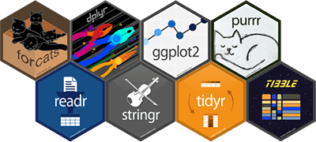

```{r setup, include=FALSE}
knitr::opts_chunk$set(
	echo = FALSE,
	message = FALSE,
	warning = FALSE
)
library(learnr)
library(tidyverse)

hint_text <- function(text, text_color = "#E69F00"){
  hint <- paste("<font color='", text_color, "'>", text, "</font>", sep = "")
  return(hint)
}

#Read dat files needed for the tutorial

ice_tib <- discovr::ice_bucket

```

# discovr: Summarizing data

## Overview

This tutorial is one of a series that accompanies [Discovering Statistics Using R and RStudio](https://www.discoveringstatistics.com/books/discovering-statistics-using-r/) [@fieldDiscoveringStatisticsUsing2020] by me, [Andy Field](https://en.wikipedia.org/wiki/Andy_Field_(academic)). These tutorials contain abridged sections from the book so there are some copyright considerations but I offer them under a [Creative Commons Attribution-NonCommercial-NoDerivatives 4.0 International License](http://creativecommons.org/licenses/by-nc-nd/4.0/), ^[Basically you can use this tutorial for teaching and non-profit activities but do not meddle with it or claim it as your own work.]

* Who is the tutorial aimed at?
    - Anyone teaching from or reading [Discovering Statistics Using R and RStudio](https://www.discoveringstatistics.com/books/discovering-statistics-using-r/)  may find them useful.
* What is covered?
    - This tutorial looks at some key concepts in using **R** and **RStudio**. It would be a useful tutorial to run at the start of a module, or alongside teaching based on Chapter 1 of [Discovering Statistics Using R and RStudio](https://www.discoveringstatistics.com/books/discovering-statistics-using-r/).
    - This tutorial *does not* teach the background theory: it is assumed you have either attended my lecture or read the relevant chapter in the aforementioned book (or someone else's)

If you haven't done so already, I recommend working through [this tutorial](http://milton-the-cat.rocks/learnr/r/r_getting_started/) on how to install, set up and work within R and RStudio before starting this tutorial.

## Packages and data

The tutorials are self-contained (you practice code in code boxes) so you don’t need to use RStudio at the same time. However, I recommend that you open another RStudio session to the one that you're using to run this tutorial. In this second RStudio session, open an R markdown file and everything you do in the tutorial, practice in the R markdown file (and save it). This video explains the sort of workflow that I mean:


hint_text("Within the tutorial itself, everything will work. To replicate things outside of the tutorial you will need to load the relevant packages and data.")

### Packages

To work *outside of this tutorial* you need to load the following packages:

* `here` [@here]
* `tidyverse` [@tidyverse]

If you haven't already done this, install a package at the command line using `install.packages("package_name")`, where *package_name* is the name of the package. If the package is already installed, then load it within the first code chunk within your R markdown file using `library(package_name)`, where *package_name* is the name of the package.

### Data

To work *outside of this tutorial* you need to download the following data file:

* [ice_bucket.csv](http://www.discoveringstatistics.com/repository/discovr_data/ice_bucket.csv)

Assuming you set up an RStudio project in the way [I recommend in this tutorial](http://milton-the-cat.rocks/learnr/r/r_getting_started/#section-working-in-rstudio), then save the data files to the folder within your project folder called `data`. Then in a code chunk in your R Markdown document execute

```
ice_tib <- here::here("data/ice_bucket.csv") %>% readr::read_csv()
```


## Functions and objects

To communicate with R you type commands that tell it what to do. This process might seem strange to you if you are used to interacting with software by using your mouse to click on options and on-screen buttons. The problem with pointing and clicking is that the process isn't easily reproducible. Often when analysing data we want to reproduce what we have done. By typing commands and saving those commands as a script, we are able to reproduce our analysis exactly.

The conversation that you have with R consists of you typing instructions, then doing something to execute those instructions. R will either dutifully carry out your instructions or complain that your instructions weren’t clear enough. In short, you type commands, try to execute them and R either does what you ask or throws an error. In the early days of learning R you will become very familiar with error messages, they are typically indecipherable so fear not if they seem like gibberish. 

A simple ‘conversation’ with R is made up of commands that follow the common structure shown in Figure 1.

```
object <- instructions
```

Which you can read as object is created from instructions. In the middle of each command is an arrow (`<-`) known as the **assignment operator**, so called because it assigns the stuff on the right of the command to the thing on the left (hence the arrow points right-to-left). The ‘thing’ on the left is an **object** that is created when the command is executed. An object can be a single value (e.g., a median of a set of scores) or collections of information (e.g. the details of a statistical model). The ‘stuff’ on the right, which I’ve called instructions, are typically a set of operations or the results of applying a function.


For example, the first command in Figure 1:

```
metallica <- c("Lars","James","Jason", "Kirk")
```

creates an object called *metallica*, consisting of the four band members’ first names (pre 2001). The ‘instructions’ used to create the object *metallica* include the concatenate function, `c()`, which collects things together. A function is a bit of code that someone has written (and that you can write yourself) that typically has at least one argument and an output. **Functions** have a name followed by parenthesis, for example, `ggplot()`, `mean()` and `plot()`. **Arguments** are inputs to the function, which are pre-defined things that you specify within the parentheses. You can think of arguments like options that you set for the function.  Most functions return an output, which could be a new data set, a value, information about a statistical model, a graph and so on.
 
In the first command in Figure 1 the arguments passed into the `c()` function are the band member’s names as four separate strings of text, and the output returned by the function is these strings collected together as a single entity. So, we input each band member’s name (in straight quotes and separated by commas), and by enclosing them in `c()` we bind them into a single entity, which is assigned (using `<-`) to an object that we have called ‘metallica’. Once this command is executed the object that we called ‘metallica’ is created and stored in memory so we can use it in future commands.

`r hint_text("Tip: Simultaneously press the **alt** + **−** keys to insert the assignment operator (<-)") `

Let's try this out. In the code box below type `metallica <- c("Lars","James","Jason", "Kirk")` and then click {width=10%}.

```{r met_data, exercise=TRUE}

```

```{r met_data-solution}
metallica <- c("Lars","James","Jason", "Kirk")
```

You should find that nothing happened, which will be disconcerting. That's because we told R to create the object *metallica* but not to show it to us. So, the object *metallica* has been created and stored in R’s memory and we can refer back to it, use it to do other things, change it, and view it. To view it we execute its name. So, let's try the exercise above but now ask to see the object *metallica* that we have created by executing:

```
metallica <- c("Lars","James","Jason", "Kirk")
metallica
```

```{r met_data_2, exercise=TRUE}

```

```{r met_data_2-solution}
metallica <- c("Lars","James","Jason", "Kirk")
metallica
```

Notice that the contents of the object *metallica* are displayed:

```{r}
metallica <- c("Lars","James","Jason", "Kirk")
metallica
```

We can do other things with our newly created object too, but we'll save that fun for another time.

```{r fun_quiz}
learnr::quiz(
  learnr::question("What is a function in R?",
    learnr::answer("An instruction that typically creates an output from at least one input", correct = TRUE),
    learnr::answer("A lady who loves to boogie to Parliament and Funkadelic", message = "No, that's a funk Sian."),
    learnr::answer("Something created by R", message = "No, that's an object."),
    learnr::answer("The weird arrow thing (`<-`)", message = "No, that's the assignment operator (`<-`)."),
    correct = "Correct - well done!",
    random_answer_order = TRUE,
    allow_retry = T
  ),
  learnr::question("What is an argument in R?",
    learnr::answer("An option that can be set within a function that controls what it does", correct = TRUE),
    learnr::answer("When you tell R to do something and it throws an error message", message = "No, that's your life for the next few years."),
    learnr::answer("An instruction that typically creates an output from at least one input", message = "No, that's a function"),
    learnr::answer("The weird arrow thing (`<-`)", message = "No, that's the assignment operator (`<-`)."),
    correct = "Correct - well done!",
    random_answer_order = TRUE,
    allow_retry = T
  )
)

```


### Optional: still confused about functions and arguments then read on

Try to think of a function as activating a dialog box and arguments as setting options within that dialog box. Let’s take a simple function `mean()`, which (no surprises here) calculates the mean (or average) of a set of scores. This function takes the general form:

```
mean(variable_name, na.rm = FALSE, trim = 0)
```

The function takes three arguments:

*	`variable_name` is the name of the variable for which you want to compute a mean.
* `na.rm = FALSE` is an argument that sets whether to remove missing values (TRUE) or not (FALSE)
*	`Trim = 0` is an argument that determines by how much you trim the scores before computing the mean. The default is 0 (include all scores) but you can set another value, such as 5 (trim 5% of scores from both extremes of the scores before computing the mean).

Don't worry too much about understanding what the arguments do for now, we'll come back to this function in a later tutorial. Figure 2 maps this process of setting arguments within functions to ticking check boxes in a dialog box. In this imaginary statistics software, we have selected a menu called ‘mean’ that opens the dialog box in the figure. This action is comparable to typing `mean()`: it activates the function, but if we were to click *OK* nothing would happen because we haven’t told the computer which variable to compute the mean on. Imagine I've dragged the variable **songs_written** to the space labelled *Variable:*. Having selected the variable, two options are available: the first determines what we do with missing values, and the second determines how much we trim the scores. Each option or ‘argument’ has a tick box. Having specified a variable, we could click on *OK* and we’d get some output because the options/arguments have default values (Figure 2 left): the tick box for removing missing values is unchecked, which is the same as typing `na.rm = FALSE` into the function, and the checkbox for trimming the mean is unchecked which is the same as typing `trim = 0` into the function. In other words it would be like executing:

```
mean(songs_written)
```

We don’t need to write `na.rm = FALSE, trim = 0` explicitly within the function because these are the defaults values that the function will use. However, we could change these defaults by changing these arguments. Going back to our imaginary dialog box, the right side of Figure 2 shows that same variable is selected (**songs_written**), but this time the user has selected the option for removing missing values, which equates to typing `na.rm = TRUE` into the function. The user has also selected to trim means and type in a value of 5 to set the amount of trim, which is equivalent to typing `trim = 5` into the function. Now, when we click on *OK* the mean will be calculated having trimmed 5% of scores from either side and excluding missing values. This process is equivalent to executing:

```
mean(songs_written, na.rm = TRUE, trim = 5)
```


##	Packages and functions

When you load a package (see [this tutorial](http://milton-the-cat.rocks/learnr/r/r_getting_started/#section-installing-and-loading-packages)) into your session you are loading in a collection of new functions that you can use in R.  You can refer to a function directly, to use a general example:

```
function()
```

or you can include a reference to the package from which the function came, in general:

```
package::function()
```

For example, you can use the `ggplot()` function from the **ggplot2** package within a command by executing either of these:

```
ggplot()
ggplot2::ggplot()
```

Although many people don’t include the package name, it is good style to include it when you refer to a function because you will occasionally stumble across two functions in two different packages that have the same name. For example, there is a `recode()` function in both the **Hmisc** and **car** packages. If you have both packages loaded and you try to use `recode()`, R won’t know which one to use or will guess incorrectly and throw an error. If you always specify the package as well as the function then R (and everyone else) will know which function you're using. For example, if we want to use the recode function in the car package we would use:
```
car::recode()
```
but to use the one in Hmisc we would use:
```
Hmisc::recode()
```

```{r packfun_quiz}
  question("In the R command `dplyr::select()` ...",
    answer("`dplyr` is the name of a package and `select()` is a function within that package.", correct = TRUE),
    answer("`select()` is the name of a package and `dplyr` is a function within that package."),
    correct = "Correct - well done!",
    incorrect = "Sorry, that's incorrect. Try again.",
    random_answer_order = TRUE,
    allow_retry = T
  )
```


## Style

While we’re discussing good style, it is important to adopt consistent principles about how to name the objects you create in R. I recommend following Hadley Wickham's [tidyverse style guide](http://style.tidyverse.org/). The style guide has a lot to take in, so a few key tips are:

* *Use lower case when naming things*: **R** is case sensitive so it will treat *myData* as a completely different object to *mydata*. One of the most common reasons why your code won't run will be because you forgot to capitalize an object that you capitalized when you created it. The simplest solution is to use lower case all of the time when naming objects.
* *Use underscores to separate words*: when creating objects it improves readability if you use underscores to distinguish words. For example, you might import the data relating to mathematical achievement as *maths_data*, which is easier to read than *mathsdata*.
* *Avoid long names*: naming something *great_experiment_to_test_whether_listening_to_heavy_metal_improves_your_statistical_ability_data* is certainly descriptive but you're going to really regret it when you want to refer to that object again - think of the potential for typos which would mean **R** doesn't recognise the object, not to mention the time wasted in typing it out. Keep it short but meaningful.
* *consider consistent suffixes*: Although not in the style guide, and not essential, I find it useful to have a set of suffixes to indicate the types of objects that I have created. For example, you might use *dat* for data, *tib* for *tibbles* (they'll be explained in a later tutorial), *m* or *mod* for model, and *out* for output. For example, I might create these objects:
    - *maths_dat*: data frame containing my data on mathematical achievement
    - *maths_tib*: tibble containing my data on mathematical achievement
    - *maths_3x_m*: object specifying a model in which maths achievement was predicted from 3 variables (i.e., 3 *X*s).
    - *maths_3x_out*: object containing the summary output from the above model.
* *Comment*: You can annotate your code by prefixing text with **#**. This enables you to describe what you are doing. You have no idea how helpful this can be when you revisit code 6 months later and can't remember what you were trying to do. It's a really good habit to get into.
* *Spacing*: Your code will be much easier to read if you put spaces around operators such as `+`, `==`, `<-`. Put spaces after commas (but not before), but don't put them around `:`, `::` and `:::` (because these have special functions in **R**).

**Good**:

```{r style_good, echo = TRUE}
# object containing the first names of the members of metallica
metallica <- c("Lars","James","Jason", "Kirk")
```

This example shows good practice. Note how I have annotated what I am doing by using '#', put spaces around the assignment operator (`<-`) and after commas, used lower case and an underscore for my object name and kept the name short.

**Bad**:

```{r style_bad, echo = TRUE}
First_names_of_The.members_of.MetalliCa<-c("Lars","James","Jason", "Kirk")
```

This example shows bad practice. Note that I have not annotated what I am doing, there are no spaces around the assignment operator (`<-`) or after commas, I have some capital letters in my object name, have not been consistent with how I separate words in the object name, and have a name that is unnecessarily long.


```{r style_quiz}
  question("Which of these is **not** an example of good style?",
    answer("Use upper case letters for important words when naming objects.", correct = TRUE, message = "This is poor style because capital letters increase the chance of making errors when later referring to objects that you have created. Use lower case throughout when naming objects."),
    answer("Avoid long names when naming objects."),
    answer("Place spaces around operators such as `+`, `<-`, `-` etc.."),
    answer("Use comments to remind yourself of what your code is doing."),
    correct = "Correct - well done!",
    incorrect = "Sorry, that's incorrect. Try again.",
    random_answer_order = TRUE,
    allow_retry = T
  )
```


##	Tidyverse and the pipe operator (`%>%`)

The tidyverse is a set of packages built upon a common philosophy of data science developed by Hadley Wickham [@wickhamAdvanced2014; @wickhamDataScience2017; @wickhamGgplot2ElegantGraphics2016]. Some of them are shown in Figure 3.

{width=50%}


In R there are always multiple ways to achieve the same goal, in general I will try to follow the tidyverse approach. You [install and load](http://milton-the-cat.rocks/learnr/r/r_getting_started/#section-installing-and-loading-packages) the tidyverse packages as you would any package in R. Having done that, all of the tidyverse packages will be at your disposal (i.e. you don’t need to load them individually).

The tidyverse approach to R makes use of something called the pipe operator (`%>%`) to link functions together. To use the pipe operator the `magrttr` package  needs to be installed and loaded but this happens automatically if you install and load `tidyverse`.

As the name suggests, the pipe operator involves thinking of any command as a ‘pipe’ through which instructions flow from left to right. To take a really simple example, in the [introduction to R and RStudio](http://milton-the-cat.rocks/learnr/r/r_getting_started/) tutorial, we used the `here::here()` function to create a path to a file that we wanted to open with the function `readr::read_csv()`. The command we used was:

```
my_data <- readr::read_csv(here::here("data/metallica.csv"))
```

We can pipe this command to make it clearer:

```
my_data <- here::here("data/metallica.csv") %>% readr::read_csv(.)
```

Instead of embedding the `here::here()` function within `readr::read_csv()`, we put it first and feed or ‘pipe’ its output into `readr::read_csv(.)` using `%>%`.The code is easier to read, it makes clear that we’re using  `here::here()` to generate a path to the file that we want to open, and that we’re feeding that file path into `readr::read_csv(.)`. Note that the `readr::read_csv(.)` function has a period (.) within it. This period represents whatever is coming through the pipe from the left. Often, you don't need the period but sometimes you do so it's worth being aware of it.

```{r pipe_quiz}
  question("What's going on in the command `here::here(\"data/metallica.csv\") %>% readr::read_csv(.)`?",
    answer("`here::here(\"data/metallica.csv\")` generates the filepath to the data file called 'metallica.csv' and this filepath is fed into `readr::read_csv(.)`, which reads in that file.", correct = TRUE, message = "Well done."),
    answer("`here::here(\"data/metallica.csv\")` opens the data file called 'metallica.csv' and `readr::read_csv(.)` converts it to a CSV file`", message = "the `here()` function generates a file path, it doesn;t open the file."),
    answer("The `%>%` reads the data file back into the `here()` function", message = "The flow of commands is in the opposite direction"),
    random_answer_order = TRUE,
    allow_retry = T
  )
```


## Data types

Often when analysing data you will [input your data with an external software](http://milton-the-cat.rocks/learnr/r/r_getting_started/) such as Microsoft Excel, Google sheets, or Numbers and then import it into R. However, you can enter data directly. It's also useful to know about the different ways in which R stores data. R can store information using several different data types:

* `int`: variables containing integers (i.e., whole numbers).
*	`dbl`: variables containing doubles (i.e., real numbers).
* `chr`: variables containing characters, or strings (i.e. text).
*	`lgl`: variables that contain the logical values of TRUE or FALSE.
*	`fctr`: variables that represent categories with fixed numeric values (so called factors, for example a variable where you have coded biological sex as 0 = male, 1 = female)
*	`date`: variables that contain dates.

We’re going to extend our earlier Metallica example to explore these different data types. Table 1 shows the data that we’re going to enter , which contains a character variable (name), two date variables (birth_date and death_date), a factor (the instrument they play), a logical (whether it is true or false that they are a current member of the band), two integers (how many songs they have written for metallica and their **net_worth**).

```{r, results = 'asis'}
tribble(
  ~name, ~birth_date, ~death_date, ~instrument, ~current_member, ~songs_written, ~net_worth,
  "Lars Ulrich", "1963-12-26", NA, "Drums", TRUE, 111, 300000000,
  "James Hetfield", "1963-08-03", NA, "Guitar", TRUE, 112, 300000000,
  "Kirk Hammett", "1962-11-18", NA, "Guitar", TRUE, 56, 200000000,
  "Rob Trujillo", "1964-10-23", NA, "Bass",  TRUE, 16, 20000000,
  "Jason Newsted", "1963-03-04", NA, "Bass", FALSE, 3, 40000000,
  "Cliff Burton", "1962-02-10", "1986-09-27", "Bass", FALSE, 11, 1000000,
  "Dave Mustaine", "1961-09-13", NA, "Guitar", FALSE, 6, 20000000
  ) %>% 
  knitr::kable(caption = "Some data about the rock band Metallica", format = "html") %>% 
  kableExtra::kable_styling(bootstrap_options = "striped")
```


### Character variables

We created a character variable (also called a string variable) when we entered the names of the members of metallica. To recap, we used the `c()` function to ‘collect’ together values. Each value (known as a character string) is separated by commas and placed in straight quotes so that R knows that it is text:

```
metallica <- c("Lars","James","Jason", "Kirk")
```

Extending this idea, we can enter the names in Table 1 and store these in an object cal;led `name` by exectuting:

```
name <- c("Lars Ulrich", "James Hetfield", "Kirk Hammett", "Rob Trujillo", "Jason Newsted", "Cliff Burton", "Dave Mustaine")
```

Try this in the code box:

```{r met_name, exercise=TRUE}

```

```{r met_name-solution}
name <- c("Lars Ulrich", "James Hetfield", "Kirk Hammett", "Rob Trujillo", "Jason Newsted", "Cliff Burton", "Dave Mustaine")
# To view this variable:
name
```

###	Double or integer variables

We have two numeric variables in Table 1: the number of Metallica songs written by each member, and their net worth. A variable that contain numbers is called a numeric variable. By default, R stores numbers as double precision floating point numbers (double), which basically means it includes decimal places, but you can force R to store them as whole numbers (integer). Other things being equal storing numbers as doubles makes sense. To create a numeric variable, type the numeric values into the `c()` function in the order you want them. For example, to create the variables **songs_written** and **net_worth** we would execute:
```
songs_written <-  c(111, 112, 56, 16, 3, 11, 6)
net_worth <- c(300000000, 300000000, 200000000, 20000000, 40000000, 1000000, 20000000)
```

Try entering these variables in the code box.

```{r met_numeric, exercise=TRUE}

```

```{r met_numeric-solution}
songs_written <-  c(111, 112, 56, 16, 3, 11, 6)
net_worth <- c(300000000, 300000000, 200000000, 20000000, 40000000, 1000000, 20000000)

# To view these variables:
songs_written
net_worth
```

### Date variables

The second column of Table 1 contains dates. To create a date variable we do much the same as for a character variable except that we also need to tell R that the values are dates. The conversion from text to dates is important if you want to do computations on the dates. If your dates are stored as characters (rather than dates) computations won’t work. The most versatile way to handle dates is the `lubridate` package (part of the tidyverse), which contains a suite of functions specifically designed for working with times and dates.

One function for converting character strings to dates is `ymd()`. The letters ‘ymd’ stand for ‘year’, ‘month’ and ‘day’ which expects the dates to be entered with the year first, then the month, then the day. To create a variable using lubridate you'd execute something like:

```
variable <- c("date 1", " date 2"," date 3", etc.) %>% lubridate::ymd()
```

Notice that I have used the pipe operator (`%>%`) to connect two commands, the first inputs the dates (`c("date 1", " date 2"," date 3", etc.)`) and this information is fed into `lubridate::ymd()` to convert it to date format.

To create the variable called **birth_date** containing the dates of birth in Table 1 using lubridate, we’d need to

* Make sure that `library(tidyverse)` is included in the setup code chunk of our markdown file
* Type the following into a code chunk and execute:

```
birth_date <- c("1963-12-26", "1963-08-03", "1962-11-18", "1964-10-23", "1963-03-04", "1962-02-10", "1961-09-13") %>% lubridate::ymd()
```

Try entering this variable in the code box (the tidyverse package is already loaded so you don't need to include `library(tidyverse)` but you will need to include this when you try this in a markdown file).

```{r met_dob, exercise=TRUE}

```

```{r met_dob-solution}
birth_date <- c("1963-12-26", "1963-08-03", "1962-11-18", "1964-10-23", "1963-03-04", "1962-02-10", "1961-09-13") %>%
  lubridate::ymd()
# To view this variable:
birth_date
```

###	Missing values

Although as researchers we strive to collect complete sets of data, it is often the case that we have missing data. We denote missing values with `NA` (in capital letters), which stands for ‘not available’. Many functions in R have arguments to specify how you handle missing values so if you have missing values remember to set a value for these arguments.
The dates of the member’s deaths are included in Table 1. At the time of writing all but one of the members are alive (Cliff Burton was tragically killed in a tour bus accident), so we (thankfully) have a lot of missing values. We enter these values as `NA` (not in quotes). Therefore, to create a variable called **death_date** containing the dates in Table 1 we execute (notice the use of the pipe, %>%, again):
```
death_date <- c(NA, NA, NA, NA, NA, "1986-09-27", NA) %>% lubridate::ymd()
```

Try entering this variable in the code box.

```{r met_dod, exercise=TRUE}

```

```{r met_dod-solution}
death_date <- c(NA, NA, NA, NA, NA, "1986-09-27", NA) %>% 
  lubridate::ymd()
# To view this variable:
death_date
```

### logical variables

Table 1 contains a logical variable, which is one that contains values of true and false. In this case true and false relate to whether the member is currently in the band. Logical variables are created much the same as integers and doubles except that you enter TRUE and FALSE instead of numbers into the `c()` function. For example, to create the variable **current_member** we would execute:
```
current_member <- c(TRUE, TRUE, TRUE, TRUE, FALSE, FALSE, FALSE)
```

Try entering this variable in the code box.

```{r met_current, exercise=TRUE}

```

```{r met_current-solution}
current_member <- c(TRUE, TRUE, TRUE, TRUE, FALSE, FALSE, FALSE)
# To view this variable:
current_member
```

### Factor variables

A factor variable is one that uses numbers to represent different categories or groups of data. It is a numeric variable, but the numbers represent names (i.e., it is a nominal variable). These groups of data could be levels of a treatment variable in an experiment, different groups of people, different geographic locations, different organisations, etc. In Table 1 we have a factor variable that codes the instrument played by each member. We could enter this variable as a character variable and hope that R treats the variable sensibly when we try to enter it into a statistical model. Often it will, but it is usually a good idea to explicitly define these variables as factors and assign the numeric codes that you want to each category.

When it comes to what instrument is played the codes can be somewhat arbitrary; for the sake of convention people typically use 0, 1, 2, 3, etc. We will use 0 = Guitar, 1 = Bass, 2 = drums.
There are several ways to create factors in R. The first is to enter numeric values and then convert these values to a factor using the `factor()` function, the second is to enter the text and convert it to a factor using the `as_factor()` function from the forcats package (which is part of tidyverse). We’ll use each in turn.

We want to enter the values Drums, Guitar, Guitar, Bass, Bass, Bass, Guitar. Using the coding I suggest above that means entering the numbers 2, 0, 0, 1, 1, 1, 0:
```
instrument <- c(2, 0, 0, 1, 1, 1, 0)
```
To turn these values into a factor, we use the `factor()` function, which takes the general form:

`factor(variable, levels = c(x, y, … z), labels = c("label_1", "label_2", … "label_3"))`

This function looks a bit scary, but it’s not too bad really. Let’s break it down:

*	`factor(variable_name)`: this is all you really need to create the factor—in our case factor(instrument) would do the trick.
*	`levels = c(x, y, … z)`: we need to tell R which values we want to use to denote different groups and we do this with the levels = argument. Often we use the `c()` function to list the values we have used. For example, with the metallica data where we have used values of 0, 1 and 2, we could use `levels = c(0, 1, 2)`. However, if you have used a regular series such as 1, 2, 3, 4 we can abbreviate this as `1:4`, the colon means ‘all the values between’. So, `1:4` is the same as `c(1, 2, 3, 4)`. For the metallica data we could, therefore, use `levels = 0:2` or `levels = c(0, 1, 2)`.
*	`labels = c("label_1", "label_2", … "label_3")`: The final step is to assign labels to these levels. Again, we use `c()` to collect the labels that we wish to assign. You must list these labels in the same order as your numeric levels, and you must provide a label for each level. In our case, 0 corresponds to Guitar, 1 to Bass, and 2 to drums  so the argument would be `labels = c("Guitar", "Bass", "Drums")`.

Putting all of this together we could execute:
```
instrument <- c(2, 0, 0, 1, 1, 1, 0) %>% factor(instrument, levels = 0:2, labels = c("Guitar", "Bass", "Drums"))
```

and then to 'see' the variable, exceute

```
instrument
```

Try this out:

```{r met_inst, exercise=TRUE}

```

```{r met_inst-solution}
instrument <- factor(c(2, 0, 0, 1, 1, 1, 0), levels = 0:2, labels = c("Guitar", "Bass", "Drums"))
# To view this variable:
instrument
```

You’ll see that the variable is made up of the category labels and not the numeric values:


```{r, echo=FALSE}
instrument <- factor(c(2, 0, 0, 1, 1, 1, 0), levels = 0:2, labels = c("Guitar", "Bass", "Drums"))
instrument
```

The tidyverse method is slightly different. First, we create a character variable and then use the `forcats::as_factor()` function to convert it. For example, we could execute:
```
instrument <- c("Drums", "Guitar", "Guitar", "Bass", "Bass", "Bass", "Guitar") %>%
forcats::as_factor()
```
Notice that with this method we don’t specify the levels of labels of the factor. This is done automatically, ordering the levels by the order they appear in the data. You can see this if you try inputting and viewing this variable

```{r met_insttidy, exercise=TRUE}

```

```{r met_insttidy-solution}
instrument <- c("Drums", "Guitar", "Guitar", "Bass", "Bass", "Bass", "Guitar") %>%
  forcats::as_factor()
# To view this variable:
instrument
```

If we don’t want this order we can use the `forcats::fct_relevel()` function to change the order. For example, to order the levels as we did before we would execute:

```
instrument <- instrument %>% forcats::fct_relevel("Guitar", "Bass", "Drums")
```

Or we could have incorporated this command to the original command using the pipe:

```
instrument <- c("Drums", "Guitar", "Guitar", "Bass", "Bass", "Bass", "Guitar") %>% forcats::as_factor() %>% forcats::fct_relevel("Guitar", "Bass", "Drums")
```

Try executing

```
instrument <- c("Drums", "Guitar", "Guitar", "Bass", "Bass", "Bass", "Guitar") %>% forcats::as_factor()
instrument
```

and then

```
instrument <- c("Drums", "Guitar", "Guitar", "Bass", "Bass", "Bass", "Guitar") %>% forcats::as_factor() %>% forcats::fct_relevel("Guitar", "Bass", "Drums")
instrument
```

and note how the order of factor levels change.

```{r met_relevel, exercise=TRUE}

```

```{r met_relevel-solution}
instrument <- c("Drums", "Guitar", "Guitar", "Bass", "Bass", "Bass", "Guitar") %>%
  forcats::as_factor()
# To view this variable:
instrument

instrument <- c("Drums", "Guitar", "Guitar", "Bass", "Bass", "Bass", "Guitar") %>% forcats::as_factor() %>% forcats::fct_relevel("Guitar", "Bass", "Drums")
# To view this variable:
instrument
```

With any factor variable you can see the factor levels and their order by using the `levels()` function, in which you enter the name of the factor. So, to see the levels of our variable instrument variable we would execute: `levels(instrument)`, try this:

```{r met_level-setup}
instrument <- c("Drums", "Guitar", "Guitar", "Bass", "Bass", "Bass", "Guitar") %>% forcats::as_factor() %>% forcats::fct_relevel("Guitar", "Bass", "Drums")
```

```{r met_level, exercise=TRUE}

```

```{r met_level-solution}
levels(instrument)
```


##	Tibbles

We have looked at how to create variables, but what if we want to combine these variables into a tabulated data set. The tidyverse way to do this is using something called a **tibble**. To create a tibble we use the `tibble::tibble()` function, and inpout into it the names of the variables we have created:
```
metalli_tib <- tibble::tibble(name, birth_date, death_date, instrument, current_member, songs_written, net_worth)
```
This command creates an object called `metalli_tib` (I tend to use `_tib` to denote a tibble) that contains all of the variables we have created in columns. You view tibbles by executing its name. The contents of the tibble will be printed within the R markdown document itself below the code chunk. By default the first 10 rows will be displayed and as many columns as the width of the pane allows. The display is interactive so you can navigate across columns or down beyond the first 10 rows.

Create a tibble of the metallica data (don't forget to execute its name to view it):

```{r met_tibble-setup}
current_member <- c(TRUE, TRUE, TRUE, TRUE, FALSE, FALSE, FALSE)
instrument <- c("Drums", "Guitar", "Guitar", "Bass", "Bass", "Bass", "Guitar") %>% forcats::as_factor() %>% forcats::fct_relevel("Guitar", "Bass", "Drums")
name <- c("Lars Ulrich", "James Hetfield", "Kirk Hammett", "Rob Trujillo", "Jason Newsted", "Cliff Burton", "Dave Mustaine")
songs_written <-  c(111, 112, 56, 16, 3, 11, 6)
net_worth <- c(300000000, 300000000, 200000000, 20000000, 40000000, 1000000, 20000000)
birth_date <- c("1963-12-26", "1963-08-03", "1962-11-18", "1964-10-23", "1963-03-04", "1962-02-10", "1961-09-13") %>%
  lubridate::ymd()
death_date <- c(NA, NA, NA, NA, NA, "1986-09-27", NA) %>% 
  lubridate::ymd()
```

```{r met_tibble, exercise=TRUE}

```

```{r met_tibble-solution}
metalli_tib <- tibble::tibble(name, birth_date, death_date, instrument, current_member, songs_written, net_worth)
# To view the tibble
metalli_tib
```

From viewing the tibble, you can see that it collects together the objects called **name**, **birth_date**, **death_date**, **instrument**, **current_member**, **songs_written**, and **net_worth** into columns. When we created these variables we consistently entered the data in the order of Lars, James, Kirk, Rob, Jason, Cliff and Dave, therefore, each row represents the data for each member. For example, we can see that Lars plays drums and has a song writing credit on 111 songs. The whole thing looks like Table 1.
 
###	Creating new variables within a tibble

We can create new variables within a tibble using the `mutate()` function from the `dplyr` (which is part of tidyverse) package. This function takes the general form:
```
dplyr::mutate(tibble_name,
variable_name_1 = data_for_variable,
variable_name_2 = data_for_variable
)
```
In other words, we pass into the function the name of the tibble to which we want to add variables, followed by one or more commands that name the variables that we want to create and include the data for those variables or instructions to create that data (more on this later). We can also pipe a tibble into the function rather than specifying the tibble within the function itself:
```
tibble_name %>%
dplyr::mutate(
variable_name_1 = data_for_variable,
variable_name_2 = data_for_variable
)
```

Two things to note. First, variables are created using an equal sign (`=)`, not the assignment operator (`<-`). Second, every line within the mutate() function ends with a comma except for the last. When R sees a comma it expects to see another command, so the lack of comma after the last command tells R that it is the last command.

Imagine that having created metalli_tib we decide that we’d like to include information about how many of their 10 studio albums of original songs each member played on. The data are 10 (Lars), 10 (James), 10 (Kirk), 2 (Rob), 4 (Jason), 3 (Cliff), 0 (Dave). We can create a variable called albums like this

```
metalli_tib <- metalli_tib %>% 
  dplyr::mutate(
    	albums = c(10, 10, 10, 2, 4, 3, 0)
  )
```

The first line creates the object `metalli_tib` from a version of itself in which the original tibble is passed through the pipe into `dplyr::mutate()`, where the new variable is created. Look at this new tibble (by executing its name) and you’ll see that an extra column has appeared called albums that contains the values we entered. Try this below:

```{r met_setup}
current_member <- c(TRUE, TRUE, TRUE, TRUE, FALSE, FALSE, FALSE)
instrument <- c("Drums", "Guitar", "Guitar", "Bass", "Bass", "Bass", "Guitar") %>% forcats::as_factor() %>% forcats::fct_relevel("Guitar", "Bass", "Drums")
name <- c("Lars Ulrich", "James Hetfield", "Kirk Hammett", "Rob Trujillo", "Jason Newsted", "Cliff Burton", "Dave Mustaine")
songs_written <-  c(111, 112, 56, 16, 3, 11, 6)
net_worth <- c(300000000, 300000000, 200000000, 20000000, 40000000, 1000000, 20000000)
birth_date <- c("1963-12-26", "1963-08-03", "1962-11-18", "1964-10-23", "1963-03-04", "1962-02-10", "1961-09-13") %>%
  lubridate::ymd()
death_date <- c(NA, NA, NA, NA, NA, "1986-09-27", NA) %>% 
  lubridate::ymd()
metalli_tib <- tibble::tibble(name, birth_date, death_date, instrument, current_member, songs_written, net_worth)
```

```{r met_mutate, exercise=TRUE, exercise.setup = "met_setup"}

```

```{r met_mutate-solution}
metalli_tib <- metalli_tib %>% 
  dplyr::mutate(
    	albums = c(10, 10, 10, 2, 4, 3, 0)
  )
metalli_tib
```

We can also compute variables from existing variables. Let’s imagine we now wanted to work out how much money per song contributed each band member made. We know how many songs each member contributed to (**songs_written**) and their net worth (**net_worth**) so their ‘worth per song’ will be their net worth divided by the number of songs written. We can create a variable that takes the values for net_worth and divides them by the corresponding value of **songs_written** using one of the arithmetic operators build into R. Amongst other things, we can add, subtract, multiply and divide using `+`, `-`, `*` and `\` respectively. So, let’s use `/` to create a new variable that we’ll call **worth_per_song** that is **net_worth** divided by **songs_written**. We can again use `mutate()` to add this variable to our tibble:
```
metalli_tib <- metalli_tib %>% 
  dplyr::mutate(
    	worth_per_song = net_worth/songs_written
  )
```

Note that within the `mutate()` function we create the new variable (which we name on the left hand side of the equals sign) by taking the existing variable **net_worth** from the tibble and divided it by another existing variable in the tibble, **songs_written**. If you execute this code and look at the resulting tibble (by executing its name) you’ll see that James and Lars earn about \$2.7 million per song they write, but the real winner here is Jason who contributed to only 3 songs which puts his earnings per song at around \$13 million. Nice work if you can get it.

```{r met_mutate2, exercise=TRUE, exercise.setup = "met_setup"}

```

```{r met_mutate2-solution}
metalli_tib <- metalli_tib %>% 
  dplyr::mutate(
    	worth_per_song = net_worth/songs_written
  )
metalli_tib
```

### Selecting variables

Sometimes we might want to subset tibbles to focus on specific variables or cases of data. First we’ll look at selecting variables. The most extreme case would to look at or retain only at a single variable. To select variables from within a tibble we use the `select()` function from the `dplyr` package (which is loaded as part of tidyverse). The function takes this general form:
```
dplyr::select(tibble_name, list of variables)
```

Within the function you insert the name of the tibble and a list of the variable or variables that you want to retain. For example, to select the variables **name** and **instrument** we could execute:
```
dplyr::select(metalli_tib, name, instrument)
```

Better still, we could use a pipe (`%>%`) that takes the tibble and feeds it into the function:
```
metalli_tib %>% 
  dplyr::select(name, instrument)
```
 
You can also use the `dplyr::select()` function to drop variables from a tibble by placing a minus sign in front of the variable. For example, to show every variable *except* **name** we’d execute:
```
metalli_tib %>% 
  dplyr::select(-name)
```
This command displays the tibble but *without* the column containing the band member’s names.

To remove multiple variables, we can place them within `c()`,remembering to place the minus sign outside of the function so that it applies to everything within it:
```
metalli_tib %>% 
  dplyr::select(-c(name, instrument))
```

This command will display the tibble but *without* the columns containing the band member’s names and instruments.

Sometimes we’d like to store the subset of variables within a new object for future use. To do this you would need to assign the commands that subset the tibble to an object, using the assignment operator (`<-`). For example, to save a version of metalli_tib but without the band member’s names into an object called `metalli_anon_tib`, we’d execute:
```
metalli_anon_tib <- metalli_tib %>% 
  dplyr::select(-name)
```

The object `metalli_anon_tib` is the same as metalli_tib except that it doesn’t contain the variable **name**. We can see this by executing its name to display it. Try out some of these examples below:

```{r met_select, exercise=TRUE, exercise.setup = "met_setup"}

```

```{r met_select-solution}
# Selecting the variables name and instrument
metalli_tib %>% 
  dplyr::select(name, instrument)

# Excluding the variables name and instrument
metalli_tib %>% 
  dplyr::select(-c(name, instrument))

# Saving a version of metalli_tib by excluding the variable 'name'
metalli_anon_tib <- metalli_tib %>% 
  dplyr::select(-name)
# To view the tibble:
metalli_anon_tib
```


###	Selecting cases (filtering tibbles)

Sometimes we want to select cases rather than (or as well as) variables. For example, maybe we want to work with only the current members of Metallica. To do this, we’d need to select rows of the tibble on the basis of whether the variable **current_member** was true. To filter rows of a tibble you use the `filter()` function from `dplyr`. Like the `select()` function in the previous section, you feed in the name of the tibble and some instructions about how to filter:
```
dplyr::filter(tibble_name, statement_about_how_to_filter)
```
Or using a pipe:
```
tibble_name %>%
dplyr::filter(statement_about_how_to_filter)
```
For example, to select the rows that represent current band members, we need to filter the rows where the variable **current_member** is was equal to TRUE. We could do this by executing:
```
dplyr::filter(metalli_tib, current_member == TRUE)
```
or, better still, using a pipe:
```
metalli_tib %>% 
dplyr::filter(current_member == TRUE)
```

Try this out:

```{r met_filter, exercise=TRUE, exercise.setup = "met_setup"}

```

```{r met_filter-solution}
metalli_tib %>% 
dplyr::filter(current_member == TRUE)
```

Note that we use `==` to mean `equal to`. We can also use `!=` to mean 'not equal to. We can also use `<` to mean `less than` and `>` to mean `more than`. For example, if we wanted to return the rows of members who had written more than 50 songs, we could execute:
```
metalli_tib %>% 
dplyr::filter(songs_written > 50)
```

This command returns the data for Lars, James and Kirk, who are the only members to have contributed to the writing of more than 50 songs.

We can also combine conditions to select rows of a tibble. First, we can ask for rows that match both of two conditions by using the `&` operator. For example, if we want the members of metallica who play drums and have written more than 50 songs, we could combine the condition `songs_written > 50` with the condition of `instrument == "Drums"`. By using `&` we require both conditions to be true. The value of **songs_written** must be greater than 50 AND the value of instrument must be equal to ‘Drums’. To filter `metalli_tib` according to the above conditions, we can insert those condition into the `filter()` function that we have just learnt:
```
metalli_tib %>% 
dplyr::filter(songs_written > 50 & instrument == "Drums")
```
 
Try this out:

```{r met_filter_and, exercise=TRUE, exercise.setup = "met_setup"}

```

```{r met_filter_and-solution}
metalli_tib %>% 
dplyr::filter(songs_written > 50 & instrument == "Drums")
```

We can also use the OR operator (`|`) to select cases based on whether one of many conditions is met. For example, let’s say we want to isolate the rhythm section, we need to include cases that either play drums or bass. We can achieve this with a statement such as:
`instrument == "Drums" | instrument == "Bass"`. The `|` denotes 'or', so this command would read as ‘the value of the variable instrument is equal to the word ‘Drums’ OR the value of the variable instrument is equal to the phrase ‘Bass’. Again, we’d insert this statement into the `filter()` function.
```
metalli_tib %>% 
dplyr::filter(instrument == "Drums" | instrument == "Bass")
```
Notice that the result displays only the bassists and drummers.

```{r met_filter_or, exercise=TRUE, exercise.setup = "met_setup"}

```

```{r met_filter_or-solution}
metalli_tib %>% 
dplyr::filter(instrument == "Drums" | instrument == "Bass")
```
 
###	Combining selecting cases with selecting variables

We can combine what we have learnt in the previous sections to select variables *and* cases in a single command. For example, let’s say we want to create a new object called **metalli_worth** that contains only the names and net worth of the current members who have played on every album (i.e., Lars, James and Kirk). This involves two operations:

1. Filter the cases to exclude everyone except Lars, James and Kirk.
2. We want to exclude all of the variables except for net worth.

Let’s first select the cases we want. We can do this in several ways, but one is to set a condition that the variable **current_member** is TRUE (this will give us Lars, James, Kirk and Rob) and a second condition that instrument is not equal (`!=`) to ‘Bass’, which will exclude Rob. This condition would be written as `current_member == TRUE & instrument != "Bass"`. We could place this command into the `filter()` function:
```
metalli_worth <- metalli_tib %>% 
dplyr::filter(current_member == TRUE & instrument != "Bass")
```

This command creates an object called **metalli_worth** that contains the rows of *metalli_tib* that meet the conditions that the variable **current_member** is equal to TRUE and the variable **instrument** is NOT equal to (`!=`) the phrase "Bass". Having created this object, we could re-create it from itself but passed through the `select()` function to select only the variables called **name** and **net_worth**:
```
metalli_worth <- metalli_worth %>% 
dplyr::select(name, net_worth)
```
Notice that by executing this command we overwrite the original object `metalli_worth` with a new version that contains only the variables **name** and **net_worth**.

The method just described is inefficient (but helpful for showing you the explicit steps that we want to take). A more efficient way to do achieve the same goal is to do both operations as part of the same pipe:
```
metalli_worth <- metalli_tib %>% 
  dplyr::filter(current_member == TRUE & instrument != "Bass") %>% 
  dplyr::select(name, net_worth)
```

We now begin to see the beauty of the pipe: it enables us to put together a sequence of operations in very clear, readable, code. The above code creates an object called `metalli_worth` by taking the tibble called `metalli_tib` and passing it into the `filter()` function, where cases are selected if they are current members and don’t play bass, this filtered version of `metalli_tib` is then passed again through the pipe to the `select()` command in which the variables name and net_worth are selected. The result is a tibble containing Lars’, James’, and Kirk’s names and net worth. Remember to include `metalli_worth` to view the tibble. Try this out below:

```{r met_filter_select, exercise=TRUE, exercise.setup = "met_setup"}

```

```{r met_filter_select-solution}
metalli_worth <- metalli_tib %>% 
  dplyr::filter(current_member == TRUE & instrument != "Bass") %>% 
  dplyr::select(name, net_worth)
metalli_worth
```

## Other resources

### Statistics

* The tutorials typically follow examples described in detail in @fieldDiscoveringStatisticsUsing2020, so that book is an obvious place to go for further reading.
* If any of the statistical content doesn't make sense, you could try my more introductory book *An adventure in statistics* [@fieldAdventureStatisticsReality2016].
* There are free lectures and screencasts on my [YouTube channel](https://www.youtube.com/user/ProfAndyField/)
* There are free statistical resources on my website [www.discoveringstatistics.com](http://www.discoveringstatistics.com)

### R

* [R for data science](http://r4ds.had.co.nz/index.html) by @wickhamDataScience2017 is an open-access book by the creator of the tidyverse (Hadley Wickham). It covers the *tidyverse* and data management.
* [ModernDive](http://moderndive.com/index.html) is an open-access textbook on **R** and **RStudio**
* [RStudio cheat sheets](https://www.rstudio.com/resources/cheatsheets/)
* [RStudio list of online resources](https://www.rstudio.com/online-learning/)
* [SwirlStats](http://swirlstats.com/students.html) is a package for *R* that launches a bunch of interactive tutorials.

## References


