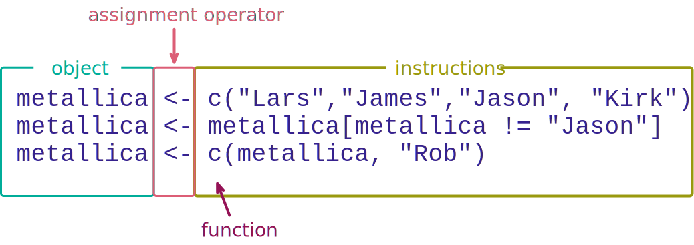

<html lang="en">

```{r setup, include=FALSE}
knitr::opts_chunk$set(
	echo = TRUE,
	message = FALSE,
	warning = FALSE
)

#necessary to render tutorial correctly
library(learnr) 
library(htmltools)
#tidyverse
library(forcats)
library(lubridate)
#non tidyverse/easystats
#students don't use
library(kableExtra)
library(knitr)

source("./www/discovr_helpers.R")
```


# discovr: Code fundamentals


```{r, child = "intro.Rmd"}

```


## Packages

```{r, child = "packages.Rmd"}

```


## `r bmu()` Functions [(1)]{.alt}

Our conversation with `r rproj()` involves typing commands. The strength of this approach is reproducibility, but the cost (for many people) is untold mental anguish — the learning curve is steep, but you can do it. Functions are the core building blocks of these 'conversations'.

A [function]{.kt} is a bit of code that someone has written that typically has at least one argument and an output. The output might be a new data set, a value, information about a statistical model, a plot and so on. Functions have a name followed by parenthesis, for example, `ggplot()`, `mean()` and `plot()`. [Arguments]{.kt} are named bits of information that you feed into the function by typing them within the parentheses. You can think of arguments as options that you set, that tell the function what to do. For example, these 'options' might specify the data on which the function operates, specify a model that you want to fit, or determine how the function behaves.

To make things more concrete, let's take the function `mean()`, which (no surprises here) calculates the mean (or average) of a set of scores. This function takes the general form:

```{r, eval = F}
mean(x = variable_name, na.rm = FALSE, trim = 0)
```

The function takes three arguments called x, na.rm and trim:

- `x = variable_name` is the name of the variable for which you want to compute a mean.
-	`na.rm = FALSE` is an argument that sets whether to remove missing values (TRUE) or not (FALSE).
-	`trim = 0` determines by how much you trim the scores before computing the mean. The default is 0 (include all scores) but you can set another value, such as 0.05 (trim 5% of scores from both extremes of the scores before computing the mean).

Although computer scientists will hate me for writing this, I think it's useful to think of a function as a dialog box and arguments as options and check boxes within that dialog box. Imagine we had some software that allowed us to write R code using dialog boxes.  In this imaginary statistics app, we have selected a menu called 'mean' that opens the dialog box in Figure 3. This action is comparable to typing the following in R:

```{r, eval = F}
mean()
```

We haven't set any arguments; if we were to click 'OK' nothing would happen because we haven't told R which variable to compute the mean on. Our imaginary dialog box has three arguments or 'things you can do'. The first is to drag a variable from a list of variables to a space labelled *Variable:*, in doing so you select the variable to analyse. In Figure 3 (top) I'm about to drag `songs_written` to this space and click on 'OK', which will create this code:

```{r, eval = F}
mean(x = songs_written)
```


Note that selecting a variable in the imaginary dialog box is like setting the first argument. However, the dialog box has two check boxes that relate to the other arguments: the first determines what we do with missing values ([na.rm]{.alt}), and the second determines how much we trim the scores ([trim]{.alt}). By default, these options are not checked which is the same as typing `na.rm = FALSE` and `trim = 0` into the function (Figure 3, bottom left):

```{r, eval = F}
mean(x = songs_written, na.rm = FALSE, trim = 0)
```


However, we'll get the same results from


```{r, eval = F}
mean(x = songs_written)
```

because when arguments are not specified, `r rproj()` uses the default values. When we execute this line of code we would get the mean number of songs written.

Imagine we want to change these defaults. In our imaginary dialog box, we'd do this by checking one of more of the boxes. Figure 3 (bottom right) shows a situation where the user has ticked both boxes. Upon checking the box for a trimmed mean a text box appears into which a number can be typed. The user has typed 0.1. Now, when we click on 'OK' the `r rproj()` code generated would be

```{r, eval = F}
mean(x = songs_written, na.rm = TRUE, trim = 0.1)
```

Checking the first option has set the [na.rm]{.alt} argument to be [TRUE]{.alt}, and checking the second one and entering 0.1 has set the [trim]{.alt} argument to be 0.1. When we execute this line of code, we get the mean number of songs written after having removed the most extreme 10% (0.1 as a proportion) of scores from each end of the distribution and excluding missing values.

To sum up, if the idea functions and arguments confuse you, think of them like this: a function is like activating a dialog box, each thing that you do within that dialog box equates to setting an argument of the function (for example, selecting a variable, selecting a check box, typing a value etc.), and clicking 'OK'  is like executing the function with the options/arguments set in the way that you specified.


<figure>

<figcaption>Figure 3: An imaginary dialog box to help you map the idea of setting arguments to selecting options in dialog boxes.</figcaption>
</figure> 


<div class="tip">
  `r cat_space()` **Tip: Naming arguments within functions**
  
  When you use a function you can name each argument you set, which I generally recommend because you are being explicit about the value of each argument. For example, when computing the mean of the variable **songs_written** with a 5% trim and excluding missing values we could execute:
  
```{r, eval=FALSE, class.source = '.panel_alt'}
mean(x = songs_written, trim = 5, na.rm = TRUE)
```

When naming arguments we can specify them in any order, so this code is equivalent to the above

```{r, eval=FALSE, class.source = '.panel_alt'}
mean(na.rm = TRUE, trim = 5, x = songs_written)
```

However, you can exclude the argument names if you specify them in the correct order. This code will also compute the mean of the variable **songs_written** with a 5% trim and excluding missing values:

```{r, eval=FALSE, class.source = '.panel_alt'}
mean(songs_written, 5, TRUE)
```

Note that we haven't included the names of the arguments, we have instead included only values. `r rproj()` will interpret this code by assigning the first value in the function to the first argument, the second value to the second argument and so on. How do you know the correct order of arguments? When you access the help file for a function (e.g. `?mean`) it tells you the available arguments, their order and their default value. However, I don't recommend this approach because your code is harder to understand and there is a lot of scope for unintended and unnoticed errors! My advice is

- Always name arguments within a function when you are changing the default values.

</div>


## `r bmu()` Creating objects (1)

A simple 'conversation' with `r rproj()` follows the common structure shown in Figure 4.

```{r, eval = F}
object <- instructions
```

You can read this statement as 'object is created from instructions'. In the middle of each command is an arrow (`<-`) known as the [assignment operator]{.kt}, so called because it assigns the stuff on the right of the command to the thing on the left (hence the arrow points right-to-left). The 'thing' on the left is an object that is created when the command is executed. We give this object a name, which can be any name we choose within certain constraints (we can't use spaces, for example). An object could be a variable, a table of data, a collection of variables, a statistical model, output from a statistical model, a plot or anything that `r rproj()` can create. An object can be a single value (e.g., a median of a set of scores) or collections of information (e.g. the details of a statistical model). The 'stuff' on the right, which I've called instructions, are typically a set of operations or the results of applying a function.


<figure>

<figcaption>Figure 4: Examples of R commands.</figcaption>
</figure> 

For example, the first command in Figure 4:

```{r, eval=FALSE}
metallica <- c("Lars","James","Jason", "Kirk")
```

creates an object called [metallica]{.alt}, consisting of the first names of the members (pre 2001) of the band [Metallica](https://www.metallica.com/). The 'instructions' used to create the object [metallica]{.alt} include the concatenate function, `c()`, which collects things together.

#### `r alien()` Alien coding challenge

Let's try this out. In the code box below type

```{r, eval = FALSE}
metallica <- c("Lars","James","Jason", "Kirk")
```

and then click {height=1em}.

```{r met_data, exercise=TRUE}

```

```{r met_data-solution}
metallica <- c("Lars","James","Jason", "Kirk")
```

You should find that nothing happened, which will be disconcerting. That's because we told `r rproj()` to create the object [metallica]{.alt} but not to show it to us. So, the object [metallica]{.alt} has been created and stored in `r rproj()`'s memory and we can refer back to it, use it to do other things, change it, and view it. To view it we execute its name. So, let's ask to see the object [metallica]{.alt} that we have created by executing its name:

```{r met_data_2-setup}
metallica <- c("Lars","James","Jason", "Kirk")
```

```{r met_data_2, exercise=TRUE}

```

```{r met_data_2-solution}
metallica
```

Notice that the contents of the object [metallica]{.alt} are displayed:

```{r, echo = FALSE}
metallica <- c("Lars","James","Jason", "Kirk")
metallica
```

We can do other things with our newly created object too, but we'll save that fun for another time.

<div class="tip">
  `r cat_space()` **Tip: Keyboard shortcut**
  
  Simultaneously press the {height=1em} + {height=1em} keys to insert the assignment operator `<-`.
</div>


```{r fun_quiz, echo=FALSE}
learnr::quiz(caption = "A fun ... ction quiz",
  learnr::question("What is a function in R?",
    learnr::answer("An instruction that typically creates an output from at least one input", correct = TRUE),
    learnr::answer("A lady who loves to boogie to Parliament and Funkadelic", message = "No, that's a funk Sian."),
    learnr::answer("Something created by R", message = "No, that's an object."),
    learnr::answer("The weird arrow thing (`<-`)", message = "No, that's the assignment operator (`<-`)."),
    correct = "Correct - well done!",
    random_answer_order = TRUE,
    allow_retry = T
  ),
  learnr::question("What is an argument in R?",
    learnr::answer("An option that can be set within a function that controls what it does", correct = TRUE),
    learnr::answer("When you tell R to do something and it throws an error message", message = "No, that's your life for the next few years."),
    learnr::answer("An instruction that typically creates an output from at least one input", message = "No, that's a function"),
    learnr::answer("The weird arrow thing (`<-`)", message = "No, that's the assignment operator (`<-`)."),
    correct = "Correct - well done!",
    random_answer_order = TRUE,
    allow_retry = T
  )
)

```


### `r bmu()` General style principals (1)

It is important to adopt consistent principles about how to name the objects you create in `r rproj()`. I recommend following Hadley Wickham's [tidyverse style guide](http://style.tidyverse.org/). The style guide has a lot to take in, so a few key tips are:

- **Use lower case when naming things**: `r rproj()` is case sensitive so it will treat [myData]{.alt} as a completely different object to [mydata]{.alt}. One of the most common reasons why your code won't run will be because you forgot to capitalize an object that you capitalized when you created it. The simplest solution is to use lower case all of the time when naming objects.
- **Use underscores to separate words**: when creating objects it improves readability if you use underscores to distinguish words. For example, you might import the data relating to mathematical achievement as [maths_data]{.alt}, which is easier to read than [mathsdata]{.alt}.
- **Avoid long names**: naming something [great_experiment_to_test_whether_listening_to_heavy_metal_improves_your_statistical_ability_data]{.alt} is certainly descriptive but you're going to really regret it when you want to refer to that object again - think of the potential for typos which would mean `r rproj()` doesn't recognise the object, not to mention the time wasted in typing it out. Keep it short but meaningful.
- **Comment**: You can annotate your code by prefixing text with `#`. This prefix enables you to describe what you are doing. You have no idea how helpful this can be when you revisit code 6 months later and can't remember what you were trying to do. It's a great habit to get into.
- **Spacing**: Your code will be much easier to read if you put spaces around operators such as `+`, `==`, `<-`. Put spaces after commas (but not before), but don't put them around `:`, `::` and `:::` (because these have special functions in `r rproj()`).
- **Consider consistent suffixes**: Although not in the style guide, I find it useful to have a set of suffixes to indicate the types of objects that I have created. For example, I use [dat]{.alt} to denote a data object, [tib]{.alt} to denote a tibble (more them later), [lm]{.alt} to represent a linear model, [tbl]{.alt} for tables, [gg]{.alt} for plots created with `ggplot()` and [plt]{.alt} for other plots, and [out]{.alt} for the output from a statistical procedure/model:

-	`anx_dat`: the object containing my child anxiety data
-	`anx_full_lm`: an object specifying a linear model in which child anxiety is predicted from the full set of hypothesized predictors in the data.
-	`anx_full_out`: an object containing the summary output from the above model.
-	`anx_coef_tbl`: a table of the model coefficients
-	`anx_residual_gg`: a plot of residuals from my model

You don't have to adopt my weird practices, but it's liberating to be weird.

#### Good style

```{r style_good, echo = TRUE}
# object containing the first names of the members of metallica
metallica <- c("Lars","James","Jason", "Kirk")
```

This example shows good practice. Note how I have annotated what I am doing by using `#`, put spaces around the assignment operator (`<-`) and after commas, used lower case and an underscore for my object name and kept the name short.

#### Poor style

```{r style_bad, echo = TRUE}
First_names_of_The.members_of.MetalliCa<-c("Lars","James","Jason", "Kirk")
```

This example shows poor style. Note that I have not annotated what I am doing, there are no spaces around the assignment operator (`<-`) or after commas, I have some capital letters in my object name, have not been consistent with how I separate words in the object name, and have a name that is unnecessarily long.


```{r style_quiz, echo=FALSE}
  question("Which of these is **not** an example of good style?",
    answer("Use upper case letters for important words when naming objects.", correct = TRUE, message = "This is poor style because capital letters increase the chance of making errors when later referring to objects that you have created. Use lower case throughout when naming objects."),
    answer("Avoid long names when naming objects."),
    answer("Place spaces around operators such as `+`, `<-`, `-` etc.."),
    answer("Use comments to remind yourself of what your code is doing."),
    correct = "Correct - well done!",
    incorrect = "Sorry, that's incorrect. Try again.",
    random_answer_order = TRUE,
    allow_retry = T
  )
```


##	`r bmu() ` The `here()` function [(1)]{.alt}

Let's look at a simple function that comes in very useful for loading data: the `here()` function from the [here]{.pkg} package. In the book I recommend using an `r rstudio()` project (see the workflow section in the introduction of this tutorial) and the `here()` returns the path to your project folder.

<div class="tip">
  `r cat_space()` **Tip**

  As with any package, to use [here]{.pkg} you need to install it by executing (at the command line in the console pane):

```{r, eval = F, class.source = '.panel_alt'}
install.packages('here')
```

</div>

The here package essentially has one function that you’ll use sporadically in a given project so this is an example of a function where it makes sense to use `here::here()` rather than loading the entire package.

Let’s assume that the location of your project on your computer is `C:/Users/andyfield/Documents/discovr_stats/`, executing the function will return that location:

```{r, eval = F}
here::here()
```


```
[1]"C:/Users/andyfield/Documents/discovr_stats"
```

If you type the location of a file within the project folder into the function, it appends this text to the location of the project folder, to give you the path. For example, if we want to access the file called 'metallica.csv' which is within a folder called 'data' within our project folder, we could get the filepath to this file by executing:

```{r, eval = F}
here::here("data/metallica.csv")
```

or 

```{r, eval = F}
here::here("data", "metallica.csv")
```

```
[1] C:/Users/andyfield/Documents/discovr_stats/data/metallica.csv"
```

The `here()` function generates the filepath for the project folder each time it is called, so if you move your project folder to another machine or a different location on the same machine your code will still work.


##	`r bmu() ` The pipe operator `|>` [(1)]{.alt}

The tidyverse approach to coding `r rproj()` makes use of something called the pipe operator (`|>`) to link functions together. This operator, known as the [native pipe]{.alt}, is built into `r rproj()`.

As the name suggests, the pipe operator involves thinking of any command as a pipe through which instructions flow from left to right. To take a really simple example, in the previous section, we discovered that the `here::here()` function returns the path/location of our project folder. We also used an example of using this function to generate the path to a data file. Let's imagine we wanted to load this data file using the function `read_csv()` from the [readr]{.pkg} package. This function has a [file]{.alt} argument that expects a string of text for the location of the file. For example, to open our `metallica.csv` file, we could execute:

```{r, eval = F}
read_csv(file = "C:/Users/andyfield/Documents/discovr_stats/data/metallica.csv")
```


However, if we change computers, or someone else wants to open this file, the code won't work (for one thing, their username probably won't be [andyfield]{.alt}). By using an `r rstudio()` project, we can take advantage if the `here()` function.

```{r, eval=FALSE}
my_data <- read_csv(file = here::here("data/metallica.csv"))
```

In doing so, we use `here::here()` to generate the file path that is then assigned to the [file]{.alt} argument. However, we can use the pipe to make the code easier to read and understand:

```{r, eval=FALSE}
my_data <- here::here("data/metallica.csv") |>
  read_csv()
```

Instead of embedding the `here::here()` function within `read_csv()`, we put it first and feed or 'pipe' its output into `read_csv()` using `|>`. The code is easier to read, it makes clear that we're using  `here::here()` to generate a path to the file that we want to open, and that we're feeding that file path into `read_csv()`.

```{r pipe_quiz, echo=FALSE}
  question("What's going on in the command `here::here(\"data/metallica.csv\") |> read_csv()`?",
    answer("`here::here(\"data/metallica.csv\")` generates the filepath to the data file called 'metallica.csv' and this filepath is fed into `read_csv()`, which reads in that file.", correct = TRUE, message = "Well done."),
    answer("`here::here(\"data/metallica.csv\")` opens the data file called 'metallica.csv' and `read_csv()` converts it to a CSV file`", message = "the `here()` function generates a file path, it doesn't open the file."),
    answer("The `|>` reads the data file back into the `here()` function", message = "The flow of commands is in the opposite direction"),
    random_answer_order = TRUE,
    allow_retry = T
  )
```

By default, the pipe operator passes whatever comes through the pipe into the first unnamed argument. To explain what this means, let's explore the `gsub()` function, which takes a string of text as its input, finds some text that you specify, and replaces it with some different text that you specify. It has the following form
  
```{r, eval = F}
gsub(pattern = "find_this_text", replacement = "replace_it_with", x = my_text)
```  
  
in which [my_text]{.alt} is the original text that you want to search, [find_this_text]{.alt} is whatever text you want to replace, and [replace_it_with]{.alt} is whatever you want to replace the text with. There are three arguments. The first is named [pattern]{.alt}, which you use to specify the text to search for, the second is named [replacement]{.alt}, which you use to specify the replacement text, and the third is named [x]{.alt} which you use to specify the original data.

Let's say we have the text "Andy's discovr tutorials are great", but we think they're not great so we want to replace the word 'great' with the word 'terrible' (or something more offensive if that's the way you roll). We can achieve this using the following code in which each argument is called by its name:

```{r, eval = F}
my_sentence <- "Andy's discovr tutorials are great."
gsub(pattern = "great", replacement = "terrible", x = my_sentence)
```  

The first line creates an object called [my_sentence]{.alt}, which is the sentence *"Andy's tutorials are great."*. The second line uses `gsub()` and sets this object to be the data [x = my_sentence]{.alt}. It also asks the function to search for the word *great* and replace it with *terrible*. As mentioned earlier, we don't *need* to name the arguments because the function treats the first input as the first argument, the second input as the second argument and so on. Provided we specify the inputs in the correct order we'll get what we want. I advised against doing this but roll with it for now. This code is equivalent to the code above but involves less typing

```{r, eval = F}
my_sentence <- "Andy's discovr tutorials are great."
gsub("great", "terrible", my_sentence)
```

#### `r alien()` Alien coding challenge

Use the code box to execute the code above.

```{r gsub, exercise = TRUE, exercise.lines = 3}

```

```{r gsub-hint-1}
# Polite version
my_sentence <- "Andy's discovr tutorials are great."
gsub("great", "terrible", my_sentence)
# If you really hate the tutorials read on
``` 

```{r gsub-hint-2}
# Less polite version
my_sentence <- "Andy's discovr tutorials are great."
gsub("great", "the rancid excretions of a diseased and sadistic mind", my_sentence)
``` 

You should see that `gsub()` returns a new sentence in which the word *great* has been replace with *terrible*.

What if we want to do the same thing using the pipe? You might think we could do something like

```{r, eval = F}
my_sentence <- "Andy's discovr tutorials are great."
my_sentence |> 
  gsub("great", "terrible")
``` 

So instead of setting [x = my_sentence]{.alt} within `gsub()`, we pipe the data into it instead.

#### `r alien()` Alien coding challenge

Use the code box to execute the code above.

```{r gsub_fail, exercise = TRUE, exercise.lines = 3}

```

```{r gsub_fail-solution}
my_sentence <- "Andy's discovr tutorials are great."
my_sentence |> 
  gsub("great", "terrible")
``` 

The function now returns the word terrible. Why?

It's because the pipe operator passes whatever comes through the pipe into **the first unnamed argument**. Therefore, the object [my_sentence]{.alt} has been passed into the argument named [pattern]{.alt}, which means that "great" is now assigned to the second argument ([replacement]{.alt}) and "terrible" is assigned to the third argument ([pattern]{.alt}). The code we have written is the same as writing

```{r, eval = F}
my_sentence <- "Andy's discovr tutorials are great."
gsub(pattern = my_sentence,  replacement = "great", x = "terrible")
```  

Therefore, `gsub()` takes the word "terrible" as the initial data, searches it for the pattern "Andy's discovr tutorials are great.", which it doesn't find and, therefore, does not replace it, meaning that the original string is returned unchanged. Remember that the function thinks the original string is the word terrible, so that's what gets returned.

To avoid this we can either name the arguments *before* the one that we want the contents of the pipe to be assigned to. For example, this code will work

```{r, eval = F}
my_sentence <- "Andy's discovr tutorials are great."
my_sentence |> 
  gsub(pattern = "great", replacement =  "terrible")
``` 

because the first *unnamed* argument is [x]{.alt}, so the object [my_sentence]{.alt} coming through the pipe will be assigned to [x]{.alt}. Alternatively, if we don't want to name the preceding arguments, we can use the placeholder `_` to tell the pipe which argument to pipe into. For example,

```{r, eval = F}
my_sentence <- "Andy's discovr tutorials are great."
my_sentence |> 
  gsub("great", "really terrible", x = _)
```
  
works because even though we haven't named the arguments, we have explicitly told the pipe to assign its contents to the argument named [x]{.alt} by including [x = _]{.alt}.

#### `r alien()` Alien coding challenge

Use the code box to get the `gsub()` function to work with a pipe.

```{r gsub_succeed, exercise = TRUE, exercise.lines = 3}

```

```{r gsub_succeed-hint-1}
# solution 1
my_sentence <- "Andy's discovr tutorials are great."
my_sentence |> 
  gsub(pattern = "great", replacement = "terrible")
``` 

```{r gsub_succeed-hint-2}
# solution 2
my_sentence <- "Andy's discovr tutorials are great."
my_sentence |> 
  gsub("great", "terrible", x = _)
``` 
  


```{r pipe_quiz2, echo=FALSE}
  question("Earlier we met the `mean()` function, that has three arguments: `mean(x, trim, na.rm`). Imagine we have a variable called **confusion** containing scores from 20 students about how confused they are about the native pipe. We want to compute the mean of these scores. Select all of the following code examples that will work",
    answer("`confusion |> mean()`", correct = TRUE, message = "`confusion |> mean()` will work because the first unnamed argument for the function `mean()` is x (the data), so the pipe will pass **confusion** into that argument. This is the same as writing `mean(x = confusion)`."),
    answer("`confusion |> mean(x = _)`", correct = TRUE, message = "`confusion |> mean(x = _)` will work because you explicitly tell the pipe to pass **confusion** into the x argument. It's wordy, but it will work. This is the same as writing `mean(x = confusion)`."),
    answer("`confusion |> mean(trim = 5, na.rm = TRUE)`", correct = TRUE, message = "`confusion |> mean(trim = 5, na.rm = TRUE)` will work because the first unnamed argument for the function `mean()` is x (the data), so the pipe will pass **confusion** into that argument. This is the same as writing `mean(x = confusion, trim = 5, na.rm = TRUE)`."),
    answer("`confusion |> mean(5, TRUE)`", correct = TRUE, message = "`confusion |> mean(5, TRUE)` will work because the first unnamed argument for the function `mean()` is x (the data), so the pipe will pass **confusion** into that argument. This is the same as writing `mean(x = confusion, trim = 5, na.rm = TRUE)`."),
    answer("`confusion |> mean(trim = _)`", correct = FALSE, message = "`confusion |> mean(trim = _)` will NOT work because it tells the pipe to pass **confusion** into the trim argument. In fact, the function doesn't know what to compute the mean for because there is no default value of x. This is the same as writing `mean(x, trim = confusion, na.rm = FALSE)`."),
    random_answer_order = TRUE,
    allow_retry = T
  )
```


<div class="infobox">
  `r info()` **Information**

  Tidyverse has its own version of the pipe operator (`%>%`), in fact, their pipe came first! Over time the native pipe will supersede the tidyverse pipe. You will find code online that uses `%>%`, but if you do don't worry because you can often replace `%>%` with `|>` and it will work. If it doesn't work, the usual culprit is because the tidyverse pipe uses `.` to attach 'stuff coming through the pipe' to a specific argument, whereas the native pipe uses `_`. So, if you see something like
  
```{r, eval = F, class.source = '.panel_alt'}
my_model %>%
      model_parameters(model = .)
```

It is saying that the the [model]{.alt} argument is assigned to 'the stuff coming through the pipe'. Try editing it to be:

```{r, eval = F, class.source = '.panel_alt'}
my_model |>
      model_parameters(model = _)
```

(note I've changed the pipe and replaced `.` with `_`). Also removing the dot altogether often works because the code may not need to attach what comes through the pipe to a specific argument:

```{r, eval = F, class.source = '.panel_alt'}
my_model |>
      model_parameters()
```
  
</div>

## `r bmu()` Data types [(1)]{.alt}

Often when analysing data you will input your data with an external software such as Microsoft Excel, Google sheets, or Numbers and then import it into `r rproj()`. However, you can enter data directly. It's also useful to know about the different ways in which `r rproj()` stores data. `r rproj()` can store information using several different data types:

* [int]{.alt}: variables containing integers (i.e., whole numbers).
*	[dbl]{.alt}: variables containing doubles (i.e., real numbers).
* [chr]{.alt}: variables containing characters, or strings (i.e. text).
*	[lgl]{.alt}: variables that contain the logical values of TRUE or FALSE.
*	[fctr]{.alt}: variables that represent categories with fixed numeric values (so called factors, for example a variable where you have coded biological sex as 0 = male, 1 = female)
*	[date]{.alt}: variables that contain dates.

Table 1 shows the data that we're going to enter, which is about the band [Metallica](https://www.metallica.com/); it contains a character variable (**name**), two date variables (**birth_date** and **death_date**), a factor (the **instrument** they play), a logical (whether it is true or false that they are a current member of the band), three integers (how many songs they have written for Metallica, their **net_worth** in millions of dollars and the number of albums on which they played).

```{r, echo=FALSE}
tibble::tribble(
  ~name, ~birth_date, ~death_date, ~instrument, ~current_member, ~songs_written, ~net_worth, ~albums,
  "Lars Ulrich", "1963-12-26", NA, "Drums", TRUE, 123, 350, 11,
  "James Hetfield", "1963-08-03", NA, "Guitar", TRUE, 124, 300, 11, 
  "Kirk Hammett", "1962-11-18", NA, "Guitar", TRUE, 60, 200, 11, 
  "Rob Trujillo", "1964-10-23", NA, "Bass",  TRUE, 19, 40, 3, 
  "Jason Newsted", "1963-03-04", NA, "Bass", FALSE, 3, 60, 4, 
  "Cliff Burton", "1962-02-10", "1986-09-27", "Bass", FALSE, 11, 1, 3,
  "Dave Mustaine", "1961-09-13", NA, "Guitar", FALSE, 6, 14, 0
  ) |> 
  knitr::kable(caption = "Some data about the rock band Metallica", format = "html") |> 
  kableExtra::kable_styling(bootstrap_options = "striped")
```


### `r bmu()` Character variables [(1)]{.alt}

We created a character variable (also called a [string]{.kt} variable) when we entered the names of the members of Metallica. To recap, we used the `c()` function to 'collect' together values. Each value (known as a character string) is separated by commas and placed in straight quotes so that `r rproj()` knows that it is text:

#### `r robot()` Code example

```{r, eval=FALSE}
metallica <- c("Lars","James","Jason", "Kirk")
```

#### `r alien()` Alien coding challenge

Adapt the above code to enter the names in Table 1 and store these in an object called [name]{.alt} by executing:


```{r met_name, exercise = TRUE, exercise.lines = 4}

```

```{r met_name-hint-1}
# You were asked to call the object name, so start with:
#

name <- c()
```

```{r met_name-hint-2}
# To complete the right hand side adapt the sample code to include surnames, and add the pre-2001 members:

c("Lars", "James", "Jason", "Kirk")
```

```{r met_name-hint-3}
# Put this together, this gives you:

name <- c("Lars Ulrich", "James Hetfield", "Kirk Hammett", "Rob Trujillo", "Jason Newsted", "Cliff Burton", "Dave Mustaine")

# Don't forget that to see the object execute its name
```

```{r met_name-solution}
name <- c("Lars Ulrich", "James Hetfield", "Kirk Hammett", "Rob Trujillo", "Jason Newsted", "Cliff Burton", "Dave Mustaine")
name
```

###	`r bmu()` Double or integer variables [(1)]{.alt}

We have three numeric variables in Table 1: the number of Metallica songs written by each member, their net worth in millions of dollars and the number of albums they played on. A variable that contain numbers is called a numeric variable. By default, `r rproj()` stores numbers as double precision floating point numbers ([double]{kt}), which basically means it includes decimal places, but you can force `r rproj()` to store them as whole numbers ([integer]{.kt}). Other things being equal storing numbers as doubles makes sense. To create a numeric variable, type the numeric values into the `c()` function in the order you want them. For example, to create the variables **songs_written** and **net_worth** we would execute:

#### `r robot()` Code example

```{r, eval=FALSE}
songs_written <-  c(123, 124, 60, 19, 3, 11, 6)
net_worth <- c(350, 300, 200, 40, 60, 1, 14)
```

#### `r alien()` Alien coding challenge

Try entering these variables in the code box.

```{r met_numeric, exercise=TRUE}

```

```{r met_numeric-solution}
songs_written <-  c(123, 124, 60, 19, 3, 11, 6)
net_worth <- c(350, 300, 200, 40, 60, 1, 14)

# To view these variables:
songs_written
net_worth
```

### `r user_visor()` Date variables [(2)]{.alt}

The second column of Table 1 contains dates. To create a date variable we do much the same as for a character variable except that we also need to tell `r rproj()` that the values are dates. The conversion from text to dates is important if you want to do computations on the dates. If your dates are stored as characters (rather than dates) computations won't work. The most versatile way to handle dates is the [lubridate]{.pkg} package (part of the tidyverse), which contains a suite of functions specifically designed for working with times and dates.

One function for converting character strings to dates is `ymd()`. The letters 'ymd' stand for 'year', 'month' and 'day' which expects the dates to be entered with the year first, then the month, then the day.

#### `r robot()` Code example

To create a variable using `lubridate::ymd()` you'd execute something like:

```{r, eval=FALSE}
variable <- c("date 1", "date 2", "date 3", ... "final date") |>
  ymd()
```

Notice that I have used the pipe operator (`|>`) to connect two commands, the first inputs the dates (`c("date 1", "date 2", "date 3", ... "final date")`) and this information is fed into `ymd()` to convert it to date format. Using `ymd()` each date would need to be in the format "year-month-day". For example, to enter Lars Ulrich's birthday we'd replace "date 1" with "1963-12-26".

#### `r alien()` Alien coding challenge

Create the variable called **birth_date** containing the dates of birth in Table 1.

```{r met_dob, exercise=TRUE}

```

```{r met_dob-hint-1}
# The variable is called birth_date, so start with:

birth_date <- c()
```

```{r met_dob-hint-2}
# To complete the right hand side adapt the sample code:

c("date 1", "date 2", "date 3", ...)

# Now replace date 1 with the first date, date 2 with the second and so on until all the dates are entered.
```

```{r met_dob-hint-3}
# Together, this gives you

birth_date <- c("1963-12-26", "1963-08-03", "1962-11-18", "1964-10-23", "1963-03-04", "1962-02-10", "1961-09-13")

# Now pipe it into ymd()
```

```{r met_name-hint-4}
birth_date <- c("1963-12-26", "1963-08-03", "1962-11-18", "1964-10-23", "1963-03-04", "1962-02-10", "1961-09-13") |>
  ymd()
```

```{r met_name-hint-5}
# To see the object execute its name

birth_date <- c("1963-12-26", "1963-08-03", "1962-11-18", "1964-10-23", "1963-03-04", "1962-02-10", "1961-09-13") |>
  ymd()

birth_date
```

###	`r bmu()` Missing values [(1)]{.alt}

Although as researchers we strive to collect complete sets of data, it is often the case that we have missing data. We denote missing values with [NA]{.alt} (in capital letters), which stands for 'not available'. Many functions in `r rproj()` have arguments to specify how you handle missing values so if you have missing values remember to set a value for these arguments.
The dates of the member's deaths are included in Table 1. At the time of writing all but one of the members are alive (Cliff Burton was tragically killed in a tour bus accident), so we (thankfully) have a lot of missing values. We enter these values as [NA]{.alt} (not in quotes).

#### `r alien()` Alien coding challenge

Use what you learnt in the previous section to create a variable called **death_date** containing the corresponding dates in Table 1. Whenever the data is missing, use NA (no quotes) instead of a date.

```{r met_dod, exercise=TRUE}
              
```

```{r met_dod-hint-1}
# To get you started
death_date <- c(NA, ...)
                
# Now enter the rest of the NAs and dates. 
```

```{r met_dod-hint-2}
# The completed data is:
death_date <- c(NA, NA, NA, NA, NA, "1986-09-27", NA)

# Now use the pipe and ymd() function like you did before
```

```{r met_dod-hint-3}
# This creates the variable death_date
death_date <- c(NA, NA, NA, NA, NA, "1986-09-27", NA) |>
  ymd()

# If we want to view the object remember we need to execute its name
```

```{r met_dod-hint-4}
# Solution
death_date <- c(NA, NA, NA, NA, NA, "1986-09-27", NA) |>
  ymd()
death_date
```

### `r bmu()` logical variables [(1)]{.alt}

Table 1 contains a logical variable, which is one that contains values of `TRUE` and `FALSE`. In this case true and false relate to whether the member is currently in the band. Logical variables are created much the same as integers and doubles except that you enter TRUE and FALSE (in upper case) instead of numbers into the `c()` function.

#### `r robot()` Code example

In general you create a logical variable as:

```{r, eval=FALSE}
variable_name <- c(TRUE, TRUE, FALSE, TRUE ...)
```

#### `r alien()` Alien coding challenge

Create the variable **current_member** containing the corresponding dates in Table 1.

```{r met_current, exercise=TRUE}
              
```

```{r met_current-hint-1}
# To get you started
current_member <- c(TRUE, ...)
                
# Now enter the rest of the TRUEs and FALSEs. 
```

```{r met_current-hint-2}
# The completed data is:
current_member <- c(TRUE, TRUE, TRUE, TRUE, FALSE, FALSE, FALSE)

# If we want to view the object remember we need to execute its name
```

```{r met_current-hint-3}
# Solution
current_member <- c(TRUE, TRUE, TRUE, TRUE, FALSE, FALSE, FALSE)
current_member
```

### `r bmu()` Factor variables [(1)]{.alt}

A factor variable is one that uses numbers to represent different categories or groups of data. It is a numeric variable, but the numbers represent names (i.e., it is a nominal variable). These groups of data could be levels of a treatment variable in an experiment, different groups of people, different geographic locations, different organisations, etc. In Table 1 we have a factor variable that codes the instrument played by each member. We could enter this variable as a character variable and hope that `r rproj()` treats the variable sensibly when we try to enter it into a statistical model. Often it will, but it is usually a good idea to explicitly define these variables as factors and assign the numeric codes that you want to each category.

The `as_factor()` function from the [forcats]{.pkg} package (which is part of `tidyverse`) uses something called dummy coding, meaning that we specify a sensible order (if there is one) for our groups and let `as_factor()` assign numeric codes for us.


#### `r robot()` Code example

This generic code shows how to create factors using `as_factor()`

```{r, eval=FALSE}
instrument <- c("Instrument 1", "Instrument 2", ... "Final instrument") |>
  as_factor()
```

#### `r alien()` Alien coding challenge

Try creating the variable *instrument* the tidyverse way 

```{r met_insttidy, exercise=TRUE}

```

```{r met_insttidy-solution}
instrument <- c("Drums", "Guitar", "Guitar", "Bass", "Bass", "Bass", "Guitar") |>
  as_factor()
# To view this variable:
instrument
```

Notice that with this method we don't specify the levels or labels of the factor, they are set automatically with levels ordered by the order they appear in the data. In this case entered drums first, so this is the first level. Guitar was entered second and so is the second level and so on. Were told this in the output by [Levels: Drums Guitar Bass]{.alt}.

#### `r robot()` Code example

If we don't want instruments ordered in this way we can use the `fct_relevel()` function (also from the [forcats]{.pkg} to change the order. For example, to order the levels as we did in the earlier example (guitar, bass, drums) we would execute:

```{r, met_relevel-setup}
instrument <- c("Drums", "Guitar", "Guitar", "Bass", "Bass", "Bass", "Guitar") |>
  forcats::as_factor()
```

```{r met_relevel, exercise=TRUE}
instrument <- instrument |>
  fct_relevel("Guitar", "Bass", "Drums")
instrument
```

Notice that the order of levels has changed from [Levels: Drums Guitar Bass]{.alt} in the previous output to [Levels: Guitar Bass Drums]{.alt} in the current output.


#### `r alien()` Alien coding challenge

We could have incorporated the `fct_relevel()` function in the original command by using the pipe. See if you can do this.

```{r met_relevel2, exercise=TRUE}

```

```{r met_relevel2-hint-1}
# Set up the variable and enter the data:
instrument <- c("Drums", "Guitar", "Guitar", "Bass", "Bass", "Bass", "Guitar")

# Now pipe this into as_factor() like we did before
```

```{r met_relevel2-hint-2}
# The variable is created with default factor levels:

instrument <- c("Drums", "Guitar", "Guitar", "Bass", "Bass", "Bass", "Guitar") |>
  as_factor()

# Now pipe the results into the fct_relevel() function
```

```{r met_relevel2-hint-3}
# Solution
instrument <- c("Drums", "Guitar", "Guitar", "Bass", "Bass", "Bass", "Guitar") |>
  as_factor() |>
  fct_relevel("Guitar", "Bass", "Drums")
# To view this variable:
instrument
```

#### `r alien()` Alien coding challenge

With any factor variable you can see the factor levels and their order by using the `levels()` function, in which you enter the name of the factor. So, to see the levels of our variable instrument variable we would execute: `levels(instrument)`, try this:

```{r met_level-setup}
instrument <- c("Drums", "Guitar", "Guitar", "Bass", "Bass", "Bass", "Guitar") |>
  forcats::as_factor() |>
  forcats::fct_relevel("Guitar", "Bass", "Drums")
```

```{r met_level, exercise=TRUE}

```

```{r met_level-solution}
levels(instrument)
```


<div class="infobox">
  
  
  **A message from Mae Jemstone:**
  
  Well done on completing this mission! You have worked very hard and gained a good foundation in how to code `r rproj()`. You know what a function is, how to instruct `r rproj()` to do things and how to create variables. Your next mission is to enter the `tidyverse` to look at how to store your variables as something called a tibble!
  
</div>

## Resources/References {data-progressive=FALSE}

```{r, child = "resources.Rmd"}

```


### References


