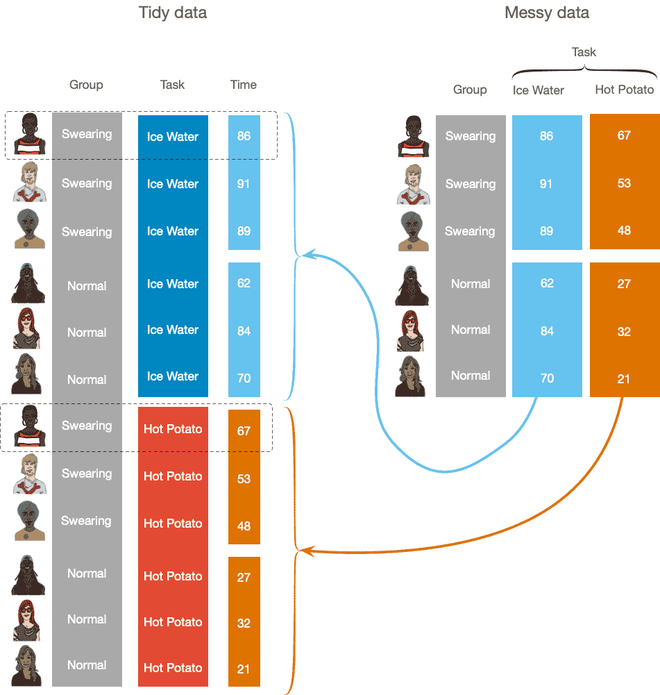

<html lang="en">

```{r setup, include=FALSE}
knitr::opts_chunk$set(
	echo = TRUE,
	message = FALSE,
	warning = FALSE
)

#necessary to render tutorial correctly
library(learnr) 
library(htmltools)
#tidyverse
library(dplyr)
library(forcats)
library(lubridate)
library(tibble)
#students don't use
library(knitr)
library(kableExtra)


source("./www/discovr_helpers.R")

#Read data files needed for the tutorial

name <- c("Lars Ulrich", "James Hetfield", "Kirk Hammett", "Rob Trujillo", "Jason Newsted", "Cliff Burton", "Dave Mustaine")
songs_written <-  c(123, 124, 60, 19, 3, 11, 6)
net_worth <- c(350, 300, 200, 40, 60, 1, 14)
birth_date <- c("1963-12-26", "1963-08-03", "1962-11-18", "1964-10-23", "1963-03-04", "1962-02-10", "1961-09-13") |> ymd()
death_date <- c(NA, NA, NA, NA, NA, "1986-09-27", NA) |> 
  ymd()
current_member <- c(TRUE, TRUE, TRUE, TRUE, FALSE, FALSE, FALSE)
instrument <- c("Drums", "Guitar", "Guitar", "Bass", "Bass", "Bass", "Guitar") |>
  as_factor() |>
  fct_relevel("Guitar", "Bass", "Drums")

metalli_tib <- discovr::metallica
```


# discovr the tidyverse


```{r, child = "./docs/intro.Rmd"}

```


## Packages {data-progressive=FALSE}

```{r, child = "./docs/packages.Rmd"}

```

## Data

```{r, child = "./docs/data.Rmd"}

```


##	`r bmu()` Tidy and messy data [(A)]{.lbl}

There are two common data formats, which are sometimes referred to as [tidy]{.kt} data and [messy]{.kt} data. In tidy data, scores on an outcome variable appear in a single column and rows represent a combination of the attributes of those scores. Each row, therefore, represents an instance of an outcome and any information about that score (e.g., the entity that produced it, characteristics of that entity, the conditions under which the score was observed) is placed in columns across that row. In tidy format, scores from a single entity can appear over multiple rows where each row represents a different instance of the score (for example, the time point at which it was collected). Conversely, in messy (wide) format each row represents data from one entity and each column represents a variable. Each row represents one entity's data (be that entity a human, mouse, tulip, business, or water sample) and any information about that entity should be entered across the data editor. 

An example might make things more concrete. Imagine you were interested in how perceptions of pain created by hot and cold stimuli were influenced by whether or not you swore while in contact with the stimulus (Stephens et al., 2009). You time how many seconds each of six people can keep their hand in a bucket of ice-cold water. You then time for how many seconds they can hold a hot potato. Half the participants are encouraged to shout profanities during the experiences. The variable representing whether the participant was assigned to the swearing group is an independent measure: an entity can belong to either the group that could swear or the group that was forbidden, but not both. All participants were timed both while in contact with a hot and cold stimulus, which is known as a repeated measure because the measurement (in this case the time in contact with the stimulus) is repeated (once for ice water, once for a hot potato).

 Figure 2 shows the data for our six fictional participants. In tidy format, every observation occupies a row in the data editor and columns are used to code information about that observation. For example, the first observation of the time in contact with the stimulus is 86s. The other columns in this row tell us the specific person who generated the score (depicted as a picture in Figure 2 but in a real data set would be a participant number or code), that this person was in the swearing group, and that this time relates to the iced water task. The columns representing the task and group are known as coding variables or factors. In tidy format, participants scores are spread across multiple rows. In this specific example each participant occupies two rows, one containing their score for the ice water task and the other for the hot potato task; for example, the first person held her hand in the ice water for 86s and held the hot potato for 67s. In tidy format repeated measures are spread across rows.
 
Contrast this arrangement with messy format, in which every participant's information is stored in a single row. In messy format repeated measures are spread across columns. For this example, in wide format the data for each participant occupies a single row, with their group membership, time with their hand in ice water, time holding a hot potato spread across three columns. This format is called 'messy' because values associated with certain variables have been split across different columns. In R we can convert between messy and tidy data using the `pivot_longer()` and `pivot_wider()` functions from the [tidyr]{.pkg} package (see `discovr_06`).

<figure>

<figcaption>Figure 2: 'Tidy' data places each variable in a single column, whereas 'Messy' data splits levels of a variable across different columns.</figcaption>
</figure> 


##	`r bmu()` Tibbles [(A)]{.lbl}

In `discovr_02` we looked at how to create variables by entering some variables relating to the rock band [Metallica](http://www.metallica.com). What if we want to combine these variables into a tabulated data set in tidy format? The tidyverse way to do this is to create something called a **tibble**. 

#### `r robot()` Code example

To create a tibble we use the `tibble()` function from the [tibble]{.pkg} and input into it the names of the variables we have created.

```{r, eval=FALSE}
my_tib <- tibble::tibble(variable_1, variable_2, variable_3, ... variable_n)
```

This command creates an object called [my_tib]{.alt} (I tend to use [_tib]{.alt} to denote a tibble) that contains all of the variables listed in `tibble()`. They will be arranged in columns. You view a tibbles by executing its name. The contents of the tibble will be printed within the Quarto document below the code chunk. By default the first 10 rows will be displayed and as many columns as the width of the pane allows. The display is interactive so you can navigate across columns or down beyond the first 10 rows.

#### `r alien()` Alien coding challenge

Create a tibble of the Metallica data called [metalli_tib]{.alt}, which is made up of all of the variables from Table 1 that we have created in this tutorial (don't forget to execute its name to view it):


```{r met_tibble, exercise=TRUE}

```

```{r met_tibble-hint-1}
# To get you started ...
metalli_tib <- tibble::tibble(name, ...)
                              
# Add the other variables (birth_date, death_date, instrument, current_member, songs_written, net_worth)
```

```{r met_tibble-hint-2}
#Solution
metalli_tib <- tibble(name, birth_date, death_date, instrument, current_member, songs_written, net_worth)
# To view the tibble
metalli_tib
```

From viewing the tibble, you can see that it collects together the objects called **name**, **birth_date**, **death_date**, **instrument**, **current_member**, **songs_written**, and **net_worth** into columns. When we created these variables we consistently entered the data in the order of Lars, James, Kirk, Rob, Jason, Cliff and Dave, therefore, each row represents the data for each member. For example, we can see that Lars plays drums and has a song writing credit on 123 songs. The whole thing looks like Table 1.
 
##	`r bmu()` Creating new variables using `mutate()` [(A)]{.lbl}

###	`r bmu()` Adding a variable to a tibble [(A)]{.lbl}

We can create new variables within a tibble using the `mutate()` function from the [dplyr]{.pkg} (which is part of [tidyverse]{.pkg}).

#### `r robot()` Code example

The `mutate()` function  takes the general form:

```{r, eval=FALSE}
mutate(tibble_name,
       variable_name_1 = data_for_variable,
       variable_name_2 = data_for_variable
       ...
       )
```

In other words, we pass into the function the name of the tibble to which we want to add variables, followed by one or more commands that name the variables that we want to create and include the data for those variables or instructions to create that data (more on this later). We can also pipe a tibble into the function rather than specifying the tibble within the function itself:

```{r, eval=FALSE}
tibble_name |>
  mutate(
    variable_name_1 = data_for_variable,
    variable_name_2 = data_for_variable
    ...
    )
```

<div class="bug">
  `r bug()` **De-bug: common mistakes when using mutate()** 
  
  1. In `mutate()`, variables are created using an equal sign (`=`), not the assignment operator (`<-`). Remember to use an equals sign within mutate.
  2. Every line within the `mutate()` function ends with a comma except for the last. When `r rproj()` sees a comma it expects to see another command, so the lack of comma after the last command tells `r rproj()` that it is the last command. If you get an error message when using `mutate()` check you have remembered commas at the end of each line except the last.
</div>

#### `r robot()` Code example

Imagine that having created [metalli_tib]{.alt} we decide that we'd like to include information about how many of their studio albums of original songs each member played on. The data are in Table 1: 11 (Lars), 11 (James), 11 (Kirk), 3 (Rob), 4 (Jason), 3 (Cliff), 0 (Dave). We can create a variable called albums like this

```{r met_setup}
metalli_tib <- metalli_tib |> 
  select(-c(albums, worth_per_song))
```

```{r met_mutate, exercise=TRUE, exercise.setup = "met_setup"}
metalli_tib <- metalli_tib |> 
  mutate(
    	albums = c(11, 11, 11, 3, 4, 3, 0)
  	)
metalli_tib
```

```{r met_mutate-solution}
metalli_tib <- metalli_tib |> 
  mutate(
    	albums = c(11, 11, 11, 3, 4, 3, 0)
  	)
metalli_tib
```

The first line creates the object [metalli_tib]{.alt} from a version of itself in which the original tibble is passed through the pipe into `mutate()`, where the new variable is created. You'll see that the new version of [metalli_tib]{.alt} has an extra column called **albums** that contains the values we entered.

###	`r bmu()` Creating new variables from existing variables [(A)]{.lbl}

We can also compute variables from existing variables. Let's imagine we now wanted to work out how much money per song contributed each band member made. We know how many songs each member contributed to (**songs_written**) and their net worth (**net_worth**) so their 'worth per song' will be their net worth divided by the number of songs written. We can create a variable that takes the values for net_worth and divides them by the corresponding value of **songs_written** using one of the arithmetic operators built into `r rproj()`. Amongst other things, we can add, subtract, multiply and divide using [+]{.alt}, [-]{.alt}, [\*]{.alt} and [/]{.alt} respectively. So, let's use [/]{.alt} to create a new variable that we'll call **worth_per_song** that is **net_worth** divided by **songs_written**. The command within `mutate()` to create this variable will be:

```{r, eval = FALSE}
worth_per_song = net_worth/songs_written
```

#### `r alien()` Alien coding challenge

By adapting the code in the previous section and using the code above that computes the worth per song to, add the variable **worth_per_song** to the [metalli_tib]{.alt} tibble:

```{r met_setup_albums}
metalli_tib <- metalli_tib |> 
  select(-worth_per_song)
```

```{r met_mutate2, exercise=TRUE, exercise.lines = 5, exercise.setup = "met_setup_albums"}

```

```{r met_mutate2-hint-1}
# Start with the code form the previous section, but remove the stuff
# from within the mutate function:

metalli_tib <- metalli_tib |> 
  mutate(
    
  )
```

```{r met_mutate2-hint-2}
# Now place the code that computes worth_per_song within mutate()
metalli_tib <- metalli_tib |> 
  mutate(
    	worth_per_song = net_worth/songs_written
  )
```

```{r met_mutate2-hint-3}
# Nice to view the tibble to see that the variable has, in fact, been added
metalli_tib <- metalli_tib |> 
  mutate(
    	worth_per_song = net_worth/songs_written
  )
metalli_tib
```

Note that within the `mutate()` function we create the new variable (which we name on the left hand side of the equals sign) by taking the existing variable **net_worth** from the tibble and divided it by another existing variable in the tibble, **songs_written**. If you look at the resulting tibble you'll see that Lars earns about \$2.85 million per song, but the real winner here is Jason who contributed to only 3 songs which puts his earnings per song at around \$20 million. Nice work if you can get it.

## `r bmu()` Selecting variables using `select()` [(A)]{.lbl}

Sometimes we might want to subset tibbles to focus on specific variables or cases of data. First we'll look at selecting variables. The most extreme case would to look at or retain only at a single variable. To select variables from within a tibble we use the `select()` function from the [dplyr]{.pkg} package (which is loaded as part of [tidyverse]{.pkg}). The function takes this general form:

```{r, eval=FALSE}
select(tibble_name, list of variables)
```

Within the function you insert the name of the tibble and a list of the variable or variables that you want to retain. For example, to select the variables **name** and **instrument** we could execute:

```{r, eval=FALSE}
select(metalli_tib, name, instrument)
```

#### `r robot()` Code example

Better still, we could use a pipe (`|>`) that takes the tibble and feeds it into the function:

```{r met_select_ce1, exercise=TRUE, exercise.setup = "met_setup_albums"}
metalli_tib |> 
  select(name, instrument)
```

You can also use `select()` to drop variables from a tibble by placing a minus sign in front of the variable. For example, to show every variable *except* **name** we'd execute:

```{r, eval=FALSE}
metalli_tib |> 
  select(-name)
```

This command displays the tibble but *without* the column containing the band member's names.

#### `r robot()` Code example

To remove multiple variables, place them within `c()`. Remembering to place the minus sign outside of the function so that it applies to everything within it:

```{r met_select_ce2, exercise=TRUE, exercise.setup = "met_setup_albums"}
metalli_tib |> 
  select(-c(name, instrument))
```

This command will display the tibble but *without* the columns containing the band member's names and instruments.

Sometimes we'd like to store the subset of variables within a new object for future use. To do this you would need to assign the commands that subset the tibble to an object, using the assignment operator (`<-`). For example, to save a version of [metalli_tib]{.alt} but without the band member's names into an object called [metalli_anon_tib]{.alt}, we'd execute:

```{r met_select_ce3, exercise=TRUE, exercise.setup = "met_setup_albums"}
metalli_anon_tib <- metalli_tib |> 
  select(-name)

metalli_anon_tib
```

The object [metalli_anon_tib]{.alt}` is the same as [metalli_tib]{.alt} except that it doesn't contain the variable **name**.

<div class="tip">
  `r cat_space()` **Tip**

When selecting lots of variables it can be useful to use `x:y` to indicate 'all of the consecutive variables between x and y, including x and y'. For example the variables in [metalli_tib]{.alt} are now: **name**, **birth_date**, **death_date**, **instrument**, **current_member**, **songs_written**, **net_worth**, **albums**, and **worth_per_song**. If we wanted to select the variables **name**, **songs_written**, **net_worth**, **albums** and **worth_per_song** we could use:

```{r, eval = F, class.source = '.panel_alt'}
select(name, songs_written:worth_per_song)
```

The [songs_written:worth_per_song]{.alt} is shorthand for selecting **songs_written**, **worth_per_song** and all variables in between them in the tibble.
</div>

#### `r alien()` Alien coding challenge

Select the variables **name**, **instrument**, and **net_worth**.


```{r met_select_ex1, exercise=TRUE}

```

```{r met_select_ex1-solution}
# Selecting the variables **name**, **instrument**, and **net_worth**
metalli_tib |> 
  select(name, instrument, net_worth)
```

#### `r alien()` Alien coding challenge

Exclude the variables **death_date** and **net_worth**.

```{r met_select_ex2, exercise=TRUE}

```

```{r met_select_ex2-solution}
# Excluding the variables **death_date**, and **net_worth**
metalli_tib |> 
  select(-c(death_date, net_worth))
```

#### `r alien()` Alien coding challenge

Include the variables **name**, **birth_date**, **death_date**, **instrument**, **current_member** and **worth_per_song**.

```{r met_select_ex3, exercise=TRUE}

```

```{r met_select_ex3-solution}
# Include the variables **name**, **birth_date**, **death_date**, **instrument**, **current_member** and **worth_per_song**
metalli_tib |> 
  select(name:current_member, worth_per_song)

# OR (this removes the three variables that we don't want to see)
metalli_tib |> 
  select(-c(songs_written:albums))
```

<div class="tip">
  `r cat_space()` **Tip: Selecting variables using `$`**
  
  Sometimes, when you want to select only one variable from a tibble it is quicker to use the `$` symbol. For example, to select the variable **instrument** from the [metalli_tib]{.alt} tibble, we could execute:

```{r, eval = F, class.source = '.panel_alt'}
metalli_tib$instrument
```

which you can read as 'the variable **instrument** within the tibble [metalli_tib]{.alt}'. This will return the raw values not wrapped in a tibble (it can be handy sometimes to have the raw values).

</div>

#### `r alien()` Alien coding challenge

Inspect the variable **worth_per_song** from [metalli_tib]{.alt}.


```{r met_select_base, exercise=TRUE}

```

```{r met_select_base-solution}
# Selecting the variable instrument from the metalli_tib tibble
metalli_tib$worth_per_song
```

##	`r bmu()` Selecting cases using `filter()` [(A)]{.lbl}

Sometimes we want to select cases rather than (or as well as) variables. For example, maybe we want to work with only the current members of Metallica. To do this, we'd need to select rows of the tibble on the basis of whether the variable **current_member** was true. To filter rows of a tibble you use the `filter()` function from [dplyr]{.pkg}. Like the `select()` function in the previous section, you feed in the name of the tibble and some instructions about how to filter:

```{r, eval=FALSE}
filter(tibble_name, statement_about_how_to_filter)
```

Or using a pipe:

```{r, eval=FALSE}
tibble_name |>
  filter(statement_about_how_to_filter)
```

#### `r robot()` Code example

For example, to select the rows that represent current band members, we need to filter the rows where the variable **current_member** is was equal to [TRUE]{.alt}. We could do this by executing:

```{r met_filter_ce1, exercise=TRUE}
metalli_tib |> 
  filter(current_member == TRUE)
```


Note that we use `==` to mean 'equal to'. We can also use `!=` to mean 'not equal to', `<` to mean 'less than' and `>` to mean 'more than'. 

#### `r robot()` Code example

For example, if we wanted to return the rows of members who had written more than 50 songs, we could execute:

```{r met_filter_ce2, exercise=TRUE}
metalli_tib |> 
  filter(songs_written > 50)
```

This command returns the data for Lars, James and Kirk, who are the only members to have contributed to the writing of more than 50 songs.

We can also combine conditions to select rows of a tibble. First, we can ask for rows that match both of two conditions by using the `&` operator. For example, if we want the members of Metallica who have played bass and are still alive, we can obtain these rows by combining a condition that uses `is.na()` to find cases that have the value `NA` for the death date with a condition that **instrument** is equal to 'Bass'. By placing `&` between these conditions we require both to be true. The code we'd us is:

#### `r robot()` Code example

To filter [metalli_tib]{.alt} according to the above conditions, we can insert those condition into the `filter()` function:

```{r met_filter_ce3, exercise=TRUE}
metalli_tib |> 
  filter(is.na(death_date) & instrument == "Bass")
```


We can also use the OR operator (`|`) to select cases based on whether one of many conditions is met. For example, let's say we want to isolate the rhythm section, we need to include cases that either play drums or bass. We can achieve this with a statement such as: [instrument == "Drums" | instrument == "Bass"]{.alt}. The `|` denotes 'or', so this command would read as 'the value of the variable **instrument** is equal to the word 'Drums' OR the value of the variable instrument is equal to the phrase 'Bass'. Again, we'd insert this statement into the `filter()` function.

#### `r robot()` Code example

To filter [metalli_tib]{.alt} according to the above conditions, we can insert those condition into the `filter()` function:

```{r met_filter_ce4, exercise=TRUE}
metalli_tib |> 
  filter(instrument == "Drums" | instrument == "Bass")
```

Notice that the result displays only the bassists and drummers.

##	`r bmu()` Selecting cases and variables [(A)]{.lbl}

We can combine what we have learnt in the previous sections to select variables *and* cases in a single command. For example, let's say we want to create a new object called [metalli_worth]{.alt} that contains only the names and net worth of the current members. This involves two operations:

1. Filter the cases to exclude everyone except Lars, James, Kirk and Rob.
2. We want to exclude all of the variables except for the names and net worth.

Let's first select the cases we want. We can do this in several ways, but one is to set a condition that the variable **current_member** is TRUE (this will give us Lars, James, Kirk and Rob). This condition would be written as [current_member == TRUE]{.alt}. We could place this command into the `filter()` function:

#### `r robot()` Code example

To filter [metalli_tib]{.alt} according to the above conditions, we can insert those condition into the `filter()` function:

```{r met_filter_ce5, exercise=TRUE}
metalli_worth <- metalli_tib |> 
  filter(current_member == TRUE)
metalli_worth
```

This command creates an object called [metalli_worth]{.alt} that contains the rows of [metalli_tib]{.alt} that meet the conditions that the variable **current_member** is equal to TRUE.


#### `r alien()` Alien coding challenge

To achieve the second step of selecting net worth we add another step to the pipe; that is, having piped the data into `filter()` we then pipe the result into `select()` to select **name** and **net_worth**. See if you can create [metalli_worth]{.alt} using a single pipeline.

```{r met_filter_select, exercise=TRUE}

```

```{r met_filter_select-hint-1}
# Start by creating metalli_worth from metalli_tib
metalli_worth <- metalli_tib
# Now use the pipe to apply the filter command from the code example
```

```{r met_filter_select-hint-2}
# So far:
metalli_worth <- metalli_tib |> 
  filter(current_member == TRUE) 

# Next use another pipe to apply the select function from the code example
```

```{r met_filter_select-hint-3}
# Solution to create metalli_worth:
metalli_worth <- metalli_tib |> 
  filter(current_member == TRUE) |> 
  select(name, net_worth)
# To view this tibble:
metalli_worth
```

We now begin to see the beauty of the pipe: it enables us to put together a sequence of operations in very clear, readable, code. The above code creates an object called [metalli_worth]{.alt} by taking the tibble called [metalli_tib]{.alt} and passing it into the `filter()` function, where cases are selected if they are current members and don't play bass, this filtered version of [metalli_tib]{.alt} is then passed again through the pipe to the `select()` command in which the variables name and net_worth are selected. The result is a tibble containing Lars', James', and Kirk's names and net worth.

<div class="infobox">
  
  
  **A message from Mae Jemstone:**
  
  Well done on completing this mission! You have worked very hard and gained a good foundation in how to use `r rproj()`. You know how to store data as a tibble, and how to filter cases and select variables within a tibble. Tip Top!
  
</div>

## Resources/References {data-progressive=FALSE}

```{r, child = "./docs/resources.Rmd"}

```


### References


