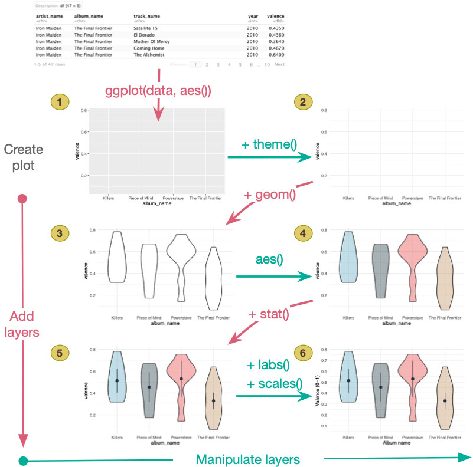

<html lang="en">

```{r setup, include=FALSE}
knitr::opts_chunk$set(
	echo = TRUE,
	message = FALSE,
	warning = FALSE
)

#necessary to render tutorial correctly
library(learnr) 
library(htmltools)
#easystats
#tidyverse
library(dplyr)
library(ggplot2)
#non tidyverse/easystats
library(Hmisc)
#students don't use

source("./www/discovr_helpers.R")

#Read dat files needed for the tutorial

wish_tib <- discovr::jiminy_cricket
notebook_tib <- discovr::notebook
exam_tib <- discovr::exam_anxiety
```

# discovr: Visualizing data

```{r, child = "intro.Rmd"}

```

## Packages

```{r, child = "packages.Rmd"}

```


## Data

```{r, child = "data.Rmd"}

```


## `r bmu()` ggplot2 [(A)]{.lbl}

The most versatile package for producing plots in `r rproj()` is [ggplot2](http://ggplot2.tidyverse.org/) which automatically installs as part of the [tidyverse]{.pkg} package. We dipped our toe into the [ggplot2]{.pkg} water in `discovr_04` to produce a histogram. In this tutorial, we take a running jump and dive in. Hopefully we don't belly flop.

Figure 2 shows how [ggplot2]{.pkg} shows how a plot is built using `ggplot()`. Once the plot is initialized you add layers to the plot that control what the plot shows and their visual properties. You can think of a layer as a plastic transparency with something printed on it. That 'something' could be text, data points, lines, bars, pictures of chickens, or pretty much whatever you like. To make a final image, these transparencies are placed on top of each other. Looking from top to bottom in Figure 2 we initiate the plot, then add two layers. The first adds some shapes (known as [geoms]{.kt}) representing the distributions of scores, and the second adds summary statistics (the mean and a confidence interval). We can also manipulate layers. Looking from left to right in Figure 2, having added the first layer we adjust it by adding coloured shading to the geoms, and having added the second layer we adjust the labels and scaling. Because we are layering information, the order of layers affects the final image.
There are things that we might think of as creating layers on a plot:

-	Geometric objects or 'geoms': these are objects that represent data. Some examples are shapes to represent a summary statistic such as the mean, shapes to represent raw data, lines connecting data points or summarizing data (e.g., a line of best fit, lines connecting group means), error bars, and so on. There are different functions relating to different geoms, within which there will be different options that you can set. For example:
    - `geom_point()` plots data points (by default dots)
    - `geom_boxplot()` plots boxplots
    - `geom_histogram()` plots histograms
    - `geom_errorbar()` plots error bars
    - `geom_smooth()` plots summary lines (e.g., linear models and splines)
-	Objects or [stats]{.kt}: we can use geoms to display summaries of the data that we have already calculated, but sometimes we'd like [ggplot2}{.pkg} to compute these summaries from the raw data and map them to a geom for us. We do this using 'stat' functions.

There are other ‘things’ that we might think of as adjusting the appearance of a layer

-	Aesthetics: aesthetics control what the things on a layer look like (in other words, their the visual aesthetics). Examples of aesthetics are the fill colour of points and bars, line colours (of linear models, error bars, lines around bars etc.), the shape of data points, the size of data points, the type of line (full, dashed, dotted etc.). Aesthetics can be set directly for an object (e.g., making all data points red) or using a variable (e.g., colouring data points based on whether it came from an experimental or control group).
-	Scales and coordinate systems: [ggplot2}{.pkg} uses scales and coordinate systems to control the details of how the data are mapped to their visual objects. 
-	Position adjustments and facets: sometimes elements of a plot overlap (e.g., lots of data points in the same place). There are various position adjustments that can be used to prevent objects from overlapping. You can also use facets to plot different parts of the data in different panels. For example, you can plot the same data from cats and dogs in separate panels of a plot.
-	Themes: Themes are a set of instructions about how a plot should look (what font is used, font sizes, whether to show grid lines, colours of all visual elements, etc.). You can apply built in templates or write your own!

This is a lot to take in, so consider this a reference point (rather than expecting to remember all of the above). We'll get a feel for [ggplot2]{.pkg} by doing examples. You may also find the [official reference guide](http://ggplot2.tidyverse.org/reference/index.html) and, of course, my book chapter helpful.

<figure>

<figcaption>Figure 2: A ggplot is made up of layers.</figcaption>
</figure> 


## `r bmu()` Boxplots (aka Box-Whisker plots) [(A)]{.lbl}

Dreams are good, but a completely blinkered view that they'll come true without any work on your part is not. Imagine I collected some data from 250 people on their level of success using a composite measure involving their salary, quality of life and how closely their life matches their aspirations. This gave me a score from 0 (complete failure) to 100 (complete success). I then implemented an intervention: I told people that for the next 5 years they should either wish upon a star for their dreams to come true or work as hard as they could to make their dreams come true. I measured their success again 5 years later. People were randomly allocated to these two instructions. The data are in [wish_tib]{.alt}. The variables are **id** (the person's id), **strategy** (hard work or wishing upon a star), **time** (baseline or 5 years), and **success** (the rating on my dodgy scale).

First, we're going to create a boxplot of the success scores at baseline and after 5 years. To create a boxplot in `ggplot` we use the `geom_boxplot()` function. We've seen that the general setup of a plot uses this command:

```{r, eval = FALSE}
ggplot(my_tib, aes(x = variable_for_x_axis, y = variable_for_y_axis))
```

Within the `ggplot()` function replace [my_tib]{.alt} with the name of the tibble containing the data you want to plot, and within the `aes()` function replace [variable_for_x_axis]{.alt} with the name of the variable to be plotted on the *x*-axis (horizontal), and replace [variable_for_y_axis]{.alt} with the name of the variable to be plotted on the *y*-axis (vertical).

#### `r robot()` Code example

We could set up the plot with this command:

```{r wish_plot, exercise = TRUE, exercise.lines = 5}
wish_plot <- ggplot(wish_tib, aes(x = time, y = success))
wish_plot +
  geom_boxplot()
```

Let's break down this command:

* `wish_plot <- ggplot(wish_tib, aes(x = time, y = success))` creates an object called [wish_plot]{.alt} that contains the plot. The `ggplot()` function is then used to specify that the plot uses the data in the [wish_tib]{.alt} tibble and plots the variable **time** on the *x*-axis and the variable **success** on the *y*-axis.
* `wish_plot + geom_boxplot()` takes the object [wish_plot]{.alt} and adds a boxplot geom to it.

Job done. 

#### `r alien()` Alien coding challenge

Remember from `discovr_04` that we can make the plot nicer by using `labs()` to add labels to the *x* and *y* axis, and apply a theme such as `theme_minimal()`. We literally add these layers using the `+` symbol. Use the code box to label the *x*-axis as *Time* and *y* as *Success (%)*, and apply a minimal theme.

```{r wish_plot2, exercise = TRUE, exercise.lines = 5}
wish_plot <- ggplot(wish_tib, aes(x = time, y = success))
wish_plot +
  geom_boxplot()
```

```{r wish_plot2-hint-1}
# To add axis labels include
+ labs(x = "label", y = "label")
```

```{r wish_plot2-hint-2}
# To add theme_xxxxx() include
+ theme_xxxxx()
```

```{r wish_plot2-hint-3}
#Solution:
wish_plot <- ggplot(wish_tib, aes(x = time, y = success))
wish_plot +
  geom_boxplot() +  
  labs(x = "Time", y = "Success (%)") +
  theme_minimal()
```

Note that the axis have new labels, and a different theme has been applied (for example, the grey background is gone).

The boxplot shows that success increased (very slightly) after 5 years (the median, shown by the horizontal line within the box, is higher) but the spread of scores has also increased (the whiskers are longer at 5 years than at baseline).

### `r bmu()` Grouping by colour [(A)]{.lbl}

The boxplot we have created shows how success changed over time, but it doesn't show us what effect wishing on a star had compared to hard work. We can see this by splitting the data by the variable **strategy**. We can do this in several ways. First, we can ask `ggplot` to vary the [fill]{.alt} of the boxes or the [colour]{.alt} of the lines around the boxes by the variable **strategy** by adding it to the `aes()` function in the original command to set up the plot For example, to vary the fill of the boxplots by **strategy**, we'd change the first line of our command to be:

#### `r robot()` Code example

```{r, eval = FALSE}
wish_plot <- ggplot(wish_tib, aes(x = time, y = success, fill = strategy))
```

Note that all I have done is to add [fill = strategy]{.alt} to the initial aesthetic. The rest of the command stays the same.

#### `r alien()` Alien coding challenge

Your original code is reproduced below, adapt it to include [fill = strategy]{.alt} and run it. Compare the plot to the previous version. Note that the plot still splits the data by **time** along the *x*-axis, but within each category the data from the wishing on a star group is shown in a different colour to the data from the hard work group.

```{r wish_fill, exercise = TRUE, exercise.lines = 5}
wish_plot <- ggplot(wish_tib, aes(x = time, y = success))
wish_plot +
  geom_boxplot() +  
  labs(x = "Time", y = "Success (%)") +
  theme_minimal()
```

```{r wish_fill-solution}
wish_plot <- ggplot(wish_tib, aes(x = time, y = success, fill = strategy))
wish_plot +
  geom_boxplot() +  
  labs(x = "Time", y = "Success (%)") +
  theme_minimal()
```

We can see that success only increases after 5 years in the hard work group (but the spread of success scores is huge too at 5 years in that group).

Instead of using [fill]{.alt} to differentiate the two **strategy** groups, we can use [colour]{.alt}. This leaves the boxes white for all groups, but uses different colours for the lines around the boxes.

#### `r robot()` Code example

Like with [fill]{.alt}, we adapt the first line of code, but this time to include [colour = strategy]{.alt}:

```{r, eval = FALSE}
wish_plot <- ggplot(wish_tib, aes(x = time, y = success, colour = strategy))
```

#### `r alien()` Alien coding challenge

Add [colour = strategy]{.alt} to the code below and see what happens when you run it.

```{r wish_colour, exercise = TRUE, exercise.lines = 5}
wish_plot <- ggplot(wish_tib, aes(x = time, y = success))
wish_plot +
  geom_boxplot() +  
  labs(x = "Time", y = "Success (%)") +
  theme_minimal()
```

```{r wish_colour-solution}
wish_plot <- ggplot(wish_tib, aes(x = time, y = success, colour = strategy))
wish_plot +
  geom_boxplot() +  
  labs(x = "Time", y = "Success (%)") +
  theme_minimal()
```

This is great but the legend for the variable **strategy** has a lower case 's' and isn't very informative. It'd be nice if it said 'Success strategy'. Currently we have specified labels for the *x*- and *y*-axis by including:

```{r, eval = FALSE}
labs(x = "Time", y = "Success (%)")
```

To specify the label for the variable that is used to determine the fill or colour of the plot, we add it to the `labs()` function. For example, if we used **strategy** to determine the fill of the plot then we'd add [fill = "label"]{.alt}, where *label* is the text we want to use:

#### `r robot()` Code example

```{r, eval = FALSE}
labs(x = "Time", y = "Success (%)", fill = "Success strategy")
```

Similarly, if we had used **strategy** to determine the colour of the plot then we'd add [colour = "label"]{.alt} to the function

```{r, eval = FALSE}
labs(x = "Time", y = "Success (%)", colour = "Success strategy")
```

#### `r alien()` Alien coding challenge

The code to create a boxplot that uses [fill]{.alt} to differentiate the two success strategies is copied below. Edit the code, using what you've just learnt, to change the label for the [fill]{.alt} property to be *Success strategy*. Run the code and see how the legend changes.

```{r wish_fill2, exercise = TRUE, exercise.lines = 5}
wish_plot <- ggplot(wish_tib, aes(x = time, y = success))
wish_plot +
  geom_boxplot() +  
  labs(x = "Time", y = "Success (%)") +
  theme_minimal()
```

```{r wish_fill2-solution}
wish_plot <- ggplot(wish_tib, aes(x = time, y = success, fill = strategy))
wish_plot +
  geom_boxplot() +  
  labs(x = "Time", y = "Success (%)", fill = "Success strategy") +
  theme_minimal()
```

<div class="bug">
  `r bug()` **De-bug: don't forget `+`** 

  A common cause of errors messages when using `ggplot()` is forgetting to put a `+` at the end of each line (except the last). If you get an error message check that each line that builds up a plot has a `+` at the end of it (i.e. each function is separated by `+`). I make this mistake *all* the time!
</div>


### `r bmu()` Grouping using `facet_wrap()` [(A)]{.lbl}

A second way to split the data is to add a facet layer, for example, by adding `facet_wrap()` to the plot. This function takes the general form:

```{r, eval = FALSE}
facet_wrap(facet, nrow = NULL, ncol = NULL, scales = "fixed")
```

There are other arguments, but these are the main ones:

* [facet]{.alt} specifies how you want to create the facet. To create separate plots for the wish upon a star and hard work groups our facet would be [~strategy]{.alt}.
* [nrow]{.alt} specifies how many rows of plots to display. There is no default, the function just tries to make sensible choices. If we wanted the wish upon a star and hard work plots side by side we want them arranged in 1 row, so we could be explicit and include the command [nrow = 1]{.alt}.
* [ncol]{.alt} specifies how many columns of plots to display. Again, the function  tries to make sensible choices. If we wanted the wish upon a star and hard work plots on top of each other then we want them arranged in 1 column, so we could be explicit and include the command [ncol = 1]{.alt}. In reality [nrow]{.alt} and [ncol]{.alt} become important when you have lots of plots to arrange. For example if you were plotting data from 12 different groups, you might want these arranged in 2 rows and 6 columns, 4 rows and 3 columns, 6 rows and two columns and so on.
* [scales]{.alt}. By default the scales of the plots are set to be the same ("fixed") but sometimes it's handy to let them vary across different plots, in which case set [scales = "free"]{.alt} or use ["free_x"]{.alt}  or ["free_y"]{.alt} to allow only the *x*-axis or *y*-axis to vary across plots.

#### `r alien()` Alien coding challenge

The box below displays the code that you used above to generate a boxplot of success scores over time. Add the line `facet_wrap(~strategy)` to the command (above the bottom line that applies the theme), execute the code to see what happens.

```{r wish_facet, exercise = TRUE, exercise.lines = 8}
wish_plot <- ggplot(wish_tib, aes(x = time, y = success))
wish_plot +
  geom_boxplot() +  
  labs(x = "Time", y = "Success (%)") +
  theme_minimal()
```

```{r wish_facet-solution}
wish_plot <- ggplot(wish_tib, aes(x = time, y = success))
wish_plot +
  geom_boxplot() +  
  labs(x = "Time", y = "Success (%)") +
  facet_wrap(~strategy) +
  theme_minimal()
```

Note that the data from the wish upon a star and hard work groups are now displayed in separate panels.

#### `r alien()` Alien coding challenge

Now edit `facet_wrap()` to be `facet_wrap(~strategy, ncol = 1)`, rerun the code and see what happens. The plots should now be stacked vertically instead of being side by side.

```{r wish_facet2, exercise = TRUE, exercise.lines = 8}
wish_plot <- ggplot(wish_tib, aes(x = time, y = success))
wish_plot +
  geom_boxplot() +  
  labs(x = "Time", y = "Success (%)") +
  theme_minimal()
```

```{r wish_facet2-solution}
wish_plot <- ggplot(wish_tib, aes(x = time, y = success))
wish_plot +
  geom_boxplot() +  
  labs(x = "Time", y = "Success (%)") +
  facet_wrap(~strategy, ncol = 1) +
  theme_minimal()
```

## `r bmu()` Plotting means  [(A)]{.lbl}

The mean in the sample is an estimate of the population value, which may or may not be representative of the true value. Put another way, estimates have uncertainty attached to them. It’s a really good idea to include an indicator of this uncertainty on your plot. For means, this is typically done by including an error bar showing the 95% confidence interval. 

If you want to plot from the raw data then your best bet is to use the `stat_summary()` function and then specify the geom to use within it. Let's begin by plotting the mean **success** split by **time**. We can do this by setting up the plot exactly as we did for the boxplot, but instead of using `geom_boxplot()` we use:

```{r, eval = FALSE}
stat_summary(fun.data = "mean_cl_normal", geom = "pointrange")
```


In the `stat_summary()` function, we're asking `r rproj()` to calculate the means and their confidence intervals from the data ([fun.data = "mean_cl_normal"]{.alt}). The argument [geom = "pointrange"]{.alt} asks [ggplot2]{.pkg} to display the means as dots and the confidence interval as a line showing the range of the interval using `geom_pointrange()`. The final argument, [size = 1]{.alt}, determines the size of the dots and overrides the default (you can omit this argument if you like).

<div class="tip">
  `r cat_space()` **Tip: Size and linewidth**
  
If the dot and bar are too small, there are [size]{.alt} and [linewidth]{.alt} arguments that you can include within `stat_summary()` that control the size of the dot and width of the error bar. The defaults are [size = 0.5]{.alt} and [linewidth = 0.5]{.alt}, so if you want a bigger dot try including [size = 0.75]{.alt} or [size = 1]{.alt}, and for a thicker error bar try [linewidth = 0.75]{.alt} or [linewidth = 1]{.alt}. For example:

```{r, eval = F, class.source = '.panel_alt'}
stat_summary(fun.data = "mean_cl_normal", geom = "pointrange", size = 1, linewidth = 1)
```

</div>

#### `r robot()` Code example

The full code is below. Note that the only thing that has changed from the code we used for a boxplot, is that we have replaced `geom_boxplot()` with `stat_summary(fun.data = "mean_cl_normal", geom = "pointrange")`. Try also including the [size]{.alt} and [linewidth]{.alt} arguments and changing their values to see the effect it has on your plot.

```{r wish_point, exercise = TRUE, exercise.lines = 7}
wish_plot <- ggplot(wish_tib, aes(x = time, y = success))
wish_plot +
  stat_summary(fun.data = "mean_cl_normal", geom = "pointrange") +  
  labs(x = "Time", y = "Success (%)") +
  theme_minimal()
```

```{r wish_point-hint-1}
wish_plot <- ggplot(wish_tib, aes(x = time, y = success))
wish_plot +
  stat_summary(fun.data = "mean_cl_normal", geom = "pointrange") +  
  labs(x = "Time", y = "Success (%)") +
  theme_minimal()
# try changing the size and linewidth
```

```{r wish_point-hint-2}
# In this code we've increased the point size and linewidth just a little bit
wish_plot <- ggplot(wish_tib, aes(x = time, y = success))
wish_plot +
  stat_summary(fun.data = "mean_cl_normal", geom = "pointrange", size = 1, linewidth = 1) +  
  labs(x = "Time", y = "Success (%)") +
  theme_minimal()
# try changing the size and linewidth values
```

```{r wish_point-hint-3}
# In this code we've used some silly values for point size and linewidth just for a giggle
wish_plot <- ggplot(wish_tib, aes(x = time, y = success))
wish_plot +
  stat_summary(fun.data = "mean_cl_normal", geom = "pointrange", size = 6, linewidth = 0.25) +  
  labs(x = "Time", y = "Success (%)") +
  theme_minimal()
```


### `r bmu()` Adjusting the scales [(A)]{.lbl}

The plot we've just produced is all well and good, but [ggplot2]{.pkg} has scaled the *y*-axis from 50 to 58 and has displayed breaks at the values 50, 52, 54, and 56. This maximizes the differences between means - the small difference looks huge. We shouldn't do this. There's two functions that we can use to add layers that control the scale of the axis.

#### coord_cartesian()

```{r, eval = FALSE}
coord_cartesian(ylim = c(lower_limit, upper_limit), xlim = c(lower_limit, upper_limit))
```

This code adjusts the *y*-axis and *x*-axis to display values from [lower_limit]{.alt} to [upper_limit]{.alt}. You would replace each [lower_limit]{.alt} and [upper_limit]{.alt} with relevant numbers. We want to change only the *y*-axis so we'll ignore [xlim]{.alt} for now. If we our *y*-axis to display values from 0 to 100 (the full range of the scale) we would add to the plot:

```{r, eval = FALSE}
coord_cartesian(ylim = c(0, 100))
```

#### scale_y_continuous()

```{r, eval = FALSE}
scale_y_continuous(breaks = seq(lower_limit, upper_limit, increment))
```

I've used the function `seq()` which takes the form

```{r, eval = FALSE}
seq(lower_limit, upper_limit, increment)
```

where [lower_limit]{.alt} is the value you want to start at, [upper_limit]{.alt} is the value you want to stop at, and [increment]{.alt} is the size of the increment you want. For example, if we wanted breaks to be displayed at 0, 10, 20, 30 and so on up to 100, we'd specify `seq(0, 100, 10)` which will create a sequence from 0 to 100 in intervals of 10. There is a similar function `scale_x_continuous()` for changing the *x*-axis.

#### `r robot()` Code example

For now, we're adjusting only the *y*-axis. If we want it to show values from 0 to 100 and display labels on every value of 10, we would add these lines to the plot:

```{r, eval = F}
coord_cartesian(ylim = c(0, 100)) +
scale_y_continuous(breaks = seq(0, 100, 10)) +
```

#### `r alien()` Alien coding challenge

Try adding these two lines of code to the previous code (above the bottom line that applies the theme) that we used to plot the means. Compare the resulting plot with the previous one.

<div class="tip">
  `r cat_space()` **Tip: Apply themes last**
  
  It's good practice to apply themes last (i.e. have the theme function as the final line of the command) because [ggplot2]{.pkg} adds each layer in order. If the theme is the last line it will be applied to the entire plot.
</div>

```{r wish_point_scale, exercise = TRUE, exercise.lines = 7}
wish_plot <- ggplot(wish_tib, aes(x = time, y = success))
wish_plot +
  stat_summary(fun.data = "mean_cl_normal", geom = "pointrange") +  
  labs(x = "Time", y = "Success (%)") +
  theme_minimal()
```

```{r wish_point_scale-hint-1}
# Add coord_cartesian() first. Put it above theme_minimal() so the theme is applied last
# don't forget the + sign between coord_cartesian() and theme_minimal()

wish_plot <- ggplot(wish_tib, aes(x = time, y = success))
wish_plot +
  stat_summary(fun.data = "mean_cl_normal", geom = "pointrange") +  
  labs(x = "Time", y = "Success (%)") +
  coord_cartesian(ylim = c(0, 100)) +
  theme_minimal()
```

```{r wish_point_scale-hint-2}
# Now add scale_y_continuous(). Again, put it above theme_minimal() so the theme is applied last
# don't forget the + sign between scale_y_continuous() and theme_minimal()

wish_plot <- ggplot(wish_tib, aes(x = time, y = success))
wish_plot +
  stat_summary(fun.data = "mean_cl_normal", geom = "pointrange") +
  coord_cartesian(ylim = c(0, 100)) +
  scale_y_continuous(breaks = seq(0, 100, 10)) +
  theme_minimal()
```

### `r bmu()` Grouping means [(A)]{.lbl}

Just like with boxplots we can also group means by the success strategy used using the same methods. For example, we can add `facet_wrap(~strategy)` to display the two strategies as different panels.

#### `r alien()` Alien coding challenge {#facet_wish}

Below is the code we have built up so far. Add `facet_wrap(~strategy) +` to the line before last.

```{r wish_point_facet, exercise = TRUE, exercise.lines = 8}
wish_plot <- ggplot(wish_tib, aes(x = time, y = success))
wish_plot +
  stat_summary(fun.data = "mean_cl_normal", geom = "pointrange") +  
  labs(x = "Time", y = "Success (%)") +
  coord_cartesian(ylim = c(0, 100)) +
  scale_y_continuous(breaks = seq(0, 100, 10)) +
  theme_minimal()
```

```{r wish_point_facet-solution}
wish_plot <- ggplot(wish_tib, aes(x = time, y = success))
wish_plot +
  stat_summary(fun.data = "mean_cl_normal", geom = "pointrange") +  
  labs(x = "Time", y = "Success (%)") +
  coord_cartesian(ylim = c(0, 100)) +
  scale_y_continuous(breaks = seq(0, 100, 10)) +
  facet_wrap(~strategy) +
  theme_minimal()
```

Instead of using facets, we can display the two strategies in different colours, like we did for boxplots. To do this we need to make the same two adjustments to our code to earlier on:

* Add [colour = strategy]{.alt} to the first line, within `aes()`.
* Add [colour = "Success strategy"]{.alt} to the `labs()` function to apply a meaningful label to the variable **strategy**.

#### `r alien()` Alien coding challenge

Execute the code below, then make the two adjustments above and execute it again to see the difference.

```{r wish_point_group, exercise = TRUE, exercise.lines = 7}
wish_plot <- ggplot(wish_tib, aes(x = time, y = success))
wish_plot +
  stat_summary(fun.data = "mean_cl_normal", geom = "pointrange") +  
  labs(x = "Time", y = "Success (%)") +
  coord_cartesian(ylim = c(0, 100)) +
  scale_y_continuous(breaks = seq(0, 100, 10)) +
  theme_minimal()
```

```{r wish_point_group-hint-1}
# Add `colour = strategy` to the first line, within `aes()` This line should read:

wish_plot <- ggplot(wish_tib, aes(x = time, y = success, colour = strategy))

```

```{r wish_point_group-hint-2}
# Add colour = "Success strategy"` to the `labs()` function to apply 
# a meaningful label to the variable **strategy**. This line will read:

labs(x = "Time", y = "Success (%)", colour = "Success strategy") +
```

```{r wish_point_group-hint-3}
# Solution:

wish_plot <- ggplot(wish_tib, aes(x = time, y = success, colour = strategy))
wish_plot +
  stat_summary(fun.data = "mean_cl_normal", geom = "pointrange") +  
  labs(x = "Time", y = "Success (%)", colour = "Success strategy") +
  coord_cartesian(ylim = c(0, 100)) +
  scale_y_continuous(breaks = seq(0, 100, 10)) +
  theme_minimal()
```

There is a problem though, the dots at baseline overlap.

### `r bmu()` Adjusting the position of geoms [(A)]{.lbl}

We can avoid the problem of dots overlapping by adjusting their horizontal position. The `stat_summary()` function (and most geoms) have a [position]{.alt} argument that can be set using the function [position_dodge(width = value)]{.alt}. This function plots geoms so that they 'dodge' each other on the horizontal plane. You have to replace [value]{.alt} with a number that sets the size of the 'dodge'. Play around with values until it looks good, 0.9 works well for this plot.

#### `r robot()` Code example

To set the position of the dots, we need to adjust `stat_summary()` from:

```{r, eval = FALSE}
stat_summary(fun.data = "mean_cl_normal", geom = "pointrange")
```

to:

```{r, eval = FALSE}
stat_summary(fun.data = "mean_cl_normal", geom = "pointrange", position = position_dodge(width = 0.9))
```

#### `r alien()` Alien coding challenge

Execute the code below, then add [position = position_dodge(width = 0.9)]{.alt} to `stat_summary()` and run the code again. Note that the dots no longer overlap.

```{r wish_point_dodge, exercise = TRUE, exercise.lines = 7}
wish_plot <- ggplot(wish_tib, aes(x = time, y = success, colour = strategy))
wish_plot +
  stat_summary(fun.data = "mean_cl_normal", geom = "pointrange") +  
  labs(x = "Time", y = "Success (%)", colour = "Success strategy") +
  coord_cartesian(ylim = c(0, 100)) +
  scale_y_continuous(breaks = seq(0, 100, 10)) +
  theme_minimal()
```

```{r wish_point_dodge-solution}
wish_plot <- ggplot(wish_tib, aes(x = time, y = success, colour = strategy))
wish_plot +
  stat_summary(fun.data = "mean_cl_normal", geom = "pointrange", position = position_dodge(width = 0.9)) +  
  labs(x = "Time", y = "Success (%)", colour = "Success strategy") +
  coord_cartesian(ylim = c(0, 100)) +
  scale_y_continuous(breaks = seq(0, 100, 10)) +
  theme_minimal()
```


### `r user_visor()` Robust confidence intervals [(B)]{.lbl}

If we want to plot a robust confidence interval, we can do this using a bootstrap. All we do is change the function we use in `stat_summary()` from [mean_cl_normal]{.alt} to [mean_cl_boot]{.alt}:


```{r, eval = FALSE}
stat_summary(fun.data = "mean_cl_boot", geom = "pointrange")
```


#### `r alien()` Alien coding challenge

Below is the code that we just used. Adapt it to plot a 95% *bootstrap* confidence interval to the means.

```{r wish_violin_ciboot, exercise = TRUE, exercise.lines = 8}
wish_plot <- ggplot(wish_tib, aes(x = time, y = success, colour = strategy))
wish_plot +
  stat_summary(fun.data = "mean_cl_normal", geom = "pointrange", position = position_dodge(width = 0.9)) +  
  labs(x = "Time", y = "Success (%)", colour = "Success strategy") +
  coord_cartesian(ylim = c(0, 100)) +
  scale_y_continuous(breaks = seq(0, 100, 10)) +
  theme_minimal()
```

```{r wish_violin_ciboot-solution}
wish_plot <- ggplot(wish_tib, aes(x = time, y = success, colour = strategy))
wish_plot +
  stat_summary(fun.data = "mean_cl_boot", geom = "pointrange", position = position_dodge(width = 0.9)) +  
  labs(x = "Time", y = "Success (%)", colour = "Success strategy") +
  coord_cartesian(ylim = c(0, 100)) +
  scale_y_continuous(breaks = seq(0, 100, 10)) +
  theme_minimal()
```


## `r bmu()` Violin plots [(A)]{.lbl}

As well plotting the mean success score across the various times and groups, it's also useful to plot the distribution of scores around that mean. We can do that using a violin plot. We can add a 'violin' using the `geom_violin()` function. Let's add a 'violin' to our previous plot. The box below shows the code we have built up so far. Run this code if you want to remind yourself of what the plot looks like.

#### `r robot()` Code example

To add the distribution of scores to the plot, add the line:

```{r, eval = FALSE}
geom_violin() +
```

### `r user_visor()` Exploring layers [(B)]{.lbl}

This is a good opportunity to remind you that each line of the command adds a layer to the plot *in the order you specify them*. This optional section might help you to understand how layering works in [ggplot2]{.pkg}.


#### `r alien()` Alien coding challenge

Add the line `geom_violin() +` directly **below** the line that specifies `stat_summary()`.

```{r wish_violin_1, exercise = TRUE, exercise.lines = 8}
wish_plot <- ggplot(wish_tib, aes(x = time, y = success, colour = strategy))
wish_plot +
  stat_summary(fun.data = "mean_cl_normal", geom = "pointrange", position = position_dodge(width = 0.9)) +  
  labs(x = "Time", y = "Success (%)", colour = "Success strategy") +
  coord_cartesian(ylim = c(0, 100)) +
  scale_y_continuous(breaks = seq(0, 100, 10)) +
  theme_minimal()
```

```{r wish_violin_1-solution}
wish_plot <- ggplot(wish_tib, aes(x = time, y = success, colour = strategy))
wish_plot +
  stat_summary(fun.data = "mean_cl_normal", geom = "pointrange", position = position_dodge(width = 0.9)) +
  geom_violin() +
  labs(x = "Time", y = "Success (%)", colour = "Success strategy") +
  coord_cartesian(ylim = c(0, 100)) +
  scale_y_continuous(breaks = seq(0, 100, 10)) +
  theme_minimal()
```


#### `r alien()` Alien coding challenge

Now add the line `geom_violin() +` directly **above** the line that specifies `stat_summary()`

```{r wish_violin_2, exercise = TRUE, exercise.lines = 8}
wish_plot <- ggplot(wish_tib, aes(x = time, y = success, colour = strategy))
wish_plot +
  stat_summary(fun.data = "mean_cl_normal", geom = "pointrange", position = position_dodge(width = 0.9)) +  
  labs(x = "Time", y = "Success (%)", colour = "Success strategy") +
  coord_cartesian(ylim = c(0, 100)) +
  scale_y_continuous(breaks = seq(0, 100, 10)) +
  theme_minimal()
```

```{r wish_violin_2-solution}
wish_plot <- ggplot(wish_tib, aes(x = time, y = success, colour = strategy))
wish_plot +
  geom_violin() +
  stat_summary(fun.data = "mean_cl_normal", geom = "pointrange", position = position_dodge(width = 0.9)) +  
  labs(x = "Time", y = "Success (%)", colour = "Success strategy") +
  coord_cartesian(ylim = c(0, 100)) +
  scale_y_continuous(breaks = seq(0, 100, 10)) +
  theme_minimal()
```

You should find that in the first plot the dots showing the means disappear. This is because the violin geom is filled white (the space between the lines isn't transparent). Because we specify `geom_violin()` **after** `stat_summary()` the violin geoms (which are filled white) are layered on top of the dots showing the means and so you can't see the dots anymore (because the violin geoms are not transparent). In the second plot, because we specify `geom_violin()` **before** `stat_summary()` the dots are layered on top of the violins, so we can see them.


#### `r alien()` Alien coding challenge

To really drum this point home, look at the code below (which mirrors task 1 above). Note that within `geom_violin()` I have included [alpha = 1]{.alt}. This arguments sets the transparency of the geom, and the default is 1. Run this code and note that it does exactly the same thing as the code for the first task above. The dots are concealed because we have specified `geom_violin()` **after** `stat_summary()`. Now change [alpha = 1]{.alt} to [alpha = 0.9]{.alt}. This makes the violins very slightly transparent. You should now see the dots behind the violins. Try running the code with values of alpha of 0.8, 0.6, 0.2 and 0 (fully transparent). As the violins get more transparent, the dots behind become more visible.

```{r wish_violin_alpha, exercise = TRUE, exercise.lines = 8}
wish_plot <- ggplot(wish_tib, aes(x = time, y = success, colour = strategy))
wish_plot +
  stat_summary(fun.data = "mean_cl_normal", geom = "pointrange", position = position_dodge(width = 0.9)) +
  geom_violin(alpha = 1) +
  labs(x = "Time", y = "Success (%)", colour = "Success strategy") +
  coord_cartesian(ylim = c(0, 100)) +
  scale_y_continuous(breaks = seq(0, 100, 10)) +
  theme_minimal()
```


## `r bmu()` Transfer tasks  [(A)]{.lbl}

Imagine that a film company director was interested in whether there was really such a thing as a 'chick flick' (a film that has the stereotype of appealing to women more than to men). He took 20 men and 20 women and showed half of each sample a film that was supposed to be a 'chick flick' (The Notebook). The other half watched a documentary about notebooks as a control. In all cases the company director measured participants' emotional arousal as an indicator of how much they enjoyed the film. The data are in `notebook_tib` and contains three variables:

* **gender_identity**: gender with which the participant mostly self-identifies. (No-one in the study identified as non-binary.)
* **film**: whether they watched the notebook or a documentary about notebooks
* **arousal**: the person's average physiological arousal (e.g., emotional response) during the film

#### `r alien()` Alien coding challenge task 1

Plot a boxplot of the data that shows **gender_identity** on the *x*-axis, and fills the boxplots in different colours for different films. Name the plot object [note_plot]{.alt}.

```{r transfer_1, exercise = TRUE, exercise.lines = 8}

```

```{r transfer_1-hint-1}
# Set up the plot (replace the xs)
note_plot <- ggplot(xxxx, aes(xxx, xxxx, fill = xxxx))
```

```{r transfer_1-hint-2}
# add the boxplot geom
note_plot <- ggplot(notebook_tib, aes(x = gender_identity, y = arousal, fill = film))
note_plot +
  geom_boxplot()
```


```{r transfer_1-hint-3}
# add labels

labs(x = "xxxxx", y = "xxxx", fill = "xxxxx")

# Don't forget a `+` after geom_boxplot() on the previous line
```

```{r transfer_1-hint-4}
note_plot <- ggplot(notebook_tib, aes(x = gender_identity, y = arousal, fill = film))
note_plot +
  geom_boxplot() +
  labs(x = "Gender identity", y = "Arousal", fill = "Film watched")

# now, set limits of the y-axis

coord_cartesian(ylim = c(xxx, xxxx))

# Don't forget a `+` after labs() on the previous line
```

```{r transfer_1-hint-5}
note_plot <- ggplot(notebook_tib, aes(x = gender_identity, y = arousal, fill = film))
note_plot +
  geom_boxplot() +
  labs(x = "Gender identity", y = "Arousal", fill = "Film watched") +
  coord_cartesian(ylim = c(0, 50))

# now, set breaks of the y-axis

scale_y_continuous(breaks = seq(xx, xx, xx))

# Don't forget a `+` after coord_cartesian() on the previous line
```


```{r transfer_1-hint-6}
# Finally, apply a theme:

note_plot <- ggplot(notebook_tib, aes(x = gender_identity, y = arousal, fill = film))
note_plot +
  geom_boxplot() +
  labs(x = "Gender identity", y = "Arousal", fill = "Film watched") +
  coord_cartesian(ylim = c(0, 50)) +
  scale_y_continuous(breaks = seq(0, 50, 5)) +
  theme_minimal()
```


#### `r alien()` Alien coding challenge task 1

Plot a violin plot (with means) of the data that shows **gender_identity** on the *x*-axis, and plots points and violins for different films in different colours. Name the plot object [note_plot]{.alt}.

```{r transfer_2, exercise = TRUE, exercise.lines = 8}

```

```{r transfer_2-hint-1}
# Set up the plot (replace the xs)
note_plot <- ggplot(xxxx, aes(xxx, xxxx, colour = xxxx))
```

```{r transfer_2-hint-2}
# add the violin geom
note_plot <- ggplot(notebook_tib, aes(x = gender_identity, y = arousal, colour = film))
note_plot +
  geom_violin()
```

```{r transfer_2-hint-3}
# add the means using stat_summary()
# don't forget position_dodge()!
# clue (fill in the Xs)

stat_summary(fun = xxxx, geom = xxxxx, size = xxxxx, position = position_dodge(xxxxxxxx)) +
```

```{r transfer_2-hint-4}
note_plot <- ggplot(notebook_tib, aes(x = gender_identity, y = arousal, colour = film))
note_plot +
  geom_violin() +
  stat_summary(fun.data = "mean_cl_normal", geom = "pointrange", position = position_dodge(width = 0.9))

# Now add axis labels

labs(x = "xxxxx", y = "xxxx", fill = "xxxxx")

# Don't forget a `+` after geom_boxplot() on the previous line
```

```{r transfer_2-hint-5}
note_plot <- ggplot(notebook_tib, aes(x = gender_identity, y = arousal, colour = film))
note_plot +
  geom_violin() +
  stat_summary(fun.data = "mean_cl_normal", geom = "pointrange", position = position_dodge(width = 0.9)) +
  labs(x = "Gender identity", y = "Arousal", colour = "Film watched")

# now, set limits of the y-axis

coord_cartesian(ylim = c(xxx, xxxx))

# Don't forget a `+` after labs() on the previous line
```

```{r transfer_2-hint-6}
note_plot <- ggplot(notebook_tib, aes(x = gender_identity, y = arousal, colour = film))
note_plot +
  geom_violin() +
  stat_summary(fun.data = "mean_cl_normal", geom = "pointrange", position = position_dodge(width = 0.9)) +
  labs(x = "Gender identity", y = "Arousal", colour = "Film watched") +
  coord_cartesian(ylim = c(0, 50))

# now, set breaks of the y-axis

scale_y_continuous(breaks = seq(xx, xx, xx))

# Don't forget a `+` after coord_cartesian() on the previous line
```

```{r transfer_2-hint-7}
# Finally, apply a theme:

note_plot <- ggplot(notebook_tib, aes(x = gender_identity, y = arousal, colour = film))
note_plot +
  geom_violin() +
  stat_summary(fun.data = "mean_cl_normal", geom = "pointrange", position = position_dodge(width = 0.9)) +
  labs(x = "Gender identity", y = "Arousal", colour = "Film watched") +
  coord_cartesian(ylim = c(0, 50)) +
  scale_y_continuous(breaks = seq(0, 50, 5)) +
  theme_minimal()
```


## `r bmu()` Scatterplots [(A)]{.lbl}

A psychologist was interested in the effects of exam stress on exam performance. She devised and validated a questionnaire to assess state anxiety relating to exams (called the Exam Anxiety Questionnaire, or EAQ). This scale produced a measure of anxiety scored out of 100. Anxiety was measured before an exam, and the percentage mark of each student on the exam was used to assess the exam performance. The first thing that the psychologist should do is draw a scatterplot of the two variables. The data are in `exam_tib`, which contains 5 variables:

* **id**: participant id
* **revise**: the time spent revising for the exam (hours)
* **exam_grade**: the percentage score of each student on the exam
* **anxiety**: anxiety score on the EAQ out of 100
* **sex**: whether the participant self-identified as male or female (no-one in the study identified as non-binary)

A scatterplot is the values of one variable plotted on the *x*-axis, against the corresponding values of another on the *y*-axis. 

#### `r robot()` Code example

If we wanted to plot **anxiety** on the *x*-axis and **exam_grade** on the *y* we could set this up in the usual way:

```{r, eval = FALSE}
exam_plot <- ggplot(exam_tib, aes(x = anxiety, y = exam_grade))
```

This command creates an object called [exam_plot]{.alt} using the data in [exam_tib]{.alt}, and uses the `aes()` function to specify that **anxiety** is plotted on the *x*-axis and **exam_grade** on the *y*. We'd then need to simply add `geom_point()` to represent the data points:

```{r, eval = F}
exam_plot <- ggplot(exam_tib, aes(x = anxiety, y = exam_grade))
exam_plot +
  geom_point()
```

#### `r alien()` Alien coding challenge

Use the code example to create the scatterplot. Use what you have already learnt to add labels to the axes and apply a minimal theme.

```{r exam_scat, exercise = TRUE, exercise.lines = 5}

```

```{r exam_scat-hint-1}
# set up the basic plot as in the code example:
exam_plot <- ggplot(exam_tib, aes(x = anxiety, y = exam_grade))
exam_plot +
  geom_point()
```

```{r exam_scat-hint-2}
# add labels
exam_plot <- ggplot(exam_tib, aes(x = anxiety, y = exam_grade))
exam_plot +
  geom_point() +
  labs(x = "Exam anxiety", y = "Exam mark (%)")
```

```{r exam_scat-hint-3}
# apply a theme
exam_plot <- ggplot(exam_tib, aes(x = anxiety, y = exam_grade))
exam_plot +
  geom_point() +
  labs(x = "Exam anxiety", y = "Exam mark (%)") +
  theme_bw()
```

### `r user_visor()` Changing the appearance of points [(B)]{.lbl}

We can use the options of `geom_point()` to change the colour of the points, their size, their shape and their transparency. Many of these arguments work with other geoms too:

* [colour =]{.alt}: use this argument to specify a manual colour for the points
* [size =]{.alt}: use this argument to specify a size for the points
* [shape =]{.alt}: use this argument to specify a shape for the points
* [alpha =]{.alt}: use this argument to specify transparency from 0 (fully transparent) to 1 (fully opaque)

For colours it is useful to use hex codes. These are codes that specify exact colours and you can find lists of these codes on websites such as [color hex](https://www.color-hex.com/) which also contains various [palettes of colours](https://www.color-hex.com/color-palettes/popular.php).

#### `r robot()` Code example
To make the points the colour of bile using hex code `#999933`, we could specify:

```{r, eval = FALSE}
geom_point(colour = "#999933")
```

We could also change the shape of the geom. Figure 3 shows the numbers representing particular shapes. For example, there are three variants of a circle a hollow circle (shape number 1), solid circle (shape number 16) and filled circle with border (shape number 21). Common shapes all have these three variants (numbers represent the hollow, solid and bordered versions respectively): square (0, 15, 22), triangle pointed upwards (2, 17, 24), and diamond (6, 18, 23).

<div class="tip">
  `r cat_space()` **Tip: Mappings**
  
  If you ever forget these mappings then execute `?points`. The resulting help file lists the numbers and shapes.
</div>

<figure>

<figcaption>Figure 3: Mapping of shapes to numeric values.</figcaption>
</figure> 


#### `r robot()` Code example

We can combine these arguments to change lots of things at once. The code below 
will make the points bile ([colour = "#999933"]{.alt}), larger than default ([size = 4]{.alt}), triangles ([shape = 3]{.alt}) and slightly transparent ([alpha = 0.8]{.alt}). 


```{r exam_scat_edit, exercise = TRUE, exercise.lines = 5}
exam_plot <- ggplot(exam_tib, aes(x = anxiety, y = exam_grade))
exam_plot +
  geom_point(colour = "#999933", size = 4, shape = 17, alpha = 0.6) +
  labs(x = "Exam anxiety", y = "Exam mark (%)") +
  theme_bw()
```

#### `r alien()` Alien coding challenge

Try changing the values of colour, shape, size and alpha and note the effect it has on the plot.

```{r exam_scat_edit2, exercise = TRUE, exercise.lines = 5}
exam_plot <- ggplot(exam_tib, aes(x = anxiety, y = exam_grade))
exam_plot +
  geom_point(colour = "#999933", size = 4, shape = 17, alpha = 0.6) +
  labs(x = "Exam anxiety", y = "Exam mark (%)") +
  theme_bw()
```

### `r user_visor()` Summarizing the trend [(B)]{.lbl}

We can add a line summarizing the trend in the data using `geom_smooth()`. To fit a straight line we can set a method of "lm" (stands for linear model, more on that in later tutorials) and change its colour to be a nice rose (hex code `#CC6677`). By default, a confidence interval is plotted around the line, we can colour this interval orange by including [fill = "#CC6677"]{.alt}.

#### `r robot()` Code example

The complete code would be.

```{r, eval = FALSE}
geom_smooth(method = "lm", colour = "#CC6677", fill = "#CC6677")
```

#### `r alien()` Alien coding challenge

Add the code for `geom_smooth()` from the example to the code box (underneath `geom_point()`) and run the code to see the plot. It should now have a line on top of the data points.

```{r exam_scat_line, exercise = TRUE, exercise.lines = 6}
exam_plot <- ggplot(exam_tib, aes(x = anxiety, y = exam_grade))
exam_plot +
  geom_point(colour = "#999933", alpha = 0.6) +
  labs(x = "Exam anxiety", y = "Exam mark (%)") +
  theme_bw() 
```

```{r exam_scat_line-solution}
exam_plot <- ggplot(exam_tib, aes(x = anxiety, y = exam_grade))
exam_plot +
  geom_point(colour = "#999933", alpha = 0.6) +
  geom_smooth(method = "lm", colour = "#CC6677", fill = "#CC6677") +
  labs(x = "Exam anxiety", y = "Exam mark (%)") +
  theme_bw()
```

### `r bmu()` Grouped scatterplots [(A)]{.lbl}

As with the other plots we've seen we can split the data into categories. For example, if we wanted to compare the relationship between students identifying as male and female, we could do this by adding a facet:

#### `r alien()` Alien coding challenge


Add `facet_wrap(~sex)` in the box below so that data for people identifying as men and women are plotted in separate panels:

```{r exam_scat_facet, exercise = TRUE, exercise.lines = 7}
exam_plot <- ggplot(exam_tib, aes(x = anxiety, y = exam_grade))
exam_plot +
  geom_point(colour = "#999933", alpha = 0.6) +
  geom_smooth(method = "lm", colour = "#CC6677", fill = "#CC6677") +
  labs(x = "Exam anxiety", y = "Exam mark (%)") +
  theme_bw()         
```

```{r exam_scat_facet-solution}
exam_plot <- ggplot(exam_tib, aes(x = anxiety, y = exam_grade))
exam_plot +
  geom_point(colour = "#999933", alpha = 0.6) +
  geom_smooth(method = "lm", colour = "#CC6677", fill = "#CC6677") +
  labs(x = "Exam anxiety", y = "Exam mark (%)") +
  facet_wrap(~sex) +
  theme_bw()
```

We can also specifying different colours for those identifying as men and women using [colour = sex]{.alt} when we set up the plot:

```{r, eval = FALSE}
exam_plot <- ggplot(exam_tib, aes(anxiety, exam_grade, colour = sex))
```

To colour the interval around the line by sex, we'd also need to include [fill = sex`:

```{r, eval = FALSE}
exam_plot <- ggplot(exam_tib, aes(anxiety, exam_grade, colour = sex, fill = sex))
```


<div class="bug">
  `r bug()` **De-bug: colour clashes** 
  
  Colours specified in a `geom()` override the colour argument in the original `ggplot()` function. Therefore, if you set the colour by a variable such as **sex** in `ggplot()`you must delete any colour arguments in the geom itself for this to take effect.

</div>

#### `r robot()` Code example

This code results in data points and a line coloured by **sex**:

```{r exam_scat_colour, exercise = TRUE, exercise.lines = 7}
exam_plot <- ggplot(exam_tib, aes(anxiety, exam_grade, colour = sex, fill = sex))
exam_plot +
  geom_point(alpha = 0.6) +
  geom_smooth(method = "lm") +
  theme_minimal()         
```

In contrast this code results in data points that are all bile (hex code `#999933`) and a line that is rose (hex code `#CC6677`), in other words the data haven't been split by **sex**:


```{r exam_scat_colour2, exercise = TRUE, exercise.lines = 7}
exam_plot <- ggplot(exam_tib, aes(anxiety, exam_grade, colour = sex, fill= sex))
exam_plot +
  geom_point(colour = "#999933") +
  geom_smooth(method = "lm", colour = "#CC6677", fill = "#CC6677") +
  theme_minimal()                  
```

### `r bmu()` Adjusting the axis [(A)]{.lbl}

#### `r alien()` Alien coding challenge

Use what you learnt earlier to scale the *y*-axis from 0 to 140 in intervals of 10.

```{r exam_scat_y, exercise = TRUE, exercise.lines = 7}
exam_plot <- ggplot(exam_tib, aes(anxiety, exam_grade, colour = sex, fill = sex))
exam_plot +
  geom_point(alpha = 0.6) +
  geom_smooth(method = "lm") +
  labs(x = "Exam anxiety", y = "Exam mark (%)") +
  theme_bw()         
```

```{r exam_scat_y-solution}
exam_plot <- ggplot(exam_tib, aes(anxiety, exam_grade, colour = sex, fill = sex))
exam_plot +
  geom_point(alpha = 0.6) +
  geom_smooth(method = "lm") +
  coord_cartesian(ylim = c(0, 140)) +
  scale_y_continuous(breaks = seq(0, 140, 10)) +
  labs(x = "Exam anxiety", y = "Exam mark (%)") +
  theme_bw()
```

<div class="infobox">
  
  
  **A message from Mae Jemstone:**
  
  Well done on completing phase 5 of your mission! Visualizing data is an essential skill - both being able to produce plots and also to interpret them. There will be many times when newspapers, social media and politicians are waving plots at you to try to make a point, or influence you. You have acquired a very useful skill in being able to interpret these plots for yourself and see through the spin or bullshit. Good work!
</div>

## Resources/References {data-progressive=FALSE}

```{r, child = "resources.Rmd"}

```


### References
