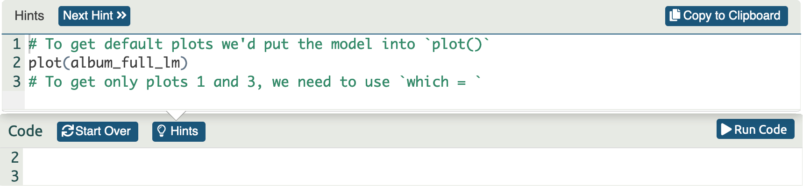

<html lang="en">

```{r setup, include=FALSE}
knitr::opts_chunk$set(
	echo = TRUE,
	message = FALSE,
	warning = FALSE
)

#necessary to render tutorial correctly
library(learnr) 
library(htmltools)
#tidyverse
library(dplyr)
library(ggplot2)
library(stringr)
library(tidyr)
#non tidyverse
library(Hmisc)
library(datawizard)
library(qqplotr)


source("./www/discovr_helpers.R")

#Read files needed for the tutorial

download_tib <- discovr::download

make_z <- function(x){
  (x - mean(x, na.rm = TRUE)) / sd(x, na.rm = TRUE)
}
```


```{r, eval = F, echo = F}
# Create bib file for R packages
here::here("inst/tutorials/discovr_06/packages.bib") |>
  knitr::write_bib(c('here', 'tidyverse', 'dplyr', 'forcats', 'readr', 'stringr', 'tibble', 'tidyr', 'knitr', 'datawizard', 'qqplotr'), file = _)
```

# discovr: The beast of bias

## Overview

<div class="infobox">
  
  
  **Usage:** This tutorial accompanies [Discovering Statistics Using R and RStudio](https://www.discovr.rocks/) [@field_discovering_2023] by [Andy Field](https://en.wikipedia.org/wiki/Andy_Field_(academic)). It contains material from the book so there are some copyright considerations but I offer them under a [Creative Commons Attribution-NonCommercial-NoDerivatives 4.0 International License](http://creativecommons.org/licenses/by-nc-nd/4.0/). Tl;dr: you can use this tutorial for teaching and non-profit activities but please don't meddle with it or claim it as your own work.
  
</div>

### `r cat_space(fill = blu)` Welcome to the `discovr` space pirate academy

Hi, welcome to **discovr** space pirate academy. Well done on embarking on this brave mission to planet `r rproj()`s, which is a bit like Mars, but a less red and more hostile environment. That's right, more hostile than a planet without water. Fear not though, the fact you are here means that you *can* master `r rproj()`, and before you know it you'll be as brilliant as our pirate leader Mae Jemstone (she's the badass with the gun). I am the space cat-det, and I will pop up to offer you tips along your journey.

On your way you will face many challenges, but follow Mae's system to keep yourself on track:

* `r bmu(height = 1.5)` This icon flags materials for *teleporters*. That's what we like to call the new cat-dets, you know, the ones who have just teleported into the academy. This material is the core knowledge that everyone arriving at space academy must learn and practice. For accessibility, these sections will also be labelled with [(1)]{.alt}.
* `r user_visor(height = 1.5)` Once you have been at space pirate academy for a while, you get your own funky visor. It has various modes. My favourite is the one that allows you to see everything as a large plate of tuna. More important, sections marked for cat-dets with visors goes beyond the core material but is still important and should be studied by all cat-dets. However, try not to be disheartened if you find it difficult. For accessibility, these sections will also be labelled with [(2)]{.alt}.
* `r user_astronaut(height = 1.5)` Those almost as brilliant as Mae (because no-one is quite as brilliant as her) get their own space suits so that they can go on space pirate adventures. They get to shout *RRRRRR* really loudly too. Actually, everyone here gets to should *RRRRRR* really loudly. Try it now. Go on. It feels good. Anyway, this material is the most advanced and you can consider it optional unless you are a postgraduate cat-det. For accessibility, these sections will also be labelled with [(3)]{.alt}.

It's not just me that's here to help though, you will meet other characters along the way:

* `r alien(height = 1.5)` aliens love dropping down onto the planet and probing humanoids. Unfortunately you'll find them probing you quite a lot with little coding challenges. Helps is at hand though. 
* `r robot(height = 1.5)` **bend-R** is our coding robot. She will help you to try out bits of `r rproj()` by writing the code for you before you encounter each coding challenge.
* `r bug(height = 1.5)` we also have our friendly alien bugs that will, erm, help you to avoid bugs in your code by highlighting common mistakes that even Mae Jemstone sometimes makes (but don't tell her I said that or my tuna supply will end). 

Also, use hints and solutions to guide you through the exercises (Figure 1).

<figure>

<figcaption>Figure 1: In a code exercise click the hints button to guide you through the exercise.</figcaption>
</figure> 
 

By for now and good luck - you'll be amazing!

### Workflow

* Before attempting this tutorial it's a good idea to work through [this tutorial on how to install, set up and work within `r rproj()` and `r rstudio()`](http://milton-the-cat.rocks/learnr/r/r_getting_started/).

* The tutorials are self-contained (you practice code in code boxes). However, so you get practice at working in `r rstudio()` I strongly recommend that you create an Quarto document within an `r rstudio()` project and practice everything you do in the tutorial in the Quarto document, make notes on things that confused you or that you want to remember, and save it. Within this Quarto document you will need to load the relevant packages and data. 


### Packages

This tutorial uses the following packages:

* `datawizard` [@R-datawizard]
* `here` [@R-here]
* `knitr` [@R-knitr]
* `qqplotr` [@qqplotr2018; @R-qqplotr]

It also uses these `tidyverse` packages [@R-tidyverse; @tidyverse2019]: `dplyr` [@R-dplyr], `forcats` [@R-forcats], `ggplot2` [@wickhamGgplot2ElegantGraphics2016], `readr` [@R-readr], `stringr` [@R-stringr] and `tidyr` [@R-tidyr].


### Coding style

There are (broadly) two styles of coding:

1. **Verbose**: Using this style you declare the package when using a function: `package::function()`. For example, if I want to use the `mutate()` function from the package `dplyr`, I will type `dplyr::mutate()`. If you adopt verbose style, you don't need to load packages at the start of your Quarto document (although see below for some exceptions).

2. **Concise**: Using this style you load all of the packages at the start of your Quarto document using `library(package_name)`, and then refer to functions without their package. For example, if I want to use the `mutate()` function from the package `dplyr`, I will use `library(dplyr)` in my first code chunk and type the function as `mutate()` when I use it subsequently.

Coding style is a personal choice. The [Google `r rproj()` style guide](https://google.github.io/styleguide/Rguide.html) and [tidyverse style guide](https://style.tidyverse.org/) recommend a verbose style, and I use it in teaching materials for two reasons (1) it helps you to remember which functions come from which packages, and (2) it prevents clashes resulting from using functions from different packages that have the same name. However, even with this style it makes sense to load `tidyverse` because the `dplyr` and `ggplot2` packages contain functions that are often used within other functions and in these cases the verbose style is difficult to read. Also, no-one wants to write `ggplot2::` before every function from `ggplot2`.

You can use either style in this tutorial because all packages are pre-loaded. If working outside of the tutorial, load the `tidyverse` package (and any others if you're using a concise style) at the beginning of your Quarto document:

```{r eval = FALSE}
library(tidyverse)
```

### Data

To work *outside of this tutorial* you need to download the following data file:

* [download_festival.csv](https://www.discovr.rocks/csv/download_festival.csv)

Set up an `r rstudio()` project in the way that [I recommend in this tutorial](http://milton-the-cat.rocks/learnr/r/r_getting_started/#section-working-in-rstudio), and save the data files to the folder within your project called `data`. Place this code in the first code chunk in your Quarto document:

```{r, eval=FALSE}
download_tib <- here::here("data/download_festival.csv") |> readr::read_csv()
```

### Preparing data

To work *outside of this tutorial* you need to convert the ticket number to a character variable (so `r rproj()` doesn't confuse it for a number) and convert gender to a categorical variable and set the order of factor levels to match the data in the `r rproj()` package. To do all of this, execute the following code:

```{r, eval=FALSE}
download_tib <- download_tib |> 
dplyr::mutate(
    ticket_no = as.character(ticket_no),
    gender = forcats::as_factor(gender) |>
      forcats::fct_relevel("Male", "Female", "Non-binary")
  )

```

## `r bmu()` The example [(1)]{.alt}

Throughout this chapter we will use an example of a biologist worried about the potential health effects of music festivals. She went to the [Download Music Festival](https://downloadfestival.co.uk/)  (those of you outside the UK can pretend it is [Roskilde Festival](https://www.roskilde-festival.dk/en/), [Coachella](https://www.coachella.com/), [Wacken](https://www.wacken.com/en/) or something) and measured the hygiene of 810 concert-goers over the three days of the festival. She tried to measure every person on every day but, because it was difficult to track people down, there were missing data on days 2 and 3. Hygiene was measured using a standardized technique that results in a score ranging between 0 (you smell like a corpse that's been left to rot up a skunk's arse) and 4 (you smell of sweet roses on a fresh spring day). The biologist predicted that personal hygiene would go down dramatically over the three days of the festival.

#### `r alien()` Alien coding challenge

The data can be found in [download_tib]{.alt}. There are 5 variables, the person's ticket number (**ticket_no**), their **gender** and their hygiene over the three days of the festival (**day_1**, **day_2** and **day_3** respectively). Use the code box to view the data.

<div class="tip">
  `r cat_space()` **Tip**
  
  Remember to view an object in `r rproj()` execute its name.
</div>

```{r dl_data, exercise = TRUE, exercise.lines = 2}

```

```{r dl_data-solution}
download_tib
```

```{r quiz_ds6_ex1, echo = FALSE}
quiz(
  question("Which of the following describes tidy data?",
    answer("Data that are arranged such that scores from a single entity appear in a single row and levels of independent or predictor variables are arranged over different columns. In designs with multiple measurements of an outcome variable within a case the outcome variable scores will be contained in multiple columns each representing a level of an independent variable, or a timepoint at which the score was observed. Columns can also represent attributes of the score or entity that are fixed over the duration of data collection, such as participant id, employment status, etc.", message = "This answer describes messy or wide data."),
    answer("Data that are arranged such that scores on a variable appear in a single column and rows represent a combination of the attributes of those scores – the entity from which the scores came, when the score was recorded, etc. Scores from a single entity can appear over multiple rows where each row represents a combination of the attributes of the score – for example, levels of an independent variable or time point at which the score was recorded.", correct = TRUE),
    correct = "Correct - well done!",
    random_answer_order = TRUE,
    allow_retry = T
  ),
  question("Are the download data in tidy or messy format?",
    answer("Tidy", message = "The download data aren't tidy becasue the hygiene scores on different days are spread across different columns rather than being in a single colum with an additional column to indicate the day of the festival that the hygiene score was measured."),
    answer("Messy", correct = TRUE),
    correct = "Correct - well done! The download data are messy because the hygiene scores on different days are spread across different columns rather than being in a single colum with an additional column to indicate the day of the festival that the hygiene score was measured.",
    random_answer_order = TRUE,
    allow_retry = T
  )
)
``` 

##	`r user_visor()` Restructuring data [(2)]{.alt}

The data are in messy format because hygiene scores across the days have been spread across three columns rather than three rows. The package `tidyr` has two functions for converting data from tidy to messy and vice versa. The function `pivot_longer()` takes columns and puts them into rows and so helps you to make messy data tidy, whereas `pivot_wider()` takes rows and puts them into columns which helps you to make tidy data messy.
 
###	`r user_visor()` Making messy data tidy [(2)]{.alt}

The `pivot_longer()` function takes this general form:

```{r eval = FALSE}
tidyr::pivot_longer(
  data = tibble,
  cols = column_names,
  names_to = "name_of_column_to_contain_variable_names",
  values_to = "name_of_column_to_contain_values",
)
```

In which [tibble]{.alt} is the name of the messy tibble that you want to make tidy and [column_names]{.alt} is a list of columns that you want to restructure into rows. The columns to be converted into rows have a name and values within each column associated with each case/entity. During restructuring, these properties will be split into two columns/variables, one containing the value for a particular case and one containing the name of the original column from which that value came. We use [names_to]{.alt} to specify a name for the new variable that contains the names of the original columns, and [value_to]{.alt} to specify a name for the new variable that will contain the values.

#### `r robot()` Code example

Within the download data we have three columns/variables (**day_1**, **day_2** and **day_3**) that we want to restructure into rows. We can specify these variables using [day_1:day_3]{.alt} or [c(day_1, day_2, day_3)]{.alt}. The scores in each of these columns represent hygiene scores, so we might use **hygiene** as the name for the variable created to contain the values after restructuring. Similarly, the columns we're transforming all represent different days at the festival so we might use **day** as the name the variable created to contain these column names. The resulting code would be:

```{r piv_long, exercise = TRUE}
download_tidy_tib <- download_tib |> 
  tidyr::pivot_longer(
  cols = day_1:day_3,
  names_to = "day",
  values_to = "hygiene",
)
```

In this code we create a new object called [download_tidy_tib]{.alt} by piping the messy data ([download_tib]{.alt}) into `pivot_longer()`. In the function, we specify the columns to restructure into rows as all columns between day_1 and day_3, we ask that the names of these columns be place in a variable called **day** and that the values in these columns be placed in a variable called **hygiene**.

#### `r alien()` Alien coding challenge

View the restructured data ([download_tidy_tib]{.alt})

```{r dl_tidy_tib, echo = FALSE}
download_tidy_tib <- download_tib |> 
  tidyr::pivot_longer(
  cols = day_1:day_3,
  names_to = "day",
  values_to = "hygiene",
)
```

```{r dl_tidy, exercise = TRUE, exercise.setup = "dl_tidy_tib"}

```

```{r dl_tidy-solution}
download_tidy_tib
```

Compare the restructured (tidy) data with the original (messy) version. Note that the hygiene scores for the first participant (ticket number 2111) are no longer spread across three columns but instead are in three rows. A new variable, **day**, tells us to which day of the festival a score relates, and a new variable, **hygiene**, contains the score itself.

<div class="tip">
  `r cat_space()` **Tip: tidying up labels**

The values in **day** match the original column names exactly ('day_1'), which sucks because in a table or plot you'd probably want to have an upper case 'd' and a space instead of an underscore ('Day 1'). We can convert the value of **day** using two functions from the `stringr` package using this code:

```{r, eval = F, class.source = '.panel_alt'}
download_tidy_tib <- download_tidy_tib |> 
   dplyr::mutate(
    day = stringr::str_to_sentence(day) |> stringr::str_replace("_", " ")
  )
```

This code recreates [download_tidy_tib]{.alt} from itself after using mutate to recreate the variable **day**. This variable is recreated from itself after passing through two functions. First, it is passed through `str_to_sentence()`, which capitalizes the 'd'. Next, it is piped into `str_replace()` which searches for an underscore and replaces it with a space. In general, `str_replace()` takes the form:

```{r, eval = F, class.source = '.panel_alt'}
str_replace(string = "text_or_variable",
            pattern = "pattern_to_replace",
            replacement = "replace_it_with")
```

When used within a pipe the stuff coming through the pipe is assigned to the [string]{.alt} argument so we don't need to specify it explicitly, we set [pattern]{.alt} to "_" (it will find the underscore), and we set [replacement]{.alt} to " " (it replaces the underscore with a space). The result is `stringr::str_replace("_", " ")`.

</div>

#### `r alien()` Alien coding challenge

Try out the code from the tip and view the resulting data.

```{r str_replace, exercise = TRUE, exercise.lines = 5, exercise.setup = "dl_tidy_tib"}

```

```{r str_replace-solution}
download_tidy_tib <- download_tidy_tib |> 
   dplyr::mutate(
    day = stringr::str_to_sentence(day) |> stringr::str_replace("_", " ")
  )
download_tidy_tib
```

###	`r user_visor()` Making tidy data messy [(2)]{.alt}

The `pivot_wider()` function reverses the process we've just been through by restructuring rows into columns. It's general form is:

```{r, eval = FALSE}
tidyr::pivot_wider(
  data = tibble,
  id_cols = variables_that_you_do_not_want_to_restructure,
  names_from = "variable_containing_the_names_of_columns",
  values_from = " variable_containing_the_scores",
)
```

Let's return the tidy version of the download data to messy format. You use [id_cols]{.alt} to define any variables that you won't want to be included in the restructuring (in this case **ticket_no** and **gender**). We use [names_from]{.alt} to tell the function from where to take the column names (in the tidy data column names are stored in the variable **day**) and [values_from]{.alt} to tell the function from where to get the scores (in the tidy data values are in the variable **hygiene**).

#### `r robot()` Code example

We can convert the tidy data back to messy using:

```{r dl_messy, exercise = TRUE, exercise.setup = "dl_tidy_tib"}
download_tib <- download_tidy_tib |> 
  tidyr::pivot_wider(
  id_cols = c(ticket_no, gender),
  names_from = "day",
  values_from = "hygiene",
)
download_tib
```

When we made the data long we renamed the days from the format where everything was lower case with no spaces (e.g., **day_1**) to a format that used sentence case and replaced the underscore with a space (e.g., **Day 1**). When converting back from long to wide, the variable names are taken from the variable **day** and so will be in the format **\`Day 1\`**, **\`Day 2\`** and **\`Day 3\`**. This is not convenient to work with because to deal with the spaces in the name will always have to enclose the variable name in backticks. For example,  so we'd want to convert them back to their original names using `rename_with` from the `dplyr` package, which allows us to select some columns and rename them using a function.

```{r, eval = F}
dplyr::rename_with(.cols = the_columns_i_want_to_rename,
                   .fn = a_function_to_rename_them
  )
```

All of the variables we want to rename begin with the word *Day* so we can take advantage of the function `starts_with` from the `tidyr` package, which will select any columns starting with whatever text we specify. In this case,

```{r, eval = F}
.cols = starts_with("Day")
```

will select all of the columns that start with the word *Day* (note we need to use an upper case D because the function is case sensitive). Next we want to apply a function to the names to change them. Essentially, we want to find the text pattern *'Day '* (note the included space) and replace it with *'day_'* (note the underscore and lower case d). In doing so *'Day 1'* will become, *'day_1'*, *'Day 2'* will become, *'day_2'* and so on. The `str_replace()` function, which we used earlier does this: it finds a specified pattern of text and replaces it with a different one. We can use this function as follows:

```{r, eval = F}
.fn = \(column) stringr::str_replace(string = column,
                                     pattern = "Day ",
                                     replacement = "day_")
```

Basically we place `str_replace()` into something called an anonymous function (aka a lambda function). Lambda functions are explained in the book but, optionally, read the information box. The code above takes each column in term, finds the text pattern *'Day '* and replaces it with *'day_'*.

<div class="infobox">
  `r info()` **Lambda functions**

In the book I discuss creating your own functions. In short, when we use a function like `mean()` we are accessing some code that someone else has written that computes a mean. We usually place something in the brackets, there are known as inputs or arguments. We can write our own functions like using this general format

```{r, eval = F}
name_of_function <- function(input, another_input){what_to_do_with_the_inputs}
```

For example, to create a function that adds two numbers we could execute

```{r, eval = F}
add_2_things <- function(first_number, second_number){first_number + second_number}
```

This code creates a new function called `add_2_things()`. The stuff in brackets tells the function to expect two inputs/arguments. I've called the first input [first_number]{.alt} and the second [second_number]{.alt}. The stuff in the curly braces then tells the function what to do with these inputs (in this case it adds the two inputs). The names I assigned to the inputs are arbitrary, these two versions of the code are equivalent to each other and to the code above

```{r, eval = F}
add_2_things <- function(x, y){x + y}
add_2_things <- function(alice, milton){alice + milton}
```

In each case we have changed the names of the inputs and carried those changes into the curly brackets. The function we have just created is called a [named function]{.alt} because we assigned it a name (`add_2_things()`) and because it has a name, we can use it within our session like any other function. For example, we can add the numbers 52 and 79 by executing

```{r, eval = F}
add_2_things(first_number = 52, second_number = 79)
```

or equivalently

```{r, eval = F}
add_2_things(52, 79)
```

In each case the function returns the result (in this case 131).  Sometimes, we need a function for a specific purpose and don't need to name it. In this case we create an [anonymous function]{.alt}, also known as a [lambda function]{.alt}. To create one of these we use this syntax

```{r, eval = F}
\(input) {what_to_do_with_the_input}
```

Note that because we're not assigning the function a name we use `\()` as shorthand for `function()`. It's also not necessary to use the curly braces if the contents of the function is a single line of code. The anonymous function below squares whatever number you put into it

```{r, eval = F}
\(x) {x^2}
```

Again, [x]{.alt} is an arbitrary label. This code is equivalent

```{r, eval = F}
\(number) {number^2}
```

but by labelling the input as `number` we make the code more readable because it we can see that the function expects a number as its input `\(number)` and squares whatever that number is as its output `{number^2}`.

</div>

#### `r robot()` Code example

Putting all of the above together, we can rename the variables using the following code

```{r dl_messy_tib, echo = FALSE, exercise.setup = "dl_tidy_tib"}
download_tib <- download_tidy_tib |> 
  tidyr::pivot_wider(
  id_cols = c(ticket_no, gender),
  names_from = "day",
  values_from = "hygiene",
)
```

```{r dl_rename, exercise = TRUE, exercise.lines = 8 , exercise.setup = "dl_messy_tib"}
download_tib <- download_tib |> 
  dplyr::rename_with(.cols = starts_with("Day"),
                     .fn = \(column) stringr::str_replace(string = column,
                                                          pattern = "Day ",
                                                          replacement = "day_")
                     )

download_tib
```

Let's break this code down. The [download_tib]{.alt} is piped into the `rename_with()` function, within which

* `.cols = starts_with("Day")` finds all of the columns within [download_tib]{.alt} that begin with the word *Day*.
* `.fn = \(column) stringr::str_replace(string = column, pattern = "Day ", replacement = "day_")` creates a function that will be applied to the columns specified by `.cols` (in this case, the function will be applied to the variables that begin with the word *Day*).  Notice that we've named the input of the function as [column]{.alt} to remind us that we're feeding column names from [download_tib]{.alt} into it, but we could have named it something different. Next, we tell the function what to do with each column `str_replace(string = column, pattern = "Day ", replacement = "day_")`. Notice that within `str_replace()` we set the data argument to be the input of the function ([string = column]{.alt}).

Our variables are now renamed **day_1**, **day_2** and **day_3**.

## `r bmu()` Spotting outliers [(1)]{.alt}

An outlier is  a score very different from the other scores. We will look at two ways to spot outliers:

1. Visualise the data and look for unusual cases.
2. Look for values that our statistical model predicts poorly. We can do this using the model residuals, which were explained in the book.


```{r quiz_ds6_ex2, echo = FALSE}
quiz(
  question("What are the model residuals?",
    answer("The differences between the values a model predicts and the values observed in the data on which the model is based", correct = TRUE, ),
    answer("Scores expressed in standard deviation units.", message = "This answer describes *z*-scores."),
    answer("The predicted values from the model.", message = "This answer describes the predicted values."),
    answer("The values in the sample on which the model is based.", message = "This answer describes the observed values."),
    correct = "Correct - well done!",
    random_answer_order = TRUE,
    allow_retry = T
  )
)
``` 


### `r bmu()`	Histograms and boxplots [(1)]{.alt}

#### `r alien()` Alien coding challenge

If you completed previous tutorials you should know how to produce histograms and boxplots. Plot a histogram of the hygiene scores on day 1 of the festival. Use the messy version of the data ([download_tib]{.alt}). Use a binwidth of 0.2, a fill colour of [#56B4E9]{alt}", a line colour of [#336c8b]{.alt}, and transparency of 0.2. Apply axis labels and a theme.

```{r dl_hist, exercise = TRUE, exercise.lines = 6, exercise.setup = "dl_tidy_tib"}

```

```{r dl_hist-hint-1}
# Setup the plot with:
ggplot2::ggplot(download_tib, aes(day_1)) +
```

```{r dl_hist-hint-2}
# Add the histogram geom:
ggplot2::ggplot(download_tib, aes(day_1)) +
geom_histogram()
# Now change the binwidth, fill, colours and transparency
```

```{r dl_hist-hint-3}
# change the binwidth, fill, colours and transparency
ggplot2::ggplot(download_tib, aes(day_1)) +
  geom_histogram(binwidth = 0.2, fill = "#56B4E9", colour = "#336c8b", alpha = 0.2)
# Now add labels
```

```{r dl_hist-hint-4}
# Labels added:
ggplot2::ggplot(download_tib, aes(day_1)) +
  geom_histogram(binwidth = 0.2, fill = "#56B4E9", colour = "#336c8b", alpha = 0.2) +
  labs(y = "Frequency", x = "Hygiene scores (0-5)", title = "Hygiene scores on day 1")
# Finally, apply a theme
```

```{r dl_hist-hint-5}
# Solution:
ggplot2::ggplot(download_tib, aes(day_1)) +
  geom_histogram(binwidth = 0.2, fill = "#56B4E9", colour = "#336c8b", alpha = 0.2) +
  labs(y = "Frequency", x = "Hygiene scores (0-5)", title = "Hygiene scores on day 1") +
  theme_minimal()
```

#### `r alien()` Alien coding challenge

Plot a boxplot of the hygiene scores on day 1 of the festival. Set the fill colour to ["#5c97bf"]{.alt} and transparency to 0.7, put breaks along the *y*-axis from 0 to 20 in steps of 2, add labels to the *x*- and *y*-axis and apply a theme.

<div class="tip">
  `r cat_space()` **Tip: Plotting a single column**

In previous tutorials we have plotted boxplots where the *x*-axis represents categories or groups, and you get a boxplot for each category. Here we just want a single boxplot for a single set of scores (the day 1 hygiene scores). To achieve this we specify the *x*-axis variable within the `aes()` function as [x = "some_text"]{.alt} in which we replace [some_text]{.alt} with whatever label we want to appear as the tick label on the *x*-axis. For example, in this case we might specify [x = "Day 1"]{.alt} because the boxplot will summarize the day 1 hygiene scores.
</div>

```{r dl_box, exercise = TRUE, exercise.lines = 5, exercise.setup = "dl_tidy_tib"}

```

```{r dl_box-hint-1}
# Setup the plot with:
ggplot2::ggplot(download_tib, aes(x = "Day 1", y = day_1)) +
```

```{r dl_box-hint-2}
# Add the boxplot geom:
ggplot2::ggplot(download_tib, aes(x = "Day 1", y = day_1)) +
  geom_boxplot()
# Now change the binwidth, fill, colours and transparency
```

```{r dl_box-hint-3}
# change the binwidth, fill, colours and transparency
ggplot2::ggplot(download_tib, aes(x = "Day 1", y = day_1)) +
  geom_boxplot(fill = "#5c97bf", alpha = 0.7)
# Now put breaks along the y-axis from 0 to 20 in steps of 2
```

```{r dl_box-hint-4}
# Added breaks along the y-axis from 0 to 20 in steps of 2
ggplot2::ggplot(download_tib, aes(x = "Day 1", y = day_1)) +
  geom_boxplot(fill = "#5c97bf", alpha = 0.7) +
  scale_y_continuous(breaks = seq(0, 20, 2))
# Now add labels
```

```{r dl_box-hint-5}
# Labels added:
ggplot2::ggplot(download_tib, aes(x = "Day 1", y = day_1)) +
  geom_boxplot(fill = "#5c97bf", alpha = 0.7) +
  scale_y_continuous(breaks = seq(0, 20, 2)) +
  labs(x = "Day of festival", y = "Hygiene scores (0-5)")
# Finally, apply a theme
```

```{r dl_box-solution}
ggplot2::ggplot(download_tib, aes(x = "Day 1", y = day_1)) +
  geom_boxplot(fill = "#5c97bf", alpha = 0.7) +
  scale_y_continuous(breaks = seq(0, 20, 2)) +
  labs(x = "Day of festival", y = "Hygiene scores (0-5)") +
  theme_minimal()
```


The resulting histogram and boxplot look odd: there is one case that is very different from the others. It has a value of 20, which is particularly odd because it exceeds the top of our scale (our hygiene scale ranged from 0 to 4). It must be a mistake. The quickest way to find this case is to use the `filter()` function (explained in **discovr_01**) to filter the data using a rule that returns values for the variable **day_1** that are greater than 4 (the maximum of the scale). Doing so will return the one case that for which this is true.

#### `r alien()` Alien coding challenge

Filter [download_tib]{.adj} to show only the cases with scores greater than 4 for the variable **day_1**.

```{r dl_filter, exercise = TRUE, exercise.lines = 4}

```

```{r dl_filter-solution}
download_tib |> 
  dplyr::filter(day_1 > 4)
```

It turns out that the person with ticket number 4158 has a hygiene score of 20.02, which is probably a mistyping of 2.02. We'd have to go back to the raw data and check. We'll assume we've checked the raw data and this score should be 2.02, we need to replace the value 20.02 with the value 2.02 before continuing. We can do this using the `dplyr::recode()` function.

#### `r robot()` Code example

We use mutate() to recreate the variable **day_1** from a version itself that has been processed by the `recode()` function. Within the recode() function, we tell `r rproj()` to replace any value of 20.02 (note the quotes) it finds with the value 2.02. We assign the corrected data back to the original object  ([download_tib]{.alt}) so that when we use the tibble we are using the corrected version.

```{r recode, exercise = TRUE, exercise.lines = 6}
download_tib <- download_tib |>
  dplyr::mutate(
    day_1 = dplyr::recode(day_1, `20.02` = 2.02)
  )
download_tib
```


```{r dl_tib}
download_tib <- download_tib |>
  dplyr::mutate(
    day_1 = dplyr::recode(day_1, `20.02` = 2.02)
  )

download_tidy_tib <- download_tib |> 
  tidyr::pivot_longer(
  cols = day_1:day_3,
  names_to = "day",
  values_to = "hygiene",
)
```


<div class="tip">
  `r cat_space()` **Tip: Recoding the long data**

  Having corrected the mis-entered data point in the wide data file ([download_tib]{.alt}), we would need to recreate the long version of the data including the corrected score using
  
```{r, eval = F, class.source = '.panel_alt'}
download_tidy_tib <- download_tib |> 
  tidyr::pivot_longer(
  cols = day_1:day_3,
  names_to = "day",
  values_to = "hygiene",
)
```

I have done this for you within this tutorial, so from this point on [download_tidy_tib]{.alt} contains the corrected data.

</div>


#### `r alien()` Alien coding challenge

Filter [download_tib]{.adj} to show only the case with ticket number 4158 to check that their **day_1** hygiene score is now 2.02.

```{r dl_filter2, exercise = TRUE, exercise.lines = 4, exercise.setup = "dl_tib"}

```

```{r dl_filter2-solution}
download_tib |> 
  dplyr::filter(ticket_no == "4158")
```
 
#### `r alien()` Alien coding challenge

Re-plot the histogram and boxplot (you can use exactly the same code as before).

```{r dl_hist_box, exercise = TRUE, exercise.lines = 8, exercise.setup = "dl_tib"}


```

```{r dl_hist_box-solution}
ggplot2::ggplot(download_tib, aes(day_1)) +
  geom_histogram(binwidth = 0.2, fill = "#56B4E9", colour = "#336c8b", alpha = 0.2) +
  labs(y = "Frequency", x = "Hygiene scores (0-5)", title = "Hygiene scores on day 1") +
  theme_minimal()

ggplot2::ggplot(download_tib, aes(x = "Day 1", y = day_1)) +
  geom_boxplot(fill = "#5c97bf", alpha = 0.7) +
  scale_y_continuous(breaks = seq(0, 20, 2)) +
  labs(x = "Day of festival", y = "Hygiene scores (0-5)") +
  theme_minimal()
```

After the mis-entered value has been corrected, neither plot indicates any particularly extreme scores.

#### `r alien()` Alien coding challenge

Use [download_tidy_tib]{.alt} to produce boxplots for all days of the festival and use `facet_wrap()` to show separate plots for each gender. Set the transparency to 0.7, set breaks on the *y*-axis to be 1, 2, 3 & 4.

```{r dl_box_all, exercise = TRUE, exercise.lines = 7, exercise.setup = "dl_tib"}

```

```{r dl_box_all-hint-1}
# Setup the plot with:
ggplot2::ggplot(download_tidy_tib, aes(day, hygiene, fill = gender)) +
```

```{r dl_box_all-hint-2}
# Add the boxplot geom:
ggplot2::ggplot(download_tidy_tib, aes(day, hygiene, fill = gender)) +
  geom_boxplot()
# Now change the binwidth, fill, colours and transparency
```

```{r dl_box_all-hint-3}
# change the transparency
ggplot2::ggplot(download_tidy_tib, aes(day, hygiene, fill = gender)) +
  geom_boxplot(alpha = 0.7)
# Now put breaks along the y-axis from 0 to 4 in steps of 1
```

```{r dl_box_all-hint-4}
# Added breaks along the y-axis from 0 to 4 in steps of 1
ggplot2::ggplot(download_tidy_tib, aes(day, hygiene, fill = gender)) +
  geom_boxplot(alpha = 0.7) +
  scale_y_continuous(breaks = seq(0, 4, 1))
# Now add labels for x, y, and fill colour
```


```{r dl_box_all-hint-5}
# Added labels
ggplot2::ggplot(download_tidy_tib, aes(day, hygiene, fill = gender)) +
  geom_boxplot(alpha = 0.7) +
  scale_y_continuous(breaks = seq(0, 4, 1))
  labs(x = "Day of festival", y = "Hygiene scores (0-5)", fill = "Gender")
# Now use facet_wrap to produces separate panels for each gender
```

```{r dl_box_all-hint-6}
# facet_wrap added:
ggplot2::ggplot(download_tidy_tib, aes(day, hygiene, fill = gender)) +
  geom_boxplot(alpha = 0.7) +
  scale_y_continuous(breaks = seq(0, 4, 1)) +
  labs(x = "Day of festival", y = "Hygiene scores (0-5)", fill = "Gender") +
  facet_wrap(~ gender)
# Finally, apply a theme
```

```{r dl_box_all-solution}
ggplot2::ggplot(download_tidy_tib, aes(day, hygiene, fill = gender)) +
  geom_boxplot(alpha = 0.7) +
  scale_y_continuous(breaks = seq(0, 4, 1)) +
  labs(x = "Day of festival", y = "Hygiene scores (0-5)", fill = "Gender") +
  facet_wrap(~ gender) +
  theme_minimal()
```

The pattern of hygiene scores across the three days is consistent for all genders: hygiene decreases from day 1 to day 2, but stays at similar levels to day 2 on day 3. There look like some potential outliers for people who self-classified as male and female on day 2 (and some males on day 1).
 
### `r bmu()` Standardizing raw scores [(1)]{.alt}

Any score can be converted to a *z*-score, which has known distributional properties. This section looks at how to use these standardized scores to look for outliers. Everything in this section can be applied to model residuals too (see **discovr_08**). To standardize raw scores we take the score, subtract from it the mean of all scores and divide by the standard deviation of all scores:

$$
z = \frac{x-\bar{X}}{s}
$$

We can convert scores to *z*-scores by using `mutate()` alongside functions that compute the mean and standard deviation.

#### `r robot()` Code example

For our day 1 hygiene scores, we could do this transformation using like code:

```{r, eval = FALSE}
download_tib <- download_tib |> 
  dplyr::mutate(
    zday_1 = (day_1 - mean(day_1, na.rm = T))/sd(day_1, na.rm = T)
  )
download_tib
```

In which we use `mutate()` to create a new variable called [zday_1]{.adj}, which is the mean of all scores on day 1 subtracted from the raw score for each person on day 1, divided by the standard deviation of all scores on day 1. (Note the brackets around day_1 - mean(day_1, na.rm = T), which ensures that this entire expression is divided by the standard deviation.)

#### `r alien()` Alien coding challenge

Use the example code to create variables **zday_1**, **zday_2** and **zday_3** containing *z*-scores for days 1, 2 and 3 respectively.

```{r z_easy, exercise = TRUE, exercise.lines = 8, exercise.setup = "dl_tib"}

```

```{r z_easy-hint-1}
# Set up the mutate function:
download_tib <- download_tib |> 
  dplyr::mutate(
    
  )

# now use the example code to create three
# 'mutations' that create zday_1, zday_2 & zday_3
```

```{r z_easy-solution}
download_tib <- download_tib |> 
  dplyr::mutate(
    zday_1 = (day_1 - mean(day_1, na.rm = T))/sd(day_1, na.rm = T),
    zday_2 = (day_2 - mean(day_2, na.rm = T))/sd(day_2, na.rm = T),
    zday_3 = (day_3 - mean(day_3, na.rm = T))/sd(day_3, na.rm = T)
  )
download_tib
```

### `r user_astronaut()` Using a function to compute *z* [(3)]{.alt}

The previous method is fine, but we're writing code to do the same thing multiple times. In situations like this, where we want to convert multiple variables in the same way it can be more efficient to use a function. If you're feeling confident with `r rproj()` try this optional section. Instead of repeating the code to compute *z* for each variable, we instead write a function that we reuse (we can also use built-in functions in the same way).

#### `r robot()` Code example

This code creates a function called [make_z]{.alt} that takes in a set of scores (which I've called [x]{.adj}), then converts them to *z* using the code that we just used except that the specific variable name is replaced with [x]{.adj} (the variable entered into the function). 

```{r make_z, exercise = TRUE, exercise.lines = 6}
make_z <- function(x){
  (x - mean(x, na.rm = TRUE)) / sd(x, na.rm = TRUE)
}
```

Execute the code. Nothing will happen, but in fact you have created the function `make_z()`, that takes a single input, which is a set of scores. For example, if we execute `make_z(download_tib$day_1)` the function will return the *z*-scores corresponding to the values in **day_1** in the [download_tib}{.alt} tibble. Try adding this code underneath where you created the function and executing it. You should see a bunch of *z*-scores appearing. These are the *z*=scores corresponding to the raw scores in **day_01**.

If we use `dplyr::across()` within `mutate()` we can apply our function `make_z()` to multiple variables simultaneously. The function `across()` applies a mutation across certain columns (hence, the name). It works similarly to `rename_with()`, which we used earlier.

#### `r robot()` Code example

In general, you'd use `mutate()` and `across()` in combination like this:

```{r eval = F}
dplyr::mutate(
    dplyr::across(
      .cols = variables_we_want_to_mutate,
      .fn = mutation_to_be_applied,
      .names = how_to_name_the_new_variables
      )
  )
```

In which you replace [variables_we_want_to_mutate]{.alt} with a list of variables to mutate (in this case **day_1** to **day_3**), replace [mutation_to_be_applied]{.alt} with instructions on how the mutation should be done, and replace .

#### `r robot()` Code example

For example, to apply the `make_z()` function to variables **day_1**, **day_2** and **day_3** simultaneously we could execute:

```{r make_z_2, exercise = TRUE, exercise.lines = 5, exercise.setup = "dl_tib"}
download_tib <- download_tib |> 
  dplyr::mutate(
    dplyr::across(.cols = day_1:day_3,
                  .fn = \(column) make_z(column),
                  .names = "z{.col}")
  )
download_tib
```

This code pipes the data ([download_tib]{.alt}) into the `mutate()` function, inside which it goes into the `across()` function, where three things happen.

* `.cols = day_1:day_3`. First, we select the variables to mutate across. We specify the variables as [day_1:day_3]{.alt}, which means all the variables in the tibble starting with **day_1** and finishing with **day_3**. An alternative would be to use `starts_with("day")`, which selects all of the variables that have a name beginning with the word 'day'.
* `.fn = \(column) make_z(column)`. Next we send each of the selected columns off to the function we wrote called `make_z()`. We're using a lambda function again here (see earlier), the `\(column)` means 'take each column' (the word column is my choice to remind me what is being passed into the function) and the `make_z(column)` means 'send it off to `make_z()` to get the *z*-scores'. If you care more about quick typing than about readable code then `.fn = \(x) make_z(x)` is equivalent code, if you care more about being arbitrary than readable code then `.fn = \(truculent_swordfish) make_z(truculent_swordfish)` is equivalent.
* `.names = "z{.col}"`. Finally, by including [.names = "z\{.col\}"]{.alt} the resulting variables will be named after the original columns ([\{.col\}]{.alt} refers to the original column names) but prefixed with 'z'  (so, ["z\{.col\}"]{.alt} means *the letter z followed by the original column name*). The new variables (**zday_1**, **zday_2** and **zday_3**) will be stored as the final three columns in the tibble.

### `r user_visor()` Using standardized scores to detect outliers [(2)]{.alt}

We now have *z*-scores of hygiene on each day of the festival. We can apply a filter to the data so that we see only large values of *z*.

#### `r robot()` Code example

If we want to see only cases with a *z*-score for **day_1** less than $-1.96$ or greater than $1.96$ we could execute: 

```{r eval = F}
download_tib |> 
  dplyr::filter(abs(zday_1) >= 1.96) |> 
  dplyr::arrange(zday_1)
```

This code pipes the data into `filter()` where we set the criteria that the absolute value of the variable **zday_1** must be greater or equal to 1.96 (that's what [abs(zday_1) >= 1.96]{.alt} does). Finally (and optionally) we pipe the tibble into `arrange()` to sort it by **zday_1**, so that the resulting table will list cases from the smallest standardized residual to the largest.

```{r dlz_tib}
download_tib <- download_tib |>
  dplyr::mutate(
    day_1 = dplyr::recode(day_1, `20.02` = 2.02)
  ) |>
  dplyr::mutate(
    dplyr::across(.cols = day_1:day_3,
                  .fn = \(column) make_z(column),
                  .names = "z{.col}")
  )
```

We also want to look at day 2 and day 3. We could do this separately by filtering by each day in turn by adapting the previous code, or we can use the `if_any()` function to apply a condition to multiple variables. The `if_any()` function from `dplyr` allows us to specify a condition and apply it to multiple columns. When used within `filter()` then 'if any' of the columns meet the condition the row is retained. It has the general form

```{r, eval = F}
dplyr::if_any(
  .cols = columns_to_which_i_want_to_apply_the_condition,
  .fn = the_condition_i_want_to_apply
)
```

#### `r robot()` Code example

Again, we want to use an anonymous function to specify the condition, so the code we use is 

```{r filter_at, exercise = TRUE, exercise.setup = "dlz_tib"}
download_tib |> 
  dplyr::filter(
    dplyr::if_any(
      .cols = zday_1:zday_3,
      .fn = \(column) column >= 2.58
      )
    )
```

Note that within the `filter()` function we use `if_any()` and within that

* `.cols = zday_1:zday_3` selects the columns containing the *z*-scores of hygiene fro the three days of the festival.
* `.fn = \(column) column >= 2.58` sets the condition. The `\(column)` says *for each column selected* and `column >= 2.58` says *check whether the values are greater or equal to 2.58*. If the condition is met, the row of that column will be retained.

This code is the same as using the logical operator OR, we're basically saying that if **zday_1** OR **zday_2** OR **zday_3** is greater than or equal to 2.58 then retain the case.

It turns out that there are 8 cases (out of 200) who have *z*-scores greater than or equal to 2.58 on at least one of the days, which is about what we'd expect (4% of cases). There are only two cases with *z*-scores greater than 3.29 (case 3374 on day 2 and case 4564 on days 2 and 3).
 

## `r bmu()` Spotting normality [(1)]{.alt}

There are times when we want to know whether scores (or residuals are normally distributed. This section reviews some ways to do that, but we return to the topic in **discovr_08**. 


### `r bmu()` Using plots to spot normality [(1)]{.alt}

Frequency distributions are not only good for spotting outliers, they are the natural choice for looking at the shape of the distribution as we saw from plotting the day 1 scores earlier. Two alternatives are a probability-probability plot or P-P plot and a quantile-quantile plot, or Q-Q plot. A P-P plot plots the cumulative probability of a variable against the cumulative probability of a particular distribution (in this case a normal distribution). The data are ranked and sorted, then for each rank the corresponding *z*-score is calculated to create an 'expected value' that the score should have in a normal distribution. Next, the score itself is converted to a *z*-score. The actual *z*-score is plotted against the expected *z*-score. The Q-Q plot does something similar except that it plots the quantiles of the data against the quantiles of the desired distribution instead of every individual score.

The interpretation of these plots is basically the same. If scores follow the desired distribution then the observed *z*-score or quantile will be the same as the *z*-score or quantile that you'd expect from that distribution and the points on the plot will form a straight diagonal line. When scores are normally distributed the dots on the Q-Q plot follow the diagonal line that represents perfect normality and they all fall within the confidence band around that line. If scores are positively skewed then the points of the Q-Q plot sag downwards in the middle, and for negative skew the opposite is true: points curve upwards in the middle. Note that some of the points fall outside of the confidence band around the diagonal line. When there are too many scores in the tails (a heavy-tailed distribution) the points form an S with points curving down below the diagonal line at the left of the *x*-axis and rising above it at the right. The points also form an S when there are too few scores in the tails (a light-tailed distribution) but they curve an S upwards from the diagonal at the left of the *x*-axis and curve downwards from the diagonal at the right. Again, points at the extremes go beyond the confidence band around the diagonal line. If you have a lot of scores Q-Q plots can be easier to interpret than P-P plots because they display fewer values.

#### `r robot()` Code example

We can use the `qqplotr` package,to create a Q-Q plot. We set up the plot much like any other plot:

```{r, eval = F}
ggplot2::ggplot(my_tib, aes(sample = variable_to_plot))
```

In which you replace [my_tib]{.alt} with the name of the tibble containing the data, and [variable_to_plot]{.alt} with the name of the variable you want to plot. The main difference to previous plots is that we use the [sample]{.alt} argument within `aes()` to specify the variable we want to plot. Having set up the plot, we apply three layers using different functions in this order: 

* `stat_qq_band()`. This function draws a confidence band around the diagonal line. By default, the function uses a confidence interval based on the normal distribution, but you can change this to an interval based on a parametric bootstrap by including [bandType = "boot"]{.alt}, or a band based on the Kolmorgorov-Smirnov test by including [bandType = "ks"]{.alt}).
* `stat_qq_line()`. This function draws the diagonal line representing the idealized distribution.
* `stat_qq_point()`. This function draws the observed values (the dots).

Therefore, we can create a basic Q-Q plot for the tidy version of the data in [download_tidy_tib]{.alt} with this code:

```{r qq_basic, exercise = TRUE, exercise.lines = 4, exercise.setup = "dl_tib"}
 ggplot2::ggplot(download_tidy_tib, aes(sample = hygiene)) +
  qqplotr::stat_qq_band() +
  qqplotr::stat_qq_line() +
  qqplotr::stat_qq_point()
```

This code plots the variable **hygiene** from [download_tidy_tib]{.alt}. However, because we have used the tidy version of the data, the values of **hygiene** have come from all three days of the festival. It might be useful to split them according to the day of the festival. Luckily, because `qqplotr` creates ggplot objects, we can easily do this by adding a layer that includes `facet_wrap()` and splits the data by the variable **day**.

#### `r alien()` Alien coding challenge

Cope the code in the example above and add to the bottom a layer that splits the data by the variable **day** using `facet_wrap()`. While you're at it, add `theme_minimal()`.

```{r qq_facet, exercise = TRUE, exercise.lines = 6, exercise.setup = "dl_tib"}
 ggplot2::ggplot(download_tidy_tib, aes(sample = hygiene)) +
  qqplotr::stat_qq_band() +
  qqplotr::stat_qq_line() +
  qqplotr::stat_qq_point()
```

```{r qq_facet-hint-1}
# Add facet_wrap:
 ggplot2::ggplot(download_tidy_tib, aes(sample = hygiene)) +
  qqplotr::stat_qq_band() +
  qqplotr::stat_qq_line() +
  qqplotr::stat_qq_point() +
  facet_wrap(~ day)

# Now add theme_minimal()
```

```{r qq_facet-hint-2}
# Solution:
 ggplot2::ggplot(download_tidy_tib, aes(sample = hygiene)) +
  qqplotr::stat_qq_band() +
  qqplotr::stat_qq_line() +
  qqplotr::stat_qq_point() +
  facet_wrap(~ day) +
  theme_minimal()
```

We can also add labels and titles, and within each function we can set aesthetics such as colours, shapes, sizes, transparency and so on, just as we would with any ggplot object.


#### `r alien()` Alien coding challenge

Adapt the code to do the following:

* Set the fill of the confidence interval to blue ([#5c97bf"]{.alt}), and the transparency to 0.3.
* Set the colour of the line to the same colour as the confidence interval.
* Set the transparency of the data points to 0.2 and their size to 1.
* Add the label "Theoretical quantiles" to the *x*-axis and "Sample quantiles" to the *y*-axis.

```{r qq_full, exercise = TRUE, exercise.lines = 7, exercise.setup = "dl_tib"}
 ggplot2::ggplot(download_tidy_tib, aes(sample = hygiene)) +
  qqplotr::stat_qq_band() +
  qqplotr::stat_qq_line() +
  qqplotr::stat_qq_point() +
  facet_wrap(~ day) +
  theme_minimal()
```

```{r qq_full-hint-1}
# Set the fill of the confidence interval to blue ([#5c97bf"]{.alt}), and the transparency to 0.3:
 ggplot2::ggplot(download_tidy_tib, aes(sample = hygiene)) +
  qqplotr::stat_qq_band(fill = "#5c97bf", alpha = 0.3) +
  qqplotr::stat_qq_line() +
  qqplotr::stat_qq_point() +
  facet_wrap(~ day) +
  theme_minimal()
```

```{r qq_full-hint-2}
# Set the colour of the line to the same colour as the confidence interval.
 ggplot2::ggplot(download_tidy_tib, aes(sample = hygiene)) +
  qqplotr::stat_qq_band(fill = "#5c97bf", alpha = 0.3) +
  qqplotr::stat_qq_line(colour = "#5c97bf") +
  qqplotr::stat_qq_point() +
  facet_wrap(~day) +
  theme_minimal()
```

```{r qq_full-hint-3}
# Set the transparency of the data points to 0.2 and their size to 1:
 ggplot2::ggplot(download_tidy_tib, aes(sample = hygiene)) +
  qqplotr::stat_qq_band(fill = "#5c97bf", alpha = 0.3) +
  qqplotr::stat_qq_line(colour = "#5c97bf") +
  qqplotr::stat_qq_point(alpha = 0.2, size = 1) +
  facet_wrap(~day) +
  theme_minimal()
```

```{r qq_full-hint-4}
# Add the label "Theoretical quantiles" to the *x*-axis and "Sample quantiles" to the *y*-axis:
 ggplot2::ggplot(download_tidy_tib, aes(sample = hygiene)) +
  qqplotr::stat_qq_band(fill = "#5c97bf", alpha = 0.3) +
  qqplotr::stat_qq_line(colour = "#5c97bf") +
  qqplotr::stat_qq_point(alpha = 0.2, size = 1) +
  labs(x = "Theoretical quantiles", y = "Sample quantiles") +
  facet_wrap(~day) +
  theme_minimal()
```


We looked at the day 1 scores earlier with a histogram and concluded that they looked quite normal. The Q-Q plot echoes this view because the data points fall close to the 'ideal' diagonal line and within the confidence band around it. However, the distributions for days 2 and 3 look positively skewed. This can be seen in the Q-Q plots by the data points dipping in the middle to form a curve and points falling outside of the confidence band at the extremes. These plots suggest that relative to day 1, hygiene scores on days 2 and 3 were more clustered around the low end of the scale (more people were less hygienic); so people became smellier as the festival progressed. The skew on days 2 and 3 occurs because a minority insisted on upholding their levels of hygiene over the course of the festival (baby wet-wipes are indispensable, I find).

### `r user_visor()`	More summary statistics [(1)]{.alt}

In `discovr_02` and `discovr_04` we used the `describe_distribution()` function to get summary statistics such as the mean, confidence interval, and the IQR. This function also returns values of skew and kurtosis. 

#### `r alien()` Alien coding challenge

Use what you have learnt from previous tutorials to write some code that takes the festival data ([download_tib]{.adj}) and calculates only the mean and 95% confidence interval, skew and kurtosis for hygiene scores on each day. Print the table to 3 decimal places.

<div class="tip">
  `r cat_space()` **Hint**

You will need to set the arguments in the function to switch off the interquartile range and range.

</div>


```{r hygiene_sum, exercise = TRUE, exercise.lines = 8, exercise.setup = "dl_tib"}

```

```{r hygiene_sum-hint-1}
# Start by piping the data ...
download_tib |> 
  datawizard::describe_distribution()
  ...
# Now think about how you will change the default settings for the arguments in the function.
# Use the hint!
```

```{r hygiene_sum-hint-2}
# select the variables (replace the xs)
download_tib |> 
  datawizard::describe_distribution(select = xxx:xxx)
```

```{r hygiene_sum-hint-3}
# replace the xxs
download_tib |> 
  datawizard::describe_distribution(select = day_1:day_3,
                                    iqr = xxx,
                                    range = xxx,
                                    ci = xxx,
                                    iterations = xxx)
```


```{r hygiene_sum-solution}
download_tib |> 
  datawizard::describe_distribution(select = day_1:day_3,
                                    iqr = F,
                                    range = F,
                                    ci = 0.95,
                                    iterations = 500) |>
  knitr::kable(digits = 3)
```

On average, hygiene scores were 1.77 (out of 5) on day 1 of the festival, but went down to 0.96 and 0.98 on days 2 and 3 respectively. For day 1 the skew value is very close to the expected value of zero (which is good) and kurtosis is a little negative. For days 2 and 3, though, there is a skewness of around 1 (positive skew) and kurtosis is positive, suggesting heavier tails than a normal distribution. We can also see that 546 of the original 810 cases are missing on day 2 and 687 are missing at day 3.


### `r user_visor()`	Exploring multiple groups [(2)]{.alt}

We have already looked at (in previous tutorials) how to use the `group_by()` function to apply code to groups of scores separately. We have data for people who self-classify under different gender labels (in the variable **gender**). What if we wanted to summarize the hygiene scores by both day of the festival *and* how the person classifies their **gender** (given the available options).

#### `r robot()` Code example

Actually, this is incredibly easy, we include **gender** within the `group_by()` function before we pipe it into `describe_distribution()`.

```{r eval = F}
download_tidy_tib |> 
  dplyr::group_by(gender) |> 
  datawizard::describe_distribution()
```

#### `r alien()` Alien coding challenge

The code for the previous challenge is below, adapt it to get summary statistics for each day of the festival within different gender classifications.

```{r hygiene_groupby, exercise = TRUE, exercise.lines = 8, exercise.setup = "dl_tib"}
download_tib |> 
  datawizard::describe_distribution(select = day_1:day_3,
                                    iqr = F,
                                    range = F,
                                    ci = 0.95,
                                    iterations = 500) |>
  knitr::kable(digits = 3)
```

```{r hygiene_groupby-solution}
download_tib |> 
  dplyr::group_by(gender) |> 
  datawizard::describe_distribution(select = day_1:day_3,
                                    iqr = F,
                                    range = F,
                                    ci = 0.95,
                                    iterations = 500) |>
  knitr::kable(digits = 3)
```


<div class="infobox">
  
  
  **A message from Mae Jemstone:**
  
  As space pirates, exploring is what we do. Exploring to the left, exploring to the right, exploring all day, exploring all night. It's in our blood. This lesson has been all about exploring data and learning how to spot unusual cases and look for problems in the distributions of scores. It may not have been as exciting as whizzing around space at hyperspeed, but being a space pirate isn't all about hyperspeed, sometimes you need to navigate slowly and meticulously to spot the the space billiods lurking around waiting to mess up your assumptions. No-one likes a space billiod, trust me. Even fewer people like having their assumptions messed with. You now have the tools to spot problems in your data. Well done, explorers!
</div>


## Resources {data-progressive=FALSE}

### Statistics

* The tutorials typically follow examples described in detail in @field_discovering_2023. That book covers the theoretical side of the statistical models, and has more depth on conducting and interpreting the models in these tutorials.
* If any of the statistical content doesn't make sense, you could try my more introductory book *An adventure in statistics* [@fieldAdventureStatisticsReality2016].
* There are free lectures and screencasts on my [YouTube channel](https://www.youtube.com/user/ProfAndyField/).
* There are free statistical resources on my websites [www.discoveringstatistics.com](http://www.discoveringstatistics.com) and [milton-the-cat.rocks](http://milton-the-cat.rocks).

### `r rproj()`

* [R for data science](http://r4ds.had.co.nz/index.html) by @wickhamDataScience2017 is an open-access book by the creator of the tidyverse (Hadley Wickham). It covers the *tidyverse* and data management.
* [ModernDive](http://moderndive.com/index.html) is an open-access textbook on `r rproj()` and `r rstudio()`.
* [`r rstudio()` cheat sheets](https://www.rstudio.com/resources/cheatsheets/).
* [`r rstudio()` list of online resources](https://www.rstudio.com/online-learning/).

### Acknowledgement

I'm extremely grateful to [Allison Horst](https://www.allisonhorst.com/) for her very informative blog post on [styling learnr tutorials with CSS](https://education.rstudio.com/blog/2020/05/learnr-for-remote/) and also for sending me a CSS template file and allowing me to adapt it. Without Allison, these tutorials would look a lot worse (but she can't be blamed for my colour scheme).

## References


