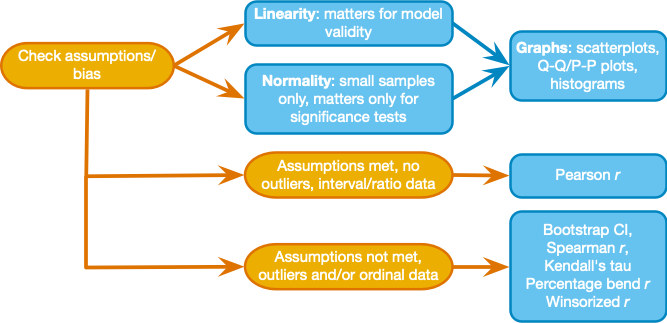

```{r setup, include=FALSE}
knitr::opts_chunk$set(
	echo = TRUE,
	message = FALSE,
	warning = FALSE
)

library(learnr)
library(magrittr)
library(ggplot2)

source("./www/discovr_helpers.R")

#Read dat files needed for the tutorial

exam_tib <- discovr::exam_anxiety
liar_tib <- discovr::biggest_liar
```


# discovr: Associations

## Overview

<div class="infobox">
  
  
  **Usage:** This tutorial accompanies [Discovering Statistics Using R and RStudio](https://www.discoveringstatistics.com/books/discovering-statistics-using-r/) [@field_discovering_2021] by [Andy Field](https://en.wikipedia.org/wiki/Andy_Field_(academic)). It contains material from the book so there are some copyright considerations but I offer them under a [Creative Commons Attribution-NonCommercial-NoDerivatives 4.0 International License](http://creativecommons.org/licenses/by-nc-nd/4.0/). Tl;dr: you can use this tutorial for teaching and non-profit activities but please don't meddle with it or claim it as your own work.
  
</div>

### `r cat_space(height = 2)` Welcome to the `discovr` space pirate academy

Hi, welcome to **discovr** space pirate academy. Well done on embarking on this brave mission to planet `r rproj()`s, which is a bit like Mars, but a less red and more hostile environment. That's right, more hostile than a planet without water. Fear not though, the fact you are here means that you *can* master `r rproj()`, and before you know it you'll be as brilliant as our pirate leader Mae Jemstone (she's the badass with the gun). I am the space cat-det, and I will pop up to offer you tips along your journey.

On your way you will face many challenges, but follow Mae's system to keep yourself on track:

* `r bmu2(height = 2)` This icon flags materials for *teleporters*. That's what we like to call the new cat-dets, you know, the ones who have just teleported into the academy. This material is the core knowledge that everyone arriving at space academy must learn and practice.
* `r user_visor(height = 2)` Once you have been at space pirate academy for a while, you get your own funky visor. It has various modes. My favourite is the one that allows you to see everything as a large plate of tuna. More important, sections marked for cat-dets with visors goes beyond the core material but is still important and should be studied by all cat-dets. However, try not to be disheartened if you find it difficult.
* `r user_astronaut(height = 2)` Those almost as brilliant as Mae (because no-one is quite as brilliant as her) get their own space suits so that they can go on space pirate adventures. They get to shout *RRRRRR* really loudly too. Actually, everyone here gets to should *RRRRRR* really loudly. Try it now. Go on. It feels good. Anyway, this material is the most advanced and you can consider it optional unless you are a postgraduate cat-det.

It's not just me that's here to help though, you will meet other characters along the way:

* `r alien(height = 2)` aliens love dropping down onto the planet and probing humanoids. Unfortunately you'll find them probing you quite a lot with little coding challenges. Helps is at hand though. 
* `r robot(height = 2)` **bend-R** is our coding robot. She will help you to try out bits of `r rproj()` by writing the code for you before you encounter each coding challenge.
* `r bug(height = 2)` we also have our friendly alien bugs that will, erm, help you to avoid bugs in your code by highlighting common mistakes that even Mae Jemstone sometimes makes (but don't tell her I said that or my tuna supply will end). 

By for now and good luck - you'll be amazing!

### Workflow

* Before attempting this tutorial it's a good idea to work through [this tutorial on how to install, set up and work within `r rproj()` and {height=1em}](http://milton-the-cat.rocks/learnr/r/r_getting_started/).

* The tutorials are self-contained (you practice code in code boxes). However, so you get practice at working in {height=1em} I strongly recommend that you create an `r rproj()` markdown file within an {height=1em} project and practice everything you do in the tutorial in the `r rproj()` markdown file, make notes on things that confused you or that you want to remember, and save it. Within this markdown file you will need to load the relevant packages and data. 


### Packages

This tutorial uses the following packages:

* `correlation` [@makowski_methods_2020]
* `GGally` [@Schloerke_Crowley_Cook_Briatte_Marbach_Thoen_Elberg_Larmarange_2018]
* `here` [@here]
* `tidyverse` [@tidyverse]
* `WRS2` [@Mair_Wilcox_2019]

I try to follow the [Google `r rproj()` style guide](https://google.github.io/styleguide/Rguide.html) and [tidyverse style guide](https://style.tidyverse.org/) in always declaring the package when using a function: `package::function()`. For example, if I want to use the `mutate()` function from the package `dplyr`, I will write `dplyr::mutate()`. 

It is good practice to be explicit about packages to avoid clashes where functions from different packages have the same name. It also means that you don't need to load packages at the start of your markdown document. 

There are two main exceptions to this rule.

1. There are functions within some `tidyverse` packages that would be used within other functions. Including the package name makes the code difficult to read. Also, no-one wants to write `ggplot2::` before every function from `ggplot2`.
2. To use the pipe operator (`%>%`) you need to have `magritrr` loaded.

We can load all of the packages that are exceptions in one step by loading `tidyverse` at the beginning of our `r rproj()` Markdown document:

```{r eval = FALSE}
library(tidyverse)
```

### Data

To work *outside of this tutorial* you need to download the following data files:

* [biggest_liar.csv](http://www.discoveringstatistics.com/repository/discovr_data/biggest_liar.csv)
* [exam_anxiety.csv](http://www.discoveringstatistics.com/repository/discovr_data/exam_anxiety.csv)

Set up an {height=1em} project in the way that [I recommend in this tutorial](http://milton-the-cat.rocks/learnr/r/r_getting_started/#section-working-in-rstudio), and save the data files to the folder within your project called [data]{.alt}. Place this code in the first code chunk in your `r rproj()` Markdown document:

```{r, eval=FALSE}
liar_tib <- here::here("data/biggest_liar.csv") %>% readr::read_csv()
exam_tib <- here::here("data/exam_anxiety.csv") %>% readr::read_csv()
```

### Preparing data

To work *outside of this tutorial* you need to turn categorical variables into factors and set an appropriate baseline category using `forcats::as_factor` and `forcats::fct_relevel`.

For [liar_tib]{.alt} execute the following code:

```{r, eval=FALSE}
liar_tib <- liar_tib %>% 
  dplyr::mutate(
    novice = forcats::as_factor(novice)
  )
```

For [exam_tib]{.alt} execute the following code:

```{r, eval=FALSE}
exam_tib <- exam_tib %>%
  dplyr::mutate(
    id = forcats::as_factor(id),
    sex = forcats::as_factor(sex)
  )
```


## `r bmu2()` Correlation process

Figure 1 shows a general procedure to follow when computing a bivariate correlation coefficient. First, check for sources of bias as outlined. The two most important ones in this context are linearity and normality. Remember that we’re fitting linear model to the data, so if the relationship between variables is not linear then this model is invalid. To meet this requirement, the outcome variable needs to be measured at the interval or ratio level as does the predictor variable (one exception is that a predictor variable can be a categorical variable with only two categories). As far as normality is concerned, we care about this only if we want confidence intervals or significance tests and if the sample size is small.

If the data have outliers, are not normal implying a non-normal sampling distribution (and the sample is small) or your variables are measured at the ordinal level then you can use Spearman’s rho or Kendall’s tau, which are versions of the correlation coefficient applied to ranked data. Ranking the data reduces the impact of outliers but we lose information so, we can instead fit a robust variant such as the percentile bend correlation or Winsorized correlation. Furthermore, given that normality of the sampling distribution matters only for inferring significance and computing confidence intervals in small samples, we could use a bootstrap to compute the confidence interval in small samples, then we don’t need to worry about this assumption.


 
## `r bmu2()` Visualizing the data

In a previous tutorial we looked at an example relating to exam anxiety: a psychologist was interested in the effects of exam stress and revision on exam performance. She had devised and validated a questionnaire to assess state anxiety relating to exams (called the Exam Anxiety Questionnaire, or EAQ). This scale produced a measure of anxiety scored out of 100. Anxiety was measured before an exam, and the percentage mark of each student on the exam was used to assess the exam performance. She also measured the number of hours spent revising.

#### `r alien()` Alien coding challenge

These data are preloaded in this tutorial in a tibble called [exam_tib]{.alt}. Use the code box to see these data.

```{r exam_data, exercise = TRUE, exercise.lines = 2}

```

```{r exam_data-solution}
exam_tib
```

Note there are five variables: the participant **id**, the hours spent revising (**revise**), their **exam_grade**, their exam **anxiety**, and their biological **sex**. We can visualise the data easily using the `GGally` package. When you want to plot continuous variables, the `ggscatmat()` function from this package produces a matrix of scatterplots (below the diagonal), distributions (along the diagonal) and the correlation coefficient (above the diagonal). 

#### `r robot()` Code example

The `ggscatmat()` function takes the general form:

```{r, eval = FALSE}
GGally::ggscatmat(my_tibble, columns = c("variable 1", " variable 2", " variable 3" …))
```

Basically, you feed in the name of the tibble containing the variables, and use the columns argument to name the variables that you want to plot.

#### `r alien()` Alien coding challenge

For example, to plot the variables called **exam_grade**, **revise**, and **anxiety** we replace ["variable 1"]{.alt} with ["exam_grade"]{.alt}, ["variable 2"]{.alt} with ["revise"]{.alt} and so on. It’s as simple as that! Plot the scatterplot of the three variables.

```{r exam_plot, exercise = TRUE, exercise.lines = 2}

```

```{r exam_plot-solution}
GGally::ggscatmat(exam_tib, columns = c("exam_grade", "revise", "anxiety"))
```


#### `r alien()` Alien coding challenge

Like other plots we have done, we can also apply a `ggplot2` theme in the usual way. Copy the code from the previous task and try applying `theme_minimal()`

```{r exam_plot2, exercise = TRUE, exercise.lines = 2}

```

```{r exam_plot2-solution}
GGally::ggscatmat(exam_tib, columns = c("exam_grade", "revise", "anxiety")) +
  theme_minimal()
```

The resulting plot shows that all of the variables are skewed. This skew could be a problem if we want to do significance tests or look at confidence intervals. The sample contains 103 observations, which is reasonably large, and possibly large enough for the central limit theorem to relieve of us of concerns about normality. We should consider using a robust method to compute the correlation coefficient itself.

##	`r bmu2()` Pearson's correlation using `r rproj()`

The `correlation` package brings together lots of correlation-related stuff into a nice, easy-to-use bundle of loveliness. It has one workhorse function called … wait for it … `correlation()`. 

#### `r robot()` Code example

The `correlation()` function takes the general form:

```{r eval = FALSE}
correlation::correlation(tibble,
                         method = "pearson",
                         p_adjust = "holm",
                         ci = 0.95
                         )
```

I’ve listed the main arguments, but there are others. For now, we’ll just look at the main arguments that we will use:

* [tibble]{.alt}. This word should be replaced with the name of the tibble containing any variables that you wish to correlate.
* [method]{.alt}. This argument sets the method for the correlation coefficient. By default it is set to [pearson]{.alt} (to calculate Pearson’s coefficient) but can be changed to [spearman]{.alt}, [kendall]{.alt}, [biserial]{.alt}, [polychoric]{.alt}, [tetrachoric]{.alt}, and [percentage]{.alt} (for the percentage bend correlation) amongst others. We’ll look at some, but not all of these methods.
* [p_adjust]{.alt}. By default the function corrects the *p*-value for the number of tests you have performed (a good idea) using the Holm-Bonferroni method, which applies the Bonferroni criterion in a slightly less strict way that controls the Type I error rate but with less risk of a Type II error. You can change this argument to [none]{.alt} (i.e. don’t correct for multiple tests, a bad idea), [bonferroni]{.alt} (to apply the standard Bonferroni method) or several other methods.
*	[ci]{.alt}. This argument sets the confidence interval width. By default it is 0.95 for a 95% confidence interval, which will probably be what you’ll generally use.

To use the function, take your tibble, pipe it into the `select()` function from `dplyr` to select the variables you want to correlate, then pipe that into the correlation function. You can use the same code structure whether you want to correlate two variables or produce all correlations between pairs of multiple variables.

#### `r robot()` Code example

To calculate the Pearson correlation between the variables **exam_grade** and **revise** in [exam_tib]{.alt}, we’d execute:

```{r basicr, exercise = TRUE, exercise.lines = 3}
exam_tib %>% 
  dplyr::select(exam_grade, revise) %>% 
  correlation::correlation()
```

This code takes the [exam_tib]{.alt} and uses the `select()` function to select the variables exam_grade and revise. The result is that a tibble with these two variables in is fed into the `correlation()` function to compute the correlation between them.

#### `r alien()` Alien coding challenge

Calculate the Pearson correlation between the variables **exam_grade** and **anxiety**

```{r basicr2, exercise = TRUE, exercise.lines = 3}

```

```{r basicr2-solution}
exam_tib %>% 
  dplyr::select(exam_grade, anxiety) %>% 
  correlation::correlation()
```

#### `r robot()` Code example

This approach scales up nicely. For example, if we now also want to see the correlations between all three variables we need only extend the list of variables within the `select()` function:

```{r tidypr, exercise = TRUE, exercise.lines = 3}
exam_tib %>% 
  dplyr::select(exam_grade, revise, anxiety) %>% 
  correlation::correlation()
```

```{r tidypr-solution}
exam_tib %>% 
  dplyr::select(exam_grade, revise, anxiety) %>% 
  correlation::correlation()
```

```{r quiz_pearson_ex1, echo = FALSE}
quiz(
  question(sprintf("The confidence interval for the association between exam grade and revision is 0.22 to 0.55. What does this tell us?"),
    answer("If this confidence interval is one of the 95% that contains the population value then the population value of *r* lies between 0.22 and 0.55.", correct = TRUE),
    answer("There is a 95% chance that the population value of *r* lies between 0.22 and 0.55", message = "You cannot make probability statements from a confidence interval. We don't know whether this particular CI is one of the 95% that contains the population value of *r*."),
    answer("The probability of this confidence interval containing the population value is 0.95.", message = "The probability of this confidence interval containing the population value is either 0 (it doesn't) or 1 (it does) but it's impossible to know which."),
    answer("I can be 95% confident that the population value of *r* lies between 0.22 and 0.55", message = "Confidence intervals do not quantify your subjective confidence."),
    correct = "Correct - well done!",
    random_answer_order = TRUE,
    allow_retry = T
  ),
  question("The *p*-value for the association between exam grade and revision is < 0.001, what does this value mean?",
    answer("The probability of getting a value of *t* at least as big as the value we have observed, if the value of *r* were, in fact, zero is less than 0.001. I'm going to assume, therefore, that the association between exam grade and revision is not zero.", correct = T),
    answer("The probability that *r* = 0.40 is a chance result is less than 0.001", message = "*p*-values do not tell us whether results occur by chance."),
    answer("The probability that exam grade and revision are not assciated is 0.001", message = "*p*-values do not tell us about the probability of the null hypothesis"),
    answer("I got a different *p*-value to 0.0o1", message = "You may have done the analysis incorrectly. Try again!"),
    correct = "Correct - well done!",
    random_answer_order = TRUE,
    allow_retry = T
  )
)

```

The resulting output tells us that exam grade has a correlation with revision of $r = 0.40$, and a similar strength relationship with exam anxiety, $r = -0.44$ (but in the opposite direction). As revision increases so does exam performance, but as anxiety increase exam performance decreases. We also see that revision has a very strong negative relationship with exam anxiety, $r = -0.71$. The more you revise the less anxiety you have about the exam. All *p*-values are less than 0.001 (and, so also less than 0.05) and would be interpreted as the correlation coefficients being significantly different from zero. The significance values tell us that the probability of getting correlation coefficients at least this big as these in a sample of 103 people if the null hypothesis were true (there was no relationship between these variables) is very low (close to zero in fact). If we’re prepared to assume that the sample is one of the 95% of samples that will produce a confidence interval containing the population value, then the confidence intervals tell us about the uncertainty around the value of *r*. For example, under this assumption, the population value of the association between exam grade and revision falls between 0.22 and 0.55.

<div class="tip">
  `r cat_space()` **Tip: Rounding**
  
  If you want more decimal places in your output use the argument [ci_digits]{.alt} to control the number of decimal places for the confidence intervals and `digits` to control the number of decimal places in the other columns. For example, the code to display the previous output to three decimal places is:

```{r eval = FALSE}
exam_tib %>% 
  dplyr::select(exam_grade, revise, anxiety) %>% 
  correlation::correlation(digits = 3, ci_digits = 3)
```

This won't work within this tutorial (for reasons I won't bore you with), but try it out in a markdown document.
</div>

##	`r user_visor()` Robust correlation coefficients

Given the skew in some of the variables, we are probably better off estimating a robust correlation coefficient, like the percentage bend correlation coefficient [@Wilcox_1994].

#### `r alien()` Alien coding challenge

We can obtain the percentage bend correlation coefficient by setting [method = "percentage"]{.alt} within the `correlation()`. The code that we just used is reproduced below. Adapt it to obtain the percentage bend correlation coefficient.

```{r pball, exercise = TRUE, exercise.lines = 3}
exam_tib %>% 
  dplyr::select(exam_grade, revise, anxiety) %>% 
  correlation::correlation()
```

```{r pball-hint-1}
# Include method = "percentage" in correlation()
```

```{r pball-hint-2}
exam_tib %>% 
  dplyr::select(exam_grade, revise, anxiety) %>% 
  correlation::correlation(method = "percentage")
```

Compare the values of these robust correlations to the raw Pearson correlations you obtained earlier. Exam grade had a Pearson correlation with revision of $r = 0.40$, but the percentage bend correlation is smaller (0.34). Similarly the robust versions of the other correlations are smaller than the raw Pearson correlations (although they all remain significant with *p*s < 0.05).

## `r bmu2()` Spearman’s Correlation Coefficient

Spearman correlations are very easy once you've mastered `correlation()`. Let's switch example. Imagine I wanted to test a theory that more creative people will be better liars. I gathered together 68 past contestants from the World’s Biggest Liar competition (held annually at the Santon Bridge Inn in Wasdale in case you're interested) and noted where they were placed in the competition (first, second, third, etc.); I also gave them a creativity questionnaire (maximum score 60). The position in the competition is an ordinal variable because the places are categories but have a meaningful order (first place is better than second place and so on). Therefore, Spearman’s correlation coefficient should be used (Pearson’s *r* requires interval or ratio data). The data for this study are preloaded in this tutorial in a tibble called [liar_tib]{.alt}. If you're working outside of this tutorial see the instructions at the beginning for loading the data. 

#### `r alien()` Alien coding challenge

Look at the tibble by executing its name:

```{r liar, exercise = TRUE, exercise.lines = 3}

```

```{r liar-solution}
liar_tib
```

The main variables are in two columns: one labelled **creativity** and one labelled **position**, but there’s also a variable **id** containing the participant’s id and a categorical variable called **novice** that specifies whether the participant was entering the contest for the first time or was a previous entrant. Note that the variable **position** is numeric (the position in the competition is represented with numbers).

#### `r alien()` Alien coding challenge

Plot **creativity** against **position** using `ggscatmat()`

```{r create_plot, exercise = TRUE, exercise.lines = 2}

```

```{r create_plot-hint-1}
# Use the GGally::ggscatmat() function (replace the xs)

GGally::ggscatmat(xxxxxx, columns = c("xxxxxx", "xxxxxx"))
```

```{r create_plot-hint-2}
# This will get you the plot:
GGally::ggscatmat(liar_tib, columns = c("creativity", "position"))

# Now add a theme
```

```{r create_plot-hint-3}
# The plot with theme_minimal() applied

GGally::ggscatmat(liar_tib, columns = c("creativity", "position")) +
  theme_minimal()
```

To get the Spearman correlation between **creativity** and **position** we can basically use `correlation()` exactly as we did for the Pearson correlation, except we add [method = "spearman"]{.alt} to the function.

#### `r robot()` Code example

In general, we could execute this code to get the Spearman correlation between **variable_1** and **variable_2** from the tibble called [my_tib]{.alt} (compare it with the code we used for Pearson’s *r*)

```{r, eval = F}
my_tib %>%
  dplyr::select(variable_1, variable_2) %>% 
  correlation::correlation(method = "spearman")
```

#### `r alien()` Alien coding challenge

Use the code example to obtain the Spearman correlation between the variables **position** and **creativity** from [liar_tib]{.alt}.

```{r liarr, exercise = TRUE, exercise.lines = 3}

```

```{r liarr-hint-1}
#Start with the tibble containing the data
liar_tib
```

```{r liarr-hint-2}
# Now pipe it into the select() function
liar_tib %>%
  dplyr::select()
# Now, put the variables names in select that you want to select
```

```{r liarr-hint-3}
# Put the variables names in select that you want to select
liar_tib %>%
  dplyr::select(position, creativity)

# Now pipe this into correlation()
```

```{r liarr-hint-4}
liar_tib %>%
  dplyr::select(position, creativity) %>% 
  correlation::correlation()
# set method to Spearman
```

```{r liarr-hint-5}
liar_tib %>%
  dplyr::select(position, creativity) %>% 
  correlation::correlation(method = "spearman")
```

From the output we can see that the Spearman correlation coefficient between the two variables is $r_s = -0.38$, with an associated *p*-value of 0.002 and a sample size of 68.  There was a significant negative relationship between creativity scores and how well someone did in the World’s Biggest Liar competition: as creativity increased, position decreased. This might seem contrary to what we predicted until you remember that a low number means that you did well in the competition (a low number such as 1 means you came first, and a high number like 4 means you came fourth). Therefore, our hypothesis is supported: as creativity increased, so did success in the competition.

##	`r bmu2()` Kendall’s tau

Kendall’s tau, denoted by $\tau$, is another non-parametric correlation and it should be used rather than Spearman’s coefficient when you have a small data set with a large number of tied ranks. The `correlation()` function will compute Kendall’s $\tau$ by including [method = "kendall"]{.alt}.

#### `r alien()` Alien coding challenge

Repeat the previous exercise but replace [method = "spearman"]{.alt} with [method = "kendall"]{.alt}.

```{r tau, exercise = TRUE, exercise.lines = 3}

```

```{r tau-solution}
liar_tib %>% 
  dplyr::select(position, creativity) %>% 
  correlation::correlation(method = "kendall")
```


The output shows $\tau = -0.30$, which is closer to zero than the Spearman correlation (it has decreased from $-0.38$ to $-0.30$). Kendall’s value is likely a more accurate gauge of what the correlation in the population would be.

<div class="infobox">
  
  
  **A message from Mae Jemstone:**
  
  Once when I was travelling through the constellation of *dragonis murralis* on our mission to improve statistical literacy, we crunched some data and discovered that high anxiety is often associated with poorer performance in Mathematical subjects. It's not that anxious people are less able, but their anxiety is a barrier that makes them feel that they can't do things, even though they can. Associations like this are helpful to get us thinking about relationships between variables, which is the first step towards predicting variables! You've taken that first step towards understanding how we use measured variables to predict what might happen. Well done!
  
  And if you're one of those anxious people, you are not alone, and you *can* do this. Think about ways that you can feel the anxious feelings but not let them disrupt your thinking: when you feel the anxiety take some controlled, deep breaths for a minute. Be mindful. Believe in yourself, because I do.
</div>

## Resources {data-progressive=FALSE}

### Statistics

* The tutorials typically follow examples described in detail in @field_discovering_2021. That book covers the theoretical side of the statistical models, and has more depth on conducting and interpreting the models in these tutorials.
* If any of the statistical content doesn't make sense, you could try my more introductory book *An adventure in statistics* [@fieldAdventureStatisticsReality2016].
* There are free lectures and screencasts on my [YouTube channel](https://www.youtube.com/user/ProfAndyField/).
* There are free statistical resources on my websites [www.discoveringstatistics.com](http://www.discoveringstatistics.com) and [milton-the-cat.rocks](http://milton-the-cat.rocks).

### `r rproj("h3")`

* [R for data science](http://r4ds.had.co.nz/index.html) by @wickhamDataScience2017 is an open-access book by the creator of the tidyverse (Hadley Wickham). It covers the *tidyverse* and data management.
* [ModernDive](http://moderndive.com/index.html) is an open-access textbook on `r rproj("h3")` and {height=1em}.
* [{height=1em} cheat sheets](https://www.rstudio.com/resources/cheatsheets/).
* [{height=1em} list of online resources](https://www.rstudio.com/online-learning/).

### Acknowledgement

I'm extremely grateful to [Allison Horst](https://www.allisonhorst.com/) for her very informative blog post on [styling learnr tutorials with CSS](https://education.rstudio.com/blog/2020/05/learnr-for-remote/) and also for sending me a CSS template file and allowing me to adapt it. Without Allison, these tutorials would look a lot worse (but she can't be blamed for my colour scheme).

## References


