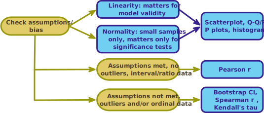

<html lang="en">

```{r setup, include=FALSE}
knitr::opts_chunk$set(
	echo = TRUE,
	message = FALSE,
	warning = FALSE
)

#necessary to render tutorial correctly
library(learnr) 
library(htmltools)
#easystats
library(correlation)
library(insight)
#tidyverse
library(dplyr)
library(ggplot2)
#non tidyverse/easystats
library(GGally)
#students don't use
library(WRS2)


source("./www/discovr_helpers.R")

#Read dat files needed for the tutorial

exam_tib <- discovr::exam_anxiety
liar_tib <- discovr::biggest_liar
```

```{r, eval = F, echo = F}
# Create bib file for R packages
here::here("inst/tutorials/discovr_07/packages.bib") |>
  knitr::write_bib(c('here', 'tidyverse', 'dplyr', 'readr', 'forcats', 'tibble', 'ggplot2', 'knitr', "GGally", "correlation"), file = _)
```

# discovr associations

```{r, child = "./docs/intro.Rmd"}

```

## Packages {data-progressive=FALSE}

```{r, child = "./docs/packages.Rmd"}

```


## Data

```{r, child = "./docs/data.Rmd"}

```

## `r bmu()` Correlation process [(A)]{.lbl}

Figure 2 shows a general procedure to follow when computing a bivariate correlation coefficient. First, check for sources of bias as outlined. The two most important ones in this context are linearity and normality. Remember that we're fitting linear model to the data, so if the relationship between variables is not linear then this model is invalid. To meet this requirement, the outcome variable needs to be measured at the interval or ratio level as does the predictor variable (one exception is that a predictor variable can be a categorical variable with only two categories). As far as normality is concerned, we care about this only if we want confidence intervals or significance tests and if the sample size is small.

If the data have outliers, are not normal implying a non-normal sampling distribution (and the sample is small) or your variables are measured at the ordinal level then you can use Spearman's rho or Kendall's tau, which are versions of the correlation coefficient applied to ranked data. Ranking the data reduces the impact of outliers but we lose information so, we can instead fit a robust variant such as the percentile bend correlation or Winsorized correlation. Furthermore, given that normality of the sampling distribution matters only for inferring significance and computing confidence intervals in small samples, we could use a bootstrap to compute the confidence interval in small samples, then we don't need to worry about this assumption.

<figure>

<figcaption>Figure 2: The general process for conducting correlation analysis.</figcaption>
</figure> 

 
## `r bmu()` Visualizing the data [(A)]{.lbl}

In a previous tutorial we looked at an example relating to exam anxiety: a psychologist was interested in the effects of exam stress and revision on exam performance. She had devised and validated a questionnaire to assess state anxiety relating to exams (called the Exam Anxiety Questionnaire, or EAQ). This scale produced a measure of anxiety scored out of 100. Anxiety was measured before an exam, and the percentage mark of each student on the exam was used to assess the exam performance. She also measured the number of hours spent revising.

#### `r alien()` Alien coding challenge

These data are preloaded in this tutorial in a tibble called [exam_tib]{.alt}. Use the code box to see these data.

```{r exam_data, exercise = TRUE, exercise.lines = 2}

```

```{r exam_data-solution}
exam_tib
```

Note there are five variables: the participant `id`, the hours spent revising (`revise`), their `exam_grade`, their exam `anxiety`, and whether the participant self-identified as male or female (`sex`). We can visualise the data using the [GGally]{.pkg} package. When you want to plot continuous variables, the `ggscatmat()` function from this package produces a matrix of scatterplots (below the diagonal), distributions (along the diagonal) and the correlation coefficient (above the diagonal). 

#### `r robot()` Code example

The `ggscatmat()` function takes the general form:

```{r, eval = FALSE}
GGally::ggscatmat(my_tibble, columns = c("variable 1", " variable 2", " variable 3" ...))
```

Basically, you feed in the name of the tibble containing the variables, and use the columns argument to name the variables that you want to plot.

<div class="bug">
  `r bug()` **Explicit and concise code**

In keeping with our recommended practice on code style, we wouldn't load the entire [GGally]{.pkg} to produce a few plots but instead use the namespace when calling the function we want. Hence, our code uses `GGally::ggscatmat()` rather than `ggscatmat()`. However, if you were producing a lot of plots, or using many functions from [GGally]{.pkg} you might prefer to include `library(GGally)` in your setup code chunk and use only the function names thereafter (e.g., use `ggscatmat()`).
</div>


#### `r alien()` Alien coding challenge

To plot the variables called `exam_grade`, `revise`, and `anxiety` we replace ["variable 1"]{.alt} with ["exam_grade"]{.alt}, ["variable 2"]{.alt} with ["revise"]{.alt} and so on. It's as simple as that! Plot the scatterplot of the three variables.

```{r exam_plot, exercise = TRUE, exercise.lines = 4}

```

```{r exam_plot-solution}
GGally::ggscatmat(exam_tib, columns = c("exam_grade", "revise", "anxiety"))
```


#### `r alien()` Alien coding challenge

Like other plots we have done, we can apply a [ggplot2]{.pkg} theme in the usual way. Copy the code from the previous task and try applying `theme_minimal()`

```{r exam_plot2, exercise = TRUE, exercise.lines = 4}

```

```{r exam_plot2-solution}
GGally::ggscatmat(exam_tib, columns = c("exam_grade", "revise", "anxiety")) +
  theme_minimal()
```

The resulting plot shows that all of the variables are skewed. This skew could be a problem if we want to do significance tests or look at confidence intervals. The sample contains 103 observations, which is reasonably large, and possibly large enough for the central limit theorem to relieve of us of concerns about normality. We should consider using a robust method to compute the correlation coefficient itself.

##	`r bmu()` Pearson's correlation using `r rproj()` [(A)]{.lbl}

The [correlation]{.pkg} package [@R-correlation] brings together lots of correlation-related stuff into a nice, easy-to-use bundle of loveliness. It has one workhorse function called ... wait for it ... `correlation()`. 

#### `r robot()` Code example

The `correlation()` function takes the general form:

```{r eval = FALSE}
correlation::correlation(data = tibble,
                         select = c("variable 1", "variable 2" ...),
                         rename = c("new name variable 1", "new name variable 2" ...),
                         method = "pearson",
                         p_adjust = "holm",
                         ci = 0.95)
```

I've listed the main arguments, but there are others. For now, we'll just look at the main arguments that we will use:

* `data`: The word [tibble]{.alt} should be replaced with the name of the tibble containing any variables that you wish to correlate.
* `select`: optional argument to select the variables from the tibble that you wish to correlate.
* `rename`. optionally you can provide different names for your variables to appear in the output (handy for nice output).
* `method`. This argument sets the method for the correlation coefficient. By default it is set to [pearson]{.alt} (to calculate Pearson's coefficient) but can be changed to [spearman]{.alt}, [kendall]{.alt}, [biserial]{.alt}, [polychoric]{.alt}, [tetrachoric]{.alt}, and [percentage]{.alt} (for the percentage bend correlation) amongst others. We'll look at some, but not all of these methods.
* `p_adjust`. By default the function corrects the *p*-value for the number of tests you have performed (a good idea) using the Holm-Bonferroni method, which applies the Bonferroni criterion in a slightly less strict way that controls the Type I error rate but with less risk of a Type II error. You can change this argument to [none]{.alt} (i.e. don't correct for multiple tests, a bad idea), [bonferroni]{.alt} (to apply the standard Bonferroni method) or several other methods.
*	`ci`. This argument sets the confidence interval width. By default it is 0.95 for a 95% confidence interval, which will probably be what you'll generally use.


#### `r robot()` Code example

You can use the same code structure whether you want to correlate two variables or produce all correlations between pairs of multiple variables.
For example, to calculate the Pearson correlation between the variables `exam_grade` and `revise` in [exam_tib]{.alt}, we'd execute:

```{r eval = F}
correlation(data = exam_tib,
            select = c("exam_grade", "revise"),
            rename = c("Exam grade (%)", "Time revising"))
```

This code takes the [exam_tib]{.alt} and uses the [select]{.alt} argument to select the variables `exam_grade` and `revise` (note they have to be in quotes). The [rename]{.alt} argument is used to give these variables more descriptive names in the output.

#### `r alien()` Alien coding challenge

Calculate the Pearson correlation between the variables `exam_grade` and `anxiety`. Use `display()` to round the output to 3 decimal places.

```{r basicr2, exercise = TRUE, exercise.lines = 5}

```


```{r basicr2-hint-1}
correlation(data = exam_tib,
            select = c("exam_grade", "revise"),
            rename = c("Exam grade (%)", "Time revising"))
# add display() to round to 3 decimal places
```


```{r basicr2-solution}
correlation(data = exam_tib,
            select = c("exam_grade", "revise"),
            rename = c("Exam grade (%)", "Time revising")) |> 
  display(digits = 3)
```

#### `r robot()` Code example

This approach scales up nicely. For example, if we now also want to see the correlations between all three variables we need only extend the list of variables within the [select]{.alt} argument. Adapt the code to compute the correlations between exam grade, revision and anxiety (remember to both [select]{.alt} and [rename]{.alt} anxiety).

```{r tidypr, exercise = TRUE, exercise.lines = 5}
correlation(data = exam_tib,
            select = c("exam_grade", "revise"),
            rename = c("Exam grade (%)", "Time revising")) |> 
  display(digits = 3)
```

```{r tidypr-solution}
correlation(data = exam_tib,
            select = c("exam_grade", "revise", "anxiety"),
            rename = c("Exam grade (%)", "Time revising", "Exam anxiety")) |> 
  display(digits = 3)
```

```{r quiz_pearson_ex1, echo = FALSE}
quiz(
  question(sprintf("The confidence interval for the association between exam grade and revision is 0.22 to 0.55. What does this tell us?"),
    answer("If this confidence interval is one of the 95% that contains the population value then the population value of *r* lies between 0.22 and 0.55.", correct = TRUE),
    answer("There is a 95% chance that the population value of *r* lies between 0.22 and 0.55", message = "You cannot make probability statements from a confidence interval. We don't know whether this particular CI is one of the 95% that contains the population value of *r*."),
    answer("The probability of this confidence interval containing the population value is 0.95.", message = "The probability of this confidence interval containing the population value is either 0 (it doesn't) or 1 (it does) but it's impossible to know which."),
    answer("I can be 95% confident that the population value of *r* lies between 0.22 and 0.55", message = "Confidence intervals do not quantify your subjective confidence."),
    correct = "Correct - well done!",
    random_answer_order = TRUE,
    allow_retry = T
  ),
  question("The *p*-value for the association between exam grade and revision is < 0.001, what does this value mean?",
    answer("The probability of getting a value of *t* at least as big as the value we have observed, if the value of *r* were, in fact, zero is less than 0.001. I'm going to assume, therefore, that the association between exam grade and revision is not zero.", correct = T),
    answer("The probability that *r* = 0.40 is a chance result is less than 0.001", message = "*p*-values do not tell us whether results occur by chance."),
    answer("The probability that exam grade and revision are not assciated is 0.001", message = "*p*-values do not tell us about the probability of the null hypothesis"),
    answer("I got a different *p*-value to 0.001", message = "You may have done the analysis incorrectly. Try again!"),
    correct = "Correct - well done!",
    random_answer_order = TRUE,
    allow_retry = T
  )
)

```

```{r, echo = F}
pearson <- correlation(
  data = exam_tib,
  select = c("exam_grade", "revise", "anxiety")
  )

rrob <- correlation(
  data = exam_tib,
  select = c("exam_grade", "revise", "anxiety"),
  method = "percentage"
  )
```

The resulting output tells us that exam grade has a correlation with revision of *r* = `r sprintf("%.2f", pearson$r[1])`, and a similar strength relationship with exam anxiety, *r* = `r sprintf("%.2f", pearson$r[2])` (but in the opposite direction). As revision increases so does exam performance, but as anxiety increase exam performance decreases. We also see that revision has a very strong negative relationship with exam anxiety, *r* = `r sprintf("%.2f", pearson$r[3])`. The more you revise the less anxiety you have about the exam. All *p*-values are less than 0.001 (and, so also less than 0.05) and would be interpreted as the correlation coefficients being significantly different from zero. The significance values tell us the probability of getting correlation coefficients at least this big as these in a sample of 103 people if the null hypothesis were true (there was no relationship between these variables) is very low (close to zero in fact). If we're prepared to assume that the sample is one of the 95% of samples that will produce a confidence interval containing the population value, then the confidence intervals tell us about the uncertainty around the value of *r*. For example, under this assumption, the population value of the association between exam grade and revision falls between `r sprintf("%.2f", pearson$CI_low[1])` and `r sprintf("%.2f", pearson$CI_high[1])`.

<div class="tip">
  `r cat_space()` **Tip: Rounding**
  
  Remember that we can use `display()` to control the number of decimal places that are printed in our rendered document. For example, up to now we have printed to three decimal places using [digits = 3]{.alt}:
  
```{r, eval = F, class.source = '.panel_alt'}
correlation(data = exam_tib,
            select = c("exam_grade", "revise", "anxiety"),
            rename = c("Exam grade (%)", "Time revising", "Exam anxiety")) |> 
  display(digits = 3)
```

However, what if we want a different number of decimal places for the confidence intervals or *p*-values? We can adjust these with the additional arguments [ci_digits]{.alt} and [p_digits]{.alt}. For example, if we wanted 2 decimal places for the correlation coefficient and *t*-statistics, but 3 for the confidence interval and 8 for the *p*-values, we'd use

```{r, eval = F, class.source = '.panel_alt'}
correlation(data = exam_tib,
            select = c("exam_grade", "revise", "anxiety"),
            rename = c("Exam grade (%)", "Time revising", "Exam anxiety")) |> 
  display(digits = 2, ci_digits = 3, p_digits = 8)
```

Try this code in the following section.

</div>

##	`r user_astronaut()` Robust correlation coefficients [(C)]{.lbl}

Given the skew in some of the variables, we are probably better off estimating a robust correlation coefficient, like the percentage bend correlation coefficient [@Wilcox_1994].

#### `r alien()` Alien coding challenge

We can obtain the percentage bend correlation coefficient by setting [method = "percentage"]{.alt} within `correlation()`. The code that we just used is reproduced below. Adapt it to obtain the percentage bend correlation coefficient. Round the correlation coefficients and *t*-statistics to 2 decimal places, the confidence interval to 4 d.p. and the *p*-values to 6 d.p.

```{r pball, exercise = TRUE, exercise.lines = 5}
correlation(data = exam_tib,
            select = c("exam_grade", "revise", "anxiety"),
            rename = c("Exam grade (%)", "Time revising", "Exam anxiety"))
```

```{r pball-hint-1}
# Include method = "percentage" in correlation()
```

```{r pball-hint-2}
correlation(data = exam_tib,
            select = c("exam_grade", "revise", "anxiety"),
            rename = c("Exam grade (%)", "Time revising", "Exam anxiety"),
            method = "percentage")
# Use display() to round the correlation coefficients and *t*-statistics to 2 decimal places, the confidence interval to 4 d.p. and the *p*-values to 6 d.p.
```

```{r pball-solution}
correlation(data = exam_tib,
            select = c("exam_grade", "revise", "anxiety"),
            rename = c("Exam grade (%)", "Time revising", "Exam anxiety"),
            method = "percentage") |> 
  display(digits = 2, ci_digits = 4, p_digits = 6)
```

Compare the values of these robust correlations to the raw Pearson correlations you obtained earlier. Exam grade had a Pearson correlation with revision of *r* = `r sprintf("%.2f", pearson$r[1])`, but the percentage bend correlation is smaller (*r* = `r sprintf("%.2f", rrob$r[1])`). Similarly the robust versions of the other correlations are smaller than the raw Pearson correlations (although they all remain significant with *p*s < 0.05).

## `r bmu()` Spearman's Correlation Coefficient [(A)]{.lbl}

Spearman correlations are very straightforward once you've mastered `correlation()`. Let's switch example. Imagine I wanted to test a theory that more creative people will be better liars. I gathered together 68 past contestants from the World's Biggest Liar competition (held annually at the Santon Bridge Inn in Wasdale in case you're interested) and noted where they were placed in the competition (first, second, third, etc.); I also gave them a creativity questionnaire (maximum score 60). The position in the competition is an ordinal variable because the places are categories but have a meaningful order (first place is better than second place and so on). Therefore, Spearman's correlation coefficient should be used (Pearson's *r* requires interval or ratio data). The data for this study are preloaded in this tutorial in a tibble called [liar_tib]{.alt}. If you're working outside of this tutorial see the instructions at the beginning for loading the data. 

```{r, echo = F}
spear <- correlation(data = liar_tib, select = c("position", "creativity"), method = "spearman")
tau <- correlation(data = liar_tib,select = c("position", "creativity"), method = "kendall") 
```


#### `r alien()` Alien coding challenge

Look at the tibble by executing its name:

```{r liar, exercise = TRUE, exercise.lines = 3}

```

```{r liar-solution}
liar_tib
```

The main variables are in two columns: one labelled `creativity` and one labelled `position`, but there's also a variable `id` containing the participant's id and a categorical variable called `novice` that specifies whether the participant was entering the contest for the first time or was a previous entrant. Note that the variable `position` is numeric (the position in the competition is represented with numbers).

#### `r alien()` Alien coding challenge

Plot `creativity` against `position` using `ggscatmat()`

```{r create_plot, exercise = TRUE, exercise.lines = 4}

```

```{r create_plot-hint-1}
# Use the GGally::ggscatmat() function (replace the xs)

GGally::ggscatmat(xxxxxx, columns = c("xxxxxx", "xxxxxx"))
```

```{r create_plot-hint-2}
# This will get you the plot:
GGally::ggscatmat(liar_tib, columns = c("creativity", "position"))

# Now add a theme
```

```{r create_plot-hint-3}
# The plot with theme_minimal() applied

GGally::ggscatmat(liar_tib, columns = c("creativity", "position")) +
  theme_minimal()
```

To get the Spearman correlation between `creativity` and `position` we can basically use `correlation()` exactly as we did for the Pearson correlation, except we add [method = "spearman"]{.alt} to the function.

#### `r robot()` Code example

In general, we could execute this code to get the Spearman correlation between `variable_1` and `variable_2` from the tibble called [my_tib]{.alt} (compare it with the code we used for Pearson's *r*)

```{r, eval = F}
correlation(data = my_tib, 
            select = c("variable_1", "variable_2"),
            method = "spearman") 
```

#### `r alien()` Alien coding challenge

Use the code example to obtain the Spearman correlation between the variables `position` and `creativity` from [liar_tib]{.alt}. Use `display()` to round the *p*-value to 3 decimal places and everything else to 2.


```{r liarr, exercise = TRUE, exercise.lines = 5}

```

```{r liarr-hint-1}
#Start by specifying the data (replace the xxx)
correlation(data = xxx)
```

```{r liarr-hint-2}
# Now select the variables (replace the xxxs)
correlation(data = liar_tib, select = c("xxx", "xxx"))

```

```{r liarr-hint-3}
# Now, specify the method as for the correlation
correlation(data = liar_tib, select = c("position", "creativity"), method = "xxx")

# Use display() to round the p-value to 3 decimal places and everything else to 2
```

```{r liarr-solution}
correlation(data = liar_tib, select = c("position", "creativity"), method = "spearman") |> 
  display(ci_digits = 3)
# note the default is 2 decimal places so we only need to specify ci_digit to vary from this default for the confidence intervals
```

From the output we can see that the Spearman correlation coefficient between the two variables is $r_s$ = `r sprintf("%.2f", spear$r[1])`, with an associated *p*-value of `r sprintf("%.3f", spear$p[1])` and a sample size of `r spear$n_Obs`.  There was a significant negative relationship between creativity scores and how well someone did in the World's Biggest Liar competition: as creativity increased, position decreased. This might seem contrary to what we predicted until you remember that a low number means that you did well in the competition (a low number such as 1 means you came first, and a high number like 4 means you came fourth). Therefore, our hypothesis is supported: as creativity increased, so did success in the competition.

##	`r bmu()` Kendall's tau [(A)]{.lbl}

Kendall's tau, denoted by $\tau$, is another non-parametric correlation and it should be used rather than Spearman's coefficient when you have a small data set with a large number of tied ranks. The `correlation()` function will compute Kendall's $\tau$ by including [method = "kendall"]{.alt}.

#### `r alien()` Alien coding challenge

Repeat the previous exercise but replace [method = "spearman"]{.alt} with [method = "kendall"]{.alt}. Use `display()` to round the *p*-value to 4 decimal places and everything else to 3.

```{r tau, exercise = TRUE, exercise.lines = 5}

```

```{r tau-solution}
correlation(data = liar_tib, select = c("position", "creativity"), method = "kendall") |> 
  display(digits = 3, p_digits = 4)
```


The output shows $\tau$ = `r sprintf("%.2f", tau$tau[1])`, which is closer to zero than the Spearman correlation (it has decreased from `r sprintf("%.2f", spear$r[1])` to `r sprintf("%.2f", tau$tau[1])`). Kendall's value is likely a more accurate gauge of what the correlation in the population would be.

<div class="infobox">
  
  
  **A message from Mae Jemstone:**
  
  Once when I was travelling through the constellation of *dragonis murralis* on our mission to improve statistical literacy, we crunched some data and discovered that high anxiety is often associated with poorer performance in Mathematical subjects. It's not that anxious people are less able, but their anxiety is a barrier that makes them feel that they can't do things, even though they can. Associations like this are helpful to get us thinking about relationships between variables, which is the first step towards predicting variables! You've taken that first step towards understanding how we use measured variables to predict what might happen. Well done!
  
  And if you're one of those anxious people, you are not alone, and you *can* do this. Think about ways that you can feel the anxious feelings but not let them disrupt your thinking: when you feel the anxiety take some controlled, deep breaths for a minute. Be mindful. Believe in yourself, because I do.
</div>


## Resources/References {data-progressive=FALSE}

```{r, child = "./docs/resources.Rmd"}

```


### References
