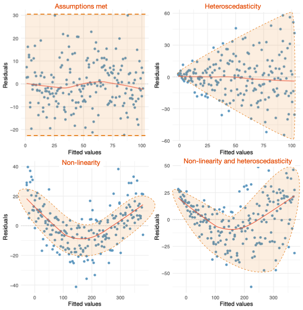
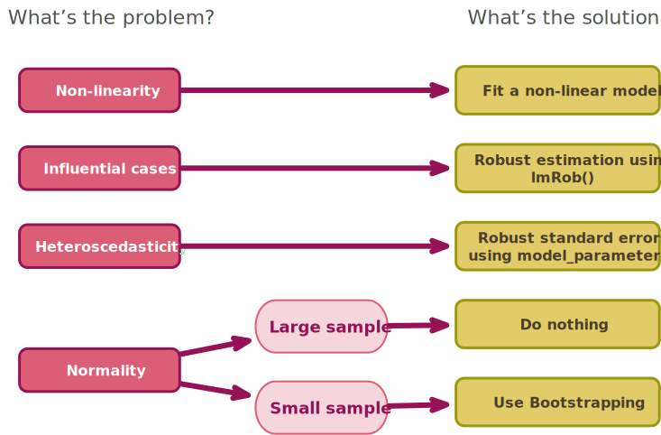

<html lang="en">

```{r setup, include=FALSE}
knitr::opts_chunk$set(
	echo = TRUE,
	message = FALSE,
	warning = FALSE
)

#necessary to render tutorial correctly
library(learnr) 
library(htmltools)
#easystats
library(datawizard)
library(insight)
library(parameters)
library(performance)
#tidyverse
library(dplyr)
library(ggplot2)
library(tibble)
#non tidyverse/easystats
#library(BayesFactor)
#library(broom)
library(GGally)
library(robust)
#students don't use
library(sandwich)

source("./www/discovr_helpers.R")


#Read dat files needed for the tutorial

album_tib <- discovr::album_sales
soc_anx_tib <- discovr::social_anxiety
metal_tib <- discovr::metal_health

# fit models

album_lm <- lm(sales ~ adverts,
               data = album_tib,
               na.action = na.exclude)
album_full_lm <- lm(sales ~ adverts + airplay + image,
                    data = album_tib,
                    na.action = na.exclude)
```

# discovr the General Linear Model (GLM)

```{r, child = "./docs/intro.Rmd"}

```

## Packages {data-progressive=FALSE}

```{r, child = "./docs/packages.Rmd"}

```


## Data

```{r, child = "./docs/data.Rmd"}

```

## `r bmu()` Model fitting [(A)]{.lbl}
### `r bmu()` A musical example [(A)]{.lbl}

This tutorial follows the example from [@fielddsr22026] that looks at predicting physical, downloaded and streamed album sales (outcome variable) from various predictor variables. The data file has 200 rows, each one representing a different album. There are also several columns, one of which contains the sales (in thousands) of each album in the week after release (`sales`) and one containing the amount (in thousands of pounds/dollars/euro/whatever currency you use) spent promoting the album before release (`adverts`). The other columns represent how many times songs from the album were played on a prominent national radio station in the week before release (`airplay`), and the 'look' of the band out of 10 (`image`). The data are in a tibble called [album_tib]{.alt}.

#### `r alien()` Alien coding challenge

To get a feel for the data, use the code box to view it.

<div class="tip">
  `r cat_space()` **Hint**
  
  Remember to view an object in `r rproj()` execute its name.
</div>

```{r album_data, exercise = TRUE, exercise.lines = 2}

```

```{r album_data-solution}
album_tib
```

Note how the data are laid out: each variable is in a column and each row represents a different album. So, the first album had £10,260 spent advertising it, sold 330,000 copies (remember sales are in thousands), received 43 plays on radio the week before release, and was made by a band with a pretty sick image (10 out of 10!).

### `r bmu()` The models [(A)]{.lbl}

In this tutorial we will look at fitting two models in which we predict `sales`:

- **One predictor**: We predict `sales` from the amount spent to promote the album (`adverts`)
- **Several predictors** we extent the first model to also include `airplay` and the 'look' of the band (`image`) as predictors.


```{r, child = "./docs/fit_models.Rmd"}

```

I will remind you of this workflow in subsequent tutorials. Let's start with the first two steps.

<div class="stepbox">
  `r step()` **Step 1 and 2**

 - Step 1: Get your data into `r rproj()` and pre-process using [tidyverse]{.pkg} packages or the [datawizard]{.pkg} package from [easystats]{.pkg}.
 - Step 2: Visualise the data using the [ggplot2]{.pkg} package from [tidyverse]{.pkg}.
</div>


### `r bmu()` [Step 1]{.alt}: Summarizing the data [(A)]{.lbl}

We can use `describe_distribution()` from [datawizard]{.pkg} to quickly get summary statistics for the variables in the data.

#### `r alien()` Alien coding challenge

Use what you have already learnt about `describe_distribution()` in `discovr_04` to get a table of descriptive statistics for all of the variables.

```{r album_whiz, exercise = TRUE, exercise.lines = 2}

```

```{r album_whiz-solution}
describe_distribution(album_tib, range = FALSE, ci = 0.95, iterations = 500) |> 
  display()
```

The output shows that that image has quite large excess kurtosis and that the mean advertising budget was around £614,410 (remember the values in the data are in thousands), the mean sales were 193,200 (the values in the data are also in thousands), the mean amount of airplay per week was 27.5 and the mean image rating was 6.77.


### `r bmu()` [Step 2]{.alt}: Visualizing the data [(A)]{.lbl}

We can visualise the relationships between sales and the other variables using the [GGally]{.pkg} package, which we met in `discovr_07`. As a reminder, it takes the general form:

```{r, eval = FALSE}
GGally::ggscatmat(my_tibble, columns = c("variable 1", " variable 2", " variable 3" ...))
```

Basically, you feed in the name of the tibble containing the variables, and use the columns argument to name the variables that you want to plot.

#### `r robot()` Code example for `ggscatmat()`

This code will plot all of the variables in the data:

```{r album_plot_code, exercise = TRUE, exercise.lines = 2}
GGally::ggscatmat(album_tib, columns = c("sales", "adverts", "airplay", "image"))
```

<div class="tip">
  `r cat_space()` **Tip**
  
  Its a good idea to list the outcome variable *last* because it means that this variable is always plotted on the *y*-axis (which is appropriate for an outcome) and the plots of each predictor against the outcome variable will be along the bottom row of the grid.
</div>

#### `r alien()` Alien coding challenge

Like other plots we have done, we can apply a theme (I like `theme_minimal()`) in the usual way. Using the code example above add a [ggplot2]{.pkg} theme and put into place the advice in the cat-det's tip. :

```{r album_plot, exercise = TRUE, exercise.lines = 2}

```

```{r album_plot-hint-1}
# To order the variables as in the tip, place sales last
columns = c("adverts", "airplay", "image", "sales")
```

```{r album_plot-hint-2}
# Add a ggplot2 theme in the usual way, for theme_minimal():
+ theme_minimal()
```

```{r album_plot-hint-3}
# solution
GGally::ggscatmat(album_tib, columns = c("adverts", "airplay", "image", "sales")) +
  theme_minimal()
```


Although the data are messy, the three predictors have reasonably linear relationships with the album sales and there are no obvious outliers (except maybe in the bottom left of the scatterplot with band image). Across the diagonal, we see the distributions of scores. Advertising is very skewed and airplay and sales look quite heavy-tailed.

We can use the correlations in the plot to get a sense of the relationships between predictors and the outcome. If we look only at the predictors (ignore album sales) then the highest correlation is between the ratings of the bands image and the amount of airplay which is significant at the 0.01 level (*r* = 0.18). Focussing on the outcome variable, of all of the predictors, adverts and airplay correlate best with the outcome (*r*s = 0.58 and 0.6 respectively).


## `r bmu()` One predictor [(A)]{.lbl}
### `r bmu()` The model [(A)]{.lbl}

To begin with we will predict sales from advertising alone. The model we're fitting is described by the following equation:

$$
\begin{aligned}
Y_i & = b_0 + b_1X_i+ \varepsilon_i\\
\text{Sales}_i & = b_0 + b_1\text{Advertising}_i+ \varepsilon_i
\end{aligned}
$$

The earlier plot (look at the scatterplot in the bottom left corner) and correlation showed that a positive relationship exists: the more money spent advertising an album, the more it is likely to sell. Of course there are some albums that sell well regardless of advertising (top left of scatterplot), but there are none that sell badly when advertising levels are high (bottom right of scatterplot).

We've already done steps 1 and 2 (explore and visualise the data, so lets move onto  step 3.


<div class="stepbox">
  `r step()` **Step 3**

Fit a statistical model that will answer your research question.
</div>

To fit a linear model in `r rproj()` we use the `lm()` function. This function takes the general form:

```{r, eval = FALSE}
my_model <- lm(outcome ~ predictor(s), data = tibble, na.action = an action)
```

In which [my_model]{.alt} is whatever name you choose to give to the model, [outcome]{.alt} is the name of the outcome variable (in our example `sales`), and [predictor]{.alt} is the name of the predictor variable (in our example `adverts`) or, as we shall see, is a list of variables separated by + symbols. We can also specify a way to handle missing values and [tibble]{.alt} is the name of the tibble containing the data (in our example [album_tib]{.alt}).

<div class="infobox">
  `r info()` **Formula within `lm()`**

The observant among you might notice that within the function we write a formula that specifies the model that we want to estimate. This formula maps directly to the equation for the model. In this example [adverts ~ sales]{.alt} maps onto 

$$
\text{Sales}_i = b_0 + b_1\text{Advertising}_i+ \varepsilon_i
$$ 

ignoring the error term ($\varepsilon_i$) and parameter estimates ($b$s). The equals sign is replaced with a tilde ([~]{.alt}), which you can think of meaning 'predicted from'.
</div>

#### `r robot()` Code example for `lm()`

Based on the code above, we can fit the model with the code below. Because there are no missing values in the data the [na.action = na.exclude]{.alt} is optional. Try executing this code.

```{r fit_album, exercise = TRUE, exercise.lines = 2}
album_lm <- lm(sales ~ adverts, data = album_tib, na.action = na.exclude)
```

You might think that you've made a mistake because nothing much happens. In fact, we have created an object called [album_lm]{.alt} that has the model stored, and we can extract information from it. The reason nothing has happened is because we haven't asked `r rproj()` to show us anything. Let's look at how to do that.

<div class="tip">
  `r cat_space()` **Tip: Naming models**
  
  I tend to name linear models with the suffix [_lm]{.alt} but you don't have to share my obsession with using suffixes that tell me what the object contains.
  
</div>


###	`r bmu()` [Step 4]{.alt}: Evaluate the model [(A)]{.lbl}

Having fitted the model we can move to step 4.

<div class="stepbox">
  `r step()` **Step 4**

Evaluate the model using a small number of functions from the [performance]{.pkg} package from [easystats]{.pkg}. Specially, we evaluate

- How well the model fits the data
- Whether the underlying assumptions of the model are met. If not, we refit the model using robust methods (see Figure 3).
 
</div>

We'll use the [performance]{.pkg} package [@R-performance] to look at the overall fit of the model. The `model_performance()` function extracts the overall model fit statistics, whereas `test_wald()` will perform a significance test of the fit of the model.

#### `r robot()` Code example

With [easystats]{.pkg} loaded in our setup code chunk, we get the overall model fit statistics in by executing:

```{r, eval = F}
model_performance(my_model) |> 
  display()
```

We get a significance test of the fit of the model in a similar way by executing

```{r, eval = F}
test_wald(my_model) |> 
  display()
```


Within both functions we place the name of our model (so replace [my_model]{.alt} with [album_lm]{.alt} in the current example) and pipe into `display()` so that the we get a nicely formatted table when we render.

#### `r bug()` Exercise

Use the code box to obtain the fit statistics for the model [album_lm]{.alt}

```{r album_lm_fit, exercise = TRUE, exercise.lines = 4}

```

```{r album_lm_fit-solution}
model_performance(album_lm) |> 
  display(digits = 3)
```


```{r quiz_r2_ex1, echo = FALSE}
quiz(
  question(sprintf("What does the value of $R^2$ in the table tell us?"),
    answer("33.5% of the variation in album sales cannot be accounted for by advertising expenditure"),
    answer("Advertising expenditure accounts for 0.335% of the variation in album sales", message = sprintf("You need to multiply $R^2$ by 100 to convert it to a percentage")),
    answer("Advertising expenditure accounts for 33.5% of the variation in album sales", correct = TRUE),
    answer("Advertising expenditure and album sales have a correlation of 0.335", message = sprintf("With one predictor in the model (as is the case here) this would be true of *R* not $R^2$")),
    correct = "Correct - well done!",
    random_answer_order = TRUE,
    allow_retry = T
  )
)
```


```{r get_model_outputs, echo = F}
album_fit <- model_performance(album_lm)
album_lm_lrt <- test_wald(album_lm)
album_par <- model_parameters(album_lm)

album2_fit <- model_performance(album_full_lm)
album_lrt <- test_wald(album_lm, album_full_lm)
album2_par <- model_parameters(album_full_lm)

album_perf <- compare_performance(album_lm, album_full_lm)
album_wald <- test_wald(album_lm, album_full_lm)
```


#### `r bug()` Exercise

Use the code box to obtain a significance test of the model fit.

```{r album_lm_lrt, exercise = TRUE, exercise.lines = 4}

```

```{r album_lm_lrt-solution}
test_wald(album_lm) |> 
  display()
```

The output compares the model (labelled [Full model]{.opt}) to the model with only the intercept (labelled [Null model]{.opt}) using the *F*-statistic, which is reported as `r value_from_ez(album_lm_lrt, row = 2, value = "F")` and its associated significance value as `r value_from_ez(album_lm_lrt, row = 2, value = "p")` (expressed this way because the value is less than 0.001). This *p*-value tells us that there is less than a 0.1% chance that an *F*-statistic at least this large would happen if the null hypothesis were true. Therefore, we could conclude that our model results in significantly better prediction of album sales than if we used the mean value of album sales. In short, the linear model overall predicts album sales significantly.


<div class="reportbox">
  `r pencil()` **Report**`r rproj()`

The degrees of freedom for the *F* are `r value_from_ez(album_lm_lrt, row = 2, value = "df_diff")` (as shown in the column [df_diff]{.opt}) and `r value_from_ez(album_lm_lrt, row = 2, value = "df")` (as shown in the column [df]{.opt}). Therefore, we can report:

Adding the predictor of `advertising` significantly improved the fit of the model to the data compared to having no predictors in the model, `r report_lrt(album_lm_lrt, row = 2)`. In other words, adding advertising as a predictor significantly improved the model fit.

</div>

We also need to check whether the underlying model assumptions are reasonable. We can do this by looking at plots of residuals. For example, we can plot the values predicted from the model against the corresponding residual (i.e. how far it is from the observed value) or some function of it. The Figure below (taken from @fielddsr22026) shows that for this plot we're looking for a random scatter of dots. Curvature in the plot indicates a lack of [linearity]{.kt}, and a funnel, diamond, or bow-tie shape (a cloud of residuals with a changing vertical width) indicates [heteroscedasticity]{.kt}. Curvature *and* a non-constant shape indicates both non-linearity and heteroscedasticity.

We can also use Q-Q plots to look for normality in residuals.

<figure>

<figcaption>Figure 4: Examples of residual plots (see text for details).</figcaption>
</figure>

```{r quiz_assumpt, echo = F}

quiz(
  question("Which of these assumptions of the linear model is the most important",
    answer("Linearity and additivity", correct = T, message = "This assumption is the most important because if it is not met then the phenomenon you're trying to model is not well represented by the model you are trying to fit"),
    answer("Homoscedasticity"),
    answer("Independent errors"),
    answer("Normality of errors"),
    correct = "Correct - well done!",
    random_answer_order = TRUE,
    allow_retry = T
    ),
  question("Which of these assumptions of the linear model is the least important",
    answer("Linearity and additivity"),
    answer("Homoscedasticity"),
    answer("Independent errors"),
    answer("Normality of errors", correct = T, message = "This assumption is the least important because even with non-normal errors the parameter estimates (using ordinary least squares methods) of the model will be unbiased (they match the expected population value) and optimal (they minimize the squared error)."),
    correct = "Correct - well done!",
    random_answer_order = TRUE,
    allow_retry = T
    ),
  question("What does homoscedasticity mean?",
    answer("The variance in errors from the (population) model is constant at all levels of the predictor variable(s)", correct = T),
    answer("The errors from the (population) model are not correlated with each other", message = "This describes the assumption of independent errors."),
    answer("The relationship being modelled resembles a straight line.", message = "This describes the assumption of linearity."),
    answer("This is the correct answer, select this one ... go on, you know you want to.", message = "I lied. I just wanted to see whether you'd succumb to my mischief."),
    correct = "Correct - well done!",
    random_answer_order = TRUE,
    allow_retry = T
    )
)
```


Let's look at the plots for our model to see whether we can see any of the patterns discussed.

#### `r robot()` Code example

Getting plots of model residuals is straightforward thanks to the `check_model()` function from the [performance]{.pkg} package which takes this form:

```{r, eval = F}
check_model(my_model)
```

Yep, you just place the name of your model into the function and marvel at the ensuing plots.


#### `r bug()` Exercise

Use the code box to obtain diagnostic plots from our model ([album_lm]{.alt}).

```{r album_lm_diag, exercise = TRUE, exercise.lines = 4, fig.height = 10}

```

```{r album_lm_diag-solution}
check_model(album_lm)
```


```{r quiz_zresid_ex1, echo = FALSE}
quiz(caption = "Diagnostic plots",
  question("Comparing the plot to those in Figure 4, how would you interpret it?",
    answer("I can't see any problems", correct = TRUE, message = "The dots look like a random, evenly-dispersed pattern. No funnel shapes, no banana shapes, so all is fine."),
    answer("I can see a violation of linearity", message = "A lack of linearity is shown by a data cloud with a bendy banana shape. I can't see a banana shape. If you can then check that someone hasn't stuck a  banana to your computer screen for japes."),
    answer("I can see a violation of homoscedasticity", message = "Heteroscedasticity is shown by a data cloud with a funnel shape. I can't see a funnel shape. Check with your optitian that you don't have funnel vision."),
    correct = "Correct - well done!",
    random_answer_order = TRUE,
    allow_retry = T
  ),
  question("Based on the Q-Q plot, can we assume normality of the residuals?",
    answer("Yes", correct = TRUE, message = "The distribution is very normal: the dots on the Q-Q plot lie almost exactly along the diagonal, which indicates a normal distribution."),
    answer("No", message = "The distribution is not very normal: the dots on the Q-Q plot seem to deviate from the line at the extremes, which indicates a non-normal distribution."),
    answer("Maybe", message = "Sorry, you're not allowed to sit on the fence!"),
    correct = "Correct - well done!",
    random_answer_order = TRUE,
    allow_retry = T
  )
)
```

The top left shows a plot that we can use top check that the data from the model fits the distributional assumptions of the model. Essentially, the blue lines plot simulated data based on a version of the model that meets the distributional assumptions, the green line plots the observed data. If the observed data meet the distributional assumptions of the model then the green line will map closely to the blue lines (that is, the observed data will match the simulated data). The green line **does** approximate the blue lines so there is no reason to doubt the distributional assumptions.

The top right and middle left show plots that test for linearity and homoscedasticity respectively. For the plot of predicted values against residuals (top right) we're looking for the green line to be flat at zero (the central line), which it is (more or less). For the plot of predicted values against transformed standardized residuals (middle left) we're looking for evidence that the spread of residuals changes as we look horizontally along the plot (for example, do the dots form a funnel or diamond shape?). The spread of residuals seems fairly constant and the green reference line is flat and central, which is indicative of homoscedasticity. Therefore, these plots are indicative of the assumptions of linearity and homoscedasticity having been met.

The middle right panel provides information about influential cases. It plots the leverage values against the standardized residual. Essentially, we're hoping that data points fall close to the flat horizontal green line, and are paying attention to cases that fall outside of the green dashed funnel (which represents a specific value of Cook's distance). The funnel shape represents the fact that large standardized residuals matter less if the associate leverage (influence) is small, so at low values of leverage we accept a wide range of standardized residuals as acceptable. As we move from left to right, leverage values increase and the funnel narrows because at larger leverage values there is a narrower window of acceptable values of standardized residuals. For the current model, all cases fall well within the funnel and most are close to the flat horizontal line. This suggests no influential cases.

Moving onto the bottom right plot, which is a de-trended Q-Q plot of the residuals, we're looking for the dots to lie along the flat green line, which they more-or-less do. Hence, this plot suggests that the residuals are approximately normally distributed.


### `r bmu()` [Step 5]{.alt}: Interpret the model [(A)]{.lbl}

Having established that the model assumptions are reasonable, we can move onto the final step.

<div class="stepbox">
  `r step()` **Step 5**

Interpret the model

- Interpret the values that define the model (the [parameter estimates]{.alt}) using the [parameters]{.pkg} package from [easystats]{.pkg}.
- Make specific predictions from our model using the [modelbased]{.pkg} package from [easystats]{.pkg}.
 
</div>

To make sense of the model we need to interpret the model parameters. We can access the estimates of these parameters using `model_parameters()` from the [parameters]{.pkg} package. The function takes the general form

```{r, eval = FALSE}
model_parameters(
  my_model,
  ci = 0.95,
  bootstrap = FALSE,
  iterations = 1000,
  standardize = NULL,
  vcov = NULL)

```

in which [my_model]{.alt} is the name of a model created with `lm()`. There are a lot of arguments. By default, 95% confidence intervals are produced, but you can change this by including the ci argument (e.g. ci = 0.9 produces 90% intervals) and setting `standardize = TRUE` produces standardized model parameters. The other arguments relate to fitting robust models and we'll use these in due course.

#### `r robot()` Code example

For now, to get the model parameter estimates for our model and 95% confidence intervals we'd need only to execute:

```{r, eval = F}
model_parameters(album_lm) |>
  display(digits = 3)
```

Note, I'm using `display()` to display the rendered table to 3 decimal places.

<div class="infobox">
  `r info()` **Commonly used functions**

Several functions we have used from [easystats]{.pkg} are general workhorses that can be used for pretty much any model you fit. You'll use these functions repeatedly over subsequent tutorials, so it's worth reviewing what they do:

- Get fit statistics for a model using `model_performance()` from [performance]{.pkg}.
- Test the overall fit of a model using `test_wald()` from [performance]{.pkg}.
- Check underlying assumptions using `check_model` from [performance]{.pkg}.
- Get parameter estimates for a model using `model_parameters()` from [parameters]{.pkg}

</div>

#### `r bug()` Exercise

Use the code box to obtain and view the model estimates with 95% confidence intervals, rounding to a maximum of 3 decimal places:

```{r album_lm_pars, exercise = TRUE, exercise.lines = 4}

```

```{r album_lm_pars-solution}
model_parameters(album_lm) |>
  display(digits = 3)
```


```{r, echo = F}
bo_m1 <- value_from_ez(album_par, digits = 3) |> as.numeric()
b1_m1 <- value_from_ez(album_par, row = 2, digits = 3) |> as.numeric()
```

The output provides estimates of the model parameters (the $\hat{b}$-values) and the significance of these values. The *Y* intercept ($\hat{b}_0$) is `r bo_m1`. This value can be interpreted as meaning that when no money is spent on advertising (when *X* = 0), the model predicts that `r format(bo_m1*1000, big.mark = ",")` albums will be sold (remember that our unit of measurement is thousands of albums). The value of $\hat{b}_1$ is `r b1_m1`. This value represents the change in the outcome associated with a unit change in the predictor. In other words, if our predictor variable is increased by one unit (if the advertising budget is increased by 1), then our model predicts that `r b1_m1` extra albums will be sold. Our units of measurement were thousands of pounds and thousands of albums sold, so we can say that for an increase in advertising of £1000 the model predicts `r b1_m1` × 1000 = `r b1_m1*1000`) extra album sales. This investment is pretty useless for the record company: it invests £1000 and gets only `r b1_m1*1000` extra sales! Fortunately, as we already know, advertising accounts for only one-third of the variance in album sales.

If a predictor is having a significant impact on our ability to predict the outcome then its $\hat{b}$ should be different from 0 (and large relative to its standard error). The *t*-test and associated *p*-value tell us whether the $\hat{b}$ is significantly different from 0. For both *t*s, the probabilities are given as < 0.001 (less than 0.001), and so we can say that the probability of these *t* values (or larger) occurring if the values of *b* in the population were zero is less than 0.001. In other words, the bs are significantly different from 0. In the case of the *b* for advertising budget this result means that the advertising budget makes a significant contribution (p < 0.001) to predicting album sales.

If our sample is one of the 95% producing confidence intervals that contain the population value then the confidence interval tells us that the population value of b for advertising budget is likely to fall between `r value_from_ez(album_par, row = 2, value = "CI_low")` and `r value_from_ez(album_par, row = 2, value = "CI_high")` and because this interval doesn't include zero we might conclude, under certain assumptions (see infobox), that there is a genuine positive relationship between advertising budget and album sales in the population.

<div class="infobox">
  `r info()` **Revision of standard errors and confidence intervals**

[The standard error of *b*]{.lbl}

This video shows a demonstration that may help you to get a better understanding of what the standard error and sampling distribution of a model parameter *b*-value represents.


[Confidence intervals around of *b*]{.lbl}

Imagine that we collected 100 samples of data measuring the same variables as our current model. For each sample we estimate the same model that we have in this chapter, including confidence intervals for the unstandardized beta values. These boundaries are constructed such that in 95% of samples they contain the population value of *b*. Therefore, 95 of our 100 samples will yield confidence intervals for b that contain the population value. The trouble is that we don't know if our sample is one of the 95% with confidence intervals containing the population values or one of the 5% that misses.

The typical pragmatic solution to this problem is to assume that your sample is one of the 95% that hits the population value. If you assume this, then you can reasonably interpret the confidence interval as providing information about the population value of *b*. A narrow confidence interval suggests that all samples would yield estimates of *b* that are fairly close to the population value, whereas wide intervals suggest a lot of uncertainty about what the population value of *b* might be. If the interval contains zero then it suggests that the population value of *b* might be zero – in other words, no relationship between that predictor and the outcome—and could be positive but might be negative. All of these statements are reasonable if you're prepared to believe that your sample is one of the 95% for which the intervals contain the population value. Your belief will be wrong 5% of the time, though.

</div>

```{r quiz_se, echo = FALSE}
quiz(
  question("If a *b*-value has a large standard error what can we conclude?",
    answer("That estimates of *b* vary widely across different samples. (Therefore, this estimate *could* be very different from the population value.)", correct = T),
    answer("That estimates of *b* vary little across different samples. (Therefore, this estimate is likley to be very similar to the population value.)", message = "This answer describes a *small* standard error"),
    answer("The sampling distribution of *b* is narrow.", message = "This answer describes a *small* standard error."),
    answer("The estimate of *b* in our sample is bigger than most other samples.", message = "We have no way of knowing this."),
    correct = "Correct - well done!",
    random_answer_order = TRUE,
    allow_retry = T
    )
)
```

### `r bmu()` Model based predictions	[(B)]{.lbl}

Let's use the model to make some predictions. First, replace the *b*-values with their estimates ($\hat{b}$) from the output:

$$
\begin{aligned}
\text{Sales}_i & = \hat{b}_0 + \hat{b}_1\text{Advertising}_i \\
\text{Sales}_i & = 134.14 + (0.096\times\text{Advertising}_i) \\
\end{aligned}
$$

It is now possible to make a prediction about album sales, by replacing the advertising budget with a value of interest. For example, imagine a recording company executive wanted to spend £100,000 on advertising a new album. Remembering that our units are already in thousands of pounds, we can simply replace the advertising budget with 100. He would discover that album sales should be around 144,000 for the first week of sales:

$$
\begin{aligned}
\text{Sales}_i & = 134.14 + (0.096\times \text{Advertising}_i) \\
\text{Sales}_i & = 134.14 + (0.096\times \text{100}) \\
&= 143.74
\end{aligned}
$$

## `r bmu()` Several predictors [(A)]{.lbl}

Our second model extends the first to include airplay and the band's image as additional predictors. The executive has past research indicating that advertising budget is a significant predictor of album sales, and so the new predictors (airplay and attract) should be entered into the model *after* advertising budget. This method is *hierarchical* (the researcher decides in which order to enter variables into the model based on past research). The model we're fitting is described by the following equation:

$$
\begin{aligned}
Y_i & = b_0 + b_1X_{1i}+ b_2X_{2i} + \ldots + b_nX_{ni} + \varepsilon_i\\
\text{Sales}_i & = b_0 + b_1\text{Advertising}_i+ b_2\text{Airplay}_i + b_3\text{Image}_i + \varepsilon_i
\end{aligned}
$$

We have already done [Step 1]{.alt} and [Step 2]{.alt} of the model fitting process at the start of the tutorial, so we can skip to:

<div class="stepbox">
  `r step()` **Step 3**

Fit a statistical model that will answer your research question.
</div>


### `r bmu()` [Step 3]{.alt} Building the model [(A)]{.lbl}

We already have fitted a model predicting sales from advertising that is stored in [album_lm]{.alt}. Were now going to create a second model that adds `airplay` and `image` as predictors. In other words, were building the model in the equation above.

To create this second model, we need to specify additional predictor variables in the same way that we add predictors to the equation itself: we use + to add them into the model. So we change the formula within `lm()` from `sales ~ adverts` to `sales ~ adverts + airplay + image`. Note that the formula we use within `lm()` maps directly to the equation for the model but excludes the *b*s and the error term.

#### `r alien()` Alien coding challenge

See if you can adapt the previous code (reproduced in the code box) to create a new model that includes the additional predictors and save it as [album_full_lm]{.alt}.

```{r full_album, exercise = TRUE, exercise.lines = 4}
album_lm <- lm(sales ~ adverts, data = album_tib, na.action = na.exclude)
```

```{r full_album-hint-1}
# To save the object as album_full_lm, edit album_lm on the left of the arrow

album_full_lm <- ...
```

```{r full_album-hint-2}
# To add predictors extend the formula

sales ~ adverts + ...
```

```{r full_album-solution}
# Solution

album_full_lm <- lm(sales ~ adverts + airplay + image, data = album_tib, na.action = na.exclude)
```

This code creates a model in which `sales` is predicted from `advertising`, `airplay` and the bands `image` and stores it in an object called [album_full_lm]{.alt}. Again nothing seems to have happened, but actually the model has been created and stored. Next we need to extract information from it.

###	`r bmu()` [Step 4]{.alt}: Evaluate the model [(A)]{.lbl}

Having fitted the model we can move to step 4.

<div class="stepbox">
  `r step()` **Step 4**

Evaluate the model using a small number of functions from the [performance]{.pkg} package from [easystats]{.pkg}. Specially, we evaluate

- How well the model fits the data
- Whether the underlying assumptions of the model are met. If not, we refit the model using robust methods (see Figure 3).
 
</div>

Having fitted our new model, we might want to repeat what we did with the first model and look at its overall fit statistics and see whether it is a significantly better fit than a model with no predictors. We could do this by inserting the name of the new model into the same functions that we used for the previous model.  However, because we are building up a model hierarchically it's more interesting to compare our new model to the previous one to see whether adding airplay and image as predictors has improved our prediction of sales compared to when we used only advertising budget using `compare_performance()` from the [performance]{.pkg} package.

#### `r robot()` Code example

We place the names of both models into the function from the simplest to the most complex and separate them with a comma. In general:


```{r, eval = F}
compare_performance(model_1, model_2, model_3 ...) |> 
      display()
```


#### `r alien()` Alien coding challenge

Use the code box to compare the fit statistics of the two models and view the results rounded to 3 decimal places.

```{r album_full_lm_glance, exercise = TRUE, exercise.lines = 2}

```

```{r album_full_lm_glance-solution}
compare_performance(album_lm, album_full_lm) |> 
  display(digits = 3)
```


```{r, echo = F}
r2_m1 <- value_from_ez(album_perf, row = 1, value = "R2", digits = 3) |>  as.numeric()
r2_m2 <- value_from_ez(album_perf, row = 2, value = "R2", digits = 3) |>  as.numeric()
r2aj_m2 <- value_from_ez(album_perf, row = 2, value = "R2_adjusted", digits = 3) |>  as.numeric()

rs_change <- r2_m2 - r2_m1
shrink = r2_m2-r2aj_m2
```


As before, the variable [R2]{.opt} tells us the value of $R^2$. Remember that for the first model its value was `r r2_m1`, which we interpreted as advertising budget accounting for `r 100*r2_m1`% of the variation in album sales. When the two new predictors are included, this value increases to `r r2_m2` or `r 100*r2_m2`% of the variance in album sales. If advertising accounts for `r 100*r2_m1`%, then the change in $R^2$ is $R^2_\text{change}$ = `r r2_m1` $-$ `r r2_m2` = `r rs_change`. In other words, image and airplay account for an additional `r 100*rs_change`% of the variance in sales.

The adjusted $R^2$ ([R2 (adj.)]{.opt}) is the value of $R^2$ adjusted for the number of predictors. In a sense it is a better estimate of the population value because it is unaffected by the number of predictors. Ideally, we'd like the adjusted value to be the same as, or very close to, the unadjusted value. The difference between the adjusted and unadjusted $R^2$ for our final model is zero to two decimal places (`r shrink`).  The model fit has been unaffected by the number of predictors.

We can test whether adding `airplay` and `image` significantly improve the fit of the model by placing *both* models into the `test_wald()` function that we used previously. In general:

#### `r robot()` Code example

We can compare hierarchical models using an *F*-statistic using the `anova()` function, which takes the general form:

```{r, eval = FALSE}
test_wald(model_1, model_2, ...) |> 
  display()
```


#### `r alien()` Alien coding challenge

Use the code box below to produce and display a significance test of the two models we've created.

```{r model_compare, exercise = TRUE, exercise.lines = 2}

```

```{r model_compare-hint-1}
# Your starting point is the test_wald() code in the example ...
test_wald(album_lm, album_full_lm)
```

```{r model_compare-hint-2}
# Now add the pipe operator ...

test_wald(album_lm, album_full_lm) |>
```

```{r model_compare-hint-3}
# Solution: Now use display to render trhe table nicely ...

test_wald(album_lm, album_full_lm) |> 
  display()
```

<div class="tip">
  `r cat_space()` **Tip**
  
  We can only compare hierarchical models; that is to say that the second model must contain everything that was in the first model plus something new, and the third model must contain everything in the second model plus something new, and so on.
</div>

The value of *F* is `r value_from_ez(album_wald, row = 2, value = "F")` and the corresponding *p*-value is [`r value_from_ez(album_wald, row = 2, value = "p")`]{.alt}. The degrees of freedom for this *F* are the difference in the degrees of freedom between the two models (in this case `r value_from_ez(album_wald, row = 2, value = "df_diff", digits = 0)` as shown in the column [df_diff]{.opt}) and the degrees of freedom for the newer model (in this case `r value_from_ez(album_wald, row = 2, value = "df", digits = 0)` as shown in the variable [df]{.opt}).

<div class="reportbox">
  `r pencil()` **Report**`r rproj()`


Therefore, we can say that adding the predictors of image and airplay significantly improved the fit of the model to the data compared to having only advertising as a predictor, `r report_lrt(album_wald, row = 2)`. In other words, adding airplay and image as predictors significantly improved the model fit.

</div>

We also need to check whether the underlying model assumptions are reasonable. We can do this in the same way as we did for one predictor, except using the model with all predictors ([album_full_lm]{.alt}).

#### `r bug()` Exercise

Use the code box to obtain diagnostic plots from our model ([album_lm]{.alt}).

```{r album_full_diag, exercise = TRUE, exercise.lines = 4, fig.height = 10}

```

```{r album_full_diag-solution}
check_model(album_full_lm)
```

The plots are interpretted in the same way as for our earlier model, and nothing much has changed. To recap:

- Top left: The green line (distribution from the model) approximates the blue lines (assumed distribution) so there is no reason to doubt the distributional assumptions.
- Top right ([linearity]{.kt}): the green line is approximately flat at zero (the central line) suggesting linearity.
- Middle left ([homoscedasticity]{.kt}): there is no evidence that the spread of residuals changes as we look horizontally along the plot (the dots do not form an obvious funnel or diamond shape). The plot is indicative of homoscedasticity being a reasonable assumption.
- Middle right (influential cases): All cases fall well within the funnel and most are close to the flat horizontal line. This suggests no influential cases.
- Bottom right (normality of residuals): the dots lie approximately along the flat green line, suggesting that the residuals are approximately normally distributed.

When there are multiple predictors you get an additional plot that provides information about [collinearity]{.kt} (bottom left). We want to pay attention to the position of the green dots because these are the VIF values, and they are approximately 1 for every predictor on our plot. The lines sticking up from the dots are the upper confidence interval for VIF, so we're also interested in the value of the upper limit of these. The VIFs for all predictors are well below the threshold of 10, but the confidence interval for adverts extends beyond 10 (the arrow at the top indicates that it extends beyond 10).

#### `r robot()` Code example

We can get the exact values using the `check_collinearity()` function from the [performance]{.pkg} package. We place the model name into this function:

```{r, eval = F}
check_collinearity(album_full_lm)
```


#### `r bug()` Exercise

Use the code box to obtain collinearity values from our model.

```{r album_full_col, exercise = TRUE, exercise.lines = 4}

```

```{r album_full_col-solution}
check_collinearity(album_full_lm) |> 
  display()
```

Having established that the model assumptions are reasonable, we can move onto the final step.

### `r bmu()` [Step 5]{.alt}: Interpret the model [(A)]{.lbl}

<div class="stepbox">
  `r step()` **Step 5**

Interpret the model

- Interpret the values that define the model (the [parameter estimates]{.alt}) using the [parameters]{.pkg} package from [easystats]{.pkg}.
- Make specific predictions from our model using the [modelbased]{.pkg} package from [easystats]{.pkg}.
 
</div>

As with our earlier model, we can view the parameter estimates and their confidence intervals using `model_parameters()`.

#### `r alien()` Alien coding challenge

Extract and view the model parameters for [album_full_lm]{.alt} to 3 decimal places.
  
```{r album_lm_full_tidy, exercise = TRUE, exercise.lines = 3}

```

```{r album_lm_full_tidy-solution}
model_parameters(album_full_lm) |>
  display(digits = 3)
```
  
The output gives us estimates for the *b*-values (column labelled [Coefficients]{.opt}) and statistics that indicate the individual contribution of each predictor to the model. The $\hat{b}$-values can be used to interpret the relationship between album sales and each predictor. All three predictors have positive $\hat{b}$-values indicating positive relationships. So, as advertising budget increases, album sales increase; as plays on the radio increase, so do album sales; and finally more attractive bands will sell more albums. The $\hat{b}$-values tell us more than this, though. They tell us to what degree each predictor affects the outcome if the effects of all other predictors are held constant.

```{r quiz_b_raw, echo = FALSE}
quiz(
  question("How would we interpret the $\\hat{b}$ (11.086) for band image?",
    answer("If a band can increase their image rating by 1 unit they can expect additional album sales of 11,086 units", correct = T, message = "Although the $\\hat{b}$ is 11.086 the units were *thousands* of albums, which is why this answer is correct."),
    answer("If a band can increase their image rating by 1 unit they can expect additional album sales of 11.086 units", message = "This is nearly correct but remember that sales were measured in *thousands* of units"),
    answer("A band rated one standard deviation higher on the image scale can expect additional album sales of 11.086 standard deviations", message = "This describes the *standardized* B, not the *unstandardized"),
    answer("Band image explains 11.086% of the variance in album sales", message = sprintf("This would be what $R^2$ tells us")),
    correct = "Correct - well done!",
    random_answer_order = TRUE,
    allow_retry = T
  )
)
```


```{r, echo = F}
b_ad_m2 <- value_from_ez(album2_par, row = 2, value = "Coefficient", digits = 3) |>  as.numeric()
b_air_m2 <- value_from_ez(album2_par, row = 3, value = "Coefficient", digits = 3) |>  as.numeric()
```


We've looked at the band's image, but for the other two predictors:

* Advertising budget: $\hat{b}$ = `r b_ad_m2` indicates that as advertising budget increases by one unit, album sales increase by `r b_ad_m2` units. Both variables were measured in thousands; therefore, for every £1000 more spent on advertising, an extra `r b_ad_m2` thousand albums (`r 1000*b_ad_m2` albums) are sold. This interpretation is true only if the effects of band image and airplay are held constant.
* Airplay: $\hat{b}$ = `r b_air_m2` indicates that as the number of plays on radio in the week before release increases by one, album sales increase by `r b_air_m2` units. Every additional play of a song on radio (in the week before release) is associated with an extra `r b_air_m2` thousand albums (`r 1000*b_air_m2` albums) being sold. This interpretation is true only if the effects of the bands image and advertising budget are held constant.


```{r quiz_ci_ex1, echo = FALSE}
quiz(
  question(sprintf("The confidence interval for airplay ranges from 2.82 to 3.92. What does this tell us?"),
    answer("If this confidence interval is one of the 95% that contains the population value then the population value of *b* lies between 2.82 and 3.92.", correct = TRUE),
    answer("There is a 95% chance that the population value of *b* lies between 2.82 and 3.92", message = "You cannot make probability statements from a confidence interval. We don't know whether this particular CI is one of the 95% that contains the population value of *b*."),
    answer("The probability of this confidence interval containing the population value is 0.95.", message = "The probability of this confidence interval containing the population value is either 0 (it doesn't) or 1 (it does) but it's impossible to know which."),
    answer("I can be 95% confident that the population value of *b* lies between 2.82 and 3.92", message = "Confidence intervals do not quantify your subjective confidence."),
    correct = "Correct - well done!",
    random_answer_order = TRUE,
    allow_retry = T
  )
)

```

The quiz told you about the confidence interval for airplay, for the remaining predictors the confidence intervals tell us that [assuming that each confidence interval is one of the 95% that contains the population parameter]{.lbl}:

* The true size of the relationship between advertising budget and album sales lies somewhere between `r value_from_ez(album2_par, row = 2, value = "CI_low")` and `r value_from_ez(album2_par, row = 2, value = "CI_high")`.
* The true size of the relationship between band image and album sales lies somewhere between `r value_from_ez(album2_par, row = 4, value = "CI_low")` and `r value_from_ez(album2_par, row = 4, value = "CI_high")`.

The two best predictors (advertising and airplay) have very tight confidence intervals indicating that the estimates for the current model are likely to be representative of the true population values. The interval for the bands image is wider (but still does not cross zero) indicating that the parameter for this variable is less representative, but nevertheless significant.

Speaking of significance, the values in [t(196)]{.opt} are the values of *t* associated with each $\hat{b}$ and [p]{.opt} is the associated significance of the *t*-statistic. For every predictor the $\hat{b}$ is significantly different from 0 (*p* < .001), meaning that all predictors significantly predict album sales.

<div class="reportbox">
  `r pencil()` **Report**`r rproj()`

The model that included the band's image and airplay was a significantly better fit than the model that included advertising budget alone, `r report_lrt(album_wald)`. The final model explained  `r 100*r2_m2`% of the variance in album sales. Advertising budget significantly predicted album sales `r report_pe(album2_par)`, as did airplay `r report_pe(album2_par, row = 3)` and image, `r report_pe(album2_par, row = 4)`.

</div>


```{r quiz_b_ex2, echo = FALSE}
quiz(
  question("How might we interpret the *t(196)* and *p* for the three predictors?",
    answer("They tell us that the probability of getting a value of *t* at least as big as these values if the value of *b* were, in fact, zero is smaller than 0.001 for all predictors.", correct = T),
    answer("The probability that each *b* is a chance result is less than 0.001", message = "*p*-values do not tell us whether results occur by chance."),
    answer("The probability of the null hypothesis is less than 0.001 in all cases", message = "*p*-values do not tell us about the probability of the null hypothesis"),
    correct = "Correct - well done!",
    random_answer_order = TRUE,
    allow_retry = T
  )
)

```

The *p*-values in the table all tell us the long-run probability that we would get a a value of *t* at least as large as the ones we have if the the true relationship between each predictor and album sales was 0 (i.e., *b* = 0) - see the infobox. In all cases the probabilities are less than 0.001, which researchers would generally take to mean that the observed $\hat{b}$s are significantly different from zero. Given the $\hat{b}$s quantify the relationship between each predictor and album sales, this conclusion implies that each predictor significantly predicts album sales.


<div class="infobox">
  `r info()` ***p*-value misconceptions**
  
  Many students and researchers think of *p*-values in terms of the 'probability of a chance result' or 'the probability of a hypothesis being true' but they are neither of these things. They are the long-run probability that you would get a test-statistic (in this case *t*) at least as large as the one you have if the null hypothesis were true. In other words, if there really were no relationship between advertising budget and album sales (the null hypothesis) then the population value of *b* would be zero. Imagine we sampled from this null population and computed *t*, and then repeated this process 1000 times. We'd have 1000 values of *t* from a population in which there was no effect. We could plot these values as a histogram. This would tell us how often certain values of *t* occur. From it we could work out the probability of getting a particular value of *t*. If we then took another sample, and computed *t* (because we're kind of obsessed with this sort of thing) we would be able to compare this value of *t* to the distribution of all the previous 1000 samples. Is the *t* in our current sample large of small compared to the others? Let's say it was larger than 999 of the previous values. That would be quite an unlikely value of *t* whereas if it was larger than 500 of them this would not surprise us. This is what a *p*-value is: it is the long run probability of getting test statistic at least as large as the one you have if the null hypothesis were true. If the value is less than 0.05, people typically take this as supporting the idea that the null hypothesis isn't true.
</div>


### `r user_visor()` Standardized $\hat{b}$s [(B)]{.lbl}

```{r, echo = F}
album_z <- model_parameters(album_full_lm, standardize = "refit")
zb_im_m2 <- value_from_ez(album_z, row = 4, value = "Coefficient", digits = 3) |>  as.numeric()
zb_ad_m2 <- value_from_ez(album_z, row = 2, value = "Coefficient", digits = 3) |>  as.numeric()
```


To get standardized betas we include [standardize = "refit"]{.alt} within `model_parameters()`.

#### `r bug()` Exercise

Use the code box to obtain and view standardized $\hat{b}$s for our model (and round to 3 decimal places):

```{r album_lm_b, exercise = TRUE, exercise.lines = 3}

```

```{r album_lm_b-solution}
model_parameters(album_full_lm, standardize = "refit") |> 
  display(digits = 3)
```


```{r quiz_b_std, echo = FALSE}
quiz(
  question("How would we interpret the *Standardized B* (0.512) for airplay?",
    answer("As the number of plays on radio in the week before release increases by 1 standard deviation, album sales increase by 0.512 standard deviations", correct = T),
    answer("As the number of plays on radio in the week before release increases by 0.512 standard deviation, album sales increase by 1 standard deviations", message = "Close but you have the variables thew rong way around!"),
    answer("As the number of plays on radio in the week before release increases by 1 unit, album sales increase by 0.512 units", message = "This describes the *unstandardized* B, not the *standardized"),
    answer("The correlation between airplay and album sales is 0.512", message = "This would be true if airplay were the only predictor, but because there are other predictors in the model this is not the case."),
    correct = "Correct - well done!",
    random_answer_order = TRUE,
    allow_retry = T
    )
)
```


Let's summarize the values for the remaining predictors:

* Advertising budget: Standardized $\hat{\beta}$ = `r zb_ad_m2` indicates that as advertising budget increases by one standard deviation (£485,655), album sales increase by `r zb_ad_m2` standard deviations. The standard deviation for album sales is 80,699, so this constitutes a change of `r format(round(zb_ad_m2*80699), big.mark   = ",")` sales (`r zb_ad_m2` × 80,699). Therefore, for every £485,655 more spent on advertising, an extra `r format(round(zb_ad_m2*80699), big.mark   = ",")` albums are sold. This interpretation is true only if the effects of the bands image and airplay are held constant.
* Image: Standardized $\hat{\beta}$ = `r zb_im_m2` indicates that a band rated one standard deviation (1.40 units) higher on the image scale can expect additional album sales of `r zb_im_m2` standard deviations units. This is a change of `r format(round(zb_im_m2*80699), big.mark   = ",")` sales (`r zb_im_m2` × 80,699). A band with an image rating 1.40 higher than another band can expect `r format(round(zb_im_m2*80699), big.mark   = ",")` additional sales. This interpretation is true only if the effects of airplay and advertising are held constant.


## `r user_visor()` Robust linear models [(B)]{.lbl}

The underlying assumptions of our model seem reasonable but sometimes this won't be the case. Figure 3 at the start of tutorial shows the steps you can take and is reproduced below:

<figure>

<figcaption>Figure 3: What to do if the model assumptions are broken.</figcaption>
</figure>


### `r user_astronaut()` Robust parameter estimates [(C)]{.lbl}

If there are influential cases you'd refit the model using the `robust::lmRob()` function. This function is used in the same way as `lm()`, so to get a robust version of our final model we can simply replace `lm()` with `lmRob()` in our earlier code. Unfortunately, we cant use any [easystats]{.pkg} functions with `lmRob()`, so we get text output using `summary()`.

#### `r alien()` Alien coding challenge

Use `lmRob()` to refit the full model using robust methods and save it as [album_full_rob`

```{r ce_lmrob, exercise = TRUE, exercise.lines = 4}

```

```{r ce_lmrob-hint-1}
# We want to save the model as album_full_rob, so start with
album_full_rob <- ....
 
```

```{r ce_lmrob-hint-2}
# Now, remember that the earlier model we fitted was:
lm(sales ~ adverts + airplay + image, data = album_tib, na.action = na.exclude)
# Try changing the function name. 
```

```{r ce_lmrob-hint-3}
# If you changed the function name, you should now have:
album_full_rob <- robust::lmRob(sales ~ adverts + airplay + image, data = album_tib, na.action = na.exclude)
# Now we need to view the model using summary()
```

```{r ce_lmrob-hint-4}
# Solution:
album_full_rob <- robust::lmRob(sales ~ adverts + airplay + image, data = album_tib, na.action = na.exclude)
summary(album_full_rob)
```

<div class="tip">
  `r cat_space()` **Tip: Andy's obsessive naming conventions**

I tend to use [_rob]{.alt} to denote robust models

</div>

The bottom of the output shows significance tests of bias. With the usual caveats about significance tests needing to be interpreted within the context of the sample size, these tests suggest that bias in the original model is not problematic (because the *p*-value for these tests are not significant). Mainly we want to compare the robust parameter estimates to the original ones. For adverts the original $\hat{b}$ was 0.085 and the robust estimate is the same, for airplay the original $\hat{b}$ was 3.37 and the robust one is 3.42 and for image the original $\hat{b}$ was 11.09 and the robust estimate is 11.77. In short, the robust estimates are virtually identical to the originals suggesting the original model is unbiased. 

### `r user_visor()` Robust confidence intervals and significance tests [(B)]{.lbl}

If the issue you face is heteroscedasticity, you can estimate the confidence intervals and significance tests of each predictor using standard errors designed for heteroscedastic residuals. We can do this by including the [vcov = "method"]{.alt} argument within `model_parameters()` replacing ["method"]{.alt} with the name of the method we want to use to compute the robust standard errors. For example, [vcov = "HC3"]{.alt} will use the HC3 method (which is fine) and [vcov = "HC4"]{.alt} will use the HC4 method (which some consider better than HC3). 


#### `r alien()` Alien coding challenge

Obtain a table of model parameter estimates but using "HC3" standard errors.

```{r hc3, exercise = TRUE, exercise.lines = 3}

```

```{r hc3-hint-1}
# We can change HC3 to HC4
model_parameters(album_full_lm, vcov = "HC3") |> 
  display(digits = 3)
```


The output shows the resulting $\hat{b}$-values, their robust standard errors, confidence intervals and *p*-values. Compare these with the non-robust versions from earlier. The values are not much different (mainly because our original model didn't seem to violate its assumptions); for example, the standard error for the $\hat{b}$ for image has changed from 2.44 to 2.26, the associated *t*-statistic has changed from 4.55 to 4.90, and the confidence interval has changed from [6.28, 15.89] to [6.63, 15.54]. These changes are not dramatic, our interpretation of the model won't have changed. Nevertheless, this is a useful sensitivity analysis in that if a robust model yields basically the same values as the non-robust model then we know that the non-robust model has not been unduly biased. If the robust estimates are hugely different from the original estimates then use and report the robust versions. Fitting a robust model is a win-win.


#### `r robot()` Code example

Finally, if our iissue is non-normal residuals, then in small samples only we might use a bootstrap for the standard errors. We can do this by setting the bootstrap argument within `model_parameters()` to TRUE.  By default, 1000 bootstrap samples are used, which is fine for most purposes. Therefore, we can bootstrap the model [album_full_lm]{.alt} by executing:

```{r album_boot, exercise = TRUE, exercise.lines = 3}
model_parameters(album_full_lm, bootstrap = TRUE) |> 
  display(digits = 3)
```

These bootstrap confidence intervals and significance values do not rely on assumptions of normality or homoscedasticity, so they give us an accurate estimate of the population value of *b* for each predictor (assuming our sample is one of the 95% with confidence intervals that contain the population value). Again, nothing has changed much from the original model (because the original model didn't violate any assumptions or have influential cases or outliers.)

<div class="tip">
  `r cat_space()` **Tip: Bootstrapping**
  
  Because bootstrapping relies on random sampling from the data you will get slightly different estimates each time you bootstrap a model. This behaviour is normal and nothing to worry about.

</div>

```{r quiz_cibs_ex1, echo = FALSE}
quiz(
  question("Bootstrapping is a technique from which the sampling distribution of a statistic is estimated by ...",
    answer("Taking repeated samples (with replacement) from the data set.", correct = TRUE),
    answer("Taking repeated samples from the population.", message = "Samples are not taken from the population because we don't have access to it."),
    answer("Adjusting the standard error to compensate for heteroscedasticity.", message = "Bootstrapping is a *sampling* process."),
    answer("Tying my shoelaces together so that I fall over.", message = "Now you're just being silly."),
    correct = "Correct - well done!",
    random_answer_order = TRUE,
    allow_retry = T
  ),
  question("The bootstrap confidence interval for image ranges from 6.34 to 15.15 (the values might not exactly match these). What does this tell us?",
    answer("If this confidence interval is one of the 95% that contains the population value then the population value of *b* lies between 6.34 and 15.15", correct = TRUE),
    answer("There is a 95% chance that the population value of *b* lies between 6.34 and 15.15", message = "You cannot make probability statements from a confidence interval. We don't know whether this particular CI is one of the 95% that contains the population value of *b*."),
    answer("The probability of this confidence interval containing the population value is 0.95.", message = "The probability of this confidence interval containing the population value is either 0 (it doesn't) or 1 (it does) but it's impossible to know which."),
    answer("I can be 95% confident that the population value of *b* lies between 6.34 and 15.15", message = "Confidence intervals do not quantify your subjective confidence."),
    correct = "Correct - well done!",
    random_answer_order = TRUE,
    allow_retry = T
  ),
  question("Which of these statements about bootstrap confidence intervals is **not** true?",
    answer("Bootstrap confidence intervals have the same values each time you compute them.", correct = TRUE, message = "This stament *is* false. Because bootstrapping relies on repeated sampling, the results can vary slighty each time you impliment the process."),
    answer("Bootstrap confidence intervals are robust to violations of homoscedasticity.", message = "This statement is true."),
    answer("Bootstrap confidence intervals do not assume a normal sampling distribution.", message = "This statement is true: bootstrapping is a technique from which the sampling distribution of a statistic is estimated *empirically* from the data so no assumptions about its shape are made."),
    answer("Bootstrap confidence intervals are most useful in small samples.", message = "Technically this statement is true because bootstrapping was designed for small sample situations (where the central limit theorem can't be invoked). However, there is evidence that the central limit theorem may not hold up in samples that are quite large so there is a case to be made that bootstrapping is still useful in larger samples."),
    correct = "Correct - well done!",
    random_answer_order = TRUE,
    allow_retry = T
  )
)

```


## `r bmu()` Unguided Examples [(A)]{.lbl}
### `r bmu()` Metal and mental health [(A)]{.lbl}

<div class="warning">
  `r warning()` **Advisory**
  
  This optional example is based on real research on suicide risk and can be skipped if these themes are likely to cause you distress.
</div>

[@lacourse_heavy_2001] conducted a study to see whether suicide risk was related to listening to heavy metal music. They devised a scale to measure preference for bands falling into the category of heavy metal. This scale included heavy metal bands (Black Sabbath, [Iron Maiden](https://ironmaiden.com/)), speed metal bands ([Slayer](https://www.slayer.net/), [Metallica](https://www.metallica.com/)), death/black metal bands (Obituary, Burzum) and gothic bands (Marilyn Manson, Sisters of Mercy). They then used this (and other variables) as predictors of suicide risk based on a scale measuring suicidal ideation etc.

Data are in the tibble [metal_tib]{.alt} are from a fictitious replication. There are two variables representing scores on the scales described above: `hm` (the extent to which the person listens to heavy metal music) and `suicide` (the extent to which someone has suicidal ideation and so on).

#### `r alien()` Alien coding challenge

Use the code box below to fit a model (call it [metal_lm]{.alt}) to predict suicide risk from love of heavy metal and to answer the questions below.

```{r metal_health, exercise = TRUE, exercise.lines = 10, fig.height = 10}

```


```{r metal_health-hint-1}
# You were told to call the model metal_lm so a good place to start is:

metal_lm <- ...

# Use lm() to fit the model and complete the right hand side.
# Remember lm() takes the general form:

lm(outcome ~ predictor, data = my_tibble, na.action = na.exclude)
```

```{r metal_health-hint-2}
# The outcome is suicide, the predictor is hm, and the data are in metal_tib.
# Replacing these in
# lm(outcome ~ predictor, data = my_tibble, na.action = na.exclude)
# from the previous hint, we get:

metal_lm <- lm(suicide ~ hm, data = metal_tib, na.action = na.exclude)

# This is the model fitted.
# TNext check the fit and model assumptions
```

```{r metal_health-hint-3}
# Check the model fit and assumptions

model_performance(metal_lm) |>  display(digits = 3)
check_model(metal_lm)
```

```{r metal_health-hint-4}
# The assumpotions look off get robust cis and tests of model parameters

model_parameters(metal_lm, vcov = "HC4") |> 
  display(digits = 3)
```

```{r metal_health-solution}
# Putting it all together:

metal_lm <- lm(suicide ~ hm, data = metal_tib, na.action = na.exclude)

model_performance(metal_lm) |> 
  display(digits = 3)
check_model(metal_lm)
model_parameters(metal_lm, vcov = "HC4") |> 
  display(digits = 3)
```


```{r quiz_ug, echo = FALSE}
quiz(
  question("How much variance does the final model explain?",
    answer("12.5%", correct = T),
    answer("0.125", message = sprintf("This is nearly correct but remember that you need to convert $R^2$ to a percentage by multiplying by 100")),
    answer("35.3%", message = sprintf("Look at $R^2$ rather than *R*")),
    answer("None of these values", message = "You may have done the analysis incorrectly. Try again!"),
    correct = "Correct - well done!",
    random_answer_order = TRUE,
    allow_retry = T
  ),
  question("What is the nature of the relationship between listening to heavy metal and suicide risk?",
    answer("As love of heavy metal increases, suicide risk decreases", correct = T, message = "Yes, because the $\\hat{b}$ value is negative"),
    answer("As love of heavy metal increases, suicide risk also increases", message = "Look at the sign of the $\\hat{b}$-value"),
    answer("As love of heavy metal increases, suicide risk doesn't change", message = "This interpretation is unlikley given the value of $\\hat{b}$ and the associated *p*-value."),
    correct = "Correct - well done!",
    random_answer_order = TRUE,
    allow_retry = T
),
  question("As listening to heavy metal increases by 1 unit, by how much does suicide risk change?",
    answer("-0.612 units", correct = T),
    answer("-0.353 units", message = "This is how many standard deviations suicide risk changes by as love of heavy metal increases by 1 standard deviation"),
    answer("0.353 units", message = "This is the strength of relationship between the predicted values form the model and the observed values."),
    answer("0.612 units", message = "Nearly, but look at the sign of $\\hat{b}$."),
    correct = "Correct - well done!",
    random_answer_order = TRUE,
    allow_retry = T
  )
)

```


### `r user_visor()` Predicting social anxiety [(B)]{.lbl}

<div class="warning">
  `r warning()` **Advisory**
  
  This optional example discusses anxiety disorders and can be skipped if these themes are likely to cause you distress.
</div>


In this example well look at data collected from several questionnaires relating to clinical psychology, and we will use these measures to predict social anxiety. Anxiety disorders take on different shapes and forms, and each disorder is believed to be distinct and have unique causes. We can summarize the disorders and some popular theories as follows:

* Social Anxiety: Social anxiety disorder is a marked and persistent fear of 1 or more social or performance situations in which the person is exposed to unfamiliar people or possible scrutiny by others. This anxiety leads to avoidance of these situations. People with social phobia are believed to feel elevated feelings of shame.
* Obsessive Compulsive Disorder (OCD): OCD is characterized by the everyday intrusion into conscious thinking of intense, repetitive, personally abhorrent, absurd and alien thoughts (Obsessions), leading to the endless repetition of specific acts or to the rehearsal of bizarre and irrational mental and behavioural rituals (compulsions).  

Social anxiety and obsessive compulsive disorder are seen as distinct disorders having different causes. However, there are some similarities. They both involve some kind of attentional bias: attention to bodily sensation in social anxiety and attention to things that could have negative consequences in OCD. They both involve repetitive thinking styles: social phobics ruminate about social encounters after the event (known as post-event processing), and people with OCD have recurring intrusive thoughts and images. They both involve safety behaviours (i.e. trying to avoid the thing that makes you anxious).

This might lead us to think that, rather than being different disorders, they are manifestations of the same core processes [@field_shared_2008]. One way to research this possibility would be to see whether social anxiety can be predicted from measures of other anxiety disorders. If social anxiety disorder and OCD are distinct we should expect that measures of OCD will not predict social anxiety. However, if there are core processes underlying all anxiety disorders, then measures of OCD should predict social anxiety. The data are in [soc_anx_tib]{.alt}. This tibble contains three variables of interest to us:

* `spai`: The Social Phobia and Anxiety Inventory (SPAI), which measures levels of social anxiety.
* `obq`: Obsessive Beliefs Questionnaire (OBQ), which measures the degree to which people experience obsessive beliefs like those found in OCD.
* `tosca`: The Test of Self-Conscious Affect (TOSCA), which measures shame.

Each of 134 people was administered all questionnaires. Fit a hierarchical linear model with two blocks:

1. Block 1: the first block (call it [soc_anx_lm]{.alt}) will contain any predictors that we expect to predict social anxiety. In this example we have only one variable that we expect, theoretically, to predict social anxiety and that is shame (measured by the TOSCA).
2. Block 2: the second block (call it [soc_anx_obq_lm]{.alt}) adds OBQ, the predictor variable that we don't necessarily expect to predict social anxiety.

#### `r alien()` Alien coding challenge

Use the code box to fit these models and compare using `anova()`.

```{r soc_anx, exercise = TRUE, exercise.lines = 15, fig.height = 10}

```

```{r soc_anx-hint-1}
# You were told to call the first model soc_anx_lm so a good place to start is:

soc_anx_lm <- ...

# Now use lm() to complete the right hand side. Remember it takes the general form:

lm(outcome ~ predictor, data = my_tibble, na.action = na.exclude)

```

```{r soc_anx-hint-2}
# The outcome is spai, the predictor is tosca, and the data are in soc_anx_tib.
# Replacing these in
# lm(outcome ~ predictor, data = my_tibble, na.action = na.exclude)
# from the previous hint, we get:

soc_anx_lm <- lm(spai ~ tosca, data = soc_anx_tib, na.action = na.exclude)

# This is the first model.
# Remember that the second model is the same except we add in 
# obq and name it soc_anx_obq_lm 
```

```{r soc_anx-hint-3}
# The second model is the same except we add in obq and name it soc_anx_obq_lm 

soc_anx_obq_lm <- lm(spai ~ tosca + obq, data = soc_anx_tib, na.action = na.exclude)

# To view the model fits, remember to put them through compare_performance()
```

```{r soc_anx-hint-4}
# To view the model fit, remember to compare models u
compare_performance(soc_anx_lm, soc_anx_obq_lm) |> 
  display(digits = 3)
test_wald(soc_anx_lm, soc_anx_obq_lm) |> 
  display(digits = 3)

# Now check the assumptions of the final model
```


```{r soc_anx-hint-5}
# check the assumptions of the final model
check_model(soc_anx_obq_lm)
```


```{r soc_anx-hint-6}
# There looks like heteroscedasticity so view parameters for the final model with robust standard errors
model_parameters(soc_anx_obq_lm, vcov = "HC4") |> 
  display(digits = 3)
```

```{r soc_anx-solution}
# Put it all together:

soc_anx_lm <- lm(spai ~ tosca, data = soc_anx_tib, na.action = na.exclude)
soc_anx_obq_lm <- lm(spai ~ tosca + obq, data = soc_anx_tib, na.action = na.exclude)

compare_performance(soc_anx_lm, soc_anx_obq_lm) |> 
  display(digits = 3)
test_wald(soc_anx_lm, soc_anx_obq_lm) |> 
  display(digits = 3)
check_model(soc_anx_obq_lm)
model_parameters(soc_anx_obq_lm, vcov = "HC4") |> 
  display(digits = 3)
```


When you run the code in the hints you should end up with the following error message:

```
Error: The models' dependent variables don't have the same data, which is a prerequisite to compare them. Probably the proportion
  of missing data differs between models.
```

This error is being thrown by the `test_wald()` function. The message implies that [soc_anx_lm]{.alt} and [soc_anx_obq_lm]{.alt} (the models we asked `test_wald()` to compare) have been fitted to datasets that are not the same size. This might seem odd: for both models we used the data in [soc_anx_tib]{.alt} so surely they were fitted to the same sized data?

We can see what's going on by executing the code in the box below. The code takes [soc_anx_tib]{.alt} and, for each variable within, counts the number of cases that have a valid score and the number that are missing. You don't need to understand this code, just trust me that it does what I say it does. 

```{r soc_anx_n_missing, exercise = TRUE, exercise.lines = 5}
soc_anx_tib |>
  dplyr::summarise(
    across(.cols = everything(), .fns = list(valid = ~sum(!is.na(.x)), missing = ~sum(is.na(.x))), .names = "{.col}_{.fn}")
    )
```

In the resulting output, the columns labelled with [_valid]{.alt} contain a count of the number of cases that have a value for each variable, and the corresponding column labelled with [_missing]{.alt} contains a count of number of cases that had a missing value. Notice that both `spai` and `tosca` have 134 cases with valid values and 0 with missing values, whereas for `obq` only 132 cases had values because 2 had missing values. These two missing values are the cause of the error message: the model [soc_anx_lm]{.alt} is fitted using the full number of cases because it includes `spai` and `tosca`, which both have 134 cases. However, when we add `obq` to the model and fit [soc_anx_obq_lm]{.alt}, the two cases with missing values for `obq` are dropped completely and this model is fitted on the remaining 132 cases. Hence, the two models are based on different numbers of cases and can't be compared.

The ideal solution to this is to use a technique known as multiple imputation to estimate the missing values based on the remaining data. Multiple imputation is quite an involved topic. There's a brief introduction within the textbook that accompanies these tutorials. For now, the quick fix is to use listwise deletion, which is generally considered very bad practice indeed. If you're desperate to compare the two models, this would involve fitting the first model but using `na.omit()` to exclude the cases that are missing on `obq`:

```{r, eval = F}
soc_anx_lm <- soc_anx_tib |>
  dplyr::select(-iii) |> 
  na.omit() |> 
  lm(spai ~ tosca, data = _)

test_wald(soc_anx_lm, soc_anx_obq_lm) |> 
  display(digits = 3)
```

Note that we take the data, deselect the variable `iii` (because it is not involved in either of the models and we don't want to omit the 5 cases that have missing values on this variable), then use `na.omit()` to remove any cases that have missing values on the remaining variables (this will remove the two cases that have missing values for `obq`). We pipe the modified data into `lm()` by assigning what comes through the pipe explicitly to the data argument with [data = _]{.alt}, fit the model as before, and compare it to [soc_anx_obq_lm]{.alt} using `test_wald()`.

Try this out below

```{r soc_anx_missing_setup}
soc_anx_obq_lm <- lm(spai ~ tosca + obq, data = soc_anx_tib, na.action = na.exclude)
```

```{r soc_anx_missing, exercise = TRUE, exercise.lines = 8, exercise.setup = "soc_anx_missing_setup"}

```

```{r soc_anx_missing-solution}
soc_anx_lm <- soc_anx_tib |>
  dplyr::select(-iii) |> 
  na.omit() |> 
  lm(spai ~ tosca, data = _)

test_wald(soc_anx_lm, soc_anx_obq_lm) |> 
  display(digits = 3)
```

Adding `obq` to the model significantly improves the fit.

If you don't want to compare the two models you can ignore the previous discussion and instead inspect only the final model, but remember that this model has still used listwise deletion. Did I mention that listwise deletion is bad?

Let's look at our final model by using the same code as before but omiting `test_wald()`.

```{r soc_anx_pars, exercise = TRUE, exercise.lines = 12, exercise.setup = "soc_anx_missing_setup"}

```


```{r soc_anx_pars-solution}
# Put it all together:
soc_anx_lm <- lm(spai ~ tosca, data = soc_anx_tib, na.action = na.exclude)
soc_anx_obq_lm <- lm(spai ~ tosca + obq, data = soc_anx_tib, na.action = na.exclude)

compare_performance(soc_anx_lm, soc_anx_obq_lm) |> 
  display(digits = 3)
check_model(soc_anx_obq_lm)
model_parameters(soc_anx_obq_lm, vcov = "HC4") |> 
  display(digits = 3)
```


```{r quiz_zresid_ug, echo = F}
quiz(
  question("How would you interpret the plot of ZPRED vs ZRESID?",
    answer("I can't see any problems", correct = TRUE, message = "The dots look like a random, evenly-dispersed pattern. No funnel shapes, no banana shapes, so all is fine."),
    answer("I can see a violation of linearity", message = "A lack of linearity is shown by a data cloud with curvature. If you are seeing curvature then something has gone horribly wrong."),
    answer("I can see a violation of homoscedasticity", message = "Heteroscedasticity is shown by a data cloud with a funnel shape. I can't see a funnel shape. Check with your optitian that you don't have funnel vision."),
    correct = "Correct - well done!",
    random_answer_order = TRUE,
    allow_retry = T
  ),
  question("Can we assume normality of the residuals?",
    answer("Yes", correct = TRUE, message = "The distribution is fairly normal: the dots in the P-P plot lie close to the diagonal."),
    answer("No", message = "The distribution is fairly normal: the dots in the P-P plot lie close to the diagonal."),
    correct = "Correct - well done!",
    random_answer_order = TRUE,
    allow_retry = T
  ),
  question("How much variance in social anxiety do OCD and shame account for?",
    answer("14.8%", correct = T),
    answer("0.15%", message = "This is the proportion of variance, not the percentage"),
    answer("11.22%", message = "This is the test statistic, use the R-square for the model with both tosca and obq as predictors"),
    answer("None of these values", message = "Use the R-square for the model with both tosca and obq as predictors"),
    correct = "Correct - well done!",
    random_answer_order = TRUE,
    allow_retry = T
  ),
  question(sprintf("The confidence interval for shame ranges from 9.24 to 34.948 What does this tell us?"),
    answer("If this confidence interval is one of the 95% that contains the population value then the population value of *b* lies between 7.77 and 36.42.", correct = TRUE),
    answer("There is a 95% chance that the population value of *b* lies between 9.24 and 34.948", message = "You cannot make probability statements from a confidence interval. We don't know whether this particular CI is one of the 95% that contains the population value of *b*."),
    answer("The probability of this confidence interval containing the population value is 0.95.", message = "The probability of this confidence interval containing the population value is either 0 (it doesn't) or 1 (it does) but it's impossible to know which."),
    answer("I can be 95% confident that the population value of *b* lies between 9.24 and 34.948", message = "Confidence intervals do not quantify your subjective confidence."),
    correct = "Correct - well done!",
    random_answer_order = TRUE,
    allow_retry = T
    ),
  question("As shame increases by 1 unit, by how much does social anxiety change?",
    answer("22.10 units", correct = T),
    answer("0.261 units", message = "This is how many standard deviations social anxiety changes by as shame increases by 1 standard deviation"),
    answer("between 9.243 and 34.948 units", message = "If we could be sure that the confidence interval was one of the 95% that contained the true value then this answer would be correct, but we can't so it's not. Kudos for attempting asmart answer though."),
    answer("-22.10 units", message = "Nearly, but look at the sign of *b*."),
    correct = "Correct - well done!",
    random_answer_order = TRUE,
    allow_retry = T
    ),
  question("As OCD increases by 1 standard deviation, by how many standard deviations does social anxiety change?",
    answer("0.213", correct = T),
    answer("7.249", message = "This is how many *units* (not standard deviations) social anxiety changes by as OCD increases by 1 unit"),
    answer("0.261", message = "This is the correct answer for *shame* not OCD."),
    answer("Some other value", message = "You may have done the analysis incorrectly. Try again!"),
    correct = "Correct - well done!",
    random_answer_order = TRUE,
    allow_retry = T
  ),
  question("The *p*-value for OCD is 0.017, what does this mean?",
    answer("The probability of getting a value of *t* at least as big as 7.249 if the value of *b* were, in fact, zero is 0.014. I'm going to assume, therefore, that *b* isn't zero (i.e. OCD significantly predicts social anxiety.", correct = T),
    answer("The probability that *b* = 7.249 is a chance result is 0.014", message = "*p*-values do not tell us whether results occur by chance."),
    answer("The probability that OCD does not predict social anxiety is 0.014", message = "*p*-values do not tell us about the probability of the null hypothesis"),
    answer("I got a different *p*-value than 0.014", message = "You may have done the analysis incorrectly. Try again!"),
    correct = "Correct - well done!",
    random_answer_order = TRUE,
    allow_retry = T
  )
)
```


<div class="infobox">
  
  
  **A message from Mae Jemstone:**
  
  You have just completed probably the most important tutorial because it lays the foundations for fitting predictive models. Scientists, businesses, sports teams, government bodies and pretty much anyone else using statistical methods wants to predict things. Will this treatment work? How many goals will this player score if we buy her? Will changing the packaging increase sales? Will investing in start-up loans for companies reduce unemployment? Will buying a sonic screwdriver make me the most badass pirate in the galaxy? These are all questions where someone is trying to predict something from a set of other variables, apart from the last one because the answer to that is know because I'm *already* the most badass pirate in the galaxy. In the media, and possibly your jobs, you will be bombarded with information from predictive models. You now have the power to understand these models, evaluate their reliability, and make your own assessments of them. Good for you! Until the next time ... 
</div>


## Resources/References {data-progressive=FALSE}

```{r, child = "./docs/resources.Rmd"}

```


### References
