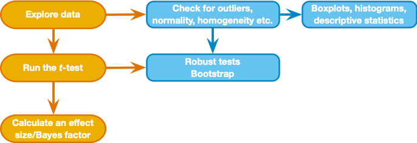

<html lang="en">

```{r setup, include=FALSE}
knitr::opts_chunk$set(
	echo = TRUE,
	message = FALSE,
	warning = FALSE
)

#necessary to render tutorial correctly
library(learnr) 
library(htmltools)
#tidyverse
library(dplyr)
library(ggplot2)
#non tidyverse
library(BayesFactor)
library(effectsize)
library(Hmisc)
library(knitr)
library(WRS2)

source("./www/discovr_helpers.R")

#Read dat files needed for the tutorial

cloak_tib <- discovr::invisibility_cloak
cloak_rm_tib <- discovr::invisibility_rm
cloak_messy_tib <- cloak_rm_tib |> 
  tidyr::pivot_wider(
    id_cols = id,
    values_from = mischief,
    names_from = cloak
    )
```

```{r, eval = F, echo = F}
# Create bib file for R packages
here::here("inst/tutorials/discovr_09/packages.bib") |>
  knitr::write_bib(c('here', 'tidyverse', 'dplyr', 'forcats', 'readr', 'tibble', 'knitr', 'here', 'BayesFactor', 'effectsize', 'Hmisc', 'WRS2'), file = _)
```

# discovr: Comparing two means

## Overview

<div class="infobox">
  
  
  **Usage:** This tutorial accompanies [Discovering Statistics Using R and RStudio](https://www.discovr.rocks/) [@field_discovering_2023] by [Andy Field](https://en.wikipedia.org/wiki/Andy_Field_(academic)). It contains material from the book so there are some copyright considerations but I offer them under a [Creative Commons Attribution-NonCommercial-NoDerivatives 4.0 International License](http://creativecommons.org/licenses/by-nc-nd/4.0/). Tl;dr: you can use this tutorial for teaching and non-profit activities but please don't meddle with it or claim it as your own work.
  
</div>

### `r cat_space(fill = blu)` Welcome to the `discovr` space pirate academy

Hi, welcome to **discovr** space pirate academy. Well done on embarking on this brave mission to planet `r rproj()`s, which is a bit like Mars, but a less red and more hostile environment. That's right, more hostile than a planet without water. Fear not though, the fact you are here means that you *can* master `r rproj()`, and before you know it you'll be as brilliant as our pirate leader Mae Jemstone (she's the badass with the gun). I am the space cat-det, and I will pop up to offer you tips along your journey.

On your way you will face many challenges, but follow Mae's system to keep yourself on track:

* `r bmu(height = 1.5)` This icon flags materials for *teleporters*. That's what we like to call the new cat-dets, you know, the ones who have just teleported into the academy. This material is the core knowledge that everyone arriving at space academy must learn and practice. For accessibility, these sections will also be labelled with [(1)]{.alt}.
* `r user_visor(height = 1.5)` Once you have been at space pirate academy for a while, you get your own funky visor. It has various modes. My favourite is the one that allows you to see everything as a large plate of tuna. More important, sections marked for cat-dets with visors goes beyond the core material but is still important and should be studied by all cat-dets. However, try not to be disheartened if you find it difficult. For accessibility, these sections will also be labelled with [(2)]{.alt}.
* `r user_astronaut(height = 1.5)` Those almost as brilliant as Mae (because no-one is quite as brilliant as her) get their own space suits so that they can go on space pirate adventures. They get to shout *RRRRRR* really loudly too. Actually, everyone here gets to should *RRRRRR* really loudly. Try it now. Go on. It feels good. Anyway, this material is the most advanced and you can consider it optional unless you are a postgraduate cat-det. For accessibility, these sections will also be labelled with [(3)]{.alt}.

It's not just me that's here to help though, you will meet other characters along the way:

* `r alien(height = 1.5)` aliens love dropping down onto the planet and probing humanoids. Unfortunately you'll find them probing you quite a lot with little coding challenges. Helps is at hand though. 
* `r robot(height = 1.5)` **bend-R** is our coding robot. She will help you to try out bits of `r rproj()` by writing the code for you before you encounter each coding challenge.
* `r bug(height = 1.5)` we also have our friendly alien bugs that will, erm, help you to avoid bugs in your code by highlighting common mistakes that even Mae Jemstone sometimes makes (but don't tell her I said that or my tuna supply will end). 

Also, use hints and solutions to guide you through the exercises (Figure 1).

<figure>

<figcaption>Figure 1: In a code exercise click the hints button to guide you through the exercise.</figcaption>
</figure> 
 

By for now and good luck - you'll be amazing!

### Workflow

* Before attempting this tutorial it's a good idea to work through [this tutorial on how to install, set up and work within `r rproj()` and `r rstudio()`](http://milton-the-cat.rocks/learnr/r/r_getting_started/).

* The tutorials are self-contained (you practice code in code boxes). However, so you get practice at working in `r rstudio()` I strongly recommend that you create an Quarto document within an `r rstudio()` project and practice everything you do in the tutorial in the Quarto document, make notes on things that confused you or that you want to remember, and save it. Within this Quarto document you will need to load the relevant packages and data. 


### Packages

This tutorial uses the following packages:

* `BayesFactor` [@R-BayesFactor]
* `effectsize` [@effectsize2020; @R-effectsize]
* `here` [@R-here]
* `Hmisc` [@R-Hmisc]
* `knitr` [@R-knitr]
* `WRS2` [@R-WRS2; @WRS22020]

It also uses these `tidyverse` packages [@R-tidyverse; @tidyverse2019]: `dplyr` [@R-dplyr], `forcats` [@R-forcats], `ggplot2` [@wickhamGgplot2ElegantGraphics2016], and `readr` [@R-readr].

### Coding style

There are (broadly) two styles of coding:

1. **Verbose**: Using this style you declare the package when using a function: `package::function()`. For example, if I want to use the `mutate()` function from the package `dplyr`, I will type `dplyr::mutate()`. If you adopt verbose style, you don't need to load packages at the start of your Quarto document (although see below for some exceptions).

2. **Concise**: Using this style you load all of the packages at the start of your Quarto document using `library(package_name)`, and then refer to functions without their package. For example, if I want to use the `mutate()` function from the package `dplyr`, I will use `library(dplyr)` in my first code chunk and type the function as `mutate()` when I use it subsequently.

Coding style is a personal choice. The [Google `r rproj()` style guide](https://google.github.io/styleguide/Rguide.html) and [tidyverse style guide](https://style.tidyverse.org/) recommend a verbose style, and I use it in teaching materials for two reasons (1) it helps you to remember which functions come from which packages, and (2) it prevents clashes resulting from using functions from different packages that have the same name. However, even with this style it makes sense to load `tidyverse` because the `dplyr` and `ggplot2` packages contain functions that are often used within other functions and in these cases the verbose style is difficult to read. Also, no-one wants to write `ggplot2::` before every function from `ggplot2`.

You can use either style in this tutorial because all packages are pre-loaded. If working outside of the tutorial, load the `tidyverse` package (and any others if you're using a concise style) at the beginning of your Quarto document:

```{r eval = FALSE}
library(tidyverse)
```

### Data

To work *outside of this tutorial* you need to download the following data files:

* [invisibility.csv](https://www.discovr.rocks/csv/invisibility.csv)
* [invisibility_rm.csv](https://www.discovr.rocks/csv/invisibility_rm.csv)

Set up an `r rstudio()` project in the way that [I recommend in this tutorial](http://milton-the-cat.rocks/learnr/r/r_getting_started/#section-working-in-rstudio), and save the data files to the folder within your project called [data]{.alt}. Place this code in the first code chunk in your Quarto document:

```{r, eval=FALSE}
cloak_tib <- here::here("data/invisibility.csv") |> readr::read_csv()
cloak_rm_tib <- here::here("data/invisibility_rm.csv") |> readr::read_csv()
```

### Preparing data

To work *outside of this tutorial* you need to turn categorical variables into factors and set an appropriate baseline category using `forcats::as_factor` and `forcats::fct_relevel`.

For [cloak_tib]{.alt} execute the following code:

```{r, eval=FALSE}
cloak_tib <- cloak_tib |> 
  dplyr::mutate(
    cloak = forcats::as_factor(cloak)
  )
```

For [cloak_rm_tib]{.alt} execute the following code:

```{r, eval=FALSE}
cloak_rm_tib <- cloak_rm_tib |>
  dplyr::mutate(
    cloak = forcats::as_factor(cloak)
  )
```


## `r bmu()` Comparing two means: process [(1)]{.alt}

Figure 2 shows the general process for performing a *t*-test. As with fitting any model, we start by looking for the sources of bias. Having satisfied ourselves that assumptions are met and outliers dealt with, we run the test. We can also consider using bootstrapping if any of the test assumptions were not met. Finally, we compute an effect size and Bayes factor (see book Chapter).

<figure>

<figcaption>Figure 2: The general process for comparing means.</figcaption>
</figure>

 
## `r bmu()` Visualizing the data [(1)]{.alt}

I imagine a future in which we have some cloaks of invisibility to test out. Given my slightly mischievous streak, the future me is interested in the effect that wearing a cloak of invisibility has on the tendency for mischief. I take 24 participants and placed them in an enclosed community. The community is riddled with hidden cameras so that we can record mischievous acts. Half of the participants are given cloaks of invisibility; they are told not to tell anyone else about their cloak and that they can wear it whenever they liked. I measure how many mischievous acts they performed in a week. These data are preloaded in this tutorial in a tibble called [cloak_tib]{.alt}.

#### `r alien()` Alien coding challenge

Use the code box to see these data.

```{r cloak_data, exercise = TRUE, exercise.lines = 2}

```

```{r cloak_data-solution}
cloak_tib
```

Note there are three variables: the participant **id**, the number of mischievous acts (**mischief**) and whether the person was given an invisibility cloak **cloak**.

#### `r alien()` Alien coding challenge

Use what you have learnt so far to replace the XXXs in the code in the box below to get some basic summary statistics:

```{r cloak_sum, exercise = TRUE, exercise.lines = 11}
cloak_sum <- cloak_tib |> 
  dplyr::group_by(XXXXXXXX) |> 
  dplyr::summarize(
    n = n(),
    mean = mean(XXXXXXXX),
    ci_lower = ggplot2::mean_cl_normal(mischief)$XXXXXXX,
    ci_upper = ggplot2::mean_cl_normal(mischief)$ymax,
  )

cloak_sum |> 
  knitr::kable(digits = 2)
```

```{r cloak_sum-solution}
cloak_sum <- cloak_tib |> 
  dplyr::group_by(cloak) |> 
  dplyr::summarize(
    n = n(),
    mean = mean(mischief),
    ci_lower = ggplot2::mean_cl_normal(mischief)$ymin,
    ci_upper = ggplot2::mean_cl_normal(mischief)$ymax
  )

cloak_sum |> 
  knitr::kable(digits = 2)
```

#### `r alien()` Alien coding challenge

We can visualise the data using a violin plot with error bars (see `discovr_05`). Create such a plot below:

```{r exam_plot, exercise = TRUE, exercise.lines = 5}

```

```{r exam_plot-hint-1}
# Set up the plot by replacing the XXXs in this code:
ggplot2::ggplot(xxxxxx, aes(xxxxxx, xxxxxx)) 
```

```{r exam_plot-hint-2}
# Add geom_violin in the usual way
ggplot2::ggplot(cloak_tib, aes(cloak, mischief)) +
  geom_violin()
```

```{r exam_plot-hint-3}
#Add a layer that plots means and confidence intervals using 
# stat_summary()
stat_summary(fun.data = "xxxxxxx")
```

```{r exam_plot-hint-4}
ggplot2::ggplot(cloak_tib, aes(cloak, mischief)) +
  geom_violin() +
  stat_summary(fun.data = "mean_cl_normal")

# Add some labels for the axes
```

```{r exam_plot-hint-5}
ggplot2::ggplot(cloak_tib, aes(cloak, mischief)) +
  geom_violin() +
  stat_summary(fun.data = "mean_cl_normal") +
  labs(x = "Cloak group", y = "Acts of mischief") 

# add theme_minimal()
```

```{r exam_plot-hint-6}
ggplot2::ggplot(cloak_tib, aes(cloak, mischief)) +
  geom_violin() +
  stat_summary(fun.data = "mean_cl_normal") +
  labs(x = "Cloak group", y = "Acts of mischief") +
  theme_minimal()
```

## `r bmu()` Comparing two independent means [(1)]{.alt}

### `r bmu()` Fitting the model [(1)]{.alt}

You can do a *t*-test in `r rproj()` using the `t.test()` function, which takes this general form

#### `r robot()` Code example
 
```{r, echo = T, eval = F}
new_model <- t.test(outcome ~ predictor,
                    data = tibble,
                    paired = FALSE,
                    var.equal = FALSE,
                    conf.level = 0.95,
                    na.action = na.exclude)
```

In which:

* [new_model]{.alt}: an object created that contains information about the model. We can get summary statistics for this model by executing the name of the model.
* [outcome]{.alt}: the variable that contains the scores for the outcome measure (in this case **mischief**).
* [predictor]{.alt}: the variable that contains information about to which group a score belongs (in this case **cloak**).
* [tibble]{.alt}: the name of the tibble containing the data (in this case [cloak_tib]{.alt}) 
* [paired]{.alt}: by default scores are treated as independent ([paired = FALSE]{.alt}), but if you have a repeated measures design and want to treat scores as dependent change this to [paired = TRUE]{.alt}.
* [var.equal]{.alt}: by default the function assumes that variances are unequal ([var.equal = FALSE]{.alt}) and applies Welch's correction (a sensible thing to do). Leave this default alone.
* [conf.level]{.alt}: determines the alpha level for the *p*-value and confidence intervals. By default it is 0.95 (for 95% confidence intervals) and usually you'd exclude this option, but if you want to use a different value, say 99%, you could include [conf.level = 0.99]{.alt}.
* [na.action]{.alt}: If you have complete data (as we have here) exclude this option, but if you have missing values (i.e., [NA]{.alt}s in the data frame) then it can be useful to include [na.action = na.exclude]{.alt}, which will exclude all cases with missing values

#### `r alien()` Alien coding challenge

Using the general code to get a *t*-test for the current data. Remember, the data are in a tibble called [cloak_tib]{.alt}, the outcome variable is **mischief** and the gropuping variable/predictor is **cloak**.

```{r t1, exercise = TRUE}

```

```{r t1-solution}
t.test(mischief ~ cloak, data = cloak_tib)
```

#### `r alien()` Alien coding challenge 

More often than not it's useful to save the models we fit, we can do this in the usual way by giving the object a name, then using `<-` to assign it to the *t*-test object. Repeat the previous exercise but save the results in an object called [cloak_mod]{.alt}.

<div class="tip">
  `r cat_space()` **Tip: Naming models**
  
  I tend to use [_mod]{.alt} to denote an object that is a statistical model. So, the name [cloak_mod]{.alt} tells me that this is a statistical model.
</div>

```{r t1b, exercise = TRUE}

```

```{r t1b-hint-1}
# start with the code from the previous example:
t.test(mischief ~ cloak, data = cloak_tib)
# Now use <- to assign this to an object called cloak_mod
```

```{r t1b-hint-2}
# Now use <- to assign this to an object called cloak_mod
cloak_mod <- t.test(mischief ~ cloak, data = cloak_tib)
```

```{r t1b-hint-3}
# Don't forget that to see the model, we also need to execute
# its name having created it:
cloak_mod <- t.test(mischief ~ cloak, data = cloak_tib)
cloak_mod
```

```{r, echo = F}
cloak_mod <- t.test(mischief ~ cloak, data = cloak_tib)
```

### `r bmu()` Interpreting the model [(1)]{.alt}

The `t.test()` function calculates Welch's *t*, *t*(`r round(cloak_mod$parameter, 2)`) = `r round(cloak_mod$statistic, 2)`, which does not assume homogeneity of variance but instead adjusts for it. This default behaviour is sensible because, when the assumption is met no adjustment is made, but when it is broken an adjustment is made proportionate to the difference in variances. The resulting (two-tailed) *p*-value is `r round(cloak_mod$p.value, 3)`, which represents the probability of getting a *t* of `r round(cloak_mod$statistic, 2)` or smaller if the null hypothesis were true. Assuming our alpha is 0.05, we'd conclude that there was no significant difference between the means of these two samples because the observed *p* of `r round(cloak_mod$p.value, 3)` is greater than the criterion of 0.05. In terms of the experiment, we can infer that having a cloak of invisibility did not significantly affect the amount of mischief a person got up to.

Finally, the confidence interval gives us an estimate of the range of the true difference between means. If we were to assume that this sample were one of the 95% that yields a confidence interval containing the population value, we'd conclude that the population difference falls between `r round(cloak_mod$conf.int[1], 2)` to `r round(cloak_mod$conf.int[2], 2)`, but remember our assumption will be wrong 5% of the time.

### `r user_visor()` Effect size for independent means [(2)]{.alt}

We can use the `effectsize` package [@effectsize2020; @R-effectsize] to calculate Cohen's *d*. There are three useful functions here:

#### `r robot()` Code example

```{r, eval = F, echo= T}
effectsize::cohens_d(outcome ~ predictor,
                     data = tibble,
                     pooled_sd = TRUE,
                     paired = FALSE)

effectsize::hedges_g(outcome ~ predictor,
                     data = tibble,
                     pooled_sd = TRUE,
                     paired = FALSE)

effectsize::glass_delta(outcome ~ predictor,
                        data = tibble)
```

* `glass_delta()`. This function uses only the control group standard deviation so should be used when group standard deviations are very different (or you expect your experimental manipulation to affect both the mean and the standard deviation of scores). It will use the first level of the grouping variable as the control (in this case the no cloak group). Therefore, we could execute:
* `cohens_d()`. This function uses (by default) the pooled standard deviation
* `hedges_g()`. This function applies a correction to Cohen's *d* that is less biased for samples less than about 20.

Both `cohens_d()` and `hedges_g()` have an argument to specify whether data are paired (more on that later), but for now we want this argument to be false, which is the default.

#### `r alien()` Alien coding challenge

Try each of these functions for the invisibility cloak data to calculate the size of the effect of having an invisibility cloak on mischief. Remember, that what goes into each function is the same as what went into the `t.test()` function.

```{r d1, exercise = TRUE}

```

```{r d1-solution}
effectsize::glass_delta(mischief ~ cloak, data = cloak_tib)
effectsize::cohens_d(mischief ~ cloak, data = cloak_tib)
```

```{r, echo = F, results = 'hide'}
d_cloak <- effectsize::cohens_d(mischief ~ cloak, data = cloak_tib)
g_cloak <- effectsize::glass_delta(mischief ~ cloak, data = cloak_tib)
```

<div class="tip">
  `r cat_space()` **Tip**

We can put the output of `effectsize` through `kable()` to round values in our report. For example, to round to a maximum of 3 decimal places we could use the code below. Try it in the previous code box.

```{r, eval = F, class.source = '.panel_alt'}
effectsize::cohens_d(mischief ~ cloak, data = cloak_tib) |> 
  knitr::kable(digits = 3)
```
</div>


Using the pooled estimate, there is `r sprintf("%.2f", abs(d_cloak$Cohens_d))` of a standard deviation difference between the two groups in terms of their mischief making, which is a fairly substantial effect. 


```{r d_quiz, echo = F}
question("Which of these statements about Cohen's *d* is **NOT** correct?",
    answer("The value of *d* cannot exceed 1.", correct = TRUE, message = "This statement is false and so is the correct answer."),
    answer("*d* is the difference between two means expressed in standard deviation units.", message = "This statement is true so is not the correct answer."),
    answer("A *d* of 0.2 would be considered small", message = "This statement is true so is not the correct answer."),
    answer("*d* can be computed using a control group standard deviation, the standard deviation of all scores or a pooled standard deviation.", message = "This statement is true so is not the correct answer."),
    correct = "Correct - well done!",
    random_answer_order = TRUE,
    allow_retry = T
  )
```

<div class="reportbox">
  `r pencil()` **Report**`r rproj()`

On average, participants given a cloak of invisibility engaged in more acts of mischief (*M* = `r cloak_mod$estimate[2]`, *SE* = 0.48), than those not given a cloak (*M* = `r cloak_mod$estimate[1]`, *SE* = 0.55). Having a cloak of invisibility did not significantly affect the amount of mischief a person got up to: the mean difference, *M* = `r round(cloak_mod$estimate[2]-cloak_mod$estimate[1], 2)`, 95% CI [`r round(cloak_mod$conf.int[1], 2)`, `r round(cloak_mod$conf.int[2], 2)`], was not significantly different from 0, *t*(`r round(as.numeric(cloak_mod$parameter, 2))`) = `r round(cloak_mod$statistic, 2)`, *p* = `r round(cloak_mod$p.value, 2)`. This effect was very large, `r report_es(d_cloak, col = "Cohens_d")`, but the confidence interval for the effect size contained zero. If this confidence interval is one of the 95% that captures the population effect size then this suggests that a zero effect is plausible. 
</div>


## `r bmu()` Comparing two dependent means [(1)]{.alt}

### `r bmu()` Fitting the model [(1)]{.alt}

Let's imagine that we had collected the cloak of invisibility data using a repeated-measures design: we might have recorded each participant's natural level of mischievous acts in a week, then given them an invisibility cloak and counted the number of mischievous acts in the following week.  So, there are 12 participants (not 24) but each participant contributes two mischief scores: one from when they wore a cloak, one from when they didn't. The data are [cloak_rm_tib]{.alt}.

#### `r alien()` Alien coding challenge

Inspect the tibble.

```{r cloak_rm_data, exercise = TRUE, exercise.lines = 2}

```

```{r cloak_rm_data-solution}
cloak_rm_tib
```

Note that the mischief scores themselves are identical to the previous example, for example, the first 'no cloak' score is a 3 and the first 'cloak' score is a 4, the only difference is that both of these scores are now attributable to the same person (Alia). To summarize then, we're using the same mischief scores as before, but we're now imagining that they were generated by a repeated measures design rather than an independent design.

#### `r alien()` Alien coding challenge

We conduct a paired *t*-test in exactly the same way as an independent *t*-test except that we place [paired = TRUE]{.alt} into the `t.test()` function. In short, use the same code as before but with this additional argument. Save the object as [cloak_rm_mod]{.alt}

```{r t_text_rm, exercise = TRUE, exercise.lines = 3}

```

```{r t_text_rm-solution}
cloak_rm_mod <- t.test(mischief ~ cloak, data = cloak_tib, paired = TRUE)
cloak_rm_mod
```

The additional arguments listed earlier still apply should you wish to override any of the defaults. As before, this code creates a model called [cloak_rm_mod]{.alt} based on predicting mischief scores (**mischief**) from group membership (**cloak**). We can view this model by executing its name (hence the second command).

### `r bmu()` Order matters [(1)]{.alt}

The above code will work provided that the data are ordered correctly. If the data is not ordered correctly then`r rproj()` will 'pair' the scores incorrectly and the resulting *t*-test will be incorrect. Let see this issue in action. Run the code below multiple times and note what happens to the output.

```{r order_matters, exercise = TRUE, exercise.lines = 3}
cloak_rm_tib |> 
  dplyr::sample_n(24) |>
  t.test(mischief ~ cloak, data = _, paired = TRUE)
```

You should find that the output changes each time you run the code. That's not good. The reason this happens is because this code pipes the data in [cloak_rm_tib]{.alt} into the `t.test()` function but along the way I have sneakily piped it through `dplyr::sample_n(24)`, which randomly orders the rows. Each time the *t*-test is run, the rows of the tibble are ordered differently.

The order of rows affects the results because the `t.test()` function pairs the first score it finds in one condition with the first score it finds in the next condition and so on. In our example, it will pair the first score it finds tagged as 'no cloak' with the first score it encounters tagged with 'cloak'. Each time the rows are re-ordered different scores are being paired. Unfortunately there is no way to tell`r rproj()` how to pair the scores, we instead have to make sure that the rows are ordered correctly.

This is easily achieved if you *always* to use an **id** variable so that scores are associated with a particular entity's ID, and you sort the file by the **id** variable before it goes into the `t.test()` function. With our data, we have a variable called **id** so we'd execute something like:

#### `r robot()` Code example

```{r t2, exercise = TRUE, exercise.lines = 4}
cloak_rm_mod <- cloak_rm_tib |> 
  dplyr::arrange(id) |>
  t.test(mischief ~ cloak, data = _, paired = TRUE)
cloak_rm_mod
```

This code pipes the data in [cloak_rm_tib]{.alt} into the `t.test()` function but before it gets there it goes through `dplyr::arrange(id)`, which sorts the tibble by the variable called **id**. Doing so ensures that the scores are paired correctly. (Note that we explicitly assign what's coming through the pipe to the data argument of `t.test()` by including [data = _]{.alt}.)

```{r, echo = F}
cloak_rm_mod <- cloak_rm_tib |> 
  dplyr::arrange(id) |>
  t.test(mischief ~ cloak, data = _, paired = TRUE)
d_rm <- effectsize::cohens_d(mischief ~ cloak, data = cloak_rm_tib)
```

### `r bmu()` Interpreting the model [(1)]{.alt}

On average, participants given a cloak of invisibility engaged in more acts of mischief (*M* = 5, *SE* = 0.48), than those not given a cloak (*M* = 3.75, *SE* = 0.55). This difference, `r round(as.numeric(cloak_rm_mod$estimate), 2)`, 95% CI [`r round(cloak_rm_mod$conf.int[1], 2)`, `r round(cloak_rm_mod$conf.int[2], 2)`], was significant, *t*(`r round(as.numeric(cloak_rm_mod$parameter, 2))`) = `r round(cloak_rm_mod$statistic, 2)`, *p* = `r round(cloak_rm_mod$p.value, 2)`. In terms of the experiment, we might conclude that having a cloak of invisibility significantly affected the amount of mischief a person got up to. This doesn't mean the effect is important.

```{r ci_quiz, echo = F}
  question("The confidence interval for the mean difference ranged from -1.97 to -0.53. What does this tell us?",
    answer("If this confidence interval is one of the 95% that contains the population value then the population value of the difference between group means lies between -1.97 to -0.54.", correct = TRUE),
    answer("There is a 95% chance that the population value of the difference between group means lies between -1.97 to -0.53.", message = "You cannot make probability statements from a confidence interval. We don't know whether this particular CI is one of the 95% that contains the population value of the difference between means."),
    answer("The probability of this confidence interval containing the population value is 0.95.", message = "The probability of this confidence interval containing the population value is either 0 (it doesn't) or 1 (it does) but it's impossible to know which."),
    answer("I can be 95% confident that the population value of the difference between group means lies between -1.97 to -0.53.", message = "Confidence intervals do not quantify your subjective confidence."),
    correct = "Correct - well done!",
    random_answer_order = TRUE,
    allow_retry = T
  )
```

### `r user_visor()` Effect sizes for dependent means [(2)]{.alt}

We could compute Cohen's *d* as we did earlier. However, some argue that you need to factor in the dependency between scores in treatment conditions by factoring in the correlation between the scores. We can do this in`r rproj()` by including [paired = TRUE]{.alt} into the `cohens_d()` function. However, I don't think that this is a good idea because by including information about pairing of scores, the effect size now expresses information not just about the observed difference between means but about the study design used to measure it. Also, one of the core reasons for standardizing effect sizes is so that they can be compared across studies. However, if some effect sizes include information about study design and others don't then they can't be meaningfully compared.

#### `r alien()` Alien coding challenge

Instead then, we'll calculate the effect size in the same way as before (and you'll get the same value). Look back at the previous section on Cohen's *d* and adapt the code to use with the repeated measures data in [cloak_rm_tib]{.alt}:

```{r d2, exercise = TRUE}

```

```{r d2-solution}
effectsize::cohens_d(mischief ~ cloak, data = cloak_rm_tib) |> 
  knitr::kable(digits = 2)
```


<div class="reportbox">
  `r pencil()` **Report**`r rproj()`

On average, participants given a cloak of invisibility engaged in more acts of mischief (*M* = 5, *SE* = 0.48), than those not given a cloak (*M* = 3.75, *SE* = 0.55). Having a cloak of invisibility affected the amount of mischief a person got up to: the mean difference, *M* = `r round(as.numeric(cloak_rm_mod$estimate), 2)`, 95% CI [`r round(cloak_rm_mod$conf.int[1], 2)`, `r round(cloak_rm_mod$conf.int[2], 2)`], was significantly different from 0, *t*(`r round(as.numeric(cloak_rm_mod$parameter, 2))`) = `r round(cloak_rm_mod$statistic, 2)`, *p* = `r round(cloak_rm_mod$p.value, 2)`. This effect was very large, `r report_es(d_cloak, col = "Cohens_d")`, but the confidence interval for the effect size contained zero. If this confidence interval is one of the 95% that captures the population effect size then this suggests that a zero effect is plausible. 
</div>


## `r user_astronaut()` Robust models [(3)]{.alt}
### `r user_astronaut()` Robust models of independent means [(3)]{.alt}

The `WRS2` package [@R-WRS2; @WRS22020] has several functions for comparing independent means.

#### `r robot()` Code example

The `yuen()` function is based on a timed mean. It takes a similar form to `t.test()`:

```{r, eval = FALSE}
WRS2::yuen(outcome ~ predictor,
           data = tibble,
           tr = .2,
           alpha = .05)
```

There are two arguments that `t.test()` does not have: 

* [tr]{.alt} is the proportion of trimming to be done. The default is .2 or 20% (which is sensible) so you can exclude this argument unless you want to specify an amount other than 20%.
* [alpha]{.alt} sets the alpha level for the test (by default 0.05). You can omit this argument unless you want to use a level other than 0.05.

#### `r alien()` Alien coding challenge

Use the code example, and what you learnt about the [`t.test` function](#itt) to create (and view) an object called [cloak_rob]{.alt} that contains a robust comparison of the 20% trimmed means of the two cloak conditions.

```{r cloak_rob, exercise = TRUE}

```

```{r cloak_rob-solution}
cloak_rob <- WRS2::yuen(mischief ~ cloak, data = cloak_tib)
cloak_rob
```

<div class="tip">
  `r cat_space()` **Tip: Andy's naming obsessions**
  
  I tend to use the suffix [_rob]{.alt} to denote a robust model.
</div>

```{r, echo = F}
cloak_rob <- WRS2::yuen(mischief ~ cloak, data = cloak_tib)
```

<br />

<div class="reportbox">
  `r pencil()` **Report**`r rproj()`

There was not a significant difference in mischief scores across the two cloak groups, $T_y$ = `r  round(cloak_rob$test, 2)`, *p* = `r round(cloak_rob$p.value, 3)`. On average the no cloak group performed one less mischievous act, *M* = `r cloak_rob$diff` with a 95% confidence interval for the trimmed mean difference ranging from `r round(cloak_rob$conf.int[1], 2)` to `r round(cloak_rob$conf.int[2], 2)`.
</div>


We can also compare trimmed means but include a bootstrap by using `yuenbt()`, which takes the same form as `yuen()` but has two additional arguments:

* [nboot = 599]{.alt}: This specifies the number of bootstrap samples to be used. If you exclude this option then the default is 599, which, if anything, you might want to increase (but it's probably not necessary to use more than 2000).
* [side = F]{.alt}: By default the function bootstraps confidence intervals as is, which means that they can be asymmetric. If you want to force the CI to be symmetrical then include [side = T]{.alt} in the function. If you do this you will get a *p*-value, but by default you won't (although you can infer significance from whether the confidence interval crosses zero)

#### `r robot()` Code example

In general for a bootstrap test of independent means based on 20% trimming we execute:

```{r, eval = FALSE}
WRS2::yuenbt(outcome ~ predictor,
           data = tibble,
           tr = .2,
           alpha = .05,
           nboot = 1000,
           side = TRUE)
```

For the default of a 20% trim and alpha of 0.05, this command reduces to:

```{r, eval = FALSE}
WRS2::yuenbt(outcome ~ predictor,
             data = tibble,
             nboot = 1000,
             side = TRUE)
```

#### `r alien()` Alien coding challenge

Using the previous exercise and the code example to create (and view) an object called [cloak_bt_rob]{.alt} that contains a robust comparison of the 20% trimmed means of the two cloak conditions based on 1000 boostrap samples. 

```{r cloakbt_rob, exercise = TRUE}

```

```{r cloakbt_rob-solution}
cloak_bt_rob <- WRS2::yuenbt(mischief ~ cloak, data = cloak_tib, nboot = 1000, side = TRUE)
cloak_bt_rob
```

<div class="tip">
  `r cat_space()` **Tip: Bootstrapping**
  
  Because bootstrapping works through sampling the data, confidence intervals and *p*-values from a bootstrap process will differ slightly every time you fit a model. You can see this by rerunning the code in the exercise a few times and observing the output each time.

</div>

Your output should be similar to this:

```{r, echo = F}
cloak_bt_rob <- WRS2::yuenbt(mischief ~ cloak, data = cloak_tib, nboot = 1000, side = TRUE)
cloak_bt_rob
```

Based on this robust test there is not a significant difference (because the confidence interval crosses zero) in mischief scores across the two cloak groups, $T_y$ = `r  round(cloak_bt_rob$test, 2)`, *p* = `r round(cloak_bt_rob$p.value, 3)`. We're also told that on average the no cloak group performed one less mischievous act, *M* = `r cloak_bt_rob$diff` with a 95% confidence interval for the trimmed mean difference ranging from `r round(cloak_bt_rob$conf.int[1], 2)` to `r round(cloak_bt_rob$conf.int[2], 2)`.


 
### `r user_astronaut()` Robust models of dependent means [(3)]{.alt}

To compare dependent means with a robust model we can use the `yuend()` function from the `WRS2` package [@Mair_Wilcox_2019] to get a robust test based on (20% by default) trimmed means. Unfortunately, this function doesn't play nicely with tibbles and tidy data. It takes the general form:

```{r, eval = F}
WRS2::yuend(scores_condition_1, scores_condition_2,  tr = .2)
```

In other words, it wants the scores for each condition to be entered as separate variables. For the invisibility data, this means we need the cloak and no cloak scores to be stored as separate variables (i.e. in a messy data format). At present, the data in [cloak_rm_tib]{.alt} are in tidy format, that is, the mischief scores are stored in a single column.

#### `r robot()` Code example

In [discovr_06]{.alt} we used the `pivot_wider()` function to turn tidy data into messy data. Naturally you  won't remember that far back, but we can create a messy version of the repeated measures data using the following code:

```{r, eval = F}
cloak_messy_tib <- cloak_rm_tib |> 
  tidyr::pivot_wider(
    id_cols = id,
    values_from = mischief,
    names_from = cloak
    )
```

This code uses the [id]{.alt} variable to pair the scores, uses the variable [cloak]{.alt} to name the new columns, and extracts the scores from the variable [mischief]{.alt} to place in those new columns. The result is a new tibble ([cloak_messy_tib]{.alt}) with the cloak scores stored in a variable called [Cloak]{.alt} (note the capital C) and the no cloak scores stored in a variable called [No cloak]{.alt} (note the capital and space). We can use `$` to access the scores. For example, the cloak scores are accessed using:

```{r, eval = F}
cloak_messy_tib$Cloak
```

(Note I have retained the capital C of the variable name.) The no cloak scores are accessed using:

```{r, eval = F}
cloak_messy_tib$`No cloak`
```

(Note I've had to use backticks because the name contains a space.)

#### `r alien()` Alien coding challenge

Use the code example to create the messy version of the data and store it in [cloak_messy_tib]{.alt}. Also, view the tibble, and then view the mischief scores for the cloak and no cloak conditions.

```{r cloak_messy_tib, exercise = TRUE, exercise.lines = 10}

```

```{r cloak_messy_tib-hint-1}
# make the data messy:
cloak_messy_tib <- cloak_rm_tib |> 
  tidyr::pivot_wider(
    id_cols = id,
    values_from = mischief,
    names_from = cloak
    )
# now add code to view it
```

```{r cloak_messy_tib-hint-2}
# make the data messy:
cloak_messy_tib <- cloak_rm_tib |> 
  tidyr::pivot_wider(
    id_cols = id,
    values_from = mischief,
    names_from = cloak
    )
# view the data:
cloak_messy_tib
# Now view the individual scores in the cloak and no cloak conditions
```

```{r cloak_messy_tib-solution}
# make the data messy:
cloak_messy_tib <- cloak_rm_tib |> 
  tidyr::pivot_wider(
    id_cols = id,
    values_from = mischief,
    names_from = cloak
    )
# view the data:
cloak_messy_tib
# view the individual scores in the cloak and no cloak conditions
cloak_messy_tib$Cloak
cloak_messy_tib$`No cloak`
```

#### `r robot()` Code example

Putting this together with the `yuend()` function (assuming we don't want to change from a 20% trim) we'd get:

```{r, eval = FALSE}
WRS2::yuend(cloak_messy_tib$Cloak, cloak_messy_tib$`No cloak`)
```

#### `r alien()` Alien coding challenge

Use the code example to create (and view) an object called [cloak_rm_rob]{.alt} that contains a robust comparison of the 20% trimmed means of the two cloak conditions.

```{r cloak_rm_rob, exercise = TRUE}

```

```{r cloak_rm_rob-solution}
cloak_rm_rob <- WRS2::yuend(cloak_messy_tib$Cloak, cloak_messy_tib$`No cloak`)
cloak_rm_rob
```


```{r, echo = F}
cloak_rm_rob <- WRS2::yuend(cloak_messy_tib$Cloak, cloak_messy_tib$`No cloak`)
```


The output shows that based on this robust test there is a significant difference in mischief scores across the two cloak of invisibility groups, $T_y$(`r cloak_rm_rob$df`) = `r  round(cloak_rm_rob$test, 2)`, *p* = `r round(cloak_rm_rob$p.value, 3)`. The mean difference is `r cloak_rm_rob$diff` with a 95% confidence interval ranging from `r round(cloak_rm_rob$conf.int[1], 2)` to `r round(cloak_rm_rob$conf.int[2], 2)`. Remember that confidence intervals are constructed such that in 95% of samples the intervals contain the true value of the mean difference. So, assuming that this sample's confidence interval is one of the 95 out of 100 that contain the population value, we can say that the true mean difference lies between  `r round(cloak_rm_rob$conf.int[1], 2)` and `r round(cloak_rm_rob$conf.int[2], 2)`. The importance of this interval is that it does not contain zero (both limits are positive), which tells us that the true value of the mean difference is unlikely to be zero (given the assumption we've made). In other words, there is plausibly an effect in the population reflecting more mischievous acts performed when someone is given an invisibility cloak.


## `r user_astronaut()` Bayesian approaches [(3)]{.alt}

There are two things we might do: (1) quantify the difference between means using Bayes factors; (2) estimate the difference between means (i.e. the model parameter for the categorical predictor) using Bayesian methods. Like in [discovr_08]{.alt} we can use the `BayesFactor` [@R-BayesFactor] package. 

### `r user_astronaut()` Evaluating independent means [(3)]{.alt}

The `ttestBF()` function will estimate a Bayes factor for the model of no difference between means (the null) relative to the model of a difference between means (the alternative). This function is very much like `t.test()` except that the formula for the model has to be explicitly labelled with [formula =]{.alt}.

```{r eval = F}
model_bf <- BayesFactor::ttestBF(formula = outcome ~ predictor,
                                 data = my_tib,
                                 paired = FALSE,
                                 rscale = "medium")
```

The function also takes an argument [paired]{.alt} (by default set to FALSE) which must be set to [TRUE]{.alt} if the scores are dependent (e.g. repeated measures designs). There is also an argument [rscale]{.alt} which sets the scale of the prior distribution. You can either set this using a numeric value (e.g., [scale = 1]{.alt}) or using predefined values of ["medium"]{.alt} (the default), ["wide"]{.alt}, and ["ultrawide"]{.alt}, which correspond to *r* scale values of $\sqrt{2}/2$, 1, and $\sqrt{2}$ respectively (see the book chapter for more detail). In an ideal world you'd put some thought into a value for [rscale]{.alt} that reflects your prior beliefs (based on knowledge of the literature) about the plausible values of the effect size (Cohen's *d*) for the difference between means.

In both cases, you can fit the models using either default priors, which set distributions that represent very diffuse prior beliefs, or subjective priors, which allow you to specify prior distributions reflecting specific beliefs about the model parameters.

#### `r robot()` Code example

To get Bayes factors for our model we could execute:

```{r, eval = F}
cloak_bf <- BayesFactor::ttestBF(formula = mischief ~ cloak,
                                 data = cloak_tib,
                                 rscale = "medium")
```

This code creates an object called [cloak_bf]{.alt} that contains the Bayes factor model based on predicting mischief from whether or not someone was given a cloak of invisibility. Note we have specified this model using the same syntax as when we fit it using `lm()`. 

#### `r alien()` Alien coding challenge

Try fitting the model described above.

```{r bf, exercise = TRUE, exercise.lines = 3}

```

```{r bf-hint-1}
# Copy the example code
cloak_bf <- BayesFactor::ttestBF(formula = mischief ~ cloak, data = cloak_tib, rscale = "medium")
# remember that you need to add something to view the output ...
```

```{r bf-solution}
cloak_bf <- BayesFactor::ttestBF(formula = mischief ~ cloak, data = cloak_tib, rscale = "medium")
cloak_bf
```

```{r, echo = F}
cloak_bf <- BayesFactor::ttestBF(formula = mischief ~ cloak, data = data.frame(cloak_tib), rscale = "medium")
```


The Bayes factor is `r get_bf(cloak_bf)`. The BayesFactor package reports the ratio of the alternative to the null hypothesis ($\text{BF}_{10}$), so this value means that the data are `r get_bf(cloak_bf)` times as probable under the alternative hypothesis as under the null. In other words, we should shift our belief towards the alternative hypothesis by a factor of `r get_bf(cloak_bf)`. Remembering that a Bayes factor of 1 means that the data are equally probable under the alternative hypothesis as under the null, the value here suggests that we should not change our prior beliefs by any meaningful amount. There is no evidence for the hypothesis that invisibility cloaks lead to mischief. More specifically, by using the default prior we assigned a 50% probability to the effect size (*d*) lying between −0.7071 and +0.7071 and this Bayes factor tells us not to change this belief in any meaningful way.

Like in [discovr_08]{.alt} we can extract the *b*-values derived from Bayesian estimation and their credible intervals using the `posterior()` function.

#### `r robot()` Code example

To do this we enter the name of the model we just created ([cloak_bf]{.alt}) into the `posterior()` function in which we also set the number of iterations to 10000 (which is plenty). Samples are taken from the posterior distribution of the [cloak_bf]{.alt} model and stored in an object which I have called [cloak_post]{.alt}. Finally, we place the posterior samples into `summary()` to see a summary of them.

```{r, eval = F}
cloak_post <- BayesFactor::posterior(cloak_bf, iterations = 10000)
summary(cloak_post)
```

#### `r alien()` Alien coding challenge

Use the example code to obtain samples from the posterior distribution for the [cloak_bf]{.alt} model, and display a summary of them.

```{r bflm_setup, echo = FALSE}
cloak_bf <- BayesFactor::ttestBF(formula = mischief ~ cloak, data = cloak_tib, rscale = "medium")
```

```{r lmbfpost, exercise = TRUE, exercise.lines = 3, exercise.setup = "bflm_setup"}

```


```{r lmbfpost-solution}
cloak_post <- BayesFactor::posterior(cloak_bf, iterations = 10000)
summary(cloak_post)
```

Because this process is based in sampling from the posterior, the numbers in your output might be slightly different each time you run the code, but they should be approximately the same as this output:


```{r, echo = F}
cloak_bf <- BayesFactor::ttestBF(formula = mischief ~ cloak, data = cloak_tib, rscale = "medium")
cloak_bayes_sum <- BayesFactor::posterior(cloak_bf, iterations = 10000) |> summary()


make_bayes_sum_tibble <- function(bf_sum, index){
  bf_sum[index] |>
    as.data.frame() |> 
    tibble::as_tibble(rownames = "predictor")
}

get_bayes_est <- function(b_mod, row = "mu", index = 2, digits = 2){
  b_mod <-  make_bayes_sum_tibble(b_mod, 1) |> 
    dplyr::right_join(make_bayes_sum_tibble(b_mod, 2), by = "predictor") |> 
    dplyr::mutate(
      dplyr::across(where(is.numeric), ~round(., digits = digits))
    ) |> 
    dplyr::filter(predictor == row) |> 
    dplyr::select(predictor, `statistics.Mean`, `quantiles.2.5.`, `quantiles.97.5.`)
  
  b_mod[, index] |> dplyr::pull()
}


```

```{r, echo = F}
cloak_bayes_sum
```


The values will differ each time you execute the code because they come from a sampling process so your output won't directly match mine. The Bayesian estimate, assuming that the alternative hypothesis is true, of the difference between means (beta) is `r get_bayes_est(cloak_bayes_sum, "beta (No cloak - Cloak)", index = 2)`. We can get a Bayesian credible interval for this difference by looking at the quantiles for beta. Assuming we want a 95% credible interval, we'd read the values from the columns labelled 2.5% and 97.5% in the final part of the output. These values tell us that the Bayesian 95% credible interval ranged from `r get_bayes_est(cloak_bayes_sum, "beta (No cloak - Cloak)", index = 3)` to `r get_bayes_est(cloak_bayes_sum, "beta (No cloak - Cloak)", index = 4)`. In other words, assuming that the effect exists the population value of the effect will be between `r get_bayes_est(cloak_bayes_sum, "beta (No cloak - Cloak)", index = 3)` and `r get_bayes_est(cloak_bayes_sum, "beta (No cloak - Cloak)", index = 4)` with 95% probability. This tells us nothing about the null hypothesis (because we assume the effect exists) but helps us to ascertain the likely population value if we're prepared to accept that the effect exists.

### `r user_astronaut()` Evaluating dependent means [(3)]{.alt}

When we have repeated measures data (i.e., paired scores) we have to enter data slightly different into the `ttestBF` function, rather than using a model formula we enter the variable names containing the scores for each condition, just like we did with the `yuend()` function (see the section on robust methods)

```{r, eval = F}
BayesFactor::ttestBF(scores_condition_1, scores_condition_2,
                     paired = TRUE,
                     rscale = "medium")
```

So, we enter the scores for the cloak and no cloak conditions as separate variables. So, as with the `yuend()` function we need the data in messy format (i.e. the cloak and no cloak scores need to be in different columns), which we created earlier in the object [cloak_messy_tib]{.alt}. We must also set [paired = TRUE]{.alt}.

#### `r robot()` Code example

With the caveat that you should think about an appropriate value for the [rscale]{.alt} argument, which scales the prior distribution, we could obtain a Bayes factor using this code:

```{r, eval = F}
cloak_rm_bf <- BayesFactor::ttestBF(cloak_messy_tib$Cloak, cloak_messy_tib$`No cloak`,
                                    paired = TRUE,
                                    rscale = "medium")
```

#### `r alien()` Alien coding challenge

Try fitting the model described above.

```{r bfrm, exercise = TRUE, exercise.lines = 3}

```

```{r bfrm-hint-1}
# Copy the example code
cloak_rm_bf <- BayesFactor::ttestBF(cloak_messy_tib$Cloak, cloak_messy_tib$`No cloak`, paired = TRUE, rscale = "medium")
# remember that you need to add something to view the output ...
```

```{r bfrm-solution}
cloak_rm_bf <- BayesFactor::ttestBF(cloak_messy_tib$Cloak, cloak_messy_tib$`No cloak`, paired = TRUE, rscale = "medium")
cloak_rm_bf
```

```{r, echo = F}
cloak_rm_bf <- BayesFactor::ttestBF(cloak_messy_tib$Cloak, cloak_messy_tib$`No cloak`, paired = TRUE, rscale = "medium")
cloak_rm_bf_est <- get_bf(cloak_rm_bf)
```

The Bayes factor is `r cloak_rm_bf_est`, which means that the data are `r cloak_rm_bf_est` times as probable under the alternative hypothesis as under the null. In other words, we should shift our belief towards the alternative hypothesis by a factor of about `r cloak_rm_bf_est`. This is strong evidence for the hypothesis that invisibility cloaks lead to more mischief.

We can extract the *b*-values derived from Bayesian estimation and their credible intervals in exactly the same way as we did before.

#### `r alien()` Alien coding challenge

Obtain samples from the posterior distribution for the [cloak_rm_bf]{.alt} model, save them in an object called [cloak_rm_post]{.alt} and display a summary of them.

```{r bfrm_post_setup, echo = FALSE}
cloak_rm_bf <- BayesFactor::ttestBF(cloak_messy_tib$Cloak, cloak_messy_tib$`No cloak`, paired = TRUE, rscale = "medium")
```

```{r bfrmpost, exercise = TRUE, exercise.lines = 3, exercise.setup = "bfrm_post_setup"}

```


```{r bfrmpost-hint-1}
### use the posterior function
xxxxxx <- BayesFactor::posterior(xxxxxx, iterations = 10000)
```

```{r bfrmpost-hint-2}
cloak_rm_post <- BayesFactor::posterior(cloak_rm_bf, iterations = 10000)
# now summarize using summary()
```

```{r bfrmpost-solution}
cloak_rm_post <- BayesFactor::posterior(cloak_rm_bf, iterations = 10000)
summary(cloak_rm_post)
```

Because this process is based in sampling from the posterior, the numbers in your output might be slightly different each time you run the code, but they should be approximately the same as this output:


```{r, echo = F}
cloak_rm_bayes_sum <- BayesFactor::posterior(cloak_rm_bf, iterations = 10000) |> summary()
```

```{r, echo = F}
cloak_rm_bayes_sum
```


The Bayesian estimate of the difference between means is in the column labelled [Mean]{.alt} and the row labelled [mu]{.alt}. The 95% credible interval for this estimate is found from the 2.5% and 97.5% quantiles for mu. These values show that, assuming that the effect exists, the population value of the difference between means is `r get_bayes_est(cloak_rm_bayes_sum, index = 2)` and will fall between `r get_bayes_est(cloak_rm_bayes_sum, index = 3)` and `r get_bayes_est(cloak_rm_bayes_sum, index = 4)` with 95% probability. These values tell us nothing about the null hypothesis (because it assumes the effect exists) but helps us to ascertain the likely population value if were prepared to accept that the effect exists. So, we can say with 95% probability that not having a cloak of invisibility will increase mischievous acts by anything as low as `r get_bayes_est(cloak_rm_bayes_sum, index = 3)` up to `r get_bayes_est(cloak_rm_bayes_sum, index = 4)`.


<div class="infobox">
  
  
  **A message from Mae Jemstone:**
  
  It's often really useful to compare the mean of two groups. I remember when travelling through *the final frontier* I picked up the *starblind virus*. Luckily, scientists had tested the effect of a drug called *avalon* by comparing symptom levels in people who took the drug against a group who were given a placebo. Those who took avalon had fewer symptoms. Because of that, I knew that I could get back on track by taking some *avalon*! Thanks to your hard work, you'll also now be able to evaluate these sorts of claims - you won't need to rely on people telling you what works, you'll be able to look at the studies, and scrutinise the data. Fantastic work! 
  
</div>


## Resources {data-progressive=FALSE}

### Statistics

* The tutorials typically follow examples described in detail in @field_discovering_2023. That book covers the theoretical side of the statistical models, and has more depth on conducting and interpreting the models in these tutorials.
* If any of the statistical content doesn't make sense, you could try my more introductory book *An adventure in statistics* [@fieldAdventureStatisticsReality2016].
* There are free lectures and screencasts on my [YouTube channel](https://www.youtube.com/user/ProfAndyField/).
* There are free statistical resources on my websites [www.discoveringstatistics.com](http://www.discoveringstatistics.com) and [milton-the-cat.rocks](http://milton-the-cat.rocks).

### `r rproj()`

* [R for data science](http://r4ds.had.co.nz/index.html) by @wickhamDataScience2017 is an open-access book by the creator of the tidyverse (Hadley Wickham). It covers the *tidyverse* and data management.
* [ModernDive](http://moderndive.com/index.html) is an open-access textbook on `r rproj()` and `r rstudio()`.
* [`r rstudio()` cheat sheets](https://www.rstudio.com/resources/cheatsheets/).
* [`r rstudio()` list of online resources](https://www.rstudio.com/online-learning/).

### Acknowledgement

I'm extremely grateful to [Allison Horst](https://www.allisonhorst.com/) for her very informative blog post on [styling learnr tutorials with CSS](https://education.rstudio.com/blog/2020/05/learnr-for-remote/) and also for sending me a CSS template file and allowing me to adapt it. Without Allison, these tutorials would look a lot worse (but she can't be blamed for my colour scheme).

## References


