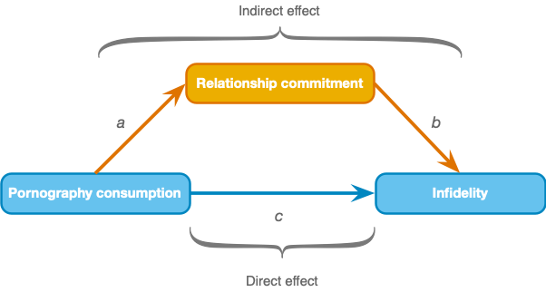

<html lang="en">

```{r setup, include=FALSE}
knitr::opts_chunk$set(
	echo = TRUE,
	message = FALSE,
	warning = FALSE
)

library(learnr) #necessary to render tutorial correctly

library(broom)
library(dplyr)
library(ggplot2)
library(htmltools)
library(interactions)
library(lavaan)
library(magrittr)
library(parameters)
library(sandwich)

source("./www/discovr_helpers.R")


#Read dat files needed for the tutorial

vids_tib <- discovr::video_games
infidelity_tib <- discovr::lambert_2012

centre <- function(var){
  var - mean(var, na.rm = TRUE)
}
```

# discovr: Moderation and mediation

## Overview

<div class="infobox">
  
  
  **Usage:** This tutorial accompanies [Discovering Statistics Using R and RStudio](https://www.discovr.rocks/) [@field_discovering_2021] by [Andy Field](https://en.wikipedia.org/wiki/Andy_Field_(academic)). It contains material from the book so there are some copyright considerations but I offer them under a [Creative Commons Attribution-NonCommercial-NoDerivatives 4.0 International License](http://creativecommons.org/licenses/by-nc-nd/4.0/). Tl;dr: you can use this tutorial for teaching and non-profit activities but please don't meddle with it or claim it as your own work.
  
</div>

### `r cat_space(fill = "h3", height = 2)` Welcome to the `discovr` space pirate academy

Hi, welcome to **discovr** space pirate academy. Well done on embarking on this brave mission to planet `r rproj()`s, which is a bit like Mars, but a less red and more hostile environment. That's right, more hostile than a planet without water. Fear not though, the fact you are here means that you *can* master `r rproj()`, and before you know it you'll be as brilliant as our pirate leader Mae Jemstone (she's the badass with the gun). I am the space cat-det, and I will pop up to offer you tips along your journey.

On your way you will face many challenges, but follow Mae's system to keep yourself on track:

* `r bmu(height = 2)` This icon flags materials for *teleporters*. That's what we like to call the new cat-dets, you know, the ones who have just teleported into the academy. This material is the core knowledge that everyone arriving at space academy must learn and practice. For accessibility, these sections will also be labelled with [(1)]{.alt}.
* `r user_visor(height = 2)` Once you have been at space pirate academy for a while, you get your own funky visor. It has various modes. My favourite is the one that allows you to see everything as a large plate of tuna. More important, sections marked for cat-dets with visors goes beyond the core material but is still important and should be studied by all cat-dets. However, try not to be disheartened if you find it difficult. For accessibility, these sections will also be labelled with [(2)]{.alt}.
* `r user_astronaut(height = 2)` Those almost as brilliant as Mae (because no-one is quite as brilliant as her) get their own space suits so that they can go on space pirate adventures. They get to shout *RRRRRR* really loudly too. Actually, everyone here gets to should *RRRRRR* really loudly. Try it now. Go on. It feels good. Anyway, this material is the most advanced and you can consider it optional unless you are a postgraduate cat-det. For accessibility, these sections will also be labelled with [(3)]{.alt}.

It's not just me that's here to help though, you will meet other characters along the way:

* `r alien(height = 2)` aliens love dropping down onto the planet and probing humanoids. Unfortunately you'll find them probing you quite a lot with little coding challenges. Helps is at hand though. 
* `r robot(height = 2)` **bend-R** is our coding robot. She will help you to try out bits of `r rproj()` by writing the code for you before you encounter each coding challenge.
* `r bug(height = 2)` we also have our friendly alien bugs that will, erm, help you to avoid bugs in your code by highlighting common mistakes that even Mae Jemstone sometimes makes (but don't tell her I said that or my tuna supply will end). 

Also, use hints and solutions to guide you through the exercises (Figure 1).

<figure>

<figcaption>Figure 1: In a code exercise click the hints button to guide you through the exercise.</figcaption>
</figure> 
 

By for now and good luck - you'll be amazing!

### Workflow

* Before attempting this tutorial it's a good idea to work through [this tutorial on how to install, set up and work within `r rproj()` and `r rstudio()`](http://milton-the-cat.rocks/learnr/r/r_getting_started/).

* The tutorials are self-contained (you practice code in code boxes). However, so you get practice at working in `r rstudio()` I strongly recommend that you create an `r rproj()` markdown file within an `r rstudio()` project and practice everything you do in the tutorial in the `r rproj()` markdown file, make notes on things that confused you or that you want to remember, and save it. Within this markdown file you will need to load the relevant packages and data. 


### Packages

This tutorial uses the following packages:

* `broom` [@robinsonBroomConvertStatistical2019]
* `here` [@here]
* `interactions` [@interactions]
* `lavaan` [@rosseel_lavaan_2012]
* `parameters` [@makowski_parameters_2019]
* `tidyverse` [@tidyverse]

I try to follow the [Google `r rproj()` style guide](https://google.github.io/styleguide/Rguide.html) and [tidyverse style guide](https://style.tidyverse.org/) in always declaring the package when using a function: `package::function()`. For example, if I want to use the `mutate()` function from the package `dplyr`, I will write `dplyr::mutate()`. 

It is good practice to be explicit about packages to avoid clashes where functions from different packages have the same name. It also means that you don't need to load packages at the start of your markdown document. 

There are two main exceptions to this rule.

1. There are functions within some `tidyverse` packages that would be used within other functions. Including the package name makes the code difficult to read. Also, no-one wants to write `ggplot2::` before every function from `ggplot2`.
2. To use the pipe operator (`%>%`) you need to have `magrittr` loaded.

We can load all of the packages that are exceptions in one step by loading `tidyverse` at the beginning of our `r rproj()` Markdown document:

```{r eval = FALSE}
library(tidyverse)
```

### Data

To work *outside of this tutorial* you need to download the following data files:

* [video_games.csv](https://www.discovr.rocks/csv/video_games.csv)
* [lambert_2012.csv](https://www.discovr.rocks/csv/lambert_2012.csv)


Set up an `r rstudio()` project in the way that [I recommend in this tutorial](http://milton-the-cat.rocks/learnr/r/r_getting_started/#section-working-in-rstudio), and save the data files to the folder within your project called [data]{.alt}. Place this code in the first code chunk in your `r rproj()` Markdown document:

```{r, eval=FALSE}
vids_tib  <- here::here("data/video_games.csv") %>% readr::read_csv()
infidelity_tib <- here::here("data/lambert_2012.csv") %>% readr::read_csv()
```

## `r user_visor()` Moderation [(2)]{.alt}

We’ll use an example of whether violent video games make people antisocial. Video games have been linked to increased aggression in youths. Another predictor of aggression and conduct problems is callous-unemotional traits such as lack of guilt, lack of empathy, callous use of others for personal gain. Imagine that a scientist explored the relationship between playing violent video games. She measured aggressive behaviour (**aggress**), callous-traits (**caunts**), and the number of hours per week they play video games (**vid_game**) in 442 youths. These data are stored in [vids_tib]{.alt}.

#### `r alien()` Alien coding challenge

Inspect the data in [vids_tib]{.alt}.

```{r vids_tib, exercise = TRUE, exercise.lines = 2}

```

```{r vids_tib-solution}
vids_tib
```

Moderation is where a variable (the moderator) affects the relationship between two others. In this example, we're predicting that the relationship between gaming (the predictor) and aggression (the outcome) is affected by the level of callous unemotional traits (the moderator). Statistically, a moderation effect is the interaction between the predictor and moderator and mathematically it is the effect on aggression of scores on the predictor multiplied by scores on the moderator. Therefore, the model we're looking to fit is:

$$
\text{Aggression}_i = b_0 + b_1\text{Gaming}_i + b_2\text{Callous}_i + b_3(\text{Gaming}\times\text{Callous})_i + \epsilon_i
$$

The moderation effect is represented by $b_3$, the parameter attached to the interaction term ($\text{Gaming}\times\text{Callous}$).

### `r bmu()` Centring variables [(1)]{.alt}

**Centring** refers to the process of transforming a variable into deviations around a fixed point. This fixed point can be any value that you choose, but typically it’s the grand mean (i.e. the overall mean of scores on a variable). Grand mean centring for a given variable is achieved by taking each score and subtracting from it the mean of all scores (for that variable).

### `r user_visor()` Why centering matters [(2)]{.alt}

Centring is important when your model contains an interaction term because it makes the *b*s for lower-order effects interpretable. There are good reasons for not caring about the lower-order effects when the higher-order interaction involving those effects is significant; for example, if the gaming × callous traits interaction is significant, then it’s not clear why we would be interested in the individual effects of gaming and callous traits. However, when the interaction is not significant, centring makes interpreting the main effects easier. With centred variables the *b*s for individual predictors have two interpretations (1) they are the effect of that predictor at the mean value of the sample; and (2) they are the average effect of the predictor across the range of scores for the other predictors. To explain the second interpretation, imagine we took everyone who spent no hours gaming, estimated the linear model between aggression and callous traits and noted the *b*. We then took everyone who played games for 1 hour and did the same, and then took everyone who gamed for 2 hours per week and did the same. We continued doing this until we had estimated linear models for every different value of the hours spent gaming. We’d have a lot of bs, each one representing the relationship between callous traits and aggression for different amounts of gaming. If we took an average of these bs then we’d get the same value as the b for callous traits (centred) when we use it as a predictor with gaming (centred) and their interaction.

### `r bmu()` Centring variables using `r rproj()` [(1)]{.alt}

We can centre variables using the `mutate()` function, which we've used many times before.

#### `r robot()` Code example

For example, to centre the variable **caunts** within [vids_tib]{.alt}, we could use this code within `mutate()`:

```{r, eval = F}
caunts_cent = caunts - mean(caunts, na.rm = TRUE)
```

This code creates a variable **caunts_cent** which is the value of the score for **caunts** minus the mean score ([mean(caunts, na.rm = TRUE)]{.alt}).

#### `r alien()` Alien coding challenge

Use the code in the example, and what you already know about `mutate()` to add the variables **caunts_cent** and **vid_game_cent**, which are centred versions of **caunts** and **vid_game**, to [vids_tib]{.alt}.

```{r vid_cent, exercise = TRUE, exercise.lines = 5}

```

```{r vid_cent-hint-1}
# Start by creating vids_tib from itself:
vids_tib <- vids_tib
# Now pipe into mutate()
```

```{r vid_cent-hint-2}
# Pipe into mutate():
vids_tib <- vids_tib %>% 
  dplyr::mutate(
  )
# Within mutate add the example code to get caunts_cent
```

```{r vid_cent-hint-3}
# Compute caunts_cent
vids_tib <- vids_tib %>% 
  dplyr::mutate(
    caunts_cent = caunts - mean(caunts, na.rm = TRUE)
  )
# Now adapt the code for caunt_cent to create vid_game_cent
# Don't forget the comma at the end of the line that creates caunt_cent
```

```{r vid_cent-hint-4}
# Solution
vids_tib <- vids_tib %>% 
  dplyr::mutate(
    caunts_cent = caunts - mean(caunts, na.rm = TRUE),
    vid_game_cent = vid_game - mean(vid_game, na.rm = TRUE)
  )
vids_tib
```

That's it, you have just centred some variables!

```{r gmc_quiz, echo = F}
question("Grand mean centring for a given variable is achieved by:",
         answer("Taking each score and subtracting from it the mean of all scores (for that variable).",  correct = TRUE, message = "Well done, this answer is correct."),
         answer("Taking the mean of all scores (ignoring from which variable they come) and subtracting each score from it.", message = "Unlucky, have another try."),
         answer("Taking each score and dividing it by the mean of all scores (for that variable).", message = "Unlucky, have another try."),
         answer("Taking each score, subtracting the mean and then dividing by the standard deviation.", message = "Close. This answer describes standardizing the score, not centring it."),
         allow_retry = TRUE,
         random_answer_order = TRUE
)
```


### `r user_astronaut()` Using a function to center variables [(3)]{.alt}

If you need to centre more than a couple of variables, you might find it useful to do something a bit trickier using `across()` to apply a mutation to multiple variables. In this case the mutation we want to apply is to subtract the mean score from each score.

#### `r robot()` Code example

First, we need to write a general function to centre variables:

```{r}
centre <- function(var){
  var - mean(var, na.rm = TRUE)
}
```

This code creates a function called `centre()` which takes a set of scores as its input. I’ve named this input [var]{.adj} (short for variable), but it could be anything. Within the function, we take whatever scores are passed into the function (remember these scores are represented by [var]{.adj}), and subtract the mean of those scores from them. The function will, therefore, return the scores you pass in with their mean subtracted. In other words, it returns the centred scores.

For example, if we execute the code above (to create the function) and execute:

```{r, eval = F}
centre(vids_tib$caunts)
```

We’d see the centred **caunts** scores. Try this code. It creates the function, then shows the raw scores in **caunts** and then uses the function we have created to show the centred scores:

```{r cntr_fnc, exercise = TRUE, exercise.lines = 5}
centre <- function(var){
  var - mean(var, na.rm = TRUE)
}
vids_tib$caunts
centre(vids_tib$caunts)
```

Having written the function we can use it in conjunction with `mutate()` and `across()` to centre all variables that we select.

#### `r robot()` Code example

For example, having executed the code to create the function `centre()`, we could use this function to centre **vid_game** and **caunts** by executing:


```{r cntr_mute_at, exercise = TRUE, exercise.lines = 6}
vids_tib <- vids_tib %>% 
  dplyr::mutate(
    dplyr::across(c(vid_game, caunts), list(cent = centre))
    )

vids_tib
```

This code uses `mutate()` to add variables to [vids_tib]{.alt} that contain centred scores. Within `mutate()` we use `across()` to select the variables to be mutated (in this case **vid_game** and **caunts**) and to apply the function `centre()`, which we created to centre scores, to them. To prevent the original variables from being overwritten I have specified [list(cent = centre)]{.alt} within `across()`. This code tells `across()` to apply the function [centre]{.alt}, but to add the suffix [_cent]{.alt} to the variable name. The end result is that the centred variables will be named after the original variables but with [_cent]{.alt} added to the end; in this case, you should hopefully get two new variables called **caunts_cent** and **vid_game_cent** that contain the centred scores.

### `r user_visor()` Specifying interaction terms  [(2)]{.alt}

I mentioned already that moderation is represented by the interaction between the predictor and moderator in a linear model. Mathematically speaking, we are literally looking at the effect of the two variables multiplied together. The interaction variable in our example would be the scores on the time spent gaming multiplied by the scores for callous-unemotional traits.

We can specify an interaction term within a model formula in `r rproj()` in two ways. The first, in general form, is:

```{r, eval= F}
var_1:var_2
```

This is the interaction between variables [var_1]{.alt} and [var_2]{.alt}.

#### `r robot()` Code example

If we wanted a model that predicts **aggress** from **caunts_cent**, **vid_game_cent** and their interaction we could specify this as:

```{r, eval= F}
aggress ~ caunts_cent + vid_game_cent + caunts_cent:vid_game_cent
```

In this case, the interaction term is specified using [caunts_cent:vid_game_cent](.alt). There is also a shorthand for adding all main effects and their interactions, which is:

```{r, eval= F}
var_1*var_2
```

This code will introduce the main effect of [var_1]{.alt}, the main effect of [var_2]{.alt} and their interaction.

#### `r robot()` Code example

Therefore, to specify the same model as before that predicts aggress from caunts_cent, vid_game_cent and their interaction we could specify this as:

```{r, eval= F}
aggress ~ caunts_cent*vid_game_cent
```

The two methods are comparable.

### `r user_visor()` Fitting a moderation model  [(2)]{.alt}

To fit a model that assesses moderation we first centre the predictor and moderator, then fit a linear model using `lm()` with the centred predictor, centred moderator and the interaction of the two centred variables as predictors.

#### `r alien()` Alien coding challenge

Use the code example, and what you have learnt so far, to fit a linear model using `lm()` to predict **aggress** from **caunts_cent**, **vid_game_cent** and their interaction. Store the model as [aggress_lm]{.alt} and use `broom::tidy()` to view the model parameters and their confidence intervals. (You can assume that the centred variables have already been created within [vids_tib]{.alt}.)


```{r vid_gmc, echo = F}
vids_tib <- vids_tib %>% 
  dplyr::mutate(
    dplyr::across(c(vid_game, caunts), cent = centre)
    )
```


```{r vid_mod, exercise = TRUE, exercise.lines = 4, exercise.setup = "vid_gmc"}

```

```{r vid_mod-hint-1}
# store the model as aggress_lm:
aggress_lm <- lm(...)
# Now fill in the blanks within lm()
```

```{r vid_mod-hint-2}
# You can use either (most succint):
aggress_lm <- lm(aggress ~ caunts_cent*vid_game_cent, data = vids_tib)
# or (most explicit):
aggress_lm <- lm(aggress ~ caunts_cent + vid_game_cent + caunts_cent:vid_game_cent, data = vids_tib)
# now display the parameters with tidy()
```

```{r vid_mod-hint-3}
# Get the parameters:
broom::tidy(aggress_lm, conf.int = TRUE)
```

```{r vid_mod-hint-4}
# full solution:
aggress_lm <- lm(aggress ~ caunts_cent*vid_game_cent, data = vids_tib)
broom::tidy(aggress_lm, conf.int = TRUE)
```

Moderation is shown up by a significant interaction effect, and that’s what we’ve got here, *b* = 0.027, 95% CI [0.013, 0.041], *t* = 3.88, *p* < 0.001 indicating that the relationship between the time spent gaming and aggression is moderated by callous traits. (Remember that [1.221295e-04]{.adj} is $1.22 \times 10^{-4}$ or 0.000122.)


### `r user_astronaut()` Robust moderation models  [(3)]{.alt}

Use what you have learnt before to fit a robust version of the model by putting it into the `model_parameters()` function (see **discovr_08**). Use HC4 standard errors and print to three decimal places.

#### `r alien()` Alien coding challenge

```{r, aggress_lm}
vids_tib <- vids_tib %>% 
  dplyr::mutate(
    dplyr::across(c(vid_game, caunts), cent = centre)
    )
aggress_lm <- lm(aggress ~ caunts_cent*vid_game_cent, data = vids_tib)
```


```{r vid_mod_rob, exercise = TRUE, exercise.lines = 4, exercise.setup = "aggress_lm"}

```

```{r vid_mod_rob-hint-1}
# Place the model aggress_lm into:
parameters::model_parameters()
# set the robust argument to true
```

```{r vid_mod_rob-hint-2}
# set the robust argument to true:
parameters::model_parameters(aggress_lm, robust = TRUE)
# Change the robust SE to HC4 and digits to print as 3
```

```{r vid_mod_rob-hint-3}
# Solution:
parameters::model_parameters(aggress_lm, robust = TRUE, vcov.type = "HC4", digits = 3)
```


Consistent with the non-robust model, the robust model shows a significant moderation effect, *b* = 0.027, 95% CI [0.01, 0.04], *t* = 3.71, *p* < 0.001.
 
### `r user_visor()` Simple slopes and the Johnson-Neyman interval  [(2)]{.alt}

To interpret the moderation effect we examine the simple slopes and Johnson-Neyman interval. We can obtain both of these using the `sim_slopes()` function from the `interactions` package. 

#### `r robot()` Code example

This function takes the general form:

```{r, eval = F}
interactions::sim_slopes(
  my_model,
  pred = name_of_predictor,
  modx = name_of_moderator,
  jnplot = FALSE,
  jnalpha = 0.05,
  robust = FALSE,
  digits = 2,
  confint = FALSE,
  ci.width = 0.95
)
```

Within the function you’d replace [my_model]{.alt} with the name of the model you created (in our case [aggress_lm]{.alt}), [name_of_predictor]{.alt} with the variable name for the predictor (in our case **vid_game_cent**), and [name_of_moderator]{.alt} with the variable name for the moderator (in our case **caunts_cent**). The arguments [jnplot]{.alt} and [jnalpha]{.alt} determine whether to plot the Johnson-Neyman interval (by default it doesn’t) and what alpha level to use when calculating it (by default 0.05, which is fine so usually we can leave this argument out). To get confidence intervals for the simple slopes we’d need to include [confint = TRUE]{.alt} and we can override the default of a 95% confidence interval using [ci.width]{.alt} (although we'd usually use the default). We can also fit a robust model by setting [robust = TRUE]{.alt}, which will use HC3 robust standard errors, or you can specify an alternative sandwich estimator, for example [robust = "HC4"]{.alt}.

#### `r alien()` Alien coding challenge

Using the code example, try to fit a simple slopes model with 95% confidence intervals that uses robust standard errors (HC3):

```{r vid_mod_ss, exercise = TRUE, exercise.lines = 9, exercise.setup = "aggress_lm"}

```

```{r vid_mod_ss-hint-1}
# Start with the basic function:
interactions::sim_slopes()
# Now include the model within it (aggress_lm)
```

```{r vid_mod_ss-hint-2}
# Include the model:
interactions::sim_slopes(
  aggress_lm
  )
# Now declare the predictor and moderator variables using pred and modx (modify the example code)
```

```{r vid_mod_ss-hint-3}
# Declare the predictor and moderator variables using pred and modx (modify the example code)
interactions::sim_slopes(
  aggress_lm,
  pred = vid_game_cent,
  modx = caunts_cent
  )
# Now set the argument jnplot to get the Johnson-Neyman interval
```

```{r vid_mod_ss-hint-4}
# Ask for the the Johnson-Neyman interval
interactions::sim_slopes(
  aggress_lm,
  pred = vid_game_cent,
  modx = caunts_cent,
  jnplot = TRUE
  )
# Now ask for a robust model
```

```{r vid_mod_ss-hint-5}
# Ask for a robust model
interactions::sim_slopes(
  aggress_lm,
  pred = vid_game_cent,
  modx = caunts_cent,
  jnplot = TRUE,
  robust = TRUE
  )
# Now ask for confidence intervals
```

```{r vid_mod_ss-hint-6}
# Ask for confidence intervals (solution)
interactions::sim_slopes(
  aggress_lm,
  pred = vid_game_cent,
  modx = caunts_cent,
  jnplot = TRUE,
  robust = TRUE,
  confint = TRUE
  )
```

The Johnson-Neyman interval output says that the boundaries of the zone of significance are $-17.10$ and $-0.72$. These are the values of the centred version of the callous-unemotional traits variable, and define regions within which the relationship between the time spent gaming and aggression is significant. We can interpret this interval using the the Johnson-Neyman plot. Note that the y-axis represents the slope of the variable **vid_game_cent**. In other words, it represents the relationship between **vid_game_cent** and **aggress** (the outcome). There is a horizontal black line on the plot where the *y*-value is 0. This shows the point at which the relationship between video gaming and aggression is zero. The values of *y* below this line are negative (meaning a negative relationship between video gaming and aggression), whereas the value of *y* above this line are positive (meaning a positive relationship between video gaming and aggression). The red zone shows the values of *y* that are not significantly different from zero. In other words, it shows the zone within which the association between video gaming and aggression is not significant. Note that this zone starts just before the value of *x* (callous traits) reaches $-20$ and ends just before it reaches 0. To be precise, it starts at $-17.10$ and ends at $-0.72$, the values of the Johnson-Neyman interval. So, the red zone shows the Johnson-Neyman interval. The blue zones represent where the relationship between video gaming and aggression is significant.

When callous traits fall below $-17.10$, the values of *y* (the relationship between gaming and aggression) are negative. In other words, for values of callous traits below $-17.10$ there is a significant negative relationship between gaming and aggression (i.e. as the time spent gaming increases, aggression decreases). As callous traits rises above $-0.72$ we move into another zone of significance, but this time *y*-values are greater than zero meaning that values of *y* (the relationship between gaming and aggression) are positive. In other words, for values of callous traits above $-0.72$ there is a significant positive relationship between gaming and aggression (i.e. as the time spent gaming increases, aggression increases also). Therefore, the Johnson-Neyman interval and plot tell us that at low levels of callous unemotional traits (below $-17.10$) there is a significant negative relationship between gaming and aggression, for low to average levels  (between $-17.10$ and $-0.72$) the relationship between gaming and aggression is not significant, and for above average levels of callous unemotional traits (above $-0.72$) there is a significant positive relationship between gaming and aggression.

The simple slopes analysis reports three models: the model for time spent gaming as a predictor of aggression (1) when callous traits are low (to be precise when the value of callous traits is $-9.62$); (2) at the mean value of callous traits (because we centred callous traits its mean value is 0, as indicated in the output); and (3) when the value of callous traits is 9.62 (i.e., high). We interpret these models as we would any other linear model by looking at the value of b (called Est. in the output), and its significance. We can interpret the three models as follows:

1.	When callous traits are low, there is a non-significant negative relationship between time spent gaming and aggression, $b = -0.09$, 95% CI [$-0.30$, $0.12$], $t = -0.86$, $p = 0.39$.
2.	At the mean value of callous traits, there is a significant positive relationship between time spent gaming and aggression, $b = 0.17$, 95% CI [$0.02$, $0.32$], $t = 2.23$, $p = 0.03$.
3.	When callous traits are high, there is a significant positive relationship between time spent gaming and aggression, $b = 0.43$, 95% CI [$0.23$, $0.63$], $t = 4.26$, $p < 0.01$.

These results tell us that the relationship between time spent playing violent video games and aggression only really emerges in people with average or greater levels of callous-unemotional traits.

### `r user_astronaut()` Plotting simple slopes [(3)]{.alt}

#### `r robot()` Code example

We can visualise the simple slopes models using the `interactions::interact_plot()` function, which takes the general form:


```{r, eval = FALSE}
interactions::interact_plot(
  my_model,
  pred = name_of_predictor,
  modx = name_of_moderator,
  interval = FALSE,
  int.width = 0.95,
  x.label = "label_for_x_axis",
  y.label = "label_for_y_axis",
  main.title = "title_for_plot"
  legend.main = " label_for_legend"
  )
```

We start off by putting in our model and naming the predictor and moderator just as we did in `sim_slopes()`. By default, confidence intervals are not added to the plot, but I recommend you add them by including [interval = TRUE]{.alt}, the default of 95% intervals is fine but be aware that you can override this default using [int.width]{.alt}. Finally, I have included some of the arguments that allow you to tidy up the plot by adding labels for the *x* and *y*-axis, the legend, and adding a label for the legend (i.e. the name of the moderator) to the plot.

#### `r alien()` Alien coding challenge

Try to adapt the code example to plot simple slopes for our moderation model ([aggress_lm]{.alt}). Label the *x*-axis with "Time playing video games per week (hours)", label the *y*-axis with "Predicted aggression", and label the legend with "Callous unemotional traits".


```{r vid_mod_ss_plot, exercise = TRUE, exercise.lines = 9, exercise.setup = "aggress_lm"}

```

```{r vid_mod_ss_plot-hint-1}
# Start with the basic function:
interactions::interact_plot()
# Now include the model within it (aggress_lm)
```

```{r vid_mod_ss_plot-hint-2}
# Include the model:
interactions::interact_plot(
  aggress_lm
  )
# Now declare the predictor and moderator variables using pred and modx (modify the example code)
```

```{r vid_mod_ss_plot-hint-3}
# Declare the predictor and moderator variables using pred and modx (modify the example code)
interactions::interact_plot(
  aggress_lm,
  pred = vid_game_cent,
  modx = caunts_cent
  )
# Now ask for confidence intervals
```

```{r vid_mod_ss_plot-hint-4}
# Ask for confidence intervals
interactions::interact_plot(
  aggress_lm,
  pred = vid_game_cent,
  modx = caunts_cent,
  interval = TRUE
  )
# Now add x- and y-axis labels
```

```{r vid_mod_ss_plot-hint-5}
# Ask for a- and y-axis labels
interactions::interact_plot(
  aggress_lm,
  pred = vid_game_cent,
  modx = caunts_cent,
  interval = TRUE,
  x.label = "Time playing video games per week (hours)",
  y.label = "Predicted aggression"
  )
# Now label the legend
```

```{r vid_mod_ss_plot-hint-6}
# Label the legend (solution)
interactions::interact_plot(
  aggress_lm,
  pred = vid_game_cent,
  modx = caunts_cent,
  interval = TRUE,
  x.label = "Time playing video games per week (hours)",
  y.label = "Predicted aggression",
  legend.main = "Callous unemotional traits"
  )
```

The resulting plot shows what we found from the simple slopes analysis. When callous traits are low (one standard deviation below the mean, labelled as $-1$ SD) there is a non-significant negative relationship between time spent gaming and aggression; at the mean value of callous traits (the line labelled Mean) there is small positive relationship between time spent gaming and aggression; and this relationship gets even stronger at high levels of callous traits (one standard deviation above the mean, labelled as +1 SD).

## `r user_visor()` Mediation [(2)]{.alt}

Whereas moderation alludes to the combined effect of two variables on an outcome, mediation refers to a situation when the relationship between a predictor variable and an outcome variable can be explained by their relationship to a third variable (the mediator). Let's look at an example. Research has shown that physical attractiveness, conscientiousness and neuroticism predict marital satisfaction. Pornography use probably doesn’t: it is related to infidelity [@lambert_love_2012]. Mediation is about the variables that explain relationships like these: it’s unlikely that everyone who catches a glimpse of porn suddenly rushes out of their house to have an affair – presumably it leads to some kind of emotional or cognitive change that undermines the love glue that holds us and our partners together. Figure 2 shows the hypothesis that Lambert et al. tested. The relationship between pornography consumption (the predictor) and infidelity (the outcome) is mediated by (or works via) relationship commitment (the mediator). This model suggests that the relationship between pornography consumption and infidelity (labelled as path *c*) isn’t a direct effect but operates though porn consumption reducing relationship commitment (labelled as path *a*) and relationship commitment affecting infidelity (labelled as path *b*). When conducting mediation analysis we therefore distinguish between the **direct effect** of the predictor on the outcome and the **indirect effect** (the effect via other variables) of the predictor on the outcome. In this example, We can partition the total effect of pornography consumption on infidelity into the direct effect, which is the relationship between them adjusting for relationship commitment, and the indirect effect, which is the effect of pornography consumption on infidelity *through* relationship commitment.

<figure>

<figcaption>Figure 2: Diagram of a mediation model from Lambert et al. (2012).</figcaption>
</figure>

In Lambert et al.’s (2012) study the researchers measured pornography consumption on a scale from 0 (low) to 8 (high) but this variable, as you might expect, was skewed (most people had low scores) so they analysed log-transformed values (**ln_porn**). They also measured commitment to their current relationship (**commit**) on a scale from 1 (low) to 5 (high). Infidelity was measured with questions asking whether the person had committed a physical act (**phys_inf**) that they or their partner would consider to be unfaithful (0 = no, 1 = one of them would consider it unfaithful, 2 = both of them would consider it unfaithful),  and also using the number of people they had ‘hooked up’ with in the previous year (**hook_ups**), which would mean during a time period in which they were in their current relationship. The actual data from Lambert et al.’s study are in the tibble [infidelity_tib]{.alt}.

#### `r alien()` Alien coding challenge

Inspect the data in [infidelity_tib]{.alt}.

```{r infidelity_tib, exercise = TRUE, exercise.lines = 2}

```

```{r infidelity_tib-solution}
infidelity_tib
```

### `r user_astronaut()` Mediation as two linear models [(3)]{.alt}

Mathematically we can represent mediation as two models. The first model predicts the outcome variable (infidelity) from both the mediator (commitment) and the predictor (porn consumption). We can express this model with the following equation (we don’t need an intercept), in which I use $\hat{c}$ and $\hat{b}$ to distinguish model parameters attached to different predictors rather than the usual $\hat{b}_1$ and $\hat{b}_2$. These letters map to the paths in Figure 2.

$$
\hat{\text{infidelity}}_i= \hat{c}\text{porn} +\hat{b}_2\text{commitment} + e_i
$$

The second model predicts the mediator variable (commitment) from the predictor (porn consumption). Again, we can express this as a standard linear model in which $\hat{a}$ denote the parameter estimate for porn as predictor of commitment (as in Figure 2).

$$
\hat{\text{commitment}}_i= \hat{a}\text{porn} + e_i
$$
We can use these models to express the direct and indirect effects in terms of the model parameters that I have denoted as $\hat{a}$, $\hat{b}$ and $\hat{c}$ (see also Figure 2).

* The parameter estimate for the direct effect is simply $\hat{c}$, the relationship between porn use and infidelity adjusting for relationship commitment. 
* The parameter estimate for the indirect effect is $\hat{a} \times \hat{b}$, or put another way it is the effect of porn use on commitment multiplied by the effect of commitment on infidelity.

It follows that the total effect of porn use on infidelity can be expressed as the sum of the direct and indirect effects, in other words $\hat{c} + (\hat{a} \times \hat{b})$

### `r user_visor()` Mediation using `r rproj()` [(2)]{.alt}

To fit the median model we’re going to use the `sem()` function from `lavaan`, but it has many others! This function is the same as the more general `lavaan()` function but with a few default options set. In fact, there are more than 50 arguments/options that allow you to control a vast array of things about your model.

#### `r robot()` Code example

Including only the argument we need, the `sem()` function takes the general form:

```{r, eval = F}
my_model_fit <- lavaan::sem(
  model = my_model,
  data = my_tibble,
  missing = "listwise",
  estimator = "ML")
```

A few things to note. First, the [my_model]{.alt} represents a string of text that defines the variables in the model and the relationships between them. Typically you’d define this as an object before using the function. Second, by default, the function uses listwise deletion to handle missing values (i.e. any case with missing values on the variables within the model is excluded). This practice is generally a bad idea. A better idea is to change this default to [missing = "fiml"]{.alt}, which estimates the model using something called full information maximum likelihood, which basically uses all available data for each case. This approach will work only if the estimator is one of the maximum likelihood family, which by default it is ([estimator = "ML"]{.alt}). Finally, we can use different maximum likelihood estimators to fit robust models. For example, using [estimator = "MLR"]{.alt} will use robust estimators of the standard errors (Huber-White) similar to those we use elsewhere in these tutorials.


#### `r robot()` Code example

The most challenging part is specifying the model. Essentially lavaan has a syntax for specifying models. For a mediation model with one predictor the syntax will look like this:

```{r, eval = F}
my_mod <- 'outcome ~ c*predictor + b*mediator
          mediator ~ a*predictor
       
          indirect_effect := a*b
          total_effect := c + (a*b)
         '
```

We create an object (called [my_mod]{.alt} above) from a bunch of text enclosed in single quotes (don’t forget the quotes …). Within the quotes we essentially write out the paths in Figure 2 and define the indirect and total effects; in short, we turn Figure 2 into a set of instructions for `lavaan`. Let’s break this code down.

* [outcome ~ c*predictor + b*mediator]{.alt}. This text expresses the model for the outcome variable (i.e. paths *b* and *c* in Figure 2). We’d replace [outcome]{.alt} with the name of the outcome variable (in this case **phys_inf**), [predictor]{.alt} with the name of the predictor variable (in this case **ln_porn**), and [mediator]{.alt} with the name of the mediator variable (in this case **commit**). So, we’d use [phys_inf ~ c*ln_porn + b*commit]{.alt}. The [c*]{.alt} and [b*]{.alt} create labels for the parameter attached to the predictor and mediator variables respectively (I’ve used the labels b and c to map the effects to Figure 2 but you can use different labels).
* [mediator ~ a*predictor]{.alt}. This text expresses how the mediator is predicted (i.e. path *a* in Figure 2). We’d replace [mediator]{.alt} with the name of the mediator variable (in this case **commit**) and [predictor]{.alt} with the name of the predictor variable (in this case **ln_porn**). So, we’d use [commit ~ a*ln_porn]{.alt}. Again, [a*]{.alt} creates a label for the parameter attached to the predictor variable.
* [indirect_effect := a*b]{.alt}. This text defines the indirect effect. On the left-hand side of the [:=]{.alt} we give the effect a name. We can use any name (without spaces) but I have chosen ‘indirect_effect’ because it describes what we’re estimating. On the right-hand side we define the indirect effect as the value of [a]{.alt} (defined above as the parameter estimate for the predictor when it predicts the mediator) multiplied by the value of [b]{.alt} (defined above as the parameter estimate for the mediator when it predicts the outcome). It is, literally, the product of paths *a* and *b* in Figure 2.
* [total_effect := c + (a*b)]{.alt}. This text defines the total effect, which is the direct effect added to the indirect effect. On the left-hand side of the [:=]{.alt} we give the effect a name. Again, we can use any name (without spaces) but I have chosen ‘total_effect’ because it describes what we’re estimating. On the right-hand side we define the total effect as the value of the direct effect (path *c* in Figure 2) added to the indirect effect (defined above as paths *a* and *b* multiplied).

#### `r robot()` Code example

Based on all of this nonsense, we would define the current model, which I’ve called [infidelity_mod]{.alt}, using this code:

```{r, eval = F}
infidelity_mod <- 'phys_inf ~ c*ln_porn + b*commit
                   commit ~ a*ln_porn

                   indirect_effect := a*b
                   total_effect := c + (a*b)
                   '
```

Having executed that code, we need to fit the model to the data using the `sem()` function. Using the defaults of listwise deletion of cases with missing data (boooo) and maximum likelihood estimation, the code would be:

```{r, eval = F}
infidelity_fit <- lavaan::sem(infidelity_mod, data = infidelity_tib)
```

However, we’re going to handle the (tiny amount of) missing data using full information maximum likelihood estimation and also estimate robust standard errors by changing the estimator to MLR:

```{r, eval = F}
infidelity_fit <- lavaan::sem(infidelity_mod, data = infidelity_tib, missing = "FIML", estimator = "MLR")
```

Once this code has been executed, the fitted model is stored in an object that I’ve called [infidelity_fit]{.alt} (I tend to use the suffix [_fit]{.alt} for fitted models). We can apply the `broom::glance()` function to the fitted model to view the fit statistics and apply `broom::tidy()` to it to view the model parameters.

#### `r alien()` Alien coding challenge

Use the sample code to fit the mediation model.

```{r porn_med, exercise = TRUE, exercise.lines = 10}

```

```{r porn_med-solution}
# Define the model
infidelity_mod <- 'phys_inf ~ c*ln_porn + b*commit
                   commit ~ a*ln_porn

                   indirect_effect := a*b
                   total_effect := c + (a*b)
                   '
# fit the model with FIML and robust SEs
infidelity_fit <- lavaan::sem(infidelity_mod, data = infidelity_tib, missing = "FIML", estimator = "MLR")

#summarize the model
broom::glance(infidelity_fit)
broom::tidy(infidelity_fit, conf.int = TRUE)
```

The first output gives us the overall fit of the model and tells us some information about the fitting. For example, because missing_method says [ml]{.alt} rather than listwise we know that missing data were handled using maximum likelihood (i.e. fiml), which is also bourne out by the fact that the number of observations ([nobs]{.alt}) is the same as the number of original observations ([norig]{.alt}) and none were excluded ([nexcluded]{.alt}).
 
In the second output, for the effects that we assigned labels (a, b, c, indirect_effect and total_effect) these labels appear in the **label** column. The first row shows the parameter for the direct effect of infidelity predicted from pornography consumption (i.e., path *c* in Figure 2) adjusting for paths *a* and *b*. This output is interpreted just as we would interpret any linear model: pornography consumption does not quite significantly predict infidelity with the other relationships between variables in the model, $b = 0.46$, 95% CI [$-0.02$, $0.94$], $t = 1.87$, $p = 0.06$. The next row tells us that relationship commitment significantly predicts infidelity (path *b* in Figure 2), $b = -0.27$, 95% CI [$-0.41$, $-0.13]$, t$ = -3.81$, $p < 0.001$ The negative *b* for commitment tells us that as commitment increases, infidelity declines (and vice versa), but the positive *b* for consumption indicates that as pornography consumption increases, infidelity increases also. These relationships are in the predicted direction. The third row shows the results of the linear model of commitment predicted from pornography consumption (path *a* in Figure 10.10): pornography consumption significantly predicts relationship commitment, $b = -0.47$, 95% CI [$-0.92$, $-0.02]$, $t = -2.06$, $p = 0.04$.

The bottom row shows the total effect of pornography consumption on infidelity (outcome). Remember that the total effect is the effect of the predictor on the outcome when the mediator is not present in the model. When relationship commitment is not in the model, pornography consumption significantly predicts infidelity, $b = 0.59$, 95% CI [$0.11$, $1.06$], $t = 2.41$, $p = 0.016$. As is the case when we include relationship commitment in the model, pornography consumption has a positive relationship with infidelity (as shown by the positive *b*-value). The most important part of the output is the penultimate row because it displays the results for the indirect effect of pornography consumption on infidelity (i.e., the effect via relationship commitment). The indirect effect is not quite significant, $b = 0.13$, 95% CI [$-0.01$, $0.26$], $t = 1.88$, $p = 0.061$, suggesting that there isn’t a significant mediation effect.
 
 
#### `r alien()` Alien coding challenge

Refit the model using a non-robust estimator.

```{r porn_mod, echo = F}
infidelity_mod <- 'phys_inf ~ c*ln_porn + b*commit
                   commit ~ a*ln_porn

                   indirect_effect := a*b
                   total_effect := c + (a*b)
                   '
```


```{r porn_med_nr, exercise = TRUE, exercise.lines = 4, exercise.setup = "porn_mod"}

```

```{r porn_med_nr-solution}
# fit the model with default settings
infidelity_fit <- lavaan::sem(infidelity_mod, data = infidelity_tib, missing = "FIML")

#summarize the model
broom::glance(infidelity_fit)
broom::tidy(infidelity_fit, conf.int = TRUE)
```

If you do the self-test and re-fit the model using a standard non-robust estimator two fun facts emerge: (1) the direct effect is significant $b = 0.46$, 95% CI [$0.08$, $0.84$], $t = 2.39$, $p = 0.02$; and (2) the indirect effect is significant $b = 0.13$, 95% CI [$0.00$, $0.25$], $t = 2.00$, $p = 0.045$. So, is there mediation or not? I think this highlights the inherent weakness in significance testing. Notice that no matter what estimator you use, the size of the indirect effect is $b = 0.13$. If you use robust standard errors the confidence interval and *p*-value are pushed one side of the arbitrary 0.05 threshold, if you use standard errors based on normal theory it is prodded the other side. The effect itself doesn’t change. The question to ask (in my opinion) is not whether there is mediation or not, but do we care about a mediation effect of size 0.13.


```{r quiz_se, echo = FALSE}
quiz(
  question("A researcher predicted that the effect of pornography use on infidelity is stronger at low levels of relationship commitment. This hypothesis is an example of:",
    answer("Moderation", correct = T, message  = "Well done, the hypothesis suggests that the relationship between pornography consumptionand infidelity is affected by relationship commitment, therefore it is an example of moderation."),
    answer("Mediation", message = "The hypothesis suggests that the relationship between pornography consumption and infidelity is affected by relationship commitment, mediation would suggest that the relationship between pornography consumption and infidelity acts through relationship commitment."),
    answer("Write me something nice.", message = "You are good enough as you are."),
    correct = "Correct - well done!",
    random_answer_order = TRUE,
    allow_retry = T
    ),
  question("Which of the following sentences best describes mediation?",
    answer("Mediation refers to a situation in which the relationship between a predictor variable and an outcome can be explained by their relationship to a third variable.", correct = T),
    answer("Mediation refers to the combined effect of two variables on an outcome.", message = "This describes moderation, not mediation."),
    answer("Mediation refers to a situation in which the relationship between a predictor variable and an outcome is significant only when the mediator is included in the model.", message = "Good effort, please try again."),
    answer("Mediation refers to a situation in which the relationship between a predictor variable and an outcome is unaffected by their relationship to a third variable.", message = "Good effort, please try again."),
    correct = "Correct - well done!",
    random_answer_order = TRUE,
    allow_retry = T
    ),
  question("A busy social life has been found to increase happiness in participants who are experiencing low levels of stress, but decrease happiness in participants who are experiencing high levels of stress. What is this an example of?",
    answer("Moderation.", correct = T),
    answer("Mediation.", message = "Good effort, please try again."),
    answer("Neither moderation nor mediation.", message = "Good effort, please try again."),
    answer("Toads jumping through hoops.", message = "Not so much.."),
    correct = "Correct - well done!",
    random_answer_order = TRUE,
    allow_retry = T
    )
)
```

<div class="infobox">
  
  
  **A message from Mae Jemstone:**
  
  Life is never simple. One minute you're whizzing through the *starway of magica* having successfully plundered a sackful of statistical misunderstandings, the next your craft has been sucked into an *oranssi doom vortex*. To model the complexity of life we need to use models that capture the ways that variables interact with each other. You now have some understanding of how to do that. You can look at how variables can affect the relationships between other variables and also how the effects of one variable on another operate through other variables. You've done great. Keep going!   
</div>


## Resources {data-progressive=FALSE}

### Statistics

* The tutorials typically follow examples described in detail in @field_discovering_2021. That book covers the theoretical side of the statistical models, and has more depth on conducting and interpreting the models in these tutorials.
* If any of the statistical content doesn't make sense, you could try my more introductory book *An adventure in statistics* [@fieldAdventureStatisticsReality2016].
* There are free lectures and screencasts on my [YouTube channel](https://www.youtube.com/user/ProfAndyField/).
* There are free statistical resources on my websites [www.discoveringstatistics.com](http://www.discoveringstatistics.com) and [milton-the-cat.rocks](http://milton-the-cat.rocks).

### `r rproj("h3")`

* [R for data science](http://r4ds.had.co.nz/index.html) by @wickhamDataScience2017 is an open-access book by the creator of the tidyverse (Hadley Wickham). It covers the *tidyverse* and data management.
* [ModernDive](http://moderndive.com/index.html) is an open-access textbook on `r rproj("h3")` and `r rstudio()`.
* [`r rstudio()` cheat sheets](https://www.rstudio.com/resources/cheatsheets/).
* [`r rstudio()` list of online resources](https://www.rstudio.com/online-learning/).

### Acknowledgement

I'm extremely grateful to [Allison Horst](https://www.allisonhorst.com/) for her very informative blog post on [styling learnr tutorials with CSS](https://education.rstudio.com/blog/2020/05/learnr-for-remote/) and also for sending me a CSS template file and allowing me to adapt it. Without Allison, these tutorials would look a lot worse (but she can't be blamed for my colour scheme).

## References


