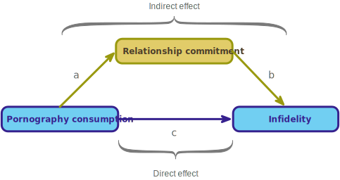

<html lang="en">

```{r setup, include=FALSE}
knitr::opts_chunk$set(
	echo = TRUE,
	message = FALSE,
	warning = FALSE
)

#necessary to render tutorial correctly
library(learnr) 
library(htmltools)
#easystats
library(datawizard)
library(insight)
library(modelbased)
library(parameters)
library(performance)
#tidyverse
library(dplyr)
library(ggplot2)
#non tidyverse/easystats
library(lavaan)
#students don't use
library(sandwich)

source("./www/discovr_helpers.R")


#Read dat files needed for the tutorial

vids_tib <- discovr::video_games
infidelity_tib <- discovr::lambert_2012

vids_cent_tib <- datawizard::center(x = vids_tib, select = c(vid_game, caunts))
```

# discovr moderation and mediation

```{r, child = "./docs/intro.Rmd"}

```

## Packages

```{r, child = "./docs/packages.Rmd"}

```


## Data

```{r, child = "./docs/data.Rmd"}

```


## Fitting models

```{r, child = "./docs/fit_models.Rmd"}

```


## `r user_visor()` Moderation [(B)]{.lbl}

We'll use an example of whether violent video games make people antisocial. Video games have been linked to increased aggression in youths. Another predictor of aggression and conduct problems is callous-unemotional traits such as lack of guilt, lack of empathy, callous use of others for personal gain. Imagine that a scientist explored the relationship between playing violent video games. She measured aggressive behaviour (`aggress`), callous-traits (`caunts`), and the number of hours per week they play video games (`vid_game`) in 442 youths.

Moderation is where a variable (the moderator) affects the relationship between two others. In this example, we're predicting that the relationship between gaming (the predictor) and aggression (the outcome) is affected by the level of callous unemotional traits (the moderator). Statistically, a moderation effect is the interaction between the predictor and moderator and mathematically it is the effect on aggression of scores on the predictor multiplied by scores on the moderator. Therefore, the model we're looking to fit is:

$$
\text{Aggression}_i = b_0 + b_1\text{Gaming}_i + b_2\text{Callous}_i + b_3(\text{Gaming}\times\text{Callous})_i + \varepsilon_i
$$

The moderation effect is represented by $b_3$, the parameter attached to the interaction term ($\text{Gaming}\times\text{Callous}$).


## `r user_visor()` [Moderation]{.alt}: Process the data (centring) [(B)]{.lbl}

Following our model fitting process:

<div class="stepbox">
  `r step()` **Step 1**

Get your data into `r rproj()` and pre-process using [tidyverse]{.pkg} packages or the [datawizard]{.pkg} package from [easystats]{.pkg}.
 
</div>


#### `r alien()` Alien coding challenge

The data are stored in [vids_tib]{.alt}, so let's use the code box to inspect it.

```{r vids_tib, exercise = TRUE, exercise.lines = 2}

```

```{r vids_tib-solution}
vids_tib
```

When an interaction term is included in the model the b parameters have a specific meaning. For the individual predictors they represent the regression of the outcome on that predictor when the other predictor is zero. So, in our model, $b_1$ represents the relationship between aggression and gaming when callous traits are zero, and $b_2$represents the relationship between aggression and callous traits when someone spends zero hours gaming per week. This interpretation isn't problematic because zero is a meaningful score for both predictors: it's plausible both that a child spends no hours playing video games, and that a child gets a score of 0 on the continuum of callous-unemotional traits. However, imagine that rather than measuring how much a child played violent video games we'd measured their heart rate while playing the games as an indicator of their physiological reactivity to them. In this model, the $b$ for callous traits is the regression of aggression on callous traits when someone has a heart rate of zero while playing the games. This $b$ makes no sense a heart rate of zero would mean the person was dead while playing these games. The point is that the presence of the interaction term makes the *b*s for the main predictors uninterpretable in many situations.

For this reason, it is common to transform the predictors using [grand mean centring]{.kt}. [Centring]{.kt} refers to the process of transforming a variable into deviations around a fixed point. This fixed point can be any value that you choose, but grand mean centring a variable is achieved by taking each score and subtracting from it the mean of all scores (for that variable).

Centring is important when your model contains an interaction term because it makes the *b*s for lower-order effects interpretable. There are good reasons for not caring about the lower-order effects when the higher-order interaction involving those effects is significant; for example, if the gaming × callous traits interaction is significant, then its not clear why we would be interested in the individual effects of gaming and callous traits. However, when the interaction is not significant, centring makes interpreting the main effects easier. With centred variables the *b*s for individual predictors have two interpretations (1) they are the effect of that predictor at the mean value of the sample; and (2) they are the average effect of the predictor across the range of scores for the other predictors. To explain the second interpretation, imagine we took everyone who spent no hours gaming, estimated the linear model between aggression and callous traits and noted the *b*. We then took everyone who played games for 1 hour and did the same, and then took everyone who gamed for 2 hours per week and did the same. We continued doing this until we had estimated linear models for every different value of the hours spent gaming. We'd have a lot of bs, each one representing the relationship between callous traits and aggression for different amounts of gaming. If we took an average of these bs then we'd get the same value as the b for callous traits (centred) when we use it as a predictor with gaming (centred) and their interaction.

We can use the `centre()` function  from [datawizard]{.pkg} to centre variables in our tibble. You place your tibble into the function and use [select]{.alt} to choose variables to be centred. The function over-writes the existing data so it's a good idea to save the resulting data in a new tibble.

#### `r robot()` Code example

For example, to centre the variables `caunts` and `vid_game` within [vids_tib]{.alt} and store the resulting data as a new tibble called `vids_cent_tib`, we could use this code:

```{r, eval = F}
vids_cent_tib <- center(x = vids_tib, select = c(vid_game, caunts))
```


#### `r alien()` Alien coding challenge

Use the code in the example, to create a new tibble called `vids_cent_tib` that contains centred versions of `caunts` and `vid_game`. Display this new tibble.

```{r vid_cent, exercise = TRUE, exercise.lines = 5}

```


```{r vid_cent-solution}
vids_cent_tib <- center(x = vids_tib, select = c(vid_game, caunts))
vids_cent_tib
```

That's it, you have just centred some variables!

```{r gmc_quiz, echo = F}
question("Grand mean centring for a given variable is achieved by:",
         answer("Taking each score and subtracting from it the mean of all scores (for that variable).",  correct = TRUE, message = "Well done, this answer is correct."),
         answer("Taking the mean of all scores (ignoring from which variable they come) and subtracting each score from it.", message = "Unlucky, have another try."),
         answer("Taking each score and dividing it by the mean of all scores (for that variable).", message = "Unlucky, have another try."),
         answer("Taking each score, subtracting the mean and then dividing by the standard deviation.", message = "Close. This answer describes standardizing the score, not centring it."),
         allow_retry = TRUE,
         random_answer_order = TRUE
)
```


We could now summarize the data using `describe_distribution()` as in previous tutorials.

#### `r alien()` Alien coding challenge

Use the code in the example, to summarize all of the variables in `vids_cent_tib`.

```{r vid_cent_dd, exercise = TRUE, exercise.lines = 5}

```

```{r vid_cent_dd-solution}
describe_distribution(vids_cent_tib) |> 
  display()
```

Note that the centred variables have means of 0 (because they have been centred) and all three variables have acceptable levels of skew and kurtosis.

<div class="stepbox">
  `r step()` **Step 2**

Visualise the data using the [ggplot2]{.pkg} package from [tidyverse]{.pkg}.
 
</div>

The effect we want to visualise is the interaction term, which doesn't exist in the raw data so this step is easier done *after* we fit the model.


## `r user_visor()` [Moderation]{.alt}: Fit the model [(B)]{.lbl}

<div class="stepbox">
  `r step()` **Step 3**

Fit a statistical model that will answer your research question.
 
</div>


I mentioned already that moderation is represented by the interaction between the predictor and moderator in a linear model. Therefore, having centred the predictor and moderator, we fit a linear model using `lm()` with the centred predictor, centred moderator and the interaction of the two centred variables as predictors. Mathematically speaking, we are literally looking at the effect of the two variables multiplied together. The interaction variable in our example would be the scores on the time spent gaming multiplied by the scores for callous-unemotional traits.

We can specify an interaction term within a model formula in `r rproj()` in two ways. The first, in general form, is:

```{r, eval= F}
var_1:var_2
```

This is the interaction between variables [var_1]{.alt} and [var_2]{.alt}.

#### `r robot()` Code example

If we wanted a model that predicts `aggress` from `caunts`, `vid_game` and their interaction we could specify this as:

```{r, eval= F}
aggress ~ caunts + vid_game + caunts:vid_game
```

In this case, the interaction term is specified using [caunts:vid_game](.alt).

There is also a shorthand for adding all main effects and their interactions, which is:

```{r, eval= F}
var_1*var_2
```

This code will introduce the main effect of [var_1]{.alt}, the main effect of [var_2]{.alt} and their interaction.

#### `r robot()` Code example

Therefore, another way to specify the same model is:

```{r, eval= F}
aggress ~ caunts*vid_game
```

The two methods are comparable.

#### `r alien()` Alien coding challenge

Use the code example, and what you have learnt so far, to fit a linear model using `lm()` to predict `aggress` from `caunts`, `vid_game` and their interaction. Store the model as [aggress_lm]{.alt}. (Remember to use the centred variables already created within [vids_cent_tib]{.alt}.)


```{r vid_mod, exercise = TRUE, exercise.lines = 4}

```

```{r vid_mod-hint-1}
# store the model as aggress_lm:
aggress_lm <- lm(...)
# Now fill in the blanks within lm()
```

```{r vid_mod-solution}
# You can use either (most succinct):
aggress_lm <- lm(aggress ~ caunts*vid_game, data = vids_cent_tib)
# or (most explicit):
aggress_lm <- lm(aggress ~ caunts + vid_game + caunts:vid_game, data = vids_cent_tib)
# now display the parameters with tidy()
```

## `r user_visor()` [Moderation]{.alt}: Evaluate the model [(B)]{.lbl}

Having fitted the model, we move onto

<div class="stepbox">
  `r step()` **Step 4**

Evaluate the model using a small number of functions from the [performance]{.pkg} package from [easystats]{.pkg}. Specially, we evaluate

- How well the model fits the data
- Whether the underlying assumptions of the model are met. If not, we refit the model using robust methods (see Figure 3).
 
</div>


We use the same code as we did in `discovr_08` but with the current model.

#### `r alien()` Alien coding challenge

Use the code box to evaluate the model fit of [aggress_lm]{.alt}.

```{r aggress_lm}
aggress_lm <- lm(aggress ~ caunts + vid_game + caunts:vid_game, data = vids_cent_tib)
```


```{r vid_mod_fit, exercise = TRUE, exercise.lines = 4, exercise.setup = "aggress_lm"}

```

```{r vid_mod_fit-hint-1}
# Get fit statistics:
model_performance(aggress_lm) |> 
  display()
# Now test the fit
```

```{r vid_mod_fit-solution}
# Get fit statistics:
model_performance(aggress_lm) |> 
  display()
# Now test the fit
test_wald(aggress_lm) |> 
  display()
```

```{r, echo = F}
aggress_lm <- lm(aggress ~ caunts + vid_game + caunts:vid_game, data = vids_cent_tib)
agg_perf <- model_performance(aggress_lm)
agg_wald <- test_wald(aggress_lm)
agg_par <- model_parameters(aggress_lm)
```

<div class="reportbox">
  `r pencil()` **Report it!**

The model explains `r report_value(100*value_from_ez(agg_perf, value = "R2", as_is = TRUE), digits = 0)`% of the variance in aggression and is a significant fit of the data, `r report_lrt(agg_wald)`.
</div>

#### `r alien()` Alien coding challenge

Use the code box to assess whether the model assumptions are reasonable [aggress_lm]{.alt}.


```{r vid_mod_assump, exercise = TRUE, exercise.lines = 4, exercise.setup = "aggress_lm"}

```

```{r vid_mod_assump-solution}
check_model(aggress_lm)
```

Refer to `discovr_08` to interpret these plots, but to sum up:

- Top left: The green line (distribution from the model) approximates the blue lines (assumed distribution) so there is no reason to doubt the distributional assumptions.
- Top right ([linearity]{.kt}): the green line is approximately flat at zero (the central line) suggesting linearity.
- Middle left ([homoscedasticity]{.kt}): there is no evidence that the spread of residuals changes as we look horizontally along the plot (the dots do not form an obvious funnel or diamond shape). The plot is indicative of homoscedasticity being a reasonable assumption.
- Middle right (influential cases): All cases fall well within the funnel and most are close to the flat horizontal line. This suggests no influential cases.
- Bottom left ([collinearity]{.kt}): VIF values are all low.
- Bottom right (normality of residuals): the dots lie approximately along the flat green line, suggesting that the residuals are approximately normally distributed.

Having established that the model assumptions are reasonable, we can move onto the final step.

## `r user_visor()` [Moderation]{.alt}: Interpret the model [(B)]{.lbl}

<div class="stepbox">
  `r step()` **Step 5**

Interpret the model

- Interpret the values that define the model (the [parameter estimates]{.alt}) using the [parameters]{.pkg} package from [easystats]{.pkg}.
- Make specific predictions from our model using the [modelbased]{.pkg} package from [easystats]{.pkg}.
 
</div>

As with any model, we can view the parameter estimates and their confidence intervals using `model_parameters()`.

#### `r alien()` Alien coding challenge

Use the code box to view the model parameters.

```{r vid_mod_pars, exercise = TRUE, exercise.lines = 4, exercise.setup = "aggress_lm"}

```

```{r vid_mod_pars-solution}
model_parameters(aggress_lm) |> 
  display()
```


Moderation is shown up by a significant interaction effect, and that's what we've got here, `r report_pe(agg_par, row = 4)` indicating that the relationship between the time spent gaming and aggression is moderated by callous traits. [It is equally valid to say that the relationship between callous traits and aggression is moderated by the time spent gaming.]

To make sense of this effect we can use some model-based predictions and visualisations (so we return to Step 2, which we skipped).

## `r user_visor()` Moderation: Model-based predictions  [(B)]{.lbl}


### `r user_visor()` The Johnson-Neyman interval  [(B)]{.lbl}

To interpret the moderation effect we examine the Johnson-Neyman interval and simple slopes. We can obtain both using the `estimate_slopes()` function from the [modelbased]{.pkg} package that is part of [easystats]{,pkg}. This function takes the general form:

```{r, eval = F}
estimate_slopes(
  model = my_model,
  trend = predictor_variable,
  by = moderator_variable,
  ci = 0.95,
  p_adjust = "none")
```


In which you replace [my_model]{.alt} with the name of your model, [predictor_variable]{.alt} with the name of the predictor variable (in our case `vid_game`), and [moderator_variable]{.alt} with the name of the moderator variable (in our case `caunts`). There are additional arguments to set the width of the confidence interval and adjust significance tests that we have seen before in [easystats]{.pkg} functions and the defaults are fine for us.

The difference between using this function for simple slopes and the Johnson-Neyman interval is in how we specify the moderator and whether we include a length argument. For a Johnson-Neyman interval we specify only the name of the moderator and we can (optionally) include a length argument that determines how many values are used to construct the interval (if you don't use this argument you may get a warning that you don't have enough data points for an accurate interval).

#### `r robot()` Code example

For our data we can get a Johnson-Neyman interval using

```{r, eval = F}
vid_jn <- estimate_slopes(model = aggress_lm,
                          trend = "vid_game",
                          by = "caunts",
                          length = 100)
```

Notice that I have saved the output as [vid_jn]{.alt} because we want to use it to get both a summary table and a plot. At the moment, the object contains a table with 100 rows (because we specified that we wanted an interval made up of 100 data points). We don't want to print all of this, so instead we can use `summary()` to give us the cut-offs for the interval:

```{r, eval = F}
summary(vid_jn) |> 
  display()
```

We can also plot the interval using `plot()`, which produces a ggplot object so we can add labels and themes in the usual way:

```{r, eval = F}
plot(vid_jn) + theme_bw()
```

#### `r alien()` Alien coding challenge

Complete the code in the code box to obtain and display a summary of the Johnson-Neyman interval for our model ([aggress_lm].alt{}):

```{r vid_mod_jn, exercise = TRUE, exercise.lines = 9, exercise.setup = "aggress_lm"}
vid_jn <- estimate_slopes()
```

```{r vid_mod_jn-hint-1}
# Include the model within it (aggress_lm)
vid_jn <- estimate_slopes(model = aggress_lm)
# now specify the predictor using trend = 
```

```{r vid_mod_jn-hint-2}
vid_jn <- estimate_slopes(model = aggress_lm,
                          trend = "vid_game")
# now specify the moderator using by = 
```

```{r vid_mod_jn-hint-3}
vid_jn <- estimate_slopes(model = aggress_lm,
                          trend = "vid_game",
                          by = "caunts")
# specify the length of the interval using length = 
```

```{r vid_mod_jn-hint-4}
vid_jn <- estimate_slopes(model = aggress_lm,
                          trend = "vid_game",
                          by = "caunts",
                          length = 100)
# Now ask to display a summary
```


```{r vid_mod_jn-solution}
vid_jn <- estimate_slopes(model = aggress_lm,
                          trend = "vid_game",
                          by = "caunts",
                          length = 100)
summary(vid_jn) |> 
  display()
```

```{r}
vid_jn <- estimate_slopes(model = aggress_lm,
                          trend = "vid_game",
                          by = "caunts",
                          length = 100)
vid_jn_sum <- summary(vid_jn)
```

The Johnson-Neyman interval suggests that the relationship between video games and aggression is negative (more time playing games is associated with less aggression) and significant when the level of callous traits (centred) is between `r value_from_ez(vid_jn_sum, value = "Start")` and `r value_from_ez(vid_jn_sum, value = "End")` (i.e. very low). There is no significant relationship between video games and aggression for levels of callous traits between `r value_from_ez(vid_jn_sum, value = "Start", row = 2)` and `r value_from_ez(vid_jn_sum, value = "End", row = 3)`. These values are both negative so given this variable is centred represent values of callous traits below the mean. There is a significant positive relationship between video games and aggression (more time playing games is associated with more aggression) for levels of callous traits above about `r value_from_ez(vid_jn_sum, value = "Start", row = 4)` and `r value_from_ez(vid_jn_sum, value = "End", row = 4)`. Crudely put, it looks like in those with above average callous traits we can expect a significant positive relationship between video games and aggression. 

#### `r alien()` Alien coding challenge

Plot the Johnson-Neyman interval for our model ([aggress_lm].alt{}):

```{r aggress_jn}
aggress_lm <- lm(aggress ~ caunts + vid_game + caunts:vid_game, data = vids_cent_tib)
vid_jn <- estimate_slopes(model = aggress_lm,
                          trend = "vid_game",
                          by = "caunts",
                          length = 100)
```

```{r vid_mod_jn_plot, exercise = TRUE, exercise.lines = 9, exercise.setup = "aggress_jn"}

```

```{r vid_mod_jn_plot-solution}
plot(vid_jn) + theme_bw()
```

Note that the *y*-axis represents the slope of the variable `vid_game`. In other words, it represents the relationship between `vid_game` and `aggress` (the outcome). The red zone shows the values of *y* that are not significantly different from zero. Note that this zone starts just before the value of *x* (callous traits) falls below about -15 and ends just before it reaches 0. This red zone is the Johnson-Neyman interval. The blue zones represent where the relationship between video gaming and aggression is significant. On the far left, when callous traits (the value of *x*) fall below about -16, the values of *y* (the relationship between gaming and aggression) are negative. In other words, for values of callous traits below -16 there is a significant negative relationship between gaming and aggression. As callous traits (the value of *x*) rise above about −1, we move into another zone of significance, but this time *y*-values are greater than zero meaning that values of *y* (the relationship between gaming and aggression) are positive. In other words, for values of callous traits above about -1 there is a significant positive relationship between gaming and aggression.

Therefore, the Johnson-Neyman interval and plot tell us that at very low levels of callous unemotional traits there is a significant negative relationship between gaming and aggression, and for above average levels of callous unemotional traits (above -1) there is a significant positive relationship between gaming and aggression.


### `r user_visor()` Simple slopes  [(B)]{.lbl}

To get simple slopes, we again use `estimate_slopes()` but we specify the moderator differently and remove the [length]{.alt} argument:

#### `r robot()` Code example


```{r, eval = F}
estimate_slopes(model = aggress_lm, trend = "vid_game", by = "caunts=[sd]") |> 
  display()
```

By specifying the moderator as ["caunts=[sd]"]{.alt} we are asking the function to calculate the slope of the relationship between video game use and aggression for mean levels of callous traits and levels one standard deviation (hence the [sd]{.alt}) above and below that mean.

#### `r alien()` Alien coding challenge

Use the code box to obtain simple slopes for our model.


```{r vid_mod_ss, exercise = TRUE, exercise.lines = 9, exercise.setup = "aggress_lm"}

```

```{r vid_mod_ss-solution}
estimate_slopes(model = aggress_lm, trend = "vid_game", by = "caunts=[sd]") |> 
  display()
```


```{r}
vid_ss <- estimate_slopes(model = aggress_lm, trend = "vid_game", by = "caunts=[sd]")
```


The results of the simple slopes analysis shows three models: the model for time spent gaming as a predictor of aggression (1) when callous traits are low (to be precise when the value of callous traits is -9.62); (2) at the mean value of callous traits (because we centred callous traits its mean value is 0, as indicated in the output); and (3) when the value of callous traits is 9.62 (i.e., high). We interpret these models as we would any other linear model by looking at the value of $\hat{b}$ ([Slope]{.opt} in the output) and its significance. 

<div class="reportbox">
  `r pencil()` **Report**`r rproj()`

When callous traits are low 1 standard deviation below the mean, there is a non-significant negative relationship between time spent gaming and aggression, `r report_ss(vid_ss, row = 1)`. At the mean value of callous traits, there is a significant positive relationship between time spent gaming and aggression, `r report_ss(vid_ss, row = 2)`. When callous traits are high, there is a significant positive relationship between time spent gaming and aggression, `r report_ss(vid_ss, row = 3)`.
</div>

These results tell us that the relationship between time spent playing violent video games and aggression only really emerges in people with average or greater levels of callous-unemotional traits.

### `r user_astronaut()` Plotting simple slopes [(C)]{.lbl}

#### `r robot()` Code example

We can visualise the simple slopes models using the `estimate_means()` function (also from [modelbased]{.pkg}), which takes the general form:

```{r, eval = FALSE}
estimate_means(model = my_model,
               by = c("predictor_1", "predictor_2", ...),
               ci = 0.95)
```

We replace [my_model]{.alt} with the name of our model ([aggress_lm]{.alt}), then specify these arguments:

-	[by = c("predictor_1", "predictor_2", ...)]{.alt}: the predictor(s) over which you want to compute means. In our case, we want the estimated means for `vid_game` when `caunts` is at its average value and one standard deviation either side of that average. Like we did for the simple slopes, we specify these values of `caunts` using ["caunts=[sd]"]{.alt} and, enter [by = c("vid_game", "caunts=[sd]")]{.alt} into the function.
-	[ci = 0.95]{.alt}: specifies the width of the confidence interval. It defaults to a 95% confidence interval so if you're happy with that you can leave this argument out.

We can pipe these estimated means into `plot()` to get a [ggplot2]{.pkg} object that can be modified using familiar syntax.

#### `r alien()` Alien coding challenge

Use the code box to obtain a plot of the simple slopes for our model.

```{r vid_mod_ss_plot, exercise = TRUE, exercise.lines = 9, exercise.setup = "aggress_lm"}
estimate_means(model = xxxx,
               by = c("xxxx", "xxxx"))
```

```{r vid_mod_ss_plot-hint-1}
# replace the xxxs
estimate_means(model = aggress_lm, by = c("vid_game", "caunts=[sd]"))
# pipe into the plot function
```

```{r vid_mod_ss_plot-hint-2}
estimate_means(model = aggress_lm, by = c("vid_game", "caunts=[sd]")) |> 
  plot()
# add some axis labels and labels for colour and fill
```

```{r vid_mod_ss_plot-hint-3}
# replace the xxxs
estimate_means(model = aggress_lm, by = c("vid_game", "caunts=[sd]")) |> 
  plot() |> 
  labs(x = " Video game use per week (centred) ", y = "Aggression", colour = "Callous traits (centred)", fill = "Callous traits (centred)")
# add a theme
```

```{r vid_mod_ss_plot-solution}
estimate_means(model = aggress_lm, by = c("vid_game", "caunts=[sd]")) |> 
  plot() +
  labs(x = " Video game use per week (centred) ", y = "Aggression", colour = "Callous traits (centred)", fill = "Callous traits (centred)") +
  theme_minimal()
```


The resulting plot helps us to see that the slope of video game use on aggression becomes stronger and more positive as callous traits increase.

### `r user_astronaut()` Robust moderation models  [(C)]{.lbl}

If the model assumptions had *not* seemed reasonable we could have fitted a robust version of the model using `model_parameters()`  (see `discovr_08`). 

#### `r alien()` Alien coding challenge

Try to re-fit the model using HC4 standard errors and print to three decimal places.

```{r vid_mod_rob, exercise = TRUE, exercise.lines = 4, exercise.setup = "aggress_lm"}

```

```{r vid_mod_rob-hint-1}
# Place the model aggress_lm into:
model_parameters()
```

```{r vid_mod_rob-hint-2}
# Place the model aggress_lm into:
model_parameters(aggress_lm)
# set the vcov argument to HC4
```

```{r vid_mod_rob-hint-3}
# Place the model aggress_lm into:
model_parameters(aggress_lm, vcov = "HC4")
# display the results to 3 d.p.
```

```{r vid_mod_rob-solution}
# Solution:
model_parameters(aggress_lm, vcov = "HC4") |> 
  display(digits = 3)
```

```{r echo = F}
agg_rob <- model_parameters(aggress_lm, vcov = "HC4")
```


<div class="reportbox">
  `r pencil()` **Report**`r rproj()`
  
Consistent with the non-robust model, the robust model shows a significant moderation effect, `r report_pe(agg_rob, row = 4, digits = 3)`.
</div>
 


## `r user_visor()` Mediation [(B)]{.lbl}

Whereas moderation alludes to the combined effect of two variables on an outcome, [mediation]{.kt} refers to a situation when the relationship between a predictor variable and an outcome variable can be explained by their relationship to a third variable (the [mediator]{.kt}). Let's look at an example. Research has shown that physical attractiveness, conscientiousness and neuroticism predict marital satisfaction. Pornography use probably doesn't: it is related to infidelity [@lambert_love_2012]. Mediation is about the variables that explain relationships like these: its unlikely that everyone who catches a glimpse of porn suddenly rushes out of their house to have an affair – presumably it leads to some kind of emotional or cognitive change that undermines the love glue that holds us and our partners together. Figure 4 shows the hypothesis that Lambert et al. tested. The relationship between pornography consumption (the predictor) and infidelity (the outcome) is mediated by (or works via) relationship commitment (the mediator). This model suggests that the relationship between pornography consumption and infidelity (labelled as path $c$) isn't a direct effect but operates though porn consumption reducing relationship commitment (labelled as path $a$) and relationship commitment affecting infidelity (labelled as path $b$). When conducting mediation analysis we therefore distinguish between the [direct effect]{.kt} of the predictor on the outcome and the [indirect effect]{.kt} (the effect via other variables) of the predictor on the outcome. In this example, We can partition the total effect of pornography consumption on infidelity into the direct effect, which is the relationship between them adjusting for relationship commitment, and the indirect effect, which is the effect of pornography consumption on infidelity *through* relationship commitment.

<figure>

<figcaption>Figure 4: Diagram of a mediation model from Lambert et al. (2012).</figcaption>
</figure>

### `r user_astronaut()` Mediation as two linear models [(C)]{.lbl}

Mathematically we can represent mediation as two models. In the first model we predict the outcome variable (infidelity) from both the mediator (commitment) and the predictor (porn consumption). We can express this model with the following equation (we don't need an intercept). Although we're used to using $\hat{b}$ ato represent model parameter estimates, I use $\hat{c}$ and $\hat{b}$ to distinguish model parameter estimates attached to different predictors because these letters map to the paths in Figure 4.

$$
\begin{aligned}
\widehat{\text{outcome}}_i &= \hat{c}\text{predictor}_i +\hat{b}\text{mediator}_i \\
\widehat{\text{infidelity}}_i &= \hat{c}\text{porn}_i +\hat{b}\text{commitment}_i
\end{aligned}
$$

In the second model, we predict scores on the mediator variable (commitment) from the predictor (porn consumption). Again, we can express this as a standard linear model in which $\hat{a}$ denotes the parameter estimate for `porn` as predictor of `commitment` (as in Figure 4).

$$
\begin{aligned}
\widehat{\text{mediator}}_i &= \hat{a}\text{predictor}_i  \\
\widehat{\text{commitment}}_i &= \hat{a}\text{porn}_i
\end{aligned}
$$

We can use these models to express the direct and indirect effects in terms of the model parameters that I have denoted as $\hat{a}$, $\hat{b}$ and $\hat{c}$ (see also Figure 2).

* The parameter estimate for the direct effect is $\hat{c}$, the relationship between porn use and infidelity adjusting for relationship commitment. 
* The parameter estimate for the indirect effect is $\hat{a} \times \hat{b}$, or put another way it is the effect of porn use on commitment multiplied by the effect of commitment on infidelity.

It follows that the total effect of porn use on infidelity can be expressed as the sum of the direct and indirect effects, in other words $\hat{c} + (\hat{a} \times \hat{b})$

## `r user_visor()` [Mediation]{.alt}: Process the data [(B)]{.lbl}

Following our model fitting process:

<div class="stepbox">
  `r step()` **Step 1**

Get your data into `r rproj()` and pre-process using [tidyverse]{.pkg} packages or the [datawizard]{.pkg} package from [easystats]{.pkg}.
 
</div>

In Lambert et al.s (2012) study the researchers measured pornography `consumption` on a scale from 0 (low) to 8 (high) but this variable, as you might expect, was skewed (most people had low scores) so they analysed log-transformed values (`ln_porn`). They also measured commitment to their current relationship (`commit`) on a scale from 1 (low) to 5 (high). Infidelity was measured with questions asking whether the person had committed a physical act (`phys_inf`) that they or their partner would consider to be unfaithful (0 = no, 1 = one of them would consider it unfaithful, 2 = both of them would consider it unfaithful), and also using the number of people they had hooked up with in the previous year (`hook_ups`), which would mean during a time period in which they were in their current relationship. 

#### `r alien()` Alien coding challenge

The actual data from Lambert et al.s study are in the tibble [infidelity_tib]{.alt}, use the code box to inspect the data and then create a table summary using `describe_distribution()`

```{r lambert_step1, exercise = TRUE, exercise.lines = 8}

```

```{r lambert_step1-hint-1}
#inspect the data:
infidelity_tib
# now use describe distribution
```

```{r lambert_step1-solution}
#inspect the data:
infidelity_tib
# now use describe distribution
describe_distribution(infidelity_tib) |> 
  display()
```

Note that values of skew and kurtosis are very large for pornography `consumption` but are not for the log transformed values (`ln_porn`) showing that the researchers decision to transform the raw values to log scores successfully reduced non-normality. Note that `hook_ups` (which we don't use in our model) is also wildly skewed and has extreme kurtosis.

<div class="stepbox">
  `r step()` **Step 2**

Visualise the data using the [ggplot2]{.pkg} package from [tidyverse]{.pkg}.
 
</div>

The effects of interest are not straightforward to visualise, so we'll skip this step. You could, however, use `ggscatmat()` from [GGally]{.pkg} to plot the individual variables in the data (see `discovr_08`).


## `r user_visor()` [Mediation]{.alt}: Fit the model [(B)]{.lbl}

<div class="stepbox">
  `r step()` **Step 3**

Fit a statistical model that will answer your research question.
 
</div>

To fit the median model were going to use the `sem()` function from [lavaan]{.pkg} [@R-lavaan; @lavaan2012], but it has many others! This function is the same as the more general `lavaan()` function but with a few default options set. In fact, there are more than 50 arguments/options that allow you to control a vast array of things about your model.

#### `r robot()` Code example

Including only the argument we need, the `sem()` function takes the general form:

```{r, eval = F}
my_model_fit <- lavaan::sem(
  model = my_model,
  data = my_tibble,
  missing = "listwise",
  estimator = "ML")
```

A few things to note. First, the [my_model]{.alt} represents a string of text that defines the variables in the model and the relationships between them. Typically you'd define this as an object before using the function. Second, by default, the function uses listwise deletion to handle missing values (i.e. any case with missing values on the variables within the model is excluded). This practice is generally a bad idea. A better idea is to change this default to [missing = "fiml"]{.alt}, which estimates the model using something called full information maximum likelihood, which basically uses all available data for each case. This approach will work only if the estimator is one of the maximum likelihood family, which by default it is ([estimator = "ML"]{.alt}). Finally, we can use different maximum likelihood estimators to fit robust models. For example, using [estimator = "MLR"]{.alt} will use robust estimators of the standard errors (Huber-White) similar to those we use elsewhere in these tutorials.


#### `r robot()` Code example

The most challenging part is specifying the model. Essentially lavaan has a syntax for specifying models. For a mediation model with one predictor the syntax will look like this:

```{r, eval = F}
my_mod <- 'outcome ~ c*predictor + b*mediator
          mediator ~ a*predictor
       
          indirect_effect := a*b
          total_effect := c + (a*b)
         '
```

We create an object (called [my_mod]{.alt} above) from a bunch of text enclosed in single quotes (don't forget the quotes ...). Within the quotes we represent the paths in Figure 4 (like we did earlier using equations) and define the indirect and total effects; in short, we turn Figure 4 into a set of instructions for `lavaan`. Lets break this code down.

* [outcome ~ c\*predictor + b\*mediator]{.alt}. This text expresses the model for the outcome variable (i.e. paths $b$ and $c$ in Figure 4). We'd replace [outcome]{.alt} with the name of the outcome variable (in this case `phys_inf`), [predictor]{.alt} with the name of the predictor variable (in this case `ln_porn`), and [mediator]{.alt} with the name of the mediator variable (in this case `commit`). So, we'd use [phys_inf ~ c\*ln_porn + b\*commit]{.alt}. The [c\*]{.alt} and [b\*]{.alt} create labels for the parameter attached to the predictor and mediator variables respectively (I've used the labels [b]{.alt} and [c]{.alt} to map the effects to Figure 4 but you can use different labels).
* [mediator ~ a\*predictor]{.alt}. This text expresses how the mediator is predicted (i.e. path $a$ in Figure 4). We'd replace [mediator]{.alt} with the name of the mediator variable (in this case `commit`) and [predictor]{.alt} with the name of the predictor variable (in this case `ln_porn`). So, we'd use [commit ~ a\*ln_porn]{.alt}. Again, [a\*]{.alt} creates a label for the parameter attached to the predictor variable.
* [indirect_effect := a\*b]{.alt}. This text defines the indirect effect. On the left-hand side of the [:=]{.alt} we give the effect a name. We can use any name (without spaces) but I have chosen indirect_effect because it describes what were estimating. On the right-hand side we define the indirect effect as the value of [a]{.alt} (defined above as the parameter estimate for the predictor when it predicts the mediator) multiplied by the value of [b]{.alt} (defined above as the parameter estimate for the mediator when it predicts the outcome). It is, literally, the product of paths $a$ and $b$ in Figure 4.
* [total_effect := c + (a\*b)]{.alt}. This text defines the total effect, which is the direct effect added to the indirect effect. On the left-hand side of the [:=]{.alt} we give the effect a name. Again, we can use any name (without spaces) but I have chosen total_effect because it describes what were estimating. On the right-hand side we define the total effect as the value of the direct effect (path $c$ in Figure 4) added to the indirect effect (defined above as paths $a$ and $b$ multiplied).

#### `r robot()` Code example

Based on all of this nonsense, we would define the current model, which I've called [infidelity_mod]{.alt}, using this code:

```{r, eval = F}
infidelity_mod <- 'phys_inf ~ c*ln_porn + b*commit
                   commit ~ a*ln_porn

                   indirect_effect := a*b
                   total_effect := c + (a*b)
                   '
```

Having executed that code, we need to fit the model to the data using the `sem()` function. Using the defaults of listwise deletion of cases with missing data (boooo) and maximum likelihood estimation, the code would be:

```{r, eval = F}
infidelity_fit <- lavaan::sem(infidelity_mod, data = infidelity_tib)
```

However, were going to handle the (tiny amount of) missing data using full information maximum likelihood estimation and also estimate robust standard errors by changing the estimator to MLR:

```{r, eval = F}
infidelity_fit <- lavaan::sem(infidelity_mod,
                              data = infidelity_tib,
                              missing = "FIML",
                              estimator = "MLR")
```

Once this code has been executed, the fitted model is stored in an object that I've called [infidelity_fit]{.alt} (I tend to use the suffix [_fit]{.alt} for fitted models). As with other models we've used previously we can use `model_performance()` to get fit statistics and `model_parameters()` to get model parameters.

#### `r alien()` Alien coding challenge

Use the sample code to fit the mediation model with FIML and robust SEs.

```{r porn_med, exercise = TRUE, exercise.lines = 12}

```

```{r porn_med-solution}
# Define the model
infidelity_mod <- 'phys_inf ~ c*ln_porn + b*commit
                   commit ~ a*ln_porn

                   indirect_effect := a*b
                   total_effect := c + (a*b)
                   '
# fit the model with FIML and robust SEs
infidelity_fit <- lavaan::sem(infidelity_mod,
                              data = infidelity_tib,
                              missing = "FIML",
                              estimator = "MLR")
```

Nothing will have appeared to have happened but the model has been created, so let's move onto Step 4.

## `r user_visor()` [Mediation]{.alt}: Evaluate the model [(B)]{.lbl}

<div class="stepbox">
  `r step()` **Step 4**

Evaluate the model using a small number of functions from the [performance]{.pkg} package from [easystats]{.pkg}. Specially, we evaluate

- How well the model fits the data
- Whether the underlying assumptions of the model are met. If not, we refit the model using robust methods (see Figure 3).
 
</div>

#### `r alien()` Alien coding challenge

Use the code box to evaluate the model fit of [infidelity_fit]{.alt}.

```{r lambert_sem}
infidelity_mod <- 'phys_inf ~ c*ln_porn + b*commit
                   commit ~ a*ln_porn

                   indirect_effect := a*b
                   total_effect := c + (a*b)
                   '
infidelity_fit <- lavaan::sem(infidelity_mod, data = infidelity_tib, missing = "FIML", estimator = "MLR")
```


```{r lambert_fit, exercise = TRUE, exercise.lines = 4, exercise.setup = "lambert_sem"}

```

```{r lambert_fit-hint-1}
# Get fit statistics:
model_performance(infidelity_fit)
# now display the table nicel
```

```{r lambert_fit-solution}
# Get fit statistics:
model_performance(infidelity_fit) |> 
  display()
```


```{r echo = F}
infidelity_mod <- 'phys_inf ~ c*ln_porn + b*commit
                   commit ~ a*ln_porn

                   indirect_effect := a*b
                   total_effect := c + (a*b)
                   '
infidelity_fit <- lavaan::sem(infidelity_mod, data = infidelity_tib, missing = "FIML", estimator = "MLR")

porn_fit <- model_performance(infidelity_fit) 
porn_par <- model_parameters(infidelity_fit)
porn_zpar <- model_parameters(infidelity_fit, standardize = TRUE)
```


The output for this model is actually uninteresting because we've fitted what's known as a [saturated model]{.kt}; that is, the model fully explains the data and consequently all fit indices (basically, everything in the table ending in [FI]{.alt}) are 1 indicating perfect fit.

## `r user_visor()` [Mediation]{.alt}: Interpret the model [(B)]{.lbl}

<div class="stepbox">
  `r step()` **Step 5**

Interpret the values that define the model (the [parameter estimates]{.alt}) using the [parameters]{.pkg} package from [easystats]{.pkg}.
 
</div>

As with any model, we can view the parameter estimates and their confidence intervals using `model_parameters()`.

#### `r alien()` Alien coding challenge

Use the code box to view the model parameters.

```{r lambert_pars, exercise = TRUE, exercise.lines = 4, exercise.setup = "lambert_sem"}

```

```{r lambert_pars-solution}
model_parameters(infidelity_fit) |> 
  display()
```


 
The output contains the parameter estimates for the effects that we assigned labels ([a]{.alt}, [b]{.alt}, [c]{.alt}, [indirect_effect]{.alt} and [total_effect]{.alt}). The first row shows the parameter for the direct effect of infidelity predicted from pornography consumption (i.e., path $c$ in Figure 4) adjusting for paths $a$ and $b$. This output is interpreted just as we would interpret any linear model: pornography consumption does not quite significantly predict infidelity with the other relationships between variables in the model, `r report_pe(porn_par, row = 1, z = T, symbol = "$\\hat{c}$")`. The next row tells us that relationship commitment significantly predicts infidelity (path $b$ in Figure 4), `r report_pe(porn_par, row = 2, z = T)`.  The negative parameter estimate for commitment tells us that as commitment increases, infidelity declines (and vice versa), but the positive parameter estimate for consumption indicates that as pornography consumption increases, infidelity increases also. These relationships are in the predicted direction. The third row shows the results of the linear model of commitment predicted from pornography consumption (path $a$ in Figure 4): pornography consumption significantly predicts relationship commitment, `r report_pe(porn_par, row = 3, z = T, symbol = "$\\hat{a}$")`.

The bottom row shows the total effect of pornography consumption on infidelity (outcome). Remember that the total effect is the effect of the predictor on the outcome when the mediator is not present in the model. When relationship commitment is not in the model, pornography consumption significantly predicts infidelity, `r report_pe(porn_par, row = 5, z = T)`. As is the case when we include relationship commitment in the model, pornography consumption has a positive relationship with infidelity (as shown by the positive $b$-value).

The most important part of the output is the penultimate row because it displays the results for the indirect effect of pornography consumption on infidelity (i.e., the effect via relationship commitment). The indirect effect is not quite significant, `r report_pe(porn_par, row = 4, z = T)`, suggesting that there isn't a significant mediation effect.

<div class="reportbox">
  `r pencil()` **Report**`r rproj()`

When relationship commitment was not in the model, pornography consumption had a significant positive relationship with infidelity, `r report_pe(porn_par, row = 5, z = T)`. With relationship commitment included in the model, pornography consumption did not quite significantly predict infidelity, `r report_pe(porn_par, row = 1, z = T, symbol = "$\\hat{c}$")`. Pornography consumption significantly predicted relationship commitment, `r report_pe(porn_par, row = 3, z = T, symbol = "$\\hat{a}$")`, and relationship commitment significantly predicted infidelity, `r report_pe(porn_par, row = 2, z = T)`. Most important, the indirect of pornography consumption on infidelity was not significant, `r report_pe(porn_par, row = 4, z = T)`, suggesting that there a non-significant mediation effect.
</div>

 
#### `r alien()` Alien coding challenge

Refit the model using a non-robust estimator and view the parameter estimates.

```{r porn_mod, echo = F}
infidelity_mod <- 'phys_inf ~ c*ln_porn + b*commit
                   commit ~ a*ln_porn

                   indirect_effect := a*b
                   total_effect := c + (a*b)
                   '
```


```{r porn_med_nr, exercise = TRUE, exercise.lines = 8, exercise.setup = "porn_mod"}

```

```{r porn_med_nr-solution}
# fit the model with default settings
infidelity_fit <- lavaan::sem(infidelity_mod, data = infidelity_tib, missing = "FIML")

#summarize the model (and round values for convenience)
model_parameters(infidelity_fit) |> 
  display()
```

```{r echo = F}
infidelity_nr <- lavaan::sem(infidelity_mod, data = infidelity_tib, missing = "FIML")

nr_par <- model_parameters(infidelity_nr)
```

If you do the self-test and re-fit the model using a standard non-robust estimator two fun facts emerge:

1. The direct effect is significant `r report_pe(nr_par, row = 1, z = T, symbol = "$\\hat{c}$")`
2. The indirect effect is significant, `r report_pe(nr_par, row = 4, z = T)`

So, is there mediation or not? I think this highlights the inherent weakness in significance testing. Notice that no matter what estimator you use, the size of the indirect effect is $\hat{b}$ = `r value_from_ez(nr_par, row = 4)`. If you use robust standard errors the confidence interval and *p*-value are pushed one side of the arbitrary 0.05 threshold, if you use standard errors based on normal theory it is prodded the other side. The effect itself doesn't change. The question to ask (in my opinion) is not whether there is mediation or not, but do we care about a mediation effect of size `r value_from_ez(nr_par, row = 4)`.

Interpreting this effect is complicated by the fact that pornography consumption has been log-transformed, which changes the form of the relationship between pornography consumption and the other variables. One option is to look at the standardized parameter estimates, which we can obtain by adding [standardize = TRUE]{.alt} when we execute model parameters.

```{r, eval = F}
model_parameters(infidelity_fit, standardize = TRUE) |>  
  display()
```

#### `r alien()` Alien coding challenge

Use the code box to obtain standardized parameter estimates for our model [infidelity_fit]{.alt}.


```{r lambert_zfit, exercise = TRUE, exercise.lines = 4, exercise.setup = "lambert_sem"}

```

```{r lambert_zfit-solution}
model_parameters(infidelity_fit, standardize = TRUE) |>  
  display()
```


The output shows the standardized parameter estimates. These values are (theoretically) constrained to fall between -1 and 1 and express the relationships between variables in standard deviation units rather than the raw units of the variables involved. The indirect effect has a value of `r value_from_ez(porn_zpar, row = 4)` standard deviations, which is a tiny effect. So, significance aside, I wouldn't personally get too excited about the real world impact of the effect.

```{r quiz_se, echo = FALSE}
quiz(
  question("A researcher predicted that the effect of pornography use on infidelity is stronger at low levels of relationship commitment. This hypothesis is an example of:",
    answer("Moderation", correct = T, message  = "Well done, the hypothesis suggests that the relationship between pornography consumptionand infidelity is affected by relationship commitment, therefore it is an example of moderation."),
    answer("Mediation", message = "The hypothesis suggests that the relationship between pornography consumption and infidelity is affected by relationship commitment, mediation would suggest that the relationship between pornography consumption and infidelity acts through relationship commitment."),
    answer("Write me something nice.", message = "You are good enough as you are."),
    correct = "Correct - well done!",
    random_answer_order = TRUE,
    allow_retry = T
    ),
  question("Which of the following sentences best describes mediation?",
    answer("Mediation refers to a situation in which the relationship between a predictor variable and an outcome can be explained by their relationship to a third variable.", correct = T),
    answer("Mediation refers to the combined effect of two variables on an outcome.", message = "This describes moderation, not mediation."),
    answer("Mediation refers to a situation in which the relationship between a predictor variable and an outcome is significant only when the mediator is included in the model.", message = "Good effort, please try again."),
    answer("Mediation refers to a situation in which the relationship between a predictor variable and an outcome is unaffected by their relationship to a third variable.", message = "Good effort, please try again."),
    correct = "Correct - well done!",
    random_answer_order = TRUE,
    allow_retry = T
    ),
  question("A busy social life has been found to increase happiness in participants who are experiencing low levels of stress, but decrease happiness in participants who are experiencing high levels of stress. What is this an example of?",
    answer("Moderation.", correct = T),
    answer("Mediation.", message = "Good effort, please try again."),
    answer("Neither moderation nor mediation.", message = "Good effort, please try again."),
    answer("Toads jumping through hoops.", message = "Not so much.."),
    correct = "Correct - well done!",
    random_answer_order = TRUE,
    allow_retry = T
    )
)
```

<div class="infobox">
  
  
  **A message from Mae Jemstone:**
  
  Life is never simple. One minute you're whizzing through the *starway of magica* having successfully plundered a sackful of statistical misunderstandings, the next your craft has been sucked into an *oranssi doom vortex*. To model the complexity of life we need to use models that capture the ways that variables interact with each other. You now have some understanding of how to do that. You can look at how variables can affect the relationships between other variables and also how the effects of one variable on another operate through other variables. You've done great. Keep going!   
</div>

## Resources/References {data-progressive=FALSE}

```{r, child = "./docs/resources.Rmd"}

```


### References
