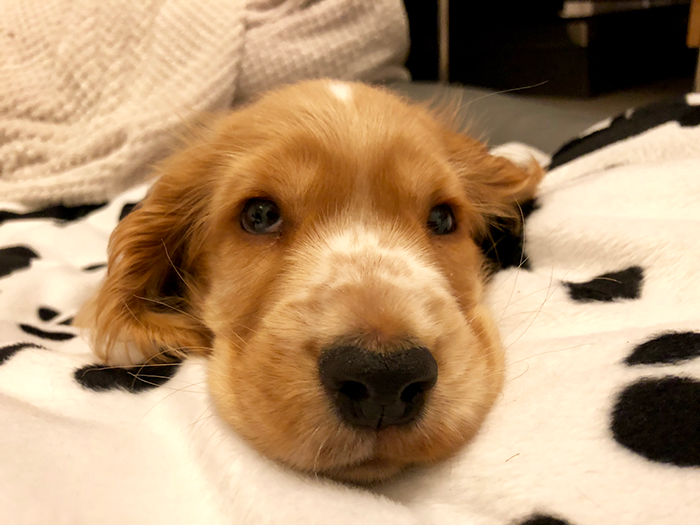

<html lang="en">

```{r setup, include=FALSE}
knitr::opts_chunk$set(
	echo = TRUE,
	message = FALSE,
	warning = FALSE
)

#necessary to render tutorial correctly
library(learnr) 
library(htmltools)
#tidyverse
library(dplyr)
library(ggplot2)
#non tidyverse
library(BayesFactor)
library(broom)
library(effectsize)
library(ggfortify)
library(Hmisc)
library(knitr)
library(modelbased)
library(parameters)
library(sandwich)

source("./www/discovr_helpers.R")


#Read data files needed for the tutorial

puppy_tib <- discovr::puppies
hero_tib <- discovr::superhero
```

```{r, eval = F, echo = F}
# Create bib file for R packages
here::here("inst/tutorials/discovr_11/packages.bib") |>
  knitr::write_bib(c('here', 'tidyverse', 'dplyr', 'readr', 'forcats', 'tibble', 'knitr', 'broom', 'effectsize', "ggfortify", 'Hmisc', 'modelbased', 'parameters', 'sandwich', 'emmeans', 'BayesFactor', 'emmeans'), file = _)
```

# discovr: Comparing several means (GLM 1)

## Overview

<div class="infobox">
  
  
  **Usage:** This tutorial accompanies [Discovering Statistics Using R and RStudio](https://www.discovr.rocks/) [@field_discovering_2023] by [Andy Field](https://en.wikipedia.org/wiki/Andy_Field_(academic)). It contains material from the book so there are some copyright considerations but I offer them under a [Creative Commons Attribution-NonCommercial-NoDerivatives 4.0 International License](http://creativecommons.org/licenses/by-nc-nd/4.0/). Tl;dr: you can use this tutorial for teaching and non-profit activities but please don't meddle with it or claim it as your own work.
  
</div>

### `r cat_space(fill = blu)` Welcome to the `discovr` space pirate academy

Hi, welcome to **discovr** space pirate academy. Well done on embarking on this brave mission to planet `r rproj()`s, which is a bit like Mars, but a less red and more hostile environment. That's right, more hostile than a planet without water. Fear not though, the fact you are here means that you *can* master `r rproj()`, and before you know it you'll be as brilliant as our pirate leader Mae Jemstone (she's the badass with the gun). I am the space cat-det, and I will pop up to offer you tips along your journey.

On your way you will face many challenges, but follow Mae's system to keep yourself on track:

* `r bmu(height = 1.5)` This icon flags materials for *teleporters*. That's what we like to call the new cat-dets, you know, the ones who have just teleported into the academy. This material is the core knowledge that everyone arriving at space academy must learn and practice. For accessibility, these sections will also be labelled with [(1)]{.alt}.
* `r user_visor(height = 1.5)` Once you have been at space pirate academy for a while, you get your own funky visor. It has various modes. My favourite is the one that allows you to see everything as a large plate of tuna. More important, sections marked for cat-dets with visors goes beyond the core material but is still important and should be studied by all cat-dets. However, try not to be disheartened if you find it difficult. For accessibility, these sections will also be labelled with [(2)]{.alt}.
* `r user_astronaut(height = 1.5)` Those almost as brilliant as Mae (because no-one is quite as brilliant as her) get their own space suits so that they can go on space pirate adventures. They get to shout *RRRRRR* really loudly too. Actually, everyone here gets to should *RRRRRR* really loudly. Try it now. Go on. It feels good. Anyway, this material is the most advanced and you can consider it optional unless you are a postgraduate cat-det. For accessibility, these sections will also be labelled with [(3)]{.alt}.

It's not just me that's here to help though, you will meet other characters along the way:

* `r alien(height = 1.5)` aliens love dropping down onto the planet and probing humanoids. Unfortunately you'll find them probing you quite a lot with little coding challenges. Helps is at hand though. 
* `r robot(height = 1.5)` **bend-R** is our coding robot. She will help you to try out bits of `r rproj()` by writing the code for you before you encounter each coding challenge.
* `r bug(height = 1.5)` we also have our friendly alien bugs that will, erm, help you to avoid bugs in your code by highlighting common mistakes that even Mae Jemstone sometimes makes (but don't tell her I said that or my tuna supply will end). 

Also, use hints and solutions to guide you through the exercises (Figure 1).

<figure>

<figcaption>Figure 1: In a code exercise click the hints button to guide you through the exercise.</figcaption>
</figure> 
 

By for now and good luck - you'll be amazing!

### Workflow

* Before attempting this tutorial it's a good idea to work through [this tutorial on how to install, set up and work within `r rproj()` and `r rstudio()`](http://milton-the-cat.rocks/learnr/r/r_getting_started/).

* The tutorials are self-contained (you practice code in code boxes). However, so you get practice at working in `r rstudio()` I strongly recommend that you create an Quarto document within an `r rstudio()` project and practice everything you do in the tutorial in the Quarto document, make notes on things that confused you or that you want to remember, and save it. Within this Quarto document you will need to load the relevant packages and data. 


### Packages

This tutorial uses the following packages:

* `BayesFactor` [@R-BayesFactor]
* `broom` [@R-broom]
* `effectsize` [@effectsize2020; @R-effectsize]
* `emmeans` [@R-emmeans] is used by `modelbased`
* `here` [@R-here]
* `ggfortify` [@R-ggfortify; @ggfortify2016]
* `Hmisc` [@R-Hmisc] is loaded by `ggplot2`
* `knitr` [@R-knitr]
* `modelbased` [@R-modelbased]
* `parameters` [@parameters2020; @R-parameters]
* `sandwich` [@R-sandwich; @sandwich2006] is automatically loaded by `parameters`

It also uses these `tidyverse` packages [@R-tidyverse; @tidyverse2019]: `dplyr` [@R-dplyr], `forcats` [@R-forcats], `ggplot2` [@wickhamGgplot2ElegantGraphics2016], and `readr` [@R-readr], `.

### Coding style

There are (broadly) two styles of coding:

1. **Verbose**: Using this style you declare the package when using a function: `package::function()`. For example, if I want to use the `mutate()` function from the package `dplyr`, I will type `dplyr::mutate()`. If you adopt verbose style, you don't need to load packages at the start of your Quarto document (although see below for some exceptions).

2. **Concise**: Using this style you load all of the packages at the start of your Quarto document using `library(package_name)`, and then refer to functions without their package. For example, if I want to use the `mutate()` function from the package `dplyr`, I will use `library(dplyr)` in my first code chunk and type the function as `mutate()` when I use it subsequently.

Coding style is a personal choice. The [Google `r rproj()` style guide](https://google.github.io/styleguide/Rguide.html) and [tidyverse style guide](https://style.tidyverse.org/) recommend a verbose style, and I use it in teaching materials for two reasons (1) it helps you to remember which functions come from which packages, and (2) it prevents clashes resulting from using functions from different packages that have the same name. However, even with this style it makes sense to load `tidyverse` because the `dplyr` and `ggplot2` packages contain functions that are often used within other functions and in these cases the verbose style is difficult to read. Also, no-one wants to write `ggplot2::` before every function from `ggplot2`.

You can use either style in this tutorial because all packages are pre-loaded. If working outside of the tutorial, load the `tidyverse` package (and any others if you're using a concise style) at the beginning of your Quarto document:

```{r eval = FALSE}
library(tidyverse)
```

### Data

To work *outside of this tutorial* you need to download the following data files:

* [puppies.csv](https://www.discovr.rocks/csv/puppies.csv)
* [superhero.csv](https://www.discovr.rocks/csv/superhero.csv)

Set up an `r rstudio()` project in the way that [I recommend in this tutorial](http://milton-the-cat.rocks/learnr/r/r_getting_started/#section-working-in-rstudio), and save the data files to the folder within your project called [data]{.alt}. Place this code in the first code chunk in your Quarto document:

```{r, eval=FALSE}
puppy_tib <- here::here("data/puppies.csv") |>
  readr::read_csv() |>
  dplyr::mutate(
    dose = forcats::as_factor(dose)
  )
```

This code reads in the data and converts the variable **dose** to a factor (categorical variable).

## `r bmu()` A puppy-tastic example [(1)]{.alt}

The main example in this tutorial is about puppies. Here's my dog, Milton, when he was a puppy:


<figure>

<figcaption>Figure 2: Milton the crazy spaniel as a pup.</figcaption>
</figure> 

If that doesn't make you feel better about this tutorial then nothing will because lots of people believe that puppy therapy is good for stress, and that's what this example is all about. Puppy therapy is a form of animal-assisted therapy, in which puppy contact is introduced into the therapeutic process. Despite a common belief that puppy therapy is effective in reducing stress, the evidence base is pretty mixed.
Imagine we ran a study in which we randomized people into three groups: (1) a control group in which people had no puppy contact; (2) 15 minutes of puppy therapy (a low-dose group); and (3) 30 minutes of puppy contact (a high-dose group). The dependent variable was a measure of happiness ranging from 0 (as unhappy as I can possibly imagine being) to 10 (as happy as I can possibly imagine being).

The design of this study mimics a very simple randomized controlled trial (as used in pharmacological, medical and psychological intervention trials) because people are randomized into a control group or groups containing the active intervention (in this case puppies, but in other cases a drug or a surgical procedure). We'd predict that any form of puppy therapy should be better than the control (i.e. higher happiness scores) but also formulate a dose-response hypothesis that as exposure time increases (from 0 minutes to 15 and 30) happiness will increase too.

#### `r alien()` Alien coding challenge

View the data in [puppy_tib]{.alt}.

```{r puppy_tib, exercise = TRUE, exercise.lines = 2}

```

```{r puppy_tib-solution}
puppy_tib
```

Note that there are three variables: the participant's **id**, which is a character variable (note the [<chr>]{.alt} under the name), the **dose** of puppy therapy, which is a factor (note the [<fct>]{.alt} under the name), and the happiness score which is numeric and has the data type 'double' (note the [<dbl>]{.alt} under the name).

```{r dbl_quiz, echo = F}
question("Numeric values in R can be `integer` or `double`, what is the difference?",
         answer("Integers are whole numbers and doubles are values with decimal places.",  correct = TRUE, message = "Well done, this answer is correct."),
         answer("Integers have decimal places and doubles are whole numbers.", message = "Unlucky, have another try."),
         answer("Doubles are divisible by 2, integers are not.", message = "Unlucky, have another try."),
         answer("Doubles can be doubled to create a whole number, integers can not.", message = "Unlucky, have another try."),
         allow_retry = TRUE,
         random_answer_order = TRUE
)
```

The variable **dose** is a factor (categorical variable), so having read the data file and converted it to a factor it's a good idea to check that the levels of **dose** are in the order that we want: Control, 15 minutes, 30 minutes.

#### `r robot()` Code example

To check the levels of a factor we use the `levels()` function. For example, to check the levels of the variable **dose** within the tibble [puppy_tib]{.alt} we'd execute

```{r chk_levels, exercise = TRUE, exercise.lines = 2}
levels(puppy_tib$dose)
```

Because I have set up the data within this tutorial you should see that the levels are listed in the order that we want them when you execute the code. If they were in the wrong order, we could use `fct_relevel` to change the order:

```{r}
puppy_tib <- puppy_tib |>
  dplyr::mutate(
    dose = forcats::fct_relevel(dose, "No puppies", "15 mins", "30 mins")
  )
```

## `r bmu()` The model [(1)]{.alt}

We can include categorical predictors using dummy coding (there are other forms of coding too, we'll look at one of those later, contrast coding, later).

```{r dummy_tbl, echo = FALSE, results = 'asis'}
dummy_tbl <- tibble(
  `Group` = c("No puppies (control)", "15 minutes", "30 minutes"),
  `Dummy 1 (long)` = c(0, 0, 1),
  `Dummy 2 (short)` = c(0, 1, 0)
  )

knitr::kable(dummy_tbl, caption = "Table 1: Dummy coding for the three-group experimental design")
```

Table 1 shows dummy coding for this example. Every person has their group membership coded by a unique combination of 0s and 1s across the two dummy variables. Someone in the no puppy condition would have a 0 for both dummy variables, someone who had 15 minutes of therapy would have a 0 on the dummy variable labelled **long** and a 1 on the dummy variable labelled **short**, and someone who received 30-minutes of puppy therapy would have a 1 on the dummy variable labelled **long** and a 0 on the dummy variable labelled **short**. The two dummy variables represent the length of the dose of puppy therapy: one compares the 30-minute dose against no puppies (**long**) and the other compares the 15-minute does against no puppies (**short**). 

As revision from the chapter, the model we're fitting is:

$$
\text{happiness}_i = \hat{b}_0 + \hat{b}_1\text{long}_i+ \hat{b}_2\text{short}_i + e_i
$$
in which a persons happiness is predicted from knowing their group code (i.e., the numeric code for the long and short dummy variables in Table 1) and the estimates of the parameters for these effects and the intercept ($b_0$).

## `r bmu()` Exploring the data [(1)]{.alt}

#### `r alien()` Alien coding challenge

Use what you already know to create a violin plot with error bars with **dose** on the *x*-axis and **happiness** scores on the *y*-axis.

```{r pup_viol, exercise = TRUE, exercise.lines = 6}

```

```{r pup_viol-hint-1}
# Start by initializing the plot replace the placeholders with the name of the tibble and variable names):
ggplot2::ggplot(tibble_name, aes(var_for_x_axis, var_for_y_axis))
# Now add the violin geom
```

```{r pup_viol-hint-2}
# Add the violin geom:
ggplot2::ggplot(puppy_tib, aes(dose, happiness)) + 
  geom_violin()
# Use stat_summary() to add the error bars
```

```{r pup_viol-hint-3}
# Use stat_summary() to add the error bars (it's fine to use mean_cl_normal):
ggplot2::ggplot(puppy_tib, aes(dose, happiness)) + 
  geom_violin() +
  stat_summary(fun.data = "mean_cl_boot")
# Add axis labels, then sensible breaks for the y-axis and, finally, a minimal theme
```

```{r pup_viol-hint-4}
# Solution
ggplot2::ggplot(puppy_tib, aes(dose, happiness)) + 
  geom_violin() +
  stat_summary(fun.data = "mean_cl_boot") +
  labs(x = "Dose of puppies", y = "Happiness (0-10)") +
  scale_y_continuous(breaks = 1:7) +
  theme_minimal()
```

#### `r alien()` Alien coding challenge

Use what you already know to compute the mean and a 95% confidence interval of happiness scores split by the therapy group to which a person belonged.

```{r pup_sum, exercise = TRUE, exercise.lines = 7}

```

```{r pup_sum-hint-1}
# Start by piping the tibble into the group_by function to group output by dose:
puppy_tib |> 
  dplyr::group_by(dose)
# Now pipe the results into the summarize() function
```

```{r pup_sum-hint-2}
# Pipe the results into the summarize() function
puppy_tib |> 
  dplyr::group_by(dose) |> 
  dplyr::summarize()
# Within summarize(), use the mean() function to create a variable that is the mean happiness score
```

```{r pup_sum-hint-3}
# Use the mean() function to create a variable that is the mean happiness score:
puppy_tib |> 
  dplyr::group_by(dose) |> 
  dplyr::summarize(
    mean = mean(happiness, na.rm = TRUE)
  )
# Add two more rows that use mean_cl_normal to calculate the lower and upper boundary of the 95% confidence interval
```

```{r pup_sum-hint-4}
# Solution
puppy_tib |> 
  dplyr::group_by(dose) |> 
  dplyr::summarize(
    mean = mean(happiness, na.rm = TRUE),
    `95% CI lower` = mean_cl_normal(happiness)$ymin,
    `95% CI upper` = mean_cl_normal(happiness)$ymax
  ) |> 
  knitr::kable(digits = 3) # to round values
```

```{r quiz_ci_ex1, echo = FALSE}
quiz(caption = "Confidence interval quiz (level 3)",
     question("Using the confidence intervals for the mean of each group, what can you conclude about the group means?",
    answer("The 30-minute and control group means will be different at close to *p* = 0.05.", correct = T, message = "It's hard to tell precisely, but the 95% confidence intervals for the 30-minute and control group overlap by about 1/4 of their length implying a significant difference at around *p* = 0.05. It will be very close to this value, but you can't really call from the graph whether it will fall just below or just above."),
    answer("None of the group means will be significantly different at *p* < 0.05 because all of their confidence intervals overlap.", message = "Close. People often use the rule of thumb that non-overlapping confidence intervals equate to significant differences at *p* < 0.05, but in fact lack of overlap implies significance at *p* < 0.01. Confidence intervals can overlap up to about 1/4 of their length (it's a bit more complex than this, but ...) and reflect significant differences at *p* < 0.05."),
    answer("Give me a clue", message = "Think about the overlap of the confidence intervals on the graph (read the section on MOEs, confidence intervals and significance)."),
    correct = "Correct - well done!",
    random_answer_order = TRUE,
    allow_retry = T
    )
)
```

## `r bmu()` Fit the model [(1)]{.alt}

### `r bmu()` Dummy coding in `r rproj()` [(1)]{.alt} 

`r rproj()` automatically dummy codes categorical predictors. If the categorical predictor is a factor, then it uses the first level of the variable as its reference category. For the variable **dose** (which is a factor) the levels are ordered [No puppies]{.alt}, [15 minutes]{.alt} and [30 minutes]{.alt}. As such, dummy variable 1 will represent the no puppies group vs. the 15-minute group. `r rproj()` will label this variable as **dose15 mins**, which tells us that this dummy variable represents the part of **dose** that compares the 15-minute group to the no puppies group. Dummy variable 2 will represent the no puppies group vs. the 30-minute group. `r rproj()` will label this variable as **dose30 mins**, which tells us that this dummy variable represents the part of **dose** that compares the 30-minute group to the no puppies group.

For these data, these default comparisons make sense (we compare everything to the no puppies group) but there will be times when the default creation of dummy variables and the order of your factor levels groups do not combine to make the comparisons that you want. You may need to change the order of factor levels, or specify bespoke contrasts (see later).

<div class="tip">
  `r cat_space()` **Tip: Character variables**
  
  You can use character variables (rather than factors) as predictors in linear models and `r rproj()` will try to do something sensible with them. Specifically, it orders the categories alphabetically and creates dummy variables using the first category as the reference category. However, it's good practice to convert character variables to factors yourself and specify the order of levels so that you are in control of what goes into the model.
</div>

### `r bmu()` Using `lm()` [(1)]{.alt}

To fit the model we use the `lm()` function, because we are fitting a linear model with a categorical predictor. We've used this function before, just to recap it takes the following general form (I've retained only the key options):

```{r, eval = FALSE}
lm(outcome ~ predictor(s), data, subset, na.action = na.fail)
```

Based on previous tutorials we could do the following 4 steps:

1. Create a model called [puppy_lm]{.alt} using `lm()`
2. Summarize the fit of the model using `broom::glance()`
3. Obtain the model parameters and confidence intervals using `broom::tidy()`
4. Plot diagnostics using `plot()`

This is, basically, what we do except that when we're using the linear model to compare means, we often want an overall test of each predictor. We don't get this with `broom::glance()` (we get only the overall fit). Instead we can use the `anova()` function to get overall effects of the model and then pipe this into `parameters::parameters()` to get an effect size ($\omega^2$) for each predictor.

#### `r robot()` Code example

To get overall (*omnibus*) tests of categorical predictors we can use the following general code:

```{r, eval = F}
anova(my_model) |> 
  parameters::parameters(omega_squared = "raw")
```

In which we replace [my_model]{.alt} with the name of a model created using `lm()`. By default we will get the overall effect size ($\omega^2$), but we will see in future tutorials that you can instead get a version of this effect size that adjusts for other predictors known as partial $\omega^2$, by changing [omega_squared = "raw"]{.alt} to [omega_squared = "partial"]{.alt}.

#### `r alien()` Alien coding challenge

Using the sample code and what you have already learnt, use the code box below to:

* Create a model called [puppy_lm]{.alt} using `lm()` that predicts **happiness** from **dose**.
* Summarize the overall fit of predictors by adapting the sample code
* Obtain the model parameters and confidence intervals using `tidy()`

```{r lm1, exercise = TRUE}
     
               
```

```{r lm1-hint-1}
# Create a model called puppy_lm using lm:
puppy_lm <- lm(xxx ~ xxx, data = xxxx)
```

```{r lm1-hint-2}
# Create a model called puppy_lm using lm:
puppy_lm <- lm(happiness ~ dose, data = puppy_tib)
# Now adapt the sample code to get the summary of the model
```

```{r lm1-hint-3}
# Adapt the sample code to get the summary of the model
anova(puppy_lm) |> 
  parameters::parameters(omega_squared = "raw")
# Obtain the model parameters and confidence intervals using `tidy()`
```

```{r lm1-hint-4}
# Solution
puppy_lm <- lm(happiness ~ dose, data = puppy_tib, na.action = na.exclude)

anova(puppy_lm) |> 
  parameters::parameters(omega_squared = "raw") |> 
  knitr::kable(digits = 3) # to round values

broom::tidy(puppy_lm, conf.int = TRUE) |> 
  knitr::kable(digits = 3) # to round values
```

```{r quiz_lm_ex1, echo = FALSE}
quiz(caption = "Interpretting the linear model quiz (level 2)",
  question("How would you interpret the *F*-statistic?",
    answer("Overall happiness can be significantly predicted from the dummy variables representing the group means. This implies that the group means are significantly different.", correct = T, message = "Because the value of *p* is 0.025, which is less than the criterion of 0.05, we know that using the group means helps us to predict happiness. In other words the group means are significantly different."),
    answer("Overall happiness could not be significantly predicted from the dummy variables representing the group means. This implies that the group means are not significantly different.", message = "The *p*-value for the effect is less than 0.05, which would typically be interpreted as *significant*"),
    answer("I'm really bored, can you tell me a joke involving dogs and statistics?", message = "After a talking sheepdog gets all the sheep in the pen, she reports back to the farmer: “All 40 accounted for,” she says. “But there are only 36 sheep in the pen,” the farmer replies. “I know,” says the sheepdog. “I rounded them up.”"),
    answer("Give me a clue", message = "Look at the value in the column labelled *p*"),
    correct = "Correct - well done!",
    incorrect = "Good try.",
    random_answer_order = TRUE,
    allow_retry = T
    ),
  question("What does the *F*-statistic represent?",
    answer("It is the ratio of the variance in happiness explained by the model to the variance that is unexplained (the error).", correct = T),
    answer("It is the proportion of variance in happiness explained by the model.", message = sprintf("This describes the $R^2$ statistic.")),
    answer("It is the proportion of variance in happiness that is not explained by the model."),
    answer("It is the total variance in happiness explained by the model.", message = "This describes the model sum of squares."),
    correct = "Correct - well done!",
    incorrect = "Good try.",
    random_answer_order = TRUE,
    allow_retry = T
    ),
  question("How would you interpret the parameter estimates?",
    answer("Happiness scores were significantly different between the 30-minute group and the control group but not between the 15-minute group and the control group.", correct = T, message = "Because the value of *p* is 0.008 for the dummy variable called *dose30 mins*, which is less than the criterion of 0.05, we know that the difference between the means of the 30-minute group and the control group is significantly different. However, becasue the value of *p* is 0.282 for the dummy variable called *dose15 mins*, which is greater than the criterion of 0.05, we know that the difference between the means of the 15-minute group and the control group was not significantly different."),
    answer("Happiness scores were not significantly different between the 30-minute group and the control group and also not between the 15-minute group and the control group.", message = "The interpretation for the 30-minute group is incorrect."),
    answer("Happiness scores were significantly different between both the 30-minute group and the control group and the 15-minute group and the control group.", message = "The interpretation for the 15-minute group is incorrect."),
    answer("Happiness scores were not significantly different between both the 30-minute group and the control group but were between the 15-minute group and the control group.", message = "The interpretation for both dummy variables is incorrect."),
    answer("Happiness scores were not significantly different between the 30-minute group and the 15-minute group.", message = "There's no information in the table that relates to this group comparison."),
    answer("Give me a clue", message = "Look at the value in the column labelled *p.value* for the rows listing the dummy variables. Remember that each dummy variable compares each group to the no puppies group. The name of the dummy variable tells you which group is being compared to the no puppy group."),
    correct = "Correct - well done!",
    incorrect = "Good try.",
    random_answer_order = TRUE,
    allow_retry = T
    )
)
```

```{r, echo = F}
pup_sum <- puppy_tib |> 
  dplyr::group_by(dose) |> 
  dplyr::summarize(
    mean = mean(happiness, na.rm = TRUE) |> 
      sprintf(fmt = "%.2f")
  ) 

puppy_lm <- lm(happiness ~ dose, data = puppy_tib, na.action = na.exclude)
pup_aov <- anova(puppy_lm)

pup_par <- broom::tidy(puppy_lm, conf.int = TRUE) |> 
  dplyr::rename(
    p = p.value
  )
```

The test of whether the group means are the same is represented by the *F*-statistic for the effect of **dose**, which is significant, `r report_aovf(pup_aov)`. Given that our model represents the group means, this *F* tells us that using group means to predict happiness scores is significantly better than using the mean of all scores: in other words, the group means are significantly different

Moving onto the parameter estimates, $\hat{b}_0$ (the value in the column labelled [estimate]{.alt} and the row labelled [(intercept)]{.alt}) is equal to the mean of the baseline category (the no puppies group), $\hat{b}_0$ = `r get_par(pup_par, row = 1)` (check your earlier summary statistics!). The *b*-value for the first dummy variable (labelled [dose15 mins]{.alt}) is equal to the difference between the means of the 15-minute group and the control group (`r pup_sum$mean[2]` $−$ `r pup_sum$mean[1]` = `r get_par(pup_par, row = 2)`).

The *b*-value for the second dummy variable (labelled [dose30 mins]{.alt}) is equal to the difference between the means of the 30-minute group and the control group (`r pup_sum$mean[3]` $−$ `r pup_sum$mean[1]` = `r get_par(pup_par, row = 3)`). These values demonstrate how dummy coding partitions the variance in happiness scores to compare specific group means. We can see from the significance values of the associated *t*-tests that the difference between the 30-minute group and the control group is significant because *p* = `r sprintf("%.3f", pup_par$p[3])`, which is less than 0.05; however, the difference between the 15-minute and the control group is not (*p* = `r sprintf("%.3f", pup_par$p[2])`).

<div class="reportbox">
  `r pencil()` **Report**`r rproj()`

Overall, happiness was significantly different across the three therapy groups, `r report_aovf(pup_aov)`. Happiness was significantly different to zero in the no puppies group, $\hat{b}$ = `r report_pars(pup_par, row = 1)`, was not significantly higher in the 15-minute therapy group compared to the no puppy control, $\hat{b}$ = `r report_pars(pup_par, row = 2)`, but was significantly higher the 15-minute therapy group compared to the no puppy control, $\hat{b}$ = `r report_pars(pup_par, row = 3)`. A 30-minutes dose of puppies, therefore, appears to improve happiness compared to no puppies but a 15-minutes does does not.
</div>


### `r bmu()` Diagnostic plots [(1)]{.alt}

As with any linear model, we can use the `plot()` function to produce diagnostic plots from the model. We have used this function in previous tutorials. Remember that it takes this general form:

```{r eval = FALSE}
plot(my_model, which = numbers_of_the_plots_you_want)
```

You place the name of your model into the function and use [which]{.alt} to request specific plots. We use plots 1 and 3 to explore linearity and homoscedasticity, plot 2 is a Q-Q plot to look for normality in residuals, and plot 4 shows each case's Cook's distance so is useful for identifying influential cases. Therefore, a reasonable set of plots is to look at plots 1, 3, 2, and 4 from the `plot()` function.

#### `r alien()` Alien coding challenge

Obtain plots 1, 3, 2 and 4 (in that order) for the model [puppy_lm]{.alt}.

```{r puppy_lm_setup}
puppy_lm <- lm(happiness ~ dose, data = puppy_tib, na.action = na.exclude)
```

```{r pup_zpred_resid, exercise = TRUE, exercise.lines = 2, exercise.setup = "puppy_lm_setup"}

```

```{r pup_zpred_resid-solution}
plot(puppy_lm, which = c(1, 3, 2, 4))

# or to get  a nicely formatted plots
# library(ggfortify)  # outside of this tutorial you'll need this

ggplot2::autoplot(puppy_lm,
                  which = c(1, 3, 2, 4),
                  colour = "#5c97bf",
                  smooth.colour = "#ef4836",
                  alpha = 0.5,
                  size = 1) + 
  theme_minimal()
```

```{r quiz_zresid_ex1, echo = FALSE}
quiz(caption = "Diagnostic plot quiz (level 2)",
  question("How would you interpret the *Residual vs. fitted* and *Scale-location* plots?",
    answer("I can't see any problems", correct = TRUE, message = "The red lines are flat and the columns are equal length suggesting homoscedasticity."),
    answer("I'm not sure, I'm not used to seeing columns of dots on these plots and it's making me think something has gone badly wrong.", message = "Remember that the model consists of three groups, and the predicted values from the model are the three group means. That's why there are columns - because there are only three possible predicted values. What you're looking for is whether the columns of ots are about the same length."),
    answer("I can see a violation of homoscedasticity", message = "Heteroscedasticity would be shown up by a red line that isn't flat and columns of dots that are different lengths."),
    correct = "Correct - well done!",
    random_answer_order = TRUE,
    allow_retry = T
  ),
  question("Based on the Q-Q plot, can we assume normality of the residuals?",
    answer("Yes", message = "The dots on the Q-Q plot seem to deviate from the line at the extremes, which indicates a non-normal distribution."),
    answer("No", correct = TRUE),
    answer("Maybe", message = "Sorry, you're not allowed to sit on the fence!"),
    correct = "Correct - Well done!",
    random_answer_order = TRUE,
    allow_retry = T
  ),
  question("Based on the plot of Cook's distance, are there any influential cases?",
    answer("Yes", message = "The largest Cook's distance needs to be above about 1 before we'd worry."),
    answer("No", correct = TRUE),
    answer("Maybe", message = "Sorry, you're not allowed to sit on the fence!"),
    correct = "Correct - The largest Cook's distance is about 0.2 which is well below the threshold of 1 at which we'd worry. well done!",
    random_answer_order = TRUE,
    allow_retry = T
  )
)
```

The *Residual vs. fitted* and *Scale-location* plots show points that are equally spread for the three groups, which implies that residual variances are similar across groups. The dots look odd because they are aligned in columns, but this reflects the fact there are only 3 possible values of the predictor variable (no puppies, 15 minutes and 30 minutes). The Q-Q plot tells us about the normality of residuals in the model. We want our residuals to be normally distributed which means that the dots on the graph should cling lovingly to the diagonal line. Ours look like they have had a bit of an argument with the diagonal line, which suggests that we may not be able to assume normality of errors and should perhaps use a robust model (which will be explained sooner than you might like). The plot of Cooks distances shows that they are all well below 1, so no influential cases to worry about.

## `r user_visor()` Contrast coding [(2)]{.alt}

You might be quite bored by now. At the beginning I tried to motivate you with a photo of my dog, Milton. I don't know whether it worked, but I'm going to ramp up the cute factor with a video of the first time I met Milton because you can never have too many puppies.


Now were all in a state of peaceful, inner, puppy calm and tranquillity, let's destroy it with contrast coding.

Remember that we predicted that any form of puppy therapy should be better (i.e. higher happiness scores) than the no puppies condition and that as exposure time increases happiness will increase too (a dose-response hypothesis). In the chapter we discovered that we can operationalize these hypotheses as two dummy variables using the contrast coding in Table 2.

```{r con_tbl, echo = FALSE, results = 'asis'}
con_tbl <- tibble(
  `Group` = c("No puppies (control)", "15 minutes", "30 minutes"),
  `Dummy 1 (No puppies vs. puppies)` = c("-2/3", "1/3", "1/3"),
  `Dummy 2 (15 mins vs 30 mins)` = c("0", "-1/2", "1/2")
  )

knitr::kable(con_tbl, caption = "Table 2: Contrast coding for the puppy example")
```

As revision from the chapter, when using this coding scheme the model we're fitting is:

$$
\text{happiness}_i = \hat{b}_0 + \hat{b}_1\text{contrast 1}_i+ \hat{b}_2\text{contrast 2}_i + e_i
$$
In which the variables **contrast 1** and **contrast 2** are the dummy variables that represents the no puppies group compared to all other groups (**contrast 1**), and the difference between the 15-minute group and the 30-minute group (**contrast 2**).

```{r quiz_codes_ex1, echo = FALSE}
quiz(caption = "Contrast coding quiz (level 2)",
  question("Imagine that we believed that puppy therapy was only effective after 20 minues. We, therefore, wanted to compare the 30-minute group to all other groups in the first contrast, and compare the no puppies to the 15-minute group in the second. What contrast codes would make these comparisons?",
    answer("Contrast 1: control (-1/3), 15-mins (-1/3), 30-mins (2/3); Contrast 2: control (1/2), 15-mins (-1/2), 30-mins (0)", correct = T),
    answer("Contrast 1: control (2/3), 15-mins (-1/3), 30-mins (-1/3); Contrast 2: control (0), 15-mins (-1/2), 30-mins (1/2)", message = "These codes make the same comparisons as in the main example."),
    answer("Contrast 1: control (-1/3), 15-mins (-1/3), 30-mins (1/3); Contrast 2: control (-1/2), 15-mins (1/2), 30-mins (0)", message = "The second contrast would work, but the first has weights that do not sum to zero."),
    answer("Contrast 1: control (1/3), 15-mins (-2/3), 30-mins (1/3); Contrast 2: control (-1/3), 15-mins (-1/3), 30-mins (3)", message = "The first contrast here compares 15-minutes to both other groups, the second has weights that don't sum to zero"),
    correct = "Correct - well done!",
    incorrect = "Good try.",
    random_answer_order = TRUE,
    allow_retry = T
    ),
  question("Which of the following contrast codes would also make the same comparisons as in the main example?",
    answer("Contrast 1: control (2), 15-mins (-1), 30-mins (-1); Contrast 2: control (0), 15-mins (-1), 30-mins (1)", correct = T),
    answer("Contrast 1: control (1), 15-mins (-1), 30-mins (-1); Contrast 2: control (0), 15-mins (1), 30-mins (-1)", message = "The second contrast would work, but the first has weights that do not sum to zero."),
    answer("Contrast 1: control (-2), 15-mins (-2), 30-mins (4); Contrast 2: control (2), 15-mins (-2), 30-mins (0)", message = "These codes compare the 30-minute group to all other groups in the first contrast, and compare the control to the 15-minute group in the second"),
    answer("Contrast 1: control (1/3), 15-mins (-2/3), 30-mins (1/3); Contrast 2: control (0), 15-mins (-1/2), 30-mins (1)", message = "The first contrast here compares 15-minutes to both other groups, the second has weights that don't sum to zero"),
    correct = "Correct - well done!",
    incorrect = "Good try.",
    random_answer_order = TRUE,
    allow_retry = T
    )
)
```

#### `r robot()` Code example

Use the `contrast()` function to set the contrast attribute of a variable. It takes the general form:

```{r, eval = F}
contrasts(predictor_variable) <- contrast_instructions
```

The [contrast_instructions]{.alt} can be a set of weights for the contrasts that you want to do, or a built in contrast. To set the contrasts in Table 2, we need to tell `r rproj()` what weights to assign to each group. The weights we want to assign for contrast 1 are $−2/3$ (no puppies), $1/3$ (15-minute group) and $1/3$ (30-minute group). We can collect these values into an object in the usual way. Lets call the object [puppy_vs_none]{.alt} to remind us what it represents:

```{r, eval = F}
puppy_vs_none <- c(-2/3, 1/3, 1/3)
```

The object  [puppy_vs_none]{.alt} indicates that the first group has a weight of $-2/3$, and the second and third groups a weight of $1/3$. The order of the numbers is important because it corresponds to the order of the factor levels for the predictor variable. In the puppy data, remember that the order of levels of **dose** is no puppies, 15-minutes and 30-minutes.  As such, [puppy_vs_none]{.alt} contains the weights for no puppies, 15-minutes and 30-minutes, in that order.

We can do the same for the second contrast. We know from Table 2 that the weights for contrast 2 are: 0 (no puppies), −1/2 (15-minute group) and 1/2 (30-minute group). Remembering that the first weight we enter will be for the no puppies group, we enter the value 0 as the first weight, then $-1/2$ for the 15-minute group and finally $1/2$ for the 30-minute group. Lets call this object [short_vs_long]{.alt} to remind us that it compares the means of the shorter puppy therapy session against the mean of the longer one:
```{r, eval = F}
short_vs_long <- c(0, -1/2, 1/2)
```

Having created these variables we need to bind them together as columns using `cbind()`, and set them as the contrast attached to our predictor variable, **dose**:

```{r, eval = F}
contrasts(puppy_tib$dose) <- cbind(puppy_vs_none, short_vs_long)
```

This command sets the contrast property of **dose** to contain the weights for the two contrasts that we just created. To make sure we've done everything correctly we can check the contrasts for dose variable by executing:

```{r, eval = F}
contrasts(puppy_tib$dose)
```

The weights have been converted to decimals, but you can see that they are set up as they should be (it might help to look back at Table 2).

#### `r alien()` Alien coding challenge

Use the code from the example to set the contrasts in Table 2 for **dose**.

```{r set_contrast, exercise = TRUE}
     
               
```

```{r set_contrast-hint-1}
# Set the weights for the first contrast using the example code:
puppy_vs_none <- c(-2/3, 1/3, 1/3)
# Now set the weights for the second contrast
```

```{r set_contrast-hint-2}
# Set the weights for the second contrast:
short_vs_long <- c(0, -1/2, 1/2)
# Next, set the two contrasts to the dose variable
```

```{r set_contrast-hint-3}
# Set the two contrasts to the dose variable:
contrasts(puppy_tib$dose) <- cbind(puppy_vs_none, short_vs_long)
# Finally, view the weights to check they are set correctly
```

```{r set_contrast-hint-4}
# Put it all together:
puppy_vs_none <- c(-2/3, 1/3, 1/3)
short_vs_long <- c(0, -1/2, 1/2)
contrasts(puppy_tib$dose) <- cbind(puppy_vs_none, short_vs_long)
contrasts(puppy_tib$dose) # This line prints the contrast weights so we can check them
```

<div class="infobox">
  `r info()` **Tip: Built in contrasts**
  
  `r rproj()` has several functions for setting built-in contrasts. In each case [n]{.alt} is the number of factor levels/group. For the puppy data $n = 3$.

* `contr.treatment(n, base = x)`: Each category is compared to a user-defined baseline category, [x]{.alt}. For the puppy example, to compare each group to the 30-minute group we'd use

```{r, eval = F, class.source = '.panel_alt'}
contr.treatment(3, base = 3)
```
* `contr.SAS(n)`:	Each category is compared to the last category.
* `contr.helmert(n)`	Each category (except the first) is compared to the mean effect of all previous categories. For the puppy data this would give give us a first contrast that compares the second category (15-minutes) to the previous category (no puppies), and a second contrast that compares the third category (30-minutes) to the combined effect of 15-minutes and no puppies (the previous categories).

You set these contrasts in the usual way. For example, to set a Helmert contrast for **dose** we'd execute:

```{r, eval = F, class.source = '.panel_alt'}
contrasts(puppy_tib$dose) <- contr.helmert(3)
```
</div>


#### `r alien()` Alien coding challenge

Having set the contrasts for **dose** we can fit the model using *exactly* the same code as before. Do this in the code box.

<div class="tip">
  `r cat_space()` **Tip: rounding values in tables**

Remember that you can round numeric values in tables by piping the table into `kable()`. For example, if we want to round the numbers in the object created by `broom::tidy(puppy_lm, conf.int = TRUE)` to three decimal places, we could use:

```{r eval = FALSE, class.source = '.panel_alt'}
broom::tidy(puppy_lm, conf.int = TRUE) |> 
  knitr::kable(digits = 3)
```

</div>

```{r set_dose_contrast}
puppy_vs_none <- c(-2/3, 1/3, 1/3)
short_vs_long <- c(0, -1/2, 1/2)
contrasts(puppy_tib$dose) <- cbind(puppy_vs_none, short_vs_long)
```

```{r lm_cc, exercise = TRUE, exercise.lines = 6, exercise.setup = "set_dose_contrast"}

```

```{r lm_cc-solution}
puppy_lm <- lm(happiness ~ dose, data = puppy_tib)

anova(puppy_lm) |> 
  parameters::parameters(omega_squared = "raw") |> 
  knitr::kable(digits = 3)

broom::tidy(puppy_lm, conf.int = TRUE) |> 
  knitr::kable(digits = 3)
```

```{r quiz_contrast_codes, echo = FALSE}
quiz(caption = "Interpreting planned contrasts",
  question("The values in the first table (the one with the *F*-statistic that was obtaine dusing `anova()`) are identical to when we used different coding for the dummy variables in the last tutorial. Why is that?",
    answer("The *F*-statistic measures the overall fit of the model (i.e. overall, can we predict happiness from group means better than we can from the overall mean) and how we paramaterize those means doesn't affect the overall fit.", correct = T),
    answer("The *F*-statistic is stable across samples"),
    answer("Because the dummy variables are independent both in this tutorial and the previous ones", message = "The contrast codes are independent, but the dummy variables created using dummy coding (earlier analysis) were not independent, so this answer is incorrect."),
    answer("Because the Hessian decomposition of the orthonormalized hyper-parameter matrix has non-spatial eigen-trumpets", message = "This is random shit that I wrote to sound impressive. Apart from the trumpet bit, I just thought an eigen-trumpet sounded funny. Yeah, I'm weird like that."),
    correct = "Correct - well done!",
    incorrect = "Good try.",
    random_answer_order = TRUE,
    allow_retry = T
    ),
  question("How would you interpret the table of parameter estimates?",
    answer("Happiness scores were significantly different between the control group and the combined group of everyone who had any dose of puppy therapy but not between the 15-minute group and the 30-minute group.", correct = T, message = "Because the value in **p.value** is 0.029 for the first dummy variable, which is less than the criterion of 0.05, we know that the difference between the means of the control group is significantly different to the mean of the 15- and 30-minute groups combined. However, becasue the value in **p.value** is 0.065 for the second dummy variable, which is greater than the criterion of 0.05, we know that the difference between the means of the 15-minute group and the 30-minute group was not significantly different."),
    answer("Happiness scores were significantly different between the 30-minute group and the control group and also not between the 15-minute group and the control group.", message = "There's no information in the table that compares the 30-minute and control group."),
    answer("Happiness scores were significantly different between both control group and the combined group of everyone who had any dose of puppy therapy and the 15-minute group and the 30-minute group.", message = "The means of the 15-minute and 30-minute groups are not significantly different."),
    answer("Happiness scores were not significantly different between both control group and the combined group of everyone who had any dose of puppy therapy and the 15-minute group and the 30-minute group.", message = "The interpretation for the first dummy variables is incorrect."),
    correct = "Correct - well done!",
    incorrect = "Good try.",
    random_answer_order = TRUE,
    allow_retry = T
    )
)
```

```{r, echo = F}
puppy_vs_none <- c(-2/3, 1/3, 1/3)
short_vs_long <- c(0, -1/2, 1/2)
contrasts(puppy_tib$dose) <- cbind(puppy_vs_none, short_vs_long)

con_lm <- lm(happiness ~ dose, data = puppy_tib, na.action = na.exclude)
con_aov <- anova(con_lm)

con_par <- broom::tidy(con_lm, conf.int = TRUE)
```


The first table has the test of whether the group means are the same represented by the *F*-statistic for the effect of **dose**. This table is identical to when we fitted the model using dummy coding. That's because, overall, the model hasn't changed (we're still predicting happiness from the 3 group means), it's only how we decompose the effect of **dose** that has changed.

The table of parameter estimates is different to before. Notice that the contrasts are helpfully labelled because we named them when we set them up. The first contrast compares the combined puppy therapy groups to the no puppies control. The difference in the mean happiness for anyone having any duration of puppy therapy compared to those having no puppy therapy was `r sprintf("%.2f", con_par$estimate[2])`, and if we assume this sample is one of the 95% that yields confidence intervals containing the population values then this difference could be anything between `r sprintf("%.2f", con_par$conf.low[2])` (a fairly small difference given happiness was measured on a 10-point scale) and `r sprintf("%.2f", con_par$conf.high[2])` (a fairly large shift along the 10-point scale). The observed difference of `r sprintf("%.2f", con_par$estimate[2])` is statistically significantly different from 0 as shown by the *t*-test, which has a *p* = `r sprintf("%.3f", con_par$p.value[2])`. This contrast suggests that happiness was significantly higher in those exposed to puppies, than those who were not.

The second contrast shows that the mean happiness across the people having 30-minutes of puppy therapy was `r sprintf("%.2f", con_par$estimate[3])` higher than those having 15 minutes. Again, if we assume this sample is one of the 95% that yields confidence intervals containing the population values then this difference could be anything between `r sprintf("%.2f", con_par$conf.low[3])` (people who have 30 minutes of puppy therapy are less happy than those having 15 minutes) and `r sprintf("%.2f", con_par$conf.high[3])` (people having 30 minutes of puppy therapy are a fair bit happier than those having 15 minutes). The observed difference of `r sprintf("%.2f", con_par$estimate[3])` is not statistically significantly different from 0 as shown by the *t*-test, which has a *p* = `r sprintf("%.3f", con_par$p.value[3])`. This contrast suggests that happiness was statistically comparable in those receiving 15- and 30-minutes of puppy therapy.

<div class="reportbox">
  `r pencil()` **Report**`r rproj()`

Overall, happiness was significantly different across the three therapy groups, `r report_aovf(con_aov)`. Happiness was significantly different to zero in the no puppies group, $\hat{b}$ = `r report_pars(con_par, row = 1)`. Happiness was significantly higher for those that had any puppy therapy compared to the no puppy control, $\hat{b}$ = `r report_pars(con_par, row = 2)`, but was not significantly different in the 30-minute therapy group compared to the 15-minute group, $\hat{b}$ = `r report_pars(con_par, row = 3)`. A dose of puppies, therefore, appears to improve happiness compared to no puppies but the duration of therapy did not have a significant impact.
</div>


## `r user_visor()` Trend analysis (polynomial contrasts) [(2)]{.alt} 

Our groups have a meaningful order, so we might have wanted to conduct trend analysis. Had we wanted to do this we first make sure that the levels of dose were in the correct order (no puppies, 15-minutes and 30-minutes) and if not re-ordered them.

#### `r robot()` Code example

With the factor levels in the correct order we would set the contrast using:

```{r, eval = FALSE}
contrasts(puppy_tib$dose) <- contr.poly(3)
```

The 3 tells `contr.poly()` how many groups there are in the predictor variable.

#### `r alien()` Alien coding challenge

Having set the contrast we we'd recreate the model using the same code as before (the only difference Id suggest is naming the resulting model [puppy_trend]{.alt}. Try setting a polynomial contrast and then refitting the model.

```{r lm_poly, exercise = TRUE, exercise.lines = 10}

```

```{r lm_poly-solution}
contrasts(puppy_tib$dose) <- contr.poly(3)
puppy_trend <- lm(happiness ~ dose, data = puppy_tib)

anova(puppy_trend) |> 
  parameters::parameters(omega_squared = "raw") |> 
  knitr::kable(digits = 3) #only necessary to round values

broom::tidy(puppy_trend, conf.int = TRUE) |> 
  knitr::kable(digits = 3) #only necessary to round values
```


```{r, echo = F}
contrasts(puppy_tib$dose) <- contr.poly(3)
puppy_trend <- lm(happiness ~ dose, data = puppy_tib)
trend_par <- broom::tidy(puppy_trend, conf.int = TRUE)
```


The resulting Output breaks down the experimental effect to see whether it can explained by either a linear (**dose.L**) or a quadratic (**dose.Q**) relationship in the means First, lets look at the linear component. This contrast tests whether the means increase across groups in a linear way. For the linear trend the *t*-statistic is `r sprintf("%.2f", trend_par$estimate[2])` and this value is significant at *p* = `r sprintf("%.3f", trend_par$p.value[2])`. Therefore, we can say that as the dose of puppy therapy increased from nothing to 15 minutes to 30 minutes, happiness increased proportionately. The quadratic trend tests whether the pattern of means is curvilinear (i.e., is represented by a curve that has one bend). The error bars on the violin plot, which we created in the *Exploring data* section, suggest that the means cannot be represented by a curve and the results for the quadratic trend bear this out. The *t*-statistic for the quadratic trend is non-significant, *p* = `r sprintf("%.3f", trend_par$p.value[3])`, which is not very significant at all. 

## `r user_visor()` *Post hoc* tests [(2)]{.alt} 

Were going to use the `estimate_contrasts()` function from the `modelbased` package [@R-modelbased], which builds upon the `emmeans` package [@R-emmeans] to provide more user-friendly experience. 

#### `r robot()` Code example

To get *post hoc* tests for a linear model, you place the linear model into the function. In general, then:

```{r, eval = FALSE}
modelbased::estimate_contrasts(my_model,
                               contrast = "predictor_variable",
                               adjust = "holm",
                               ci = 0.95)
```

In which [my_model]{.alt} is replaced by the name of your linear model ([puppy_lm]{.alt} in our case). Some of the key arguments are:

* [contrast]{.alt}: replace ["predictor_variable"]{.alt} with the name of the variable that you want *post hoc* tests for. In this case we'd set [contrast = "dose"]{.alt}.
* [adjust]{.alt}: what adjustment to apply for the number of tests conducted. By default Holm's adjustment is applied, which we discussed earlier. You can change it to ["bonferroni"]{.alt}, ["tukey"]{.alt}, ["hochberg"]{.alt}, ["hommel"]{.alt}, ["BH"]{.alt} (the Benjamini and Hochberg adjustment discussed earlier), ["BY"]{.alt}, ["fdr"]{.alt} or ["none"]{.alt} (to apply no adjustment, which I don't recommend).
* [ci]{.alt}: Sets the width of the confidence interval. The default of 0.95 for a 95% interval is consistent with common practice.

Therefore, using the defaults (which are sensible) we could get *post hoc* tests by executing:

```{r, eval = FALSE}
modelbased::estimate_contrasts(puppy_lm, contrast = "dose")
# If you prefer a Bonferroni adjustment then execute:
modelbased::estimate_contrasts(puppy_lm, contrast = "dose", adjust = "bonferroni")
```

#### `r alien()` Alien coding challenge

Generate the code to get *post hoc tests* for the puppy example using a Holm post hoc test. Round the values to 3 decimal places.

```{r puppy_lm}
puppy_vs_none <- c(-2/3, 1/3, 1/3)
short_vs_long <- c(0, -1/2, 1/2)
contrasts(puppy_tib$dose) <- cbind(puppy_vs_none, short_vs_long)
puppy_lm <- lm(happiness ~ dose, data = puppy_tib)
```


```{r posthoc, exercise = TRUE, exercise.lines = 4, exercise.setup = "puppy_lm"}

```

```{r posthoc-solution}
modelbased::estimate_contrasts(puppy_lm, contrast = "dose") |> 
  knitr::kable(digits = 3) #to round values
```

```{r, echo = F}
puppy_lm <- lm(happiness ~ dose, data = puppy_tib)
pup_ph <- modelbased::estimate_contrasts(puppy_lm, contrast = "dose")
```

The first row of the output compares the 15-minute and the 30-minute puppy therapy groups and reveals a non-significant difference (*p* = `r sprintf("%.3f", pup_ph$p[1])` is greater than 0.05). The duration of puppy therapy didn't significantly affect mean happiness. The second row compares the no puppies group to the 15-minute group and also reveals a non-significant difference (*p* = `r sprintf("%.3f", pup_ph$p[2])` is greater than 0.05). The final row compares the no puppies group to the 30-minute group where there is a significant difference (*p* = `r sprintf("%.3f", pup_ph$p[3])` is less than 0.05).

The output also shows us the mean difference in happiness between each pair of groups and the confidence interval for that difference. For example, we can see that comparing the no puppies group to the 30 minute group the difference in mean happiness was `r sprintf("%.2f", pup_ph$Difference[3])`. The direction of the value reflects the order of the groups: because no puppies is listed as *Level1* and 30 mins as *Level2* the minus sign tells us that happiness was lower in the no puppies group. If we assume that this sample is one of the 95% that yields a confidence interval containing the population value, then this difference in mean happiness might be as large in magnitude as `r sprintf("%.2f", abs(pup_ph$CI_low[3]))` (a very large effect given happiness is measured on a 10-point scale) or as small as `r sprintf("%.2f", abs(pup_ph$CI_high[3]))` (virtually no difference).

## `r user_astronaut()` Cohen's *d* [(3)]{.alt} 

We can use the `effectsize` package [@effectsize2020; @R-effectsize], which we met in `discovr_09`, to calculate Cohen's *d*. Our samples are small (*n* < 20) so we'll actually use Hedge's *g* (`hedges_g()`), which is a bias corrected version of *d* for small samples. Because we have three groups, and we want to quantify the effect between all pairs of groups we are going to need to filter the data to include only the groups we want to compare before we pass it into `hedges_g()`. So, for each effect size we'd adapt this code

```{r, eval = F, echo= T}
my_tib |>
  dplyr::filter(predictor == "first_group" | predictor == "second_group") |>
  effectsize::hedges_g(outcome ~ predictor,
                     data = _,
                     pooled_sd = TRUE,
                     paired = FALSE)
```

and we'd replace [my_tib]{.alt} with the name of our tibble (in this case [puppy_tib]{.alt}), we'd replace [predictor]{.alt} with the predictor variable, in this case **dose**, and we'd replace [first_group]{.alt} and [second_group]{.alt} with the values of the levels that we want to compare. Finally, note that within `hedges_g()` we assign the output of the pipe to the [data]{.alt} argument using [data = _]{.alt} and replace [outcome]{.alt} with the name of the outcome variable (**happiness**) and [predictor]{.alt} with the predictor variable, in this case **dose**.

#### `r robot()` Code example

Let's adapt this code to compare the control group with the 15-minute therapy group. First let's see what the labels are for these groups by executing

```{r, echo = T}
levels(puppy_tib$dose)
```

These values give us the text that we need to use as [first_group]{.alt} and [second_group]{.alt} in the code. This gives us

```{r, eval = F, echo= T}
puppy_tib |>
  dplyr::filter(dose == "No puppies" | dose == "15 mins") |>
  effectsize::hedges_g(happiness ~ dose, data = _)
```

<div class="tip">
  `r cat_space()` **Tip**

Remember that if the default options of a function are the ones you want to use then you can omit them. In this case, if we want to use the pooled standard deviation then we can omit the default value of [pooled_sd = TRUE]{.alt} and because we do not have paired data we can omit [paired = FALSE]{.alt}. 
</div>

#### `r alien()` Alien coding challenge

Generate the code to get Cohen's *d* for all pairs of groups in the puppy example.


```{r cohensd, exercise = TRUE, exercise.lines = 15, exercise.setup = "puppy_lm"}

```

```{r cohensd-hint-1}
#  Us ethe sample code to compare the control group with the 15-minute therapy group 
puppy_tib |>
  dplyr::filter(dose == "No puppies" | dose == "15 mins") |>
  effectsize::hedges_g(happiness ~ dose, data = _)

#  Now adapt the code to compare the control group with the 30-minute therapy group 
```

```{r cohensd-hint-2}
#  Us ethe sample code to compare the control group with the 15-minute therapy group 
puppy_tib |>
  dplyr::filter(dose == "No puppies" | dose == "15 mins") |>
  effectsize::hedges_g(happiness ~ dose, data = _)

#  Now adapt the code to compare the control group with the 30-minute therapy group 
puppy_tib |>
  dplyr::filter(dose == "No puppies" | dose == "30 mins") |>
  effectsize::hedges_g(happiness ~ dose, data = _)

#  Now adapt the code to compare the 15- and 30-minute therapy groups
```


```{r cohensd-hint-3}
#  Us ethe sample code to compare the control group with the 15-minute therapy group 
puppy_tib |>
  dplyr::filter(dose == "No puppies" | dose == "15 mins") |>
  effectsize::hedges_g(happiness ~ dose, data = _)

#  Now adapt the code to compare the control group with the 30-minute therapy group 
puppy_tib |>
  dplyr::filter(dose == "No puppies" | dose == "30 mins") |>
  effectsize::hedges_g(happiness ~ dose, data = _)

#  Now adapt the code to compare the 15- and 30-minute therapy groups
puppy_tib |>
  dplyr::filter(dose == "15 mins" | dose == "30 mins") |>
  effectsize::hedges_g(happiness ~ dose, data = _)

#round the values (optional)
```

```{r cohensd-solution}
puppy_tib |>
  dplyr::filter(dose == "No puppies" | dose == "15 mins") |>
  effectsize::hedges_g(happiness ~ dose, data = _) |> 
  knitr::kable(digits = 3)

puppy_tib |>
  dplyr::filter(dose == "No puppies" | dose == "30 mins") |>
  effectsize::hedges_g(happiness ~ dose, data = _)|> 
  knitr::kable(digits = 3)

puppy_tib |>
  dplyr::filter(dose == "15 mins" | dose == "30 mins") |>
  effectsize::hedges_g(happiness ~ dose, data = _)|> 
  knitr::kable(digits = 3)
```

```{r, echo = F}
d_con15 <- puppy_tib |>
  dplyr::filter(dose == "No puppies" | dose == "15 mins") |>
  effectsize::hedges_g(happiness ~ dose, data = _)

d_con30 <-puppy_tib |>
  dplyr::filter(dose == "No puppies" | dose == "30 mins") |>
  effectsize::hedges_g(happiness ~ dose, data = _)

d_1530 <-puppy_tib |>
  dplyr::filter(dose == "15 mins" | dose == "30 mins") |>
  effectsize::hedges_g(happiness ~ dose, data = _)
```

<div class="reportbox">
  `r pencil()` **Report**`r rproj()`

Participants were significantly more happy after 30-minutes of puppy therapy compared to no puppies, $M_{\text{difference}}$ = `r report_pars(pup_ph, row = 3)`, `r report_es(d_con30, col = "Hedges_g")`. The effect size was suspiciously large. There was no significant difference in happiness between those exposed for 15-minutes compared to no puppies, $M_{\text{difference}}$ = `r report_pars(pup_ph, row = 2)`, `r report_es(d_con15,  col = "Hedges_g")` although the effect was large. Also, there was no significant difference in happiness between those exposed for 15-minutes compared to 30-minutes, $M_{\text{difference}}$ = `r report_pars(pup_ph, row = 1)`, `r report_es(d_1530,  col = "Hedges_g")` although the difference was greater than a standard deviation.

</div>


## `r user_visor()` Robust models [(2)]{.alt} 

### `r user_visor()` Heteroscedasticity-consistent methods [(2)]{.alt} 

Welchs *F* is a robust variant of the *F*-statistic which can be obtained using the `oneway.test()` function which comes as part of `r rproj()`. 

#### `r robot()` Code example

The format of this function is the same as `lm()`:

```{r, eval = FALSE}
oneway.test(outcome ~ predictor, data = my_data)
```

#### `r alien()` Alien coding challenge

Adapt the code example to obtain Welch's *F* for the puppy data.

```{r welch, exercise = TRUE, exercise.lines = 2}

```

```{r welch-solution}
oneway.test(happiness ~ dose, data = puppy_tib)
```


Note that the error degrees of freedom have been adjusted—you should remember this when you report the values. For these data, Welchs *F*(2, 7.94) = 4.23, *p* = .054, which is just about non-significant. If we were using this test it would imply that the mean happiness did not differ significantly across different puppy therapy groups.

We can get robust parameter estimates using `lmRob()` and robust tests of these parameters using `model_parameters()` as described **discovr_08** and the book chapter.

#### `r alien()` Alien coding challenge

Remember that we fit the model in the same way but replacing `lm()` with `robust::lmRob`. Adapt your earlier code for fitting a non-robust model to create and view an object called [puppy_rob]{.alt}.

<div class="tip">
  `r cat_space()` **Tip: Contrasts**

If you ran the trend analysis earlier on and are working outside of this tutorial, you will need to re-set the contrast for **dose** to match the planned comparisons by executing:

```{r, eval = FALSE, class.source = '.panel_alt'}
contrasts(puppy_tib$dose) <- cbind(puppy_vs_none, short_vs_long)
```
Within the tutorial you don't need to do this (it has been done for you).
</div>

```{r pupp_rob, exercise = TRUE, exercise.lines = 2, exercise.setup = "set_dose_contrast"}

```

```{r pupp_rob-solution}
puppy_rob <- robust::lmRob(happiness ~ dose, data = puppy_tib)
summary(puppy_rob)
```

The bottom of the output shows significance tests of bias. These tests suggest that bias in the original model is not problematic (because the p-value for these tests are not significant) but given we have a tiny sample size (5 per group) you can take these tests with a pinch of salt. More important, the robust parameter estimates are identical to the original ones, the standard errors haven't changed much and the profile of significance is the same (compare with your earlier output). In short, the robust estimates and test confirm the findings from the non-robust model.

#### `r alien()` Alien coding challenge

Remember from **discovr_08** that to get a summary of an existing model like [puppy_lm]{.alt} that uses heteroscedasticity-consistent standard errors (i.e. robust significance tests and confidence intervals), we put the model into `model_parameters()` and set [vcov = "HC4"]{.alt}. Try this in the code box:

```{r pupp_hc4, exercise = TRUE, exercise.lines = 2, exercise.setup = "puppy_lm"}

```

```{r pupp_hc4-solution}
parameters::model_parameters(puppy_lm, vcov = "HC4") |> 
  knitr::kable(digits = 3)
```

When we fit the model with heteroscedasticity-consistent standard errors, the significance tests change but we are again left with a profile of results that show that happiness is significantly lower for the no puppy group than both puppy groups combined, but not significantly different after 30-minutes compared to 15.

## `r user_astronaut()` Methods based on trimmed means [(3)]{.alt} 

A different approach is to use these functions from the WRS2 package [@Mair_Wilcox_2019]:

* `t1way()`: is a test of trimmed means
* `lincon()`: *post hoc* tests for trimmed means
* `t1waybt()`: a variant of `t1way` that also uses a bootstrap
* `mcppb20()`: *post hoc* tests for `t1waybt()`

#### `r robot()` Code example

These functions have a lot of arguments in common, so lets look at all of their general forms:

```{r, eval = FALSE}
t1way(outcome ~ predictor, data = my_tibble, tr = 0.2, nboot = 100)
lincon(outcome ~ predictor, data = my_tibble, tr = 0.2)
t1waybt(outcome ~ predictor, data = my_tibble, tr = 0.2, nboot = 599)
mcppb20(outcome ~ predictor, data = my_tibble, tr = 0.2, nboot = 599)
```

All of the functions take the same input as `lm()`, that is you specify the predictor and outcome, and the tibble containing the data. They all have an argument [tr]{.alt} that is the proportion of trimming to be done and defaults to 20% (0.2 as a proportion). Some of them also have a [nboot]{.alt} argument that controls the number of bootstrap samples. The defaults are fine although I usually increase the number of bootstrap samples to 1000. 

<div class="tip">
  `r cat_space()` **Tip**

You wouldn't normally conduct all of these tests; you'd either do `t1way()` with `lincon()` or `t1waybt()` with `mcppb20()`.
</div>

#### `r alien()` Alien coding challenge

Adapt the sample code to fit a robust model of 20% trimmed means with *post hoc* tests to the puppy data.

```{r pupp_wrs, exercise = TRUE, exercise.lines = 4}

```

```{r pupp_wrs-solution}
WRS2::t1way(happiness ~ dose, data = puppy_tib, nboot = 1000)
WRS2::lincon(happiness ~ dose, data = puppy_tib)
```

The overall test suggests a non-significant difference between trimmed means across the therapy groups, $F_t$ (2, 4) = 3, *p* = .16. The *post hoc* tests (which we should ignore anyway because the overall effect is not significant) show no significant differences between pairs of trimmed means. The value of psyhat ($\hat{\psi}$) and its confidence intervals reflect the difference between trimmed means. Note that the confidence intervals are corrected for the number of tests, but the *p*-values are not. As such, we should ascertain significance from whether or not the confidence intervals cross zero. In this case they all do, which implies that none of the groups are significantly different. This is different to what we found when we did not trim the means (see the earlier model).

## `r user_astronaut()` Bayes factors [(3)]{.alt}

Like in previous tutorials (**discovr_08**, **discovr_09**) we can use the `BayesFactor` package [@R-BayesFactor]. In this scenario we use the `anovaBF()` function.

#### `r robot()` Code example

the `anovaBF()` function has basically the same format as most of the other functions in this tutorial:

```{r, eval = FALSE}
my_model <- BayesFactor::anovaBF(formula = outcome ~ predictor,
                                 data = my_tib,
                                 rscaleFixed = "medium",
                                 whichModels = "withmain")
```

The function uses default priors that can be specified as a number or as "medium" (the default), "wide", and "ultrawide". These labels correspond to *r* scale values of 1/2, $^\sqrt{2}/_2$, and 1.

#### `r alien()` Alien coding challenge

Adapt the sample code to obtain a BayesFactor for the puppy data using the default prior.

```{r pupp_bf, exercise = TRUE, exercise.lines = 2}

```

```{r pupp_bf-solution}
puppy_bf <- BayesFactor::anovaBF(formula = happiness ~ dose, data = puppy_tib, rscaleFixed = "medium")
puppy_bf
```

```{r, echo = F}
puppy_bf <- BayesFactor::anovaBF(formula = happiness ~ dose, data = data.frame(puppy_tib), rscaleFixed = "medium")
```


The Bayes factor compares the full model (predicting happiness from dose  and the intercept) to the null model (predicting happiness from only the intercept). It, therefore, quantifies the overall effect of dose. The Bayes Factor is `r get_bf(puppy_bf)`, which means that the data are `r get_bf(puppy_bf)` times more likely under the alternative hypothesis (dose of puppy therapy has an effect) than under the null (dose of puppy therapy has no effect). This value is not strong evidence, but nevertheless suggests we should shift our belief about puppy therapy towards it being effective by a factor of about `r get_bf(puppy_bf, digits = 0)`.

## `r user_visor()` Transfer task [(2)]{.alt}

### There goes my hero ... watch him as he goes (to hospital)

Children wearing superhero costumes are more likely to harm themselves because of the unrealistic impression of invincibility that these costumes could create. For example, children have reported to hospital with severe injuries because of trying to initiate flight without having planned for landing strategies [@davies_superhero-related_2007]. I can relate to the imagined power that a costume bestows upon you; indeed, I have been known to dress up as Fisher by donning a beard and glasses and trailing a goat around on a lead in the hope that it might make me more knowledgeable about statistics. Imagine we had data ([hero_tib]{.alt}) about the severity of **injury** (on a scale from 0, no injury, to 100, death) for children reporting to the accident and emergency department at hospitals, and information on which superhero costume they were wearing (**hero**): Spiderman, Superman, the Hulk or a teenage mutant ninja turtle. Fit a model with planned contrasts to test the hypothesis that those wearing costumes of flying superheroes (Superman and Spiderman) have more severe injuries.

<div class="tip">
  `r cat_space()` **Tip**

There is a detailed solution to this task at [https://www.discovr.rocks/solutions/alex/alex_11/#task-113](https://www.discovr.rocks/solutions/alex/alex_11/#task-113).
</div>

To get you into the mood for hulk-related data analysis, Figure 3 shows my wife and I on the Hulk rollercoaster at the islands of adventure in Orlando, on our honeymoon.

<figure>

<figcaption>Figure 3: The Fields on the Hulk.</figcaption>
</figure>

Not in the mood yet? OK, let's ramp up the 'weird' with a photo of some complete strangers reading one of my textbooks on the same Hulk roller-coaster that my wife and I rode (not at the same time as the book readers I should add). Nothing says 'I love your textbook' like taking it on a stomach-churning high speed ride. I dearly wish that reading my books on roller coasters would become a 'thing'.

<figure>

<figcaption>Figure 4: Random American students reading my book on the Hulk.</figcaption>
</figure>

```{r quiz_con_hulk, echo = FALSE}
question("What contrast codes would you use to test the hypothesis?",
    answer("**Contrast 1**: Superman (1/2), Spiderman (1/2), Hulk (-1/2), Ninja Turtle (-1/2); **Contrast 2**: Superman (1/2), Spiderman (-1/2), Hulk (0), Ninja Turtle (0); **Contrast 3**: Superman (0), Spiderman (0), Hulk (1/2), Ninja Turtle (-1/2)", correct = T),
    answer("**Contrast**: Superman (1/2), Spiderman (1/2), Hulk (-1/2), Ninja Turtle (-1/2)", message = "With 4 groups you would need 3 contrasts to partition the variance fully. This is correct for the first contrast though. Continue the tutorial for an explanation"),
    answer("**Contrast 1**: Superman (1/4), Spiderman (-1/4), Hulk (1/4), Ninja Turtle (-1/4); **Contrast 2**: Superman (1/3), Spiderman (-1/3), Hulk (-1/3), Ninja Turtle (0); **Contrast 3**: Superman (0), Spiderman (-1/3), Hulk (1/3), Ninja Turtle (-1/3)", message = "Skip this question and continue the tutorial for an explanation."),
    answer("**Contrast 1**: Superman (1/2), Spiderman (1/2), Hulk (1/4), Ninja Turtle (1/4); **Contrast 2**: Superman (1/4), Spiderman (1/4), Hulk (1/2), Ninja Turtle (1/2); **Contrast 3**: Superman (1/2), Spiderman (1/2), Hulk (1/4), Ninja Turtle (1/4)", message = "Skip this question and continue the tutorial for an explanation."),
    answer("I literally have no clue", message = "Skip this question and continue the tutorial for an explanation."),
    correct = "Correct - well done!",
    incorrect = "Good try.",
    random_answer_order = TRUE,
    allow_retry = T
)
```

To get you started ... to test our main hypotheses we need to first enter the codes for the contrasts in Table 3. The first contrast tests the main prediction but the other two are necessary to break down the variation in injury severity completely. Contrast 1 tests hypothesis 1: flying superhero costumes (Superman and Spiderman) will lead to more severe injuries. In the table, the numbers assigned to the groups are the number of groups in the opposite chunk divided by the number of groups that have non-zero codes, and we randomly assigned one chunk to be a negative value. [Note that the number of groups in the opposite chunk divided by the number of groups that have non-zero codes will give you a weight of magnitude $\frac{2}{4}$, but this value is the same as $\frac{1}{2}$].

```{r hero_tbl, echo = FALSE, results = 'asis'}
hero_table <- tibble(
  `Group` = c("Superman", "Spiderman", "Hulk", "Ninja Turtle"),
  `Flying vs. non` = c('1/2', '1/2', '-1/2', '-1/2'),
  `Superman vs. Spiderman` = c('1/2', '-1/2', '0', '0'),
  `Hulk vs. Ninja turtle` = c('0', '0', '1/2', '-1/2')
  )

knitr::kable(hero_table, caption = "Table 3: Contrast codes for the superhero data")
```

#### `r alien()` Alien coding challenge

Use the code box to set the contrasts and fit the model.

```{r hero_asw, exercise = TRUE, exercise.lines = 20}

```

```{r hero_asw-hint-1}
# Start by defining the contrasts:

flying_vs_not <- c(x, x, x, x)
super_vs_spider <- c(x, x, x, x)
hulk_vs_ninja <- c(x, x, x, x)
# Now assign these variables to the contrast attached to the variable hero
```

```{r hero_asw-hint-2}
# Assign these variables to the contrast attached to the variable hero

flying_vs_not <- c(1/2, 1/2, -1/2, -1/2)
super_vs_spider <- c(1/2, -1/2, 0, 0)
hulk_vs_ninja <- c(0, 0, 1/2, -1/2)

contrasts(hero_tib$hero) <- cbind(flying_vs_not, super_vs_spider, hulk_vs_ninja)
# Now fit the model with lm():
hero_lm <- lm(xxxxxx)
```

```{r hero_asw-hint-3}
# Fit the model with lm()
hero_lm <- lm(injury ~ hero, data = hero_tib)
# Now print the summary table using anova() and parameters():
anova(xxxx) |> 
  parameters::parameters(xxxxxx)
```

```{r hero_asw-hint-4}
# print the summary table using anova() and parameters()
anova(hero_lm) |> 
  parameters::parameters(omega_squared = "raw")
# Next, print the parameter estimates using tidy()
# Optionally, round the values to 3 decimal places
```

```{r hero_asw-hint-5}
# Next, print the parameter estimates using tidy()
# Optionally, round the values to 3 decimal places
broom::tidy(hero_lm, conf.int = TRUE) |> 
  dplyr::mutate(
    dplyr::across(where(is.numeric), ~round(3))
  )
```

```{r hero_asw-hint-6}
# Put it all together:
flying_vs_not <- c(1/2, 1/2, -1/2, -1/2)
super_vs_spider <- c(1/2, -1/2, 0, 0)
hulk_vs_ninja <- c(0, 0, 1/2, -1/2)

contrasts(hero_tib$hero) <- cbind(flying_vs_not, super_vs_spider, hulk_vs_ninja)

hero_lm <- lm(injury ~ hero, data = hero_tib)

anova(hero_lm) |> 
  parameters::parameters(omega_squared = "raw") |> 
  knitr::kable(digits = 3)

broom::tidy(hero_lm, conf.int = TRUE) |> 
  knitr::kable(digits = 3)
```

#### `r alien()` Alien coding challenge

Use the code box to get a robust *F*-statistic and robust tests of the parameter estimates.

```{r hero_setup}
flying_vs_not <- c(1/2, 1/2, -1/2, -1/2)
super_vs_spider <- c(1/2, -1/2, 0, 0)
hulk_vs_ninja <- c(0, 0, 1/2, -1/2)

contrasts(hero_tib$hero) <- cbind(flying_vs_not, super_vs_spider, hulk_vs_ninja)

hero_lm <- lm(injury ~ hero, data = hero_tib)
```


```{r hero2_asw, exercise = TRUE, exercise.lines = 2, exercise.setup = "hero_setup"}

```

```{r hero2_asw-solution}
oneway.test(injury ~ hero, data = hero_tib)
parameters::model_parameters(hero_lm, vcov = "HC3") |> 
  knitr::kable(digits = 3)
```


```{r quiz_ug, echo = FALSE}
quiz(caption = "The superhero quiz (level 2)",
  question("How would you interpret the output containing the *F*-statistic?",
    answer("Injury severity can be significantly predicted from the group means. This implies that the costume worn significantly affected injury severity.", correct = T, message = "Because the value of *p* is below the criterion of 0.05, we know that using the group means helps us to predict injury severity. In other words the group means are significantly different."),
    answer("Injury severity could not be significantly predicted from the group means. This implies that the costume worn did not significantly affected injury severity.", message = "The *p*-value for the effect is less than 0.05, which would typically be interpreted as *significant*"),
    correct = "Correct - well done!",
    incorrect = "Good try.",
    random_answer_order = TRUE,
    allow_retry = T
    ),
  question("What is the difference between the Welch *F*-statistic, and the regular *F*-statistic?",
    answer("The Welch *F*-statistic is adjusted for the degree of heterogeneity of variance and is robust to this assumption.", correct = T),
    answer("The Welch *F*-statistic is adjusted for the degree of lack of normality in residuals and is robust to this assumption."),
    answer("The Welch *F*-statistic does not assume independence and is robust to this assumption."),
    answer("The Welch *F*-statistic is adjusted for the number of groups and so controls the Type I error rate."),
    correct = "Correct - well done!",
    random_answer_order = TRUE,
    allow_retry = T
    ),
  question("What can we conclude from the contrast labelled *heroflying_vs_not*?",
    answer("Flying superhero costumes led to signifinatly more severe injuries than costumes of non-flying superheroes", correct = T),
    answer("Flying superhero costumes led to signifinatly less severe injuries than costumes of non-flying superheroes"),
    answer("There was no significant difference in injury severity between children wearing flying superhero costumes compared to non-flying superheroe costumes"),
    correct = "Correct - well done!",
    incorrect = "Good try.",
    random_answer_order = TRUE,
    allow_retry = T
    ),
  question("What can we conclude from the contrast labelled *herosuper_vs_spider*?",
    answer("Superman costumes led to signifinatly more severe injuries than spiderman costumes", message = "This statement is correct if you do not correct for inequality of variances. However, I'd argue that you should correct by default. It highlights the limitations of basing a decision on threshold like 0.05."),
    answer("Superman costumes led to signifinatly less severe injuries than spiderman costumes", message = "This statement is correct if you do not correct for inequality of variances. However, I'd argue that you should correct by default. Also, the means are interpretted the wrong way around in this statement."),
    answer("There was no significant difference in injury severity between children wearing Superman or spiderman costumes", correct = T, message = "This statement is correct if you correct for inequality of variances which (I'd argue) you should do by default. It highlights the limitations of basing a decision on threshold like 0.05."),
    correct = "Correct - well done!",
    incorrect = "Good try.",
    random_answer_order = TRUE,
    allow_retry = T
    ),
  question("What can we conclude from the contrast labelled *herohulk_vs_ninja*?",
    answer("Hulk costumes led to signifinatly more severe injuries than Ninja Turtle costumes"),
    answer("Hulk costumes led to signifinatly less severe injuries than Ninja Turtle costumes"),
    answer("There was no significant difference in injury severity between children wearing Hulk or Ninja Turtle costumes", correct = T),
    correct = "Correct - well done!",
    incorrect = "Good try.",
    random_answer_order = TRUE,
    allow_retry = T
    )
)
```


<div class="infobox">
  
  
  **A message from Mae Jemstone:**
  
  Sometimes we want to compare groups or categories. I remember a few years back the directors of the space pirate academy wanted to see whether our students were happier with our courses than students at other pirate academies. We didn't really need to test this because in the dead of night I whoosh! through space dropping test tubes of raw borglesnark (the smelliest plant in the galaxy) onto the other pirate academies to make sure their students are miserable. I digress. Anyway, you now know how to compare group means using the linear model. Lucky for us the process is very similar to fitting any other linear model, so we have had some useful practice of the skills we have acquired up to now. The main additional consideration is defining contrasts. That's tricky, but you seem to have risen to the challenge. Brilliant stuff! I'm off to cultivate some borglesnark.
</div>


## Resources {data-progressive=FALSE}

### Statistics

* The tutorials typically follow examples described in detail in @field_discovering_2023. That book covers the theoretical side of the statistical models, and has more depth on conducting and interpreting the models in these tutorials.
* If any of the statistical content doesn't make sense, you could try my more introductory book *An adventure in statistics* [@fieldAdventureStatisticsReality2016].
* There are free lectures and screencasts on my [YouTube channel](https://www.youtube.com/user/ProfAndyField/).
* There are free statistical resources on my websites [www.discoveringstatistics.com](http://www.discoveringstatistics.com) and [milton-the-cat.rocks](http://milton-the-cat.rocks).

### `r rproj()`

* [R for data science](http://r4ds.had.co.nz/index.html) by @wickhamDataScience2017 is an open-access book by the creator of the tidyverse (Hadley Wickham). It covers the *tidyverse* and data management.
* [ModernDive](http://moderndive.com/index.html) is an open-access textbook on `r rproj()` and `r rstudio()`.
* [`r rstudio()` cheat sheets](https://www.rstudio.com/resources/cheatsheets/).
* [`r rstudio()` list of online resources](https://www.rstudio.com/online-learning/).

### Acknowledgement

I'm extremely grateful to [Allison Horst](https://www.allisonhorst.com/) for her very informative blog post on [styling learnr tutorials with CSS](https://education.rstudio.com/blog/2020/05/learnr-for-remote/) and also for sending me a CSS template file and allowing me to adapt it. Without Allison, these tutorials would look a lot worse (but she can't be blamed for my colour scheme).

## References


