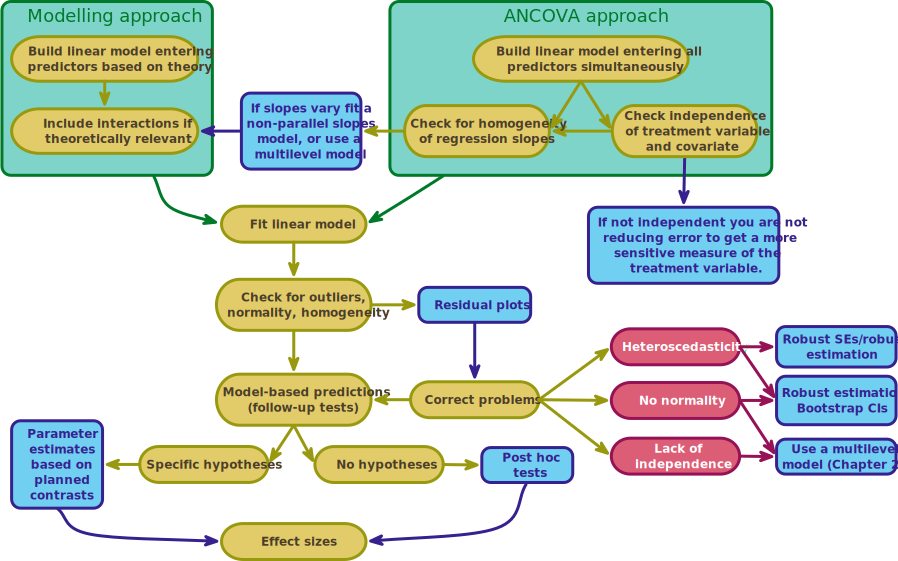

<html lang="en">

```{r setup, include=FALSE}
knitr::opts_chunk$set(
	echo = TRUE,
	message = FALSE,
	warning = FALSE
)

#necessary to render tutorial correctly
library(learnr) 
library(htmltools)
#easystats
library(effectsize)
library(insight)
library(modelbased)
library(parameters)
library(performance)
#tidyverse
library(dplyr)
library(ggplot2)
library(tibble)
library(tidyr)
#non tidyverse/easystats
library(car)
#students don't use
library(knitr)
library(marginaleffects)
library(sandwich)

source("./www/discovr_helpers.R")


#Read data files needed for the tutorial

puptreat_tib <- discovr::puppy_rct
cure_tib <- discovr::hangover
```


# discovr comparing adjusted means (GLM 2)

```{r, child = "./docs/intro.Rmd"}

```

## Packages

```{r, child = "./docs/packages.Rmd"}

```


## Data

```{r, child = "./docs/data.Rmd"}

```


## Fitting models

```{r, child = "./docs/fit_models.Rmd"}

```


## `r user_visor()` Puppies = happiness! [(B)]{.lbl}

The example in this tutorial extends the example about puppy therapy from `discovr_11`. On the assumption that you can't have enough puppies in your life, here's another picture of my dog looking cute to help you to deal with the psychological trauma of this statistics tutorial.

<figure>

<figcaption>Figure 4: Milton the spaniel says 'there's no need to be afraid, just tickle the belly of statistics and it will love you forever.</figcaption>
</figure> 

The previous tutorial focussed on an example in which a researcher tested the efficacy of puppy therapy by exposing different groups of randomly-assigned people to (1) a no puppies control group; (2) 15 minutes of puppy therapy; and (3) 30 minutes of puppy contact. The dependent variable was a measure of happiness ranging from 0 (as unhappy as I can possibly imagine being) to 10 (as happy as I can possibly imagine being).

Imagine our puppy-therapy researcher, in a moment of clarity, realised that happiness scores after therapy would depend upon happiness scores *before* therapy. People who are really unhappy before treatment, even if they become more happy, will have lower scores after therapy than those who went into therapy feeling happier. Some data reflecting this design are in [puptreat_tib]{.alt}. The data are very similar to the previous tutorial (`discovr_11`), in that we have the variables `id` (the participants id code), `dose` (1 = No puppies, 2 = 15 minutes, 3 = 30 minutes), and `post_happy` (the person's happiness on a scale from 0-10 *after* therapy). However, we have an additional variable `pre_happy` that is each person's happiness on a scale from 0-10 *before* therapy.

We can approach this situation in one of two ways (Figure 5). The first is to use the 5-step modelling process we've used in previous tutorials (Figure 3). Taking this approach, we sequentially build our model, including interaction terms that make theoretical sense and test whether the fit improves at each stage. For example, we might sequentially build up to this model:

$$
\begin{aligned}
\text{happy (post)}_i = \ &\hat{b}_0 + \hat{b}_1\text{happy (pre)}_i + \hat{b}_2\text{dose}_i \\
\quad &+ \hat{b}_3[\text{dose} \times \text{happy (pre)}]_i  + e_i
\end{aligned}
$$

Remembering that dose will be split into two dummy variables reflecting contrasts that we want to make, this model expands to

$$
\begin{aligned}
\text{happy (post)}_i = \ &\hat{b}_0 + \hat{b}_1\text{happy (pre)}_i + \hat{b}_2\text{contrast 1}_i+ \hat{b}_3\text{contrast 2}_i \\
\quad &+ \hat{b}_4[\text{contrast 1} \times \text{happy (pre)}]_i + \\
\quad &+ \hat{b}_5[\text{contrast 2} \times \text{happy (pre)}]_i + e_i
\end{aligned}
$$

This is known as a [non-parallel slopes model]{.kt} because by including the interaction term(s) we are open to the possibility that the relationship (or slope) between pre- and post-treatment happiness might vary across the therapy groups.

A different approach is to compare means adjusting for levels of a continuous variable. In this application, the continuous predictors are sometimes referred to as [covariates]{.kt}. Let's be clear that covariates are predictors by a different name, there's nothing special about them (statistically speaking). Historically, the linear model used in this specific context is referred to as [an]{.kt}alysis of [cova]{.kt}riance (or ANCOVA for short). In our puppy therapy trial, we know that happiness after treatment should be associated with happiness before treatment, so we want to make sure that the effect of our puppy therapy dose on happiness scores is adjusted for baseline levels of happiness. Specifically, in this model we will see the effect of our treatment at average levels of the covariate(s):


$$
\begin{aligned}
\text{happy (post)}_i = \ &\hat{b}_0 + \hat{b}_1\text{happy (pre)}_i + \hat{b}_2\text{dose}_i  + e_i
\end{aligned}
$$

Or if we are explicit about the dummy variables for `dose`:

$$
\begin{aligned}
\text{happy (post)}_i = \ &\hat{b}_0 + \hat{b}_1\text{happy (pre)}_i + \hat{b}_2\text{contrast 1}_i+ \hat{b}_3\text{contrast 2}_i + e_i
\end{aligned}
$$

This model is known as a [parallel slopes model]{.kt} because by excluding the interaction term we assume that the relationship (or slope) between pre- and post-treatment happiness is the same across the therapy groups.

Whichever approach we take we follow the usual 5-steps, except that for the ANCOVA (parallal slopes) approach we have two additional constraints, we assume 

1. No interaction between the covariate and treatment effect (a.k.a. we assume [homogeneity of regression slopes]{.kt})
2. Independence of the covariate and treatment effect

Therefore, the five steps become:

- Step 1: as always explore the data. However, in addition, we want to assess the [independence of the covariate]{.kt} (not a statistical requirement but helps with interpretation), and check for [homogeneity of regression slopes]{.kt} to see whether the assumption of parallel slopes is reasonable.
- Step 2: visualise the data as usual.
- Step 3: Fit the model. This stage differs a little in that people typically use *F*-statistics that evaluate all effects simultaneously, which requires using Type III sums of squares. To use Type III sums of squares we *must* set orthogonal contrasts.
- Step 4: evaluate the model in the usual way
- Step 5: interpret the model


<figure>

<figcaption>Figure 5: General procedure for fitting models that mix categorical and continuous predictors.</figcaption>
</figure>


## `r bmu()` Step 1: summarize the data [(A)]{.lbl}

<div class="stepbox">
  `r step()` **Step 1**

Get your data into `r rproj()` and pre-process using [tidyverse]{.pkg} packages or the [datawizard]{.pkg} package from [easystats]{.pkg}.
</div>


#### `r alien()` Alien coding challenge

View the data in [puptreat_tib]{.alt}.

```{r puptreat_tib, exercise = TRUE, exercise.lines = 2}

```

```{r puptreat_tib-solution}
puptreat_tib
```

Note that there are four variables: the participant's `id`, which is a character variable (note the `<chr>` under the name), the `dose` of puppy therapy, which is a factor (note the `<fct>` under the name), and the happiness scores pre- (`pre_happy`) and post-therapy (`post_happy`) which are numeric and have the data type 'double' (note the `<dbl>` under the name).

The variable `dose` is a factor (categorical variable), so having read the data file and converted it to a factor it's a good idea to check that the levels of `dose` are in the order that we want: Control, 15 minutes, 30 minutes.

#### `r alien()` Alien coding challenge

Using what you've learnt in previous tutorials check the order of the levels of the variable `dose`.

```{r chk_levels, exercise = TRUE, exercise.lines = 2}

```

```{r chk_levels-hint-1}
# use this function:

levels()
```

```{r chk_levels-hint-2}
# Remember that to access a variable you use:

name_of_tibble$name_of_variable
```

```{r chk_levels-hint-3}
# solution:

levels(puptreat_tib$dose)
```

Because I have set up the data within this tutorial you should see that the levels are listed in the order that we want them (No puppies, 15 minutes, 30 minutes) when you execute the code.

```{r quiz_fct_relevel, echo = FALSE}
quiz(caption = "Changing the order of factor levels",
     question("If the levels of dose were in the wrong order what function could we use to reorder the levels?",
    answer("`fct_relevel()`", correct = T, message = "Specifically, we could use this code: `pupluv_tib <- pupluv_tib |>` \n `mutate(dose = fct_relevel(dose, \"No puppies\", \"15 mins\", \"30 mins\"))`"),
    answer("`reorder()`", message = ""),
    answer("`fct_levels()`", message = ""),
    correct = "Correct - well done!",
    random_answer_order = TRUE,
    allow_retry = T
    )
)
```


#### `r alien()` Alien coding challenge

Use what you already know to compute descriptive statistics of happiness scores split by the therapy group to which a person belonged.

```{r pup_sum, exercise = TRUE, exercise.lines = 7}

```

```{r pup_sum-hint-1}
# Start by piping the tibble into the group_by function to group output by dose:
puptreat_tib |> 
  group_by(dose)
# Now pipe the results into the describe_distribution() function
```

```{r pup_sum-hint-2}
# Pipe the results into the describe_distribution() function
puptreat_tib |> 
  group_by(dose) |> 
  describe_distribution()
# use a function to display the table nicely
```


```{r pup_sum-solution}
# Solution
puptreat_tib |> 
  group_by(dose) |> 
  describe_distribution() |> 
  display()
```

Note that the mean happiness after treatment is very similar in the 15- and 30-minute groups and higher in these groups than the no puppies control.

<div class="tip">
  `r cat_space()` **Tip**

We can use what we have learnt previously to select only the mean and standard deviation, and re-organise the table. For example, the code below pipes the table into `select()` to retain only the first four columns of the table (from `dose` to `SD`), and then uses `pivot_wider()` to spread the rows in the column called `Variable` (this column labels whether the information is about `post_happy` or `pre_happy`) across columns. Within `display()` I override the column names (note that anything enclosed in asterisks will be rendered as italic).=

```{r, eval = F, class.source = '.panel_alt'}
puptreat_tib |> 
  group_by(dose) |> 
  describe_distribution() |> 
  select(dose:SD) |> 
  pivot_wider(
    names_from = "Variable",
    values_from = c("Mean", "SD")
  ) |> 
  display(column_names = c("Treatment", "*M* (Pre)", "*M* (Post)", "*SD* (Pre)", "*SD* (Post)"))
```
</div>

#### `r alien()` Alien coding challenge

Try out the code in the tip below

```{r pup_sum_jazzy, exercise = TRUE, exercise.lines = 15}

```

```{r pup_sum_jazzy-solution}
# Solution
puptreat_tib |> 
  group_by(dose) |> 
  describe_distribution() |> 
  select(dose:SD) |> 
  pivot_wider(
    names_from = "Variable",
    values_from = c("Mean", "SD")
  ) |> 
  display(column_names = c("Treatment", "*M* (Pre)", "*M* (Post)", "*SD* (Pre)", "*SD* (Post)"))
```


In this design, we have two additional steps:

- Test for [independence of the covariate]{.kt}
- Check for [homogeneity of regression slopes]{.kt} to see whether the assumption of parallel slopes is reasonable.

Although independence is not a statistical condition, it is easier to interpret the categorical predictor if we know that levels of the covariate are similar across the categories. We can test this by fitting a model, using `lm()` that predicts the covariate from the categorical predictor. If the categorical predictor does not significantly predict the covariate then they can be thought of as relatively independent (notwithstanding that significance will depend on sample size).


#### `r alien()` Alien coding challenge

Use the `lm()` function to fit a model in which the covariate (`pre_happy`) is predicted from `dose`, and evaluate the fit of the model.

<div class="tip">
  `r cat_space()` **Tip**

Remember that we can summarize the overall effect of a categorical predictor using `test_wald()`

</div>


```{r cov_ind, exercise = TRUE, exercise.lines = 5}
pre_lm <- 
```

```{r cov_ind-hint-1}
# fit the model (replace the xs):
pre_lm <- lm(xxx ~ xxxx, data = xxxx)
```

```{r cov_ind-hint-2}
# fit the model:
pre_lm <- lm(puppy_love ~ dose, data = puptreat_tib)
# now summarize it with anova()
```

```{r cov_ind-hint-3}
pre_lm <- lm(pre_happy ~ dose, data = puptreat_tib) 
test_wald(puptreat_tib)
# display the table nicely
```

```{r cov_ind-solution}
pre_lm <- lm(pre_happy ~ dose, data = puptreat_tib) 
test_wald(pre_lm) |> 
  display()
```

```{r, echo = F}
pre_lm <- lm(pre_happy ~ dose, data = puptreat_tib) 
luv_aov <- test_wald(pre_lm)
```


The main effect of dose is not significant, `r report_lrt(luv_aov)`, which shows that the average level of happiness before puppy therapy was (statistically speaking) roughly the same in the three puppy therapy groups. This result is good news for using pre-treatment happiness as a covariate to adjust the means in the model.

What about [homogeneity of regression slopes]{.kt}? To test this we want to know whether the interaction between `dose` and `pre_happy` is significant. Therefore, we want to compare the model with the interaction include to one where it is excluded using `test_wald()`.

#### `r robot()` Code example

To fit these models we could use this code

```{r, eval = F}
main_effects_lm <- lm(post_happy ~ dose + pre_happy, data = puptreat_tib)
full_lm <- lm(post_happy ~ dose + pre_happy + dose:pre_happy, data = puptreat_tib)
test_wald(main_effects_lm, full_lm)
```

Note that the second model [full_lm]{.alt} is the same as the first but adds the interaction term.

<div class="tip">
  `r cat_space()` **Tip**

I've used quite explicit code to create [full_lm]{.alt} to make it really clear that the models differ only in the inclusion of the interaction term. However, this code does the same thing:

```{r, eval = F, class.source = '.panel_alt'}
full_lm <- lm(post_happy ~ dose*pre_happy, data = puptreat_tib)
```

Alternatively we can use the `update()` function to add things to previous models. In this case

```{r, eval = F, class.source = '.panel_alt'}
full_lm <- update(main_effects_lm, .~. + dose:pre_happy)
```

This code takes the model [main_effects_lm]{.alt} and updates it. Specifically, `.~.` means 'keep everything on the left and right of the tilde', which ensures we retain the same outcome and predictors and `+ dose:pre_happy` means 'add the interaction between `dose` and `pre_happy`'.

</div>

#### `r alien()` Alien coding challenge

Use the code box to test the assumption of homogeneity of regression slopes.


```{r hrs, exercise = TRUE, exercise.lines = 6}

```

```{r hrs-solution}
main_effects_lm <- lm(post_happy ~ dose + pre_happy, data = puptreat_tib)
full_lm <- lm(post_happy ~ dose + pre_happy + dose:pre_happy, data = puptreat_tib)
test_wald(main_effects_lm, full_lm) |> 
  display()
```

```{r, echo = F}
main_effects_lm <- lm(post_happy ~ dose + pre_happy, data = puptreat_tib)
full_lm <- lm(post_happy ~ dose + pre_happy + dose:pre_happy, data = puptreat_tib)
hrs <- test_wald(main_effects_lm, full_lm)
```

The interaction is not significant, `r report_lrt(hrs)`, which shows that the relationship between pre- and post-therapy happiness scores is (statistically speaking) roughly the same in the three puppy therapy groups. A parallel slopes model is, therefore, reasonable.


## `r bmu()` Step 2: Visualize [(A)]{.lbl}

<div class="stepbox">
  `r step()` **Step 2**

Visualise the data using the [ggplot2]{.pkg} package from [tidyverse]{.pkg}.
</div>

#### `r alien()` Alien coding challenge

Plot a violin plot of happiness scores in the three puppy therapy groups. Plot the raw data and display each group in a different colour. For bonus points, include `scale_colour_viridis_d(begin = 0.3, end = 0.8)` so that the plot uses accessible colours and `theme(legend.position = "none")` to hide the colour legend.

```{r pup2_violin, exercise = TRUE, exercise.lines = 10}

```

```{r pup2_violin-solution}
ggplot(puptreat_tib, aes(x = dose, y = post_happy, colour = dose)) +
  geom_point(position = position_jitter(width = 0.1), alpha = 0.6) +
  geom_violin(alpha = 0.2) + 
  stat_summary(fun.data = "mean_cl_normal", geom = "pointrange", position = position_dodge(width = 0.9)) +
  coord_cartesian(ylim = c(0, 10)) +
  scale_y_continuous(breaks = 0:10) +
  scale_colour_viridis_d(begin = 0.3, end = 0.8) +
  labs(x = "Puppy therapy group", y = "Post-therapy happiness (0-10)", colour = "Puppy therapy group") +
  theme_minimal() +
  theme(legend.position = "none")
```

Note that the mean happiness is very similar in the 15- and 30-minute groups and higher in these groups than the no puppies control.

#### `r alien()` Alien coding challenge

Repeat the plot above but using pre-treatment happiness on the *y*-axis.

```{r pup3_violin, exercise = TRUE, exercise.lines = 10}

```

```{r pup3_violin-solution}
ggplot2::ggplot(puptreat_tib, aes(x = dose, y = pre_happy, colour = dose)) +
  geom_point(position = position_jitter(width = 0.1), alpha = 0.6) +
  geom_violin(alpha = 0.2) + 
  stat_summary(fun.data = "mean_cl_normal", geom = "pointrange", position = position_dodge(width = 0.9)) +
  coord_cartesian(ylim = c(0, 10)) +
  scale_y_continuous(breaks = 0:10) +
  scale_colour_viridis_d(begin = 0.3, end = 0.8) +
  labs(x = "Puppy therapy group", y = "Post-therapy happiness (0-10)", colour = "Puppy therapy group") +
  theme_minimal() +
  theme(legend.position = "none")
```

The plot shows that the distributions are similar across the treatment groups adding support to our earlier test of independence.


#### `r alien()` Alien coding challenge

Use what you already know to plot a scatterplot and linear model of the relationship between pre- and post-therapy happiness scores. Plot the three puppy therapy groups in a different colour.

```{r pup_scatter2, exercise = TRUE, exercise.lines = 10}

```

```{r pup_scatter2-solution}
ggplot2::ggplot(puptreat_tib, aes(x = pre_happy, y = post_happy)) +
  geom_smooth(method = "lm", colour = "#CC6677", fill = "#CC6677", alpha = 0.2) +
  geom_point(colour = "#882255") +
  coord_cartesian(ylim = c(0, 10), xlim = c(0, 10)) +
  scale_x_continuous(breaks = 0:10) +
  scale_y_continuous(breaks = 0:10) +
  labs(x = "Pre-treatment happiness (0-10)", y = "Post-treatment happiness (0-10)", colour = "Treatment", fill = "Treatment") +
 facet_wrap(~dose) + 
  theme_minimal()
```

The relationship between pre- and post-treatment happiness is positive (and similar in strength) in all three groups agreeing with our test of homogeneity of regression slopes.


## `r user_visor()` Step 3: Fit the model  [(B)]{.lbl}

As mentioned, the model we're fitting is 

$$
\begin{aligned}
\text{happy (post)}_i = \ &\hat{b}_0 + \hat{b}_1\text{happy (pre)}_i + \hat{b}_2\text{contrast 1}_i+ \hat{b}_3\text{contrast 2}_i + e_i
\end{aligned}
$$

That is, the happiness score for an individual after treatment is predicted from their happiness before treatment plus information about which treatment their received which is coded in our two contrast variables. The question is, what do we want these contrasts to represent?.

The default method is [dummy]{.kt} or [indicator]{.kt} coding in which each category is compared to a single reference category. Group membership is expressed in terms of 0s and 1s, and, in this example we might choose to compare each therapy condition to the no puppies group (Table 1). 

```{r dummy_tbl, echo = FALSE, results = 'asis'}
dummy_tbl <- tibble(
  `Group` = c("No puppies (control)", "15 minutes", "30 minutes"),
  `Contrast 1 (30 mins vs. none)` = c(0, 0, 1),
  `Contrast 2 (15 mins vs. none)` = c(0, 1, 0)
  )

knitr::kable(dummy_tbl, caption = "Table 1: Dummy coding for the three-group puppy therapy study")
```


These are [non-orthogonal contrasts]{.kt}, which means they are not independent (because they both use the no puppies group scores). This codingh scheme is problematic when we take an AMNCOVA approach because we want to use *F*-statistics to evaluate all effects *simultaneously* and not *sequentially* like we do when we use `test_wald()`. To evaluate *F*-statistics simultaneously, we must use Type III sums of squares. Type III sums of squares differ from Type I in that all effects are evaluated taking into consideration all other effects in the model (not just the ones entered before). As such, the order that you specify predictors doesn't affect the results. (There's a more nuanced discussion of sums of squares in the book.)

```{r ssl_quiz, echo = F}
question("What's the pragmatic difference between Type I and Type III sums of squares",
         answer("For Type III sums of squares the order that you specify predictors doesn't affect the resulting sums of squares, for Type I sums of squares it does.",  correct = TRUE, message = "Well done, this answer is correct."),
         answer("For Type I sums of squares the order that you specify predictors doesn't affect the resulting sums of squares, for Type III sums of squares it does.", message = "Unlucky, try again."),
         allow_retry = TRUE,
         random_answer_order = TRUE
)
```

For Type III sums of squares to be correctly calculated you must specify an orthogonal contrast for categorical predictors. Orthogonal is just a posh word for independent. If you follow the rules for contrast coding in `discovr_11` and the book, you will get orthogonal contrasts.

<div class="infobox">
  `r info()` **Type III sums of squares**

If you want to use Type III sums of squares then you **must** set orthogonal contrasts, you cannot, for example, enter the categorical predictor and let `r rproj()` do dummy coding for you.

</div>

The contrasts we used in `discovr_11` are orthogonal, and the hypotheses haven't changed so we can use the same contrast coding as the previous example to get two contrasts:

1. Contrast 1: compares post-therapy happiness in anyone having puppy therapy to those that had none
2. Contrast 2: compares post-therapy happiness in anyone having 30 minutes of puppy therapy to those that had 15 minutes.

The contrasts we used in `discovr_11` are in Table 2.

```{r con_tbl, echo = FALSE, results = 'asis'}
con_tbl <- tibble(
  `Group` = c("No puppies (control)", "15 minutes", "30 minutes"),
  `Contrast 1 (No puppies vs. puppies)` = c("-2/3", "1/3", "1/3"),
  `Contrast 2 (15 mins vs 30 mins)` = c("0", "-1/2", "1/2")
  )

knitr::kable(con_tbl, caption = "Table 2: Contrast coding for the puppy example")
```

<div class="tip">
  `r cat_space()` **Tip**

If we didn't have specific hypotheses to test, or we had hypotheses that couldn't be operationalized as orthogonal contrasts, then for the purpose of getting Type III sums of squares we can set a Helmert contrast:

```{r, eval = F, class.source = '.panel_alt'}
contrasts(categorical_variable) <- contr.helmert(n)
```

In which [categorical_variable]{.alt} is the variable for which you're setting a contrast, and [n]{.alt} is the number of levels of that variable. So, for `dose`, which has three levels, we'd execute:

```{r, eval = F, class.source = '.panel_alt'}
contrasts(puptreat_tib$dose) <- contr.helmert(3)
```

</div>


#### `r robot()` Code example

Set the orthogonal contrasts in Table 2 for `dose` using the `contrasts()` function using (go back over `discovr_11` if this code doesn't make sense to you):

```{r, eval = F}
puppy_vs_none <- c(-2/3, 1/3, 1/3)
long_vs_short <- c(0, -1/2, 1/2)
contrasts(puptreat_tib$dose) <- cbind(puppy_vs_none, long_vs_short)
```

#### `r alien()` Alien coding challenge

Use the code from the example to set the contrasts in Table 2 for `dose`.

```{r set_contrast, exercise = TRUE, exercise.lines = 5}
     
               
```

```{r set_contrast-hint-1}
# Set the weights for the first contrast using the example code:
puppy_vs_none <- c(-2/3, 1/3, 1/3)
# Now set the weights for the second contrast
```

```{r set_contrast-hint-2}
# Set the weights for the second contrast:
long_vs_short  <- c(0, -1/2, 1/2)
# Next, set the two contrasts to the dose variable
```

```{r set_contrast-hint-3}
# Set the two contrasts to the dose variable:
contrasts(puptreat_tib$dose) <- cbind(puppy_vs_none, long_vs_short)
# Finally, view the weights to check they are set correctly
```

```{r set_contrast-solution}
puppy_vs_none <- c(-2/3, 1/3, 1/3)
long_vs_short <- c(0, -1/2, 1/2)
contrasts(puptreat_tib$dose) <- cbind(puppy_vs_none, long_vs_short)
contrasts(puptreat_tib$dose) # This line prints the contrast weights so we can check them
```


<div class="tip">
  `r cat_space()` **Tip**
  
  Remember that `r rproj()` will create dummy variables for `dose` based on the contrasts you set, so you don't need to create the variables `contrast 1` and `contrast 2` in the equation; you need only enter `dose` as a predictor. Similarly, to get the interaction terms you need only specify `dose:puppy_love`.
</div>


```{r, echo = F}
puppy_vs_none <- c(-2/3, 1/3, 1/3)
long_vs_short <- c(0, -1/2, 1/2)
contrasts(puptreat_tib$dose) <- cbind(puppy_vs_none, long_vs_short)
puptreat_lm <- lm(post_happy ~ pre_happy + dose, data = puptreat_tib)
puptreat_aov <- car::Anova(puptreat_lm, type = 3) |> 
  model_parameters(es_type = "omega", ci = 0.95) 
puptreat_par <- model_parameters(puptreat_lm, vcov = "HC4") 
```


#### `r robot()` Code example

To get *F*-statistics based on Type III sums of squares we can use the following general code:

```{r, eval = F}
car::Anova(my_model, type = 3)
```

So, you create a model using `lm()` in the usual way, then within `Anova()` replace [my_model]{.alt} with the name of the model you have just created. You specify Type III sums of squares by including [type = 3]{.alt} or [type = "III"]{.alt}.

#### `r alien()` Alien coding challenge

Use the `lm()` function to fit a model in which `happiness` is predicted from the covariate (`puppy_love`) and `dose`, and summarize the effects with *F*-statistics based on Type III sums of squares.

```{r puptreat_oc}
puppy_vs_none <- c(-2/3, 1/3, 1/3)
long_vs_short <- c(0, -1/2, 1/2)
contrasts(puptreat_tib$dose) <- cbind(puppy_vs_none, long_vs_short)
```

```{r puptreat_III, exercise = TRUE, exercise.lines = 4, exercise.setup = "puptreat_oc"}

```

```{r puptreat_III-hint-1}
# fit the model (replace the xs):
puptreat_lm <- lm(xxx ~ xxxx, data = xxxx)
```

```{r puptreat_III-hint-2}
# fit the model:
puptreat_lm <- lm(post_happy ~ pre_happy + dose, data = puptreat_tib)
# now summarize it with car::Anova()
```

```{r puptreat_III-hint-3}
# Solution:
puptreat_lm <- lm(post_happy ~ pre_happy + dose, data = puptreat_tib)
car::Anova(puptreat_lm, type = 3)
# use model_parameters to add effect sizes
```

```{r puptreat_III-solution}
# Solution:
puptreat_lm <- lm(post_happy ~ pre_happy + dose, data = puptreat_tib)
car::Anova(puptreat_lm, type = 3) |> 
  model_parameters(es_type = "omega", ci = 0.95) |> 
  display(use_symbols = TRUE)
```


Looking first at the significance values, the covariate significantly predicts the dependent variable, `r report_ez_aov(puptreat_aov, row = 1, es = "Omega2_partial")`. Therefore, the persons post-therapy happiness is significantly related to their pre-therapy happiness. What's more interesting is that when the effect of pre-therapy happiness is held constant, the effect of puppy therapy is significant,  `r report_ez_aov(puptreat_aov, row = 2, es = "Omega2_partial")`.

```{r quiz_p_ex1, echo = FALSE}
quiz(
  question("The effect of **dose** in the output tells us about whether the means differ across the therapy groups. What does the value of 0.024 mean?",
    answer("It is the probability of getting a value of *F* at least as big as 4.32 if the null hypothesis were true (i.e. if the means for the three therapy groups were identical).", correct = T),
    answer("It is the probability that the *F* value of 4.32 has occurred by chance", message = "*p*-values do not tell us whether results occur by chance."),
    answer("It is the probability that the means of the three therapy groups are identical", message = "*p*-values do not tell us about the probability of the null hypothesis"),
    answer("It is the probability that the means of the three therapy groups are not identical", message = "*p*-values do not tell us about the probability of the alternative hypothesis"),
    correct = "Correct - well done!",
    random_answer_order = TRUE,
    allow_retry = T
  )
)
```


## `r bmu()` Step 4: Evaluate the model [(A)]{.lbl}

<div class="stepbox">
  `r step()` **Step 4**

Evaluate the model using a small number of functions from the [performance]{.pkg} package from [easystats]{.pkg}. Specially, we evaluate

- How well the model fits the data
- Whether the underlying assumptions of the model are met. If not, we refit the model using robust methods (see Figure 3).
 
</div>


#### `r alien()` Alien coding challenge

```{r puptreat_lm}
puppy_vs_none <- c(-2/3, 1/3, 1/3)
long_vs_short <- c(0, -1/2, 1/2)
contrasts(puptreat_tib$dose) <- cbind(puppy_vs_none, long_vs_short)
puptreat_lm <- lm(post_happy ~ pre_happy + dose, data = puptreat_tib)
```

Evaluate the model assumptions in the usual way using `check_model()`.

```{r puptreat_lm_check, exercise = TRUE, exercise.lines = 3, exercise.setup = "puptreat_lm", fig.height = 10}

```

```{r puptreat_lm_check-solution}
check_model(puptreat_lm)
```


```{r interact_lm_check_qz, echo = FALSE}
quiz(caption = "Diagnostic plot quiz (level 2)",
  question("How would you interpret the *Residual vs. fitted* and *Scale-location* plots?",
    answer("Were in trouble: I see heteroscedasticity and nonlinearity.", correct = TRUE, message = "The green line is decidedly not flat and the cloud of dots seems to fan out on both plots. We can't assume homoscedasticity and even linearity is questionable."),
    answer("I'm not sure, give me a hint.", message = "Heteroscedasticity and nonlinearity is shown up by a green line that isn't flat. A vertical spread of dots that changes as you move along the *x*-axis also indicates heteroscedasticity."),
    answer("Everything is fine - residuals show homogeneity and linerarity.", message = "Look again at the green line and spread of dots."),
    correct = "Correct - well done!",
    random_answer_order = TRUE,
    allow_retry = T
  ),
  question("Based on the Q-Q plot, can we assume normality of the residuals?",
    answer("Yes", message = "When we can assume normality, the dots on the Q-Q plot hug the line. There's not much hugging going on at the extremes."),
    answer("No", correct = TRUE, message = "The dots on the Q-Q plot deviate from the line at the extremes, which probably indicates a non-normal distribution."),
    answer("Give me a clue", message = "If residuals are normally distributed then the dots on the Q-Q plot should hug the line."),
    correct = "Correct - Well done!",
    random_answer_order = TRUE,
    allow_retry = T
  ),
  question("Based on the influence plot, are there any influential cases?",
    answer("Yes", message = "Influential cases should fall outside of the contour lines, can you see any that do?"),
    answer("No", correct = TRUE),
    answer("Maybe", message = "Sorry, you're not allowed to sit on the fence!"),
    correct = "Correct - all the dots fall within the contour lines, which tells us that all cases are within the desired bounds and not influential. Well done!",
    random_answer_order = TRUE,
    allow_retry = T
  )
)
```


## `r bmu()` Step 5: Interpret the model [(A)]{.lbl}

<div class="stepbox">
  `r step()` **Step 5**

Interpret the model

- Interpret the values that define the model (the [parameter estimates]{.alt}) using the [parameters]{.pkg} package from [easystats]{.pkg}.
- Make specific predictions from our model using the [modelbased]{.pkg} package from [easystats]{.pkg}.
 
</div>


## `r user_visor()` Adjusted means [(B)]{.lbl}

Earlier on we computed the group means. They're displayed again for you in Table 3.

```{r echo = FALSE}
puptreat_tib |> 
  group_by(dose) |> 
  describe_distribution(select = post_happy, iqr = F, range = F, ci = 0.95, dispersion = F) |>
  display()
```

Based on Table 3, you might think that the significant *F*-statistic for `dose` reflects a difference between the control group and the two experimental groups (because the 15- and 30-minute groups have very similar means, 4.88 and 4.46, whereas the control group mean is much lower at 3.22). However, we cant use these means to interpret the effect because they have not been adjusted for the effect of the covariate.

#### `r robot()` Code example

To get the means adjusted for the covariate we use the `estimate_means()` function from [modelbased]{.pkg}, which takes the general form:

```{r, eval = F}
estimate_means(model = my_model,
               by = c("predictor_1", "predictor_2", ...),
               ci = 0.95)
```

We replace [my_model]{.alt} the name of the model into the function, then optionally specify these arguments:

* [by = c("predictor_1", "predictor_2", ...)]{.alt}: the categorical predictor(s) over which you want to compute means. In our case, we want means for the variable dose, so we specify [by = c("dose")]{.alt}.
* [ci = 0.95]{.alt}: specifies the width of the confidence interval. It defaults to a 95% confidence interval so if you're happy with that you can leave this argument out.


#### `r alien()` Alien coding challenge

Adapt the sample code to get the adjusted means for the model [puptreat_lm]{.alt}.


```{r adj_m, exercise = TRUE, exercise.lines = 3, exercise.setup = "puptreat_lm"}

```

```{r adj_m-hint-1}
# Replace the xs:
estimate_means(xxxxxxx, by = c("xxxxxx"))
# don't forget out friend display() to render the table
```

```{r adj_m-solution}
estimate_means(puptreat_lm, by = c("dose")) |> 
  display()
```

From these adjusted means you can see that at average levels of puppy love, happiness increased across the three doses. We can view the parameter estimates in the usual way using `model_parameters()`:

#### `r alien()` Alien coding challenge

The diagnostic plots suggest we should adjust the model using robust methods. The main issue was heteroscedasticity so we should use robust standard errors (Figure 3). Use what you know already about `model_parameters()` to inspect the parameter estimates of the model [puptreat_lm]{.alt} using robust standard errors.

```{r puptreat_coef, exercise = TRUE, exercise.lines = 5, exercise.setup = "puptreat_lm"}

```

```{r puptreat_coef-solution}
model_parameters(puptreat_lm, vcov = "HC4") |> 
  display()
```

```{r quiz_cov_ex1, echo = FALSE}
quiz(caption = "Interpreting the covariate (level 2)",
  question("How would you interpret the effect of the covariate?",
    answer("There is a significant relationship between the happiness before and after treatment: as happiness pre-therapy increases, happiness post-therapy increase also", correct = TRUE, message = "The *t*-statistic and *p*-value tell us that the relationship between the happiness before and after treatment is significant, and the value of *b* is positive (0.66) indicating that as pre-treatment happiness increases so does post-treatment happiness."),
    answer("As pre-treatment happiness increases, post-treatment happiness does not change significantly", message = "The *t*-statistic and *p*-value tell us that the relationship between pre- and post-treatment happiness *is* significant."),
    answer("There is a significant relationship between the pre- and post-treatment happiness: as pre-treatment happiness increases, post-treatment happiness decrease", message = "The value of *b* is positive (0.66) indicating that as as pre-treatment happiness increases, so does post-treatment happiness."),
    correct = "Correct - well done!",
    random_answer_order = TRUE,
    allow_retry = T
  )
)
```


Moving onto the dummy variables, the first one ([dose (puppy_vs_none)]{.opt}) compares the control group with the 15- and 30-minute groups combined. Using the contrast codes that we have used, the *b*-value is the difference between the adjusted mean of the control group and the average of the adjusted means for the 15- and 30-minute groups. The effect is significant, `r report_pe(puptreat_par, row = 3)`, indicating that the control group was significantly different from the combined adjusted mean of the puppy therapy groups. The *b*-value for the second dummy variable ([dose (long_vs_short)]{.opt}) is the difference between the adjusted means of the 15- and 30-minute groups. This effect is significant, 
`r report_pe(puptreat_par, row = 4)`, indicating that the 30-minute group produced significantly different happiness to the 15-minute group at average levels of pre-treatment happiness.

<div class="tip">
  `r cat_space()` **Tip: Raw effect sizes**

The *b*s in this output are raw effect sizes. I can't stress enough how useful it can be to interpret these. For example, the difference in happiness in the no puppy group compared to the combined puppy groups was
`r value_from_ez(puptreat_par, row = 3)`. So, happiness was more than a point higher on the scale (which ranged from 0-10), on average, for those who had some puppy therapy compared to those that didn't. You can evaluate for yourself whether this difference is meaningful based on what we might know about the happiness scale.

</div>


## `r user_visor()` *Post hoc* tests [(B)]{.lbl}

If, and only if, we hadn't had specific comparisons to test with contrasts we would instead obtain *post hoc* tests. We do this using the `estimate_contrasts()` function as we did in `discovr_11`.

#### `r alien()` Alien coding challenge

View *post hoc* for the model [puptreat_lm]{.alt} using a Holm adjustment.

```{r pupluv_ph, exercise = TRUE, exercise.lines = 6, exercise.setup = "puptreat_lm"}

```

```{r pupluv_ph-solution}
estimate_contrasts(puptreat_lm, p_adjust = "holm") |> 
  display()
```

```{r, echo = F}
pup_ph <- estimate_contrasts(puptreat_lm, p_adjust = "holm")
```


The results show the Holm corrected *post hoc* comparisons. There is a significant difference between the adjusted mean happiness in the no puppies group and the 30-minute group, `r report_ph(pup_ph)`, but not between the no puppies and 15-minute group, `r report_ph(pup_ph, row = 1)` or between the 30- and 15-minute groups, `r report_ph(pup_ph, row = 3)`.

Note that the value of *Difference* is the difference between the adjusted means. The footnote reminds us that all differences are evaluated at average levels of pre-treatment happiness.


## `r user_visor()` Transfer task [(B)]{.lbl}

### Give me the cure

A marketing manager tested the benefit of soft drinks for curing hangovers. He took 15 people and got them drunk. The next morning as they awoke, dehydrated and feeling as though they'd licked a camel's sandy feet clean with their tongue, he gave five of them water to drink, five of them Lucozade (a very nice glucose-based UK drink) and the remaining five a leading brand of cola (this variable is called `drink`). He measured how well they felt (on a scale from 0 = I feel like death to 10 = I feel really full of beans and healthy) two hours later (this variable is called `well`). He measured how `drunk` the person got the night before on a scale of 0 = as sober as a nun to 10 = flapping about like a haddock out of water on the floor in a puddle of their own vomit. The data are preloaded in [cure_tib]{.alt}. Fit a model to see whether people felt better after different drinks when adjusting for how drunk they were the night before. The researcher predicted that sugary-drinks (Lucozade/Cola) would increase wellness compared to water and that Lucozade drinkers will have higher happiness scores than cola drinkers.

<div class="infobox">
  `r info()` **Information**

There is a detailed solution to this task at [https://www.discovr.rocks/solutions/alex/alex_12/#task-123](https://www.discovr.rocks/solutions/alex/alex_12/#task-123).
</div>


```{r quiz_con_hulk, echo = FALSE}
question("What contrast codes would you use to test the hypotheses?",
    answer("**Contrast 1**: Water (-2/3), Lucozade (1/3), Cola (1/3); **Contrast 2**: Water (0), Lucozade (-1/2), Cola (1/2)", correct = T),
    answer("**Contrast 1**: Water (0), Lucozade (-1/2), Cola (1/2)", message = "With 2 groups you would need 2 contrasts to partition the variance fully. This answer is correct for the second contrast."),
    answer("**Contrast 1**: Water (-2/3), Lucozade (1/3), Cola (1/3); **Contrast 2**: Water (-2/3), Lucozade (-1/2), Cola (1/2)", message = "These contrasts are not independent."),
    answer("**Contrast 1**: Water (-2/3), Lucozade (0), Cola (0); **Contrast 2**: Water (0), Lucozade (-1/2), Cola (1/2)", message = "Contrast 1 compares water to nothing."),
    answer("I literally have no clue", message = "Use the hints."),
    correct = "Correct - well done!",
    incorrect = "Good try.",
    random_answer_order = TRUE,
    allow_retry = T
)
```

To get you started ... to test our main hypotheses we need to first enter the codes for the contrasts in Table 4. Contrast 1 tests hypothesis 1: sugary-drinks (Lucozade/Cola) would increase wellness compared to water. In the table, the numbers assigned to the groups are the number of groups in the opposite chunk divided by the number of groups that have non-zero codes, and we randomly assigned one chunk to be a negative value. Contrast 2 tests hypothesis 2: Lucozade drinkers will have higher happiness scores than cola drinkers.

```{r cure_tbl, echo = FALSE, results = 'asis'}
con_tbl <- tibble(
  `Group` = c("Water", "Lucozade", "Cola"),
  `Contrast 1 (Sugar vs. none)` = c("-2/3", "1/3", "1/3"),
  `Contrast 2 (Lucozade vs. Cola)` = c("0", "-1/2", "1/2")
  )

knitr::kable(con_tbl, caption = "Table 4: Contrast coding for the hangover example")
```

#### `r alien()` Alien coding challenge

Use the code box to set the contrasts.

```{r cure_asw, exercise = TRUE, exercise.lines = 4}

```

```{r cure_asw-hint-1}
# Start by defining the contrasts:

sugar_vs_none <- c(x, x, x)
lucoz_vs_cola <- c(x, x, x)

# Now assign these variables to the contrast attached to the variable hero
```

```{r cure_asw-hint-2}
# Assign these variables to the contrast attached to the variable hero

sugar_vs_none <- c(-2/3, 1/3, 1/3)
lucoz_vs_cola <- c(0, -1/2, 1/2)

contrasts(cure_tib$drink) <- cbind(sugar_vs_none, lucoz_vs_cola)
contrasts(cure_tib$drink) # To view the contrasts
```


#### `r alien()` Alien coding challenge

Use the code box to test that the predictor variable (drink) and the covariate (drunk) are independent.

```{r cure_ind, exercise = TRUE, exercise.lines = 4}

```

```{r cure_ind-hint-1}
# Fill in the xs:
drunk_lm <- lm(xxx ~ xxxx, data = xxxx)
test_wald(xxxx) |> display()
```

```{r cure_ind-hint-2}
# Solution:
drunk_lm <- lm(drunk ~ drink, data = cure_tib)
test_wald(drunk_lm) |> display()
```

```{r cov_ind_ug, echo = FALSE}
quiz(caption = "Independence of the covariate (level 1)",
  question("Are the predictor variable (drink) and the covariate (drunk) independent?",
    answer("Yes.", correct = T, message = "The output shows that the main effect of drink is not significant, F(2, 12) = 1.35, p = 0.295, which shows that the average level of drunkenness the night before was roughly the same in the three drink groups, which suggests that they are independent."),
    answer("No.", message = "The output shows that the main effect of drink is not significant, F(2, 12) = 1.35, p = 0.295, which shows that the average level of drunkenness the night before was roughly the same in the three drink groups, which suggests that they are independent."),
    correct = "Correct - well done!",
    incorrect = "Good try.",
    random_answer_order = TRUE,
    allow_retry = T
  )
)
```

#### `r alien()` Alien coding challenge

Use the code box to test homogeneity of regression slopes.

```{r cure_hors, exercise = TRUE, exercise.lines = 4}

```

```{r cure_hors-hint-1}
# Fill in the xs:
no_int_lm <- lm(xxx ~ xxxx, data = xxxx)
int_lm <- lm(xxxx ~ xxxx, data = xxxx)
test_wald(xxxx, xxxx) |> display()
```

```{r cure_hors-solution}
# Solution:
no_int_lm <- lm(well ~ drunk + drink, data = cure_tib)
int_lm <- lm(well ~ drunk*drink, data = cure_tib)
test_wald(no_int_lm, int_lm) |> display()
```

Note the assumption is met.

#### `r alien()` Alien coding challenge

Use the code box to fit and look at the main model and the parameter estimates and obtain adjusted means for the effect of `drink`. Call the model [cure_lm]{.alt}.

```{r cure_oc}
sugar_vs_none <- c(-2/3, 1/3, 1/3)
lucoz_vs_cola <- c(0, -1/2, 1/2)

contrasts(cure_tib$drink) <- cbind(sugar_vs_none, lucoz_vs_cola)
```


```{r cure_main, exercise = TRUE, exercise.lines = 6, exercise.setup = "cure_oc"}

```

```{r cure_main-hint-1}
# Fill in the xs:
cure_lm <- lm(xxx ~ xxx + xxx, data = xxxx)
car::Anova(xxxx, type = 3) |> 
  model_parameters(es_type = xxxx, ci = 0.95) |> 
  display(use_symbols = TRUE)
```

```{r cure_main-hint-2}
# The main model will be:
cure_lm <- lm(well ~ drunk + drink, data = cure_tib)
car::Anova(cure_lm, type = 3) |> 
  model_parameters(es_type = "omega", ci = 0.95) |> 
  display(use_symbols = TRUE)
# Use model_parameters() to look at the parameter estimates
```

```{r cure_main-hint-3}
# Use model_parameters() to look at the parameter estimates:
model_parameters(cure_lm) |> 
  display()

# get adjusted means with estimate_means()
```

```{r cure_main-solution}
cure_lm <- lm(well ~ drunk + drink, data = cure_tib)
car::Anova(cure_lm, type = 3) |> 
  model_parameters(es_type = "omega", ci = 0.95) |> 
  display(use_symbols = TRUE)

model_parameters(cure_lm) |> 
  display()

estimate_means(cure_lm) |> 
  display()
```

```{r cure_main_qz, echo = FALSE}
quiz(caption = "Hangover cure quiz (level 2)",
  question("How would you interpret the effect of the covariate?",
    answer("How drunk the person got significantly predicted how well they felt. The more they drank, the worse they felt.", correct = T, message = "The parameter estimate of -0.55 tells us that the relationship is negative - the more you drink, the lower your wellness. The *p*-values for *F* and *t* are below 0.05 so at conventional significance levels the effect is significantly different to 0."),
    answer("How drunk the person got significantly predicted how well they felt. The more they drank, the better they felt.", message = "The parameter estimate of -0.55 tells us that the relationship is negative - the more you drink, the lower your wellness."),
    answer("How drunk the person got did not significantly predict how well they felt.", message = "The *p*-value for the effect is less than 0.001, which would typically be interpreted as *significant*"),
    answer("Give me a clue", message = "Look at the effect labelled **drunk** in the tables. Look at the values of *p* andthe value of the estimate itself to tell you thedirection of the effect."),
    correct = "Correct - well done!",
    incorrect = "Good try.",
    random_answer_order = TRUE,
    allow_retry = T
  ),
  question("How would you interpret the main effect of the type of drink?",
    answer("The type of drink significantly predicted how well they felt after adjusting for how drunk they got the night before.", correct = T),
    answer("The type of drink significantly predicted how well they felt.", message = "True, but to be more precise we need to consider the fact we have a covariate in the model too."),
    answer("The type of drink did not significantly predict how well they felt.", message = "The *p*-value for the effect is less than 0.05, which would typically be interpreted as *significant*"),
    answer("Give me a clue", message = "Look at the effect labelled **drink** in the tables and the values of *p* to indicate significance."),
    correct = "Correct - well done!",
    incorrect = "Good try.",
    random_answer_order = TRUE,
    allow_retry = T
    ),
  question("Using the adjusted means interpret the main effect of the type of drink?",
    answer("Wellness scores were higher after Lucozade than the other two drinks", correct = T),
    answer("Wellness scores were all 3.40 in the three groups", message = "You're looking at mean of the covariate."),
    answer("Tell me a joke", message = "A cat walks into a bar and orders a pint of fish. The bar person says \'Sorry, but we don't serve fish\'. The cat replies \'That's OK, I'm a cat\'."),
    correct = "Correct - well done!",
    random_answer_order = TRUE,
    allow_retry = T
    ),
  question("How would you interpret the contrasts (labelled **drinksugar_vs_none** and **drinklucoz_vs_cola** if you followed the solutions)?",
    answer("After adjusting for how drunk the person was, wellness scores were not significantly different after sugary drinks than after water, but were significantly higher in the Lucozade group compared to cola.", correct = T),
    answer("After adjusting for how drunk the person was, wellness scores were not significantly different after sugary drinks than after water, and were not significantly different in the Lucozade group compared to cola.", message = "Look at the significance value for the second contrast again."),
    answer("After adjusting for how drunk the person was, wellness scores were significantly higher after sugary drinks than after water, and were significantly higher in the Lucozade group compared to cola.", message = "Look at the *p*-value for the first contrast again. Remember that if the significance value is less than 0.05 that will typically be seen as *significant*."),
    answer("After adjusting for how drunk the person was, wellness scores were significantly higher after sugary drinks than after water, but were not significantly different in the Lucozade group compared to cola.", message = "Look at the significance value for both contrasts again. Remember that if the significance value is less than 0.05 that will typically be seen as *significant*."),
    correct = "Correct - well done!",
    random_answer_order = TRUE,
    allow_retry = T
  )
)
```

#### `r alien()` Alien coding challenge

Use the code box to get diagnostic plots for [cure_lm]{.alt}.

```{r cure_lm}
sugar_vs_none <- c(-2/3, 1/3, 1/3)
lucoz_vs_cola <- c(0, -1/2, 1/2)

contrasts(cure_tib$drink) <- cbind(sugar_vs_none, lucoz_vs_cola)
cure_lm <- lm(well ~ drunk + drink, data = cure_tib)
```


```{r cure_diag, exercise = TRUE, exercise.lines = 6, exercise.setup = "cure_lm", fig.height = 10}

```

```{r cure_diag-solution}
check_model(cure_lm)
```

```{r cure_diag_qz, echo = FALSE}
quiz(caption = "Diagnostic plot quiz (level 2)",
  question("How would you interpret the *Residual vs. fitted* and *Scale-location* plots?",
    answer("Were in trouble: I see heteroscedasticity.", correct = TRUE, message = "The red line on the scale-location plot slopes up and the cloud of dots seems to fan out on both plots indicating heteroscedasticity."),
    answer("I'm not sure, give me a hint.", message = "Heteroscedasticity is shown up by a red line that isn't flat and a vertical spread of dots that changes as you move along the *x*-axis."),
    answer("Everything is fine - residuals show homogeneity.", message = "Unlucky. Clue: Heteroscedasticity is shown up by a red line that isn't flat and a vertical spread of dots that changes as you move along the *x*-axis."),
    correct = "Correct - well done!",
    random_answer_order = TRUE,
    allow_retry = T
  ),
  question("Based on the Q-Q plot, can we assume normality of the residuals?",
    answer("Yes", correct = TRUE, message = "The dots on the Q-Q plot don't seem to deviate from the line, which indicates a normal distribution."),
    answer("No", message = "If residuals are normally distributed then the dots on the Q-Q plot should cling lovingly to the diagonal line."),
    answer("Give me a clue", message = "If residuals are normally distributed then the dots on the Q-Q plot should cling lovingly to the diagonal line."),
    correct = "Correct - Well done!",
    random_answer_order = TRUE,
    allow_retry = T
  ),
  question("Based on the plot of Cook's distance, are there any influential cases?",
    answer("Yes", message = "The largest Cook's distance needs to be above about 1 before we'd worry."),
    answer("No", correct = TRUE),
    answer("Maybe", message = "Sorry, you're not allowed to sit on the fence!"),
    correct = "Correct - The largest Cook's distance is about 0.4 which is well below the threshold of 1 at which we'd worry. well done!",
    random_answer_order = TRUE,
    allow_retry = T
  )
)
```

#### `r alien()` Alien coding challenge

Use the code box to get tests for the parameter estimates of [cure_lm]{.alt} that use heteroscedasticity-consistent standard errors (HC4).

```{r cure_hc4, exercise = TRUE, exercise.lines = 6, exercise.setup = "cure_lm"}

```

```{r cure_hc4-solution}
parameters::model_parameters(cure_lm, vcov = "HC4") |> 
  knitr::kable(digits= 3)
```

```{r cure_rob_qz, echo = FALSE}
quiz(caption = "Robust model quiz (level 2)",
  question("How would you interpret the robust contrasts (labelled **drinksugar_vs_none** and **drinklucoz_vs_cola** if you followed the solutions)?",
    answer("After adjusting for how drunk the person was, wellness scores were not significantly different after sugary drinks than after water, but were significantly higher in the Lucozade group compared to cola.", message = "Look at the significance value for the second contrast again."),
    answer("After adjusting for how drunk the person was, wellness scores were not significantly different after sugary drinks than after water, and were not significantly different in the Lucozade group compared to cola.", correct = TRUE),
    answer("After adjusting for how drunk the person was, wellness scores were significantly higher after sugary drinks than after water, and were significantly higher in the Lucozade group compared to cola.", message = "Look at the *p*-value for the first contrast again. Remember that if the significance value is less than 0.05 that will typically be seen as *significant*."),
    answer("After adjusting for how drunk the person was, wellness scores were not significantly different after sugary drinks than after water, and were significantly higher in the Lucozade group compared to cola.", message = "Look at the significance value for both contrasts again. Remember that if the significance value is less than 0.05 that will typically be seen as *significant*."),
    correct = "Correct - well done!",
    random_answer_order = TRUE,
    allow_retry = T
  )
)
```


<div class="infobox">
  
  
  **A message from Mae Jemstone:**
  
  Sometimes when we compare groups or categories we want to adjust for other variables. Last time I told you about when the directors of the space pirate academy wanted to see whether our students were happier with our courses than students at other pirate academies and I dropped raw borglesnark onto the other pirate academies to make their students miserable. When the results came in I was horrified to discover that some other academies had students happier than ours. *Now what?!* I thought. Of course I had forgotten about the academies in the *Solus of Telemark*. Beings in that part of the galaxy all evolved from cocker spaniels and have extremely sensitive noses that delight in disgusting smells. Raw borglesnark is like the smell of freshly baked bread to them. Of course, I needed to adjust happiness for the effects of raw borglesnark in my models. My plan was unravelling.
  You now know how to compare group means adjusting for other predictors. As with other models we have fitted, the process is simply an extension of the linear model, so we have had more practice of the skills we have acquired over the past few tutorials. The main additional consideration is thinking about using Type III sums of squares and making sure that we set orthogonal contrasts before we compute *F*. To interpret the categorical predictor we also needed to obtain the means adjusted for the other predictors.
</div>

## Resources/References {data-progressive=FALSE}

```{r, child = "./docs/resources.Rmd"}

```


### References
