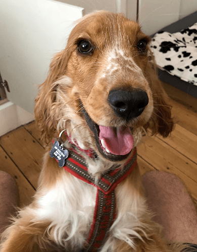

<html lang="en">

```{r setup, include=FALSE}
knitr::opts_chunk$set(
	echo = TRUE,
	message = FALSE,
	warning = FALSE
)

library(learnr) #necessary to render tutorial correctly

library(dplyr)
library(ggplot2)
library(Hmisc)
library(htmltools)
library(magrittr)

library(broom)
library(effectsize)
library(ggfortify)
library(modelbased)
library(parameters)
library(sandwich)

source("./www/discovr_helpers.R")


#Read data files needed for the tutorial

pupluv_tib <- discovr::puppy_love
cure_tib <- discovr::hangover
```

# discovr: Comparing adjusted means (GLM 2)

## Overview

<div class="infobox">
  
  
  **Usage:** This tutorial accompanies [Discovering Statistics Using R and RStudio](https://www.discovr.rocks/) [@field_discovering_2022] by [Andy Field](https://en.wikipedia.org/wiki/Andy_Field_(academic)). It contains material from the book so there are some copyright considerations but I offer them under a [Creative Commons Attribution-NonCommercial-NoDerivatives 4.0 International License](http://creativecommons.org/licenses/by-nc-nd/4.0/). Tl;dr: you can use this tutorial for teaching and non-profit activities but please don't meddle with it or claim it as your own work.
  
</div>

### `r cat_space(fill = "h3", height = 2)` Welcome to the `discovr` space pirate academy

Hi, welcome to **discovr** space pirate academy. Well done on embarking on this brave mission to planet `r rproj()`s, which is a bit like Mars, but a less red and more hostile environment. That's right, more hostile than a planet without water. Fear not though, the fact you are here means that you *can* master `r rproj()`, and before you know it you'll be as brilliant as our pirate leader Mae Jemstone (she's the badass with the gun). I am the space cat-det, and I will pop up to offer you tips along your journey.

On your way you will face many challenges, but follow Mae's system to keep yourself on track:

* `r bmu(height = 2)` This icon flags materials for *teleporters*. That's what we like to call the new cat-dets, you know, the ones who have just teleported into the academy. This material is the core knowledge that everyone arriving at space academy must learn and practice. For accessibility, these sections will also be labelled with [(1)]{.alt}.
* `r user_visor(height = 2)` Once you have been at space pirate academy for a while, you get your own funky visor. It has various modes. My favourite is the one that allows you to see everything as a large plate of tuna. More important, sections marked for cat-dets with visors goes beyond the core material but is still important and should be studied by all cat-dets. However, try not to be disheartened if you find it difficult. For accessibility, these sections will also be labelled with [(2)]{.alt}.
* `r user_astronaut(height = 2)` Those almost as brilliant as Mae (because no-one is quite as brilliant as her) get their own space suits so that they can go on space pirate adventures. They get to shout *RRRRRR* really loudly too. Actually, everyone here gets to should *RRRRRR* really loudly. Try it now. Go on. It feels good. Anyway, this material is the most advanced and you can consider it optional unless you are a postgraduate cat-det. For accessibility, these sections will also be labelled with [(3)]{.alt}.

It's not just me that's here to help though, you will meet other characters along the way:

* `r alien(height = 2)` aliens love dropping down onto the planet and probing humanoids. Unfortunately you'll find them probing you quite a lot with little coding challenges. Helps is at hand though. 
* `r robot(height = 2)` **bend-R** is our coding robot. She will help you to try out bits of `r rproj()` by writing the code for you before you encounter each coding challenge.
* `r bug(height = 2)` we also have our friendly alien bugs that will, erm, help you to avoid bugs in your code by highlighting common mistakes that even Mae Jemstone sometimes makes (but don't tell her I said that or my tuna supply will end). 

Also, use hints and solutions to guide you through the exercises (Figure 1).

<figure>

<figcaption>Figure 1: In a code exercise click the hints button to guide you through the exercise.</figcaption>
</figure> 
 

By for now and good luck - you'll be amazing!

### Workflow

* Before attempting this tutorial it's a good idea to work through [this tutorial on how to install, set up and work within `r rproj()` and `r rstudio()`](http://milton-the-cat.rocks/learnr/r/r_getting_started/).

* The tutorials are self-contained (you practice code in code boxes). However, so you get practice at working in `r rstudio()` I strongly recommend that you create an `r rproj()` markdown file within an `r rstudio()` project and practice everything you do in the tutorial in the `r rproj()` markdown file, make notes on things that confused you or that you want to remember, and save it. Within this markdown file you will need to load the relevant packages and data. 


### Packages

This tutorial uses the following packages:

* `broom` [@robinsonBroomConvertStatistical2019]
* `effectsize` [@makowski_compute_2020]
* `here` [@here]
* `modelbased` [@makowski_modelbased_2020]
* `parameters` [@makowski_parameters_2019]
* `sandwich` [@zeileis_econometric_2004]
* `tidyverse` [@tidyverse]

I try to follow the [Google `r rproj()` style guide](https://google.github.io/styleguide/Rguide.html) and [tidyverse style guide](https://style.tidyverse.org/) in always declaring the package when using a function: `package::function()`. For example, if I want to use the `mutate()` function from the package `dplyr`, I will write `dplyr::mutate()`. 

It is good practice to be explicit about packages to avoid clashes where functions from different packages have the same name. It also means that you don't need to load packages at the start of your markdown document. 

There are two main exceptions to this rule.

1. There are functions within some `tidyverse` packages that would be used within other functions. Including the package name makes the code difficult to read. Also, no-one wants to write `ggplot2::` before every function from `ggplot2`.
2. To use the pipe operator (`%>%`) you need to have `magrittr` loaded.

We can load all of the packages that are exceptions in one step by loading `tidyverse` at the beginning of our `r rproj()` Markdown document:

```{r eval = FALSE}
library(tidyverse)
```

### Data

To work *outside of this tutorial* you need to download the following data files:

* [puppy_love.csv](https://www.discovr.rocks/csv/puppy_love.csv)
* [hangover.csv](https://www.discovr.rocks/csv/hangover.csv)

Set up an `r rstudio()` project in the way that [I recommend in this tutorial](http://milton-the-cat.rocks/learnr/r/r_getting_started/#section-working-in-rstudio), and save the data files to the folder within your project called [data]{.alt}. Place this code in the first code chunk in your `r rproj()` Markdown document:

```{r, eval=FALSE}
pupluv_tib <- here::here("data/puppy_love.csv") %>%
  readr::read_csv() %>%
  dplyr::mutate(
    dose = forcats::as_factor(dose)
  )
```

This code reads in the data and converts the variable **dose** to a factor (categorical variable). For the hangover data use the code:

```{r, eval=FALSE}
cure_tib <- here::here("data/hangover.csv") %>%
  readr::read_csv() %>%
  dplyr::mutate(
    drink = forcats::as_factor(drink) %>% forcats::fct_relevel(., "Water", "Lucozade", "Cola")
  )
```

This code reads in the data and converts the variable **drink** to a factor (categorical variable) and sets the order of the levels of **drink** to match this tutorial.

## `r bmu()` Puppy love! [(1)]{.alt}

The main example in this tutorial extends the example about puppy therapy from **discovr_11**. On the assumption that you can't have enough puppies in your life, here's another picture of my dog looking cute to help you to deal with the psychological trauma of this statistics tutorial.

<figure>

<figcaption>Figure 2: Milton the spaniel says 'there's no need to be afraid, just tickle the belly of statistics and it will love you forever.</figcaption>
</figure> 

The previous tutorial focussed on an example in which a researcher tested the efficacy of puppy therapy by exposing different groups of randomly-assigned people to (1) a no puppies control group; (2) 15 minutes of puppy therapy; and (3) 30 minutes of puppy contact. The dependent variable was a measure of happiness ranging from 0 (as unhappy as I can possibly imagine being) to 10 (as happy as I can possibly imagine being). The researchers who conducted the puppy therapy study realized that a participant’s love of dogs could affect whether puppy therapy affected happiness. Therefore, they replicated the study on different participants, but included a self-report measure of love of puppies from 0 (I am a weird person who hates puppies, please be deeply suspicious of me) to 7 (puppies are the best thing ever, one day I might marry one). The data are in [pupluv_tib]{.alt}, which contains the variables **id** (the participant’s id code), **dose** (1 = control, 2 = 15 minutes, 3 = 30 minutes), **happiness** (the person’s happiness on a scale from 0-10), and **puppy_love** (the love of puppies from 0 to 7)

#### `r alien()` Alien coding challenge

View the data in [pupluv_tib]{.alt}.

```{r pupluv_tib, exercise = TRUE, exercise.lines = 2}

```

```{r pupluv_tib-solution}
pupluv_tib
```

Note that there are four variables: the participant's **id**, which is a character variable (note the [<chr>]{.alt} under the name), the **dose** of puppy therapy, which is a factor (note the [<fct>]{.alt} under the name), and the happiness score which is numeric and has the data type 'double' (note the [<dbl>]{.alt} under the name) and their love of puppies (**puppy_love**), which also has the data type 'double'.

The variable **dose** is a factor (categorical variable), so having read the data file and converted it to a factor it's a good idea to check that the levels of **dose** are in the order that we want: Control, 15 minutes, 30 minutes.

#### `r alien()` Alien coding challenge

Using what you've learnt in previous tutorials check the order of the levels of the variable **dose**.

```{r chk_levels, exercise = TRUE, exercise.lines = 2}

```

```{r chk_levels-hint-1}
# use this function:

levels()
```

```{r chk_levels-hint-2}
# Remember that to access a variable you use:

name_of_tibble$name_of_variable
```

```{r chk_levels-hint-3}
# solution:

levels(pupluv_tib$dose)
```

Because I have set up the data within this tutorial you should see that the levels are listed in the order that we want them (No puppies, 15 minutes, 30 minutes) when you execute the code.

```{r quiz_fct_relevel, echo = FALSE}
quiz(caption = "Changing the order of factor levels",
     question("If the levels of dose were in the wrong order what function could we use to reorder the levels?",
    answer("`forcats::fct_relevel()`", correct = T, message = "Specifically, we could use this code: `pupluv_tib <- pupluv_tib %>% \n dplyr::mutate(dose = forcats::fct_relevel(dose, \"No puppies\", \"15 mins\", \"30 mins\"))`"),
    answer("`forcats::reorder()`", message = ""),
    answer("`dplyr::fct_levels()`", message = ""),
    correct = "Correct - well done!",
    random_answer_order = TRUE,
    allow_retry = T
    )
)
```

## `r bmu()` Exploring the data [(1)]{.alt}

#### `r alien()` Alien coding challenge

Use what you already know to compute the mean and a 95% confidence interval of happiness scores split by the therapy group to which a person belonged.

```{r pupluv_sum, exercise = TRUE, exercise.lines = 7}

```

```{r pupluv_sum-hint-1}
# Start by piping the tibble into the group_by function to group output by dose:
pupluv_tib %>% 
  dplyr::group_by(dose)
# Now pipe the results into the summarize() function
```

```{r pupluv_sum-hint-2}
# Pipe the results into the summarize() function
pupluv_tib %>% 
  dplyr::group_by(dose) %>% 
  dplyr::summarize()
# Within summarize(), use the mean() function to create a variable that is the mean happiness score
```

```{r pupluv_sum-hint-3}
# Use the mean() function to create a variable that is the mean happiness score:
pupluv_tib %>% 
  dplyr::group_by(dose) %>% 
  dplyr::summarize(
    mean = mean(happiness, na.rm = TRUE)
  )
# Add two more rows that use mean_cl_normal to calculate the lower and upper boundary of the 95% confidence interval
```

```{r pupluv_sum-hint-4}
# Solution
pupluv_tib %>% 
  dplyr::group_by(dose) %>% 
  dplyr::summarize(
    mean = mean(happiness, na.rm = TRUE),
    `95% CI lower` = mean_cl_normal(happiness)$ymin,
    `95% CI upper` = mean_cl_normal(happiness)$ymax
  )
```

Note that the mean happiness is very similar in the 15- and 30-minute groups and higher in these groups than the no puppies control.

## `r bmu()` The model [(1)]{.alt}

As a reminder, we discovered in **discov_11** that we can include categorical predictors using dummy variables. In the simplest form, we can use dummy coding in which group membership is expressed in terms of 0s and 1s as in Table 1.

```{r dummy_tbl, echo = FALSE, results = 'asis'}
dummy_tbl <- tibble(
  `Group` = c("No puppies (control)", "15 minutes", "30 minutes"),
  `Dummy 1 (long)` = c(0, 0, 1),
  `Dummy 2 (short)` = c(0, 1, 0)
  )

knitr::kable(dummy_tbl, caption = "Table 1: Dummy coding for the three-group puppy therapy study")
```

The model we fitted in the previous tutorial (in which we compared means across the three groups without adjusting for the love of puppies) involved predicting happiness from the two dummy variables in Table 1, which represent the difference between the 15-minute group and the control (**short**) and the 30-minute group and the no puppies control (**long**):

$$
\hat{\text{happiness}}_i = \hat{b}_0 + \hat{b}_1\text{long}_i+ \hat{b}_2\text{short}_i + e_i
$$
A person’s happiness is predicted from knowing their group membership (i.e., the numeric values for the long and short dummy variables in Table 1) and the estimates of the parameters for these effects and the intercept ($b_0$). This equation can be extended to include a continuous predictor (sometimes referred to as a [covariate]{.alt}) by adding this variable and assigning it a parameter (a *b*). In this case, to include the variable **puppy_love** the model is extended to:

$$
\hat{\text{happiness}}_i = \hat{b}_0 + \hat{b}_1\text{long}_i+ \hat{b}_2\text{short}_i + \hat{b}_3\text{puppy love}_i + e_i
$$

#### `r alien()` Alien coding challenge

Use the `lm()` function to fit the model in the equation above (the one that included **puppy_love**).

<div class="tip">
  `r cat_space()` **Tip**
  
  Remember that `r rproj()` will dummy code **dose** for you, so you don't need to create the variables **long** and **short** in the equation, you simply need to enter **dose** as a predictor. Remember to use `broom::tidy()` to show the model parameters.
</div>

```{r pupcov_lm, exercise = TRUE, exercise.lines = 2}

```

```{r pupcov_lm-hint-1}
# fit the model (replace the xs):
lm(xxx ~ xxxx + xxxx, data = xxxx)
```

```{r pupcov_lm-hint-2}
# fit the model:
lm(happiness ~ puppy_love + dose, data = pupluv_tib)
# now summarize it with broom::tidy()
```

```{r pupcov_lm-hint-3}
# Solution:
lm(happiness ~ puppy_love + dose, data = pupluv_tib) %>% 
  broom::tidy(., conf.int = TRUE)
```

Congratulations, you have fit a model that looks at the effect of doses of puppy therapy adjusting the means in each group for how much people love puppies. I wanted to show you that to fit a model that adjusts means for other predictors is really just a matter of extending the models that we have already fitted to include extra predictors. Unfortunately, there are some other things we need to think about.

The basic process for fitting a model that compares means while adjusting for a continuous variable (covariate) is as follows:

1. Assess the independence of the covariate (not a statistical requirement but helps with interpretation)
2. Think about sums of squares and (usually) set orthogonal contrasts
3. Fit the model and look at overall effects with *F*-statistics
4. Look at the model parameter estimates and adjusted means
5. Check the model diagnostics and possibly fit a robust version of the model.
6. Assess homogeneity of regression slopes

## `r bmu()` Independence of the covariate  [(1)]{.alt}

The first issue is whether the covariate is independent of the categorical predictor. Although independence is not a statistical condition, it is easier to interpret the categorical predictor if we know that levels of the covariate are similar across the categories. We can test this by simply fitting a model, using `lm()` that predicts the covariate from the categorical predictor. If the categorical predictor does not significantly predict the covariate then they can be thought of as relatively independent (notwithstanding that significance will depend on sample size).


#### `r alien()` Alien coding challenge

Use the `lm()` function to fit a model in which the covariate (**puppy_love**) is predicted from **dose**, and summarize the effect of dose with an *F*-statistic.

<div class="tip">
  `r cat_space()` **Tip**

Remember that we can summarize the overall effect of a categorical predictor using `anova()`

</div>


```{r cov_ind, exercise = TRUE, exercise.lines = 2}

```

```{r cov_ind-hint-1}
# fit the model (replace the xs):
luvdose_lm <- lm(xxx ~ xxxx, data = xxxx)
```

```{r cov_ind-hint-2}
# fit the model:
luvdose_lm <- lm(puppy_love ~ dose, data = pupluv_tib)
# now summarize it with anova()
```

```{r cov_ind-hint-3}
# Solution:
luvdose_lm <- lm(puppy_love ~ dose, data = pupluv_tib) 
anova(luvdose_lm)
```

The main effect of dose is not significant, *F*(2, 27) = 1.98, *p* = 0.158, which shows that the average level of love of puppies was (statistically speaking) roughly the same in the three puppy therapy groups. In other words, the means for love of puppies are not significantly different across the control, 15- and 30-minute groups. This result is good news for using love of puppies as a covariate to adjust the means in the model.

## `r user_visor()` *F*-statistics with multiple predictors  [(2)]{.alt}

We have seen how the *F*-statistic is used to evaluate the overall fit of a linear model, we’ve also seen that it can be used to look at the overall effect of a predictor: in the previous tutorial we used it to evaluate the overall effect of the puppy therapy group to which a person was assigned on happiness ratings. However, when we use the *F*-statistic to evaluate the unique contribution of more than one predictor to a model we need to be mindful of how *F* is calculated.

### `r user_astronaut()` An optional demonstration  [(3)]{.alt}

To illustrate the problem, here's a little demonstration.

#### `r alien()` Alien coding challenge

The code box contains the model that we have already fitted above, which predicts happiness from **puppy_love** and **dose**, but pipes it into `anova()` to get an *F*-statistic for each predictor. In the same code box, underneath the existing code, fit the same model but change the order of predictors so that **dose** is listed before **puppy_love**. Execute the code.

```{r f_stat, exercise = TRUE, exercise.lines = 6}
lm(happiness ~ puppy_love + dose, data = pupluv_tib) %>% 
  anova()


```

```{r f_stat-solution}
lm(happiness ~ puppy_love + dose, data = pupluv_tib) %>% 
  anova()

lm(happiness ~ dose + puppy_love, data = pupluv_tib) %>% 
  anova()
```

Note that when we specify **puppy_love** as the first predictor then, according to the *F*-statistic, it doesn’t have a significant effect but **dose** does, but if we specify it second then **puppy_love** has a significant effect but **dose** doesn’t. In other words, we get different values of the sums of squares, *F*s and *p*s. If you look at the parameter estimates using `broom::tidy()` (and their significance tests), you'll see that they are the same for the two models, but for the *F*-statistics the order that you specify predictors matters.

### `r user_visor()` Type III sums of squares [(2)]{.alt}

The sums of squares on which the *F*-statistic is based can be calculated in different ways. By default, *F* is computed using Type I, or sequential, sums of squares. This means that any predictor entered into the model is evaluated after predictors before it in the model. Hence, order matters: if you specify the model as [happiness ~ puppy_love + dose]{.alt} then **puppy_love** is evaluated as the only term in the model whereas if you specify the model as [happiness ~ dose + puppy_love ]{.alt} then, because it is listed after **dose**, it is evaluated after the effect of **dose** has already been entered into the model and evaluated. For this reason, Type I sums of squares tend not to be used to evaluate hypothesis about main effects and interactions (because the order of predictors changes the results).

Typically then, when evaluating the overall effect of several predictors in a model using *F*-statistics we tend to use Type III sums of squares. Type III sums of squares differ from Type I in that all effects are evaluated taking into consideration all other effects in the model (not just the ones entered before). As such, the order that you specify predictors doesn't affect the results. (There's a more nuanced discussion of sums of squares in the book.)

```{r ssl_quiz, echo = F}
question("What's the pragmatic difference between Type I and Type III sums of squares",
         answer("For Type III sums of squares the order that you specify predictors doesn't affect the resulting sums of squares, for Type I sums of squares it does.",  correct = TRUE, message = "Well done, this answer is correct."),
         answer("For Type I sums of squares the order that you specify predictors doesn't affect the resulting sums of squares, for Type III sums of squares it does.", message = "Unlucky, try again."),
         allow_retry = TRUE,
         random_answer_order = TRUE
)
```

For Type III sums of squares to be correctly calculated you must specify an orthogonal contrast for any categorical predictors. Orthogonal is just a posh word for independent. Thinking back to the previous tutorial and chapter, if you follow the rules for contrast coding you will get orthogonal contrasts. Also,  Helmert contrasts obtained using `contr.helmert()` are orthogonal (but might not compare the groups that interest you).

<div class="tip">
  `r cat_space()` **Tip: Type III sums of squares**

If you want to use Type III sums of squares then you **must** set orthogonal contrasts, you cannot, for example, enter the categorical predictor and let `r rproj()` do dummy coding for you.

</div>


## `r user_visor()` Orthogonal contrasts [(2)]{.alt}

We've just discovered that to use Type III sums of squares we **must** set orthogonal contrasts. In the previous tutorial, we predicted that any form of puppy therapy should be better (i.e. higher happiness scores) than the no puppies condition and that as exposure time increases happiness will increase too (a dose-response hypothesis). We operationalized these hypotheses as two dummy variables using the contrast coding in Table 2.

```{r con_tbl, echo = FALSE, results = 'asis'}
con_tbl <- tibble(
  `Group` = c("No puppies (control)", "15 minutes", "30 minutes"),
  `Dummy 1 (No puppies vs. puppies)` = c("-2/3", "1/3", "1/3"),
  `Dummy 2 (15 mins vs 30 mins)` = c("0", "1/2", "-1/2")
  )

knitr::kable(con_tbl, caption = "Table 2: Contrast coding for the puppy example")
```

As revision from the chapter, when using this coding scheme the model we're fitting is:

$$
\hat{\text{happiness}}_i = \hat{b}_0 + \hat{b}_1\text{contrast 1}_i+ \hat{b}_2\text{contrast 2}_i + e_i
$$

In which the variables **contrast 1** and **contrast 2** are the dummy variables that represents the no puppies group compared to all other groups (**contrast 1**), and the difference between the 15-minute group and the 30-minute group (**contrast 2**). These contrasts are orthogonal, so if we set these, we can use Type III sums of squares.

#### `r robot()` Code example

We also learnt that we can set these contrasts for **dose** using the `contrast()` (go back over **discovr_11** if this code doesn't make sense to you):

```{r, eval = F}
puppy_vs_none <- c(-2/3, 1/3, 1/3)
short_vs_long <- c(0, -1/2, 1/2)
contrasts(pupluv_tib$dose) <- cbind(puppy_vs_none, short_vs_long)
```

If we didn't have specific hypotheses to test, or we had hypotheses that couldn't be operationalized as orthogonal contrasts, then for the purpose of getting Type III sums of squares we could just set a Helmert contrast:

```{r, eval = F}
contrasts(categorical_variable) <- contr.helmert(n)
```

In which [categorical_variable]{.alt} is the variable for which you're setting a contrast, and [n]{.alt} is the number of levels of that variable. So, for **dose**, which has three levels, we'd execute:

```{r, eval = F}
contrasts(pupluv_tib$dose) <- contr.helmert(3)
```

#### `r alien()` Alien coding challenge

Use the code from the example to set the contrasts in Table 2 for **dose**.

```{r set_contrast, exercise = TRUE}
     
               
```

```{r set_contrast-hint-1}
# Set the weights for the first contrast using the example code:
puppy_vs_none <- c(-2/3, 1/3, 1/3)
# Now set the weights for the second contrast
```

```{r set_contrast-hint-2}
# Set the weights for the second contrast:
short_vs_long <- c(0, -1/2, 1/2)
# Next, set the two contrasts to the dose variable
```

```{r set_contrast-hint-3}
# Set the two contrasts to the dose variable:
contrasts(pupluv_tib$dose) <- cbind(puppy_vs_none, short_vs_long)
# Finally, view the weights to check they are set correctly
```

```{r set_contrast-hint-4}
# Put it all together:
puppy_vs_none <- c(-2/3, 1/3, 1/3)
short_vs_long <- c(0, -1/2, 1/2)
contrasts(pupluv_tib$dose) <- cbind(puppy_vs_none, short_vs_long)
contrasts(pupluv_tib$dose) # This line prints the contrast weights so we can check them
```

## `r user_visor()` Fitting the model [(2)]{.alt}

Having set orthogonal contrasts, we can fit the model and then use the `car::Anova()` function to get Type III sums of squares for the overall effects.

#### `r robot()` Code example

To get *F*-statistics based on Type III sums of squares we can use the following general code:

```{r, eval = F}
car::Anova(my_model, type = 3)
```

So, you create a model using `lm()` in the usual way, then within `Anova()` replace [my_model]{.alt} with the name of the model you have just created. You specify Type III sums of squares by including [type = 3]{.alt} or [type = "III"]{.alt}.

#### `r alien()` Alien coding challenge

Use the `lm()` function to fit a model in which **happiness** is predicted from the covariate (**puppy_love**) and **dose**, and summarize the effects with *F*-statistics based on Type III sums of squares.

```{r pupluv_oc}
puppy_vs_none <- c(-2/3, 1/3, 1/3)
short_vs_long <- c(0, -1/2, 1/2)
contrasts(pupluv_tib$dose) <- cbind(puppy_vs_none, short_vs_long)
```

```{r pup_luv_III, exercise = TRUE, exercise.lines = 2, exercise.setup = "pupluv_oc"}

```

```{r pup_luv_III-hint-1}
# fit the model (replace the xs):
pupluv_lm <- lm(xxx ~ xxxx, data = xxxx)
```

```{r pup_luv_III-hint-2}
# fit the model:
pupluv_lm <- lm(happiness ~ puppy_love + dose, data = pupluv_tib)
# now summarize it with car::Anova()
```

```{r pup_luv_III-hint-3}
# Solution:
pupluv_lm <- lm(happiness ~ puppy_love + dose, data = pupluv_tib)
car::Anova(pupluv_lm, type = 3)
```

Looking first at the significance values, the covariate significantly predicts the dependent variable (*p* = 0.035, which is less than 0.05). Therefore, the person’s happiness is significantly influenced by their love of puppies. What’s more interesting is that when the effect of love of puppies is removed, the effect of puppy therapy is significant (*p* = 0.027, which is less than 0.05).

```{r quiz_p_ex1, echo = FALSE}
quiz(
  question("The effect of **dose** in the output tells us about whether the means differ across the therapy groups. What does the value of 0.027 mean?",
    answer("It is the probability of getting a value of *F* at least as big as 4.142 if the null hypothesis were true (i.e. if the means for the three therapy groups were identical).", correct = T),
    answer("It is the probability that the *F* value of 4.142 has occurred by chance", message = "*p*-values do not tell us whether results occur by chance."),
    answer("It is the probability that the means of the three therapy groups are identical", message = "*p*-values do not tell us about the probability of the null hypothesis"),
    answer("It is the probability that the means of the three therapy groups are not identical", message = "*p*-values do not tell us about the probability of the alternative hypothesis"),
    correct = "Correct - well done!",
    random_answer_order = TRUE,
    allow_retry = T
  )
)
```

#### `r alien()` Alien coding challenge (optional)

Refit the model in the previous challenge but reverse the order of **dose** and **puppy_love** in the code. You should see that the resulting output is unchanged because we have used Type III sums of squares.

```{r pup_luv_IIIb, exercise = TRUE, exercise.lines = 2, exercise.setup = "pupluv_oc"}

```

```{r pup_luv_IIIb-solution}
pupluv_lm <- lm(happiness ~ dose + puppy_love, data = pupluv_tib)
car::Anova(pupluv_lm, type = 3)
```

## `r user_visor()` Adjusted means [(2)]{.alt}

Earlier on we computed the group means. They're displayed again for you in Table 3.

```{r results = 'asis', echo = FALSE}
pupluv_tib %>% 
  dplyr::group_by(dose) %>% 
  dplyr::summarize(
    mean = mean(happiness, na.rm = TRUE),
    `95% CI lower` = mean_cl_normal(happiness)$ymin,
    `95% CI upper` = mean_cl_normal(happiness)$ymax
  ) %>% 
  knitr::kable(caption = "Table 3: Unadjusted mean (and 95% CI) happiness scores in each therapy group", digits = 2)
```

Based on Table 3, you might think that the significant *F*-statistic for **dose** reflects a difference between the control group and the two experimental groups (because the 15- and 30-minute groups have very similar means, 4.88 and 4.85, whereas the control group mean is much lower at 3.22). However, we can’t use these means to interpret the effect because they have not been adjusted for the effect of the covariate.

#### `r robot()` Code example

To get the means adjusted for the covariate we use the `modelbased::estimate_means()` function, which takes the general form:

```{r, eval = F}
modelbased::estimate_means(my_model, levels = "predictors", fixed = "covariates", ci = 0.95)
```

We replace [my_model]{.alt} the name of the model into the function, then optionally specify these arguments:

* [levels = "predictors"]{.alt}: the predictor(s) over which you want to compute means. In our case, we want means for the variable **dose**, so we could specify [levels = "dose"]{.alt}.
* [fixed = "covariates"]{.alt}: the predictor(s) that you want to remain fixed (i.e. the variables that you want to adjust the means by). In our case, we want adjust means by the variable **puppy_love**, so we could specify [fixed = "puppy_love"]{.alt}.
* [ci = 0.95]{.alt}: specifies the width of the confidence interval. It defaults to a 95% confidence interval so if you’re happy with that you can leave this argument out.

Although we can explicitly set the [levels]{.alt} and [fixed]{.alt} arguments, we don’t need to in this case because the predicted means from the model will be the adjusted means. However, it is useful to specify the [fixed]{.alt} argument because doing so means that the output includes the value of the covariate at which the means are being adjusted. In other words, it will show us the mean level of **puppy_love.**.

#### `r alien()` Alien coding challenge

Adapt the sample code to get the adjusted means for the model [pupluv_lm]{.alt}.

```{r pupluv_lm}
puppy_vs_none <- c(-2/3, 1/3, 1/3)
short_vs_long <- c(0, -1/2, 1/2)
contrasts(pupluv_tib$dose) <- cbind(puppy_vs_none, short_vs_long)

pupluv_lm <- lm(happiness ~ puppy_love + dose, data = pupluv_tib)
```


```{r adj_m, exercise = TRUE, exercise.lines = 2, exercise.setup = "pupluv_lm"}

```

```{r adj_m-hint-1}
# Replace the xs:
modelbased::estimate_means(xxxxxxx, fixed = "xxxxxx")
```

```{r adj_m-hint-2}
# Solution:
modelbased::estimate_means(pupluv_lm, fixed = "puppy_love")
```

From these adjusted means you can see that happiness increased across the three doses.

## `r user_visor()` Parameter estimates [(2)]{.alt}

We can view the parameter estimates in the usual way using `broom::tidy()`:

#### `r alien()` Alien coding challenge

View the parameter estimates for the model [pupluv_lm]{.alt}.

```{r pupluv_coef, exercise = TRUE, exercise.lines = 5, exercise.setup = "pupluv_lm"}

```

```{r pupluv_coef-hint-1}
# Replace the xs:
broom::tidy(xxxxxx, conf.int = xxxxxx)
```

```{r pupluv_coef-hint-2}
# Solution (basic):
broom::tidy(pupluv_lm, conf.int = TRUE)
```

```{r pupluv_coef-hint-3}
# Solution (advanced). To round values:
broom::tidy(pupluv_lm, conf.int = TRUE) %>% 
  dplyr::mutate(
    dplyr::across(where(is.numeric), ~round(., 3))
  )
```

```{r quiz_cov_ex1, echo = FALSE}
quiz(caption = "Interpreting the covariate (level 2)",
  question("How would you interpret the effect of the covariate?",
    answer("There is a significant relationship between the love of puppies and happiness: as love of puppies increases, happiness scores increase also", correct = TRUE, message = "The *t*-statistic and *p*-value tell us that the relationship between the love of puppies and happiness is significant, and the value of *b* is positive (0.416) indicating that as love of puppies increases so does happiness. A negative coefficient would mean the opposite: as one increases, the other decreases."),
    answer("As love of puppies increases, happiness does not change significantly", message = "The *t*-statistic and *p*-value tell us that the relationship between the love of puppies and happiness *is* significant."),
    answer("There is a significant relationship between the love of puppies and happiness: as love of puppies increases, happiness scores decrease", message = "The value of *b* is positive (0.416) indicating that as love of puppies increases so does happiness."),
    correct = "Correct - well done!",
    random_answer_order = TRUE,
    allow_retry = T
  )
)
```


Moving onto the dummy variables, the first one (**dosepuppy_vs_none**) compares the control group with the 15- and 30-minute groups combined. Using the contrast codes that we have used, the *b*-value is the difference between the adjusted mean of the control group and the average of the adjusted means for the 15- and 30-minute groups. The associated *t*-statistic is significant (*p* = 0.010), indicating that the control group was significantly different from the combined adjusted mean of the puppy therapy groups. The *b*-value for the second dummy variable (**doseshort_vs_long**) is the difference between the adjusted means of the 15- and 30-minute groups. The associated *t*-statistic is not significant (*p* = 0.593), indicating that the 30-minute group did not produce significantly different happiness than the 15-minute group after adjusting for love of puppies.

<div class="tip">
  `r cat_space()` **Tip: Raw effect sizes**

The *b*s in this output are raw effect sizes. I can’t stress enough how useful it can be to interpret these. For example, the difference in happiness in the no puppy group compared to the combined puppy groups was about 2. So, happiness was 2 points higher on the scale (which ranged from 0-10), on average, for those who had some puppy therapy compared to those that didn’t. You can evaluate for yourself whether this difference is meaningful based on what we might know about the happiness scale.

</div>


## `r user_visor()` *Post hoc* tests [(2)]{.alt}

We can obtain *post hoc* tests in the same way that we did in **discovr_11** when we fitted the same model but without the covariate. Basically, we use the `modelbased::estimate_contrasts()` function and, like when we used the the `estimate_means()` function earlier we can optionally specify the covariate as a fixed variable so that the output shows us the value at which other effects are evaluated.

#### `r alien()` Alien coding challenge

View *post hoc* for the model [pupluv_lm]{.alt}.

<div class="tip">
  `r cat_space()` **Tip: `estimate_contrasts()`**

Remember that the `estimate_contrasts()` function takes the general form:

```{r eval = F, class.source = '.panel_alt'}
modelbased::estimate_contrasts(my_model, adjust = "holm", ci = 0.95, fixed = "covariate_name")
```
</div>


```{r pupluv_ph, exercise = TRUE, exercise.lines = 2, exercise.setup = "pupluv_lm"}

```

```{r pupluv_ph-hint-1}
# Replace the xs:
modelbased::estimate_contrasts(xxxxxx, fixed = "xxxxxx")
```

```{r pupluv_ph-hint-2}
# Solution (basic):
modelbased::estimate_contrasts(pupluv_lm, fixed = "puppy_love")
```

The results show the Holm corrected (the default) *post hoc* comparisons. There is a significant difference between the adjusted mean happiness in the no puppies group and the 30-minute group (*p* = 0.031) groups, but not between the no puppies and 15-minute group (*p* = 0.091) or between the 30- and 15-minute groups (*p* = 0.593). Note that the value of *Difference* is the difference between the adjusted means. The column labelled *puppy_love* reminds us that all differences are evaluated at average levels of puppy love, in other words, when puppy love equals 2.73.

We also have standardized versions of the differences (**Std_Difference**, you might need to click the little arrow on the top right of the table to see this column) between adjusted means in the dose groups. We can use these values as effect size measures. For example, means in the no puppy group were 0.91 of a standard deviation lower than in the 15-minute group and 1.14 standard deviations lower than the 30-minute group. These are fairly large effects.


## `r bmu()` Homogeneity of regression slopes [(1)]{.alt}

Next we need to evaluate the assumption of homogeneity of regression slopes, which is the basically that the relationship between the covariate and outcome is similar across categories of the categorical predictor. In this model, we're interested in whether the relationship between **puppy_love** and **happiness** is similar in the no puppies, 15-minute and 30-minute groups.

#### `r robot()` Code example

To test the assumption of homogeneity of regression slopes we need to re-fit the model but include the interaction between the covariate and categorical predictor. We can refit the model from scratch:

```{r, eval = F}
hors_lm <- lm(happiness ~ puppy_love*dose, data = pupluv_tib)
```

Or use the `update()` function to add the interaction term to the previous model:

```{r, eval = F}
hors_lm <- update(pupluv_lm, .~. + dose:puppy_love)
```

The update function takes the model containing the effects of dose and puppy_love ([pupluv_lm]{.alt}) and updates it. Remember that `.~.` means *keep the outcome variable and all of the predictors* and , and `+ dose:puppy_love` means *add the dose × puppy_love interaction*.

<div class="tip">
  `r cat_space()` **Tip: Specifying interactions**

Remember from **discovr_10** that `*` is used to specify all main effects and interactions whereas `:` is used to specify only an interaction.

* `puppy_love*dose` specifies the effects of **puppy_love**, *dose* and the **dose × puppy_love** interaction
* `puppy_love:dose` specifies the **dose × puppy_love** interaction

</div>

#### `r alien()` Alien coding challenge

Re-specify the model to include the **dose × puppy_love** interaction (use either method above) and look at the *F*-statistic with Type III sums of squares.


```{r hors, exercise = TRUE, exercise.lines = 2, exercise.setup = "pupluv_lm"}

```

```{r hors-solution}
hors_lm <- lm(happiness ~ puppy_love*dose, data = pupluv_tib) 
car::Anova(hors_lm, type = 3)
# or
hors_lm <- update(pupluv_lm, .~. + dose:puppy_love)
car::Anova(hors_lm, type = 3)
```

The effects of the dose of puppy therapy and love of puppies are still significant, but so is the covariate by outcome interaction (**dose × puppy_love**), implying that the assumption of homogeneity of regression slopes is not realistic (*p* = 0.028).


### `r bmu()` Diagnostic plots [(1)]{.alt}

As with any linear model, we can use the `plot()` function to produce diagnostic plots from the model.

<div class="tip">
  `r cat_space()` **Tip: Diagnostic plots**

Remember that `plot()` takes this general form:

```{r eval = FALSE, class.source = '.panel_alt'}
plot(my_model, which = numbers_of_the_plots_you_want)
```

You can also use `ggplot2::autoplot()` to make pretty versions of the plot. To use this function outside of the tutorial remember to execute `library(ggfortify)`
</div>

#### `r alien()` Alien coding challenge

Obtain plots 1, 3, 2 and 4 (in that order) for the model [pupluv_lm]{.alt}.

```{r pup_zpred_resid, exercise = TRUE, exercise.lines = 2, exercise.setup = "pupluv_lm"}

```

```{r pup_zpred_resid-solution}
plot(pupluv_lm, which = c(1, 3, 2, 4))

# or to get  a nicely formatted plots
# library(ggfortify)  # outside of this tutorial you'll need this

ggplot2::autoplot(pupluv_lm,
                  which = c(1, 3, 2, 4),
                  colour = "#5c97bf",
                  smooth.colour = "#ef4836",
                  alpha = 0.5,
                  size = 1) + 
  theme_minimal()
```

```{r quiz_zresid_ex1, echo = FALSE}
quiz(caption = "Diagnostic plot quiz (level 2)",
  question("How would you interpret the *Residual vs. fitted* and *Scale-location* plots?",
    answer("We’re in trouble: I see heteroscedasticity.", correct = TRUE, message = "The red line on the scale-location plot slopes up and the cloud of dots seems to fan out on both plots indicating heteroscedasticity."),
    answer("I'm not sure, give me a hint.", message = "Heteroscedasticity is shown up by a red line that isn't flat and a vertical spread of dots that changes as you move along the *x*-axis."),
    answer("Everything is fine - residuals show homogeneity.", message = "Unlucky. Clue: Heteroscedasticity is shown up by a red line that isn't flat and a vertical spread of dots that changes as you move along the *x*-axis."),
    correct = "Correct - well done!",
    random_answer_order = TRUE,
    allow_retry = T
  ),
  question("Based on the Q-Q plot, can we assume normality of the residuals?",
    answer("Yes", message = "The dots on the Q-Q plot seem to deviate from the line at the extremes, which indicates a non-normal distribution."),
    answer("No", correct = TRUE),
    answer("Give me a clue", message = "If residuals are normally distributed then the dots on the Q-Q plot should cling lovingly to the diagonal line."),
    correct = "Correct - Well done!",
    random_answer_order = TRUE,
    allow_retry = T
  ),
  question("Based on the plot of Cook's distance, are there any influential cases?",
    answer("Yes", message = "The largest Cook's distance needs to be above about 1 before we'd worry."),
    answer("No", correct = TRUE),
    answer("Maybe", message = "Sorry, you're not allowed to sit on the fence!"),
    correct = "Correct - The largest Cook's distance is about 0.2 which is well below the threshold of 1 at which we'd worry. well done!",
    random_answer_order = TRUE,
    allow_retry = T
  )
)
```


## `r user_visor()` Robust models [(2)]{.alt} 

As for previous linear models(e.g., in **discovr_08** and **discovr_11**), we can get robust parameter estimates using `robust::lmRob()` and robust tests of these parameters using `parameters::model_parameters()`.

#### `r alien()` Alien coding challenge

Remember that we use `lmRob` in exactly the same way as `lm()`. Use this function to fit a robust version of the model that predicts **happiness** from **dose** and **puppy_love**. Call the model [pupluv_rob]{.alt} and remember to get the summary statistics using `summary()`.

```{r pupluv_lmrob, exercise = TRUE, exercise.lines = 2, exercise.setup = "pupluv_oc"}

```

```{r pupluv_lmrob-solution}
pupluv_rob <- robust::lmRob(happiness ~ puppy_love + dose, data = pupluv_tib)
summary(pupluv_rob)
```

The bottom of the output shows significance tests of bias. These tests suggest that bias in the original model is not problematic (because the *p*-value for these tests are not significant), but these tests are based on small samples and so have low power. More important, the robust parameter estimates have changed and are all non-significant (compare with the non-robust model). For example, for the covariate the estimate has changed from 0.42 to 0.63 and the significance value is now 0.287 instead of 0.035. For the dummy variable that compares no puppies to puppies, the *b* has decreased from 2.01 to 1.63 and the *p*-value has increased from 0.01 to 0.385.

#### `r alien()` Alien coding challenge

Remember from **discovr_08** that to get a summary of an existing model like [pupluv_lm]{.alt} that uses heteroscedasticity-consistent standard errors (i.e. robust significance tests and confidence intervals), we put the model into `model_parameters()` and set [robust = TRUE, vcov.type = "HC4", digits = 3]{.alt}. Try this in the code box:

```{r pupp_hc4, exercise = TRUE, exercise.lines = 2, exercise.setup = "pupluv_lm"}

```

```{r pupp_hc4-solution}
parameters::model_parameters(pupluv_lm, robust = TRUE, vcov.type = "HC4", digits = 3)
```

We see a different picture when we fit the model with heteroskedasticity-consistent standard errors. The parameter estimates will match the non-robust model but the standard errors, *p*-values and confidence intervals change because these are based on methods robust to heteroscedasticity (the HC4 estimates that we asked for). We can interpret the effects for dose in the same way as for the regular *p*-values and confidence intervals. For the effect of puppy love, The HC4 robust confidence interval and *p*-value supports the conclusion from the non-robust model: the *p*-value is 0.046, which less than 0.05, and the confidence interval does not contain zero (0.01, 0.82).

Given the small sample size, we might also consider a bootstrap model of the parameter estimates and their confidence intervals and significance tests. We can obtain these using the `bootstrap_parameters()` function from `parameters`, which takes the general form:

```{r eval = F}
parameters::bootstrap_parameters(my_model)
```

In which we replace [my_model]{.alt} with the name of the object containing the nonrobust model (in this case [pupluv_lm]{.alt})


#### `r alien()` Alien coding challenge

Bootstrap the model :

```{r pupp_boot, exercise = TRUE, exercise.lines = 2, exercise.setup = "pupluv_lm"}

```

```{r pupp_boot-solution}
parameters::bootstrap_parameters(pupluv_lm)
```

The estimates themselves are quite similar to those from the non-robust model: the effect of puppy love on happiness is now non-significant, and the effect of puppies compared to none is significant.

```{r quiz_boot_ex1, echo = FALSE}
quiz(caption = "Bootstrapping (level 2)",
  question("The bootstrap confidence interval for the *b* for **puppy_love** ranges from $-0.01$ to $0.70$ (Your values may differ slightly becauseof how bootstrapping works). What does this tell us?",
    answer("If this confidence interval is one of the 95% that contains the population value then the population value of the *b* lies between -0.01 and 0.70.", correct = TRUE),
    answer("There is a 95% chance that the population *b* lies between -0.01 and 0.70.", message = "You cannot make probability statements from a confidence interval. We don't know whether this particular CI is one of the 95% that contains the population value of the *b* or not."),
    answer("The probability of this confidence interval containing the population value is 0.95.", message = "The probability of this confidence interval containing the population value is either 0 (it doesn't) or 1 (it does) but it's impossible to know which."),
    answer("I can be 95% confident that the population value of the *b* lies between -0.01 and 0.70.", message = "Confidence intervals do not quantify your subjective confidence."),
    correct = "Correct - well done!",
    random_answer_order = TRUE,
    allow_retry = T
  ),
  question("Which of the following statements about bootstrap confidence intervals is true?",
    answer("Bootstrap confidence intervals do not assume a normal sampling distribution.", correct = T, message = "This statement is true: bootstrapping is a technique from which the sampling distribution of a statistic is estimated *empirically* from the data so no assumptions about its shape are made."),
    answer("Bootstrap confidence intervals are unnecessary in small samples", message = "Small samples are actually where bootstrap confidence intervals are *most* useful."),
    answer("Bootstrap confidence intervals always tell us something about population values.", message = "The probability of any confidence interval containing the population value is either 0 (it doesn't) or 1 (it does) but it's impossible to know which. So, although an interval might be telling giving us the population value, it might not, and we have no way of knowing whether or not it does. So, it's certainly not true that they *always* tell us about population values."),
    answer("Conventional confidence intervals are more robust to outliers than bootstrap confidence intervals.", message = "Other things being equal, the opposite should be true."),
    correct = "Correct - well done!",
    random_answer_order = TRUE,
    allow_retry = T
  )
)
```


## `r user_astronaut()` Effect sizes [(3)]{.alt}

We have talked about effect sizes for specific effects at various other points in this tutorial. We can also obtain effect sizes for the overall effect of a predictor (i.e. effect sizes that relate to the *F*-statistics for each predictor).

#### `r robot()` Code example

We can use the `eta_squared()` and `omega_squared()` functions from the `effectsize` package [@makowski_compute_2020], which take the general form:

```{r, eval = F}
effectsize::eta_squared(anova_object, partial = TRUE, ci = 0.9)
effectsize::omega_squared(anova_object, partial = TRUE, ci = 0.9)
```

All we do is put the ANOVA object into the function (or pipe it in). By default you’ll get partial eta-squared ($\eta^2_p$) and partial omega-squared ($\omega^2_p$), but you can get the non-partial version by setting [partial = FALSE]{.alt}, and you’ll get a 90% confidence interval, which you might want to change to some other value.

#### `r alien()` Alien coding challenge

The function uses the sums of squares from the object that is passed into it, so it’s safest to re-use our earlier code with `car::Anova()` where we set the sums of squares and pipe it into the function. Try this below.

```{r eta, exercise = TRUE, exercise.lines = 2, exercise.setup = "pupluv_lm"}
car::Anova(pupluv_lm, type = 3) %>% 
  effectsize::eta_squared(., ci = 0.95)
```

These values show that puppy therapy condition explains 24% of the variance in happiness not attributable to other variables, which is sizeable. Love of puppies explains 16%, which is also a lot. Partial eta squared is the most straightforward measure to explain, but like eta squared it is biased and so it’s typically better to use partial omega squared ($\omega^2_p$), which is an unbiased version.

#### `r alien()` Alien coding challenge

Use the code example to compute partial omega squared for the predictors in [pupluv_lm]{.alt}.

```{r omega, exercise = TRUE, exercise.lines = 2, exercise.setup = "pupluv_lm"}

```

```{r omega-hint-1}
# begin with the anova part of the model
car::Anova(pupluv_lm, type = 3) %>% 
```

```{r omega-hint-2}
# Pipe it into omega_squared() 
car::Anova(pupluv_lm, type = 3) %>% 
  effectsize::omega_squared(., ci = 0.95)
```


The effect sizes are slightly smaller than (as we’d expect) using omega-squared. The puppy therapy condition explains 17% of the variance in happiness not attributable to other variables, and love of puppies explains 12%, both of which are still sizeable amounts of variance for social science data.


## `r user_astronaut()` Bayes factors [(3)]{.alt}

Like in previous tutorials (**discovr_08**, **discovr_09**, **discovr_11**) we can use the `BayesFactor` package [@morey_bayesfactor_2018]. In this scenario we use the `lmBF()` function.

#### `r robot()` Code example

the `lmBF()` function has basically the same format as the `BayesFactor::anovaBF()` function, which we met in **discovr_11**:

```{r, eval = FALSE}
my_model <- BayesFactor::lmBF(formula = outcome ~ predictor, data = my_tib, rscaleFixed = "medium", rscaleCont = "medium")
```

Like the `anovaBF()` function, `lmBF()` uses default priors for categorical variables ([rscaleFixed]{.alt}) that can be specified as a number or as "medium" (the default), "wide", and "ultrawide". These labels correspond to *r* scale values of 1/2, $^\sqrt{2}/_2$, and 1. To set the prior for the covariate (a continuous predictor) we use a new argument [rscaleCont]{.alt}, which is set using a value or with pre-set values of "medium", "wide", and "ultrawide", which correspond *r* scales of $^\sqrt{2}/_4$, ^1/_2, and $^\sqrt{2}/_2$. Note these values are different to the corresponding values for [rscaleFixed]{.alt}. 

We could, therefore, obtain a Bayes factor for the entire model with the following code:

```{r, eval = FALSE}
pup_bf <-  BayesFactor::lmBF(formula = happiness ~ puppy_love + dose, data = pupluv_tib, rscaleCont = "medium", rscaleFixed = "medium")
```

However, this Bayes factor isn't particularly interesting because it evaluates the model in its entirety. We are probably more interested in quantifying the effect of **dose** above and beyond love of puppies. To do this we can find the Bayes factor for the model containing only the covariate (love of puppies) and compare it to the Bayes factor for the model that also includes *dose*. We'd do this as follows:

```{r, eval = FALSE}
pupcov_bf <-  BayesFactor::lmBF(formula = happiness ~ puppy_love, data = pupluv_tib, rscaleFixed = "medium", rscaleCont = "medium")

pupcov_bf

pup_bf <-  BayesFactor::lmBF(formula = happiness ~ puppy_love + dose, data = pupluv_tib, rscaleCont = "medium", rscaleFixed = "medium")

pup_bf/pupcov_bf
```

The first bit of code creates an object called [pupcov_bf]{.alt} that contains the Bayes factor for the model containing **puppy_love** compared to the model containing only the intercept (i.e. no predictors). We view this object by executing `pupcov_bf`. The third bit of code creates an object called [pup_bf]{.alt} that contains the Bayes factor for the model containing **puppy_love** and **dose** compared to the model containing only the intercept (i.e. no predictors). However, we want the Bayes factor for the model containing **puppy_love** and **dose** compared to the model containing **puppy_love**. We get this using the code `pup_bf/pupcov_bf`.

#### `r alien()` Alien coding challenge

Use the sample code to obtain BayesFactors for the model containing **puppy_love** only (and view it), the model containing **puppy_love** and **dose** and the comparison of the two. Use default medium priors for both predictors.

```{r pupp_bf, exercise = TRUE, exercise.lines = 8}

```

```{r pupp_bf-hint-1}
## Create the object that contains the Bayes factor for the model containing **puppy_love**:

pupcov_bf <-  BayesFactor::lmBF(formula = happiness ~ puppy_love, data = pupluv_tib, rscaleFixed = "medium", rscaleCont = "medium")
```

```{r pupp_bf-hint-2}
## View the first model's Bayes factor:

pupcov_bf
```

```{r pupp_bf-hint-3}
## Create the object that contains the Bayes factor for the model containing **puppy_love** and **dose**:

pup_bf <-  BayesFactor::lmBF(formula = happiness ~ puppy_love + dose, data = pupluv_tib, rscaleCont = "medium", rscaleFixed = "medium")
```

```{r pupp_bf-hint-4}
## View the Bayes factor for the model containing **puppy_love** and **dose** compared to the model containing **puppy_love**:

pup_bf/pupcov_bf
```

```{r pupp_bf-hint-5}
## Full solution:
pupcov_bf <-  BayesFactor::lmBF(formula = happiness ~ puppy_love, data = pupluv_tib, rscaleFixed = "medium", rscaleCont = "medium")

pupcov_bf

pup_bf <-  BayesFactor::lmBF(formula = happiness ~ puppy_love + dose, data = pupluv_tib, rscaleCont = "medium", rscaleFixed = "medium")

pup_bf/pupcov_bf
```
Looking at the first Bayes factor, the data are 0.68 times more likely under the alternative hypothesis (happiness is predicted from love of puppies) than under the null (love of puppies does not predict happiness). Our beliefs that love of puppies affects happiness (relative to not) should increase by a factor of about 0.68 – in other words it should get smaller and move towards the null. However, this value is fairly is very weak evidence.

Looking at the second Bayes factor, The data are 2.1 times more likely under the model that predicts happiness from dose of therapy and love of puppies than under the model that predicts happiness from love of puppies alone. In other words, our beliefs that puppy therapy if efficacious (relative to not) should increase by a factor of about 2 (not particularly strong evidence).


## `r user_visor()` Transfer task [(2)]{.alt}

### Give me the cure

A marketing manager tested the benefit of soft drinks for curing hangovers. He took 15 people and got them drunk. The next morning as they awoke, dehydrated and feeling as though they'd licked a camel's sandy feet clean with their tongue, he gave five of them water to drink, five of them Lucozade (a very nice glucose-based UK drink) and the remaining five a leading brand of cola (this variable is called **drink**). He measured how well they felt (on a scale from 0 = I feel like death to 10 = I feel really full of beans and healthy) two hours later (this variable is called **well**). He measured how **drunk** the person got the night before on a scale of 0 = as sober as a nun to 10 = flapping about like a haddock out of water on the floor in a puddle of their own vomit. The data are preloaded in [cure_tib]{.alt}. Fit a model to see whether people felt better after different drinks when adjusting for how drunk they were the night before. The researcher predicted that sugary-drinks (Lucozade/Cola) would increase wellness compared to water and that Lucozade drinkers will have higher happiness scores than cola drinkers.

<div class="tip">
  `r cat_space()` **Tip**

There is a detailed solution to this task at [https://www.discovr.rocks/solutions/alex/alex_12/#task-123](https://www.discovr.rocks/solutions/alex/alex_12/#task-123).
</div>


```{r quiz_con_hulk, echo = FALSE}
question("What contrast codes would you use to test the hypotheses?",
    answer("**Contrast 1**: Water (-2/3), Lucozade (1/3), Cola (1/3); **Contrast 2**: Water (0), Lucozade (-1/2), Cola (1/2)", correct = T),
    answer("**Contrast 1**: Water (0), Lucozade (-1/2), Cola (1/2)", message = "With 2 groups you would need 2 contrasts to partition the variance fully. This answer is correct for the second contrast."),
    answer("**Contrast 1**: Water (-2/3), Lucozade (1/3), Cola (1/3); **Contrast 2**: Water (-2/3), Lucozade (-1/2), Cola (1/2)", message = "These contrasts are not independent."),
    answer("**Contrast 1**: Water (-2/3), Lucozade (0), Cola (0); **Contrast 2**: Water (0), Lucozade (-1/2), Cola (1/2)", message = "Contrast 1 compares water to nothing."),
    answer("I literally have no clue", message = "Use the hints."),
    correct = "Correct - well done!",
    incorrect = "Good try.",
    random_answer_order = TRUE,
    allow_retry = T
)
```

To get you started ... to test our main hypotheses we need to first enter the codes for the contrasts in Table 4. Contrast 1 tests hypothesis 1: sugary-drinks (Lucozade/Cola) would increase wellness compared to water. In the table, the numbers assigned to the groups are the number of groups in the opposite chunk divided by the number of groups that have non-zero codes, and we randomly assigned one chunk to be a negative value. Contrast 2 tests hypothesis 2: Lucozade drinkers will have higher happiness scores than cola drinkers.

```{r cure_tbl, echo = FALSE, results = 'asis'}
con_tbl <- tibble(
  `Group` = c("Water", "Lucozade", "Cola"),
  `Contrast 1 (Sugar vs. none)` = c("-2/3", "1/3", "1/3"),
  `Contrast 2 (Lucozade vs. Cola)` = c("0", "-1/2", "1/2")
  )

knitr::kable(con_tbl, caption = "Table 4: Contrast coding for the hangover example")
```

#### `r alien()` Alien coding challenge

Use the code box to set the contrasts.

```{r cure_asw, exercise = TRUE, exercise.lines = 4}

```

```{r cure_asw-hint-1}
# Start by defining the contrasts:

sugar_vs_none <- c(x, x, x)
lucoz_vs_cola <- c(x, x, x)

# Now assign these variables to the contrast attached to the variable hero
```

```{r cure_asw-hint-2}
# Assign these variables to the contrast attached to the variable hero

sugar_vs_none <- c(-2/3, 1/3, 1/3)
lucoz_vs_cola <- c(0, -1/2, 1/2)

contrasts(cure_tib$drink) <- cbind(sugar_vs_none, lucoz_vs_cola)
contrasts(cure_tib$drink) # To view the contrasts
```


#### `r alien()` Alien coding challenge

Use the code box to test that the predictor variable (drink) and the covariate (drunk) are independent.

```{r cure_ind, exercise = TRUE, exercise.lines = 4}

```

```{r cure_ind-hint-1}
# Fill in the xs:
drunk_lm <- lm(xxx ~ xxxx, data = xxxx)
anova(xxxx)
```

```{r cure_ind-hint-2}
# Solution:

drunk_lm <- lm(drunk ~ drink, data = cure_tib)
anova(drunk_lm)
```

```{r cov_ind_ug, echo = FALSE}
quiz(caption = "Independence of the covariate (level 1)",
  question("Are the predictor variable (drink) and the covariate (drunk) independent?",
    answer("Yes.", correct = T, message = "The output shows that the main effect of drink is not significant, F(2, 12) = 1.35, p = 0.295, which shows that the average level of drunkenness the night before was roughly the same in the three drink groups, which suggests that they are independent."),
    answer("No.", message = "The output shows that the main effect of drink is not significant, F(2, 12) = 1.35, p = 0.295, which shows that the average level of drunkenness the night before was roughly the same in the three drink groups, which suggests that they are independent."),
    correct = "Correct - well done!",
    incorrect = "Good try.",
    random_answer_order = TRUE,
    allow_retry = T
  )
)
```

#### `r alien()` Alien coding challenge

Use the code box to fit and look at the main model and the parameter estimates and obtain adjusted means for the effect of **drink**. Call the model [cure_lm]{.alt}.

```{r cure_oc}
sugar_vs_none <- c(-2/3, 1/3, 1/3)
lucoz_vs_cola <- c(0, -1/2, 1/2)

contrasts(cure_tib$drink) <- cbind(sugar_vs_none, lucoz_vs_cola)
```


```{r cure_main, exercise = TRUE, exercise.lines = 6, exercise.setup = "cure_oc"}

```

```{r cure_main-hint-1}
# Fill in the xs:
cure_lm <- lm(xxx ~ xxx + xxx, data = xxxx)
car::Anova(xxxx, type = 3)
```

```{r cure_main-hint-2}
# The main model will be:
cure_lm <- lm(well ~ drunk + drink, data = cure_tib)
car::Anova(cure_lm, type = 3)
# Use tidy() to look at the parameter estimates
```

```{r cure_main-hint-3}
# Use tidy() to look at the parameter estimates:
broom::tidy(cure_lm, conf.int = TRUE)

# get adjusted means with modelbased::estimate_means()
```

```{r cure_main-hint-4}
# Full solution:
cure_lm <- lm(well ~ drunk + drink, data = cure_tib)
car::Anova(cure_lm, type = 3)

broom::tidy(cure_lm, conf.int = TRUE)

modelbased::estimate_means(cure_lm, fixed = "drunk")
```

```{r cure_main_qz, echo = FALSE}
quiz(caption = "Hangover cure quiz (level 2)",
  question("How would you interpret the effect of the covariate?",
    answer("How drunk the person got significantly predicted how well they felt. The more they drank, the worse they felt.", correct = T, message = "The parameter estimate of -0.55 tells us that the relationship is negative - the more you drink, the lower your wellness. The *p*-values for *F* and *t* are below 0.05 so at conventional significance levels the effect is significantly different to 0."),
    answer("How drunk the person got significantly predicted how well they felt. The more they drank, the better they felt.", message = "The parameter estimate of -0.55 tells us that the relationship is negative - the more you drink, the lower your wellness."),
    answer("How drunk the person got did not significantly predict how well they felt.", message = "The *p*-value for the effect is less than 0.001, which would typically be interpreted as *significant*"),
    answer("Give me a clue", message = "Look at the effect labelled **drunk** in the tables. Look at the values of *p* andthe value of the estimate itself to tell you thedirection of the effect."),
    correct = "Correct - well done!",
    incorrect = "Good try.",
    random_answer_order = TRUE,
    allow_retry = T
  ),
  question("How would you interpret the main effect of the type of drink?",
    answer("The type of drink significantly predicted how well they felt after adjusting for how drunk they got the night before.", correct = T),
    answer("The type of drink significantly predicted how well they felt.", message = "True, but to be more precise we need to consider the fact we have a covariate in the model too."),
    answer("The type of drink did not significantly predict how well they felt.", message = "The *p*-value for the effect is less than 0.05, which would typically be interpreted as *significant*"),
    answer("Give me a clue", message = "Look at the effect labelled **drink** in the tables and the values of *p* to indicate significance."),
    correct = "Correct - well done!",
    incorrect = "Good try.",
    random_answer_order = TRUE,
    allow_retry = T
    ),
  question("Using the adjusted means interpret the main effect of the type of drink?",
    answer("Wellness scores were higher after Lucozade than the other two drinks", correct = T),
    answer("Wellness scores were all 3.40 in the three groups", message = "You're looking at mean of the covariate."),
    answer("Tell me a joke", message = "A cat walks into a bar and orders a pint of fish. The bar person says \'Sorry, but we don't serve fish\'. The cat replies \'That's OK, I'm a cat\'."),
    correct = "Correct - well done!",
    random_answer_order = TRUE,
    allow_retry = T
    ),
  question("How would you interpret the contrasts (labelled **drinksugar_vs_none** and **drinklucoz_vs_cola** if you followed the solutions)?",
    answer("After adjusting for how drunk the person was, wellness scores were not significantly different after sugary drinks than after water, but were significantly higher in the Lucozade group compared to cola.", correct = T),
    answer("After adjusting for how drunk the person was, wellness scores were not significantly different after sugary drinks than after water, and were not significantly different in the Lucozade group compared to cola.", message = "Look at the significance value for the second contrast again."),
    answer("After adjusting for how drunk the person was, wellness scores were significantly higher after sugary drinks than after water, and were significantly higher in the Lucozade group compared to cola.", message = "Look at the *p*-value for the first contrast again. Remember that if the significance value is less than 0.05 that will typically be seen as *significant*."),
    answer("After adjusting for how drunk the person was, wellness scores were significantly higher after sugary drinks than after water, but were not significantly different in the Lucozade group compared to cola.", message = "Look at the significance value for both contrasts again. Remember that if the significance value is less than 0.05 that will typically be seen as *significant*."),
    correct = "Correct - well done!",
    random_answer_order = TRUE,
    allow_retry = T
  )
)
```

#### `r alien()` Alien coding challenge

Use the code box to get diagnostic plots for [cure_lm]{.alt}.

```{r cure_lm}
sugar_vs_none <- c(-2/3, 1/3, 1/3)
lucoz_vs_cola <- c(0, -1/2, 1/2)

contrasts(cure_tib$drink) <- cbind(sugar_vs_none, lucoz_vs_cola)
cure_lm <- lm(well ~ drunk + drink, data = cure_tib)
```


```{r cure_diag, exercise = TRUE, exercise.lines = 6, exercise.setup = "cure_lm"}

```

```{r cure_diag-solution}
plot(cure_lm, which = c(1, 3, 2, 4))

# Or for pretty plots

ggplot2::autoplot(cure_lm,
                  which = c(1, 3, 2, 4),
                  colour = "#5c97bf",
                  smooth.colour = "#ef4836",
                  alpha = 0.5,
                  size = 1) + 
  theme_minimal()
```

```{r cure_diag_qz, echo = FALSE}
quiz(caption = "Diagnostic plot quiz (level 2)",
  question("How would you interpret the *Residual vs. fitted* and *Scale-location* plots?",
    answer("We’re in trouble: I see heteroscedasticity.", correct = TRUE, message = "The red line on the scale-location plot slopes up and the cloud of dots seems to fan out on both plots indicating heteroscedasticity."),
    answer("I'm not sure, give me a hint.", message = "Heteroscedasticity is shown up by a red line that isn't flat and a vertical spread of dots that changes as you move along the *x*-axis."),
    answer("Everything is fine - residuals show homogeneity.", message = "Unlucky. Clue: Heteroscedasticity is shown up by a red line that isn't flat and a vertical spread of dots that changes as you move along the *x*-axis."),
    correct = "Correct - well done!",
    random_answer_order = TRUE,
    allow_retry = T
  ),
  question("Based on the Q-Q plot, can we assume normality of the residuals?",
    answer("Yes", correct = TRUE, message = "The dots on the Q-Q plot don't seem to deviate from the line, which indicates a normal distribution."),
    answer("No", message = "If residuals are normally distributed then the dots on the Q-Q plot should cling lovingly to the diagonal line."),
    answer("Give me a clue", message = "If residuals are normally distributed then the dots on the Q-Q plot should cling lovingly to the diagonal line."),
    correct = "Correct - Well done!",
    random_answer_order = TRUE,
    allow_retry = T
  ),
  question("Based on the plot of Cook's distance, are there any influential cases?",
    answer("Yes", message = "The largest Cook's distance needs to be above about 1 before we'd worry."),
    answer("No", correct = TRUE),
    answer("Maybe", message = "Sorry, you're not allowed to sit on the fence!"),
    correct = "Correct - The largest Cook's distance is about 0.4 which is well below the threshold of 1 at which we'd worry. well done!",
    random_answer_order = TRUE,
    allow_retry = T
  )
)
```

#### `r alien()` Alien coding challenge

Use the code box to get tests for the parameter estimates of [cure_lm]{.alt} that use heteroscedasticity-consistent standard errors (HC4).

```{r cure_hc4, exercise = TRUE, exercise.lines = 6, exercise.setup = "cure_lm"}

```

```{r cure_hc4-solution}
parameters::model_parameters(cure_lm, robust = TRUE, vcov.type = "HC4", digits = 3)
```

```{r cure_rob_qz, echo = FALSE}
quiz(caption = "Robust model quiz (level 2)",
  question("How would you interpret the robust contrasts (labelled **drinksugar_vs_none** and **drinklucoz_vs_cola** if you followed the solutions)?",
    answer("After adjusting for how drunk the person was, wellness scores were not significantly different after sugary drinks than after water, but were significantly higher in the Lucozade group compared to cola.", message = "Look at the significance value for the second contrast again."),
    answer("After adjusting for how drunk the person was, wellness scores were not significantly different after sugary drinks than after water, and were not significantly different in the Lucozade group compared to cola.", correct = TRUE),
    answer("After adjusting for how drunk the person was, wellness scores were significantly higher after sugary drinks than after water, and were significantly higher in the Lucozade group compared to cola.", message = "Look at the *p*-value for the first contrast again. Remember that if the significance value is less than 0.05 that will typically be seen as *significant*."),
    answer("After adjusting for how drunk the person was, wellness scores were not significantly different after sugary drinks than after water, and were significantly higher in the Lucozade group compared to cola.", message = "Look at the significance value for both contrasts again. Remember that if the significance value is less than 0.05 that will typically be seen as *significant*."),
    correct = "Correct - well done!",
    random_answer_order = TRUE,
    allow_retry = T
  )
)
```


<div class="infobox">
  
  
  **A message from Mae Jemstone:**
  
  Sometimes when we compare groups or categories we want to adjust for other variables. Last time I told you about when the directors of the space pirate academy wanted to see whether our students were happier with our courses than students at other pirate academies and I dropped raw borglesnark onto the other pirate academies to make their students miserable. When the results came in I was horrified to discover that some other academies had students happier than ours. *Now what?!* I thought. Of course I had forgotten about the academies in the *Solus of Telemark*. Beings in that part of the galaxy all evolved from cocker spaniels and have extremely sensitive noses that delight in disgusting smells. Raw borglesnark is like the smell of freshly baked bread to them. Of course, I needed to adjust happiness for the effects of raw borglesnark in my models. My plan was unravelling.
  You now know how to compare group means adjusting for other predictors. As with other models we have fitted, the process is simply an extension of the linear model, so we have had more practice of the skills we have acquired over the past few tutorials. The main additional consideration is thinking about using Type III sums of squares and making sure that we set orthogonal contrasts before we compute *F*. To interpret the categorical predictor we also needed to obtain the means adjusted for the other predictors.
</div>


## Resources {data-progressive=FALSE}

### Statistics

* The tutorials typically follow examples described in detail in @field_discovering_2022. That book covers the theoretical side of the statistical models, and has more depth on conducting and interpreting the models in these tutorials.
* If any of the statistical content doesn't make sense, you could try my more introductory book *An adventure in statistics* [@fieldAdventureStatisticsReality2016].
* There are free lectures and screencasts on my [YouTube channel](https://www.youtube.com/user/ProfAndyField/).
* There are free statistical resources on my websites [www.discoveringstatistics.com](http://www.discoveringstatistics.com) and [milton-the-cat.rocks](http://milton-the-cat.rocks).

### `r rproj("h3")`

* [R for data science](http://r4ds.had.co.nz/index.html) by @wickhamDataScience2017 is an open-access book by the creator of the tidyverse (Hadley Wickham). It covers the *tidyverse* and data management.
* [ModernDive](http://moderndive.com/index.html) is an open-access textbook on `r rproj("h3")` and `r rstudio()`.
* [`r rstudio()` cheat sheets](https://www.rstudio.com/resources/cheatsheets/).
* [`r rstudio()` list of online resources](https://www.rstudio.com/online-learning/).

### Acknowledgement

I'm extremely grateful to [Allison Horst](https://www.allisonhorst.com/) for her very informative blog post on [styling learnr tutorials with CSS](https://education.rstudio.com/blog/2020/05/learnr-for-remote/) and also for sending me a CSS template file and allowing me to adapt it. Without Allison, these tutorials would look a lot worse (but she can't be blamed for my colour scheme).

## References


