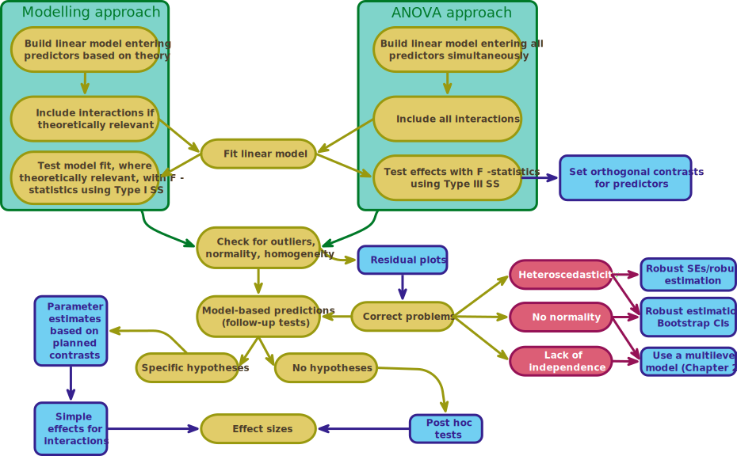

<html lang="en">

```{r setup, include=FALSE}
knitr::opts_chunk$set(
	echo = TRUE,
	message = FALSE,
	warning = FALSE
)

#necessary to render tutorial correctly
library(learnr) 
library(htmltools)
#easystats
library(datawizard)
library(effectsize)
library(insight)
library(modelbased)
library(parameters)
library(performance)
#tidyverse
library(dplyr)
library(forcats)
library(ggplot2)
#non tidyverse/easystats
#students don't use
library(knitr)
library(marginaleffects)
library(sandwich)

source("./www/discovr_helpers.R")


#Read data files needed for the tutorial

goggles_tib <- discovr::goggles
xbox_tib <- discovr::xbox |> 
  dplyr::mutate(
    game = as_factor(game) |> fct_relevel("Static"),
    console = as_factor(console) |> fct_relevel("Xbox One")
  )
```


# discovr factorial designs (GLM 3)

```{r, child = "./docs/intro.Rmd"}

```

## Packages {data-progressive=FALSE}

```{r, child = "./docs/packages.Rmd"}

```


## Data

```{r, child = "./docs/data.Rmd"}

```


## Fitting models

```{r, child = "./docs/fit_models.Rmd"}

```


## `r bmu()` Beer goggles [(B)]{.lbl}

The main example in this tutorial is from [@fielddsr22026], who uses an example of an experimental design with two independent variables (a two-way independent design). The study tested the prediction that subjective perceptions of physical attractiveness become inaccurate after drinking alcohol (the well-known beer-goggles effect). The example is based on research that looked at whether the beer-goggles effect was influenced by the attractiveness of the faces being rated [@chen_moderating_2014]. The logic is that alcohol consumption has been shown to reduce accuracy in symmetry judgements, and symmetric faces have been shown to be rated as more attractive. If the beer-goggles effect is driven by alcohol impairing symmetry judgements then you'd expect a stronger effect for unattractive (asymmetric) faces (because alcohol will affect the perception of asymmetry) than attractive (symmetric) ones. The data well analyse are fictional, but the results mimic the findings of this research paper.

An anthropologist was interested in the effects of facial attractiveness on the beer-goggles effect. She selected 48 participants who were randomly subdivided into three groups of 16: (1) a placebo group drank 500 ml of alcohol-free beer; (2) a low-dose group drank 500 ml of average strength beer (4% ABV); and (3) a high-dose group drank 500 ml of strong beer (7% ABV). Within each group, half (n = 8) rated the attractiveness of 50 photos of unattractive faces on a scale from 0 (pass me a paper bag) to 10 (pass me their phone number) and the remaining half rated 50 photos of attractive faces. The outcome for each participant was their median rating across the 50 photos (These photographs were from a larger pool of 500 that had been pre-rated by a different sample). The 50 photos with the highest and lowest ratings were used.). The data are in [goggles_tib]{.alt}, which contains the variables `facetype` (unattractive vs attractive), `alcohol` (placebo, low dose, high dose) and `attractiveness` (the median rating of each participant out of 10). Her hypotheses about attractiveness ratings were:

> - H~1~: Ratings will be higher for attractive compared to unattractive faces
> - H~2~: Ratings will be higher after alcohol compared to no alcohol
> - H~3~: Ratings will be higher after a high dose of alcohol compared to a low dose
> - H~4~: The effect of alcohol on ratings will depend on the type of face being rated (i.e. moderation)

The model we're fitting is described by the following equation:

$$
\begin{aligned}
Y_i & = \hat{b}_0 + \hat{b}_1X_i+ e_i\\
\text{attractiveness}_i & = \hat{b}_0 + \hat{b}_1\text{facetype}_i + \hat{b}_2\text{alcohol}_i + \hat{b}_3[\text{facetype} \times \text{alcohol}]_i + e_i
\end{aligned}
$$

In reality though `alcohol` would be split into two dummy variables that use contrast codes to compare groups. Specifically one contrast would look at all alcohol conditions compared top a placebo, and the second that compared the high alcohol content to the low.

$$
\begin{aligned}
Y_i & = \hat{b}_0 + \hat{b}_1X_i+ e_i\\
\text{attractiveness}_i & = \hat{b}_0 + \hat{b}_1\text{facetype}_i + \hat{b}_2\text{alcohol vs. none}_i +\hat{b}_3\text{high vs. low}_i + \\
&\quad  \hat{b}_4[\text{facetype} \times \text{alcohol vs. none}]_i + \\
&\quad \hat{b}_5[\text{facetype} \times \text{high vs. low}]_i + e_i
\end{aligned}
$$

We can follow our usual 5-step process for fitting models. However, we can approach the model fitting using a standard modelling approach or a more historical 'ANOVA' approach (Figure 4). In both approaches we fit the same model so the bulk of the process is the same. The main difference is that in a standard modelling approach we include interactions between predictors only if they are theoretically relevant, and we build the model up sequentially based on theory. In contrast, the 'ANOVA' approach is a specific implementation of the model for experimental designs and so all main effects and interactions are included (because the interactions are typically theoretically interesting) and all effects are evaluated simultaneously using *F*-statistics. This tutorial covers the standard modelling approach, for the ANOVA approach see `discovr_13_afex`.

<figure>

<figcaption>Figure 4: model fitting for factorial designs.</figcaption>
</figure>


## `r bmu()` Step 1: summarize [(A)]{.lbl}

<div class="stepbox">
  `r step()` **Step 1**

Get your data into `r rproj()` and pre-process using [tidyverse]{.pkg} packages or the [datawizard]{.pkg} package from [easystats]{.pkg}.
</div>


#### `r alien()` Alien coding challenge

View the data in [goggles_tib]{.alt}.

```{r goggles_tib, exercise = TRUE, exercise.lines = 2}

```

```{r goggles_tib-solution}
goggles_tib
```

Note that there are four variables: the participant's `id`, which is a character variable (note the `<chr>`] under the name), the `facetype` in the photo (unattractive or attractive) and the `alcohol` consumption (placebo, low or high), both of which are factors (note the `<fct>` under the names). Finally, the `attractiveness` score is numeric and has the data type 'double' (note the `<dbl>` under the name).

The variables `facetype` and `alcohol` are factors (categorical variable), so having read the data file and converted these variables to factors it's a good idea to check that the levels of these variables are in the order that we want: unattractive and attractive for `facetype` and placebo, low high for `alcohol`.

#### `r alien()` Alien coding challenge

Using what you've learnt in previous tutorials check the order of the levels of the variables `facetype` and `alcohol`.

```{r chk_levels, exercise = TRUE, exercise.lines = 3}

```

```{r chk_levels-hint-1}
# use this function:
levels()
```

```{r chk_levels-hint-2}
# Remember that to access a variable you use:
name_of_tibble$name_of_variable
```

```{r chk_levels-solution}
levels(goggles_tib$facetype)
levels(goggles_tib$alcohol)
```

Because I have set up the data within this tutorial you should see that the levels are listed in the order that we want them when you execute the code.


#### `r alien()` Alien coding challenge

Use what you already know to create a table of descriptive statistics (including 95% confidence intervals) of attractiveness scores split by the type of face in the stimulus and the alcohol consumption. Print this object rounding to 2 decimal places.

```{r goggles_sum, exercise = TRUE, exercise.lines = 7}

```

```{r goggles_sum-hint-1}
# Start by piping the tibble into the group_by function to group output by facetype and alcohol:
goggles_tib |> 
  group_by(dose)
# Now pipe the results into the describe_distribution() function
```

```{r goggles_sum-hint-2}
# Pipe the results into the describe_distribution() function
goggles_tib |> 
  group_by(facetype, alcohol) |> 
  describe_distribution(ci = 0.95)
# use a function to display the table to 2dp
```


```{r goggles_sum-solution}
# Solution
goggles_tib |> 
  group_by(facetype, alcohol) |> 
  describe_distribution(ci = 0.95) |> 
  display()
```


Note that the mean attractiveness is very similar across the doses of alcohol for the attractive faces, but varies in the unattractive faces.

## `r bmu()` Step 2: Visualize [(A)]{.lbl}

<div class="stepbox">
  `r step()` **Step 2**

Visualise the data using the [ggplot2]{.pkg} package from [tidyverse]{.pkg}.
</div>

#### `r alien()` Alien coding challenge

Use what you already know to plot the mean and a 95% confidence interval of attractiveness scores split by the type of face (*x*-axis) being rated and the alcohol consumption (colour).

```{r goggles_gg, exercise = TRUE, exercise.lines = 7}

```

```{r goggles_gg-hint-1}
# Start by setting up the plot (replace the xs):
ggplot2::ggplot(xxxxx, aes(x = xxxxx, y = xxxxx, colour = xxxxx)) 

```

```{r goggles_gg-hint-2}
# Now use stat_summary() to add the data (replace the xs)
ggplot2::ggplot(goggles_tib, aes(x = alcohol, y = attractiveness, colour = facetype)) +
  stat_summary(fun.data = "xxxxx", geom = "xxxxxx", position = position_xxxxx(width = 0.2))
```

```{r goggles_gg-hint-3}
# Use coord_cartesian() and scale_y_continuous to set the limits and breaks for the y-axis to be whole numbers between 0 and 10 (replace the xs):
ggplot2::ggplot(goggles_tib, aes(x = alcohol, y = attractiveness, colour = facetype)) +
  stat_summary(fun.data = "mean_cl_normal", geom = "pointrange", position = position_dodge(width = 0.2)) +
  coord_cartesian(xxxxxx) +
  scale_y_continuous(xxxxx)
```

```{r goggles_gg-hint-5}
# use labs() to add axis labels to the x, y and colour legend (replace xxxs):
ggplot2::ggplot(goggles_tib, aes(x = alcohol, y = attractiveness, colour = facetype)) +
  stat_summary(fun.data = "mean_cl_normal", geom = "pointrange", position = position_dodge(width = 0.2)) +
  coord_cartesian(ylim = c(0,10)) +
  scale_y_continuous(breaks = 0:10) +
  labs(x = "xxxxxxx", y = "xxxxxxx", xxxxx = "Type of face")
```

```{r goggles_gg-hint-6}
# add a theme (replace the xs):
ggplot2::ggplot(goggles_tib, aes(x = alcohol, y = attractiveness, colour = facetype)) +
  stat_summary(fun.data = "mean_cl_normal", geom = "pointrange", position = position_dodge(width = 0.2)) +
  coord_cartesian(ylim = c(0,10)) +
  scale_y_continuous(breaks = 0:10) +
  labs(x = "Alcohol consumption", y = "Attractiveness (0-10)", colour = "Type of face") +
  xxxxxx()
```

```{r goggles_gg-hint-7}
# Solution #1
ggplot2::ggplot(goggles_tib, aes(x = alcohol, y = attractiveness, colour = facetype)) +
  stat_summary(fun.data = "mean_cl_normal", geom = "pointrange", position = position_dodge(width = 0.2)) +
  coord_cartesian(ylim = c(0,10)) +
  scale_y_continuous(breaks = 0:10) +
  labs(x = "Alcohol consumption", y = "Attractiveness (0-10)", colour = "Type of face") +
  theme_minimal()
```

```{r goggles_gg-solution}
# In the book to make the image more accessible I (1) add the viridis colour scale (note the extra line of code); and (2) vary the shape by facetype
ggplot(goggles_tib, aes(x = alcohol, y = attractiveness, colour = facetype, shape = facetype)) +
  stat_summary(fun.data = "mean_cl_normal", geom = "pointrange", position = position_dodge(width = 0.2)) +
  coord_cartesian(ylim = c(0,8)) +
  scale_y_continuous(breaks = 0:8) +
  scale_colour_viridis_d(begin = 0.3, end = 0.85) +
  labs(x = "Alcohol consumption", y = "Attractiveness (0-10)", colour = "Facial stimulus", shape = "Facial stimulus") +
  theme_minimal()
```


Note again that the mean attractiveness is very similar across the doses of alcohol for the attractive faces, but varies in the unattractive faces.


## `r user_visor()` Step 3: Fit the model  [(B)]{.lbl}

Given we have run an experiment with specific hypotheses, our first job is to think about contrasts, or, put another way, enter a gateway to hell. Using a modelling approach we don't *have to* set orthogonal contrasts, but they will help us to test out substantive hypotheses. Let's assume the hypotheses about attractiveness ratings are:

> - H~1~: Ratings will be higher for attractive compared to unattractive faces
> - H~2~: Ratings will be higher after alcohol compared to no alcohol
> - H~3~: Ratings will be higher after a high dose of alcohol compared to a low dose
> - H~4~: The effect of alcohol on ratings will depend on the type of face being rated (i.e. moderation)

For the `alcohol` variable, we might set contrasts similar to the ones in `discovr_12`, by creating two dummy variables using the contrast coding in Table 1. Contrast 1 compares the two alcohol groups combined to the placebo, and the second contrast compares the high alcohol group to the low. Check back to `discovr_12` to understand these weights.

```{r con_tbl, echo = FALSE, results = 'asis'}
con_tbl <- tibble(
  `Group` = c("Placebo", "Low dose", "High dose"),
  `Dummy 1 (Alcohol vs. placebo)` = c("-2/3", "1/3", "1/3"),
  `Dummy 2 (High vs. low)` = c("0", "-1/2", "1/2")
  )

knitr::kable(con_tbl, caption = "Table 1: Contrast coding for the alcohol variable")
```

For the `facetype` variable we could use a contrast that compares the attractive to unattractive stimuli. If we follow the rules that we learnt about contrast coding we'd:

* Have $k-1$ contrasts, and with 2 groups that means a single contrast that compares unattractive (chunk 1) to attractive (chunk 2)
* Assign one chunk positive weights and the other negative.
* Assign an initial weight equal to the number of groups in the opposite chunk (1 in both cases)
* Assign a final weight by dividing the initial weight by the number of groups with non-zero weights (in this case 2)
* Therefore, we'd assign -1/2 to unattractive stimuli and 1/2 to attractive stimuli (or vice versa)

#### `r robot()` Code example

We can set these contrast using the following code:

```{r, eval = F}
# contrasts for alcohol
alcohol_vs_none <- c(-2/3, 1/3, 1/3)
high_vs_low <- c(0, -1/2, 1/2)
contrasts(goggles_tib$alcohol) <- cbind(alcohol_vs_none, high_vs_low)

# contrasts for facetype
att_vs_unatt <- c(-1/2, 1/2)
contrasts(goggles_tib$facetype) <- att_vs_unatt
```

The first four lines set the contrasts for the variable `alcohol` and the last two set the contrast for `facetype`.

#### `r alien()` Alien coding challenge

Try setting the contrasts described above and check that they have been set correctly.


```{r goggles_con, exercise = TRUE, exercise.lines = 12}

```

```{r goggles_con-hint-1}
# contrasts for alcohol
alcohol_vs_none <- c(-2/3, 1/3, 1/3)
high_vs_low <- c(0, -1/2, 1/2)
contrasts(goggles_tib$alcohol) <- cbind(alcohol_vs_none, high_vs_low)

# contrasts for facetype
att_vs_unatt <- c(-1/2, 1/2)
contrasts(goggles_tib$facetype) <- att_vs_unatt
# now use contrasts() to check the contrasts for each variable
```


```{r goggles_con-solution}
# contrasts for alcohol
alcohol_vs_none <- c(-2/3, 1/3, 1/3)
high_vs_low <- c(0, -1/2, 1/2)
contrasts(goggles_tib$alcohol) <- cbind(alcohol_vs_none, high_vs_low)

# contrasts for facetype
att_vs_unatt <- c(-1/2, 1/2)
contrasts(goggles_tib$facetype) <- att_vs_unatt

# check contrasts
contrasts(goggles_tib$alcohol) 
contrasts(goggles_tib$facetype)
```


```{r set_goggle_cons}
# contrasts for alcohol
alcohol_vs_none <- c(-2/3, 1/3, 1/3)
high_vs_low <- c(0, -1/2, 1/2)
contrasts(goggles_tib$alcohol) <- cbind(alcohol_vs_none, high_vs_low)

# contrasts for facetype
att_vs_unatt <- c(-1, 1)
contrasts(goggles_tib$facetype) <- att_vs_unatt
```


#### `r robot()` Code example

Having set the contrasts we can fit the model by building it up one effect at a time. However, we don't have a good theoretical reason to enter `alcohol` before `facetype` or vice versa, and our higher-order hypothesis is that the effect of `alcohol` is moderated by `facetype`. Therefore, we only really care about testing the interaction.

```{r, eval = F}
incpt_lm <- lm(attractiveness ~ 1, data = goggles_tib)
face_lm <- lm(attractiveness ~ facetype, data = goggles_tib)
alcohol_lm <- lm(attractiveness ~ facetype + alcohol, data = goggles_tib) 
goggles_lm <- lm(attractiveness ~ facetype*alcohol, data = goggles_tib)
```

The first model includes only the intercept ([incpt_lm]{.alt}), the next model adds the main effect of facetype ([face_lm]{.alt}), then we add the main effect of alcohol ([alcohol_lm]{.alt}), and finally we add the interaction term ([goggles_lm]{.alt}). Note that it was an arbitrary decision to put `facetype` in the model before `alcohol`.

<div class="infobox">
  `r info()` **Specifying interactions**

Remember that we can specify an interaction term within a model formula in `r rproj()` in two ways. Using the current variables of `facetype` and `alcohol`, the first is `facetype:alcohol`. Using this method we'd specify the model formula as:

```{r, eval = F, class.source = '.panel_alt'}
attractiveness ~ facetype + alcohol + facetype:alcohol
```

The second method uses a shorthand for adding all main effects and their interactions, which is `facetype*alcohol`. This code will introduce the main effect of `facetype`, the main effect of `alcohol` and their interaction. Using this method we'd specify the model formula as:

```{r, eval = F, class.source = '.panel_alt'}
attractiveness ~ facetype*alcohol
```

The two methods for specifying the model formula are interchangeable.

</div>

We can compare the models using `test_wald()`

```{r, eval = F}
test_wald(incpt_lm, face_lm, alcohol_lm, goggles_lm) |>
  display()
```


#### `r alien()` Alien coding challenge

Try fitting the models and comparing them as described above.

```{r goggles_fit, exercise = TRUE, exercise.lines = 8, exercise.setup = "set_goggle_cons"}

```

```{r goggles_fit-solution}
incpt_lm <- lm(attractiveness ~ 1, data = goggles_tib)
face_lm <- lm(attractiveness ~ facetype, data = goggles_tib)
alcohol_lm <- lm(attractiveness ~ facetype + alcohol, data = goggles_tib) 
goggles_lm <- lm(attractiveness ~ facetype*alcohol, data = goggles_tib)

test_wald(incpt_lm, face_lm, alcohol_lm, goggles_lm) |>
  display()
```

```{r, echo = F}
# contrasts for alcohol
alcohol_vs_none <- c(-2/3, 1/3, 1/3)
high_vs_low <- c(0, -1/2, 1/2)
contrasts(goggles_tib$alcohol) <- cbind(alcohol_vs_none, high_vs_low)

# contrasts for facetype
att_vs_unatt <- c(-1/2, 1/2)
contrasts(goggles_tib$facetype) <- att_vs_unatt

# fit models
incpt_lm <- lm(attractiveness ~ 1, data = goggles_tib)
face_lm <- lm(attractiveness ~ facetype, data = goggles_tib)
alcohol_lm <- lm(attractiveness ~ facetype + alcohol, data = goggles_tib) 
goggles_lm <- lm(attractiveness ~ facetype*alcohol, data = goggles_tib)

goggles_lrt <- test_wald(incpt_lm, face_lm, alcohol_lm, goggles_lm)
```


Remember that the results depend on the order in which we entered variables and the choice of whether to enter `facetype` or `alcohol` first was arbitrary. Therefore, we should not get excited by the results of these main effects. Instead, we focus on whether including the interaction term improved the model fit, and it did `r report_lrt(goggles_lrt, row = 4)`.

## `r bmu()` Step 4: Evaluate the model [(A)]{.lbl}

<div class="stepbox">
  `r step()` **Step 4**

Evaluate the model using a small number of functions from the [performance]{.pkg} package from [easystats]{.pkg}. Specially, we evaluate

- How well the model fits the data
- Whether the underlying assumptions of the model are met. If not, we refit the model using robust methods (see Figure 3).
 
</div>

```{r goggles_lm_setup}
# contrasts for alcohol
alcohol_vs_none <- c(-2/3, 1/3, 1/3)
high_vs_low <- c(0, -1/2, 1/2)
contrasts(goggles_tib$alcohol) <- cbind(alcohol_vs_none, high_vs_low)

# contrasts for facetype
att_vs_unatt <- c(-1/2, 1/2)
contrasts(goggles_tib$facetype) <- att_vs_unatt

goggles_lm <- lm(attractiveness ~ facetype*alcohol, data = goggles_tib)
```


#### `r alien()` Alien coding challenge

We can evaluate the model ([goggles_lm]{.alt}) in the usual way using `check_model()`. try this in the code box.

```{r goggles_zpred_resid, exercise = TRUE, exercise.lines = 3, exercise.setup = "goggles_lm_setup", fig.height = 10}

```

```{r goggles_zpred_resid-solution}
check_model(goggles_lm)
```


```{r quiz_zresid_ex1, echo = FALSE}
quiz(caption = "Diagnostic plot quiz (level 2)",
  question("How would you interpret the *Residual vs. fitted* and *Scale-location* plots?",
    answer("Were in trouble: I see heteroscedasticity.", message = "Unlucky. The green line on the scale-location plot is fairly flat and the vertical lines of dots seem similar in length as we move along the *x*-axis indicating homoscedasticity."),
    answer("I'm not sure, give me a hint.", message = "Heteroscedasticity is shown up by a green line that isn't flat and a vertical spread of dots that changes as you move along the *x*-axis."),
    answer("Everything is fine - residuals show homogeneity.", correct = TRUE, message = "Yes, the green line is fairly flat and the vertical spread of dots is similar as you move along the *x*-axis."),
    correct = "Correct - well done!",
    random_answer_order = TRUE,
    allow_retry = T
  ),
  question("Based on the Q-Q plot, can we assume normality of the residuals?",
    answer("Yes", correct = TRUE, message = "The dots on the Q-Q plot only deviate slightly from the line at the extremes, which probably indicates a roughly normal distribution."),
    answer("No", message = "The dots on the Q-Q plot only deviate slightly from the line at the extremes, which probably indicates a roughly normal distribution."),
    answer("Give me a clue", message = "If residuals are normally distributed then the dots on the Q-Q plot should cling lovingly to the line."),
    correct = "Correct - Well done!",
    random_answer_order = TRUE,
    allow_retry = T
  ),
  question("Based on the influence plot, are there any influential cases?",
    answer("Where have the countour lines gone?", message = "The contour lines that usually show Cook's distance are absent because they fall outside of the plotted area."),
    answer("No", correct = TRUE),
    answer("Maybe", message = "Sorry, you're not allowed to sit on the fence!"),
    correct = "Correct - The contour lines that usually show Cook's distance are absent because they fall outside of the plotted area. This tells us that all cases are within the desired bounds. Well done!",
    random_answer_order = TRUE,
    allow_retry = T
  )
)
```

## `r bmu()` Step 5: Interpret the model [(A)]{.lbl}

<div class="stepbox">
  `r step()` **Step 5**

Interpret the model

- Interpret the values that define the model (the [parameter estimates]{.alt}) using the [parameters]{.pkg} package from [easystats]{.pkg}.
- Make specific predictions from our model using the [modelbased]{.pkg} package from [easystats]{.pkg}.
 
</div>


#### `r alien()` Alien coding challenge

Use what you know already to inspect the parameter estimates of the model [goggles_lm]{.alt}, which you have just created.

```{r goggles_tidy, exercise = TRUE, exercise.lines = 3, exercise.setup = "goggles_lm_setup"}

```

```{r goggles_tidy-hint-1}
# Use model_parameters() from the parameters package
```

```{r goggles_tidy-solution}
model_parameters(goggles_lm) |>
  display()
```


```{r, echo = F}
goggles_par <- model_parameters(goggles_lm)
```

There are two key effects here:

* [facetype (1) × alcohol (alcohol_vs_none)]{.alt}. This effect compares the effect of contrast 1 for alcohol in the unattractive and attractive stimuli. Imagine we calculate the difference in attractiveness ratings when participants had alcohol (low and high combined) compared to the placebo group, then compared this difference when rating attractive face stimuli compared to when rating unattractive ones. This effect is significant, `r value_from_ez(goggles_par, value = "p", row = 5, digits = 3)` suggesting that the effect of alcohol (compared to placebo) on ratings is significantly different for attractive and unattractive faces.
* [facetype (1) × alcohol (high_vs_low)]{.alt}. This effect compares the effect of contrast 2 for alcohol in the unattractive and attractive stimuli. Imagine we calculate the difference in attractiveness ratings when participants had a low dose of alcohol compared to a high dose, then compared this difference when rating attractive face stimuli compared to when rating unattractive ones. This effect is significant, `r value_from_ez(goggles_par, value = "p", row = 6, digits = 3)`, suggesting that the effect of alcohol (low compared to high dose) on ratings is significantly different for attractive and unattractive faces. From earlier plots, it looks as though the effect of alcohol is significantly stronger for unattractive faces than for attractive ones.

To sum up, the significant interaction is probably being driven by  alcohol consumption (any dose compared to placebo, and high dose compared to low) affecting ratings of unattractive face stimuli significantly more than it affects ratings of attractive face stimuli.

<div class="reportbox">
  `r pencil()` **Report**`r rproj()`
  
There was a significant interaction between the type of face being rated and the dose of alcohol, `r report_lrt(goggles_lrt, row = 4)`. Contrasts suggested that the difference between ratings of symmetric and asymmetric faces was significantly smaller after any dose of alcohol compared to no alcohol, `r report_pe(goggles_par, row = 5)`, and became smaller still when comparing a high- to a low-dose of alcohol, `r report_pe(goggles_par, row = 6)`. These effects support the 'beer-goggles' hypothesis: when no alcohol is consumed symmetric faces were rated as more attractive than asymmetric faces but this difference diminishes as more alcohol is consumed.
</div>


## `r user_visor()` Simple effects [(B)]{.lbl}

A particularly effective way to break down interactions is [simple effects analysis]{.kt}, which looks at the effect of one predictor at individual levels of another. For example, we could do a simple effects analysis looking at the effect of type of face at each level of alcohol. This would mean taking the average attractiveness rating of unattractive faces and comparing it to that for attractive faces after a placebo drink, then making the same comparison after a low dose of alcohol, and then finally for a high dose. By doing so we ask: what is the effect of `facetype` within each alcohol group?

An alternative is to quantify the effect of `alcohol` (the pattern of means across the placebo, low dose and high dose) separately for unattractive and attractive faces.

We can do this analysis using the `estimate_contrasts()` function from [modelbased]{.pkg}, which we've used before. However, we need to add some arguments that we haven't used before. In general, for simple effects the function takes the form:

```{r, eval = F}
estimate_contrasts(model = my_model,
                   contrast = "effect_of_interest",
                   by = "groups_to_look_within",
                   comparison = "joint",
                   p_adjust = "bonferroni")
```


In which you replace [my_model]{.alt} with the name of your model ([goggles_lm]{.alt}). Replace [effect_of_interest]{.alt} with the name of the variable that you want to look at the effect of, and replace [groups_to_look_within]{.alt} with the name of the variable by which you want to split the comparisons. Including [comparison = "joint"]{.alt} gives us simple effects, and we can include a *p*-value adjustment in the usual way.

#### `r robot()` Code example

In this case it makes most sense to look at the effect of `facetype` within each category of `alcohol`, because there were only two types of face so each simple effect represents a focussed test of ratings to attractive compared to unattractive faces.

To obtain these simple effects with a Bonferroni correction, we'd execute:

```{r, eval = F}
estimate_contrasts(model = goggles_lm,
                   contrast = "facetype",
                   by = "alcohol",
                   comparison = "joint",
                   p_adjust = "bonferroni") |> 
  display()
```


<div class="infobox">
  `r info()` **Information**

If we wanted to look at the effect of `alcohol` separately for attractive and unattractive stimuli, we'd flip those variables within the function:

```{r, eval = F, class.source = '.panel_alt'}
estimate_contrasts(model = goggles_lm,
                   contrast = "alcohol",
                   by = "facetype",
                   comparison = "joint",
                   p_adjust = "bonferroni") |> 
  display()
```

</div>


#### `r alien()` Alien coding challenge

Do a simple effects analysis to look at the effect of `facetype` separately for different does of alcohol stimuli, use `display()` to round values.

```{r goggles_se, exercise = TRUE, exercise.lines = 8, exercise.setup = "goggles_lm_setup"}

```

```{r goggles_se-solution}
estimate_contrasts(model = goggles_lm,
                   contrast = "facetype",
                   by = "alcohol",
                   comparison = "joint",
                   p_adjust = "bonferroni") |> 
  display()
```

```{r quiz_face_se2, echo = F}
quiz(caption = "Interpreting simple effects (level 2)",
  question("Using the output above, which of the following best describes the results from the simple effects analysis?",
    answer("There was a significant difference in the ratings of attractive and unattractive faces in the placebo group and the low dose group, but a non-significance difference in the high dose group.", correct = T),
    answer("There was a significant difference in the ratings of attractive and unattractive faces in the placebo group, but a non-significance difference in the low and high dose groups.", message = "Sorry, but this answer is incorrect. Remember that using the conventional 0.05 level of significance, an effect is significant if its *p*-value is *less than* 0.05."),
    answer("There was a significant difference in the ratings of attractive and unattractive faces in the placebo group and the high dose group, but a non-significance difference in the low dose group.", message = "Sorry, but this answer is incorrect. Remember that using the conventional 0.05 level of significance, an effect is significant if its *p*-value is *less than* 0.05."),
    answer("There was a significant difference in the ratings of attractive and unattractive faces in all of the groups.", message = "Sorry, but this answer is incorrect. Remember that using the conventional 0.05 level of significance, an effect is significant if its *p*-value is *less than* 0.05."),
    answer("There was a non-significant difference in the ratings of attractive and unattractive faces in all of the groups.", message = "Sorry, but this answer is incorrect. Remember that using the conventional 0.05 level of significance, an effect is significant if its *p*-value is *less than* 0.05."),
    correct = "Correct - well done!",
    random_answer_order = TRUE,
    allow_retry = T
  )
)
```


```{r echo = F}
gog_se <- estimate_contrasts(model = goggles_lm,
                   contrast = "facetype",
                   by = "alcohol",
                   comparison = "joint",
                   p_adjust = "bonferroni")
```

<div class="reportbox">
  `r pencil()` **Report**`r rproj()`
  
Simple effects analysis revealed that symmetric faces were rated as significant more attractive than asymmetric faces after no alcohol, `r report_con(gog_se, row = 1)`, and a low dose, `r report_con(gog_se, row = 2)`, but were rated comparably after a high dose of alcohol, `r report_con(gog_se, row = 3)`. These effects support the 'beer-goggles' hypothesis: the standard tendency to rate symmetric faces as more attractive than asymmetric faces was present at low doses and no alcohol, but was eliminated by a high dose of alcohol.
</div>


## `r user_visor()` Robust models [(B)]{.lbl} 

When we evaluated the model the evidence suggested that the assumptions were reasonable. However, they won't always be and Figure 3 (in the fitting models section) reminds us of what to do in these situations. As we've seen for previous linear models(e.g., in `discovr_08`, `discovr_09` and `discovr_11`), we can get robust parameter estimates using `lmRob()` from the [robust]{.pkg} package and robust tests of these parameters using `model_parameters()` from the [parameters]{.pkg} package.

#### `r alien()` Alien coding challenge

Remember that we use `lmRob` in exactly the same way as `lm()`. Use this function to fit a robust version of the [goggles_lm]{.alt} model. Call the model [goggles_rob]{.alt} and remember to get the summary statistics using `summary()`.

```{r goggles_lmrob, exercise = TRUE, exercise.lines = 5, exercise.setup = "set_goggle_cons"}


```

```{r goggles_lmrob-solution}
goggles_rob <- robust::lmRob(attractiveness ~ facetype*alcohol, data = goggles_tib)
summary(goggles_rob)
```

The bottom of the output shows significance tests of bias. These tests suggest that bias in the original model is not problematic (because the *p*-value for these tests are not significant - in fact, they are 1, completely not significant). The robust parameter estimates for the interaction terms ([facetype1:alcoholalcohol_vs_none]{.alt} and [facetype1:alcohollow_vs_high ]{.alt}) have got smaller but are still both significant, so the profile of results doesn't change when robust parameter estimates are used.

#### `r alien()` Alien coding challenge

Remember from previous tutorials that to get a summary of an existing model like [goggles_lm]{.alt} that uses heteroscedasticity-consistent standard errors (i.e. robust significance tests and confidence intervals), we put the model into `model_parameters()` and set [vcov = \"HC4\"]{.alt}. Try this in the code box:

```{r goggles_hc4, exercise = TRUE, exercise.lines = 5, exercise.setup = "goggles_lm_setup"}

```

```{r goggles_hc4-solution}
parameters::model_parameters(goggles_lm, vcov = "HC4") |> 
  display(digits = 3) 
```

When we fit the model with heteroscedasticity-consistent standard errors the parameter estimates will match the non-robust model but the standard errors, *p*-values and confidence intervals change because these are based on methods robust to heteroscedasticity (the HC4 estimates that we asked for). For the two terms that represent the interaction term ([facetype1:alcoholalcohol_vs_none]{.alt} and [facetype1 : alcohollow_vs_high ]{.alt}) the profile of results is unchanged by using robust standard errors, both terms are significant and have 95% confidence intervals that do not contain 0. The fact that the profile of results is unchanged is not surprising given that the model plots suggested that homoscedasticity could be assumed.

Given the small sample size, we might also consider a bootstrap model of the parameter estimates and their confidence intervals and significance tests. We can obtain these using the [bootstrap]{.alt} argument within the `model_parameters()` function from [parameters]{.pkg}.


#### `r alien()` Alien coding challenge

Get bootstrap estimates for our model.

```{r goggles_boot, exercise = TRUE, exercise.lines = 4, exercise.setup = "goggles_lm_setup"}

```

```{r goggles_boot-solution}
parameters::model_parameters(goggles_lm, bootstrap = TRUE) |> 
  display(digits = 3) 
```

The estimates themselves are quite similar to those from the non-robust model and both terms for the interaction ([facetype1:alcoholalcohol_vs_none]{.alt} and [facetype1 : alcohollow_vs_high ]{.alt}) are again significant.


## `r user_visor()` Transfer task [(B)]{.lbl}

### Blow up your video

Let's 's look at a second example from [@fielddsr22026], which is about injuries from video games:


A researcher was interested in what factors contributed to injuries resulting from game console use. She tested 40 participants who were randomly assigned to either an active or static game played on either a Nintendo Switch or Xbox One Kinect. At the end of the session their physical condition was evaluated on an injury severity scale ranging from 0 (no injury) to 20 (severe injury). The data are in [xbox_tib]{.alt}, which contains the variables [id]{.alt}, [game]{.alt} (static, active), [console]{.alt} (Switch, Xbox One), and [injury]{.alt} (a score from 0 to 20). Fit a model to see whether injury severity is significantly predicted from the type of game, the type of console and their interaction.


<div class="infobox">
  `r info()` **Information**

There is a detailed solution to this task at [https://www.discovr.rocks/solutions/alex/alex_13/#task-1310](https://www.discovr.rocks/solutions/alex/alex_12/#task-1310). [Materials not yet live]
</div>

#### `r alien()` Alien coding challenge

Use the code box to get the mean (and 95% confidence intervals) injury score in all combinations of the type of game and the type of console.

```{r xbox_emm, exercise = TRUE, exercise.lines = 6}

```

```{r xbox_emm-solution}
xbox_tib |> 
  group_by(game, console) |> 
  describe_distribution(ci = 0.95) |> 
  display()
```


```{r quiz_con_xbox, echo = FALSE}
quiz(caption= "Setting contrasts (level 3)",
     question("What contrast codes for the variables **game** and **console** are orthogonal and valid [Select ALL valid answers]",
    answer("**game**: static (-1/2), active (1/2); **console**: Switch (-1/2), Xbox One (1/2)", correct = T, message = "It would also be valid to reverse the signs and use **game**: static (1/2), active (-1/2); **console**: Switch (1/2), Xbox One (-1/2)."),
    answer("**game**: static (0), active (1); **console**: Switch (0), Xbox One (1)", message = "You have used dummy coding, these contrasts are not orthogonal."),
    answer("**game**: static (1), active (-1); **console**: Switch (1), Xbox One (-1)", correct = T, message = "These contrasts are orthogonal and valid, but I wouldn't use them because the bs won't represent the exact differences between means (but will be proportional to them)."),
    answer("**game**: static (1), active (2); **console**: Switch (-2), Xbox One (1)", message = "These contrasts are not orthogonal."),
    type = "learnr_checkbox",
    correct = "Correct - well done!",
    incorrect = "Good try.",
    random_answer_order = TRUE,
    allow_retry = T
)
)
```


#### `r alien()` Alien coding challenge

Use the code box to set the contrasts for [game]{.alt} and [console]{.alt}.

```{r xbox_con_asw, exercise = TRUE, exercise.lines = 8}

```

```{r xbox_con_asw-hint-1}
# Start by defining the contrasts:

active_vs_static <- c(-1/2, 1/2)
switch_vs_xbox <- c(-1/2, 1/2)

# Now assign these variables to the appropriate predictors (replace the xxxs)
```

```{r xbox_con_asw-hint-2}
# Assign these variables to the appropriate predictors (replace the xxxs)

contrasts(xxxxx) <- active_vs_static
contrasts(xxxxx) <- switch_vs_xbox
```

```{r xbox_con_asw-solution}
active_vs_static <- c(-1/2, 1/2)
switch_vs_xbox <- c(-1/2, 1/2)
contrasts(xbox_tib$game) <- active_vs_static
contrasts(xbox_tib$console) <- switch_vs_xbox

# To view the contrasts:
contrasts(xbox_tib$game)
contrasts(xbox_tib$console)
```

#### `r alien()` Alien coding challenge

Use the code box to build up the model and compare the fit. Call the final model [xbox_lm]{.alt}.

```{r xbox_oc}
active_vs_static <- c(-1/2, 1/2)
switch_vs_xbox <- c(-1/2, 1/2)
contrasts(xbox_tib$game) <- active_vs_static
contrasts(xbox_tib$console) <- switch_vs_xbox
```

```{r xbox_main, exercise = TRUE, exercise.lines = 10, exercise.setup = "xbox_oc"}

```

```{r xbox_main-hint-1}
# Fit the intercept model. Fill in the xs.
incpt_lm <- lm(xxxx ~ 1, data = xxxx)
# now add game to the model
```

```{r xbox_main-hint-2}
# Fill in the xs.
incpt_lm <- lm(injury ~ 1, data = xbox_tib)
game_lm <- lm(injury ~ xxxx, data = xbox_tib)
# now add console to the model
```

```{r xbox_main-hint-3}
# Fill in the xs.
incpt_lm <- lm(injury ~ 1, data = xbox_tib)
game_lm <- lm(injury ~ game, data = xbox_tib)
console_lm <- lm(injury ~ game + xxxx, data = xbox_tib) 
# now add the interaction
```


```{r xbox_main-hint-4}
# Fill in the xs.
incpt_lm <- lm(injury ~ 1, data = xbox_tib)
game_lm <- lm(injury ~ game, data = xbox_tib)
console_lm <- lm(injury ~ game + console, data = xbox_tib) 
xbox_lm <- lm(injury ~ xxxx, data = xbox_tib)
# now compare the models using test_wald()
```

```{r xbox_main-hint-5}
incpt_lm <- lm(injury ~ 1, data = xbox_tib)
game_lm <- lm(injury ~ game, data = xbox_tib)
console_lm <- lm(injury ~ game + console, data = xbox_tib) 
xbox_lm <- lm(injury ~ game*console, data = xbox_tib)
# Fill in the xs.
test_wald(xxxx, xxxx, xxxx, xxxx)
```

```{r xbox_main-solution}
incpt_lm <- lm(injury ~ 1, data = xbox_tib)
game_lm <- lm(injury ~ game, data = xbox_tib)
console_lm <- lm(injury ~ game + console, data = xbox_tib) 
xbox_lm <- lm(injury ~ game*console, data = xbox_tib)

test_wald(incpt_lm, game_lm, console_lm, xbox_lm) |> 
  display()
```

```{r xbox_models}
active_vs_static <- c(-1/2, 1/2)
switch_vs_xbox <- c(-1/2, 1/2)
contrasts(xbox_tib$game) <- active_vs_static
contrasts(xbox_tib$console) <- switch_vs_xbox
xbox_lm <- lm(injury ~ game*console, data = xbox_tib)
```


#### `r alien()` Alien coding challenge

Use the code box to get diagnostic plots for [xbox_lm]{.alt}.

```{r xbox_diag, exercise = TRUE, exercise.lines = 6, exercise.setup = "xbox_models", fig.height = 10}

```

```{r xbox_diag-solution}
check_model(xbox_lm)
```

```{r xbox_diag_qz, echo = FALSE}
quiz(caption = "Diagnostic plot quiz (level 2)",
  question("How would you interpret the *Residual vs. fitted* and *Scale-location* plots?",
    answer("Were in trouble: I see heteroscedasticity.", message = "Unlucky. The red line on the scale-location plot is fairly flat and the verstical lines of dots seem similar in length as we move along the *x*-axis indicating homoscedasticity."),
    answer("I'm not sure, give me a hint.", message = "Heteroscedasticity is shown up by a red line that isn't flat and a vertical spread of dots that changes as you move along the *x*-axis."),
    answer("Everything is fine - residuals show homogeneity, normality and no influential cses.", correct = TRUE),
    correct = "Correct - well done!",
    random_answer_order = TRUE,
    allow_retry = T
  ),
  question("Based on the Q-Q plot, can we assume normality of the residuals?",
    answer("Yes", correct = TRUE, message = "The dots on the Q-Q plot don't seem to deviate from the line, which indicates a normal distribution."),
    answer("No", message = "If residuals are normally distributed then the dots on the Q-Q plot should cling lovingly to the line."),
    answer("Give me a clue", message = "If residuals are normally distributed then the dots on the Q-Q plot should cling lovingly to the line."),
    correct = "Correct - Well done!",
    random_answer_order = TRUE,
    allow_retry = T
  ),
  question("Are there any influential cases?",
    answer("Yes", message = "The dots need to fall within the boundary lines, which they do, so there are no influential cases."),
    answer("No", correct = TRUE),
    answer("Maybe", message = "Sorry, you're not allowed to sit on the fence!"),
    correct = "Correct - The dots need to fall within the boundary lines, which they do, so there are no influential cases. Well done!",
    random_answer_order = TRUE,
    allow_retry = T
  )
)
```

#### `r alien()` Alien coding challenge

Use the code box to get tests for the parameter estimates of [xbox_lm]{.alt} that use heteroscedasticity-consistent standard errors (HC4).

```{r xbox_hc4, exercise = TRUE, exercise.lines = 6, exercise.setup = "xbox_models"}

```

```{r xbox_hc4-solution}
parameters::model_parameters(xbox_lm, vcov = "HC4") |> 
  display(digits = 3)
```

```{r cure_rob_qz, echo = FALSE}
quiz(caption = "Robust model quiz (level 3)",
  question("How would you interpret the robust contrast (labelled **game1 : console1**)?",
    answer("Using robust standard errors, it is still the case that the effect of active compared to static games on injury severity is still significant at 0.05 level of significance.", correct = TRUE),
    answer("Using robust standard errors, the effect of active compared to static games on injury severity is not significant at 0.05 level of significance.", message = "Remember that if the significance value is less than 0.05 that will typically be seen as *significant*."),
    correct = "Correct - well done!",
    random_answer_order = TRUE,
    allow_retry = T
  ),
  question("Which of the following statements about the value of 3.8 for the parameter estimate of the contrast labelled **game1:console1** is true?",
    answer("It is the difference between the mean injury severity for static games subtracted from the mean for active games for the Xbox, subtracted from the same difference for the Switch", correct = TRUE, message = "Looking at the means, we can see that this value comes from (mean active Switch - mean static Switch) - (mean active Xbox - mean static Xbox) = (12.9 - 6.7) - (9.4 - 7) = 6.2 - 2.4 = 3.8. Phew!"),
    answer("It is the difference between the mean injury severity for active games subtracted from the mean for static games for the Xbox, subtracted from the same difference for the Switch.", message = "Nearly! Remember that at the start of the tutorial we coded static games as the reference category."),
    answer("It is the difference between the mean injury severity for static games subtracted from the mean for active games for the Switch, subtracted from the same difference for the Xbox", message = "Nearly! Remember that at the start of the tutorial we coded the Xbox as the reference category, not the Switch."),
    answer("It is the difference between the mean injury severity for active games subtracted from the mean for static games for the Switch, subtracted from the same difference for the Xbox", message = "Nearly! Remember that at the start of the tutorial we coded the Xbox as the reference category, not the Switch, and the static confdition as the reference not the active."),
    correct = "Correct - well done!",
    random_answer_order = TRUE,
    allow_retry = T
  )
)
```


#### `r alien()` Alien coding challenge

Use the code box to get the simple effect of the type of game for each type of console.

```{r xbox_se, exercise = TRUE, exercise.lines = 6, exercise.setup = "xbox_models"}

```

```{r xbox_se-hint-1}
# Fill in the xs.
estimate_contrasts(model = xxxx,
                   contrast = "xxxx",
                   by = "xxxx",
                   comparison = "xxxx",
                   p_adjust = "xxxx") |> 
  display()
```

```{r xbox_se-solution}
estimate_contrasts(model = xbox_lm,
                   contrast = "game",
                   by = "console",
                   comparison = "joint",
                   p_adjust = "bonferroni") |> 
  display()
```


```{r xbox_main_qz, echo = FALSE}
quiz(caption = "Interpreting interactions (level 2)",
     question("Generally speaking, how would you interpret the interaction between the type of game and the type of console?",
    answer("There was a significant interaction between the type of game played and the type of console on injury severity. This means that the effect of the type of game on injury was moderated by the type of console used.", correct = T, message = "The interaction effect was significant, *F*(1, 36) = 5.05, *p* = .031."),
    answer("There was a non-significant interaction between the type of game played and the type of console on injury severity. This means that the effect of the type of game on injury was not moderated by the type of console used.", message = "Sorry, that's not correct. The *p*-value for the effect is 0.031, which would typically be interpreted as *significant* because it is less than 0.05."),
    correct = "Correct - well done!",
    random_answer_order = TRUE,
    allow_retry = T
  ),
  question("Having decomposed the interaction term with simple effects, how would you interpret the interaction between the type of game and the type of console?",
    answer("The effect of the type of game was significantly different between the Switch and Xbox: injury severity was not significantly different for active and static games when using the Xbox, whereas for the Switch injuries were more severe for active games compared to passive ones.", correct = T),
    answer("The effect of the type of game was significantly different between the Switch and Xbox: injury severity was significantly different for active and static games in both the Switch and Xbox.", message = "Sorry, that's not correct. Although it sort of nearly is. In fact the simple effect for the Xbox had p = 0.0523, which is hovering on the threshold and sort of illustrates how p can force you into quite arbitrary conclusions. One thing we can say is that the effect of active games compared to static ones on injuries is significantly stronger for Switch games compared to xbox games."),
    answer("The effect of the type of game was not significantly different between the Switch and Xbox: injury severity was not significantly different for active and static games in both the Switch and Xbox.", message = "The interaction effect was significant, not non-significant."),
    answer("The effect of the type of game was significantly different between the Switch and Xbox: injury severity was significantly higher for Xbox games compared to Switch games.", message = "Sorry, that's not correct. First, the explanation describes the main effect of console (not the interaction) and injury severity was actually worse for the Switch."),
    correct = "Correct - well done!",
    random_answer_order = TRUE,
    allow_retry = T
  )
)
```


<div class="infobox">
  
  
  **A message from Mae Jemstone:**
  
  Many species, human, non-human or extra-terrestrial, thrive on social interactions. They thrive less on statistical interactions, and yet these make it possible to look at whether the effects of one variable on another are moderated by a third variable. I remember when I was gathering crew for my mission to the *Trench of Weltschmerz*, whose inhabitants, the Schmertleflergs, live in a perpetual state of universe weariness. We planned to test a theory that their weariness was created by particles of xanath in the atmosphere, but I needed my crew to remain unaffected by it because otherwise they'd become too disillusioned to finish the mission. So, we exposed some of them to xanath and some were not, and some wore special breathing filters and others wore regular air filters, and we measured their negativity. We established that in those exposed to xanath, only those with the regular air filters become more negative. There was an interaction effect! So, we stocked up on the new breathing filters, and set off to spread some love across the trench! Now you too can investigate these kinds of relationships between predictors. Great work cadets!
</div>


## Resources/References {data-progressive=FALSE}

```{r, child = "./docs/resources.Rmd"}

```


### References
