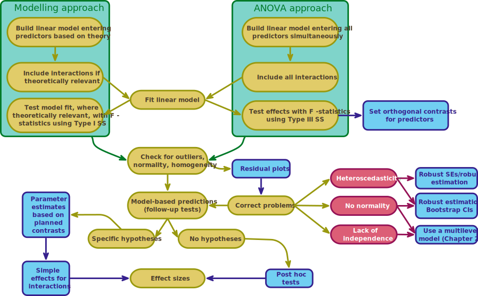

<html lang="en">

```{r setup, include=FALSE}
knitr::opts_chunk$set(
	echo = TRUE,
	message = FALSE,
	warning = FALSE
)

#necessary to render tutorial correctly
library(learnr) 
library(htmltools)
#easystats
library(datawizard)
library(effectsize)
library(insight)
library(modelbased)
library(parameters)
library(performance)
#tidyverse
library(dplyr)
library(forcats)
library(ggplot2)
#non tidyverse/easystats
library(afex)
library(car)
#students don't use
library(knitr)
library(marginaleffects)
library(sandwich)

source("./www/discovr_helpers.R")


#Read data files needed for the tutorial

goggles_tib <- discovr::goggles
xbox_tib <- discovr::xbox |> 
  mutate(
    game = as_factor(game) |> fct_relevel("Static"),
    console = as_factor(console) |> fct_relevel("Xbox One")
  )
goggles_afx <- afex::aov_4(attractiveness ~ facetype*alcohol + (1|id), data = goggles_tib)
goggles_aov <- model_parameters(goggles_afx, es_type = "omega", ci = 0.95)
```


# discovr factorial designs with afex (GLM 3)

```{r, child = "./docs/intro.Rmd"}

```

## Packages {data-progressive=FALSE}

```{r, child = "./docs/packages.Rmd"}

```


## Data

```{r, child = "./docs/data.Rmd"}

```


## Fitting models

```{r, child = "./docs/fit_models.Rmd"}

```


## `r bmu()` Beer goggles [(B)]{.lbl}

The main example in this tutorial is from [@fielddsr22026], who uses an example of an experimental design with two independent variables (a two-way independent design). The study tested the prediction that subjective perceptions of physical attractiveness become inaccurate after drinking alcohol (the well-known beer-goggles effect). The example is based on research that looked at whether the beer-goggles effect was influenced by the attractiveness of the faces being rated [@chen_moderating_2014]. The logic is that alcohol consumption has been shown to reduce accuracy in symmetry judgements, and symmetric faces have been shown to be rated as more attractive. If the beer-goggles effect is driven by alcohol impairing symmetry judgements then you'd expect a stronger effect for unattractive (asymmetric) faces (because alcohol will affect the perception of asymmetry) than attractive (symmetric) ones. The data well analyse are fictional, but the results mimic the findings of this research paper.

An anthropologist was interested in the effects of facial attractiveness on the beer-goggles effect. She selected 48 participants who were randomly subdivided into three groups of 16: (1) a placebo group drank 500 ml of alcohol-free beer; (2) a low-dose group drank 500 ml of average strength beer (4% ABV); and (3) a high-dose group drank 500 ml of strong beer (7% ABV). Within each group, half (n = 8) rated the attractiveness of 50 photos of unattractive faces on a scale from 0 (pass me a paper bag) to 10 (pass me their phone number) and the remaining half rated 50 photos of attractive faces. The outcome for each participant was their median rating across the 50 photos (These photographs were from a larger pool of 500 that had been pre-rated by a different sample. The 50 photos with the highest and lowest ratings were used.). The data are in [goggles_tib]{.alt}, which contains the variables `facetype` (unattractive vs attractive), `alcohol` (placebo, low dose, high dose) and `attractiveness` (the median rating of each participant out of 10).

We can follow our usual 5-step process for fitting models. However, we can approach the model fitting using a standard modelling approach or a more historical 'ANOVA' approach (Figure 4). In both approaches we fit the same model so the bulk of the process is the same. The main difference is that in a standard modelling approach we include interactions between predictors only if they are theoretically relevant, and we build the model up sequentially based on theory. In contrast, the 'ANOVA' approach is a specific implementation of the model for experimental designs and so all main effects and interactions are included (because the interactions are typically theoretically interesting) and all effects are evaluated simultaneously using *F*-statistics. 

The model we're fitting is described by the following equation:

$$
\begin{aligned}
Y_i & = \hat{b}_0 + \hat{b}_1X_i+ e_i\\
\text{attractiveness}_i & = \hat{b}_0 + \hat{b}_1\text{facetype}_i + \hat{b}_2\text{alcohol}_i + \hat{b}_3[\text{facetype} \times \text{alcohol}]_i + e_i
\end{aligned}
$$

We can follow our usual 5-step process for fitting models. However, we can approach the model fitting using a standard modelling approach or a more historical 'ANOVA' approach (Figure 4). In both approaches we fit the same model so the bulk of the process is the same. The main difference is that in a standard modelling approach we include interactions between predictors only if they are theoretically relevant, and we build the model up sequentially based on theory. In contrast, the 'ANOVA' approach is a specific implementation of the model for experimental designs and so all main effects and interactions are included (because the interactions are typically theoretically interesting) and all effects are evaluated simultaneously using *F*-statistics. This tutorial covers the ANOVA approach, for the standard modelling approach see `discovr_13`.

<figure>

<figcaption>Figure 4: model fitting for factorial designs.</figcaption>
</figure>


## `r bmu()` Step 1: summarize [(A)]{.lbl}

<div class="stepbox">
  `r step()` **Step 1**

Get your data into `r rproj()` and pre-process using [tidyverse]{.pkg} packages or the [datawizard]{.pkg} package from [easystats]{.pkg}.
</div>


#### `r alien()` Alien coding challenge

View the data in [goggles_tib]{.alt}.

```{r goggles_tib, exercise = TRUE, exercise.lines = 2}

```

```{r goggles_tib-solution}
goggles_tib
```

Note that there are four variables: the participant's `id`, which is a character variable (note the `<chr>`] under the name), the `facetype` in the photo (unattractive or attractive) and the `alcohol` consumption (placebo, low or high), both of which are factors (note the `<fct>` under the names). Finally, the `attractiveness` score is numeric and has the data type 'double' (note the `<dbl>` under the name).

The variables `facetype` and `alcohol` are factors (categorical variable), so having read the data file and converted these variables to factors it's a good idea to check that the levels of these variables are in the order that we want: unattractive and attractive for `facetype` and placebo, low high for `alcohol`.

#### `r alien()` Alien coding challenge

Using what you've learnt in previous tutorials check the order of the levels of the variables `facetype` and `alcohol`.

```{r chk_levels, exercise = TRUE, exercise.lines = 3}

```

```{r chk_levels-hint-1}
# use this function:
levels()
```

```{r chk_levels-hint-2}
# Remember that to access a variable you use:

name_of_tibble$name_of_variable
```

```{r chk_levels-solution}
levels(goggles_tib$facetype)
levels(goggles_tib$alcohol)
```

Because I have set up the data within this tutorial you should see that the levels are listed in the order that we want them when you execute the code.


#### `r alien()` Alien coding challenge

Use what you already know to create a table of descriptive statistics (including 95% confidence intervals) of attractiveness scores split by the type of face in the stimulus and the alcohol consumption. Print this object rounding to 2 decimal places.

```{r goggles_sum, exercise = TRUE, exercise.lines = 7}

```

```{r goggles_sum-hint-1}
# Start by piping the tibble into the group_by function to group output by facetype and alcohol:
goggles_tib |> 
  group_by(dose)
# Now pipe the results into the describe_distribution() function
```

```{r goggles_sum-hint-2}
# Pipe the results into the describe_distribution() function
goggles_tib |> 
  group_by(facetype, alcohol) |> 
  describe_distribution(ci = 0.95)
# use a function to display the table to 2dp
```


```{r goggles_sum-solution}
# Solution
goggles_tib |> 
  group_by(facetype, alcohol) |> 
  describe_distribution(ci = 0.95) |> 
  display()
```


Note that the mean attractiveness is very similar across the doses of alcohol for the attractive faces, but varies in the unattractive faces.

## `r bmu()` Step 2: Visualize [(A)]{.lbl}

<div class="stepbox">
  `r step()` **Step 2**

Visualise the data using the [ggplot2]{.pkg} package from [tidyverse]{.pkg}.
</div>

#### `r alien()` Alien coding challenge

Use what you already know to plot the mean and a 95% confidence interval of attractiveness scores split by the type of face (*x*-axis) being rated and the alcohol consumption (colour).

```{r goggles_gg, exercise = TRUE, exercise.lines = 7}

```

```{r goggles_gg-hint-1}
# Start by setting up the plot (replace the xs):
ggplot2::ggplot(xxxxx, aes(x = xxxxx, y = xxxxx, colour = xxxxx)) 

```

```{r goggles_gg-hint-2}
# Now use stat_summary() to add the data (replace the xs)
ggplot2::ggplot(goggles_tib, aes(x = alcohol, y = attractiveness, colour = facetype)) +
  stat_summary(fun.data = "xxxxx", geom = "xxxxxx", position = position_xxxxx(width = 0.2))
```

```{r goggles_gg-hint-3}
# Use coord_cartesian() and scale_y_continuous to set the limits and breaks for the y-axis to be whole numbers between 0 and 10 (replace the xs):
ggplot2::ggplot(goggles_tib, aes(x = alcohol, y = attractiveness, colour = facetype)) +
  stat_summary(fun.data = "mean_cl_normal", geom = "pointrange", position = position_dodge(width = 0.2)) +
  coord_cartesian(xxxxxx) +
  scale_y_continuous(xxxxx)
```

```{r goggles_gg-hint-5}
# use labs() to add axis labels to the x, y and colour legend (replace xxxs):
ggplot2::ggplot(goggles_tib, aes(x = alcohol, y = attractiveness, colour = facetype)) +
  stat_summary(fun.data = "mean_cl_normal", geom = "pointrange", position = position_dodge(width = 0.2)) +
  coord_cartesian(ylim = c(0,10)) +
  scale_y_continuous(breaks = 0:10) +
  labs(x = "xxxxxxx", y = "xxxxxxx", xxxxx = "Type of face")
```

```{r goggles_gg-hint-6}
# add a theme (replace the xs):
ggplot2::ggplot(goggles_tib, aes(x = alcohol, y = attractiveness, colour = facetype)) +
  stat_summary(fun.data = "mean_cl_normal", geom = "pointrange", position = position_dodge(width = 0.2)) +
  coord_cartesian(ylim = c(0,10)) +
  scale_y_continuous(breaks = 0:10) +
  labs(x = "Alcohol consumption", y = "Attractiveness (0-10)", colour = "Type of face") +
  xxxxxx()
```

```{r goggles_gg-hint-7}
# Solution #1
ggplot2::ggplot(goggles_tib, aes(x = alcohol, y = attractiveness, colour = facetype)) +
  stat_summary(fun.data = "mean_cl_normal", geom = "pointrange", position = position_dodge(width = 0.2)) +
  coord_cartesian(ylim = c(0,10)) +
  scale_y_continuous(breaks = 0:10) +
  labs(x = "Alcohol consumption", y = "Attractiveness (0-10)", colour = "Type of face") +
  theme_minimal()
```

```{r goggles_gg-solution}
# In the book to make the image more accessible I (1) add the viridis colour scale (note the extra line of code); and (2) vary the shape by facetype
ggplot(goggles_tib, aes(x = alcohol, y = attractiveness, colour = facetype, shape = facetype)) +
  stat_summary(fun.data = "mean_cl_normal", geom = "pointrange", position = position_dodge(width = 0.2)) +
  coord_cartesian(ylim = c(0,8)) +
  scale_y_continuous(breaks = 0:8) +
  scale_colour_viridis_d(begin = 0.3, end = 0.85) +
  labs(x = "Alcohol consumption", y = "Attractiveness (0-10)", colour = "Facial stimulus", shape = "Facial stimulus") +
  theme_minimal()
```


Note again that the mean attractiveness is very similar across the doses of alcohol for the attractive faces, but varies in the unattractive faces.

## `r bmu()` Step 3: Fit the model  [(A)]{.lbl}

We can fit the model using our 5-step modelling process (see `discovr_13`) but when faced with a factorial design (i.e. only categorical predictors) a more user-friendly approach is offered by the `afex` package (stands for [a]{.alt}nalysis of [f]{.alt}actorial [ex]{.alt}periments). We're going to use the `aov_4()` function, which takes the following form:

```{r, eval = F}
afex::aov_4(outcome ~ predictors + (1|id_variable), data = my_tib)
```

In short, we specify the model like we would with `lm()`, and replace [my_tib]{.alt} with the name of our tibble. There is an additional term in the model, [(1|id_variable)]{.alt}, and this tells the function something about the structure of the data. Specifically, it tells the function how scores are clustered. In the current design, scores are clustered within individuals so we would replace [id_variable]{.alt} with the variable that uniquely identifies the different participants (this variable is called [id]{.alt}). In subsequent tutorials we'll use this argument to specify different types of designs. 

#### `r robot()` Code example

Putting all of this together, we could fit the model with this code:

```{r, eval = F}
goggles_afx <- afex::aov_4(attractiveness ~ facetype*alcohol + (1|id), data = goggles_tib)
goggles_afx
```

#### `r alien()` Alien coding challenge

Use the `aov_4()` function to fit the model.

```{r goggles_aov_4, exercise = TRUE, exercise.lines = 5, message=TRUE}

```

```{r goggles_aov_4-hint-1}
# fit the model (replace the xs):
goggles_afx <- afex::aov_4(xxxxx ~ xxxxx*xxxxx + (1|xxxxx), data = xxxxx)
```

```{r goggles_aov_4-solution}
# fit the model:
goggles_afx <- afex::aov_4(attractiveness ~ facetype*alcohol + (1|id), data = goggles_tib)
goggles_afx #this shows us the model
```

<div class="bug">
  `r bug()` **De-bug: Strange messages**

  You might be distressed by a message telling you

```{r, eval = F, class.source = '.panel_alt'}
Contrasts set to contr.sum for the following variables: facetype, alcohol.
```

This message is nothing to worry about, but it is telling you that behind the scenes orthogonal contrasts have been set for your variables so that Type III sums of squares can be computed for the *F*-statistics. 
</div>


The output is pretty horrid, so let's use our friend `model_parameters()` to tidy it up and while we're at it add effect sizes. Specifically, we can put our model into the function and include [es_type = "eta"]{.alt} to get partial eta-squared ($\eta^2_p$) or [es_type = "omega"]{.alt} for partial omega-squared ($\omega^2_p$), and you can get a 95% confidence interval by including [ci = 0.95]{.alt} or change the proportion if you prefer. Behind the scenes, these effect sizes are computed using the [effectsize]{.pkg} package [@effectsize2020; @R-effectsize], which is part of the [easystats]{.pkg} ecosystem.


#### `r robot()` Code example

To get a nice tabulated output for our model we could use this code:

```{r, eval = F}
model_parameters(goggles_afx, es_type = "omega", ci = 0.95) |> 
  display(use_symbols = TRUE)
```

All we do is put the [afex]{.pkg} object into the function (or pipe it in) and add the arguments for an effect size and confidence interval. As ever we use `display()` to render it nicely but note I have included [use_symbols = TRUE]{.alt}, because this will use Greek symbols for our effect size columns.

#### `r alien()` Alien coding challenge

Re-print the output from [goggles_afx]{.alt} but tabulated with effect sizes.

```{r eta_afx, exercise = TRUE, exercise.lines = 4}

```


```{r eta_afx-solution}
model_parameters(goggles_afx, es_type = "omega", ci = 0.95) |> 
  display(use_symbols = TRUE)
```


These values show that the $\text{facetype} \times \text{alcohol}$ interaction (the effect we care about) explains `r report_value(100*value_from_ez(goggles_aov, value = "Omega2_partial", row = 3, as_is = T), digits = 0)`% of the variance in attractiveness not attributable to other predictors, which is sizeable. 


```{r quiz_face_ex1, echo = F}
quiz(caption = "Interpreting factorial designs",
  question("Using the output above, interpret the effect of **facetype**.",
    answer("This effect means that overall when we ignore how much alcohol had been drunk the type of face being rated significantly affected attractiveness ratings.", correct = T, message = "The main effect of type of face is significant because the *p* associated with the *F*-statistic is given as < .001, which is less than 0.05"),
    answer("This effect means that overall when we ignore how much alcohol had been drunk the type of face being rated did not significantly affect attractiveness ratings", message = "Sorry, but this answer is incorrect. The main effect of type of face would be considered *significant* because the *p* associated with the *F*-statistic is given as < .001, which is less than 0.05"),
    answer("Tell me a terrible cat joke", message = "What do you use to brush a cat? A catacomb."),
    correct = "Correct - well done!",
    incorrect = "",
    random_answer_order = TRUE,
    allow_retry = T
  ),
    question("Using the output above, interpret the effect of **alcohol**.",
    answer("This effect means that when we ignore whether the participant rated unattractive or attractive faces the amount of alcohol significantly influenced their attractiveness ratings.", correct = T, message = "The main effect of alcohol is significant because the *p* associated with the *F*-statistic is given as 0.005, which is less than 0.05"),
    answer("This effect means that overall when we ignore how much alcohol had been drunk the type of face being rated did not significantly affect attractiveness ratings", message = "The main effect of alcohol would be considered *significant* because the *p* associated with the *F*-statistic is given as 0.005, which is less than 0.05"),
    correct = "Correct - well done!",
    random_answer_order = TRUE,
    allow_retry = T
  ),
  question("Using the output above, interpret the significant effect of **facetype:alcohol** (select ALL that apply).",
    answer("The effect of alcohol on attractiveness ratings was different when rating unattractive faces compared to when rating attractive faces.", correct = T),
    answer("The difference between the mean ratings of attractive and unattractive faces varied as a function of how much alcohol was consumed.", correct = T),
    answer("The difference between the mean ratings of attractive and unattractive faces was similar in each alcohol group."),
    answer("The difference between the mean ratings across the three alcohol groups was similar for attractive and unattractive faces."),
    answer("Attractiveness ratings were similar regardless of how much alcohol was consumed and whether the face was attractive or not."),
    correct = "Correct - well done!",
    incorrect = "Incorrect. Hint: The fact that the interaction effect was significant suggests that the effect of the type of face depended on how much alcohol was consumed and vice versa.",
    random_answer_order = TRUE,
    allow_retry = T
  )
)
```


<div class="reportbox">
  `r pencil()` **Report**`r rproj()`
  
There was a significant effects of the type of face used, `r report_ez_aov(goggles_aov, row = 1, es_type = "Omega2_partial")`, and the dose of alcohol, `r report_ez_aov(goggles_aov, row = 2, es_type = "Omega2_partial")`. However, these effects were superseded by a significant interaction between the type of face being rated and the dose of alcohol, `r report_ez_aov(goggles_aov, row = 3, es_type = "Omega2_partial")`. This interaction suggests that the effect of alcohol is moderated by the type of face being rated (and vice versa).
</div>


## `r bmu()` Step 4: Evaluate the model [(A)]{.lbl}

<div class="stepbox">
  `r step()` **Step 4**

Evaluate the model using a small number of functions from the [performance]{.pkg} package from [easystats]{.pkg}. Specially, we evaluate

- How well the model fits the data
- Whether the underlying assumptions of the model are met. If not, we refit the model using robust methods (see Figure 3).
 
</div>


Fitting the model using [afex]{.pkg} limits the extent to which we can evaluate the model.


```{r goggles_afx_setup}
goggles_afx <- afex::aov_4(attractiveness ~ facetype*alcohol + (1|id), data = goggles_tib)
```


#### `r alien()` Alien coding challenge

We can evaluate the model ([goggles_lm]{.alt}) in the usual way using `check_model()`. Try this in the code box.

```{r goggles_zpred_resid, exercise = TRUE, exercise.lines = 3, exercise.setup = "goggles_afx_setup", fig.height = 10}

```

```{r goggles_zpred_resid-solution}
check_model(goggles_afx)
```


```{r quiz_zresid_ex1, echo = FALSE}
quiz(caption = "Diagnostic plot quiz (level 2)",
  question("How would you interpret the *Residual vs. fitted* plot?",
    answer("Were in trouble: I see heteroscedasticity.", message = "Unlucky. The green line on the plot is fairly flat and the vertical lines of dots seem similar in length as we move along the *x*-axis indicating linearity and homoscedasticity."),
    answer("I'm not sure, give me a hint.", message = "Linearity and homoscedasticity is shown up by a green line that is flat and a vertical spread of dots that changes as you move along the *x*-axis."),
    answer("Everything is fine - residuals show linearity and homogeneity.", correct = TRUE, message = "Yes, the green line is fiarly flat and the vertical spread of dots is similar as you move along the *x*-axis."),
    correct = "Correct - well done!",
    random_answer_order = TRUE,
    allow_retry = T
  ),
  question("Based on the Q-Q plot, can we assume normality of the residuals?",
    answer("Yes", correct = TRUE, message = "The dots on the Q-Q plot only deviate slightly from the line at the extremes, which probably indicates a roughly normal distribution."),
    answer("No", message = "The dots on the Q-Q plot only deviate slightly from the line at the extremes, which probably indicates a roughly normal distribution."),
    answer("Give me a clue", message = "If residuals are normally distributed then the dots on the Q-Q plot should cling lovingly to the line."),
    correct = "Correct - Well done!",
    random_answer_order = TRUE,
    allow_retry = T
  )
)
```

## `r bmu()` Step 5: Interpret the model [(A)]{.lbl}

<div class="stepbox">
  `r step()` **Step 5**

Interpret the model

- Interpret the values that define the model (the [parameter estimates]{.alt}) using the [parameters]{.pkg} package from [easystats]{.pkg}.
- Make specific predictions from our model using the [modelbased]{.pkg} package from [easystats]{.pkg}.
 
</div>

Unfortunately, one price we pay for using `afex` is that there are only overall effects so we can't use model parameters to make sense of the model. Instead, we need to focus on plots and focussed predictions (in this case we'll use simple effects analysis).

The results showed significant main effects and interactions for all variables. The main effects are not interesting in the context of the significant interaction effect, so we'll focus on the significant interaction effect. Let's first interpret this interaction using a plot.


### `r bmu()` Plots using the `afex` package [(A)]{.lbl}

A neat feature of `afex` is that you can get plots of the interaction without needing to do it using [ggplot2]{.pkg} (even though I forced you to do that for practice at the start of the tutorial). Having created an `afex` object we can feed it into the `afex_plot()`, which takes the general form:

```{r, eval = F}
afex::afex_plot(afx_object, x_variable, line_shape_variable, panel_variable)
```

In which you replace [afx_object]{.alt} with the name of the model you fitted with `aov_4()`, [x_variable]{.alt} with the predictor you want on the *x*-axis, and [line_shape_variable]{.alt} with a predictor that you want to be depicted using different lines/shapes. If you have a third categorical predictor, replace [panel_variable]{.alt} with the name of that predictor and its different categories will be displayed across different panels (e.g., `facet_wrap()` style). The result is a `ggplot` object so you can use [ggplot2]{.pkg} code to edit the results, for example, you can apply a standard [ggplot2]{.pkg} theme. 

#### `r robot()` Code example

To plot the [facetype*alcohol]{.alt} interaction we could use this code:

```{r, eval = F}
afex::afex_plot(goggles_afx, "alcohol", "facetype")
```

#### `r alien()` Alien coding challenge

Plot the [facetype*alcohol]{.alt} interaction, add axis labels and apply `theme_minimal()`.

```{r fit_afx}
goggles_afx <- afex::aov_4(attractiveness ~ facetype*alcohol + (1|id), data = goggles_tib)
```


```{r afx_plot, exercise = TRUE, exercise.lines = 5, exercise.setup = "fit_afx"}

```

```{r afx_plot-hint-1}
# Plot the means (replace the xs):
afex::afex_plot(xxxxx, "xxxxx", "xxxxx")
```

```{r afx_plot-hint-2}
afex::afex_plot(goggles_afx, "alcohol", "facetype")
# now add axis labels to override the defaults in the usual way
```

```{r afx_plot-hint-3}
# plot the means and add axis labels:
afex::afex_plot(goggles_afx, "alcohol", "facetype") +
  labs(x = "Alcohol consumption", y = "Attractiveness rating (0-10)")
# now add theme_minima() in the usual way
```

```{r afx_plot-solution}
# solution:
afex::afex_plot(goggles_afx, "alcohol", "facetype") +
  labs(x = "Alcohol consumption", y = "Attractiveness rating (0-10)") +
  theme_minimal()
```

The plot seems to suggest that attractive stimuli are rated as more attractive than unattractive stimuli in the placebo group, but are rated fairly similarly in the low dose group and very similarly in the high alcohol dose group. Put another way, the beer googles effect seems to being rearing it's head: as more alcohol is consumed the ratings of unattractive faces get more similar to those of attractive faces.


## `r user_visor()` Simple effects [(B)]{.lbl}

A particularly effective way to break down interactions is [simple effects analysis]{.kt}, which looks at the effect of one predictor at individual levels of another. For example, we could do a simple effects analysis looking at the effect of type of face at each level of alcohol. This would mean taking the average attractiveness rating of unattractive faces and comparing it to that for attractive faces after a placebo drink, then making the same comparison after a low dose of alcohol, and then finally for a high dose. By doing so we ask: what is the effect of `facetype` within each alcohol group?

An alternative is to quantify the effect of `alcohol` (the pattern of means across the placebo, low dose and high dose) separately for unattractive and attractive faces.

We can do this analysis using the `estimate_contrasts()` function from [modelbased]{.pkg}, which we've used before. However, we need to add some arguments that we haven't used before. In general, for simple effects the function takes the form:

```{r, eval = F}
estimate_contrasts(model = my_model,
                   contrast = "effect_of_interest",
                   by = "groups_to_look_within",
                   comparison = "joint",
                   p_adjust = "bonferroni")
```


In which you replace [my_model]{.alt} with the name of your model ([goggles_afx]{.alt}). Replace [effect_of_interest]{.alt} with the name of the variable that you want to look at the effect of, and replace [groups_to_look_within]{.alt} with the name of the variable by which you want to split the comparisons. Including [comparison = "joint"]{.alt} gives us simple effects, and we can include a *p*-value adjustment in the usual way.

#### `r robot()` Code example

In this case it makes most sense to look at the effect of `facetype` within each category of `alcohol`, because there were only two types of face so each simple effect represents a focussed test of ratings to attarctive compared to unattractive faces.

To obtain these simple effetcs with a Bonferroni correction, we'd execute:

```{r, eval = F}
estimate_contrasts(model = goggles_afx,
                   contrast = "facetype",
                   by = "alcohol",
                   comparison = "joint",
                   p_adjust = "bonferroni") |> 
  display()
```


<div class="infobox">
  `r info()` **Information**

If we wanted to look at the effect of `alcohol` separately for attractive and unattractive stimuli, we'd flip those variables within the function:

```{r, eval = F, class.source = '.panel_alt'}
estimate_contrasts(model = goggles_afx,
                   contrast = "alcohol",
                   by = "facetype",
                   comparison = "joint",
                   p_adjust = "bonferroni") |> 
  display()
```

</div>


#### `r alien()` Alien coding challenge

Do a simple effects analysis to look at the effect of `facetype` separately for different does of alcohol stimuli, use `display()` to round values.

```{r goggles_se, exercise = TRUE, exercise.lines = 8}

```

```{r goggles_se-solution}
estimate_contrasts(model = goggles_afx,
                   contrast = "facetype",
                   by = "alcohol",
                   comparison = "joint",
                   p_adjust = "bonferroni") |> 
  display()
```

```{r quiz_face_se2, echo = F}
quiz(caption = "Interpreting simple effects (level 2)",
  question("Using the output above, which of the following best describes the results from the simple effects analysis?",
    answer("There was a significant difference in the ratings of attractive and unattractive faces in the placebo group and the low dose group, but a non-significance difference in the high dose group.", correct = T),
    answer("There was a significant difference in the ratings of attractive and unattractive faces in the placebo group, but a non-significance difference in the low and high dose groups.", message = "Sorry, but this answer is incorrect. Remember that using the conventional 0.05 level of significance, an effect is significant if its *p*-value is *less than* 0.05."),
    answer("There was a significant difference in the ratings of attractive and unattractive faces in the placebo group and the high dose group, but a non-significance difference in the low dose group.", message = "Sorry, but this answer is incorrect. Remember that using the conventional 0.05 level of significance, an effect is significant if its *p*-value is *less than* 0.05."),
    answer("There was a significant difference in the ratings of attractive and unattractive faces in all of the groups.", message = "Sorry, but this answer is incorrect. Remember that using the conventional 0.05 level of significance, an effect is significant if its *p*-value is *less than* 0.05."),
    answer("There was a non-significant difference in the ratings of attractive and unattractive faces in all of the groups.", message = "Sorry, but this answer is incorrect. Remember that using the conventional 0.05 level of significance, an effect is significant if its *p*-value is *less than* 0.05."),
    correct = "Correct - well done!",
    random_answer_order = TRUE,
    allow_retry = T
  )
)
```


```{r echo = F}
gog_se <- estimate_contrasts(model = goggles_afx,
                   contrast = "facetype",
                   by = "alcohol",
                   comparison = "joint",
                   p_adjust = "bonferroni")
```

<div class="reportbox">
  `r pencil()` **Report**`r rproj()`
  
Simple effects analysis revealed that symmetric faces were rated as significant more attractive than asymmetric faces after no alcohol, `r report_con(gog_se, row = 1)`, and a low dose, `r report_con(gog_se, row = 2)`, but were rated comparably after a high dose of alcohol, `r report_con(gog_se, row = 3)`. These effects support the 'beer-googles' hypothesis: the standard tendency to rate symmetric faces as more attractive than asymmetric faces was present at low doses and no alcohol, but was eliminated by a high dose of alcohol.
</div>


## `r user_visor()` Robust models [(B)]{.lbl} 

For previous linear models(e.g., in `discovr_08`, `discovr_09` and `discovr_11`), we obrtained robust parameter estimates using `robust::lmRob()` and robust tests of these parameters using `parameters::model_parameters()`. These methods won't work for models created with `afex`. If you are taking an 'ANOVA' approach to your analysis, then you need to use the [WRS2]{.pkg} package to fit models based on trimmed means. The functions `t2way()` and `mcp2atm()` take the general form:

```{r, eval = F}
WRS2::t2way(outcome ~ predictor(s), data = my_tib, tr = .2, alpha = .05)
WRS2::mcp2atm(outcome ~ predictor(s), data = my_tib, tr = .2, alpha = .05)
```

In which we replace [my_tib]{.alt} with the name of the tibble containing the data ([goggles_tib]{.alt}), we specify the model in the same way as we did within `aov_4()` by using [attractiveness ~ alcohol*facetype]{.alt}, [tr = .2]{.alt} sets the default level of trimming to be 20% (which is 0.2 as a proportion), and [alpha = .05]{.alt} sets the default criterion for significance at 0.05 (5%).

#### `r robot()` Code example

Therefore, to fit a robust model with post hoc tests and using the defaults of 20% trimming and a 0.05 criterion for significance we'd execute

```{r, eval = F}
WRS2::t2way(attractiveness ~ alcohol*facetype, goggles_tib)
WRS2::mcp2atm(attractiveness ~ alcohol*facetype, goggles_tib)
```


#### `r alien()` Alien coding challenge

Use the code box to fit robust models.

```{r goggles_rob, exercise = TRUE, exercise.lines = 4}


```

```{r goggles_rob-solution}
WRS2::t2way(attractiveness ~ alcohol*facetype, goggles_tib)
WRS2::mcp2atm(attractiveness ~ alcohol*facetype, goggles_tib)
```


```{r, echo = F}
gog_rob <- WRS2::t2way(attractiveness ~ alcohol*facetype, goggles_tib)
gog_rob_ph <- WRS2::mcp2atm(attractiveness ~ alcohol*facetype, goggles_tib)

report_t2way_ci <- function(ci_obj, row = 1, digits = 2){
  ci_obj <- as_tibble(ci_obj) |> 
    format_value(digits = digits)
  
  if(ncol(ci_obj) == 1){
    ci <- ci_obj |> pull(value)
    ci_low <- ci[1]
    ci_hi <- ci[2]
  } else {
    ci_low <- ci_obj |> pull(ci.lower)
    ci_hi <- ci_obj |> pull(ci.upper)
  }

  paste0("[", ci_low[row], ", ", ci_hi[row], "]")
}

wrs_alcohol <- gog_rob_ph$effects$alcohol
wrs_facetype <- gog_rob_ph$effects$facetype
wrs_int <- gog_rob_ph$effects$`alcohol:facetype`
```


The resulting Output confirms significant main effects of alcohol, *Q* = `r report_value(gog_rob$Qa)`, `r report_p(gog_rob$A.p.value)`, facetype, Q = `r report_value(gog_rob$Qb)`, `r report_p(gog_rob$B.p.value)`, and a significant alcohol by facetype interaction, Q = `r report_value(gog_rob$Qab)`, `r report_p(gog_rob$AB.p.value)`.

For `mcp2atm()` we interpret the parameter estimate ($\hat{\Psi}$), its confidence interval and *p*-value. However, we should attend specifically to the confidence interval because (unlike the *p*-value) it is corrected for the number of tests. 

Based on the *p*-value being below 0.05 and the confidence interval not containing zero we'd conclude:

- `alcohol1` tells us that attractiveness ratings in the low dose group were not significantly different to the placebo group, $\hat{\Psi}$ = `r report_value(wrs_alcohol$psihat[1])`, `r report_t2way_ci(wrs_alcohol$conf.int, row = 1)`, `r report_p(wrs_alcohol$p.value[1])`.
- `alcohol2` tells us that attractiveness ratings in the high dose group were significantly different to the placebo group, $\hat{\Psi}$ = `r report_value(wrs_alcohol$psihat[2])`, `r report_t2way_ci(wrs_alcohol$conf.int, row = 2)`, `r report_p(wrs_alcohol$p.value[2])`.
- `alcohol3` tells us that attractiveness ratings in the low dose group were not significantly different to the high dose group, $\hat{\Psi}$ = `r report_value(wrs_alcohol$psihat[3])`, `r report_t2way_ci(wrs_alcohol$conf.int, row = 3)`, `r report_p(wrs_alcohol$p.value[3])`.
- `facetypel1` tells us that attractiveness ratings of attractive faces were significantly different to those for unattractive faces, $\hat{\Psi}$ = `r report_value(wrs_facetype$psihat[1])`, `r report_t2way_ci(wrs_facetype$conf.int, row = 1)`, `r report_p(wrs_facetype$p.value[1])`.
- `alcohol1:facetypel1` tells us that the difference in attractiveness ratings of attractive faces compared to unattractive ones in the low dose group was not significantly different to the placebo group, $\hat{\Psi}$ = `r report_value(wrs_int$psihat[1])`, `r report_t2way_ci(wrs_int$conf.int, row = 1)`, `r report_p(wrs_int$p.value[1])`.
- `alcohol2:facetypel1` tells us that the difference in attractiveness ratings of attractive faces compared to unattractive ones in the high dose group was significantly different to the placebo group, $\hat{\Psi}$ = `r report_value(wrs_int$psihat[2])`, `r report_t2way_ci(wrs_int$conf.int, row = 2)`, `r report_p(wrs_int$p.value[2])`.
- `alcohol3:facetypel1` tells us that the difference in attractiveness ratings of attractive faces compared to unattractive ones in the low dose group was significantly different to the high dose group, $\hat{\Psi}$ = `r report_value(wrs_int$psihat[3])`, `r report_t2way_ci(wrs_int$conf.int, row = 3)`, `r report_p(wrs_int$p.value[3])`.


## `r user_visor()` Transfer task [(B)]{.lbl}

### Blow up your video

Let's look at a second example from [@fielddsr22026], which is about injuries from video games:


A researcher was interested in what factors contributed to injuries resulting from game console use. She tested 40 participants who were randomly assigned to either an active or static game played on either a Nintendo Switch or Xbox One Kinect. At the end of the session their physical condition was evaluated on an injury severity scale ranging from 0 (no injury) to 20 (severe injury). The data are in [xbox_tib]{.alt}, which contains the variables [id]{.alt}, [game]{.alt} (static, active), [console]{.alt} (Switch, Xbox One), and [injury]{.alt} (a score from 0 to 20). Fit a model to see whether injury severity is significantly predicted from the type of game, the type of console and their interaction.


<div class="infobox">
  `r info()` **Information**

There is a detailed solution to this task at [https://www.discovr.rocks/solutions/alex/alex_13/#task-1310](https://www.discovr.rocks/solutions/alex/alex_12/#task-1310). [Materials not yet live]
</div>

#### `r alien()` Alien coding challenge

Use the code box to get the mean (and 95% confidence intervals) injury score in all combinations of the type of game and the type of console.

```{r xbox_emm, exercise = TRUE, exercise.lines = 6}

```

```{r xbox_emm-solution}
xbox_tib |> 
  group_by(game, console) |> 
  describe_distribution(ci = 0.95) |> 
  display()
```

#### `r alien()` Alien coding challenge

Use the code box to build up the model and compare the fit. Call the model [xbox_afx]{.alt}.


```{r xbox_main, exercise = TRUE, exercise.lines = 6}

```

```{r xbox_main-hint-1}
# Fill in the xs.
xbox_afx <- afex::aov_4(xxx ~ xxx*xxx + + (1|xxxx), data = xxxx)
# add omega squared and make it render in a nice table
```

```{r xbox_main-hint-2}
# Fill in the xs.
xbox_afx <- afex::aov_4(injury ~ game*console + (1|id), data = xbox_tib)
model_parameters(xxxx, xxxx = "xxxx", ci = 0.95) |> 
  display(xxxx = TRUE)
```

```{r xbox_main-solution}
# Full solution:
xbox_afx <- afex::aov_4(injury ~ game*console + (1|id), data = xbox_tib)
model_parameters(xbox_afx, es_type = "omega", ci = 0.95) |> 
  display(use_symbols = TRUE)
```

```{r xbox_models}
xbox_afx <- afex::aov_4(injury ~ game*console + (1|id), data = xbox_tib)
```


#### `r alien()` Alien coding challenge

Use the code box to get diagnostic plots for [xbox_lm]{.alt}.

```{r xbox_diag, exercise = TRUE, exercise.lines = 6, exercise.setup = "xbox_models", fig.height = 10}

```

```{r xbox_diag-solution}
check_model(xbox_afx)
```

```{r xbox_diag_qz, echo = FALSE}
quiz(caption = "Diagnostic plot quiz (level 2)",
  question("How would you interpret the *Residual vs. fitted* plot?",
    answer("Were in trouble: I see heteroscedasticity.", message = "Unlucky. The green line on the *Residual vs. fitted* plot is fairly flat and the vertical lines of dots seem similar in length as we move along the *x*-axis indicating homoscedasticity."),
    answer("I'm not sure, give me a hint.", message = "Heteroscedasticity is shown up by a green line that isn't flat and a vertical spread of dots that changes as you move along the *x*-axis."),
    answer("Everything is fine - residuals show homogeneity, normality and no influential cses.", correct = TRUE),
    correct = "Correct - well done!",
    random_answer_order = TRUE,
    allow_retry = T
  ),
  question("Based on the Q-Q plot, can we assume normality of the residuals?",
    answer("Yes", correct = TRUE, message = "The dots on the Q-Q plot don't seem to deviate from the line, which indicates a normal distribution."),
    answer("No", message = "If residuals are normally distributed then the dots on the Q-Q plot should cling lovingly to the line."),
    answer("Give me a clue", message = "If residuals are normally distributed then the dots on the Q-Q plot should cling lovingly to the line."),
    correct = "Correct - Well done!",
    random_answer_order = TRUE,
    allow_retry = T
  )
)
```


#### `r alien()` Alien coding challenge

Use the code box to get the simple effect of the type of game for each type of console.

```{r xbox_se, exercise = TRUE, exercise.lines = 6, exercise.setup = "xbox_models"}

```

```{r xbox_se-hint-1}
# Fill in the xs.
estimate_contrasts(model = xxxx,
                   contrast = "xxxx",
                   by = "xxxx",
                   comparison = "xxxx",
                   p_adjust = "xxxx") |> 
  display()
```

```{r xbox_se-solution}
estimate_contrasts(model = xbox_afx,
                   contrast = "game",
                   by = "console",
                   comparison = "joint",
                   p_adjust = "bonferroni") |> 
  display()
```


```{r xbox_main_qz, echo = FALSE}
quiz(caption = "Interpreting interactions (level 2)",
     question("Generally speaking, how would you interpret the interaction between the type of game and the type of console?",
    answer("There was a significant interaction between the type of game played and the type of console on injury severity. This means that the effect of the type of game on injury was moderated by the type of console used.", correct = T, message = "The interaction effect was significant, *F*(1, 36) = 5.05, *p* = .031."),
    answer("There was a non-significant interaction between the type of game played and the type of console on injury severity. This means that the effect of the type of game on injury was not moderated by the type of console used.", message = "Sorry, that's not correct. The *p*-value for the effect is 0.031, which would typically be interpreted as *significant* because it is less than 0.05."),
    correct = "Correct - well done!",
    random_answer_order = TRUE,
    allow_retry = T
  ),
  question("Having decomposed the interaction term with simple effects, how would you interpret the interaction between the type of game and the type of console?",
    answer("The effect of the type of game was significantly different between the Switch and Xbox: injury severity was not significantly different for active and static games when using the Xbox, whereas for the Switch injuries were more severe for active games compared to passive ones.", correct = T),
    answer("The effect of the type of game was significantly different between the Switch and Xbox: injury severity was significantly different for active and static games in both the Switch and Xbox.", message = "Sorry, that's not correct. Although it sort of nearly is. In fact the simple effect for the Xbox had p = 0.0523, which is hovering on the threshold and sort of illustrates how p can force you into quite arbitrary conclusions. One thing we can say is that the effect of active games compared to static ones on injuries is significantly stronger for Switch games compared to xbox games."),
    answer("The effect of the type of game was not significantly different between the Switch and Xbox: injury severity was not significantly different for active and static games in both the Switch and Xbox.", message = "The interaction effect was significant, not non-significant."),
    answer("The effect of the type of game was significantly different between the Switch and Xbox: injury severity was significantly higher for Xbox games compared to Switch games.", message = "Sorry, that's not correct. First, the explanation describes the main effect of console (not the interaction) and injury severity was actually worse for the Switch."),
    correct = "Correct - well done!",
    random_answer_order = TRUE,
    allow_retry = T
  )
)
```


<div class="infobox">
  
  
  **A message from Mae Jemstone:**
  
  Many species, human, non-human or extra-terrestrial, thrive on social interactions. They thrive less on statistical interactions, and yet these make it possible to look at whether the effects of one variable on another are moderated by a third variable. I remember when I was gathering crew for my mission to the *Trench of Weltschmerz*, whose inhabitants, the Schmertleflergs, live in a perpetual state of universe weariness. We planned to test a theory that their weariness was created by particles of xanath in the atmosphere, but I needed my crew to remain unaffected by it because otherwise they'd become too disillusioned to finish the mission. So, we exposed some of them to xanath and some were not, and some wore special breathing filters and others wore regular air filters, and we measured their negativity. We established that in those exposed to xanath, only those with the regular air filters become more negative. There was an interaction effect! So, we stocked up on the new breathing filters, and set off to spread some love across the trench! Now you too can investigate these kinds of relationships between predictors. Great work cadets!
</div>


## Resources/References {data-progressive=FALSE}

```{r, child = "./docs/resources.Rmd"}

```


### References
