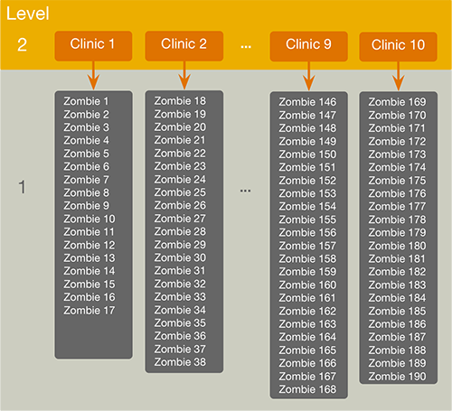

<html lang="en">

```{r setup, include=FALSE}
knitr::opts_chunk$set(
	echo = TRUE,
	message = FALSE,
	warning = FALSE
)

library(learnr) #necessary to render tutorial correctly

library(dplyr)
library(ggplot2)
library(Hmisc)
library(htmltools)
library(magrittr)

library(nlme)
library(broom.mixed)


source("./www/discovr_helpers.R")


#Read data files needed for the tutorial

rehab_tib <- discovr::zombie_rehab

rehab_evil_tib <- rehab_tib %>% 
  dplyr::mutate(
    intervention = forcats::fct_relevel(intervention, "Gene therapy"),
    zombification = forcats::fct_relevel(zombification, "High intensity"),
    clinic_id = forcats::fct_relevel(clinic_id, "Clinic 1", "Clinic 10", paste0("Clinic ", seq(2, 9, 1))),
    )
```

# discovr: Miltilevel models

## Overview

<div class="infobox">
  
  
  **Usage:** This tutorial accompanies [Discovering Statistics Using R and RStudio](https://www.discovr.rocks/) [@field_discovering_2022] by [Andy Field](https://en.wikipedia.org/wiki/Andy_Field_(academic)). It contains material from the book so there are some copyright considerations but I offer them under a [Creative Commons Attribution-NonCommercial-NoDerivatives 4.0 International License](http://creativecommons.org/licenses/by-nc-nd/4.0/). Tl;dr: you can use this tutorial for teaching and non-profit activities but please don't meddle with it or claim it as your own work.
  
</div>

### `r cat_space(fill = "h3", height = 2)` Welcome to the `discovr` space pirate academy

Hi, welcome to **discovr** space pirate academy. Well done on embarking on this brave mission to planet `r rproj()`s, which is a bit like Mars, but a less red and more hostile environment. That's right, more hostile than a planet without water. Fear not though, the fact you are here means that you *can* master `r rproj()`, and before you know it you'll be as brilliant as our pirate leader Mae Jemstone (she's the badass with the gun). I am the space cat-det, and I will pop up to offer you tips along your journey.

On your way you will face many challenges, but follow Mae's system to keep yourself on track:

* `r bmu(height = 2)` This icon flags materials for *teleporters*. That's what we like to call the new cat-dets, you know, the ones who have just teleported into the academy. This material is the core knowledge that everyone arriving at space academy must learn and practice. For accessibility, these sections will also be labelled with [(1)]{.alt}.
* `r user_visor(height = 2)` Once you have been at space pirate academy for a while, you get your own funky visor. It has various modes. My favourite is the one that allows you to see everything as a large plate of tuna. More important, sections marked for cat-dets with visors goes beyond the core material but is still important and should be studied by all cat-dets. However, try not to be disheartened if you find it difficult. For accessibility, these sections will also be labelled with [(2)]{.alt}.
* `r user_astronaut(height = 2)` Those almost as brilliant as Mae (because no-one is quite as brilliant as her) get their own space suits so that they can go on space pirate adventures. They get to shout *RRRRRR* really loudly too. Actually, everyone here gets to should *RRRRRR* really loudly. Try it now. Go on. It feels good. Anyway, this material is the most advanced and you can consider it optional unless you are a postgraduate cat-det. For accessibility, these sections will also be labelled with [(3)]{.alt}.

It's not just me that's here to help though, you will meet other characters along the way:

* `r alien(height = 2)` aliens love dropping down onto the planet and probing humanoids. Unfortunately you'll find them probing you quite a lot with little coding challenges. Helps is at hand though. 
* `r robot(height = 2)` **bend-R** is our coding robot. She will help you to try out bits of `r rproj()` by writing the code for you before you encounter each coding challenge.
* `r bug(height = 2)` we also have our friendly alien bugs that will, erm, help you to avoid bugs in your code by highlighting common mistakes that even Mae Jemstone sometimes makes (but don't tell her I said that or my tuna supply will end). 

Also, use hints and solutions to guide you through the exercises (Figure 1).

<figure>

<figcaption>Figure 1: In a code exercise click the hints button to guide you through the exercise.</figcaption>
</figure> 
 

By for now and good luck - you'll be amazing!

### Workflow

* Before attempting this tutorial it's a good idea to work through [this tutorial on how to install, set up and work within `r rproj()` and `r rstudio()`](http://milton-the-cat.rocks/learnr/r/r_getting_started/).

* The tutorials are self-contained (you practice code in code boxes). However, so you get practice at working in `r rstudio()` I strongly recommend that you create an `r rproj()` markdown file within an `r rstudio()` project and practice everything you do in the tutorial in the `r rproj()` markdown file, make notes on things that confused you or that you want to remember, and save it. Within this markdown file you will need to load the relevant packages and data. 


### Packages

This tutorial uses the following packages:

* `here` [@here]
* `nlme` [@pinheiro_nlme:_2021]
* `tidyverse` [@tidyverse]

I try to follow the [Google `r rproj()` style guide](https://google.github.io/styleguide/Rguide.html) and [tidyverse style guide](https://style.tidyverse.org/) in always declaring the package when using a function: `package::function()`. For example, if I want to use the `mutate()` function from the package `dplyr`, I will write `dplyr::mutate()`. 

It is good practice to be explicit about packages to avoid clashes where functions from different packages have the same name. It also means that you don't need to load packages at the start of your markdown document. 

There are two main exceptions to this rule.

1. There are functions within some `tidyverse` packages that would be used within other functions. Including the package name makes the code difficult to read. Also, no-one wants to write `ggplot2::` before every function from `ggplot2`.
2. To use the pipe operator (`%>%`) you need to have `magrittr` loaded.

We can load all of the packages that are exceptions in one step by loading `tidyverse` at the beginning of our `r rproj()` Markdown document:

```{r eval = FALSE}
library(tidyverse)
```

### Data

To work *outside of this tutorial* you need to download the following data files:

* [zombie_rehab.csv](https://www.discovr.rocks/csv/zombie_rehab.csv)

Set up an `r rstudio()` project in the way that [I recommend in this tutorial](http://milton-the-cat.rocks/learnr/r/r_getting_started/#section-working-in-rstudio), and save the data files to the folder within your project called [data]{.alt}. Place this code in the first code chunk in your `r rproj()` Markdown document:

```{r, eval=FALSE}
rehab_tib <- here::here("data/zombie_rehab.csv") %>%
  readr::read_csv() %>%
   dplyr::mutate(
    intervention = forcats::as_factor(intervention) %>% forcats::fct_relevel(., "Wait list"),
    zombification = forcats::as_factor(zombification) %>% forcats::fct_relevel(., "Low intensity"),
    clinic_id = forcats::as_factor(clinic_id) %>% forcats::fct_relevel(., paste0("Clinic ", seq(1, 10, 1))),
    )
```

This code reads in the data and converts the variables **intervention**, **zombification** and **clinic_id** to factors (categorical variable). It also uses `fct_relevel` to set the order of the levels of the factor **intervention** to be wait list and intervention. Similarly, the order of the levels of the factor **zombification** are set as low intensity and high intensity. Finally, the levels of the factor **zombification** are set as Clinic 1, Clinic 2 ... Clinic 10 in numeric order (try executing the code `paste0("Clinic ", seq(1, 10, 1))` and you'll see it pastes the text "Clinic " to the numbers 1 to 10 in turn.

## `r bmu()` Zombie rehabilitation [(1)]{.alt}

My book *An Adventure in Statistics* [@fieldAdventureStatisticsReality2016] as well as teaching statistics, has a narrative flowing through it about a brilliant geneticist (Alice) who vanishes much to the dismay of her Musician boyfriend (Zach). Zach is compelled to find her, but his only clue is some of Alice's research, which he doesn't understand. To find her, he has to learn statistics which, from his perspective, is an unfortunate turn of events. Anyway, along the way he meets a lot of people who have been recruited by a company called JIG:SAW to take part in their genetic enhancement programme, which unfortunately turns them into zombies.

At the end of the story it is revealed that Alice develops a gene therapy that restores the zombies to a human state. The example in this tutorial relates to her first clinical trial to test this genetic therapy. 190 zombies were treated at 10 different clinics and randomly assigned to two arms of the trial (wait list vs. gene therapy) and the outcome of the trial was how much they resembled their pre-zombie state (as a percentage). Additional variables quantify how long they been a zombie and whether they were originally exposed to the low- or high-intensity genetic 'enhancement'. The data are in [rehab_tib]{.alt}, which has six variables:

* **p_id**: The zombie's id.
* **clinic_id**: id for the clinic attended anonymised as Clinic 1 to Clinic 10.
* **intervention**: a factor that codes which arm of the trial the participant was randomized to (wait list or gene therapy).
* **resemblance**: How closely their face resembled their pre-zombified state (100\% = the participants face is exactly like their original face, 0\% the person bears no resemblance to their pre-zombified face).
* **zombification**: whether the initial zombification was achieved through low- or high-intensity zombification.
* **months_as_zombie**: the time (in months) that the person had spend in a zombified state before starting the intervention.

#### `r alien()` Alien coding challenge

View the data in [rehab_tib]{.alt}.

```{r dat_view, exercise = TRUE}
     
```

```{r dat_view-solution}
rehab_tib   
```

## `r bmu()` Preparing categorical variables [(1)]{.alt}

In these tutorials I tend to be kind to you and set up categorical predictors in the datasets in a way that categories are coded conveniently for the hypotheses being tested. Real life is often not as kind as I am. When converting character variables to factors the `as_factor()` function (see [discovr_01]{.alt}) assigned levels in the order that it discovers them in the data, but the `factor()` function assigns them alphabetically.

We can see this by creating a character variable with two values (`c("Silver", "Gold")`), then converting it to a factor with `factor()` and inspecting the levels using `levels()`. the code below does this, run it.

```{r fct_level_ex, exercise = TRUE, exercise.lines = 5}
c("Silver", "Gold") %>%
  factor() %>% 
  levels()
```

Note that levels have been assigned alphabetically, so the first level is 'Gold' and the second level is 'Silver'. Let's repeat the exercise but change `factor()` to `forcats::as_factor()`.

```{r fct_level_ex2, exercise = TRUE, exercise.lines = 5}
c("Silver", "Gold") %>%
  forcats::as_factor() %>% 
  levels()
```

Note that levels have been assigned in the order of the data, so the first level is 'Silver' and the second level is 'Gold'. The moral here is never assume that you know the order of factor levels!

Let's imagine a world where I'm not so nice and I've given you the data in `rehab_evil_tib`, which is the same as `rehab_tib` but more evil. It, therefore, contains three categorical variables: **intervention**, **clinic_id** and **zombification**. We can check the levels of these factors by placing each one in the `levels()` function and executing.

#### `r alien()` Alien coding challenge

The code box shows the code the code to check the levels of the variable **intervention**, add similar code to check **clinic_id** and **zombification** and run it.

```{r fct_levels, exercise = TRUE, exercise.lines = 5}
levels(rehab_evil_tib$intervention)
```

```{r fct_levels-solution}
levels(rehab_evil_tib$intervention)
levels(rehab_evil_tib$clinic_id)
levels(rehab_evil_tib$zombification)
```

The evilness of this tibble should now be apparent because for **intervention**, the first level is gene therapy and the second level is wait list. This order is the opposite of what we want because ideally we want the *b* for this effect to represent the difference in the mean resemblance in the therapy group relative to the control (not the control relative to the therapy group). For **clinic_id** the order doesn't really matter so maybe you don't care that its "Clinic 1"  ""Clinic 10""  "Clinic 2" ... "Clinic 10". However, if you're as anal retentive as I am then this order will be really annoying when you plot this variable because the clinics won't be displayed in numeric order!  Finally, For **zombification** the first level is high intensity and the second level low, which again means that the  *b* will represent the reverse of what we want: it will show the effect of low intensity relative to high rather than the more intuitive effect of high relative to low. Have you ever known a tibble more evil than this one?

<div class="tip">
  `r cat_space()` **Tip: factor levels**

Never assume that you know the order of factor levels. Always check the order of levels using `levels(name_of_factor)` (where [name_of_factor]{.alt} is the name of the factor variable) so that you know what the resulting model parameters (*b*s) represent.

</div>

At some point in your relationship with `r rproj()` you will face this situation. Way back in [discovr_01]{.alt}  we met the `fct_relevel()` function from the `forcats` package. Let's refresh our memories. The function takes this general form:


```{r, eval = F}
fct_relevel(name_of_factor, levels_to_move, after = 0)
```

So you place the name of the factor that you want to relevel, then list any levels you want to move and use [after =]{.alt} to say which level you want them placed after. By default [after = 0]{.alt}, which means that the level is make the first level (it is moved to the beginning).

#### `r robot()` Code example

For the clinic factor, for example we could move the level labelled ["Factor 10"]{.alt} to be the last level using either of these chunks of code

```{r eval = F}
rehab_evil_tib <- rehab_evil_tib %>%
  dplyr::mutate(
    clinic_id = forcats::fct_relevel(clinic_id, "clinic_10", after = 9)
  )

rehab_evil_tib <- rehab_evil_tib %>%
  dplyr::mutate(
    clinic_id = forcats::fct_relevel(clinic_id, "clinic_10", after = Inf)
  )
```

In both blocks of code we recreate `rehab_evil_tib` using `mutate` to copy over the existing variable **clinic_id** with a version of itself that has the reordered factor levels. In the first pipe we achieve the reordering by using [after = 9]{.alt} to move "Clinic 10" to after level 9. This code, therefore, will move "Clinic 10" to level 10. The second block of code uses [after = Inf]{.alt} ([Inf]{.alt} is short for infinite) to move "Clinic 10" to the final level (whatever that may be). This second method is particularly useful when you want to move a level to the end but you don't know how many levels there are off the top of your head.

<div class="tip">
  `r cat_space()` **Tip: **

When you specify levels of a factor the text must exactly match that of the variable level. In the example above if you type \"Clinic_10\" or \"clinic 10\" the command will fail because neither exactly match the factor level of \"Clinic 10\". Check that upper and lower case letters match with the factor level and so on."

</div>

#### `r robot()` Code example

An alternative is to list the levels in the order you want them.

```{r eval = F}
rehab_evil_tib <- rehab_evil_tib %>%
  dplyr::mutate(
    clinic_id = forcats::fct_relevel(clinic_id, "Clinic 1", "Clinic 2", "Clinic 3", "Clinic 4", "Clinic 5", "Clinic 6", "Clinic 7", "Clinic 8", "Clinic 9", "Clinic 10")
  )
```

This method is inefficient for the current example because we only want to move one level, so it's annoying to have to write out all 10 levels. We can make it more efficient by combining the `paste()` and `seq()` functions to create the levels (see the tip box). The resulting code would be

```{r eval = F}
rehab_evil_tib <- rehab_evil_tib %>%
  dplyr::mutate(
    clinic_id = forcats::fct_relevel(clinic_id, paste("Clinic", seq(1, 10, 1)))
  )
```

<div class="tip">
  `r cat_space()` **Tip: generating sequences of text and numbers**

The levels of **clinic_id** have a common pattern. They are the word "Clinic" (with an upper-case C), then a space, then a number. We've met the `seq(start, end, interval)` function before and used it to generate sequences of numbers with a specified interval between defined start  and end values. For example, `seq(1, 10, 1)` starts at 1, ends at 10 and has intervals of 1 so will generate the sequence 1, 2, 3, 4, 5, 6, 7, 8, 9, 10. There's also a `paste()` function that pastes things together putting a space between them. So `paste("Clinic", 1)` creates the string "Clinic 1". If we ask `paste()` to combine a word with a sequence of numbers then it creates a sequence of the word combined with each of the numbers. We can use this to efficiently create the 10 factor levels.

```{r}
paste("Clinic", seq(1, 10, 1))
```
)

</div>

#### `r robot()` Code example

The variables **intervention** and **zombification** have only two levels, which makes relevelling them more straightforward. Remember that by default [after = 0]{.alt}, which means that the level is moved to the beginning. For **intervention** we want to make 'Wait list' the first level so we could use

```{r echo = T, eval = F}
rehab_evil_tib <- rehab_evil_tib %>%
  dplyr::mutate(
    intervention = forcats::fct_relevel(intervention, "Wait list")
  )
```

Alternatively we could move "Gene therapy" to be the last level using [after = Inf]{.alt} or [after = 1]{.alt}

```{r echo = T, eval = F}
rehab_evil_tib <- rehab_evil_tib %>%
  dplyr::mutate(
    intervention = forcats::fct_relevel(intervention, "Gene therapy", after = Inf)
  )
```

#### `r alien()` Alien coding challenge

Use the code box to

* Relevel **clinic_id** so that the clinics are in numeric sequence
* Relevel **intervention** so that the wait list is the first level
* Relevel **zombification** so that low intensity is the first level
* View the levels of the three variables to check the relevelling has been a success!

```{r relevel_fcts, exercise = TRUE, exercise.lines = 10}

```

```{r relevel_fcts-solution}
#There are various ways (see text for details) but this is probably the most efficient

rehab_evil_tib <- rehab_evil_tib %>% 
  dplyr::mutate(
    clinic_id = forcats::fct_relevel(clinic_id, "Clinic 10", after = Inf),
    intervention = forcats::fct_relevel(intervention, "Wait list"),
    zombification = forcats::fct_relevel(zombification, "Low intensity"),
  )


levels(rehab_evil_tib$clinic_id)
levels(rehab_evil_tib$intervention)
levels(rehab_evil_tib$zombification)
```

That was just a little detour to show you how to check the levels of any categorical predictors and make sure that categories are in the order you want them. From now on we'll return to using the tibble called [rehab_tib]{.alt} that has the categorical variables set up as we want them.

## `r user_astronaut()` The model [(3)]{.alt}

The data has a hierarchical structure because workers were treated in one of 10 clinics (Figure 1). We might, therefore, want to model the possibility of the success of the intervention varying across these clinics/contexts. We'll build up the model in steps.



### `r user_visor()` Fixed intercepts and slopes [(2)]{.alt}

If we focussed purely on the effect of the intervention, and ignored the contexts in which the intervention took place we'd fit this model:

$$
\begin{aligned}
\widehat{Y}_i & = \hat{b}_0 + \hat{b}_1X_i+ e_i\\
\text{resemblance}_i & = \hat{b}_0 + \hat{b}_1\text{intervention}_i + e_i
\end{aligned}
$$

The variable **intervention** could be treated as a dummy variable that codes whether a zombie was in the wait list (0) or treatment arm (1) of the trial.

### `r user_astronaut()` Random intercepts and fixed slopes [(3)]{.alt}

If we want to factor in the possibility that resemblance scores in the wait list group (the group coded as 0) vary across the 10 clinics, we would fit this model:

$$
\begin{aligned}
\text{resemblance}_{ij} & = \hat{b}_{0j} + \hat{b}_1\text{intervention}_{ij} + ε_{ij}\\
\hat{b}_{0j} &= \hat{b}_0 + \hat{u}_{0j}
\end{aligned}
$$

In this model resemblance scores, intervention group membership, and the model errors all vary by both zombie (*i*) and clinic (*j*). The intercept ($\hat{b}_{0j}$) is made up of the overall intercept ($\hat{b}_0$) and a term that represents the difference between the intercept for clinic *j* and that overall value ($\hat{u}_{0j}$).

### `r user_astronaut()` Random intercepts and slopes [(3)]{.alt}

If we want to factor in the possibility that the effect of the intervention on resemblance scores vary across the 10 clinics, we would fit this model:

$$
\begin{aligned}
\text{resemblance}_{ij} & = \hat{b}_{0j} + \hat{b}_{1j}\text{intervention}_{ij} + ε_{ij}\\
\hat{b}_{0j} &= \hat{b}_0 + \hat{u}_{0j} \\
\hat{b}_{1j} &= \hat{b}_1 + \hat{u}_{1j}
\end{aligned}
$$
This model is the same as the previous one except that the effect of the intervention ($\hat{b}_{1j}$) is made up of the overall effect ($\hat{b}_1$) and a term that represents the difference between the effect in clinic *j* and that overall value ($\hat{u}_{1j}$).

### `r user_astronaut()` Adding other fixed effects [(3)]{.alt}

We can add both **zombification** and **months_as_zombie** into the model as fixed effects (that is, we assume their effects are constant across contexts):

$$
\begin{aligned}
\text{resemblance}_{ij} & = \hat{b}_{0j} + \hat{b}_{1j}\text{intervention}_{ij} + \hat{b}_2\text{zombification}_{ij} + \hat{b}_3\text{months_as_zombie}_{ij} + e_{ij}\\
\hat{b}_{0j} &= \hat{b}_0 + \hat{u}_{0j} \\
\hat{b}_{1j} &= \hat{b}_1 + \hat{u}_{1j}
\end{aligned}
$$
Note that although these additional predictors vary by zombie (*i*) and clinic (*j*), their parameter estimates don't (their *b* values do not have a subscript *j*).

## `r user_visor()` Exploring data [(2)]{.alt}
### `r user_visor()` Descriptive statistics [(2)]{.alt}


#### `r alien()` Alien coding challenge

Using what you've learnt in previous tutorials, create a tibble called [rehab_sum]{.alt} containing the group means of the variables **resemblance** and **months_as_zombie** and their confidence intervals split by **clinic_id** and **intervention** (in that order).

<div class="tip">
  `r cat_space()` **Tip: Grouping means**

To group means by three variables (**x**, **y** and **z**) you can use `dplyr::group_by(x, y, z)`. If you're doing this outside of the tutorial remember to load the packages `tidyverse`")

</div>


```{r desc, exercise = TRUE, exercise.lines = 15}
             
```

```{r desc-solution}
rehab_sum <- rehab_tib %>%
  dplyr::group_by(clinic_id, intervention) %>%
  dplyr::summarize(
    mean_resemblance = mean(resemblance),
    ci_low_resemblance = ggplot2::mean_cl_normal(resemblance)$ymin,
    ci_upp_resemblance = ggplot2::mean_cl_normal(resemblance)$ymax,
    mean_tse = mean(months_as_zombie),
    ci_low_tse = ggplot2::mean_cl_normal(months_as_zombie)$ymin,
    ci_upp_tse = ggplot2::mean_cl_normal(months_as_zombie)$ymax
)
rehab_sum              
```

#### `r alien()` Alien coding challenge

It would be useful to get some means for the main effects of **intervention** and **zombification**, so create two objects `intervention_me` and `zombie_me` that contain means and confidence intervals when the data are split by only **intervention** (for `intervention_me`) and **zombification** (for `zombie_me`). Remember to execute `intervention_me` and `zombie_me` to see the fruits of your labour.

```{r me, exercise = TRUE, exercise.lines = 14}
             
```

```{r me-solution}
intervention_me <- rehab_tib %>%
  dplyr::group_by(intervention) %>%
  dplyr::summarize(
    mean = mean(resemblance),
    ci_low = ggplot2::mean_cl_normal(resemblance)$ymin,
    ci_upp = ggplot2::mean_cl_normal(resemblance)$ymax
)

zombie_me <- rehab_tib %>%
  dplyr::group_by(zombification) %>%
  dplyr::summarize(
    mean = mean(resemblance),
    ci_low = ggplot2::mean_cl_normal(resemblance)$ymin,
    ci_upp = ggplot2::mean_cl_normal(resemblance)$ymax
)

intervention_me  
zombie_me
```

### `r user_visor()` Visualizing data [(2)]{.alt}
#### `r robot()` Code example

Let's plot the data by recreating the image from the book. The code is

```{r echo = T, eval = F}
ggplot2::ggplot(rehab_tib, aes(intervention, resemblance, colour = clinic_id)) +
  geom_point(size = 1, position = position_dodge(width = 0.1), alpha = 0.6) + 
  stat_summary(fun = mean, geom="line", aes(group = clinic_id)) +
  scale_y_continuous(breaks = seq(0, 100, 10)) +
  labs(x = "Intervention", y = "Resemblance (%)", colour = "Clinic") +
  theme_minimal()
```

Let's break this code down

* The first line is a standard `ggplot()` command. We create an object called [rehab_plot]{.alt} by defining the tibble as [rehab_tib]{.alt} and then within `aes()` plotting **intervention** on the *x*-axis, **resemblance** on the *y*-axis and varying the colour by the clinic.
* The second line adds the raw data as points (of size 1 and transparency 0.6). `position_dodge()` is used to force data points to shift horizontally (but not vertically) to avoid clashing with each other.
* The third line plots a line between the means of the wait list and therapy groups. It uses `aes(group = clinic_id)` to plot different lines for each of the 10 clinics.
* The remaining lines should be familiar to you: they determine the tick intervals on the *y*-axis, the labels on both axes and the legend, and apply a minimal theme.

#### `r alien()` Alien coding challenge

Create a plot of the intervention effect split by clinic using the code example.

```{r plot, exercise = TRUE, exercise.lines = 8}
     
               
```

```{r plot-solution}
ggplot2::ggplot(rehab_tib, aes(intervention, resemblance, colour = clinic_id)) +
  geom_point(size = 1, position = position_dodge(width = 0.1), alpha = 0.6) + 
  stat_summary(fun = mean, geom="line", aes(group = clinic_id)) +
  scale_y_continuous(breaks = seq(0, 100, 10)) +
  labs(x = "Intervention", y = "Resemblance (%)", colour = "Clinic") +
  theme_minimal()
```


## `r user_astronaut()` Fitting multilevel models [(3)]{.alt}

###  `r user_astronaut()` Fit a baseline model  [(3)]{.alt}

To estimate the variation in the outcome (**resemblance**) over contexts (clinics) we can fit a baseline model in which we include only the intercept, then fit a model that allows intercepts to vary over contexts, and see whether the fit improves as a result of estimating the variance in intercepts. We fit a baseline model that includes only the intercept using the `gls()` (generalized least squares) function from the `nlme` package.

<div class="tip">
  `r cat_space()` **Caveat**

It's not necessary to compare a model with random intercepts to one without. If the variance of intercepts is not zero, then arguably it's worth estimating regardless. However, it is useful to see that by allowing intercepts to vary you are adding a parameter to the model ($\hat{u}_{0j}$) that needs to be estimated and changing the model fit.

</div>

#### `r robot()` Code example

The format of the `gls()` function is very much like the `lm()` function that we have encountered before. The following code

```{r echo = T, eval = F}
rehab_base <- nlme::gls(resemblance ~ 1,
                        data = rehab_tib,
                        method = "ML")
```

creates an object called [rehab_base]{.alt} that contains a model that predicts resemblance scores from the intercept ([resemblance ~ 1]{.alt}) using the rehab data ([data = rehab_tib]{.alt}) and based on maximum likelihood estimation ([method = "ML"]{.alt}). The estimation method is important (note we are *not* using least squares estimation). We have to over-ride the default method of REML (restricted maximum likelihood) because models are only comparable if we use maximum likelihood estimation. If we had missing data we could also include [na.action = na.exclude]{.alt}.


We don't particularly need to inspect the baseline model, we're only using it as a baseline against which to compare a model in which intercepts vary across contexts.

###  `r user_astronaut()` Fit a random intercept model  [(3)]{.alt}

The next model we fit is one in which intercepts vary (but there are no predictors)

$$
\begin{aligned}
\hat{\text{resemblance}}_{ij} & = \hat{\gamma}_{0} + \hat{u}_{0j} + e_{ij}
\end{aligned}
$$

(Note I've used $\gamma$ in the equation instead of $b$ because you'll see this symbol sometimes and I want you to get used to the fact that the choice of symbols is somewhat arbitrary.)

We can fit this model using the `lme()` function from the `nlme` package [@pinheiro_nlme:_2021]. The format of this function is the same as `lm()` and `gls()` except that we also need to specify the random part of the model using the option [random = x|y]{.alt}, in which *x* specifies the random parts of the model and *y* is the contextual variable or variables across which we want to model variance. In the current example, we want to model intercepts that vary across clinics; therefore, we could add the instruction [random = ~1|clinic_id]{.alt}. Remember that we use [1]{.alt} to denote the intercept, and that [clinic_id]{.alt} is the variable that contains information about the clinic that a given zombie attended.


#### `r robot()` Code example

Let's call the random intercept model [rehab_ri]{.alt}, with the [_ri]{.alt} suffix reminding us that this model is the [r]{.alt}andom [i]{.alt}ntercept model. To create this model we'd execute

```{r echo = T, eval = F}
rehab_ri <- nlme::lme(resemblance ~ 1,
                      random = ~ 1|clinic_id,
                      data = rehab_tib,
                      method = "ML")
```

Notice again that we use maximum likelihood estimation ([method = "ML"]{.alt}).

<div class="tip">
  `r cat_space()` **Tip: comparing models**

Models can only be compared if

* Maximum likelihood estimation has been used
* The models are based on the same number of cases
* The models are nested. That is, models higher up the chain need to contain all of the effects that were in models earlier in the chain.

</div>

#### `r robot()` Code example

We can compare the models using the `anova()` function, which produces useful statistics such as the AIC, BIC and log-likelihood. We place the models to be compared into the function separated by a comma.

```{r echo = T, eval = F}
anova(rehab_base, rehab_ri)
```

#### `r alien()` Alien coding challenge

Use the code box below to create the baseline and random intercept model and compare them.

```{r base_ri, exercise = TRUE, exercise.lines = 8}
     
             
```


```{r base_ri-hint-1}
# create and store the baseline model
rehab_base <- nlme::gls(xxxxxx ~ xxxxx, data = rehab_tib, method = "ML")
```

```{r base_ri-hint-2}
# create and store the baseline model
rehab_base <- nlme::gls(resemblance ~ 1, data = rehab_tib, method = "ML")
# create and store the random intercept model
rehab_ri <- nlme::lme(resemblance ~ 1,
                      xxxxx = ~ xxxx|xxxxxxx,
                      data = rehab_tib,
                      method = "ML")
```

```{r base_ri-hint-3}
# create and store the baseline model
rehab_base <- nlme::gls(resemblance ~ 1, data = rehab_tib, method = "ML")
# create and store the random intercept model
rehab_ri <- nlme::lme(resemblance ~ 1,
                      random = ~ 1|clinic_id,
                      data = rehab_tib,
                      method = "ML")
# compare the models
anova(xxxx, xxxx)
```

```{r base_ri-solution}
rehab_base <- nlme::gls(resemblance ~ 1, data = rehab_tib, method = "ML")
rehab_ri <- nlme::lme(resemblance ~ 1,
                      random = ~ 1|clinic_id,
                      data = rehab_tib,
                      method = "ML")
anova(rehab_base, rehab_ri)
```

```{r, echo = F}
rehab_base <- nlme::gls(resemblance ~ 1, data = rehab_tib, method = "ML")
rehab_ri <- nlme::lme(resemblance ~ 1,
                      random = ~ 1|clinic_id,
                      data = rehab_tib,
                      method = "ML")
base_ri_aov <- anova(rehab_base, rehab_ri)
```


First, we can compare the fit of the model using indices such as AIC and BIC. In the output from the `anova()` function you’ll see that the BIC when only the intercept was included is `r round(base_ri_aov$BIC[1], 2)` but decreases to `r round(base_ri_aov$BIC[2], 2)` when intercepts are allowed to vary. Smaller values of BIC indicate a better fit of the data, so this gives us an indication that by allowing intercepts to vary the model fit has improved (BIC has decreased). The AIC (which also decreases) can be interpreted in a similar way.

The [L.Ratio]{.alt} which is the log-likelihood ratio (the change in the −2LL between the models), it has a *p*-value, which is highly significant suggesting that it is important that we model the variability in intercepts (because doing so significantly improves the fit of our model). The change in the −2LL has a chi-square distribution, so we can report this statistic as $\chi^2$(`r base_ri_aov$df[2]-base_ri_aov$df[1]`) = `r round(base_ri_aov$L.Ratio[2], 2)`, *p* < 0.001. We can conclude then that overall levels of resemblance (the intercept) vary significantly across the clinics. Multilevel madness ensues.

###  `r user_astronaut()` Adding a fixed effect [(3)]{.alt}

We have seen that intercepts vary significantly across clinics. Now let’s add our main predictor of **intervention** to the model,  which defines whether a person had gene therapy or was on the waiting list.

$$
\begin{aligned}
\hat{\text{resemblance}}_{ij} & = \hat{\gamma}_{0} + \hat{\gamma}_{1}\text{Intervention}_{ij} + \hat{u}_{0j} + e_{ij}
\end{aligned}
$$
We'll call this new model [rehab_int]{.alt} the [_int]{.alt} is there to remind us that this is model that introduces [int]{.alt}ervention as a predictor.

#### `r robot()` Code example

We can add a fixed effect in two ways. First, we could use the `lme()` function and specify the new model in full. We would use the same command as before except replacing [resemblance ~ 1]{.alt} with [resemblance ~ intervention]{.alt}.

```{r echo = T, eval = F}
rehab_int <- nlme::lme(resemblance ~ intervention,
                       random = ~ 1|clinic_id,
                       data = rehab_tib,
                       method = "ML")
```

All we've done here is change the model so that rather than resemblance scores being predicted from the intercept ([resemblance ~ 1]{.alt}) they are predicted from the intercept *and* the main effect of **intervention** ([resemblance ~ intervention]{.alt}).

<div class="tip">
  `r cat_space()` **Tip: implicit intercepts**

You might think that by using the foprmula [resemblance ~ intervention]{.alt} the intercept in the model disappears. It hasn't. The intercept is implied when any predictor is added to the model so when we specify [resemblance ~ intervention]{.alt} we are, in effect, specifying as [resemblance ~ 1 + intervention]{.alt}.

</div>


The second, quicker, method to update the model is to use the `update()` function. This function updates an existing model placed into it according to the changes you specify. It takes the general form

```{r echo = T, eval = F}
new_model <- update(old_model, instructions_for_updating_model)
```

#### `r robot()` Code example

For example, we could add **intervention** to the model called [rehab_ri]{.alt} using the following code.

```{r echo = T, eval = F}
rehab_int <- update(rehab_ri, .~. + intervention)
```

The first argument within the `update()` function tells it the model that you want to update ([rehab_ri]{.alt}). The [.~. + intervention]{.alt} tells the function to retain the existing outcome and predictors and add **intervention** to the existing predictors (see the Tip for more detail on the syntax).

<div class="tip">
  `r cat_space()` **Tip: updating a model formula**

The `update()` is a quick way to update the formula of a model. It uses a syntax where the existing variables on either side of the formula are represented by a period [.]{.alt}. For example, imagine the formula of the model we wish to update is [resemblance ~ intervention]{.alt}, this can be represented as [.~.]{.alt}. You can add or remove variables from the formula using [+]{.alt} and [-]{.alt} respectively. Let's look at some examples. Within the `update()` function

* [.~.]{.alt} retains both the existing outcome variable, and the existing predictors. For our example, it is equivalent to [resemblance ~ intervention]{.alt}
* [.~]{.alt} retains the existing outcome variable but removes the existing predictors. For our example, it is equivalent to [resemblance ~ 1]{.alt}, that is **resemblance** is predicted only from the intercept and not from **intervention**.
* [.~. + zombification]{.alt} retains both the existing outcome variable, and the existing predictors and adds **zombification** as a predictor. For our example, it is equivalent to [resemblance ~ intervention + zombification]{.alt}
* [.~. - intervention]{.alt} retains both the existing outcome variable and the existing predictors, but removes **intervention** as a predictor. For our example, it is equivalent to [resemblance ~ 1]{.alt}.

</div>


#### `r robot()` Code example

Provided we have used maximum likelihood estimation, we can again compare the three models using the `anova()` function:

```{r echo = T, eval = F}
anova(rehab_base, rehab_ri, rehab_int)
```

#### `r alien()` Alien coding challenge

Use the code box to create the model `rehab_int` and compare it to the previous two using the `anova()` function.

```{r rehab_int-setup}
rehab_base <- nlme::gls(resemblance ~ 1, data = rehab_tib, method = "ML")
rehab_ri <- nlme::lme(resemblance ~ 1, random = ~ 1|clinic_id, data = rehab_tib, method = "ML")
```

```{r rehab_int, exercise = TRUE, exercise.lines = 6}
     
             
```


```{r rehab_int-hint-1}
# The lme way
rehab_int <- nlme::lme(resemblance ~ xxxxxxx,
                       random = ~ 1|clinic_id,
                       data = rehab_tib,
                       method = "ML")
# Now compare models
anova(xxxxx, xxxxx, xxxxx)
```

```{r rehab_int-hint-2}
# The lme way - solution
rehab_int <- nlme::lme(resemblance ~ intervention,
                       random = ~ 1|clinic_id,
                       data = rehab_tib,
                       method = "ML")
# Now compare models
anova(rehab_base, rehab_ri, rehab_int)
```

```{r rehab_int-hint-3}
# The update() way
rehab_int <- update(rehab_ri, xxxxx)
# Now compare models
anova(xxxxx, xxxxx, xxxxx)
```

```{r rehab_int-solution}
rehab_int <- update(rehab_ri, .~. + intervention)
anova(rehab_base, rehab_ri, rehab_int)
```

```{r, echo = F}
rehab_int <- update(rehab_ri, .~. + intervention)
base_int_aov <- anova(rehab_base, rehab_ri, rehab_int)
base_int_aov_p <- round(base_int_aov$`p-value`[3], 3)
```


The AIC and BIC are reduced by including **intervention** as a predictor, which indicates a better-fitting model. The [L.Ratio]{.alt} (the change in the −2LL between the models), suggests that including **intervention** significantly improves the fit of our model, $\chi^2$(`r base_int_aov$df[3]-base_int_aov$df[2]`) = `r round(base_int_aov$L.Ratio[3], 2)`, *p* =`r base_int_aov_p`.

###  `r user_astronaut()` Adding a random slope for the effect of the intervention [(3)]{.alt}

Let's now change the model to acknowledge that treatment effects might vary across clinics. In doing so we add a parameter that estimates the variability in the effect of **intervention** across clinics ($\hat{u}_{1j}$). In other words we add a random slope to the effect of **intervention**. This is the model

$$
\begin{aligned}
\hat{\text{resemblance}}_{ij} & = \hat{\gamma}_{0} + \hat{\gamma}_{1}\text{Intervention}_{ij} + \hat{u}_{0j} + \hat{u}_{1j} + e_{ij}
\end{aligned}
$$


Again we can create this model either by re-specifying the entire model, or by using the `update()` function to update the previous model ([rehab_int]{.alt}). In either case, the crucial change will be to change the specification of the random intercept ([random = ~ 1|clinic_id]{.alt}) to be a random slope ([random = ~ intervention|clinic_id]{.alt}). The [intervention|clinic_id]{.alt} means that the effect of **intervention** varies within the variable **clinic_id**. In other words the 'slope' for **intervention** is random (across clinics). Again, the intercept is implied, so this model includes both a random slope and a random intercept. It also adds a parameter to estimate the covariance (relationship between) the slopes and intercepts.

<div class="tip">
  `r cat_space()` **Tip: reducing parameters**

Because `lme()` automatically adds a parameter to estimate the covariance between random slopes and intercepts, in more complex models the numbers of parameters needing to be estimated can escalate quickly. This can lead to situations where you don't have enough data to estimate the number of parameters in the model. In this situation it can be useful to remove the parameters that estimate the covariance between slopes and intercepts. You can do this by using

```{r echo = T, eval = F}
random = list(context_variable = pdDiag(~predictor_with_random_slope)
```

Our context variable is **clinic_id** and the predictor with random slopes is **clinic_id** so we'd use

```{r echo = T, eval = F}
random = list(clinic_id = pdDiag(~intervention)
```

</div>

#### `r robot()` Code example

Let's call the resulting model [rehab_rs]{.alt} (the [_rs]{.alt} reminding us that it is the [r]{.alt}andom [s]{.alt}lope model). If we specify the model in full we would execute:

```{r echo = T, eval = F}
rehab_rs <- nlme::lme(resemblance ~ intervention,
                      random = ~ intervention|clinic_id,
                      data = rehab_tib,
                      method = "ML")
```

If we use `update()`, we'd execute:

```{r echo = T, eval = F}
rehab_rs <- update(rehab_int, random = ~ intervention|clinic_id)
```

Note that in the `update()` function we don't need to include `.~.` because we're not changing any predictors, we instead re-define the argument specifying the random effects within the model.

#### `r alien()` Alien coding challenge

Use the code box to create the model [rehab_rs]{.alt} and compare it to the previous three using the `anova()` function.

```{r rehab_rs-setup}
rehab_base <- nlme::gls(resemblance ~ 1, data = rehab_tib, method = "ML")
rehab_ri <- nlme::lme(resemblance ~ 1, random = ~ 1|clinic_id, data = rehab_tib, method = "ML")
rehab_int <- update(rehab_ri, .~. + intervention)
```

```{r rehab_rs, exercise = TRUE}
     
             
```

```{r rehab_rs-solution}
rehab_rs <- update(rehab_int, random = ~ intervention|clinic_id)
anova(rehab_base, rehab_ri, rehab_int, rehab_rs)
```

```{r, echo = F}
rehab_rs <- update(rehab_int, random = ~ intervention|clinic_id)
rehab_rs_aov <- anova(rehab_base, rehab_ri, rehab_int, rehab_rs)
rehab_rs_aov_p <- round(rehab_rs_aov$`p-value`[4], 3)
```


The AIC and BIC are reduced by including a random slope for **intervention** indicating a better-fitting model. The [L.Ratio]{.alt} (the change in the −2LL between the models), suggests that including this random slope significantly improves the fit of our model compared to the previous one, $\chi^2$(`r rehab_rs_aov$df[4]-rehab_rs_aov$df[3]`) = `r round(rehab_rs_aov$L.Ratio[4], 2)`, *p* =`r rehab_rs_aov_p`. Another way to think of this is that there is significant variability in treatment effects across clinics.

###  `r user_astronaut()` Adding the final fixed effects [(3)]{.alt}

Finally, we want to add fixed effects for **zombification**

$$
\begin{aligned}
\hat{\text{resemblance}}_{ij} &= \hat{\gamma}_{0} + \hat{\gamma}_{1}\text{Intervention}_{ij} + \hat{\gamma}_{2}\text{zombification}_{ij} + e_{ij} + \hat{u}_{0j} + \hat{u}_{1j}
\end{aligned}
$$


and then  **months_as_zombie**

$$
\begin{aligned}
\hat{\text{resemblance}}_{ij} &= \hat{\gamma}_{0} + \hat{\gamma}_{1}\text{Intervention}_{ij} + \hat{\gamma}_{2}\text{zombification}_{ij} + \hat{\gamma}_{3}\text{months_as_zombie}_{ij}\\
&\quad + e_{ij} + \hat{u}_{0j} + \hat{u}_{1j}
\end{aligned}
$$

We can add these predictors most efficiently by using the `update()` function. (Although by all means have a go specifying the full model).

#### `r robot()` Code example

We can create a model called [rehab_zom]{.alt} that updates the model [rehab_rs]{.alt} by including **zombification** using this code:

```{r echo = T, eval = F}
rehab_zom <- update(rehab_rs, .~. + zombification)
```

in turn we can update this model to create one called [rehab_maz]{.alt} that also includes **months_as_zombie** by executing:

#### `r robot()` Code example

```{r echo = T, eval = F}
rehab_maz <- update(rehab_zom, .~. + months_as_zombie)
```

#### `r robot()` Code example

We could then compare all of the models we have created by executing

```{r echo = T, eval = F}
anova(rehab_base, rehab_ri, rehab_int, rehab_rs, rehab_zom, rehab_maz)
```

#### `r alien()` Alien coding challenge

Use the code box to fit the final two models

```{r rehab_maz-setup}
rehab_base <- nlme::gls(resemblance ~ 1, data = rehab_tib, method = "ML")
rehab_ri <- nlme::lme(resemblance ~ 1, random = ~ 1|clinic_id, data = rehab_tib, method = "ML")
rehab_int <- update(rehab_ri, .~. + intervention)
rehab_rs <- update(rehab_int, random = ~ intervention|clinic_id)
```

```{r rehab_maz, exercise = TRUE, exercise.lines = 5}
     
```

```{r rehab_maz-solution}
rehab_zom <- update(rehab_rs, .~. + zombification)
rehab_maz <- update(rehab_zom, .~. + months_as_zombie)
anova(rehab_base, rehab_ri, rehab_int, rehab_rs, rehab_zom, rehab_maz)
```


```{r, echo = F}
rehab_zom <- update(rehab_rs, .~. + zombification)
rehab_maz <- update(rehab_zom, .~. + months_as_zombie)
rehab_maz_aov <- anova(rehab_base, rehab_ri, rehab_int, rehab_rs, rehab_zom, rehab_maz)
rehab_maz_aov_zombie_p <- round(rehab_maz_aov$`p-value`[5], 3)

```


It looks as though adding **zombification** doesn't significantly improve the fit of the model $\chi^2$(`r rehab_maz_aov$df[5]-rehab_maz_aov$df[4]`) = `r round(rehab_maz_aov$L.Ratio[5], 2)`, *p* =`r rehab_maz_aov_zombie_p`, but adding **months_as_zombie** does, $\chi^2$(`r rehab_maz_aov$df[6]-rehab_maz_aov$df[5]`) = `r round(rehab_maz_aov$L.Ratio[6], 2)`, *p* < .001.


###  `r user_astronaut()` *F*-statistics for fixed effects [(3)]{.alt}

We can look at *F*-statistics for the fixed effects in the model by placing the model in the `anova()` function.

#### `r alien()` Alien coding challenge

Use the code box to obtain the *F*-statistics for the fixed effects in the model.

```{r rehab_fixed-setup}
rehab_maz <- nlme::lme(resemblance ~ intervention + zombification + months_as_zombie,
                       random = ~ intervention|clinic_id,
                       data = rehab_tib,
                       method = "ML")
```

```{r rehab_fixed, exercise = TRUE, exercise.lines = 5}
     
```

```{r rehab_fixed-solution}
anova(rehab_maz)
```


```{r, echo = F}
rehab_maz <- nlme::lme(resemblance ~ intervention + zombification + months_as_zombie,
                       random = ~ intervention|clinic_id,
                       data = rehab_tib,
                       method = "ML")
rehab_maz_aov <- anova(rehab_maz)

rehab_maz_aov_intervention_f <- round(rehab_maz_aov$`F-value`[2], 2)
rehab_maz_aov_intervention_p <-round(rehab_maz_aov$`p-value`[2], 2)
rehab_maz_aov_zombie_f <- round(rehab_maz_aov$`F-value`[3], 2)
rehab_maz_aov_months_f <- round(rehab_maz_aov$`F-value`[4], 2)
```


The results show significant main effects of **intervention**, *F*(`r rehab_maz_aov$numDF[2]`, `r rehab_maz_aov$denDF[2]`) = `r rehab_maz_aov_intervention_f`, *p* = `r rehab_maz_aov_intervention_p`, **zombification**, *F*(`r rehab_maz_aov$numDF[3]`, `r rehab_maz_aov$denDF[3]`) = `r rehab_maz_aov_zombie_f`, *p* < 0.0001, and **months_as_zombie**, *F*(`r rehab_maz_aov$numDF[4]`, `r rehab_maz_aov$denDF[4]`) = `r rehab_maz_aov_months_f`, *p* < 0.0001.


###  `r user_astronaut()` Viewing the model parameters [(3)]{.alt}


In previous tutorials we have used `tidy()` from the `broom` package to view model parameters. There is a corresponding function for multilevel models in the `broom.mixed` package. We can use it in the same way, by placing the model name into the function and setting [conf.int = TRUE]{.alt} to get the 95% confidence intervals.

```{r, eval = F}
broom.mixed::tidy(my_model, conf.int = TRUE)
```

#### `r robot()` Code example

Used in this way the resulting table will contain both the fixed and random effects. The resulting table has a lot of missing values for the random effects so I usually extract these separately by including [effects = "fixed"]{.alt} to extract the fixed effects and [effects = effects = "ran_pars"]{.alt} to extract the random effects. For our final model ([rehab_maz]{.alt}) we could use

```{r, eval = F}
broom.mixed::tidy(rehab_maz, conf.int = T, effects = "fixed")
broom.mixed::tidy(rehab_maz, conf.int = T, effects = "ran_pars")
```

#### `r alien()` Alien coding challenge

Use the code box to view the model parameters for the fixed effects.

```{r rehab_maz_fe_setup}
rehab_maz <- nlme::lme(resemblance ~ intervention + zombification + months_as_zombie, random = ~ intervention|clinic_id, data = rehab_tib, method = "ML")
```

```{r rehab_maz_fe, exercise = TRUE, exercise.setup = "rehab_maz_fe_setup"}
     
```

```{r rehab_maz_fe-solution}
broom.mixed::tidy(rehab_maz, conf.int = T, effects = "fixed")
```

```{r, echo = F}
rehab_maz_fe <- broom.mixed::tidy(rehab_maz, conf.int = T, effects = "fixed")
rehab_maz_re <- broom.mixed::tidy(rehab_maz, conf.int = T, effects = "ran_pars")
```


The final model shows that

* Gene therapy (compared to a wait list control) significantly predicted resemblance scores, $\gamma$ = `r round(rehab_maz_fe$estimate[2], 2)` [`r round(rehab_maz_fe$conf.low[2], 2)`, `r round(rehab_maz_fe$conf.high[2], 2)`], *t*(`r rehab_maz_fe$df[2]`) = `r round(rehab_maz_fe$statistic[2], 2)`, *p* = `r round(rehab_maz_fe$p.value[2], 2)`. Resemblance scores were `r round(rehab_maz_fe$estimate[2], 2)` percent (remember resemblance is measured on a percentage scale) higher after gene therapy than in the wait list.
* The initial intensity of the zombification significantly predicted resemblance scores, $\gamma$ = `r round(rehab_maz_fe$estimate[3], 2)` [`r round(rehab_maz_fe$conf.low[3], 2)`, `r round(rehab_maz_fe$conf.high[3], 2)`], *t*(`r rehab_maz_fe$df[3]`) = `r round(rehab_maz_fe$statistic[3], 2)`, *p* = `r round(rehab_maz_fe$p.value[3], 2)`. Resemblance scores were `r round(rehab_maz_fe$estimate[3], 2)` percent (remember resemblance is measured on a percentage scale) lower (i.e. resembled their pre-zombification state less) if high intensity zombification took place compared to low.
* The time since zombification significantly predicted resemblance scores, $\gamma$ = `r round(rehab_maz_fe$estimate[4], 2)` [`r round(rehab_maz_fe$conf.low[4], 2)`, `r round(rehab_maz_fe$conf.high[4], 2)`], *t*(`r rehab_maz_fe$df[4]`) = `r round(rehab_maz_fe$statistic[4], 2)`, *p* = `r round(rehab_maz_fe$p.value[4], 2)`. For each extra month since zombification took place resemblance scores were `r round(rehab_maz_fe$estimate[4], 2)` percent lower (i.e. resembled their pre-zombification state less).

#### `r alien()` Alien coding challenge

Use the code box to view the model parameters for the random effects.

```{r rehab_maz_re, exercise = TRUE, exercise.setup = "rehab_maz_fe_setup"}
     
```

```{r rehab_maz_re-solution}
broom.mixed::tidy(rehab_maz, conf.int = T, effects = "ran_pars")
```

The output shows that the standard deviation of the intercepts was `r round(rehab_maz_re$estimate[1], 2)`, 95% CI [`r round(rehab_maz_re$conf.low[1], 2)`, `r round(rehab_maz_re$conf.high[1], 2)`]. This is the standard deviation of the values of the intercepts across the 10 clinics. In other words, it quantifies how variable the individual clinic intercepts are around the overall intercept (around the overall estimate of `r round(rehab_maz_fe$estimate[1], 2)`).

The standard deviation of the effect of intervention across clinics was `r round(rehab_maz_re$estimate[3], 2)`, 95% CI [`r round(rehab_maz_re$conf.low[3], 2)`, `r round(rehab_maz_re$conf.high[3], 2)`]. This is the standard deviation of the parameter estimates reflecting the intervention effect across the 10 clinics. In other words, it quantifies how variable the individual intervention effects within clinics are around the overall intervention effect (`r round(rehab_maz_fe$estimate[2], 2)`).

Finally, the correlation between slopes and intercepts across the 10 clinics was `r round(rehab_maz_re$estimate[2], 2)`, 95% CI [`r round(rehab_maz_re$conf.low[2], 2)`, `r round(rehab_maz_re$conf.high[2], 2)`]


<div class="infobox">
  
  
  **A message from Mae Jemstone:**
  
Hierarchies suck. I remember at cadet school being bummed out by all those teachers who thought they knew it all. They knew the theory, but I grew up in the streets of alpha lacertae and I'd learnt about space battles the hard way. Where I come from you don't survive to get to cadet school without knowing a thing or two about hand-to-tentacle combat and senjutsu. Connection is so much more important than status. Anyway, you need not get bogged down with hierarchies now that you know about multilevel models. The power is yours. Use it wisely.
  
</div>


## Resources {data-progressive=FALSE}

### Statistics

* The tutorials typically follow examples described in detail in @field_discovering_2022. That book covers the theoretical side of the statistical models, and has more depth on conducting and interpreting the models in these tutorials.
* If any of the statistical content doesn't make sense, you could try my more introductory book *An adventure in statistics* [@fieldAdventureStatisticsReality2016].
* There are free lectures and screencasts on my [YouTube channel](https://www.youtube.com/user/ProfAndyField/).
* There are free statistical resources on my websites [www.discoveringstatistics.com](http://www.discoveringstatistics.com) and [milton-the-cat.rocks](http://milton-the-cat.rocks).

### `r rproj("h3")`

* [R for data science](http://r4ds.had.co.nz/index.html) by @wickhamDataScience2017 is an open-access book by the creator of the tidyverse (Hadley Wickham). It covers the *tidyverse* and data management.
* [ModernDive](http://moderndive.com/index.html) is an open-access textbook on `r rproj("h3")` and `r rstudio()`.
* [`r rstudio()` cheat sheets](https://www.rstudio.com/resources/cheatsheets/).
* [`r rstudio()` list of online resources](https://www.rstudio.com/online-learning/).

### Acknowledgement

I'm extremely grateful to [Allison Horst](https://www.allisonhorst.com/) for her very informative blog post on [styling learnr tutorials with CSS](https://education.rstudio.com/blog/2020/05/learnr-for-remote/) and also for sending me a CSS template file and allowing me to adapt it. Without Allison, these tutorials would look a lot worse (but she can't be blamed for my colour scheme).

## References


