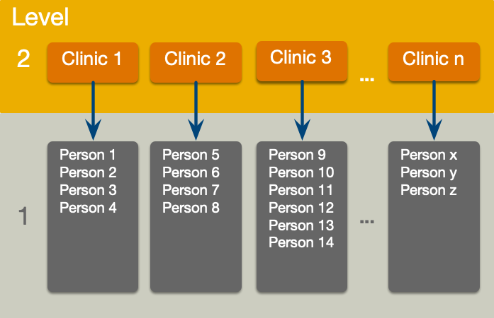

<html lang="en">

```{r setup, include=FALSE}
knitr::opts_chunk$set(
	echo = TRUE,
	message = FALSE,
	warning = TRUE
)

#necessary to render tutorial correctly
library(learnr) 
library(htmltools)
#tidyverse
library(dplyr)
library(ggplot2)
library(forcats)
#non tidyverse
library(broom.mixed)
library(broom)
library(datawizard)
library(Hmisc)
library(insight)
library(interactions)
library(lme4)
library(lmerTest)
library(modelbased)
library(performance)


source("./www/discovr_helpers.R")


#Read data files needed for the tutorial

cosmetic_tib <- discovr::cosmetic

cosmetic_evil_tib <- cosmetic_tib |> 
  dplyr::mutate(
    clinic = forcats::fct_relevel(clinic, paste("Clinic", c(1, 13, 19, 10, 20, 11, 7, 5, 18, 12, 9, 2, 3, 6, 15, 17, 4, 8, 14, 16))),
    reason = forcats::fct_relevel(reason, "Physical reason", "Change appearance")
    )
```

```{r, eval = F, echo = F}
# Create bib file for R packages
here::here("inst/tutorials/discovr_14/packages.bib") |> 
  knitr::write_bib(c('tidyverse', 'dplyr', 'readr', 'forcats', 'tibble', 'tidyr', 'here', 'purrr', "broom", "broom.mixed", 'datawizard', 'Hmisc', 'insight', 'interactions', 'lme4', 'lmerTest', 'modelbased', 'robustlmm', 'performance'), file = _)
```


# discovr: Multilevel models

## Overview

<div class="infobox">
  
  
  **Usage:** This tutorial accompanies [Discovering Statistics Using R and RStudio](https://www.discovr.rocks/) [@field_discovering_2023] by [Andy Field](https://en.wikipedia.org/wiki/Andy_Field_(academic)). It contains material from the book so there are some copyright considerations but I offer them under a [Creative Commons Attribution-NonCommercial-NoDerivatives 4.0 International License](http://creativecommons.org/licenses/by-nc-nd/4.0/). Tl;dr: you can use this tutorial for teaching and non-profit activities but please don't meddle with it or claim it as your own work.
  
</div>

### `r cat_space(fill = blu)` Welcome to the `discovr` space pirate academy

Hi, welcome to **discovr** space pirate academy. Well done on embarking on this brave mission to planet `r rproj()`s, which is a bit like Mars, but a less red and more hostile environment. That's right, more hostile than a planet without water. Fear not though, the fact you are here means that you *can* master `r rproj()`, and before you know it you'll be as brilliant as our pirate leader Mae Jemstone (she's the badass with the gun). I am the space cat-det, and I will pop up to offer you tips along your journey.

On your way you will face many challenges, but follow Mae's system to keep yourself on track:

* `r bmu(height = 1.5)` This icon flags materials for *teleporters*. That's what we like to call the new cat-dets, you know, the ones who have just teleported into the academy. This material is the core knowledge that everyone arriving at space academy must learn and practice. For accessibility, these sections will also be labelled with [(1)]{.alt}.
* `r user_visor(height = 1.5)` Once you have been at space pirate academy for a while, you get your own funky visor. It has various modes. My favourite is the one that allows you to see everything as a large plate of tuna. More important, sections marked for cat-dets with visors goes beyond the core material but is still important and should be studied by all cat-dets. However, try not to be disheartened if you find it difficult. For accessibility, these sections will also be labelled with [(2)]{.alt}.
* `r user_astronaut(height = 1.5)` Those almost as brilliant as Mae (because no-one is quite as brilliant as her) get their own space suits so that they can go on space pirate adventures. They get to shout *RRRRRR* really loudly too. Actually, everyone here gets to should *RRRRRR* really loudly. Try it now. Go on. It feels good. Anyway, this material is the most advanced and you can consider it optional unless you are a postgraduate cat-det. For accessibility, these sections will also be labelled with [(3)]{.alt}.

It's not just me that's here to help though, you will meet other characters along the way:

* `r alien(height = 1.5)` aliens love dropping down onto the planet and probing humanoids. Unfortunately you'll find them probing you quite a lot with little coding challenges. Helps is at hand though. 
* `r robot(height = 1.5)` **bend-R** is our coding robot. She will help you to try out bits of `r rproj()` by writing the code for you before you encounter each coding challenge.
* `r bug(height = 1.5)` we also have our friendly alien bugs that will, erm, help you to avoid bugs in your code by highlighting common mistakes that even Mae Jemstone sometimes makes (but don't tell her I said that or my tuna supply will end). 

Also, use hints and solutions to guide you through the exercises (Figure 1).

<figure>

<figcaption>Figure 1: In a code exercise click the hints button to guide you through the exercise.</figcaption>
</figure> 
 

By for now and good luck - you'll be amazing!

### Workflow

* Before attempting this tutorial it's a good idea to work through [this tutorial on how to install, set up and work within `r rproj()` and `r rstudio()`](https://milton-the-cat.rocks/learnr/r/r_getting_started/).

* The tutorials are self-contained (you practice code in code boxes). However, so you get practice at working in `r rstudio()` I strongly recommend that you create an Quarto document within an `r rstudio()` project and practice everything you do in the tutorial in the Quarto document, make notes on things that confused you or that you want to remember, and save it. Within this Quarto document you will need to load the relevant packages and data. 


### Packages

This tutorial uses the following packages:

* `broom` [@R-broom]
* `broom.mixed` [@R-broom.mixed]
* `datawizard` [@R-datawizard] 
* `here` [@R-here]
* `interactions` [@interactions]
* `lme4` [@bates_fitting_2015]
* `lmerTest` [@kuznetsova_lmertest_2017]
* `modelbased` [@R-modelbased]
* `performance` [@R-performance]

It also uses these `tidyverse` packages [@R-tidyverse; @tidyverse2019]: `readr` [@R-readr], `dplyr` [@R-dplyr], `forcats` [@R-forcats],  `ggplot2` [@wickhamGgplot2ElegantGraphics2016], `purrr` [@R-purrr], `tibble` [@R-tibble], and `tidyr` [@R-tidyr].


### Coding style

There are (broadly) two styles of coding:

1. **Explicit**: Using this style you declare the package when using a function: `package::function()`. For example, if I want to use the `mutate()` function from the package `dplyr`, I will type `dplyr::mutate()`. If you adopt an explicit style, you don't need to load packages at the start of your Quarto document (although see below for some exceptions). 

2. **Concise**: Using this style you load all of the packages at the start of your Quarto document using `library(package_name)`, and then refer to functions without their package. For example, if I want to use the `mutate()` function from the package `dplyr`, I will use `library(dplyr)` in my first code chunk and type the function as `mutate()` when I use it subsequently.

Coding style is a personal choice. The [Google `r rproj()` style guide](https://google.github.io/styleguide/Rguide.html) and [tidyverse style guide](https://style.tidyverse.org/) recommend an explicit style, and I use it in teaching materials for two reasons (1) it helps you to remember which functions come from which packages, and (2) it prevents clashes resulting from using functions from different packages that have the same name. However, even with this style it makes sense to load `tidyverse` because the `dplyr` and `ggplot2` packages contain functions that are often used within other functions and in these cases explicit code is difficult to read. Also, no-one wants to write `ggplot2::` before every function from `ggplot2`.

You can use either style in this tutorial because all packages are pre-loaded. If working outside of the tutorial, load the `tidyverse` package (and any others if you're using a concise style) at the beginning of your Quarto document:

```{r eval = FALSE}
library(tidyverse)
```

### Data

To work *outside of this tutorial* you need to download the following data files:

* [cosmetic.csv](https://www.discovr.rocks/csv/cosmetic.csv)

Set up an `r rstudio()` project in the way that [I recommend in this tutorial](https://milton-the-cat.rocks/learnr/r/r_getting_started/#section-working-in-rstudio), and save the data files to the folder within your project called [data]{.alt}. Place this code in the first code chunk in your Quarto document:

```{r, eval=FALSE}
cosmetic_tib <- here::here("data/cosmetic.csv") |>
  readr::read_csv() |>
    dplyr::mutate(
      clinic = forcats::as_factor(clinic) |> forcats::fct_relevel(paste("Clinic", seq(1, 20, 1))),
      reason = forcats::as_factor(reason) |> forcats::fct_relevel("Change appearance")
  )
```

This code reads in the data and converts the variables **reason** and **clinic** to factors (categorical variable). It uses `fct_relevel` to set the order of the levels of the factor **reason** to be change appearance and physical reason, and to set the levels of the factor **clinic** to be Clinic 1, Clinic 2 ... Clinic 10 in numeric order (try executing the code `paste("Clinic", seq(1, 10, 1))` and you'll see it pastes the text "Clinic " to the numbers 1 to 10 in turn.

## `r bmu()` Cosmetic surgery [(1)]{.alt}

In my book I describe an example about the effects of cosmetic surgery on quality of life. The data are in [cosmetic_tib]{.alt}, which has the following variables:

* **id**: the participant's code
* **post_qol**: This is the outcome variable and it measures quality of life after cosmetic surgery from 0 to 100%.
* **base_qol**: quality of life before cosmetic surgery.
* **days**: The number of days after surgery that post-surgery quality of life was measured.
* **clinic**: which of 21 clinics the person attended to have their surgery.
* **bdi**: This variable measures levels of depression using the Beck Depression Inventory (BDI).
* **reason**: This variable specifies whether the person had surgery purely to change their appearance or because of a physical reason.


#### `r alien()` Alien coding challenge

View the data in [cosmetic_tib]{.alt}.

```{r dat_view, exercise = TRUE}
     
```

```{r dat_view-solution}
cosmetic_tib   
```

## `r bmu()` Preparing categorical variables [(1)]{.alt}

In these tutorials I tend to be kind to you and set up categorical predictors in the datasets in a way that categories are coded conveniently for the hypotheses being tested. Real life is often not as kind as I am. It's always a good idea to check explicitly that factor levels are ordered how you want them to be. This optional section gives you practice at doing this.

### `r bmu()` The `factor()` and `as_factor()` functions [(1)]{.alt}

First, let's explore the potential confusion created by the different behaviour of the `as_factor()` and `factor()` functions. In my book I use the `as_factor()` function from `forcats` (see [discovr_01]{.alt}), but sooner or later you will come across the `factor()` function in base `r rproj()` and you might want to use it. However, the functions behave differently as we'll now demonstrate.

First, we will create a character variable with two values (`c("Silver", "Gold")`), convert it to a factor with `factor()` and inspect the levels using `levels()`. The code below does this, execute it and see what happens.

```{r fct_level_ex, exercise = TRUE, exercise.lines = 5}
c("Silver", "Gold") |>
  factor() |> 
  levels()
```

Note that levels have been assigned alphabetically:  the first level is 'Gold' and the second level is 'Silver'. Let's repeat the exercise but change `factor()` to `forcats::as_factor()`.

```{r fct_level_ex2, exercise = TRUE, exercise.lines = 5}
c("Silver", "Gold") |>
  forcats::as_factor() |> 
  levels()
```

Note that levels have been assigned in the order of the data, so the first level is 'Silver' and the second level is 'Gold'.

In short, when converting character variables to factors the `as_factor()` function assigned levels in the order that it discovers them in the data, but the `factor()` function assigns them alphabetically. If the variable is not arranged alphabetically then the resulting factors will have differently ordered levels. The moral here is never assume that you know the order of factor levels!

### `r bmu()` Checking the order of factor levels [(1)]{.alt}

Let's imagine a world where I'm not nice and I've given you the cosmetic surgery data in `cosmetic_evil_tib`, which is the same as `cosmetic_tib` but more evil. It contains two categorical variables: **clinic** and **reason**. We can check the levels of these factors by placing each one in the `levels()` function.

#### `r alien()` Alien coding challenge

The code box shows the code the code to check the levels of the variable **clinic**, add similar code to check **reason** and run it.

```{r fct_levels, exercise = TRUE, exercise.lines = 3}
levels(cosmetic_evil_tib$clinic)
```

```{r fct_levels-solution}
levels(cosmetic_evil_tib$clinic)
levels(cosmetic_evil_tib$reason)
```

The evilness of this tibble should now be apparent because for **clinic** the order or clinics is all over the place. In a sense this doesn't matter because this variable doesn't end up being used as a predictor in the model so maybe you don't care that the order is "Clinic 1"  "Clinic 13"  "Clinic 19" ... "Clinic 16". However, if you're as anal retentive as I am then this order will annoy you when you plot the data because the clinics won't be displayed in numeric sequence! The evil doesn't end there. For **reason**, the first level is physical reason and the second level is change appearance. This order is the opposite of what we want because ideally we want the *b* for this effect to represent the difference in quality of life when surgery is to address a physical/medical problem compared to when it is for cosmetic reasons. It doesn't *matter* as such, we can switch our interpretation of the resulting *b*, but the point remains that you need to know the order of the factor levels to interpret the model parameters.

Have you ever known a tibble more evil than this one? At some point in your relationship with `r rproj()` you will face this situation.

<div class="tip">
  `r cat_space()` **Tip: factor levels**

Never assume that you know the order of factor levels. Always check the order of levels using `levels(name_of_factor)` (where [name_of_factor]{.alt} is the name of the factor variable) so that you know what the resulting model parameters (*b*s) represent.

</div>

### `r bmu()` Reordering factor levels (revision) [(1)]{.alt}

Way back in [discovr_01]{.alt}  we met the `fct_relevel()` function from the `forcats` package. Let's refresh our memories. The function takes this general form:

```{r, eval = F}
fct_relevel(name_of_factor, levels_to_move, after = 0)
```

So you place the name of the factor that you want to relevel, then list any levels you want to move and use [after =]{.alt} to say which level you want them placed after. By default [after = 0]{.alt}, which means that the specified level is made the first level (it is moved to the beginning).

#### `r robot()` Code example

For the **reason** factor, for example we could move the level labelled ["Physical reason"]{.alt} to be the last level using either of these chunks of code

```{r eval = F}
cosmetic_evil_tib <- cosmetic_evil_tib |>
  dplyr::mutate(
    reason = forcats::fct_relevel(reason, "Change appearance")
  )

cosmetic_evil_tib <- cosmetic_evil_tib |>
  dplyr::mutate(
    reason = forcats::fct_relevel(reason, "Physical reason", after = Inf)
  )
```

In both blocks of code we recreate `cosmetic_evil_tib` using `mutate` to copy over the existing variable **reason** with a version of itself that has the reordered factor levels. In the first pipe we achieve the reordering by using the default option, which is to set the specified level as the first level. The code, therefore, sets "Change appearance" as level 1. The second block of code uses [after = Inf]{.alt} ([Inf]{.alt} is short for infinite) to move "Physical reason" to the final level (whatever that may be). This second method is particularly useful when you want to move a level to the end but you don't know how many levels there are off the top of your head. Both blocks of code have the same effect: they set the levels to be ordered as physical reason and change appearance.

<div class="tip">
  `r cat_space()` **Tip**

When you specify levels of a factor the text must exactly match that of the variable level. In the example above if you type \"physical reason\" or \"Physicalreason\" the command will fail because neither exactly match the factor level of \"Physical reason\". Check that upper and lower case letters match with the factor level and the spaces are correct."

</div>

#### `r robot()` Code example

An alternative is to list the levels in the order you want them, we will need to use this method for the variable **clinic** because there are so many levels.

```{r eval = F}
cosmetic_evil_tib <- cosmetic_evil_tib |>
  dplyr::mutate(
    clinic = forcats::fct_relevel(clinic, "Clinic 1", "Clinic 2", "Clinic 3", "Clinic 4", "Clinic 5", "Clinic 6", "Clinic 7", "Clinic 8", "Clinic 9", "Clinic 10", "Clinic 11", "Clinic 12", "Clinic 13", "Clinic 14", "Clinic 15", "Clinic 16", "Clinic 17", "Clinic 18", "Clinic 19", "Clinic 20")
  )
```

The code above is inefficient: it's time consuming to write out all 20 levels. We can make it more efficient by using the `paste()` function to create the levels (see the tip box). The resulting code is

```{r eval = F}
cosmetic_evil_tib <- cosmetic_evil_tib |>
  dplyr::mutate(
    clinic = forcats::fct_relevel(clinic, paste("Clinic", 1:20))
  )
```

<div class="tip">
  `r cat_space()` **Tip: generating sequences of text and numbers**

The levels of **clinic** have a common pattern. They are the word "Clinic" (with an upper-case C), then a space, then a number. In `r rproj()` we can create a sequence of integers using the code `start:stop` in which `start` is the first integer and `stop` is the last. For example, `1:20` creates the sequence 1, 2, 3, 4, 5, 6, 7, ..., 19, 20. The `paste()` function pastes things together putting a space between them. So `paste("Clinic", 1)` creates the string "Clinic 1". If we ask `paste()` to combine a word with a sequence of numbers then it creates a sequence of the word pasted to each of the numbers in turn.

```{r, echo = T, class.source = '.panel_alt'}
paste("Clinic", 1:20)
```


We can use this code to create the 20 factor levels efficiently.

</div>

#### `r alien()` Alien coding challenge

Use the code box to relevel do the following with [cosmetic_evil_tib]{.alt}, 

* Relevel **clinic** so that the clinics are in numeric sequence
* Relevel **reason** so that *Change appearance* is the first level
* View the levels of the two variables to check the relevelling has been a success!

```{r relevel_fcts, exercise = TRUE, exercise.lines = 10}

```

```{r relevel_fcts-solution}
#There are various ways (see text for details) but this is probably the most efficient

cosmetic_evil_tib <- cosmetic_evil_tib |> 
  dplyr::mutate(
    clinic = forcats::fct_relevel(clinic, paste("Clinic", 1:20)),
    reason = forcats::fct_relevel(reason, "Change appearance")
  )


levels(cosmetic_evil_tib$clinic)
levels(cosmetic_evil_tib$reason)
```

That optional detour has shown you how to check the levels of any categorical predictors and make sure that categories are in the order you want them. From now on we'll return to using the tibble called [cosmetic_tib]{.alt} that has the categorical variables set up as we want them.

## `r user_astronaut()` The model [(3)]{.alt}

We're going to predict quality of life after surgery (**post_qol**) from the number of **days** since surgery, quality of life before surgery (**base_qol**), the **reason** for surgery and the combined effect of the days since surgery and the reason. When ignoring the hierarchical structure of the data this model is described as


$$
\begin{aligned}
Y_i &= \beta_0 + \beta_1X_{1i} + \dots + \beta_nX_{ni} + \varepsilon_i\\
\text{QoL}_i &= \beta_0  + \beta_1\text{Days}_i + \beta_2\text{Pre QoL}_i + \beta_3\text{Reason}_i +  \beta_4\text{Days} \times \text{Reason}_i + \varepsilon_i
\end{aligned}
$$

However, the data has a hierarchical structure because people attended one of 20 clinics (Figure 1). We might, therefore, want to model the possibility of the overall quality of life varying across these clinics/contexts. This is a [random intercepts]{.alt} model and is represented as


$$
\begin{aligned}
\text{QoL}_{ij} &= [\beta_0  + \beta_1\text{Days}_{ij} + \beta_2\text{Pre QoL}_{ij} + \beta_3\text{Reason}_{ij} +  \beta_4\text{Days} \times \text{Reason}_{ij}] \\
&\qquad + [u_{0j} + \varepsilon_{ij}]
\end{aligned}
$$

Note that we have added a variable to the model ($u_{0j}$) that represents the deviation of each of the *j* clinic's intercept from the overall intercept ($\beta_0$). In other words, we will estimate the variability of overall quality of life across clinics. Also note that all predictors and the error term ($\varepsilon$) have the subscript $_{ij}$ to show that they vary by both participant (*i*) and clinic (*j*).

We might also expect the effect of the days since surgery to vary across clinics. We can model this variability by including a variable ($u_{1j}$) that represents the deviation of the effect of **days** in each of the *j* clinics from the overall effect of **days** ($\beta_1$). The final model will, therefore, be

$$
\begin{aligned}
\text{QoL}_{ij} &= [\beta_0  + \beta_1\text{Days}_{ij} + \beta_2\text{Pre QoL}_{ij} + \beta_3\text{Reason}_{ij} +  \beta_4\text{Days} \times \text{Reason}_{ij}] \\
&\qquad + [u_{0j} + u_{1j}\text{Days}_{ij} + \varepsilon_{ij}]
\end{aligned}
$$




## `r user_visor()` Exploring data [(2)]{.alt}
### `r user_visor()` Visualizing data [(2)]{.alt}

#### `r robot()` Code example

Let's plot the data by recreating the image from the book. The code is

```{r echo = T, eval = F}
ggplot2::ggplot(cosmetic_tib, aes(days, post_qol)) +
  geom_point(alpha = 0.5, size = 1) +
  geom_smooth(method = "lm", size = 0.5) +
  coord_cartesian(xlim = c(0, 400), ylim = c(0, 100)) +
  scale_y_continuous(breaks = seq(0, 100, 10)) +
  labs(x = "Days post surgery", y = "Quality of life after surgery (%)") +
  facet_wrap(~ clinic, ncol = 4) +
  theme_minimal()
```

Let's break this code down

* The first line is a standard `ggplot()` command within which we define the data as being in [cosmetic_tib]{.alt}. Then within `aes()` we plot **days** on the *x*-axis, **post_qol** on the *y*-axis.
* Next we use `geom_point()` to add the raw data as points (of size 1 and transparency 0.5).
* The third line uses `geom_smooth()` to plot a line of the relationship between **days** and **post_qol**. We set the line size to 0.5.
* The next three lines should be familiar to you: they use `coord_cartesian()` to determine the limits of the axes, `scale_y_continuous()` to set the tick intervals on the *y*-axis, and `labs()` to specify the axis labels.
* Next we use `facet_wrap()` to create separate plots for each clinic and to arrange them in 4 columns. * Finally, we apply a minimal theme with `theme_minimal()`

#### `r alien()` Alien coding challenge

Create a plot of surgery effect split by clinic using the code example.

```{r plot, exercise = TRUE, exercise.lines = 10}
     
               
```

```{r plot-solution}
ggplot2::ggplot(cosmetic_tib, aes(days, post_qol)) +
  geom_point(alpha = 0.5, size = 1) +
  geom_smooth(method = "lm", size = 0.5) +
  coord_cartesian(xlim = c(0, 400), ylim = c(0, 100)) +
  scale_y_continuous(breaks = seq(0, 100, 10)) +
  labs(x = "Days post surgery", y = "Quality of life after surgery (%)") +
  facet_wrap(~ clinic, ncol = 4) +
  theme_minimal()
```

### `r user_visor()` Summary statistics [(2)]{.alt}

We might want some summary statistics of quality of life scores split by **clinic**. We can create a basic table of descriptive statistics using by grouping the data by **clinic** and then passing it into the `describe_distribution()` function of the `datawizard` package.

```{r, eval = F}
qol_sum <- cosmetic_tib |>
  dplyr::group_by(clinic) |>
  datawizard::describe_distribution(select = c("base_qol", "post_qol"), ci = 0.95)
qol_sum
```

In this code, we select the variables **base_qol** and **post_qol** and set the confidence interval to be 95%.

#### `r alien()` Alien coding challenge

Use the code above to get a table of summary statistics.


```{r desc, exercise = TRUE, exercise.lines = 6}
             
```

```{r desc-solution}
qol_sum <- cosmetic_tib |>
  dplyr::group_by(clinic) |>
  datawizard::describe_distribution(select = c("base_qol", "post_qol"), ci = 0.95)
qol_sum
```


## `r user_visor()` Fitting fixed effect models [(2)]{.alt}

The next phase is to fit the model without the random effects to get a feel for the fit across contexts. The model we're fitting (which we saw earlier) is

$$
\begin{aligned}
\text{QoL}_i &= \beta_0  + \beta_1\text{Days}_i + \beta_2\text{Pre QoL}_i + \beta_3\text{Reason}_i +  \beta_4\text{Days} \times \text{Reason}_i + \varepsilon_i
\end{aligned}
$$


Bolker and colleagues (@bolker_generalized_2009) suggest fitting this model to the pooled data, and then within the individual levels of any contextual variables (in this case the clinics). In both cases we can use the `lm()` function, which we've used many times before, because there are no random effects.

###  `r user_visor()` Fit the pooled model  [(2)]{.alt}

Let's do the pooled model first.

#### `r alien()` Alien coding challenge

Use the code box below to create an object called [pooled_lm]{.alt} that is the above model fitted to the entire data set (in [cosmetic_tib]{.alt}). Use `tidy()` to view the model parameters.

```{r pooled_lm, exercise = TRUE, exercise.lines = 4}
     
             
```


```{r pooled_lm-hint-1}
# create and store the pooled model (remember that x*y will include the effects of x, y and their interaction)
pooled_lm <- lm(xxx ~ xxx*xxx + xxx, data = xxx)
```

```{r pooled_lm-hint-2}
# create and store the pooled model
pooled_lm <- lm(post_qol ~ days*reason + base_qol, data = cosmetic_tib)
# view the model parameters
broom::tidy(xxxxx, conf.int = TRUE)
```

```{r pooled_lm-solution}
pooled_lm <- lm(post_qol ~ days*reason + base_qol, data = cosmetic_tib)
broom::tidy(pooled_lm, conf.int = TRUE)
```

We're interested in the parameter estimates to guide our expectations about what to expect in the model that includes the random effects. For example, the overall effect of **days** appears to be that for every extra day since surgery, quality of life increases by 0.009 units. This effect seems tiny, but how much would you expect quality of life to change in only 1 day? It's helpful to think about what this effect equates to over, say, 4 months (120 days) or a year (365 days). This effect equates to about a unit change in quality of life over 4 months and about 3 units over a year. In the context of a 100-point scale, this is not a huge change.

###  `r user_astronaut()` Fit the model in individual clinics  [(3)]{.alt}

Let's fit the same model to the individual clinics. Prepare for a world of pain.

To fit the fixed-effects model within each clinic separately we could filter the data to include only a single clinic, fit the model, and repeat for the other 20 clinics. There is a more elegant way to achieve this using the `map()` function from the `purrr` package, which enables you to apply a function to multiple items simultaneously.

We'll build up the code bit by bit. Ultimately, we're going to create an object called [clinic_lms]{.alt} that contains the linear models for the 20 clinics. We start by piping the data ([cosmetic_tib]{.alt}) into the `arrange()` function to order the data by the variable **clinic**. In doing so the rows of the data are sorted, in order, from clinic 1 to 20. This step isn't essential but if you are as anal-retentive as me it will stop you having palpitations when you look at the resulting table. Next, we use `group_by()` to group the output by the variable **clinic**. Finally (for now), we use `nest()` from the `tidyr` package to collapse the data within each clinic.

```{r, eval = F}
clinic_lms <- cosmetic_tib  |>
  dplyr::arrange(clinic) |> 
  dplyr::group_by(clinic)  |>  
  tidyr::nest()
```

#### `r alien()` Alien coding challenge

Create [clinic_lms]{.alt} using the code above and inspect it.

```{r clinic_lms, exercise = TRUE, exercise.lines = 8}
     
             
```

```{r clinic_lms-solution}
clinic_lms <- cosmetic_tib  |>
  dplyr::arrange(clinic) |> 
  dplyr::group_by(clinic)  |>  
  tidyr::nest()
clinic_lms
```

Let's take stock of what you have created. You should see a tibble with 20 rows and two columns. The first column lists the clinics (in order because we ordered them) and the second column is labelled **data** and each row says [\<tibble\>]{.alt}. This is because the `nest()` function has nested the data within each clinic. If we were to inspect the cell in the first row of the column labelled **data** we would find that it contains the clinic 1 data in a tibble. So, we have a tibble within a tibble. You can see this by executing the code in the box below, which instructs `r rproj()` to show us the first item ([[[1]]]{.alt}) in the variable **data** within the object [clinic_lms]{.alt}. Change the number in the square bracket to view a different row, for example `clinic_lms$data[[9]]` will show the 9th item in the variable **data** within the object [clinic_lms]{.alt}, which you'll see is the data for clinic 9.

```{r clinic_nest-setup}
clinic_lms <- cosmetic_tib  |>
  dplyr::arrange(clinic) |> 
  dplyr::group_by(clinic)  |>  
  tidyr::nest()
```


```{r clinic_nest, exercise = TRUE, exercise.lines = 1}
clinic_lms$data[[1]]  
```

To sum up, the `nest()` function has enabled us to store individual tibbles (data sets) in a tabulated format, which means that we can now use `mutate()` to create new columns based on the individual data sets stored in the column called **data**.

The next step is to create a new column called **model** that contains the results of fitting a linear model, using `lm()`, to the datasets within each clinic (which are stored in the column **data**). To do this we use the `map()` function from `purrr`, which has the following format

```{r, eval = F}
purrr::map(.x = my_data, .f = a_function_I_want_to_apply_to_the_data)
```

In our example, we want to fit the model
`lm(post_qol ~ surgery*reason + base_qol, data = my_data)`
to each dataset stored in the variable called **data**. To do this we embed the following code, which takes advantage of something called a lambda function, within `mutate()`

```{r, eval = F}
dplyr::mutate(
    model = purrr::map(.x = data,
                       .f = \(clinic_tib) lm(post_qol ~ days*reason + base_qol, data = clinic_tib)))
```

If you don't know what a lambda function is then now would be a good time to read the information box.

<div class="infobox">
  `r info()` **Lambda functions**

In the book I discuss creating your own functions. In short, when we use a function like `mean()` we are accessing some code that someone else has written that computes a mean. We usually place something in the brackets, there are known as inputs or arguments. We can write our own functions like using this general format

```{r, eval = F}
name_of_function <- function(input, another_input){what_to_do_with_the_inputs}
```

For example, to create a function that adds two numbers we could execute

```{r, eval = F}
add_2_things <- function(first_number, second_number){first_number + second_number}
```

This code creates a new function called `add_2_things()`. The stuff in brackets tells the function to expect two inputs/arguments. I've called the first input [first_number]{.alt} and the second [second_number]{.alt}. The stuff in the curly braces then tells the function what to do with these inputs (in this case it adds the two inputs). The names I assigned to the inputs are arbitrary, these two versions of the code are equivalent to each other and to the code above

```{r, eval = F}
add_2_things <- function(x, y){x + y}
add_2_things <- function(alice, milton){alice + milton}
```

In each case we have changed the names of the inputs and carried those changes into the curly brackets. The function we have just created is called a [named function]{.alt} because we assigned it a name (`add_2_things()`) and because it has a name, we can use it within our session like any other function. For example, we can add the numbers 52 and 79 by executing

```{r, eval = F}
add_2_things(first_number = 52, second_number = 79)
```

or equivalently

```{r, eval = F}
add_2_things(52, 79)
```

In each case the function returns the result (in this case 131).  Sometimes, we need a function for a specific purpose and don't need to name it. In this case we create an [anonymous function]{.alt}, also known as a [lambda function]{.alt}. To create one of these we use this syntax

```{r, eval = F}
\(input) {what_to_do_with_the_input}
```

Note that because we're not assigning the function a name we use `\()` as shorthand for `function()`. It's also not necessary to use the curly braces if the contents of the function is a single line of code. The anonymous function below squares whatever number you put into it

```{r, eval = F}
\(x) {x^2}
```

Again, [x]{.alt} is an arbitrary label. This code is equivalent

```{r, eval = F}
\(number) {number^2}
```

but by labelling the input as `number` we make the code more readable because it we can see that the function expects a number as its input `\(number)` and squares whatever that number is as its output `{number^2}`.

</div>


Let's break this code down

* `.x = data` tells `map()` to use the **data** variable from the main tibble.
* `.f = \(clinic_tib)` creates a function that will be applied to the variable we specified as `.x` (in this case, the function will be applied to the variable **data** because we used `.x = data`).  Notice that we've named the input of the function as [clinic_tib]{.alt} to remind us that we're feeding the tibble from each individual clinic into the function, but we could have named it something different. Next, we tell the function what to do with each clinic's data using `lm(post_qol ~ days*reason + base_qol, data = clinic_tib)`. Notice that within `lm()` we set the data argument to be the input of the function ([data = clinic_tib]{.alt}).

Think of it like this: `map()` sends each tibble within **data** to the anonymous function `\(clinic_tib)`, where it is given the name `clinic_tib` so that it can be set as the data to which `lm()` fits the model. Basically a model predicting post-surgery quality of life from **days**, **reason**, their interaction and baseline quality of life (`post_qol ~ surgery*reason + base_qol`) is fitted to the data from each clinic separately and stored in a new column called **model**.

We can also store the coefficient table of each model we've fitted in a new variable called **coeffs** by again using `map()` to apply the `tidy()` function from `broom` to each of the models stored in the variable called **model** that we just created. We could add this the mutate function above

```{r, eval = F}
dplyr::mutate(
    model = purrr::map(.x = data,
                       .f = \(clinic_tib) lm(post_qol ~ days*reason + base_qol, data = clinic_tib)),
    coefs = purrr::map(model, broom::tidy, conf.int = TRUE)
    )
```

#### `r robot()` Code example

Yes, it's mind-bending. Now if we pipe the earlier code that arranged, grouped and nested the clinics into this mutate function, we get the full code needed to create the individual models and store them as [clinic_lms]{.alt}.

```{r, eval = F}
clinic_lms <- cosmetic_tib  |>
  dplyr::arrange(clinic) |> 
  dplyr::group_by(clinic)  |>  
  tidyr::nest()  |> 
  dplyr::mutate(
    model = purrr::map(.x = data, .f = \(clinic_tib) lm(post_qol ~ days*reason + base_qol, data = clinic_tib)),
    coefs = purrr::map(model, broom::tidy, conf.int = TRUE)
    )
```

#### `r alien()` Alien coding challenge

Create [clinic_lms]{.alt} using the code above and inspect it.

```{r clinic_lms2, exercise = TRUE, exercise.lines = 12}
     
             
```

```{r clinic_lms2-solution}
clinic_lms <- cosmetic_tib  |>
  dplyr::arrange(clinic) |> 
  dplyr::group_by(clinic)  |>  
  tidyr::nest()  |> 
  dplyr::mutate(
    model = purrr::map(.x = data, .f = \(clinic_tib) lm(post_qol ~ days*reason + base_qol, data = clinic_tib)),
    coefs = purrr::map(model, broom::tidy, conf.int = TRUE)
    )
clinic_lms
```

The object [clinic_lms]{.alt} is now a tibble with 20 rows and four columns. As we saw earlier, the first column lists the clinics and the second column, **data** contains the data for an individual clinic stored as a tibble. The third column, **model**, has cells labelled [<S3: lm>]{.alt}, which tells us that each cell contains an object created with the `lm()` function. Basically, the cell in each row of this column contains the fitted model for the corresponding clinic. For example, if we were to access the contents of the cell in row 5 and apply `summary()` to it we'd see the model summary for clinic 5. The code in the box below does this, run this code then change the number in the square brackets to [2]{.alt} to see the second row of **model**, which is the model for clinic 2.

```{r clinic_lms_setup}
clinic_lms <- cosmetic_tib  |>
  dplyr::arrange(clinic) |> 
  dplyr::group_by(clinic)  |>  
  tidyr::nest()  |> 
  dplyr::mutate(
    model = purrr::map(.x = data, .f = \(clinic_tib) lm(post_qol ~ days*reason + base_qol, data = clinic_tib)),
    coefs = purrr::map(model, broom::tidy, conf.int = TRUE)
    )
```


```{r clinic_lm, exercise = TRUE, exercise.lines = 2, exercise.setup = "clinic_lms_setup"}
clinic_lms$model[[5]] |> summary()
```

The fourth column, **coefs**, has cells labelled [\<tibble\>]{.alt}, which tells us that each cell contains a tibble. Specifically, for each row the cell in this column contains the tibble of model parameters generated by `tidy()` for the fitted model in the corresponding clinic. For example, if we were to access the contents of the cell in row 9 we'd see the table of model parameters for clinic 9. Try this by executing the code in the box below to see the coefficients for the model for clinic 5. Change the number in the square brackets to 2 to view the parameter estimates for the model fitted in clinic 2.

```{r clinic_coefs, exercise = TRUE, exercise.lines = 2, exercise.setup = "clinic_lms_setup"}
clinic_lms$coefs[[5]]
```

Having fit the model in each clinic we could view the model parameters by unnesting the data using 

```{r, eval = F}
models_tib <- clinic_lms  |>
  dplyr::select(-c(data, model)) |> 
  tidyr::unnest(coefs)
models_tib
```

This code creates and displays an object called [models_tib]{.alt}, that takes the [clinic_lms]{.alt} object that we just created, ignores the variables **data** and **model**, and then unnests the data by the variable **coefs**, which expands the tibbles of parameter estimates stored in **coefs** into rows. In other words, instead of each clinic occupying a single row in the tibble it will now occupy 5 rows (one for the intercept and one for each of the 4 predictors).

#### `r alien()` Alien coding challenge

Use the code above to view the 20 models we've just created.

```{r clinic_unnest, exercise = TRUE, exercise.lines = 6, exercise.setup = "clinic_lms_setup"}
 
             
```

```{r clinic_unnest-solution}
models_tib <- clinic_lms  |>
  dplyr::select(-c(data, model)) |> 
  tidyr::unnest(coefs)
models_tib
```

The result is a 100 row tibble. Basically we have stacked the tables of model parameters for each clinic into a single table. In doing so we can compare the parameter estimates across clinics, and generally get a feel for what's going on in the data? Is there variability in intercepts? Is there variability in slopes? Is the effect of days and the days × reason interaction consistent across clinics?

#### `r alien()` Alien coding challenge

All of these questions are difficult to answer when scanning a 100-row table. Let's make life a bit easier by plotting the information instead. Use what you know about `ggplot2` to plot the parameter estimates in [models]{.alt} (in the variable **estimate**) using `geom_density()` and then `facet_wrap()` to create different plots for the different predictors in the model (in the variable **term**).

```{r parameter_plot_setup, exercise.setup = "clinic_lms_setup"}
models_tib <- clinic_lms  |>
  dplyr::select(-c(data, model)) |> 
  tidyr::unnest(coefs)
```


```{r parameter_plot, exercise = TRUE, exercise.lines = 6, exercise.setup = "parameter_plot_setup"}
 
             
```

```{r parameter_plot-hint-1}
# replace xxx with the variable to be plotted

ggplot(models_tib, aes(xxxx))

# now add a geom
```


```{r parameter_plot-hint-2}
# now add a geom
ggplot(models_tib, aes(estimate)) +
  geom_density()
# now add facet_wrap
```

```{r parameter_plot-hint-3}
# add facet_wrap
ggplot(models_tib, aes(estimate)) +
  facet_wrap(~xxx , scales = "free")
# replace the xxxs and add a theme
```

```{r parameter_plot-solution}
ggplot(models_tib, aes(estimate)) +
  geom_density() +
  facet_wrap(~term , scales = "free") +
  theme_minimal()
```

The resulting plot shows the distributions of the parameter estimates across the 20 clinics. You need to interpret these plots within the context of scale of measurement. For example, the intercept is centred around 30 and (theoretically) should be limited to values in the range of 0 to 100 (the range of the quality of life scale). In this context the fact that the bulk of our estimates range from 0 up to around 50 indicates a lot of variability in intercepts. It makes sense that this variable is treated as a random effect. For days, the mode is around 0.05 and the bulk of the distribution falls between -0.05 and 0.10. This range seems tiny, but context is everything: the variable is measured on a scale of 0 to about 400, so we'd expect a unit change in the predictor (1 unit along a 400 point scale) to have small effects on the outcome. Baseline quality of life (also measured on a 100 point scale) results in parameter estimates that range between about 0.4 and 0.6. Because baseline quality of life and post-surgery quality of life have the same units of measurement, these parameters can be interpreted like a correlation coefficient. It hovers around 0.5 infrequently straying too far from this value. It would be reasonable not to estimate the variability in this parameter. 

 
## `r user_visor()` Fitting multilevel models [(2)]{.alt}
###  `r user_visor()` (Attempt to) fit the model  [(2)]{.alt}

Having got a feel for the data we can finally fit the model. We're going to use the `lmer()` function from the `lme4` package but also load the `lmerTest` package so that we get *p*-values for the model parameters, but we will remember all of the caveats about *p*-values in the book. The `lmer` function takes the following form

```{r, eval = F}
my_model <- lmer(outcome ~ predictor(s) + (random effects), 
                 data = tibble,
                 na.action = an action,
                 REML = TRUE,
                 control = lmerControl(),
                 subset)
```

Essentially it is similar to `lm()` in that we specify a formula that describes the model, and then there are some other arguments that we can use. By default restricted maximum likelihood estimation is used (REML) but we can change to maximum likelihood estimation by specifying [REML = FALSE]{.alt}, we can also fit the model to a subset of the data using the subset argument. The control argument allows us to change aspects of the fitting process. A common use of this is to specify a different optimizer if the model can't be fit.

The model we're fitting (which we saw earlier) is

$$
\begin{aligned}
\text{QoL}_{ij} &= [\beta_0  + \beta_1\text{Days}_{ij} + \beta_2\text{Pre QoL}_{ij} + \beta_3\text{Reason}_{ij} +  \beta_4\text{Days} \times \text{Reason}_{ij}] \\
&\qquad + [u_{0j} + u_{1j}\text{Days}_{ij} + \varepsilon_{ij}]
\end{aligned}
$$

Therefore, we want to include both a random intercept and a random slope for **days** across **clinics**.

<div class="infobox">
  `r info()` **Specifying random effects**

Fixed effects in the model are specified using the same type of formula that we have used throughout these tutorials, where we specify the outcome, use a tilde to mean 'is predicted from' and then list the variables from which to predict it. For example, in previous sections where we fitted individual models to each clinic (i.e. we ignored random effects) we used

`post_qol ~ days*reason + base_qol`

which is equivalent to

`post_qol ~ days + reason + days:reason + base_qol`

To add random effects to the model we include an addition term (or terms) in brackets after the fixed effects that takes for the form

`(effect|variable_within_which_the_effect_varies)`

In which we replace [effect]{.alt} with 1 to specify the intercept and the name of the variable that varies across contexts for a random slope. We also replace [variable_within_which_the_effect_varies]{.alt} with the name of the variable across which effects vary (in this case clinic).

For example, to specify a random intercept across clinics we'd use

`(1|clinic)`

And to specify a random intercept and random slope for the variable days across clinics we'd use

`(1 + days|clinic)`

In fact, intercepts are implied so the following shorthand works too

`(days|clinic)`

For more detail about the `lmer()` syntax see the book chapter.

</div>

#### `r robot()` Code example

To specify the current model we could execute

```{r, eval = F}
cosmetic_mod <- lmerTest::lmer(post_qol ~ days*reason + base_qol + (days|clinic), data = cosmetic_tib)
```

This code creates a model called [cosmetic_mod]{.alt} that was specified in the equation above. 


#### `r alien()` Alien coding challenge

Use the code box below to create [cosmetic_mod]{.alt}.

```{r days_mod, exercise = TRUE, exercise.lines = 4}
          
```


```{r days_mod-solution}
cosmetic_mod <- lmerTest::lmer(post_qol ~ days*reason + base_qol + (days|clinic),
                               data = cosmetic_tib) 
```

Well, that didn't go so well, did it?

###  `r user_astronaut()` A visit from the cockroach of convergence [(3)]{.alt}

You should find that `r rproj()` produces one of those unpleasant error message that it is prone to throw at you. It uses words like 'converge' and 'unidentifiable'. No-one wants to see those words. The 'failed to converge' bit relates to the cockroach of convergence who has scuttled into your model and invited his friends along to spray their cuticular hydrocarbons everywhere and mess with your shit. The book discusses convergence in more detail, but one immediate step is to use the `lme4::allFit()` function on your model -  it will try all available optimizers and report back.

#### `r alien()` Alien coding challenge

Let's give it a whirl by executing.

```{r all_fit-setup}
 cosmetic_mod <- lmerTest::lmer(post_qol ~ days*reason + base_qol + (days|clinic), data = cosmetic_tib)       
```

```{r all_fit, exercise = TRUE, exercise.lines = 2}
lme4::allFit(cosmetic_mod)          
```

The attempts to fit the model with different optimizers haven't gone well. The cockroach of convergence has graffitied your console with his red text of despair. The model fails to converge with every optimizer (bobyqa, Nelder_Mead, nlminbwrap etc.). On the plus side, we know the original failure wasn't a false positive: our model is definitely messed up. 

###  `r user_visor()` Rescaling variables  [(2)]{.alt}

Although the cockroach of convergence is undoubtedly evil, deep inside a slither of good remains and he offers us vital clue by asking [Rescale variables?]{.alt} What does that mean? Our outcome variable (**post_qol**) and one of the predictors (**pre_qol**) can range from 0 to 100, the reason for surgery can range from 0 (change appearance) to 1 (physical reason) but the predictor **days** varies from 0 to 400. Our model has variables measured on very different scales. In particular, **days** is likely to yield a very small parameter. To see why, imagine we expect quality of life to increase by 10 units (a fairly big change on aa 100-point scale) over 400 days. This is a change of 0.027 per day. Remember that the parameter estimate for days is the change in quality of life for every extra day since surgery and so would also be 0.027 (a tiny value). The warning message is suggesting that if the variables were measured on more similar scales the model might converge.

The main problem is likely to be the variable **days** because it has a wide range (0 to 400). We have expressed the time since surgery in days, but this choice is arbitrary. We could have chosen hours, minutes, seconds, months, or years all of which are re-expressions of the same information. If we were to express the time since surgery in months rather than days the range of 0 to 400 days becomes 0 to 13 (approx.) months. This might help because the range has decreased and is more in line with the other variables in the model.

#### `r alien()` Alien coding challenge

Create a variable called **months** in [cosmetic_tib]{.alt} that expresses the days since surgery in months.

<div class="tip">
  `r cat_space()` **Hint**

The months of the year have different numbers of days, but a good enough approximation of the number of days per month is to divide the 365 days of a (non-leap) year by the 12 months of the year.

</div>


```{r months, exercise = TRUE, exercise.lines = 8}
        
```

```{r months-hint-1}
# replace the xxx
cosmetic_tib <- cosmetic_tib |> 
  dplyr::mutate(
    xxx = xxx
  )
```

```{r months-hint-2}
# replace the first xxx with a variable name and the second with a fraction
cosmetic_tib <- cosmetic_tib |> 
  dplyr::mutate(
    months = xxx*xxx
  )
```

```{r months-hint-3}
# replace the xx and xxx with numbers
cosmetic_tib <- cosmetic_tib |> 
  dplyr::mutate(
    months = days*xx/xxx
  )
```

```{r months-solution}
cosmetic_tib <- cosmetic_tib |> 
  dplyr::mutate(
    months = days*12/365
  )
cosmetic_tib
```

Note that the variable **months** has been added to the tibble.

#### `r alien()` Alien coding challenge

Recreate [cosmetic_mod]{.alt} using the variable **months** instead of **days**. Remember to change both the fixed and random effects.

```{r months_lme_setup}
cosmetic_tib <- cosmetic_tib |> 
  dplyr::mutate(
    months = days*12/365
  )
```


```{r months_lme, exercise = TRUE, exercise.lines = 4, exercise.setup = "months_lme_setup"}
        
```

```{r months_lme-hint-1}
# replace the xxx
cosmetic_mod <- lmerTest::lmer(post_qol ~ xxx*reason + base_qol + (xxx|clinic),
                               data = cosmetic_tib)
```

```{r months_lme-solution}
# replace the xxx
cosmetic_mod <- lmerTest::lmer(post_qol ~ months*reason + base_qol + (months|clinic),
                               data = cosmetic_tib)
```

###  `r user_visor()` The cockroach of convergence returns  [(2)]{.alt}

The cockroach is still scuttling about throwing little cockroach-sized spanners in the works. This time there is no message about rescaling variables though. 

#### `r alien()` Alien coding challenge

Use `allFit()` to see what happens with other optimizers.

```{r create_modmonth, warning=F, exercise.setup = "months_lme_setup"}
cosmetic_mod <- lmerTest::lmer(post_qol ~ months*reason + base_qol + (months|clinic), data = cosmetic_tib)
```


```{r months_allfit, exercise = TRUE, exercise.lines = 4, exercise.setup = "create_modmonth"}
        
```


```{r months_allfit-solution}
lme4:allFit(cosmetic_mod)
```


It turns out that the model converges using 5 of 7 available optimizers.

###  `r user_visor()` Fit the model again  [(2)]{.alt}

We know that the model will converge with certain optimizers, so we can refit the model using the control argument of `lmer()` to specify an optimizer that works.

#### `r robot()` Code example

For example, to specify the bobyqa optimizer, we would fit the model as

```{r, eval = F}
cosmetic_bob <- lmerTest::lmer(
  post_qol ~ months*reason + base_qol + (months|clinic),
  data = cosmetic_tib,
  control = lme4::lmerControl(optimizer="bobyqa")
  )
```

Note that we have added the argument [control = lmerControl(optimizer="bobyqa")]{.alt}, which specifies the bobyqa optimizer. If you'd rather use a different optimizer replace [bobyqa]{.alt} with its name, for example [control = lmerControl(optimizer=" Nelder_Mead")]{.alt}. The names of the optimizers are given in the output of `allFit()`. I've named this model [cosmetic_bob]{.alt} to remind me of the optimizer used and because it amused me.

#### `r alien()` Alien coding challenge

Use the code box below to create [cosmetic_bob]{.alt} using months as a predictor and specifying the bobyqa optimizer. Use `summary()` to view a summary of the model.

```{r cosmetic_bob, exercise = TRUE, exercise.lines = 8, exercise.setup = "months_lme_setup"}
         
```


```{r cosmetic_bob-solution}
cosmetic_bob <- lmerTest::lmer(
  post_qol ~ months*reason + base_qol + (months|clinic),
  data = cosmetic_tib,
  control = lme4::lmerControl(optimizer="bobyqa")
  )
summary(cosmetic_bob)
```

###  `r user_visor()` Interpreting the model [(2)]{.alt}

#### `r robot()` Code example

We can use the `anova()` function to get *F*−statistics for the fixed effects from `lmerTest` which has the form.

```{r, eval = F}
anova(my_model, type = 3, ddf = "Satterthwaite")
```

By default Type III sums of squares are used and *F*-tests are based on Satterthwaite's approximation. The book chapter discusses other options but these defaults are fine. 

#### `r alien()` Alien coding challenge

Use the code box below to obtain the *F*−statistics for the fixed effects from [cosmetic_bob]{.alt}. You can use `knitr::kable(digits = 3)` to round the values to 3 decimal places.

```{r cosbob, exercise.setup = "months_lme_setup"}
cosmetic_bob <- lmerTest::lmer(
  post_qol ~ months*reason + base_qol + (months|clinic),
  data = cosmetic_tib,
  control = lme4::lmerControl(optimizer="bobyqa")
  )
```


```{r bob_anova, exercise = TRUE, exercise.lines = 2, exercise.setup = "cosbob"}
          
```


```{r bob_anova-solution}
anova(cosmetic_bob) |>
  knitr::kable(digits = 3)
```


```{r, echo = F}
cosmetic_bob <- cosmetic_tib |> 
  dplyr::mutate(
    months = days*12/365
  ) |> lmerTest::lmer(
  post_qol ~ months*reason + base_qol + (months|clinic),
  data = _,
  control = lme4::lmerControl(optimizer="bobyqa")
  ) 


bob_coef <- broom.mixed::tidy(cosmetic_bob, conf.int = T)
bob_slopes <- modelbased::estimate_slopes(cosmetic_bob, trend = "months", at = "reason", ci = 0.95)
bob_aov <- anova(cosmetic_bob) |> tibble::as_tibble(rownames = "effect")
```


<div class="reportbox">
  `r pencil()` **Report**`r rproj()`

  There are significant effects of baseline quality of life, `r report_aov(bob_aov, row = 3)` and the months × reason interaction, `r report_aov(bob_aov, row = 4)`, but not the overall effect of months, `r report_aov(bob_aov, row = 1)`, or the main effect of reason, `r report_aov(bob_aov, row = 2)`.
</div>

We'll return to these effects but note the interaction effect is significant. We have previously used the `tidy()` function from `broom` to inspect model parameters. For multilevel models the `tidy()` function resides in the `broom.mixed` package, but otherwise can be used as we have used it before.

#### `r robot()` Code example

To view the model parameters execute

```{r, eval = F}
broom.mixed::tidy(cosmetic_bob, conf.int = T)
```

#### `r alien()` Alien coding challenge

Use the code box below to obtain the table of parameters from [cosmetic_bob]{.alt}. Again, you can use `kable()` to round the values

```{r bob_coefs, exercise = TRUE, exercise.lines = 3, exercise.setup = "cosbob"}
          
```


```{r bob_coefs-solution}
broom.mixed::tidy(cosmetic_bob, conf.int = T) |>
  knitr::kable(digits = 3)
```


We will come back to this table of parameter estimates, but the key finding is the significant interaction between the months since surgery and the reason for surgery. We can tease this interaction apart like we did when we looked at moderation effects (`discovr_10`) using simple slopes; that is, estimate the slope of **months** separately for physical and cosmetic reasons for surgery.

We can achieve this in several ways

* The `sim_slopes()` and `interact_plot()` functions from `interactions` package, which we met in `discovr_10`). 
* The `estimate_slopes()` function from the `modelbased` package, which we met in `discover_11` and `discovr_12`.
* Both of the above methods are built upon the `emtrends()` function from the `emmeans` package, which we met in `discovr_13`, so that's a third option!

The `estimate_slopes()` function is probably the most intuitive of the functions and produces nice tidy output. It takes the form

```{r, eval = F}
modelbased::estimate_slopes(my_model,
                            trend = "continuous_variable",
                            at = "categorical_variable",
                            ci = 0.95)
```

Within the function we replace [my_model]{.alt} with the model we have created ([cosmetic_bob]{.alt}), replace [continuous_variable]{.alt} with the continuous predictor (**months**) and [categorical_variable]{.alt} with the grouping variable (**reason**). By default it will return 95% confidence intervals so we can omit this argument unless we want to use a different level. 

#### `r robot()` Code example

We can save the simple slopes for the current model in an object called [cosmetic_slopes]{.alt} and view it by executing

```{r, eval = F}
cosmetic_slopes <- modelbased::estimate_slopes(cosmetic_bob,
                                               trend = "months",
                                               at = "reason",
                                               ci = 0.95)
cosmetic_slopes
```


#### `r alien()` Alien coding challenge

Use the code box below to obtain the simple slopes of **months** for each **reason**.

```{r bob_slope, exercise = TRUE, exercise.lines = 6, exercise.setup = "cosbob"}
          
```


```{r bob_slope-solution}
cosmetic_slopes <- modelbased::estimate_slopes(cosmetic_bob,
                                               trend = "months",
                                               at = "reason")
cosmetic_slopes |>
  knitr::kable(digits = 3)
```

For those who had surgery to change their appearance, their quality of life increased over time but not significantly so, $\beta$ = `r report_pars(bob_slopes, row = 1)`. For every additional month since surgery quality of life increased by 0.48 units (on the 100-point scale). Over a year, this amounts to a change of 5.76 units. In contrast, for those who had surgery to help with a physical problem, their quality of life significantly increased over time, $\beta$ = `r report_pars(bob_slopes, row = 2)`. For every additional month since surgery quality of life increased by 0.93 units (on the 100-point scale). Over a year, this amounts to a change of 11.16 units. The change in quality of life over the same time period for people who had surgery for a physical reason is about double that of people who had it for a cosmetic reason. 

#### `r robot()` Code example

For a quick visualisation of this interaction effect, we can use the `interact_plot()` functuion from the `interactions` package. Execute

```{r, eval = F}
interactions::interact_plot(
  model = cosmetic_bob,
  pred = months,
  modx = reason,
  interval = TRUE,
  x.label = "Months since surgery",
  y.label = "Quality of life post-surgery (0-100)",
  legend.main = "Reason for surgery"
  )
```

Within the function we specify the model we want to plot ([cosmetic_bob]{.alt}), the variable to be plotted on the x-axis ([pred = months]{.alt}), and the variable for which we want different lines ([modx = reason]{.alt}). We also ask for 95% confidence intervals ([interval = TRUE]{.alt}) and specify labels for the x- and y-axis and legend.

#### `r alien()` Alien coding challenge

Use the code box to obtain the interaction plot.

```{r int_plot, exercise = TRUE, exercise.lines = 10, exercise.setup = "cosbob"}
          
```


```{r int_plot-solution}
interactions::interact_plot(
  model = cosmetic_bob,
  pred = months,
  modx = reason,
  interval = TRUE,
  x.label = "Months since surgery",
  y.label = "Quality of life post-surgery (0-100)",
  legend.main = "Reason for surgery"
  )
```


The resulting plot shows what we already know from the parameter estimates for the two groups; that is, regardless of the reason for surgery quality of life increases over time (both lines have positive slopes), but quality of life changes more rapidly over time for those who have surgery for a physical reason  (the slope of the line is steeper in the group that had surgery for a physical reason).


<div class="reportbox">
  `r pencil()` **Report**`r rproj()`

  There was non-zero variability in intercepts and slopes. The estimate of standard deviation of intercepts across clinics was $\hat{\sigma}_{u_0}$ = `r report_pars(bob_coef, row = 6, fixed = F)`, the standard deviation of slopes across clinics was $\hat{\sigma}_{u_\text{months}}$ = `r report_pars(bob_coef, row = 8, fixed = F)`, and the residual standard deviation was $\sigma$ = `r report_pars(bob_coef, row = 9, fixed = F)`. The estimated correlation between slopes and intercepts was $r_{u_0, u_\text{months}}$ = `r report_pars(bob_coef, row = 7, fixed = F)` suggesting that clinics with large intercepts tended to have smaller slopes.
  
  The overall effect of time on quality of life was small and non-significant, $\beta$ = `r report_pars(bob_coef, row = 2)`. The effect of the reason for surgery was also small and non-significant,  $\beta$ = `r report_pars(bob_coef, row = 3)`. To put this effect in context, with other variables held constant the difference in quality of life in those seeking treatment for cosmetic reasons rather than physical treasons was 1.79 lower (on the 100-point scale). The effect of baseline quality of life on post-surgery quality of life was more substantial and significant,  
 $\beta$ = `r report_pars(bob_coef, row = 4)`. This effect suggests that with other variables held constant, for every unit increase in baseline quality of life there is a half unit increase in post-surgery quality of life, which is a strong relationship. The combined effect of months and reason (their interaction) on post-surgery quality of life was significant, $\beta$ = `r report_pars(bob_coef, row = 5)`.
 
For those who had surgery to change their appearance, their quality of life increased over time but not significantly so,  $\beta$ = `r report_pars(bob_slopes, row = 1)`. In contrast, for those who had surgery to help with a physical problem, their quality of life significantly increased over time, $\beta$ = `r report_pars(bob_slopes, row = 2)`. The change in quality of life over the same time period for people who had surgery for a physical reason is about double that of people who had it for a cosmetic reason.
  
</div>


### `r user_visor()` Diagnostic plots [(2)]{.alt} 

We can get diagnostic plots using the `check_model()` function from the `performance` package [@R-performance]. To use this we place the name of our model into the function and then use `check = c()` to include a list of the plots you want.

We can include the following terms within `c()` to get specific plots:

- `linearity`: plot to test linearity
- `homogeneity`: plot of the square root of the absolute values of standardized residuals against the fitted value to check homoscedasticity.
- `outliers`: a plot of leverage values against standardized residuals to check for outliers and influential cases.
- `qq`: a QQ plot to check normality of residuals.
- `reqq`: a QQ plot to check normality of random effects (something that is now relevant because we have fitted a multilevel models)

#### `r alien()` Alien coding challenge

Use the code below to get diagnostic plots for our final model.


```{r diag_plot, exercise = TRUE, exercise.lines = 6, exercise.setup = "cosbob"}
performance::check_model(cosmetic_bob,
                         check = c("linearity", "homogeneity", "outliers", "qq", "reqq"))
```


It looks as though linearity and homogeneity can be assumed and residuals and random effects are approximately normally distributed. However,  there are many points outside of the contour lines.

### `r user_astronaut()` Robust models [(3)]{.alt} 

You can fit a robust model using the `rlmer()` function from the `robustlmm` package [@R-robustlmm], which essentially takes the same syntax as `lmer()`, so we could a robust version of our previous model using

```{r, eval = F}
cosmetic_rob <- robustlmm::rlmer(post_qol ~ months*reason + base_qol + (months|clinic), data = cosmetic_tib
```

There are other arguments that can be used to tweak the settings but the defaults will give robust estimates. These robust models can take a lot of time to converge (if they converge at all) so this section is more for information - we will not attempt to fit this model.


<br />

<div class="infobox">
  
  
  **A message from Mae Jemstone:**
  
Hierarchies suck. I remember at cadet school being bummed out by all those teachers who thought they knew it all. They knew the theory, but I grew up in the streets of alpha lacertae and I'd learnt about space battles the hard way. Where I come from you don't survive to get to cadet school without knowing a thing or two about hand-to-tentacle combat and senjutsu. Connection is so much more important than status. Anyway, you need not get bogged down with hierarchies now that you know about multilevel models. The power is yours. Use it wisely.
  
</div>


## Resources {data-progressive=FALSE}

### Statistics

* The tutorials typically follow examples described in detail in @field_discovering_2023. That book covers the theoretical side of the statistical models, and has more depth on conducting and interpreting the models in these tutorials.
* If any of the statistical content doesn't make sense, you could try my more introductory book *An adventure in statistics* [@fieldAdventureStatisticsReality2016].
* There are free lectures and screencasts on my [YouTube channel](https://www.youtube.com/user/ProfAndyField/).
* There are free statistical resources on my websites [www.discoveringstatistics.com](http://www.discoveringstatistics.com) and [milton-the-cat.rocks](https://milton-the-cat.rocks).

### `r rproj()`

* [R for data science](http://r4ds.had.co.nz/index.html) by @wickhamDataScience2017 is an open-access book by the creator of the tidyverse (Hadley Wickham). It covers the *tidyverse* and data management.
* [ModernDive](http://moderndive.com/index.html) is an open-access textbook on `r rproj()` and `r rstudio()`.
* [`r rstudio()` cheat sheets](https://www.rstudio.com/resources/cheatsheets/).
* [`r rstudio()` list of online resources](https://www.rstudio.com/online-learning/).

### Acknowledgement

I'm extremely grateful to [Allison Horst](https://www.allisonhorst.com/) for her very informative blog post on [styling learnr tutorials with CSS](https://education.rstudio.com/blog/2020/05/learnr-for-remote/) and also for sending me a CSS template file and allowing me to adapt it. Without Allison, these tutorials would look a lot worse (but she can't be blamed for my colour scheme).

## References


