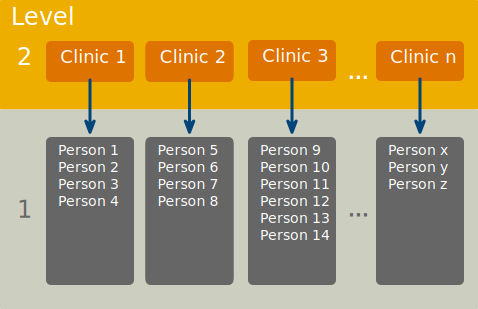

<html lang="en">

```{r setup, include=FALSE}
knitr::opts_chunk$set(
	echo = TRUE,
	message = FALSE,
	warning = TRUE
)

#necessary to render tutorial correctly
library(learnr) 
library(htmltools)
#easystats
library(datawizard)
library(insight)
library(modelbased)
library(parameters)
library(performance)
#tidyverse
library(dplyr)
library(ggplot2)
library(forcats)
library(purrr)
library(tidyr)
#non tidyverse/easystats
library(glmmTMB)
#students don't use
library(marginaleffects)


source("./www/discovr_helpers.R")


#Read data files needed for the tutorial

cosmetic_tib <- discovr::cosmetic |> 
  mutate(
    months = days*12/365
  )

cosmetic_evil_tib <- cosmetic_tib |> 
  mutate(
    clinic = fct_relevel(clinic, paste("Clinic", c(1, 13, 19, 10, 20, 11, 7, 5, 18, 12, 9, 2, 3, 6, 15, 17, 4, 8, 14, 16))),
    reason = fct_relevel(reason, "Physical reason", "Change appearance")
    )
```

# discovr multilevel models


```{r, child = "./docs/intro.Rmd"}

```

## Packages {data-progressive=FALSE}

```{r, child = "./docs/packages.Rmd"}

```


## Data

```{r, child = "./docs/data.Rmd"}

```


## Fitting models

```{r, child = "./docs/fit_models.Rmd"}

```

## `r user_astronaut()` A surgical example  [(C)]{.lbl}

In 2020 over 900,000 people had aesthetic plastic surgery procedures in the USA. There are two main reasons to have cosmetic surgery: (1) to help a physical problem (i.e., skin grafts after accidents); and (2) to change your external appearance when there is no underlying physical pathology. Related to this second reason, some have proposed cosmetic surgery as a psychological intervention to improve self-esteem (Cook et al., 2006; Kellett et al., 2008), an idea that I find abhorrent, but not abhorrent enough to stop me from creating an example around the effects of cosmetic surgery on quality of life. The data are in [cosmetic_tib]{.alt}, which has the following variables:

* `id`: the participant's code
* `post_qol`: This is the outcome variable and it measures quality of life after cosmetic surgery from 0 to 100%.
* `base_qol`: quality of life before cosmetic surgery.
* `days`: The number of days after surgery that post-surgery quality of life was measured.
* `clinic`: which of 21 clinics the person attended to have their surgery.
* `bdi`: This variable measures levels of depression using the Beck Depression Inventory (BDI).
* `reason`: This variable specifies whether the person had surgery purely to change their appearance or because of a physical reason.

We'll follow our usual 5-step process to fit a model to test the hypothesis:

> H~1~: Quality of life is increased by cosmetic surgery but this effect is moderated by the reason for the surgery.

To test this hypothesis we need to fit a model to predict quality of life after surgery (`post_qol`) from the number of `days` since surgery, quality of life before surgery (`base_qol`), the `reason` for surgery and the combined effect of the days since surgery and the reason. When ignoring the hierarchical structure of the data this model is described as


$$
\begin{aligned}
Y_i &= \beta_0 + \beta_1X_{1i} + \dots + \beta_nX_{ni} + \varepsilon_i\\
\text{QoL}_i &= \beta_0  + \beta_1\text{Days}_i + \beta_2\text{Pre QoL}_i + \beta_3\text{Reason}_i +  \beta_4\text{Days} \times \text{Reason}_i + \varepsilon_i
\end{aligned}
$$

However, the data has a hierarchical structure because people attended one of 20 clinics (Figure 4). We might, therefore, want to model the possibility of the overall quality of life varying across these clinics/contexts. This is a [random intercepts]{.alt} model and is represented as


$$
\begin{aligned}
\text{QoL}_{ij} &= [\beta_0  + \beta_1\text{Days}_{ij} + \beta_2\text{Pre QoL}_{ij} + \beta_3\text{Reason}_{ij} +  \beta_4\text{Days} \times \text{Reason}_{ij}] \\
&\qquad + [u_{0j} + \varepsilon_{ij}]
\end{aligned}
$$

Note that we have added a variable to the model ($u_{0j}$) that represents the deviation of each of the *j* clinic's intercept from the overall intercept ($\beta_0$). In other words, we will estimate the variability of overall quality of life across clinics. Also note that all predictors and the error term ($\varepsilon$) have the subscript $_{ij}$ to show that they vary by both participant (*i*) and clinic (*j*).

We might also expect the effect of the days since surgery to vary across clinics. We can model this variability by including a variable ($u_{1j}$) that represents the deviation of the effect of `days` in each of the *j* clinics from the overall effect of `days` ($\beta_1$). The final model will, therefore, be

$$
\begin{aligned}
\text{QoL}_{ij} &= [\beta_0  + \beta_1\text{Days}_{ij} + \beta_2\text{Pre QoL}_{ij} + \beta_3\text{Reason}_{ij} +  \beta_4\text{Days} \times \text{Reason}_{ij}] \\
&\qquad + [u_{0j} + u_{1j}\text{Days}_{ij} + \varepsilon_{ij}]
\end{aligned}
$$


<figure>

<figcaption>Figure 4: The structure of the data.</figcaption>
</figure>


## `r bmu()` Step 1: summarize [(A)]{.lbl}

<div class="stepbox">
  `r step()` **Step 1**

Get your data into `r rproj()` and pre-process using [tidyverse]{.pkg} packages or the [datawizard]{.pkg} package from [easystats]{.pkg}.
</div>

```{r remove_months}
cosmetic_tib <- discovr::cosmetic
```


#### `r alien()` Alien coding challenge

View the data in [cosmetic_tib]{.alt}.

```{r dat_view, exercise = TRUE, exercise.setup = "remove_months"}
     
```

```{r dat_view-solution}
cosmetic_tib   
```

### `r bmu()` Preparing categorical variables [(A)]{.lbl}

In these tutorials I tend to be kind to you and set up categorical predictors in the datasets in a way that categories are coded conveniently for the hypotheses being tested. Real life is often not as kind as I am. It's always a good idea to check explicitly that factor levels are ordered how you want them to be. This optional section gives you practice at doing this.

Let's imagine a world where I'm not nice and I've given you the cosmetic surgery data in `cosmetic_evil_tib`, which is the same as `cosmetic_tib` but more evil. It contains two categorical variables: `clinic` and `reason`. We can check the levels of these factors by placing each one in the `levels()` function.

#### `r alien()` Alien coding challenge

The code box shows the code the code to check the levels of the variable `clinic`, add similar code to check `reason` and run it.

```{r fct_levels, exercise = TRUE, exercise.lines = 3}
levels(cosmetic_evil_tib$clinic)
```

```{r fct_levels-solution}
levels(cosmetic_evil_tib$clinic)
levels(cosmetic_evil_tib$reason)
```

The evilness of this tibble should now be apparent because for `clinic` the order or clinics is all over the place. In a sense this doesn't matter because this variable doesn't end up being used as a predictor in the model so maybe you don't care that the order is "Clinic 1"  "Clinic 13"  "Clinic 19" ... "Clinic 16". However, if you're as anal retentive as I am then this order will annoy you when you plot the data because the clinics won't be displayed in numeric sequence! The evil doesn't end there. For `reason`, the first level is physical reason and the second level is change appearance. This order is the opposite of what we want because ideally we want the *b* for this effect to represent the difference in quality of life when surgery is to address a physical/medical problem compared to when it is for cosmetic reasons. It doesn't *matter* as such, we can switch our interpretation of the resulting *b*, but the point remains that you need to know the order of the factor levels to interpret the model parameters.

Have you ever known a tibble more evil than this one? At some point in your relationship with `r rproj()` you will face this situation.

<div class="tip">
  `r cat_space()` **Tip: factor levels**

Never assume that you know the order of factor levels. Always check the order of levels using `levels(name_of_factor)` (where [name_of_factor]{.alt} is the name of the factor variable) so that you know what the resulting model parameters (*b*s) represent.

</div>

Way back in `discovr_01`  we met the `fct_relevel()` function from the [forcats]{.pkg} package. Let's refresh our memories. The function takes this general form:

```{r, eval = F}
fct_relevel(name_of_factor, levels_to_move, after = 0)
```

So you place the name of the factor that you want to relevel, then list any levels you want to move and use [after =]{.alt} to say which level you want them placed after. By default [after = 0]{.alt}, which means that the specified level is made the first level (it is moved to the beginning).

#### `r robot()` Code example

For the `reason` factor, for example we could move the level labelled ["Physical reason"]{.alt} to be the last level using either of these chunks of code

```{r eval = F}
cosmetic_evil_tib <- cosmetic_evil_tib |>
  mutate(
    reason = fct_relevel(reason, "Change appearance")
  )

cosmetic_evil_tib <- cosmetic_evil_tib |>
  mutate(
    reason = fct_relevel(reason, "Physical reason", after = Inf)
  )
```

In both blocks of code we recreate `cosmetic_evil_tib` using `mutate` to copy over the existing variable `reason` with a version of itself that has the reordered factor levels. In the first pipe we achieve the reordering by using the default option, which is to set the specified level as the first level. The code, therefore, sets "Change appearance" as level 1. The second block of code uses [after = Inf]{.alt} ([Inf]{.alt} is short for infinite) to move "Physical reason" to the final level (whatever that may be). This second method is particularly useful when you want to move a level to the end but you don't know how many levels there are off the top of your head. Both blocks of code have the same effect: they set the levels to be ordered as physical reason and change appearance.

<div class="tip">
  `r cat_space()` **Tip**

When you specify levels of a factor the text must exactly match that of the variable level. In the example above if you type \"physical reason\" or \"Physicalreason\" the command will fail because neither exactly match the factor level of \"Physical reason\". Check that upper and lower case letters match with the factor level and the spaces are correct."

</div>

#### `r robot()` Code example

An alternative is to list the levels in the order you want them, we will need to use this method for the variable `clinic` because there are so many levels.

```{r eval = F}
cosmetic_evil_tib <- cosmetic_evil_tib |>
  mutate(
    clinic = fct_relevel(clinic, "Clinic 1", "Clinic 2", "Clinic 3", "Clinic 4", "Clinic 5", "Clinic 6", "Clinic 7", "Clinic 8", "Clinic 9", "Clinic 10", "Clinic 11", "Clinic 12", "Clinic 13", "Clinic 14", "Clinic 15", "Clinic 16", "Clinic 17", "Clinic 18", "Clinic 19", "Clinic 20")
  )
```

The code above is inefficient: it's time consuming to write out all 20 levels. We can make it more efficient by using the `paste()` function to create the levels (see the tip box). The resulting code is

```{r eval = F}
cosmetic_evil_tib <- cosmetic_evil_tib |>
  mutate(
    clinic = fct_relevel(clinic, paste("Clinic", 1:20))
  )
```

<div class="tip">
  `r cat_space()` **Tip: generating sequences of text and numbers**

The levels of `clinic` have a common pattern. They are the word "Clinic" (with an upper-case C), then a space, then a number. In `r rproj()` we can create a sequence of integers using the code `start:stop` in which `start` is the first integer and `stop` is the last. For example, `1:20` creates the sequence 1, 2, 3, 4, 5, 6, 7, ..., 19, 20. The `paste()` function pastes things together putting a space between them. So `paste("Clinic", 1)` creates the string "Clinic 1". If we ask `paste()` to combine a word with a sequence of numbers then it creates a sequence of the word pasted to each of the numbers in turn.

```{r, echo = T, class.source = '.panel_alt'}
paste("Clinic", 1:20)
```


We can use this code to create the 20 factor levels efficiently.

</div>

#### `r alien()` Alien coding challenge

Use the code box to do the following with [cosmetic_evil_tib]{.alt}, 

* Relevel `clinic` so that the clinics are in numeric sequence
* Relevel `reason` so that *Change appearance* is the first level
* View the levels of the two variables to check the relevelling has been a success!

```{r relevel_fcts, exercise = TRUE, exercise.lines = 10}

```

```{r relevel_fcts-solution}
#There are various ways (see text for details) but this is probably the most efficient

cosmetic_evil_tib <- cosmetic_evil_tib |> 
  mutate(
    clinic = fct_relevel(clinic, paste("Clinic", 1:20)),
    reason = fct_relevel(reason, "Change appearance")
  )


levels(cosmetic_evil_tib$clinic)
levels(cosmetic_evil_tib$reason)
```

That optional detour has shown you how to check the levels of any categorical predictors and make sure that categories are in the order you want them. From now on we'll return to using the tibble called [cosmetic_tib]{.alt} that has the categorical variables set up as we want them.

### `r user_visor()` Summary statistics [(B)]{.lbl}

We might want some summary statistics of quality of life scores split by `clinic`. We can create a table of descriptive statistics using by grouping the data by `clinic` and then passing it into the `describe_distribution()` function of the [datawizard]{.pkg} package. 

```{r, eval = F}
qol_sum <- cosmetic_tib |>
  group_by(clinic) |>
  datawizard::describe_distribution(select = c("base_qol", "post_qol"), ci = 0.95)

display(qol_sum)
```

In this code, we select the variables `base_qol` and `post_qol` and set the confidence interval to be 95%. In the code below we save the table as [qol_sum]{.alt} and then display it in a separate step (sometimes useful when creating reports or if you might want to re-use the table), but you could also display it at the point of creation by using a single pipe:

```{r, eval = F}
cosmetic_tib |>
  group_by(clinic) |>
  datawizard::describe_distribution(select = c("base_qol", "post_qol"), ci = 0.95) |> 
  display()
```

#### `r alien()` Alien coding challenge

Use the code above to create and store a table of summary statistics and then display it.


```{r desc, exercise = TRUE, exercise.lines = 7, exercise.setup = "remove_months"}
qol_sum <-            
```

```{r desc-solution}
# Create the table
qol_sum <- cosmetic_tib |>
  group_by(clinic) |>
  datawizard::describe_distribution(select = c("base_qol", "post_qol"), ci = 0.95)
# render the table nicely
display(qol_sum)
```

#### `r alien()` Alien coding challenge

Adapt the code above to view a table of summary statistics for the variable `days`. Use a single pipe and don't ask for confidence intervals.

```{r desc_days, exercise = TRUE, exercise.lines = 7, exercise.setup = "remove_months"}
             
```

```{r desc_days-solution}
# we're not bothering to store the object, so we'll use a single pipe
cosmetic_tib |>
  group_by(clinic) |>
  datawizard::describe_distribution(select = "days") |> 
  display()
```


### `r user_visor()` Rescaling predictors [(B)]{.lbl}

Within our model we have three predictors measured on very different scales (see the descriptive statistics we just produced):

- `days`: the days since surgery ranges from 0 to around 400
- `reason`: the reason for surgery ranges from 0 (change appearance) to 1 (physical reason)
- `base_qol`: baseline quality of life is measured on a scale ranging from 0 to 100.

The range of `days` is about ten times that of `base_qol` and about 400 times that of `reason` and this will mean that the associated variances will also be really different, which can create problems with model convergence.

It's better to pre-empt these potential issues, so let's make our predictor's variances better balanced. The variables at the two extremes are `days` and `reason`. We can't change the response scale for `reason` because it is categorical, but because `days` is a unit of time we can express it in different units. For example, if we express it in years it will decrease (because 400 days is about 1.1 year). Expressing time in years will balance `days` and `reason`, but `base_qol` will still be quite different. A good compromise might be to express time in months. Months vary in length and so are a silly unit to use, but we could use an approximation and label the variable as `months` for convenience.

There's no "correct" transformation, we could choose to use years instead, we could try to fit the model with days and see how it goes, or we could standardize predictors so they all use the same units. My personal driver is often interpretability. I don't have a good intuition for what standardized parameter estimates mean in the real world, so I prefer unstandardized ones. In this case, by converting to months or years our parameters tell us how much change in quality of life we might expect in a month or year, which seems like a reasonable timespan within which to expect some change from a treatment.

#### `r alien()` Alien coding challenge

Create a variable called `months` in [cosmetic_tib]{.alt} that expresses the days since surgery in months.

<div class="tip">
  `r cat_space()` **Hint**

The months of the year have different numbers of days, but a good enough approximation of the number of days per month is to divide the 365 days of a (non-leap) year by the 12 months of the year.

</div>


```{r months, exercise = TRUE, exercise.lines = 8, exercise.setup = "remove_months"}
        
```

```{r months-hint-1}
# replace the xxx
cosmetic_tib <- cosmetic_tib |> 
  mutate(
    xxx = xxx
  )
```

```{r months-hint-2}
# replace the first xxx with a variable name and the second with a fraction
cosmetic_tib <- cosmetic_tib |> 
  mutate(
    months = xxx*xxx
  )
```

```{r months-hint-3}
# replace the xx and xxx with numbers
cosmetic_tib <- cosmetic_tib |> 
  mutate(
    months = days*xx/xxx
  )
```

```{r months-solution}
cosmetic_tib <- cosmetic_tib |> 
  mutate(
    months = days*12/365
  )
cosmetic_tib
```

Note that the variable `months` has been added to the tibble.


## `r bmu()` Step 2: Visualize [(A)]{.lbl}

<div class="stepbox">
  `r step()` **Step 2**

Visualise the data using the [ggplot2]{.pkg} package from [tidyverse]{.pkg}.
</div>

#### `r robot()` Code example

Let's plot the data:

```{r echo = T, eval = F}
ggplot(cosmetic_tib, aes(x = months, y = post_qol)) +
  geom_point(position = position_jitter(width = 0.1, height = NULL), alpha = 0.5, size = 1, colour = "#999933") +
  geom_smooth(method = "lm", se = FALSE, linewidth = 0.75, colour = "#CC6677") +
  coord_cartesian(xlim = c(0, 13), ylim = c(0, 100)) +
  scale_y_continuous(breaks = seq(0, 100, 10)) +
  scale_x_continuous(breaks = 0:13) +
  labs(x = "Days post surgery", y = "Quality of life after surgery (%)", colour = "Clinic") +
  facet_wrap(~ clinic, ncol = 4) +
  theme_minimal()
```

Let's break this code down

* The first line is a standard `ggplot()` command within which we define the data as being in [cosmetic_tib]{.alt}. Then within `aes()` we plot `days` on the *x*-axis, `post_qol` on the *y*-axis.
* Next we use `geom_point()` to add the raw data as points (of size 1, transparency 0.5 and HEX colour `#999933`).
* The third line uses `geom_smooth()` to plot a line of the relationship between `days` and `post_qol`. We set the line width to 0.75 and again set a custom HEX colour.
* The next three lines use familiar functuions: `coord_cartesian()` determines the limits of the axes, `scale_y_continuous()` sets the tick intervals on the *y*-axis, and we specify the axis labels within `labs()`.
* Next we use `facet_wrap()` to create separate plots for each clinic and to arrange them in 4 columns.
* Finally, we apply a minimal theme with `theme_minimal()`

#### `r alien()` Alien coding challenge

Create a plot of surgery effect split by clinic using the code example.

```{r plot, exercise = TRUE, exercise.lines = 10, fig.height = 10, fig.width=8}
     
               
```

```{r plot-solution}
ggplot(cosmetic_tib, aes(x = months, y = post_qol)) +
  geom_point(position = position_jitter(width = 0.1, height = NULL), alpha = 0.5, size = 1, colour = "#999933") +
  geom_smooth(method = "lm", se = FALSE, linewidth = 0.75, colour = "#CC6677") +
  coord_cartesian(xlim = c(0, 13), ylim = c(0, 100)) +
  scale_y_continuous(breaks = seq(0, 100, 10)) +
  scale_x_continuous(breaks = 0:13) +
  labs(x = "Days post surgery", y = "Quality of life after surgery (%)", colour = "Clinic") +
  facet_wrap(~ clinic, ncol = 4) +
  theme_minimal()
```

The plot suggests variability in intercepts because overall levels of post-surgery quality of life are not the same across the 20 clinics. You can see this by looking at where the days since surgery is 0 and noting that at this point the lines for each clinic are at different heights. The plot also suggests variability in the relationship between time since surgery and quality of life; for example, quality of life increases over time in clinics such as 1, 5, 8, 11, decreases over time in clinics such as 2, 3, 6, and 10, and stays constant in clinic 17. Based on the plot is seems reasonable to model days since surgery using a random slope and intercept.

## `r user_visor()` Step 3: Fit the model [(B)]{.lbl}

Rather than jump straight to the model we want, it's useful to fit the model without the random effects to get a feel for the fit across contexts. The model we're fitting (which we saw earlier except I've replaced `days` with our rescaled variable `months`) is

$$
\begin{aligned}
\text{QoL}_i &= \left[\beta_0  + \beta_1\text{Months}_i + \beta_2\text{Pre QoL}_i + \beta_3\text{Reason}_i +  \beta_4\text{Months} \times \text{Reason}_i\right] + \left[\varepsilon_i\right]
\end{aligned}
$$


Bolker and colleagues (@bolker_generalized_2009) suggest fitting this model to the pooled data, and then within the individual levels of any contextual variables (in this case the clinics). In both cases we can use the `lm()` function, which we've used many times before, because there are no random effects.

###  `r user_visor()` Fit the pooled model  [(B)]{.lbl}

Let's do the pooled model first.

#### `r alien()` Alien coding challenge

Use the code box below to create an object called [pooled_lm]{.alt} that is the above model fitted to the entire data set (in [cosmetic_tib]{.alt}). Use `tidy()` to view the model parameters.

```{r pooled_lm, exercise = TRUE, exercise.lines = 6}
     
             
```


```{r pooled_lm-hint-1}
# create and store the pooled model (remember that x*y will include the effects of x, y and their interaction)
pooled_lm <- lm(xxx ~ xxx*xxx + xxx, data = xxx)
```

```{r pooled_lm-hint-2}
# create and store the pooled model
pooled_lm <- lm(post_qol ~ months*reason + base_qol, data = cosmetic_tib)
# view the model parameters
model_parameters(pooled_lm) |> 
  display()
```

```{r pooled_lm-solution}
pooled_lm <- lm(post_qol ~ months*reason + base_qol, data = cosmetic_tib)
model_parameters(pooled_lm) |> 
  display()
```

```{r, echo = F}
pooled_lm <- lm(post_qol ~ months*reason + base_qol, data = cosmetic_tib)
pooled_par <- model_parameters(pooled_lm)
```


As you'd expect with such a large sample size the variables `months`, `base_qol`, and the `months × reason` interaction are significant predictors of quality of life after surgery. We're interested in the parameter estimates to guide our expectations about what to expect in the more complicated model that includes the random effects. For example, the overall effect of `months` appears to be that for every extra month since surgery, quality of life increases by `r value_from_ez(pooled_par, row = 2)` units. This effect equates to about a unit change in quality of life over 3.7 months.   In the context of a 100-point scale, this is a tiny change.

###  `r user_astronaut()` Fit the model in individual clinics  [(C)]{.lbl}

Let's fit the same model to the individual clinics. Prepare for a world of pain.

To fit the fixed-effects model within each clinic separately we could filter the data to include only a single clinic, fit the model, and repeat for the other 20 clinics. There is a more elegant way to achieve this using the `map()` function from the [purrr]{.pkg} package, which enables you to apply a function to multiple items simultaneously. The idea is that we'll ask the `map()` function to fit the model using `lm()` to each of the clinics. Sounds easy enough, right? Think again.

We'll build up the code bit by bit. Ultimately, we're going to create an object called [clinic_lms]{.alt} that contains the linear models for the 20 clinics. We start by piping the data ([cosmetic_tib]{.alt}) into the `arrange()` function to order the data by the variable `clinic`. In doing so the rows of the data are sorted, in order, from clinic 1 to 20. This step isn't essential but if you are as anal-retentive as me it will stop you having palpitations when you look at the resulting table. Next, we use `group_by()` to group the output by the variable `clinic`. Finally (for now), we use `nest()` from the [tidyr]{.pkg} package to collapse the data within each clinic.

```{r, eval = F}
clinic_lms <- cosmetic_tib  |>
  arrange(clinic) |> 
  group_by(clinic)  |>  
  nest()
```

#### `r alien()` Alien coding challenge

Create [clinic_lms]{.alt} using the code above and inspect it.

```{r clinic_lms, exercise = TRUE, exercise.lines = 8}
     
             
```

```{r clinic_lms-solution}
clinic_lms <- cosmetic_tib  |>
  arrange(clinic) |> 
  group_by(clinic)  |>  
  tidyr::nest()
clinic_lms
```

Let's take stock of what you have created. You should see a tibble with 20 rows and two columns. The first column lists the clinics (in order because we ordered them) and the second column is labelled `data` and each row says `<tibble\>`. This is because the `nest()` function has nested the data within each clinic. If we were to inspect the cell in the first row of the column labelled `data` we would find that it contains the clinic 1 data in a tibble. So, we have a tibble within a tibble. You can see this by executing the code in the box below, which instructs `r rproj()` to show us the first item ([[[1]]]{.alt}) in the variable `data` within the object [clinic_lms]{.alt}. Change the number in the square bracket to view a different row, for example `clinic_lms$data[[9]]` will show the 9th item in the variable `data` within the object [clinic_lms]{.alt}, which you'll see is the data for clinic 9.

```{r clinic_nest-setup}
clinic_lms <- cosmetic_tib  |>
  arrange(clinic) |> 
  group_by(clinic)  |>  
  tidyr::nest()
```


```{r clinic_nest, exercise = TRUE, exercise.lines = 1, exercise.setup = "clinic_nest-setup"}
clinic_lms$data[[1]]  
```

To sum up, the `nest()` function has enabled us to store individual tibbles (data sets) in a tabulated format, which means that we can now use `mutate()` to create new columns based on the individual data sets stored in the column called `data`.

The next step is to create a new column called `model` that contains the results of fitting a linear model, using `lm()`, to the datasets within each clinic (which are stored in the column `data`). To do this we use the `map()` function from [purrr]{.pkg}, which has the following format

```{r, eval = F}
purrr::map(.x = my_data, .f = a_function_I_want_to_apply_to_the_data)
```

In our example, we want to fit the model

```{r, eval = F}
lm(post_qol ~ surgery*reason + base_qol, data = my_data)
```

to each dataset stored in the variable called `data`. To do this we embed the following code, which takes advantage of something called a lambda function, within `mutate()`

```{r, eval = F}
mutate(
    model = purrr::map(.x = data,
                       .f = \(clinic_tib) lm(post_qol ~ months*reason + base_qol, data = clinic_tib)))
```

If you don't know what a lambda function is then now would be a good time to read the information box.Let's break this code down

* `.x = data` tells `map()` to use the `data` variable from the main tibble.
* `.f = \(clinic_tib)` creates a function that will be applied to the variable we specified as `.x` (in this case, the function will be applied to the variable `data` because we used `.x = data`).  Notice that we've named the input of the function as [clinic_tib]{.alt} to remind us that we're feeding the tibble from each individual clinic into the function, but we could have named it something different. Next, we tell the function what to do with each clinic's data using `lm(post_qol ~ days*reason + base_qol, data = clinic_tib)`. Notice that within `lm()` we set the data argument to be the input of the function ([data = clinic_tib]{.alt}).

Think of it like this: `map()` sends each tibble within `data` to the anonymous function `\(clinic_tib)`, where it is given the name `clinic_tib` so that it can be set as the data to which `lm()` fits the model. Basically a model predicting post-surgery quality of life from `days`, `reason`, their interaction and baseline quality of life (`post_qol ~ surgery*reason + base_qol`) is fitted to the data from each clinic separately and stored in a new column called `model`.

<div class="infobox">
  `r info()` **Lambda functions**

In the book I discuss creating your own functions. In short, when we use a function like `mean()` we are accessing some code that someone else has written that computes a mean. We usually place something in the brackets, there are known as inputs or arguments. We can write our own functions like using this general format

```{r, eval = F}
name_of_function <- function(input, another_input){what_to_do_with_the_inputs}
```

For example, to create a function that adds two numbers we could execute

```{r, eval = F}
add_2_things <- function(first_number, second_number){first_number + second_number}
```

This code creates a new function called `add_2_things()`. The stuff in brackets tells the function to expect two inputs/arguments. I've called the first input [first_number]{.alt} and the second [second_number]{.alt}. The stuff in the curly braces then tells the function what to do with these inputs (in this case it adds the two inputs). The names I assigned to the inputs are arbitrary, these two versions of the code are equivalent to each other and to the code above

```{r, eval = F}
add_2_things <- function(x, y){x + y}
add_2_things <- function(alice, milton){alice + milton}
```

In each case we have changed the names of the inputs and carried those changes into the curly brackets. The function we have just created is called a [named function]{.alt} because we assigned it a name (`add_2_things()`) and because it has a name, we can use it within our session like any other function. For example, we can add the numbers 52 and 79 by executing

```{r, eval = F}
add_2_things(first_number = 52, second_number = 79)
```

or equivalently

```{r, eval = F}
add_2_things(52, 79)
```

In each case the function returns the result (in this case 131).  Sometimes, we need a function for a specific purpose and don't need to name it. In this case we create an [anonymous function]{.alt}, also known as a [lambda function]{.alt}. To create one of these we use this syntax

```{r, eval = F}
\(input) {what_to_do_with_the_input}
```

Note that because we're not assigning the function a name we use `\()` as shorthand for `function()`. It's also not necessary to use the curly braces if the contents of the function is a single line of code. The anonymous function below squares whatever number you put into it

```{r, eval = F}
\(x) {x^2}
```

Again, [x]{.alt} is an arbitrary label. This code is equivalent

```{r, eval = F}
\(number) {number^2}
```

but by labelling the input as `number` we make the code more readable because it we can see that the function expects a number as its input `\(number)` and squares whatever that number is as its output `{number^2}`.

</div>

We can also store the coefficient table of each model we've fitted in a new variable called `coeffs` by again using `map()` to apply the `model_parameters()` function to each of the models stored in the variable called `model` that we just created. We could add this the mutate function above

```{r, eval = F}
mutate(
    model = purrr::map(.x = data,
                       .f = \(clinic_tib) lm(post_qol ~ months*reason + base_qol, data = clinic_tib)),
    coefs = purrr::map(model, model_parameters)
    )
```

#### `r robot()` Code example

Yes, it's mind-bending. Now if we pipe the earlier code that arranged, grouped and nested the clinics into this mutate function, we get the full code needed to create the individual models and store them as [clinic_lms]{.alt}.

```{r, eval = F}
clinic_lms <- cosmetic_tib  |>
  arrange(clinic) |> 
  group_by(clinic)  |>  
  tidyr::nest()  |> 
  mutate(
    model = purrr::map(.x = data, .f = \(clinic_tib) lm(post_qol ~ months*reason + base_qol, data = clinic_tib)),
    coefs = purrr::map(model, model_parameters)
    )
```

#### `r alien()` Alien coding challenge

Create [clinic_lms]{.alt} using the code above and inspect it.

```{r clinic_lms2, exercise = TRUE, exercise.lines = 12}
     
             
```

```{r clinic_lms2-solution}
clinic_lms <- cosmetic_tib  |>
  arrange(clinic) |> 
  group_by(clinic)  |>  
  tidyr::nest()  |> 
  mutate(
    model = purrr::map(.x = data, .f = \(clinic_tib) lm(post_qol ~ days*reason + base_qol, data = clinic_tib)),
    coefs = purrr::map(model, model_parameters)
    )
clinic_lms
```

The object [clinic_lms]{.alt} is now a tibble with 20 rows and four columns. As we saw earlier, the first column lists the clinics and the second column, `data` contains the data for an individual clinic stored as a tibble. The third column, `model`, has cells labelled `<S3: lm>`, which tells us that each cell contains an object created with the `lm()` function. Basically, the cell in each row of this column contains the fitted model for the corresponding clinic. For example, if we were to access the contents of the cell in row 5 and apply `summary()` to it we'd see the model summary for clinic 5. The code in the box below does this, run this code then change the number in the square brackets to [2]{.alt} to see the second row of `model`, which is the model for clinic 2.

```{r clinic_lms_setup}
clinic_lms <- cosmetic_tib  |>
  arrange(clinic) |> 
  group_by(clinic)  |>  
  tidyr::nest()  |> 
  mutate(
    model = purrr::map(.x = data, .f = \(clinic_tib) lm(post_qol ~ months*reason + base_qol, data = clinic_tib)),
    coefs = purrr::map(model, model_parameters)
    )
```


```{r clinic_lm, exercise = TRUE, exercise.lines = 3, exercise.setup = "clinic_lms_setup"}
clinic_lms$model[[5]] |> 
  model_parameters()
```

The fourth column, `coefs`, has cells labelled `<tibble>`, which tells us that each cell contains a tibble. Specifically, for each row the cell in this column contains the tibble of model parameters generated by `model_parameters()` for the fitted model in the corresponding clinic. For example, if we were to access the contents of the cell in row 9 we'd see the table of model parameters for clinic 9. Try this by executing the code in the box below to see the coefficients for the model for clinic 5. Change the number in the square brackets to 2 to view the parameter estimates for the model fitted in clinic 2.

```{r clinic_coefs, exercise = TRUE, exercise.lines = 2, exercise.setup = "clinic_lms_setup"}
clinic_lms$coefs[[5]]
```

Having fit the model in each clinic we could view the model parameters by unnesting the data using 

```{r, eval = F}
models <- clinic_lms  |>
  select(-c(data, model)) |> 
  unnest(coefs)
models
```

This code creates and displays an object called [models_tib]{.alt}, that takes the [clinic_lms]{.alt} object that we just created, ignores the variables `data` and `model`, and then unnests the data by the variable **coefs**, which expands the tibbles of parameter estimates stored in **coefs** into rows. In other words, instead of each clinic occupying a single row in the tibble it will now occupy 5 rows (one for the intercept and one for each of the 4 predictors).

#### `r alien()` Alien coding challenge

Use the code above to view the 20 models we've just created.

```{r clinic_unnest, exercise = TRUE, exercise.lines = 6, exercise.setup = "clinic_lms_setup"}
 
             
```

```{r clinic_unnest-solution}
models <- clinic_lms  |>
  select(-c(data, model)) |> 
  unnest(coefs)

display(models)
```

The result is a 100 row table. Basically we have stacked the tables of model parameters for each clinic into a single table. In doing so we can compare the parameter estimates across clinics, and generally get a feel for what's going on in the data? Is there variability in intercepts? Is there variability in slopes? Is the effect of months and the months × reason interaction consistent across clinics?

#### `r alien()` Alien coding challenge

All of these questions are difficult to answer when scanning a 100-row table. Let's make life a bit easier by plotting the information instead. Use what you know about [ggplot2]{.pkg} to plot the parameter estimates in [models]{.alt} (in the variable `Coefficient`) using `geom_density()` and then `facet_wrap()` to create different plots for the different predictors in the model (in the variable `Parameter`).

```{r parameter_plot_setup, exercise.setup = "clinic_lms_setup"}
models <- clinic_lms  |>
  select(-c(data, model)) |> 
  unnest(coefs)
```


```{r parameter_plot, exercise = TRUE, exercise.lines = 6, exercise.setup = "parameter_plot_setup"}
 
             
```

```{r parameter_plot-hint-1}
# replace xxx with the variable to be plotted
ggplot(models, aes(x = xxxx))
# now add a geom
```


```{r parameter_plot-hint-2}
# now add a geom
ggplot(models, aes(x = Coefficient)) +
  geom_density()
# now add facet_wrap
```

```{r parameter_plot-hint-3}
# add facet_wrap
ggplot(models, aes(x = Coefficient)) +
  geom_density() +
  facet_wrap(~xxx , scales = "free")
# replace the xxxs and add a theme
```

```{r parameter_plot-solution}
ggplot(data = models, aes(Coefficient)) +
  geom_density() +
  facet_wrap(~Parameter , scales = "free") +
  theme_minimal()
```

You need to interpret these plots within the context of scale of measurement. For example, the intercept is centred around 30 and (theoretically) should be limited to values in the range of 0 to 100 (the range of the quality of life scale). In this context the fact that the bulk of our estimates range from 0 up to around 50 indicates a lot of variability in intercepts. It makes sense that this variable is a random effect. For months, the mode is around 1.5 and the bulk of the distribution falls between -2 and 3. This range seems small, but context is everything: the variable is measured on a scale of 0 to about 13, and so it's saying that an increase of 1 month could equate to a change in quality of life from between -2 and 3 on a 100 point scale. So anything between a slightly negative and slightly positive slope. Baseline quality of life (also measured on a 100 point scale) results in parameter estimates that range between about 0.4 and 0.6.  Baseline quality of life (also measured on a 100 point scale) results in parameter estimates that range between about 0.4 and 0.6. Because baseline quality of life and post-surgery quality of life have the same units of measurement, these parameters can be interpreted like a correlation coefficient. It hovers around 0.5 infrequently straying too far from this value. It would be reasonable not to estimate the variability in this parameter. 


###  `r user_astronaut()` Adding random effects to the model  [(C)]{.lbl}

Having got a feel for the data we can finally fit the model. We're going to use the `glmTMB()` function from the [glmTMB package]{.pkg} [@R-glmmTMB; @glmmTMB2017; @glmmTMB2025].^[All of the code will also work with the `lmer()` function from [lme4]{.pkg}]  The `glmTMB()` function takes the following form

```{r, eval = F}
my_model <- glmTMB:glmTMB(outcome ~ predictor(s) + (random effects), 
                          data = tibble,
                          family = gaussian()
                          na.action = an action,
                          REML = FALSE,
                          control = glmmTMBControl(),
                          subset = NULL)
```

Essentially it is similar to `lm()` in that we specify a formula that describes the model, and then there are some other arguments that we can use. By default maximum likelihood estimation is used but we can change to restricted maximum likelihood (REML) estimation by specifying [REML = TRUE]{.alt}, we can also fit the model to a subset of the data using the [subset]{.alt} argument. The [control]{.alt} argument allows us to change aspects of the fitting process. A common use of this is to specify a different optimizer if the model can't be fit. Perhaps most important is that we can specify a distribution family for the model. By default, this family is set to Gaussian, which is another name for the normal distribution. This default is fine for the models in this tutorial, but this argument allows us to fit a much wider range of models for different response distributions. For example, we can fit a multilevel version of logistic regression (`discovr_19`) by changing the argument to [family = binomial()]{.alt}.

The model we're fitting (which we saw a version of earlier) is

$$
\begin{aligned}
\text{QoL}_{ij} &= \left[\beta_0  + \beta_1\text{Months}_{ij} + \beta_2\text{Pre QoL}_{ij} + \beta_3\text{Reason}_{ij} +  \beta_4\text{Months} \times \text{Reason}_{ij}\right] \\
&\qquad + \left[u_{0j} + u_{1j}\text{Months}_{ij} + \varepsilon_{ij}\right]
\end{aligned}
$$

<div class="infobox">
  `r info()` **Specifying random effects**

Fixed effects in the model are specified using the same type of formula that we have used throughout these tutorials, where we specify the outcome, use a tilde to mean 'is predicted from' and then list the variables from which to predict it. For example, in previous sections where we fitted individual models to each clinic (i.e. we ignored random effects) we used

`post_qol ~ days*reason + base_qol`

which is equivalent to

`post_qol ~ days + reason + days:reason + base_qol`

To add random effects to the model we include an addition term (or terms) in brackets after the fixed effects that takes for the form

`(effect|variable_over_which_the_effect_varies)`

In which we replace [effect]{.alt} with 1 to specify the intercept and the name of the variable that varies across contexts for a random slope. We also replace [variable_over_which_the_effect_varies]{.alt} with the name of the variable across which effects vary (in this case `clinic`).

For example, to specify a random intercept across clinics we'd use

```{r, eval = F, class.source = '.panel_alt'}
(1|clinic)
```

And to specify a random intercept and random slope for the variable `months` across clinics we'd use

```{r, eval = F, class.source = '.panel_alt'}
(1 + months|clinic)
```

In fact, intercepts are implied so the following shorthand works too

```{r, eval = F, class.source = '.panel_alt'}
(months|clinic)
```

For more detail about the `glmmTMB()` syntax see the book chapter.

</div>

Ultimately, we want to include both a random intercept and a random slope for `days` across `clinics`, but we will build up the model sequentially.

#### `r robot()` Code example

Let's start by fitting an intercept-only model

```{r, eval = F}
intcpt_mlm <- glmmTMB::glmmTMB(post_qol ~ 1 + (1|clinic), data = cosmetic_tib)
```

Note that I have named this model [intcpt_mlm]{.alt}, that [post_qol ~ 1]{.alt} means 'predict post treatment quality of life from the intercept', and that [(1|clinic)]{.alt} means 'include a random intercept'. It's not possible to fit a model without random effects using `glmmTMB()` so our baseline model has to be a random intercept model. We don't need to specify [family]{.alt} because we are using the default of a normal/Gaussian response distribution.


#### `r robot()` Code example

Given that we're going to include a random effect of `months` it makes sense to include this as our first predictor. At this stage we'll enter it as a fixed effect:

```{r, eval = F}
months_mlm <- update(intcpt_mlm, .~. + months)
```

I have named this model in a way that tells me what has been added ([months_mlm]{.alt}). Within `update()`, I have specified that I wish to update the intercept-only model ([intcpt_mlm]{.alt}) and [.~. + months]{.alt} translates as 'keep the outcome and all predictors from [intcpt_mlm]{.alt} but add `months` as a predictor (see the Infobox).

<div class="infobox">
  `r info()` **Refresher of the `update()` function**

The `update()` function takes the general form:

```{r, eval = F, class.source = '.panel_alt'}
new_model <- update(old_model, update_instructions)
```

Where [new_model]{.alt} is the name assigned to the updated model, [old_model]{.alt} is the name of the model you're updating, and [update_instructions]{.alt} specify how to update the old model. The update instructions use a tilde (`~`) to represent the tilde in the original formula, a dot on the left to indicate 'the existing outcome', and a dot on the right to indicate 'the existing predictors'. From this we get the following possibilities:

-	`.~.` means keep the original outcome and any existing predictors.
-	`.~` means keep the original outcome but replace all existing predictors.
-	`~.` means replace the original outcome but keep all existing predictors.

We can add or subtract predictors using the `+` and `–` symbols.

</div>

#### `r robot()` Code example

Next, let's add the random slope for `months`. To this we want to replace the previous random effect. One way to do this is to completely re-specify the right-hand side of the formula:

```{r, eval = F}
monthsre_mlm <- update(months_mlm, .~  months + (months|clinic))
```

Again, I have named this model informatively by including [re]{.alt} as shorthand for 'random effect' ([monthsre_mlm]{.alt}). Within `update()`, I have specified that I wish to update the model that includes months ([months_mlm]{.alt}). Using `.~` (note no dot after the tilde) tells the function to retain the outcome variable but replace the entire right-hand side of the formula with [months + (months|clinic)]{.alt}. A quick reminder that (months|clinic) is shorthand for a random intercept within clinics and a random slope for `months` within clinics.

#### `r robot()` Code example

To add `reason` to the model use:

```{r, eval = F}
reason_mlm <- update(monthsre_mlm, .~.  + reason)
```

As before, we named the model informatively, updated the previous model ([monthsre_mlm]{.alt} by retaining everything (`.~.`) and adding `reason` to the formula. 

#### `r robot()` Code example

We can add baseline quality of life by updating the model we have just created:

```{r, eval = F}
qol_mlm <- update(reason_mlm, .~.  + base_qol)
```

#### `r robot()` Code example

Finally, we can add in the interaction between months and reason by, again, updating the previous model:

```{r, eval = F}
cosmetic_mlm <- update(qol_mlm, .~.  + months:reason)
```


#### `r alien()` Alien coding challenge

Use the code box below to create all of the models just described.

```{r build_mods_ex, exercise = TRUE, exercise.lines = 8}
          
```


```{r build_mods_ex-solution}
intcpt_mlm <- glmmTMB::glmmTMB(post_qol ~ 1 + (1|clinic), data = cosmetic_tib)
months_mlm <- update(intcpt_mlm, .~. + months)
monthsre_mlm <- update(months_mlm, .~  months + (months|clinic))
reason_mlm <- update(monthsre_mlm, .~.  + reason)
qol_mlm <- update(reason_mlm, .~.  + base_qol)
cosmetic_mlm <- update(qol_mlm, .~.  + months:reason)
```


<div class="bug">
  `r bug()` **De-bug**

This code creates the models but doesn't display them so it will appear as though nothing has happened, but it has.

</div>


We can use the `test_lrt()` function from [performance]{.pkg} to compare these models. This function works like the `test_wald()` function that we have used throughout the tutorials except it uses a likelihood ratio test rather than an *F*-statistic.

#### `r robot()` Code example

To compare models, we place them into the function in sequential order (from simplest to most complex):

```{r, eval = F}
test_lrt(intcpt_mlm, months_mlm, monthsre_mlm, reason_mlm, qol_mlm, cosmetic_mlm) |> 
  display()
```


#### `r alien()` Alien coding challenge

Use the code box below to compare the models we have just created.


```{r get_models}
intcpt_mlm <- glmmTMB::glmmTMB(post_qol ~ 1 + (1|clinic), data = cosmetic_tib)
months_mlm <- update(intcpt_mlm, .~. + months)
monthsre_mlm <- update(months_mlm, .~  months + (months|clinic))
reason_mlm <- update(monthsre_mlm, .~.  + reason)
qol_mlm <- update(reason_mlm, .~.  + base_qol)
cosmetic_mlm <- update(qol_mlm, .~.  + months:reason)
```


```{r compare_mods, exercise = TRUE, exercise.lines = 4, exercise.setup = "get_models"}
          
```


```{r compare_mods-solution}
test_lrt(intcpt_mlm, months_mlm, monthsre_mlm, reason_mlm, qol_mlm, cosmetic_mlm) |> 
  display()
```


```{r, echo = F}
intcpt_mlm <- glmmTMB::glmmTMB(post_qol ~ 1 + (1|clinic), data = cosmetic_tib)
months_mlm <- update(intcpt_mlm, .~. + months)
monthsre_mlm <- update(months_mlm, .~  months + (months|clinic))
reason_mlm <- update(monthsre_mlm, .~.  + reason)
qol_mlm <- update(reason_mlm, .~.  + base_qol)
cosmetic_mlm <- update(qol_mlm, .~.  + months:reason)

mlm_lrt <- test_lrt(intcpt_mlm, months_mlm, monthsre_mlm, reason_mlm, qol_mlm, cosmetic_mlm)
mlm_fit <- model_performance(cosmetic_mlm)
mlm_par <- model_parameters(cosmetic_mlm)
mlm_slopes <- estimate_slopes(cosmetic_mlm, trend = "months", by = "reason", ci = 0.95)
```

<div class="reportbox">
  `r pencil()` **Report**`r rproj()`

Adding months to the intercept only model significantly improved the fit, `r report_lrt(mlm_lrt, row = 2)`, adding the variability in slopes (and its covariance with intercepts) significantly improved the fit, `r report_lrt(mlm_lrt, row = 3)`, adding reason did not significantly improve the fit, `r report_lrt(mlm_lrt, row = 4)`, but adding baseline quality of life, `r report_lrt(mlm_lrt, row = 5)`, and the interaction of months and reason did, `r report_lrt(mlm_lrt, row = 6)`.

</div>

`r user_visor()` Step 4: Evaluate the model [(B)]{.lbl}

<div class="stepbox">
  `r step()` **Step 4**

Evaluate the model using a small number of functions from the [performance]{.pkg} package from [easystats]{.pkg}. Specially, we evaluate

- How well the model fits the data
- Whether the underlying assumptions of the model are met. If not, we refit the model using robust methods (see Figure 3).
 
</div>

As with previous models we can get fit statistics for our final model by placing it within `model_performance()`.

#### `r alien()` Alien coding challenge

Use the code box below to get fit statistics for the final model.

```{r mod_fit, exercise = TRUE, exercise.lines = 4, exercise.setup = "get_models"}
          
```


```{r mod_fit-solution}
model_performance(cosmetic_mlm) |> 
  display()
```


The intraclass correlation, ICC, is very large indicating that `r value_from_ez(mlm_fit, value = "ICC")` (or `r percent_from_ez(mlm_fit, value = "ICC")`) of the variance in post treatment quality of life is attributable to the clinic at which surgery was conducted. In short, the clinic had a massive effect on post-surgery quality of life. The conditional $R^2$ tells us the proportion of variance attributable to both the fixed and random effects (`r value_from_ez(mlm_fit, value = "R2_conditional")` or `r percent_from_ez(mlm_fit, value = "R2_conditional")`) whereas the marginal $R^2$ tells us the proportion of variance attributable to only the fixed effects `r value_from_ez(mlm_fit, value = "R2_marginal")` or `r percent_from_ez(mlm_fit, value = "R2_marginal")`). The ICC strongly indicates that including clinic as a contextual variable was worthwhile.


#### `r alien()` Alien coding challenge

As with any linear model, we can use the `check_model()` function to produce diagnostic plots. Use the code box to do this.

```{r mod_chk, exercise = TRUE, exercise.lines = 4, exercise.setup = "get_models", fig.height=10}
          
```


```{r mod_chk-solution}
check_model(cosmetic_mlm)
```

The top right and middle left plots can be used for testing homoscedasticity. Both plots imply homoscedasticity because the trend lines are flat. The top right plot also suggest that we can assume linearity. The bottom left Q-Q plot implies normality of residuals because they cluster closely to the horizontal line. For the same reason, the bottom right plot suggests relative normality of the random effects (an additional assumption for our model). The middle right plot shows indicates no problematic collinearity. All in all, the plots make it reasonable to assume the model assumptions.

## `r bmu()` Step 5: Interpret the model [(A)]{.lbl}

<div class="stepbox">
  `r step()` **Step 5**

Interpret the model

- Interpret the values that define the model (the [parameter estimates]{.alt}) using the [parameters]{.pkg} package from [easystats]{.pkg}.
- Make specific predictions from our model using the [modelbased]{.pkg} package from [easystats]{.pkg}.
 
</div>

#### `r alien()` Alien coding challenge

Use the code box below to obtain the table of parameters from [cosmetic_mlm]{.alt} using the same code you have used throughout these tutorials.

```{r mlm_coefs, exercise = TRUE, exercise.lines = 3, exercise.setup = "get_models"}
          
```


```{r mlm_coefs-solution}
model_parameters(cosmetic_mlm) |> 
  display()
```


We will come back to this table of parameter estimates in the Report Box, but the key finding is the significant interaction between the months since surgery and the reason for surgery. We can tease this interaction apart like we did when we looked at moderation effects by looking at simple slopes; that is, estimate the slope of `months` separately for physical and cosmetic reasons for surgery. We can do this using the `estimate_slopes()` and `estimate_means()` functions from the [modelbased]{.pkg} package.

#### `r robot()` Code example

To view the simple slopes in an object called [cosmetic_slopes]{.alt} execute:

```{r, eval = F}
cosmetic_slopes <- estimate_slopes(cosmetic_mlm,
                                   trend = "months",
                                   by = "reason",
                                   ci = 0.95)

# To render the results nicely use:
display(cosmetic_slopes)
```


#### `r alien()` Alien coding challenge

Use the code box below to obtain the simple slopes of `months` for each `reason`.

```{r mlm_slope, exercise = TRUE, exercise.lines = 8, exercise.setup = "get_models"}
          
```


```{r mlm_slope-solution}
cosmetic_slopes <- estimate_slopes(cosmetic_mlm,
                                   trend = "months",
                                   by = "reason",
                                   ci = 0.95)

# To render the results nicely use:
display(cosmetic_slopes)
```


For those who had surgery to change their appearance, their quality of life increased over time but not significantly so, `r report_ss(mlm_slopes, row = 1, symbol = "$\\hat{\\beta}$")`. For every additional month since surgery quality of life increased by `r value_from_ez(mlm_slopes, row = 1, value = "Slope")` units (on the 100-point scale). Over a year, this amounts to a change of `r report_value(12*value_from_ez(mlm_slopes, row = 1, value = "Slope", as_is = T))`. In contrast, for those who had surgery to help with a physical problem, their quality of life significantly increased over time, `r report_ss(mlm_slopes, row = 2, symbol = "$\\hat{\\beta}$")`. For every additional month since surgery quality of life increased by `r value_from_ez(mlm_slopes, row = 2, value = "Slope")` units (on the 100-point scale). Over a year, this amounts to a change of `r report_value(12*value_from_ez(mlm_slopes, row = 2, value = "Slope", as_is = T))` units. The change in quality of life over the same time period for people who had surgery for a physical reason is about double that of people who had it for a cosmetic reason. 

#### `r robot()` Code example

To plot the slopes we want to plot the estimated values (means) of quality of life at each value of months separately for the two reasons. We can do this by specifying [by = c("months", "reason")]{.alt} within `estimate_means()` and then piping the results to `plot()` and adding some [ggplot2]{.pkg} syntax to include informative axis labels:

```{r, eval = F}
estimate_means(model = cosmetic_mlm, by = c("months", "reason")) |> 
  plot() +
  labs(x = " Months since surgery", y = "Quality of life post-surgery (0-100)", colour = "Reason for surgery", fill = "Reason for surgery") +
  theme_minimal()
```

Note that we set both colour and fill to the same label to prevent separate legends being created. 

#### `r alien()` Alien coding challenge

Use the code box to obtain the interaction plot.

```{r int_plot, exercise = TRUE, exercise.lines = 10, exercise.setup = "get_models"}
          
```


```{r int_plot-solution}
estimate_means(model = cosmetic_mlm, by = c("months", "reason")) |> 
  plot() +
  labs(x = " Months since surgery", y = "Quality of life post-surgery (0-100)", colour = "Reason for surgery", fill = "Reason for surgery") +
  theme_minimal()
```


The resulting plot shows what we already know from the parameter estimates for the two groups; that is, regardless of the reason for surgery quality of life increases over time (both lines have positive slopes), but quality of life changes more rapidly over time for those who have surgery for a physical reason  (the slope of the line is steeper in the group that had surgery for a physical reason).


<div class="reportbox">
  `r pencil()` **Report**`r rproj()`

  There was non-zero variability in intercepts and slopes. The estimate of standard deviation of intercepts across clinics was   $\hat{\sigma}_{u_0}$ = `r value_from_ez(mlm_par, row = 6)`, the standard deviation of slopes across clinics was $\hat{\sigma}_{u_\text{months}}$ = `r value_from_ez(mlm_par, row = 7)`, and the residual standard deviation was $\sigma$ = `r value_from_ez(mlm_par, row = 9)`. The estimated correlation between slopes and intercepts was $r_{u_0, u_\text{months}}$ = `r value_from_ez(mlm_par, row = 8)` suggesting that clinics with large intercepts tended to have smaller slopes.
  
  The overall effect of time on quality of life was small and non-significant,`r report_pe(mlm_par, row = 2, symbol = "$\\hat{\\beta}$")`.  The effect of the reason for surgery was also small and non-significant, `r report_pe(mlm_par, row = 3, symbol = "$\\hat{\\beta}$")`. To put this effect in context, with other variables held constant the difference in quality of life in those seeking treatment for cosmetic reasons rather than physical treasons was `r format_value(abs(value_from_ez(mlm_par, row = 3, as_is = T)))` lower (on the 100-point scale). The effect of baseline quality of life on post-surgery quality of life was more substantial and significant, `r report_pe(mlm_par, row = 4, symbol = "$\\hat{\\beta}$")`. This effect suggests that with other variables held constant, for every unit increase in baseline quality of life there is a half unit increase in post-surgery quality of life, which is a fairly strong relationship (because both are measured on the same scale). The combined effect of months and reason (their interaction) on post-surgery quality of life was significant,  `r report_pe(mlm_par, row = 5, symbol = "$\\hat{\\beta}$")`. The parameter estimate suggests that the gradient (the change over time) of quality of life is `r value_from_ez(mlm_par, row = 5)` bigger in those having surgery for physical reasons than in those having it for cosmetic reasons. We'll return to this effect in due course.
  
  Simple slopes analysis revealed that for those who had surgery to change their appearance, quality of life increased over time but not significantly so, `r  report_ss(mlm_slopes, row = 1, symbol = "$\\hat{\\beta}$")`. In contrast, for those who had surgery to help with a physical problem, their quality of life significantly increased over time, `r  report_ss(mlm_slopes, row = 2, symbol = "$\\hat{\\beta}$")`. The change in quality of life for people who had surgery for a physical reason is about double that of people who had it for a cosmetic reason (over the same time period).
  
</div>

### `r user_astronaut()` Robust models [(C)]{.lbl} 

You can fit a robust model using the `rlmer()` function from the [robustlmm]{.pkg} package [@R-robustlmm], which essentially takes the same syntax as [glmmTMB]{.pkg}, so we could a robust version of our previous model using

```{r, eval = F}
cosmetic_rob <- robustlmm::rlmer(post_qol ~ months*reason + base_qol + (months|clinic), data = cosmetic_tib
```

There are other arguments that can be used to tweak the settings but the defaults will give robust estimates. These robust models can take a lot of time to converge (if they converge at all) so this section is more for information - we will not attempt to fit this model.


<br />

<div class="infobox">
  
  
  **A message from Mae Jemstone:**
  
Hierarchies suck. I remember at cadet school being bummed out by all those teachers who thought they knew it all. They knew the theory, but I grew up in the streets of alpha lacertae and I'd learnt about space battles the hard way. Where I come from you don't survive to get to cadet school without knowing a thing or two about hand-to-tentacle combat and senjutsu. Connection is so much more important than status. Anyway, you need not get bogged down with hierarchies now that you know about multilevel models. The power is yours. Use it wisely.
  
</div>

## Resources/References {data-progressive=FALSE}

```{r, child = "./docs/resources.Rmd"}

```


### References
