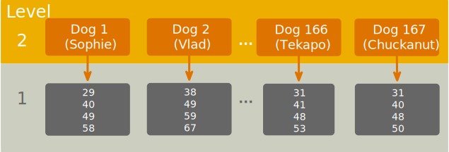
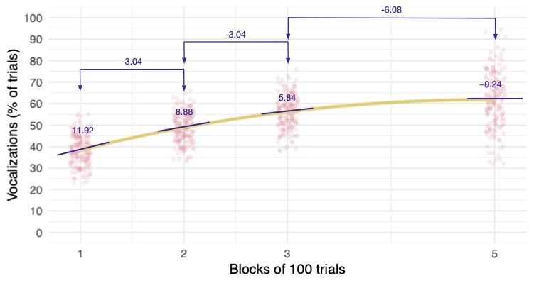
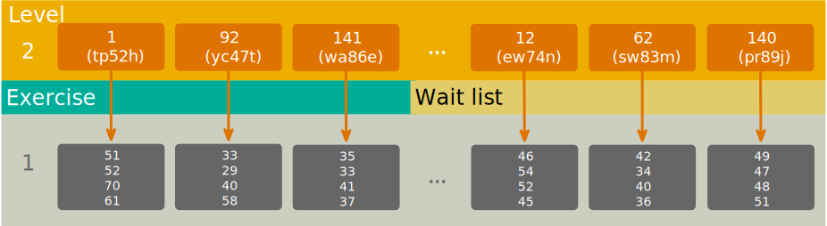

<html lang="en">

```{r setup, include=FALSE}
knitr::opts_chunk$set(
	echo = TRUE,
	message = FALSE,
	warning = FALSE
)

#necessary to render tutorial correctly
library(learnr) 
library(htmltools)
#easystats
library(datawizard)
library(insight)
library(modelbased)
library(parameters)
library(performance)
#tidyverse
library(dplyr)
library(ggplot2)
library(tibble)
#non tidyverse/easystats
library(glmmTMB)
#students don't use
library(marginaleffects)

source("./www/discovr_helpers.R")


#Read data files needed for the tutorial

train_tib <- discovr::dog_training
exercise_tib <- discovr::exercise
```

# discovr growth models

```{r, child = "./docs/intro.Rmd"}

```

## Packages {data-progressive=FALSE}

```{r, child = "./docs/packages.Rmd"}

```


## Data

```{r, child = "./docs/data.Rmd"}

```


## Fitting models

```{r, child = "./docs/fit_models.Rmd"}

```


## `r bmu()` Emergency! The aliens are coming!

The main examples in this tutorial are from [@fielddsr22026]. In `discovr_15` we looked at examples relating to using spaniels to stop an alien invasion. In another study, the top-secret government agency for Training Extra-terrestrial Reptile Detection (TERD) conducted research to test the plausibility of training sniffer dogs to detect aliens. During training, TERD rewarded spaniels for making vocalizations while sniffing alien space lizards (which they happened to have a few of at the local university Department of Statistics). The first piece of research they conduct is to see whether this kind of positive reinforcement increases the number of vocalizations. The nature of any kind of training is that we expect change over time; therefore, it makes sense to track the same dogs over time to see whether their behaviour changes as the training progresses. They took a sample of 167 dogs and gave them 500 'trials' in which they sniff an alien. If they make any kind of sound, they are intermittently given a food reward. If this training works, and the dogs are learning to make noise when they smell an alien, we'd expect the dogs to vocalise during more encounters with aliens as training progresses. The training is broken down into blocks of 100 trials, and a record is taken of whether the spaniel vocalises when sniffing the alien. Over 100 trials, we therefore know how many times they vocalised at an alien out of 100 (i.e. the percentage of encounters during which they made noise). TERD reinforced many interactions during the first block but over subsequent blocks we'd reduce the reinforcement. They took measures over the first 3 blocks of 100 trials, the data for the fourth block got eaten by a particularly angry alien, but we do have data for the 5th and final block. So for each dog, we know their percentage of vocalisations after blocks 1, 2, 3 and 5.

They are testing the following hypothesis:

> H~1~: Vocalizations will increase as a function of time (i.e. the number of trials)

To test this hypothesis we need to fit a [growth model]{.kt}, a model that describes change over time. This situation is an example of a data hierarchy in which observations (level 1) are nested within entities (level 2). Figure 4 shows the data structure for our situation, for a random sample of 4 of the 167 dogs. The first randomly selected dog was called Sophie, she vocalised during 29 of the first block of 100 alien interactions, during 40 of the next block of 100 interactions, during 49 of the next block and during 58 of the last block. Similarly, the next dog, Vlad, vocalised during 38, 49, 59 and 67 of the interactions in block 1, 2, 3, and 5 respectively. You get the idea.

<figure>

<figcaption>Figure 4: The data structure of the training dataset.</figcaption>
</figure>

The model we need to fit is a multilevel model, but growth models typically adopt different symbols than we used in `discovr_14` with gamma being used for fixed effect parameters and zeta for so random effect parameters. The subscripts used are [i]{.alt} for the [i]{.alt}ndividual (which make sense) and [j]{.alt} refers to the measurement occasion within that individual. Using these symbols, we'd get

$$
\begin{aligned}
\text{vocalizations}_{ij} =& \left[\gamma_{0} + \gamma_{1}\text{block}_{ij} \right] + \left[\zeta_{0i} +\zeta_{1i}\text{block}_{ij} + \varepsilon_{ij}\right]
\end{aligned}
$$

The model contains:

- $\gamma_{0}$ = the average vocalizations when block = 0
- $\gamma_{1}$ = the average rate of change of vocalizations (i.e. the amount that vocalizations change as the blocks of trials increase)
- $\zeta_{0i}$ = the deviation of a given dog's vocalisations from the group average when block = 0 (think of the *i* subscript as representing 'a particular dog') 
- $\zeta_{1i}$ = the deviation of a given dog's rate of change of vocalisations from the average rate of change (again, think of the *i* subscript as representing 'a particular dog')
- $\varepsilon_{ij}$ = the portion of a given dog's vocalisations that is unpredicted during trial block *j*.

The data are in the tibble [train_tib]{.alt} which has 668 rows (167 dogs measured at each of 4 time points) and 3 variables:

- `id`: name of the fictional dog. (Fun fact, the names are real pet names randomly selected from the [pet registry in Seattle]( https://randommer.io/pet-names)
- `block`: the block of trials (each block represents 100 trials, so block 1 is the result of the first 100 trials and 5 is the result of trials 400-500)
- `vocalizations`: the percentage of trials during which the dog vocalised.


## `r bmu()` Step 1: summarize [(A)]{.lbl}

<div class="stepbox">
  `r step()` **Step 1**

Get your data into `r rproj()` and pre-process using [tidyverse]{.pkg} packages or the [datawizard]{.pkg} package from [easystats]{.pkg}.
</div>


#### `r alien()` Alien coding challenge

View the data in [train_tib]{.alt}.

```{r train_tib_view, exercise = TRUE}
     
```

```{r train_tib_view-solution}
train_tib   
```


#### `r alien()` Alien coding challenge

Use the code box to view a table of summary statistics for `vocalizations`.


```{r train_desc, exercise = TRUE, exercise.lines = 7}
           
```

```{r train_desc-solution}
train_tib |> 
  group_by(block) |> 
  describe_distribution(select = "vocalizations") |> 
  data_remove("Variable") |> # optionally removes a redundant columns
  display()
```

It looks as though training does increase the number of interactions during which dogs vocalise with them vocalising in about 38 of the first 100 interactions, but this increases to around 62 of the last 100 interactions.

## `r bmu()` Step 2: Visualize [(A)]{.lbl}

<div class="stepbox">
  `r step()` **Step 2**

Visualise the data using the [ggplot2]{.pkg} package from [tidyverse]{.pkg}.
</div>

#### `r robot()` Code example

Let's plot the data:

```{r echo = T, eval = F}
ggplot(train_tib, aes(x = block, y = vocalizations)) +
  geom_point(size = 1, alpha = 0.6, position = position_jitter(width = 0.1, height = 0.1), colour = "#CC6677") +
  geom_smooth(method = "lm", formula = y ~ x, alpha = 0.3, colour  = "#88CCEE", fill  = "#88CCEE") +
   geom_smooth(method = "lm", formula = y ~ poly(x, 2), alpha = 0.3, colour  = "#DDCC77", fill = "#DDCC77") +
  coord_cartesian(ylim = c(0, 100)) + 
  scale_y_continuous(breaks = seq(0, 100, 10)) +
  scale_x_continuous(breaks = c(1, 2, 3, 5)) +
  labs(x = "Blocks of 100 trials", y = "Vocalizations (% of trials)") +
  theme_minimal() 
```

This code has likely given you palpitations, but a lot of it is familiar stuff. A few things to note though:

- [position = position_jitter(width = 0.1, height = 0.1)]{.alt} within `geom_point()` applies a small random adjustment to each data point so that for a given block they're not stacked in a vertical line obscuring each other.
- I've used `geom_smooth()` twice. The first instance plots the linear change in vocalizations over blocks of trials, the second plots the curvilinear change. To get the curvilinear change, we use the `poly()` function.
- [scale_x_continuous(breaks = c(1, 2, 3, 5))]{.alt} sets labels on the *x*-axis only for the observed values of the variable blocks.

#### `r alien()` Alien coding challenge

Create a plot of vocalizations (*y*-axis) over blocks (*x*-axis).

```{r train_plot, exercise = TRUE, exercise.lines = 10}
     
               
```

```{r train_plot-solution}
ggplot(train_tib, aes(x = block, y = vocalizations)) +
  geom_point(size = 1, alpha = 0.6, position = position_jitter(width = 0.1, height = 0.1), colour = "#CC6677") +
  geom_smooth(method = "lm", formula = y ~ x, alpha = 0.3, colour  = "#88CCEE", fill  = "#88CCEE") +
   geom_smooth(method = "lm", formula = y ~ poly(x, 2), alpha = 0.3, colour  = "#DDCC77", fill = "#DDCC77") +
  coord_cartesian(ylim = c(0, 100)) + 
  scale_y_continuous(breaks = seq(0, 100, 10)) +
  scale_x_continuous(breaks = c(1, 2, 3, 5)) +
  labs(x = "Blocks of 100 trials", y = "Vocalizations (% of trials)") +
  theme_minimal() 
```

The plot confirms that vocalisations generally increase over blocks of trials. However, the plot also suggests that this pattern might be curvilinear; that is, vocalisations increase rapidly in the early stages of training but the effect of training plateaus between blocks 3 and 5.

## `r user_astronaut()` Step 3: Fit the model [(C)]{.lbl}

We're going to use the `glmTMB()` function from the [glmTMB package]{.pkg} [@R-glmmTMB; @glmmTMB2017; @glmmTMB2025]. (All of the code will also work with the `lmer()` function from [lme4]{.pkg}.) We used this function in `discovr_14`, it takes the following form

```{r, eval = F}
my_model <- glmTMB:glmTMB(outcome ~ predictor(s) + (random effects), 
                          data = tibble,
                          family = gaussian()
                          na.action = an action,
                          REML = FALSE,
                          control = glmmTMBControl(),
                          subset = NULL)
```


We will build up the model sequentially.

#### `r robot()` Code example

Let's start by fitting an intercept-only model

```{r, eval = F}
incpt_mlm <-glmmTMB(vocalizations ~ 1 + (1|id), data = train_tib)
```

Note that I have named this model [intcpt_mlm]{.alt}, that [vocalizations ~ 1]{.alt} means predict vocalizations from the intercept, and that [(1|id)]{.alt} means 'include a random intercept.


#### `r robot()` Code example

Next, let's add `block` as a predictor. This variable is numeric (1, 2, 3, 5) and can be entered as a continuous predictor in which each number represents a point in training (you can also think of it as a point in time). These values are not evenly spaced, but that's OK because it means that the model will reflect the fact that vocalizations were not recorded during block 4. 

```{r, eval = F}
block_mlm <- glmmTMB(vocalizations ~ block + (1|id), data = train_tib)
```

I have named this model in a way that tells me what has been added ([block_mlm]{.alt}).

#### `r robot()` Code example

Next, let's add the random slope for `block`:

```{r, eval = F}
blockrs_mlm <- glmmTMB(vocalizations ~ block + (block|id), data = train_tib)
```

Again, I have named this model informatively by including [re]{.alt} as shorthand for 'random effect' ([blockrs_mlm]{.alt}). A quick reminder that [(block|id)]{.alt} is shorthand for a random intercept and a random slope for `block` within each dog (`id`).


#### `r alien()` Alien coding challenge

Use the code box below to create these models.

```{r train_mods_ex, exercise = TRUE, exercise.lines = 8}
          
```


```{r train_mods_ex-solution}
incpt_mlm <-glmmTMB(vocalizations ~ 1 + (1|id), data = train_tib)
block_mlm <- glmmTMB(vocalizations ~ block + (1|id), data = train_tib)
blockrs_mlm <- glmmTMB(vocalizations ~ block + (block|id), data = train_tib)
```

<div class="bug">
  `r bug()` **De-bug**

This code creates the models but doesn't display them so it will appear as though nothing has happened, but it has.

</div>


We can use the `test_lrt()` function from [performance]{.pkg} to compare these models. This function works like the `test_wald()` function that we have used throughout the tutorials except it uses a likelihood ratio test rather than an *F*-statistic.

#### `r robot()` Code example

To compare models, we place them into the function in sequential order (from simplest to most complex):

```{r, eval = F}
test_lrt(incpt_mlm, block_mlm, blockrs_mlm) |> display()
```


#### `r alien()` Alien coding challenge

Use the code box below to compare the models we have just created.


```{r get_train_models, echo = F}
incpt_mlm <-glmmTMB(vocalizations ~ 1 + (1|id), data = train_tib)
block_mlm <- glmmTMB(vocalizations ~ block + (1|id), data = train_tib)
blockrs_mlm <- glmmTMB(vocalizations ~ block + (block|id), data = train_tib)
```


```{r compare_mods, exercise = TRUE, exercise.lines = 4, exercise.setup = "get_train_models"}
          
```


```{r compare_mods-solution}
test_lrt(incpt_mlm, block_mlm, blockrs_mlm) |> 
  display()
```


```{r, echo = F}
incpt_mlm <-glmmTMB(vocalizations ~ 1 + (1|id), data = train_tib)
block_mlm <- glmmTMB(vocalizations ~ block + (1|id), data = train_tib)
blockrs_mlm <- glmmTMB(vocalizations ~ block + (block|id), data = train_tib)
quad_mlm <- glmmTMB(vocalizations ~ block + I(block^2) + (block|id), data = train_tib)

train_lrt <- test_lrt(incpt_mlm, block_mlm, blockrs_mlm)
train_fit <- model_performance(blockrs_mlm)
train_par <- model_parameters(blockrs_mlm)

quad_lrt <- test_lrt(blockrs_mlm, quad_mlm)
quad_fit <- model_performance(quad_mlm)
quad_par <- model_parameters(quad_mlm)

poly_mlm <- glmmTMB(vocalizations ~ poly(block, 2) + (1|id), data = train_tib)
polyrs_mlm <- glmmTMB(vocalizations ~ poly(block, 2) + (poly(block, 1)|id), data = train_tib)
polyrs2_mlm <- glmmTMB(vocalizations ~ poly(block, 2) + (poly(block, 2)|id), data = train_tib)

poly_lrt <- test_lrt(incpt_mlm, poly_mlm, polyrs_mlm, polyrs2_mlm)
poly_fit <- model_performance(polyrs2_mlm)
poly_par <- model_parameters(polyrs2_mlm)
```

<div class="reportbox">
  `r pencil()` **Report**`r rproj()`
  
Adding block as a predictor significantly improved the fit of the model, `r report_lrt(train_lrt, row = 2)`, as did adding the random slope of block (and the covariance between slopes and intercepts), `r report_lrt(train_lrt, row = 3)`.

</div>

## `r bmu()` Step 4: Evaluate the model [(A)]{.lbl}

As with previous models we can get fit statistics for our final model by placing it within `model_performance()`.

#### `r alien()` Alien coding challenge

Use the code box below to get fit statistics for the final model ([blockrs_mlm]{.alt}).

```{r train_fit, exercise = TRUE, exercise.lines = 4, exercise.setup = "get_train_models"}
          
```


```{r train_fit-solution}
model_performance(blockrs_mlm) |> 
  display()
```


<div class="reportbox">
  `r pencil()` **Report**`r rproj()`

The intraclass correlation, ICC, was very large indicating that `r value_from_ez(train_fit, value = "ICC")` (`r percent_from_ez(train_fit, value = "ICC")`) of the variance in vocalizations is attributable to the dog being trained. In short, vocalisations depend a lot on the dog being trained. The proportion of variance attributable to both the fixed and random effects was `r value_from_ez(train_fit, value = "R2_conditional")` (`r percent_from_ez(train_fit, value = "R2_conditional")`) whereas the proportion of variance attributable to only the fixed effects was `r value_from_ez(train_fit, value = "R2_marginal")` (`r percent_from_ez(train_fit, value = "R2_marginal")`).

</div>


#### `r alien()` Alien coding challenge

As with any linear model, we can use the `check_model()` function to produce diagnostic plots. Use the code box to do this for the final model ([blockrs_mlm]{.alt}).

```{r train_chk, exercise = TRUE, exercise.lines = 4, exercise.setup = "get_train_models", fig.height=10}
          
```


```{r train_chk-solution}
check_model(blockrs_mlm)
```

The plots strongly suggest a non-linear trend .... much like the plot of the data suggested. The linear model isn't appropriate.

## `r user_astronaut()` Step 3: Fit a non-linear model [(C)]{.lbl}

We need to cycle back to step 3 and fit a non-linear model. To get a non-linear model we take our previous model but add a term to represent non-linear change:

$$
\begin{aligned}
\text{vocalizations}_{ij} =& \left[\gamma_{0} + \gamma_{1}\text{block}_{ij} + \gamma_{2}\text{block}^2_{ij} \right] + \left[\zeta_{0i} +\zeta_{1i}\text{block}_{ij} + \varepsilon_{ij}\right]
\end{aligned}
$$

The predictor [block]{.alt} is the linear term whereas [block^2^]{.alt} is referred to as the quadratic term. Note that [block]{.alt} and [block^2^]{.alt} will be very highly correlated because [block^2^]{.alt} is the values of [block]{.alt} multiplied by themselves. Collinearity in linear models makes it difficult to know the unique contribution of each predictor, so there are two ways we can fit the model:

1. Fit it as is. The advantage here is the parameter estimates represent the change in the rate of change over time. That is, does the change in the outcome over time speed up (positive value) or slow down (negative value). The disadvantage is that we can't separate the linear and quadratic trends. 
2. Transform [block] and [block^2^]{.alt} so that they are independent, that is, remove the correlation between the predictors before fitting the model. We can do this using the `poly()` function. The advantage here is that you can interpret the linear and quadratic trends separately. The disadvantage is that parameter estimates are not easily interpretable to the average human.

<div class="warning">
  `r warning()` **Advisory**

For pedagogic reasons we'll look at how to fit the non-linear model in both ways, but in real life you would choose the **ONE** method that best meets your needs.

</div>


#### `r robot()` Code example

To add the quadratic term, we use the same code as we did for [blockrs_mlm]{.alt}, but with the addition of [block^2^]{.alt} as a predictor:

```{r, eval = F}
quad_mlm <- glmmTMB(vocalizations ~ block + I(block^2) + (block|id), data = train_tib)
```

Notice that to get the quadratic effect of block we include `I(block^2)` as a predictor. `r rproj()` can create new predictors based on existing variables on the fly and [block^2]{.alt} is like writing [block^2^]{.alt} (`^` means 'to the power of'); however, to ensure that `r rproj()` treats it as an arithmetic operation rather than as part of the model itself we must enclose [block^2]{.alt} within the `I()` function.

We can compare this model to the one without the quadratic term, get fit statistics and check diagnostics using the usual functions:

```{r, eval = F}
test_lrt(blockrs_mlm, quad_mlm) |>  display()
model_performance(quad_mlm) |>  display()
check_model(quad_mlm)
```

#### `r alien()` Alien coding challenge

Use the code box below to fit the quadratic model, compare it to the linear model, get fit statistics and check assumptions.

```{r quad_mod_ex, exercise = TRUE, exercise.lines = 8, exercise.setup = "get_train_models", fig.height=10, fig.width=8}
          
```


```{r quad_mod_ex-solution}
# fit the quadratic model
quad_mlm <- glmmTMB(vocalizations ~ block + I(block^2) + (block|id), data = train_tib)
# compare to the linear model
test_lrt(blockrs_mlm, quad_mlm) |>  display()
# get fit statistics
model_performance(quad_mlm) |>  display()
# check assumptions
check_model(quad_mlm)
```


The main points from the output are:

- The quadratic trend improves the fit of the model, `r report_lrt(quad_lrt, row = 2)`.
- The ICC has increased from `r value_from_ez(train_fit, value = "ICC")` (`r percent_from_ez(train_fit, value = "ICC")`) to `r value_from_ez(quad_fit, value = "ICC")` (`r percent_from_ez(quad_fit, value = "ICC")`). Nearly all of the variance in vocalizations is attributable to the dog being trained.
- The plots for linearity and homogeneity of variance have flatter green lines than before suggesting that including the quadratic trend is a better match of the observed data than using only the linear trend.

#### `r robot()` Code example

The model we have just fitted does not allow us to separate the linear from the quadratic trend because they are almost perfectly correlated. If we want to quantify the unique predictive contribution of the two trends then we must use transformed versions of the linear and quadratic components that are independent. The `poly()` function (short for polynomial) does this for us. It takes the general form:

```{r eval = FALSE}
poly(variable, order)
```

in which [order]{.alt} is the highest order of trend/polynomial that you require and [variable]{.alt} is the name of the variable that we want to express as polynomials. A linear trend is a first-order polynomial so we'd use `poly(block, 1)`, a quadratic trend a second-order polynomial so we'd use `poly(block, 2)`, a cubic trend a third-order polynomial so we'd use `poly(block, 3)` and so on. Realistically, anything above a second- or third-order polynomial will difficult to interpret. 

Let's build up our models but using `poly()`. The model ([incpt_mlm]{.alt}) that includes only a random intercept is the same as before so we don'\t need to re-specify that. To add the linear and quadratic trends we include [poly(block, 2)]{.alt}:

```{r eval = FALSE}
poly_mlm <- glmmTMB(vocalizations ~ poly(block, 2) + (1|id), data = train_tib)
```

Given the trends are now independent, we can try to model variability in their effect by including a random slope for each. To include a random slope for the linear trend we'd use (note the use of [poly(block, 1)]{.alt} in the random effect):

```{r eval = FALSE}
polyrs_mlm <- glmmTMB(vocalizations ~ poly(block, 2) + (poly(block, 1)|id), data = train_tib)
```

To add a random slope for the quadratic trend we'd use (note the use of [poly(block, 2)]{.alt} in the random effect):

```{r eval = FALSE}
polyrs2_mlm <- glmmTMB(vocalizations ~ poly(block, 2) + (poly(block, 2)|id), data = train_tib)
```

We can compare these models and get fit and assumption checks for the final model by adapting the code we used before.

```{r eval = FALSE}
test_lrt(incpt_mlm, poly_mlm, polyrs_mlm, polyrs2_mlm) |> display()
model_performance(polyrs2_mlm) |> display()
check_model(polyrs2_mlm)
```

#### `r alien()` Alien coding challenge

Use the code box below to fit the polynomial models, compare them and get fit statistics and check assumptions for the final model.

```{r poly_mod_ex, exercise = TRUE, exercise.lines = 12, exercise.setup = "get_train_models", fig.height=10, fig.width=8}
          
```


```{r poly_mod_ex-solution}
# fit the models
poly_mlm <- glmmTMB(vocalizations ~ poly(block, 2) + (1|id), data = train_tib)
polyrs_mlm <- glmmTMB(vocalizations ~ poly(block, 2) + (poly(block, 1)|id), data = train_tib)
polyrs2_mlm <- glmmTMB(vocalizations ~ poly(block, 2) + (poly(block, 2)|id), data = train_tib)
# compare the models
test_lrt(incpt_mlm, poly_mlm, polyrs_mlm, polyrs2_mlm) |>  display()
# get fit statistics
model_performance(polyrs2_mlm) |>  display()
# check assumptions
check_model(polyrs2_mlm)
```

Fitting the model in this way doesn't change the main highlights from the previous model:

- The quadratic trend improves the fit of the model, `r report_lrt(poly_lrt, row = 2)`.
- The ICC has increased from `r value_from_ez(train_fit, value = "ICC")` (`r percent_from_ez(train_fit, value = "ICC")`) to `r value_from_ez(poly_fit, value = "ICC")` (`r percent_from_ez(poly_fit, value = "ICC")`). All of the variance in vocalizations is attributable to the dog being trained.
- The plots for linearity and homogeneity of variance have flatter green lines than before suggesting that including the quadratic trend is a better match of the observed data than using only the linear trend.

## `r bmu()` Step 5: Interpret the model [(A)]{.lbl}

<div class="stepbox">
  `r step()` **Step 5**

Interpret the model

- Interpret the values that define the model (the [parameter estimates]{.alt}) using the [parameters]{.pkg} package from [easystats]{.pkg}.
- Make specific predictions from our model using the [modelbased]{.pkg} package from [easystats]{.pkg}.
 
</div>

Fitting the non-linear models gives us a better model of the data than the linear model. So, whichever of the two ways we fitted out model, the next step would be to interpret the parameter estimates, which is a lot easier (but still not easy!) if you did not use polynomials because the parameter estimates are in the units of the raw data. With polynomial models all bets are off. For both models we get parameter estimates in the usual way by using `model_parameters()`.

Let's start with our quadratic model [quad_mlm]{.alt}. 

```{r get_nl_mods, echo = F}
quad_mlm <- glmmTMB(vocalizations ~ block + I(block^2) + (block|id), data = train_tib)
polyrs2_mlm <- glmmTMB(vocalizations ~ poly(block, 2) + (poly(block, 2)|id), data = train_tib)
```


#### `r alien()` Alien coding challenge

Use the code box below to view the parameter estimates for the quadratic model ([quad_mlm]{.alt}).

```{r quad_coefs, exercise = TRUE, exercise.lines = 3, exercise.setup = "get_nl_mods"}
          
```


```{r quad_coefs-solution}
model_parameters(quad_mlm) |> 
  display()
```


Let's focus on the quadratic trend, which is significant, `r report_pe(quad_par, row = 3, symbol = "$\\hat{\\gamma}$")`. The fact that the parameter estimate is negative shows that the rate of change is slowing down. That is, as the number of training blocks goes up, the rate at which vocalizations increase goes down. Why is this? Figure 6 shows the curve we have fitted. We can get the gradient at any point on this curve by drawing a tangent (straight line) at that point. I have done this for each value of `blocks`. The gradient at this point is the gradient of the straight line. In Figure 6 we can see that the gradient decreases as training progresses, it is 11.92 at block 1, but by the end of block 2 this has decreased to 8.88. That is, after block 2 vocalisations are still increasing as a function of block but less so than after block 1. Similarly, by the end of block 3 the rate of change has decreased to 5.84 and so on. Notice that for every block, the gradient decreases by 3.04. (Between blocks 3 and 5 it decreases by 6.08 because that is a span of two blocks.) The parameter estimate is half this value:

$$
\hat{\gamma}_2 = \frac{-3.04}{2} = -1.52
$$

So, a negative parameter estimate tells use that the change in vocalisations over time is decreasing (getting slower) as in the current example; that is, training is more effective at the beginning than at the end. A positive parameter estimate tells use that the change in vocalisations over time is increasing (getting faster); that is, training is less effective at the beginning than it is the end. There is a direct relationship between the magnitude of the parameter estimate and the amount that the gradient changes over time so the direction of the parameter estimate tells us that the rate of vocalisations is slowing down, and the magnitude tells us how meaningful this slowing down is with respect to the number of vocalisations. (See Chapter 15/my lectures for more detail). 


<figure>

<figcaption>Figure 6: The gradient of the curve gets smaller as the number of training blocks increases.</figcaption>
</figure>


Let's move onto the polynomial model [polyrs2_mlm]{.alt}. 

#### `r alien()` Alien coding challenge

Use the code box below to view the parameter estimates for the polynomial model [polyrs2_mlm]{.alt}. 

```{r poly_coefs, exercise = TRUE, exercise.lines = 3, exercise.setup = "get_nl_mods"}
          
```


```{r poly_coefs-solution}
model_parameters(polyrs2_mlm) |> 
  display()
```

Let's focus on the second-order polynomial. The conclusion is the same as the previous model, the non-linear trend is significant,   `r report_pe(poly_par, row = 3, symbol = "$\\hat{\\gamma}$")`. Again, the fact that the parameter estimate is negative shows that the change in vocalisations over time is decreasing (getting slower); that is, training is more effective at the beginning than at the end. However, now there is an **indirect** relationship between the magnitude of the parameter estimate and the amount that the gradient changes over time so although the direction of the parameter is informative, the magnitude is difficult to interpret; we can't tell if this slowing down is meaningful in terms of the number of vocalisations.

## `r user_astronaut()` Extending growth models [(C)]{.lbl}

To see how we can include predictors of growth (i.e. change over time) into a growth model let's look at an example based around a Randomised Control Trial (RCT), which is the gold standard for testing the efficacy of interventions (despite what the anti-science lobby in certain parts of the Western World might want you to believe). There is lots of evidence that exercise can be beneficial for mental health. 

Let's say a researcher wanted to 'flip' the outcome and rather than look at mental health, look at emotional well-being as the outcome. She chooses a well-established measure as the outcome variable: The Warwick-Edinburgh Mental Well-being Scale, WEMWBS [@tennant_warwick-edinburgh_2007]. She recruits 141 volunteers; 74 of them get randomly allocated to an exercise programme involving 3 exercise classes per week (that combine walking, yoga, strength and conditioning) and the remaining 67 are allocated to a wait list (who start the exercise programme when the study completes). The programme runs over a year with measures of well-being taken at baseline, and then 1, 6, and 12 months into the programme. The researcher predicts that if her intervention works, the emotional well-being should increase over time in the exercise group relative to those on the wait list.

They are testing the following hypothesis:

> H~1~: WEMWBS will increase as a function of time but the rate of change over time will be moderated by the assigned treatment group

Figure 7 shows the data structure for our situation, for a random sample of 6 of the 141 participants. This situation is another example of a data hierarchy in which observations (level 1) are nested within entities (level 2), but the difference is that participants fall into different groups (and this grouping variable isn't a level in the hierarchy. The first person entered into the trial was assigned a code of tp52h to ensure anonymity (common practice in human research), was randomly allocated to the exercise arm of the trial, and had well-being scores of 51, 52, 70 and 61 at baseline, 1 month, 6 months and 12 months respectively. The 140th person recruited for the trial was assigned a code of pr89j, was randomized into the control arm (wait list) and scored 49, 47, 48 and 51 on the well-being measure baseline, 1 month, 6 months and 12 months respectively. 


<figure>

<figcaption>Figure 7: The data structure of the exercise dataset.</figcaption>
</figure>

The model we're fitting is

$$
\begin{aligned}
\text{WEMWBS}_{ij} =& \left[\gamma_{0} + \gamma_{1}\text{time}_{ij} + \gamma_{2}\text{intervention}_{i} + \gamma_{3}\left(\text{intervention}_{i} \times \text{time}_{ij}\right) \right] + \\
\quad &\left[\zeta_{0i} +\zeta_{1i}\text{time}_{ij} + \varepsilon_{ij}\right]
\end{aligned}
$$

Well being scores within participants (*i*) at times (*j*) are predicted from `time`, `intervention` group and their interaction, and we also estimate the following parameters:

$$
\begin{aligned}
\hat{\gamma}_{0} &= \text{the average well-being score (WEMWBS) at baseline (time = 0) in the wait-list group (i.e. when intervention  = 0)} \\
\hat{\gamma}_{1} &= \text{the average rate of change of well-being scores (i.e. the amount that WEMWBS changes as the time increases by a unit) in the wait-list group} \\
\hat{\gamma}_{2} &= \text{the average baseline difference in WEMWBS scores between wait-list and exercise groups} \\
\hat{\gamma}_{3} &= \text{the average difference in the rate of change of WEMWBS scores in the exercise group compared to the wait list} \\
\hat{\zeta}_{0} &= \text{the deviation of a given person's WEMWBS from the group average at baseline} \\
\hat{\zeta}_{1} &= \text{the deviation of a given person's rate of change of WEMWBS from the average rate of change} \\
\varepsilon_{ij} &= \text{the portion individual's wellbeing score that is unpredicted at time} j
\end{aligned}
$$


The hypothesis is tested by the interaction term, which shows the extent to which the change in wellbeing over time is different in the exercise and wait list groups.


The data are in the tibble [exercise_tib]{.alt} which has 564 rows (141 individuals measured at each of 4 time points) and 5 variables:

- `id`: The participant's id
- `intervention`: a factor that codes to which arm of the trial the participant was randomized (wait list or exercise).
- `time`: a categorical variable indicating at which phase of the trial emotional well-being was measured (Baseline, 1 month, 6 months or 12 months).
- `time_num`: a numerical variable indicating how many months since the intervention emotional well-being was measured.
- `wemwbs`: The participant's score on the The Warwick-Edinburgh Mental Well-being Scale (WEMWBS). Scores can range from 14 to 70 and a higher value equates to better emotional well-being.


## `r bmu()` Step 1: summarize [(A)]{.lbl}

<div class="stepbox">
  `r step()` **Step 1**

Get your data into `r rproj()` and pre-process using [tidyverse]{.pkg} packages or the [datawizard]{.pkg} package from [easystats]{.pkg}.
</div>


#### `r alien()` Alien coding challenge

View the data in [exercise_tib]{.alt}.

```{r exe_tib_view, exercise = TRUE}
     
```

```{r exe_tib_view-solution}
exercise_tib   
```


#### `r alien()` Alien coding challenge

Try to adapt the code from the earlier example to get a table of descriptive statistics for WEMWBS scores at each time point split by the intervention group.


```{r ex_desc, exercise = TRUE, exercise.lines = 7}
           
```

```{r ex_desc-hint-1}
# feed the data into group_by. We want to get WEMWBS scores at each time point split by the intervention group, how can we use group_by() to do that? 
exercise_tib |> 
  group_by() 
```

```{r ex_desc-hint-2}
exercise_tib |>
  group_by(time, intervention) |> 
# Now pipe the data into describe_distribution() and select WEMWBS
```

```{r ex_desc-hint-3}
exercise_tib |> 
  group_by(time, intervention) |> 
  describe_distribution(select = "wemwbs") 
# Now display the table
```

```{r ex_desc-solution}
exercise_tib |> 
  group_by(time, intervention) |> 
  describe_distribution(select = "wemwbs") |> 
  data_remove("Variable") |> # optional to remove redundant column
  display()
```

It looks as though in the exercise group emotional well-being gradually increases over time (from an average of around 38 to 44) whereas in the wait list it stays fairly static (and has decreased slightly by 12 months).

## `r bmu()` Step 2: Visualize [(A)]{.lbl}

<div class="stepbox">
  `r step()` **Step 2**

Visualise the data using the [ggplot2]{.pkg} package from [tidyverse]{.pkg}.
</div>

#### `r alien()` Alien coding challenge

Use the code box below to create a plot with `time_num` on the *x*-axis and `wemwbs` on the *y*-axis, and a line that summarizes the linear trend over time for each intervention condition as a separate colour. Some tips to help you out:

- Include [colour = intervention, fill = intervention]{.alt} in the initial `ggplot()` function to ensure that both the lines (colour) and their confidence intervals (fill) are coloured by intervention group.
- Include [position = position_jitter(width = 0.1, height = 0.1)]{.alt} within `geom_point()` to avoid over plotting of the raw data.
- Include `scale_x_continuous(breaks = c(0, 1, 6, 12), labels = c("0", "1", "6", "12"))` to set breaks at each of the 4 time points and to assign them labels
- Include `scale_colour_viridis_d(begin = 0.3, end = 0.85)` and `scale_fill_viridis_d(begin = 0.3, end = 0.85)` to improve accessibility.
- Include [colour = "Intervention", fill = "Intervention"]{.alt} in the `labs()` function to avoid getting separate legends for the colour and fill aesthetics.

Use the hints to help you, but also run your code after each hint so you can see how each additional line of code affects the plot.

```{r lin_plot, exercise = TRUE, exercise.lines = 15}
     
               
```

```{r lin_plot-hint-1}
# set up the plot
ggplot(exercise_tib, aes(x = time_num, y = wemwbs, colour = intervention, fill = intervention))
# Now add points with geom_point() and set size to 1 and alpha to 0.6
```

```{r lin_plot-hint-2}
ggplot(exercise_tib, aes(x = time_num, y = wemwbs, colour = intervention, fill = intervention)) +
  geom_point(size = 1, alpha = 0.6)
# Now add position_jitter() within geom_point()
```

```{r lin_plot-hint-3}
ggplot(exercise_tib, aes(x = time_num, y = wemwbs, colour = intervention, fill = intervention)) +
  geom_point(size = 1, alpha = 0.6, position = position_jitter(width = 0.1, height = 0.1))
# Now add a summary line with geom_smooth()
```

```{r lin_plot-hint-4}
ggplot(exercise_tib, aes(x = time_num, y = wemwbs, colour = intervention, fill = intervention)) +
  geom_point(size = 1, alpha = 0.6, position = position_jitter(width = 0.2, height = 0.1)) +
  geom_smooth(method = "lm", alpha = 0.3)
# The limits of the axes are a bit weird, lets set the limits of y to be from 0 to 75 with coord_cartesian()
```

```{r lin_plot-hint-5}
ggplot(exercise_tib, aes(x = time_num, y = wemwbs, colour = intervention, fill = intervention)) +
  geom_point(size = 1, alpha = 0.6, position = position_jitter(width = 0.2, height = 0.1)) +
  geom_smooth(method = "lm", alpha = 0.3) +
  coord_cartesian(ylim = c(0, 75))
# Now lets set the breaks for y to be 0, 5, 15, 20 ....75 using scale_y_continuous()
```

```{r lin_plot-hint-6}
ggplot(exercise_tib, aes(x = time_num, y = wemwbs, colour = intervention, fill = intervention)) +
  geom_point(size = 1, alpha = 0.6, position = position_jitter(width = 0.2, height = 0.1)) +
  geom_smooth(method = "lm", alpha = 0.3) +
  coord_cartesian(ylim = c(0, 75)) +
  scale_y_continuous(breaks = seq(0, 75, 5))
# Now lets set the breaks for x to be 0, 1, 6, and 12 with corresponding labels of 0, 1, 6, and 12 (so we only see these values not those in between). Do this using scale_x_continuous()
```

```{r lin_plot-hint-7}
ggplot(exercise_tib, aes(x = time_num, y = wemwbs, colour = intervention, fill = intervention)) +
  geom_point(size = 1, alpha = 0.6, position = position_jitter(width = 0.2, height = 0.1)) +
  geom_smooth(method = "lm", alpha = 0.3) +
  coord_cartesian(ylim = c(0, 75)) +
  scale_y_continuous(breaks = seq(0, 75, 5)) +
  scale_x_continuous(breaks = c(0, 1, 6, 12), labels = c("0", "1", "6", "12"))
# Now let's add scale_colour_viridis_d() and scale_fill_viridis_d() to make colours more accessible
```

```{r lin_plot-hint-8}
ggplot(exercise_tib, aes(x = time_num, y = wemwbs, colour = intervention, fill = intervention)) +
  geom_point(size = 1, alpha = 0.6, position = position_jitter(width = 0.2, height = 0.1)) +
  geom_smooth(method = "lm", alpha = 0.3) +
  coord_cartesian(ylim = c(0, 75)) +
  scale_y_continuous(breaks = seq(0, 75, 5)) +
  scale_x_continuous(breaks = c(0, 1, 6, 12), labels = c("0", "1", "6", "12")) +
  scale_colour_viridis_d(begin = 0.3, end = 0.85) +
  scale_fill_viridis_d(begin = 0.3, end = 0.85)
# Now let's add more informative labels to the axes using labs()
```


```{r lin_plot-hint-9}
ggplot(exercise_tib, aes(x = time_num, y = wemwbs, colour = intervention, fill = intervention)) +
  geom_point(size = 1, alpha = 0.6, position = position_jitter(width = 0.2, height = 0.1)) +
  geom_smooth(method = "lm", alpha = 0.3) +
  coord_cartesian(ylim = c(0, 75)) +
  scale_y_continuous(breaks = seq(0, 75, 5)) +
  scale_x_continuous(breaks = c(0, 1, 6, 12), labels = c("0", "1", "6", "12")) +
  scale_colour_viridis_d(begin = 0.3, end = 0.85) +
  scale_fill_viridis_d(begin = 0.3, end = 0.85) +
  labs(x = "Time from baseline (months)", y = "Emotional well-being (WEMWBS)", colour = "Intervention", fill = "Intervention")
# Finally let's add a minimal theme
```

```{r lin_plot-solution}
ggplot(exercise_tib, aes(x = time_num, y = wemwbs, colour = intervention, fill = intervention)) +
  geom_point(size = 1, alpha = 0.6, position = position_jitter(width = 0.2, height = 0.1)) +
  geom_smooth(method = "lm", alpha = 0.3) +
  coord_cartesian(ylim = c(0, 75)) +
  scale_y_continuous(breaks = seq(0, 75, 5)) +
  scale_x_continuous(breaks = c(0, 1, 6, 12), labels = c("0", "1", "6", "12")) +
  scale_colour_viridis_d(begin = 0.3, end = 0.85) +
  scale_fill_viridis_d(begin = 0.3, end = 0.85) +
  labs(x = "Time from baseline (months)", y = "Emotional well-being (WEMWBS)", colour = "Intervention", fill = "Intervention") +
  theme_minimal() 
```

The plot confirms what we concluded from the descriptives: emotional well-being increases over time, on average, in the exercise group, but decreases in the wait list.

## `r user_astronaut()` Step 3: Fit the model [(C)]{.lbl}

We're going to use the `glmTMB()` function from the [glmTMB package]{.pkg} [@R-glmmTMB; @glmmTMB2017; @glmmTMB2025]. As in the previous section we will build up the model sequentially.

#### `r robot()` Code example

Let's start by fitting an intercept-only model

```{r, eval = F}
incpt_mlm <-glmmTMB(wemwbs ~ 1 + (1|id), data = exercise_tib)
```

#### `r robot()` Code example

Next, let's add `time_num` as a predictor. 

```{r, eval = F}
time_mlm <- glmmTMB(wemwbs ~ time_num + (1|id), data = exercise_tib)
```

#### `r robot()` Code example

Next, let's add the random slope for `time_num`:

```{r, eval = F}
timers_mlm <- glmmTMB(wemwbs ~ time_num + (time_num|id), data = exercise_tib)
```

A quick reminder that [(time_num|id)]{.alt} is shorthand for a random intercept and a random slope for `time_num` within each participant (`id`).

#### `r alien()` Alien coding challenge

We want to also create models that include the effect of the `intervention`, and its interaction with time. Both effects are fixed effects and do not alter the random effects, so we can use the `update()` function to add them to the model specification (see the information box).

```{r, eval = F}
ex_mlm <- update(timers_mlm, .~. + intervention)
int_mlm <- update(ex_mlm, .~. + time_num:intervention)
```

We have 5 models in total:

- [incpt_mlm]{.alt} that includes only a random intercept, the second adds time_num as a predictor and stores it as time_mlm, and the final line models variability in change over time by including a random slope (timers_mlm).
- [time_num]{.alt}: includes a random intercept and `time_num` as a predictor.
- [timers_mlm]{.alt}: includes a random intercept, `time_num` as a predictor, and a random slope for `time_num` across participants.
- [ex_mlm]{.alt}: includes a random intercept, `time_num` and `intervention` as predictors, and a random slope for `time_num` across participants.
- [int_mlm.]{.alt}: includes a random intercept, `time_num`, `intervention` and `time_num × intervention` as predictors, and a random slope for `time_num` across participants.

<div class="infobox">
  `r info()` **Refresher of the `update()` function**

The `update()` function takes the general form:

```{r, eval = F, class.source = '.panel_alt'}
new_model <- update(old_model, update_instructions)
```

Where [new_model]{.alt} is the name assigned to the updated model, [old_model]{.alt} is the name of the model you're updating, and [update_instructions]{.alt} specify how to update the old model. The update instructions use a tilde (`~`) to represent the tilde in the original formula, a dot on the left to indicate 'the existing outcome', and a dot on the right to indicate 'the existing predictors'. From this we get the following possibilities:

-	`.~.` means keep the original outcome and any existing predictors.
-	`.~` means keep the original outcome but replace all existing predictors.
-	`~.` means replace the original outcome but keep all existing predictors.

We can add or subtract predictors using the `+` and `–` symbols.

</div>


```{r, echo = F}
incpt_mlm <-glmmTMB(wemwbs ~ 1 + (1|id), data = exercise_tib)
time_mlm <- glmmTMB(wemwbs ~ time_num + (1|id), data = exercise_tib)
timers_mlm <- glmmTMB(wemwbs ~ time_num + (time_num|id), data = exercise_tib)
ex_mlm <- update(timers_mlm, .~. + intervention)
int_mlm <- update(ex_mlm, .~. + time_num:intervention)

ex_lrt <- test_lrt(incpt_mlm, time_mlm, timers_mlm, ex_mlm, int_mlm)
ex_fit <- model_performance(int_mlm)
ex_par <- model_parameters(int_mlm)
ex_ss <- estimate_slopes(model = int_mlm, trend = "time_num", by = "intervention")

g_wl <- value_from_ez(ex_ss, row = 1, value = "Slope")
g_ex <- value_from_ez(ex_ss, row = 2, value = "Slope")
```


Use the code box below to create these models.

```{r mods_ex, exercise = TRUE, exercise.lines = 8}
          
```


```{r mods_ex-solution}
incpt_mlm <-glmmTMB(wemwbs ~ 1 + (1|id), data = exercise_tib)
time_mlm <- glmmTMB(wemwbs ~ time_num + (1|id), data = exercise_tib)
timers_mlm <- glmmTMB(wemwbs ~ time_num + (time_num|id), data = exercise_tib)
ex_mlm <- update(timers_mlm, .~. + intervention)
int_mlm <- update(ex_mlm, .~. + time_num:intervention)
```

<div class="bug">
  `r bug()` **De-bug**

This code creates the models but doesn't display them so it will appear as though nothing has happened, but it has.

</div>

As with the earlier example, we can use the `test_lrt()` function from [performance]{.pkg} to compare these models.

#### `r alien()` Alien coding challenge

Use the code box below to compare the models we have just created.


```{r get_ex_models, echo = F}
incpt_mlm <-glmmTMB(wemwbs ~ 1 + (1|id), data = exercise_tib)
time_mlm <- glmmTMB(wemwbs ~ time_num + (1|id), data = exercise_tib)
timers_mlm <- glmmTMB(wemwbs ~ time_num + (time_num|id), data = exercise_tib)
ex_mlm <- update(timers_mlm, .~. + intervention)
int_mlm <- update(ex_mlm, .~. + time_num:intervention)
```


```{r ex_mods_lrt, exercise = TRUE, exercise.lines = 4, exercise.setup = "get_ex_models"}
          
```


```{r ex_mods_lrt-solution}
test_lrt(incpt_mlm, time_mlm, timers_mlm, ex_mlm, int_mlm) |> 
  display()
```


<div class="reportbox">
  `r pencil()` **Report**`r rproj()`
  
Adding time as a predictor significantly improved the fit of the model, `r report_lrt(ex_lrt, row = 2)`, as did adding the random slope of time (and the covariance between slopes and intercepts), `r report_lrt(ex_lrt, row = 3)`. The effect of intervention did not significantly improve the fit, `r report_lrt(ex_lrt, row = 4)`, but the interaction term did, `r report_lrt(ex_lrt, row = 5)`. 

</div>

## `r bmu()` Step 4: Evaluate the model [(A)]{.lbl}

As with previous models we can get fit statistics for our final model by placing it within `model_performance()`.

#### `r alien()` Alien coding challenge

Use the code box below to get fit statistics for the final model.

```{r ex_fit, exercise = TRUE, exercise.lines = 4, exercise.setup = "get_ex_models"}
          
```


```{r ex_fit-solution}
model_performance(int_mlm) |> 
  display()
```


<div class="reportbox">
  `r pencil()` **Report**`r rproj()`

The intraclass correlation, ICC, is very large indicating that `r value_from_ez(ex_fit, value = "ICC")` (`r percent_from_ez(ex_fit, value = "ICC")`) of the variance in well-being scores is attributable to the individual being treated. In short, well being scores depend a lot on the individual being treated. The proportion of variance attributable to both the fixed and random effects was `r value_from_ez(ex_fit, value = "R2_conditional")` (`r percent_from_ez(ex_fit, value = "R2_conditional")`) whereas the proportion of variance attributable to only the fixed effects was `r value_from_ez(ex_fit, value = "R2_marginal")` (`r percent_from_ez(ex_fit, value = "R2_marginal")`).

</div>


#### `r alien()` Alien coding challenge

As with any linear model, we can use the `check_model()` function to produce diagnostic plots. Use the code box to do this for the final model ([int_mlm]{.alt}).

```{r ex_chk, exercise = TRUE, exercise.lines = 4, exercise.setup = "get_ex_models", fig.height=10, fig.width = 8}
          
```


```{r ex_chk-solution}
check_model(int_mlm)
```

The plots suggest that the model assumptions are met.

## `r bmu()` Step 5: Interpret the model [(A)]{.lbl}

<div class="stepbox">
  `r step()` **Step 5**

Interpret the model

- Interpret the values that define the model (the [parameter estimates]{.alt}) using the [parameters]{.pkg} package from [easystats]{.pkg}.
- Make specific predictions from our model using the [modelbased]{.pkg} package from [easystats]{.pkg}.
 
</div>

We view parameter estimates in the usual way by using `model_parameters()`.

#### `r alien()` Alien coding challenge

Use the code box below to view the parameter estimates for the final model ([int_mlm]{.alt}).

```{r ex_coefs, exercise = TRUE, exercise.lines = 3, exercise.setup = "get_ex_models"}
          
```


```{r ex_coefs-solution}
model_parameters(int_mlm) |> 
  display()
```

<div class="reportbox">
  `r pencil()` **Report**`r rproj()`

The exercise intervention (compared to a wait list control) did not significantly predict emotional well-being, `r report_pe(ex_par, row = 3, symbol = "$\\hat{\\gamma}$")`. However, this effect ignores the change over time. Emotional well-being scores significantly changed over time, `r report_pe(ex_par, row = 2, symbol = "$\\hat{\\gamma}$")`. The hypothesis of interest was that the change over time would differ in the intervention groups, and this is confirmed by the significant interaction, `r report_pe(ex_par, row = 4, symbol = "$\\hat{\\gamma}$")`. The parameter estimate tells us that the rate of change in emotional well-being was `r value_from_ez(ex_par, row = 4)` higher in the exercise group than the wait list control.

</div>

The output also tells us about the random effects

- The standard deviation of the intercepts was `r value_from_ez(ex_par, row = 5)`. This is the standard deviation of the values of the intercepts across participants. In other words, it quantifies how variable the baseline well-being scores are around the average baseline well-being score (i.e. around the overall estimate of `r value_from_ez(ex_par, row = 1)`).
* The standard deviation of the rate of change of well-being scores was `r value_from_ez(ex_par, row = 6)`]. This is the standard deviation of the slopes (the rate of change of well-being over time) across participants. In other words, it quantifies how variable the individual change in well-being over time is around the group-level change over time (`r value_from_ez(ex_par, row = 2)`).
* The correlation between slopes and intercepts was very small (`r value_from_ez(ex_par, row = 7)`])


Going back to the interaction term, what does the parameter estimate of `r value_from_ez(ex_par, row = 4)` actually mean? A clear way to break this interaction effect down is to look at the effect of time separately for the exercise and wait list groups. In other words, get an estimate for the rate of change of emotional well-being scores in the exercise group and wait list groups. We can do this using the `estimate_slopes()` function to perform a simple slopes analysis (see `discovr_10`). To recap, this function takes the general form

```{r, eval = F}
estimate_slopes(
  model = my_model,
  trend = predictor_variable,
  by = moderator_variable,
  ci = 0.95,
  p_adjust = "none")
```

#### `r alien()` Alien coding challenge

Adapt the general code to obtain and view the effect of time in the two intervention groups.

```{r ex_ss, exercise = TRUE, exercise.lines = 5, exercise.setup = "get_ex_models"}
     
```

```{r ex_ss-hint-1}
# replace the xxxx
estimate_slopes(model = xxxx, trend = "xxxx", by = "xxxx") |> 
  display()
```

```{r ex_ss-solution}
estimate_slopes(model = int_mlm, trend = "time_num", by = "intervention") |> 
  display()
```

The output shows us that

- In the wait list group the parameter for time is `r g_wl` suggesting that for every month that passes well-being scores change by `r g_wl`, that is well-being *decreases* over time.
* In the exercise group the parameter for time is `r g_ex` suggesting that for every month that passes well-being scores increase `r g_ex` units, that is well-being *increases* over time..
* If we take the difference between these parameter values we get the parameter for the interaction term (look back to the previous section), which was `r value_from_ez(ex_par, row = 4)` = $\hat{\gamma}_\text{time (exercise)} - \hat{\gamma}_\text{time (wait list)}$ = `r g_ex` - (`r g_wl`) = `r as.numeric(g_ex) - as.numeric(g_wl)`.


<div class="reportbox">
  `r pencil()` **Report**`r rproj()`
  
There was non-zero variability in intercepts and slopes. The estimate of standard deviation of intercepts was $\hat{\sigma}_{u_0}$ = `r value_from_ez(ex_par, row = 5)`, 
standard deviation of the rate of change of well-being scores was `r value_from_ez(ex_par, row = 6)`, and the residual standard deviation was $\sigma$ = `r value_from_ez(ex_par, row = 8)`. The estimated correlation between slopes and intercepts was $r_{u_0, u_\text{months}}$ = `r value_from_ez(ex_par, row = 7)` suggesting little relationship between the size of intercepts and slopes.

The exercise intervention (compared to a wait list control) did not significantly predict emotional well-being, `r report_pe(ex_par, row = 3, symbol = "$\\hat{\\gamma}$")`. Emotional well-being scores significantly changed over time, `r report_pe(ex_par, row = 2, symbol = "$\\hat{\\gamma}$")`, and this change over time was significantly moderated by the intervention group to which participants were assigned, `r report_pe(ex_par, row = 4, symbol = "$\\hat{\\gamma}$")`. Simple slopes analysis revealed that in the exercise group, well-being scores increased at a rate of $\hat{\gamma}$ = `r g_ex` (for every month that passed well-being scores increased `r g_ex` units), whereas in the wait list group the trend was in the opposite direction with $\hat{\gamma}$ = `r g_wl` (for every month that passes well-being scores decreased `r abs(as.numeric(g_wl))` units).

</div>

<br/>

<div class="infobox">
  
  
  **A message from Mae Jemstone:**
  
Growth models are a really useful way to model the rate of change of something over time. I'll never forget returning from the Suraksa Blanket, a mission to protect our world from the Spores of Apophis. Two years of the spores had left the world's spirits broken. So we danced. We danced and then we smiled, and we couldn't stop. Some of the world saw the dances, and they danced too. Even those that couldn't dance danced. Even those that hated dancing started to tap their feet, then they swayed, then they smiled too. The world danced and the world smiled, and the world realised how wonderful it was to see a glimpse of hope. We didn't need a growth model to see the fear dissolving from the people's eyes, but we used one anyway.
  
</div>


## Resources/References {data-progressive=FALSE}

```{r, child = "./docs/resources.Rmd"}

```


### References
