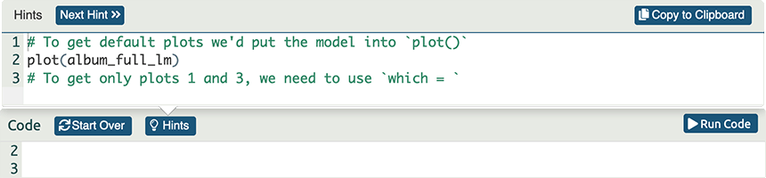

<html lang="en">

```{r setup, include=FALSE}
knitr::opts_chunk$set(
	echo = TRUE,
	message = FALSE,
	warning = FALSE
)

library(learnr) #necessary to render tutorial correctly

library(dplyr)
library(ggplot2)
library(Hmisc)
library(htmltools)
library(magrittr)

library(correlation)
library(GPArotation)
library(parameters)
library(psych)

source("./www/discovr_helpers.R")

# knitr::write_bib(c('forcats'), file = 'packages.bib')


# Read data files needed for the tutorial

raq_tib <- discovr::raq
raq_items_tib <- raq_tib %>% dplyr::select(-id)

raq_cor <- cor(raq_items_tib) %>%  round(., 3)
```

# discovr: Exploratory Factor Analysis (EFA)

## Overview

<div class="infobox">
  
  
  **Usage:** This tutorial accompanies [Discovering Statistics Using R and RStudio](https://www.discovr.rocks/) [@field_discovering_2021] by [Andy Field](https://en.wikipedia.org/wiki/Andy_Field_(academic)). It contains material from the book so there are some copyright considerations but I offer them under a [Creative Commons Attribution-NonCommercial-NoDerivatives 4.0 International License](http://creativecommons.org/licenses/by-nc-nd/4.0/). Tl;dr: you can use this tutorial for teaching and non-profit activities but please don't meddle with it or claim it as your own work.
  
</div>

### `r cat_space(fill = "h3", height = 2)` Welcome to the `discovr` space pirate academy

Hi, welcome to **discovr** space pirate academy. Well done on embarking on this brave mission to planet `r rproj()`s, which is a bit like Mars, but a less red and more hostile environment. That's right, more hostile than a planet without water. Fear not though, the fact you are here means that you *can* master `r rproj()`, and before you know it you'll be as brilliant as our pirate leader Mae Jemstone (she's the badass with the gun). I am the space cat-det, and I will pop up to offer you tips along your journey.

On your way you will face many challenges, but follow Mae's system to keep yourself on track:

* `r bmu(height = 2)` This icon flags materials for *teleporters*. That's what we like to call the new cat-dets, you know, the ones who have just teleported into the academy. This material is the core knowledge that everyone arriving at space academy must learn and practice. For accessibility, these sections will also be labelled with [(1)]{.alt}.
* `r user_visor(height = 2)` Once you have been at space pirate academy for a while, you get your own funky visor. It has various modes. My favourite is the one that allows you to see everything as a large plate of tuna. More important, sections marked for cat-dets with visors goes beyond the core material but is still important and should be studied by all cat-dets. However, try not to be disheartened if you find it difficult. For accessibility, these sections will also be labelled with [(2)]{.alt}.
* `r user_astronaut(height = 2)` Those almost as brilliant as Mae (because no-one is quite as brilliant as her) get their own space suits so that they can go on space pirate adventures. They get to shout *RRRRRR* really loudly too. Actually, everyone here gets to should *RRRRRR* really loudly. Try it now. Go on. It feels good. Anyway, this material is the most advanced and you can consider it optional unless you are a postgraduate cat-det. For accessibility, these sections will also be labelled with [(3)]{.alt}.

It's not just me that's here to help though, you will meet other characters along the way:

* `r alien(height = 2)` aliens love dropping down onto the planet and probing humanoids. Unfortunately you'll find them probing you quite a lot with little coding challenges. Helps is at hand though. 
* `r robot(height = 2)` **bend-R** is our coding robot. She will help you to try out bits of `r rproj()` by writing the code for you before you encounter each coding challenge.
* `r bug(height = 2)` we also have our friendly alien bugs that will, erm, help you to avoid bugs in your code by highlighting common mistakes that even Mae Jemstone sometimes makes (but don't tell her I said that or my tuna supply will end). 

Also, use hints and solutions to guide you through the exercises (Figure 1).

<figure>

<figcaption>Figure 1: In a code exercise click the hints button to guide you through the exercise.</figcaption>
</figure> 
 

By for now and good luck - you'll be amazing!

### Workflow

* Before attempting this tutorial it's a good idea to work through [this tutorial on how to install, set up and work within `r rproj()` and `r rstudio()`](http://milton-the-cat.rocks/learnr/r/r_getting_started/).

* The tutorials are self-contained (you practice code in code boxes). However, so you get practice at working in `r rstudio()` I strongly recommend that you create an `r rproj()` markdown file within an `r rstudio()` project and practice everything you do in the tutorial in the `r rproj()` markdown file, make notes on things that confused you or that you want to remember, and save it. Within this markdown file you will need to load the relevant packages and data. 


### Packages

This tutorial uses the following packages:

* `correlation` [@makowski_methods_2020]
* `GPArotation` [@bernaards_gradient_2005]
* `here` [@here]
* `parameters` [@makowski_parameters_2019]
* `psych` [@revelle_psych:_2020]
* `tidyverse` [@tidyverse]


I try to follow the [Google `r rproj()` style guide](https://google.github.io/styleguide/Rguide.html) and [tidyverse style guide](https://style.tidyverse.org/) in always declaring the package when using a function: `package::function()`. For example, if I want to use the `mutate()` function from the package `dplyr`, I will write `dplyr::mutate()`. 

It is good practice to be explicit about packages to avoid clashes where functions from different packages have the same name. It also means that you don't need to load packages at the start of your markdown document. 

There are two main exceptions to this rule.

1. There are functions within some `tidyverse` packages that would be used within other functions. Including the package name makes the code difficult to read. Also, no-one wants to write `ggplot2::` before every function from `ggplot2`.
2. To use the pipe operator (`%>%`) you need to have `magrittr` loaded.

We can load all of the packages that are exceptions in one step by loading `tidyverse` at the beginning of our `r rproj()` Markdown document:

```{r eval = FALSE}
library(tidyverse)
```

### Data

To work *outside of this tutorial* you need to download the following data files:

* [raq.csv](https://www.discovr.rocks/csv/raq.csv)

Set up an `r rstudio()` project in the way that [I recommend in this tutorial](http://milton-the-cat.rocks/learnr/r/r_getting_started/#section-working-in-rstudio), and save the data files to the folder within your project called [data]{.alt}. Place this code in the first code chunk in your `r rproj()` Markdown document:

```{r, eval=FALSE}
raq_tib <- here::here("data/raq.csv") %>%
  readr::read_csv()
```

This code reads in the data into an object called `raq_tib`.

## `r bmu()` An `r rproj()`-induced anxiety example  [(2)]{.alt}

Factor analysis is used frequently to develop questionnaires. A lot of students become very stressed about R. Imagine that I wanted to design a questionnaire to measure a trait that I termed ‘R anxiety’. I devised a questionnaire to measure various aspects of students’ anxiety towards learning R and statistics, the RAQ (Figure 1). I generated questions based on interviews with anxious and non-anxious students and came up with 23 possible questions to include. Each question was a statement followed by a five-point Likert scale: *strongly disagree* = 1, *disagree* = 2, *neither agree nor disagree* = 3, *agree* = 4 and *strongly agree* = 5. I wanted to know whether anxiety about R could be broken down into specific forms of anxiety. In other words, what latent variables contribute to anxiety about learning or using R? 

The questions in the RAQ are as follows (each has responses from :

1. **raq_01**: *Statistics make me cry*
2. **raq_02**: *My friends will think I'm stupid for not being able to cope with `r rproj()`*
3. **raq_03**: *Standard deviations excite me*
4. **raq_04**: *I dream that Pearson is attacking me with correlation coefficients*
5. **raq_05**: *I don't understand statistics*
6. **raq_06**: *I have little experience of computers*
7. **raq_07**: *All computers hate me*
8. **raq_08**: *I have never been good at mathematics*
9. **raq_09**: *My friends are better at statistics than me*
10. **raq_10**: *Computers are useful only for playing games*
11. **raq_11**: *I did badly at mathematics at school*
12. **raq_12**: *People try to tell you that `r rproj()` makes statistics easier to understand but it doesn't*
13. **raq_13**: *I worry that I will cause irreparable damage because of my incompetence with computers*
14. **raq_14**: *Computers have minds of their own and deliberately go wrong whenever I use them*
15. **raq_15**: *Computers are out to get me*
16. **raq_16**: *I weep openly at the mention of central tendency*
17. **raq_17**: *I slip into a coma whenever I see an equation*
18. **raq_18**: *R always crashes when I try to use it*
19. **raq_19**: *Everybody looks at me when I use `r rproj()`*
20. **raq_20**: *I can't sleep for thoughts of eigenvectors*
21. **raq_21**: *I wake up under my duvet thinking that I am trapped under a normal distribution*
22. **raq_22**: *My friends are better at `r rproj()` than I am*
23. **raq_23**: *If I am good at statistics people will think I am a nerd*

With a little help from a few lecturer friends I collected 2571 completed questionnaires. The data are in [raq_tib]{.alt}.

#### `r alien()` Alien coding challenge

View the data in [raq_tib]{.alt}.

```{r raq_tib, exercise = TRUE, exercise.lines = 2}

```

```{r raq_tib-solution}
raq_tib
```

Note that there are 24 variables:

* **id**: a character variable (note the [<chr>]{.alt} under the name) containing the participant.
* Twenty three variables labelled from **raq_01** to **raq_23** that are all numeric (note the [<dbl>]{.alt} under the name) that contain the responses to the 23 questions on the questionnaire.

## `r bmu()` Pre-analysis  [(2)]{.alt}
### `r bmu()` Inspect the correlation matrix  [(2)]{.alt}

The first thing to do is to look at the correlations between items mon the RAQ.

#### `r alien()` Alien coding challenge

Using what you've learnt in previous tutorials produce a correlation matrix for the 23 RAQ items.

<div class="tip">
  `r cat_space()` **Tip: Correlation memory jog**

* We can use `correlation::correlation()` to get a correlations, and `summary()` to present them as a matrix/grid.
* You need to select out the [id]{.alt} variable before computing the correlations.

</div>


```{r r_matrix, exercise = TRUE, exercise.lines = 4}

```

```{r r_matrix-hint-1}
# select out the id variable
raq_tib %>% 
  dplyr::select(xxxx)
```

```{r r_matrix-hint-2}
# pipe into the correlation function
raq_tib %>% 
  dplyr::select(-id) %>% 
  correlation::correlation()
```

```{r r_matrix-hint-3}
# pipe into summary to get a condensed table of correlations:
raq_tib %>% 
  dplyr::select(-id) %>% 
  correlation::correlation() %>%
  summary()
```


#### `r robot()` Code example

Staring at all of those numbers can make your eyes hurt. We can instead produce a heat using the `cor.plot()` function from the `psych` package. This plots a grid of the correlations and colours each cell by the strength and direction of the correlation. We can therefore look for very lightly shaded cells (correlation close to zero) and very darkly-shaded cells (correlations close to 1 or -1). Given that correlation matrices are symmetrical above and below the diagonal the information below the diagonal is identical to the information above it. It is, therefore, helpful to use [upper = FALSE]{.alt} to hide the information above the diagonal.

To use the `cor.plot()` function we pipe the data from the raq into it.

```{r, eval = F}
raq_tib %>% 
  dplyr::select(-id) %>%
  psych::cor.plot(upper = FALSE)
```

#### `r bug()` Exercise

Use the code box to visualise the correlation matrix using `cor.plot()`.

```{r corplot, exercise = TRUE, exercise.lines = 4}
             
```

```{r corplot-solution}
raq_tib %>% 
  dplyr::select(-id) %>%
  psych::cor.plot(upper = FALSE)
```

With either method note correlations less than (roughly) 0.3 and greater than (roughly) 0.9. Variables with very few correlations above 0.3 might not ‘fit’ with the pool of items, and variables with correlations greater than 0.9 might be collinear.

All questions in the RAQ correlate reasonably well with all others and none of the correlation coefficients are excessively large; therefore, we won't eliminate any questions based on the size of the correlations.


<div class="tip">
  `r cat_space()` **Tip: removing the id variable**

For nearly all of the analysis we need to do, we want to work with only the questionnaire items. For these data, this means excluding the [id]{.alt} variable. In the previous examples, we have done this by piping [raq_tib]{.alt} into `dplyr::select(-id)`, but it might be more efficient in the long run to create a version of the data that contains only the questionnaire items. For example, we could create an object called [raq_items_tib]{.alt} as follows:

```{r, eval = F}
raq_items_tib <- raq_tib %>% 
  dplyr::select(-id)
```

Or, equivalently:

```{r, eval = F}
raq_items_tib <- raq_tib %>% 
  dplyr::select(raq_01:raq_23)
```

</div>

#### `r bug()` Exercise

Use the code box to create an object called [raq_items_tib]{.alt} that contains only the questionnaire item variables. Inspect this new object and note that the [id]{.alt} variable has gone.

```{r raq_items_tib, exercise = TRUE, exercise.lines = 4}
             
```

```{r raq_items_tib-solution}
raq_items_tib <- raq_tib %>% 
  dplyr::select(-id)
raq_items_tib
```

We will use this new object, [raq_items_tib]{.alt}, for the remainder of the tutorial to save us having to keep excluding the [id]{.alt} variable.


### `r bmu()` Bartlett's test and the KMO test  [(2)]{.alt}

Another way to inspect the correlation matrix is with Bartlett's test of sphericity, which tests whether the correlation matrix is significantly different from an identity matrix (i.e. it tests whether the correlation coefficients are all 0). It's testing a pretty extreme scenario and because significance depends on sample size, and in factor analysis sample sizes are very large, the test will nearly always be significant. So it's not a particularly useful test, but worth doing because in the unlikely event that it is non-significant you likely have a big problem on your hands. 

#### `r robot()` Code example

We can implement Bartlett's test using the `psych::cortest.bartlett()` function. To use it, we  pipe the correlation matrix into it and specify the sample size using, for these data, [n = 2571]{.alt}. For other data sets change the value of 2571 to be the sample size. To get the correlation matrix use the `cor()` function. For example, if we use the tibble we just created that contains only the questionnaire item data ([raq_items_tib]{.alt}):

```{r, eval = F}
raq_items_tib %>% 
  cor() %>% 
  psych::cortest.bartlett(n = 2571)
```

#### `r bug()` Exercise

Use the code box to get Bartlett's test.

```{r bartlett, exercise = TRUE, exercise.lines = 4}
             
```

```{r bartlett-solution}
raq_items_tib %>%
  cor() %>% 
  psych::cortest.bartlett(n = 2571)
```


```{r, echo = F}
bartlett <- raq_items_tib %>%
  cor() %>% 
  psych::cortest.bartlett(n = 2571)
```


As expected, given the huge sample size, Bartlett’s test is highly significant, $\chi^2$(`r bartlett$df`) = `r round(bartlett$chisq, 2)`, *p* = `r round(bartlett$p.value, 2)`. This significant value only really tells us that we don't have a massive problem, which is nice to know, I suppose.

You might also want to check the sampling adequacy (spoiler: with 2571 participants I think we're good). The Kaiser–Meyer–Olkin (KMO) measure of sampling adequacy (KMO) varies between 0 and 1 with a value of 0 indicating that factor analysis is likely to be inappropriate. A value close to 1 indicates that patterns of correlations are relatively compact and so factor analysis should yield distinct and reliable factors. Kaiser and Rice (1974) provided appealing guidelines, especially if you like the letter M:

* Marvellous: values in the 0.90s
* Meritorious: values in the 0.80s
* Middling: values in the 0.70s
* Mediocre: values in the 0.60s
* Miserable: values in the 0.50s 

Values smaller than 0.5 should lead you either to collect more data or to rethink which variables to include.

#### `r robot()` Code example

We can implement the KMO test using the `psych::KMO()` function. To use it, we again pipe the correlation matrix into it. For example:

```{r, eval = F}
raq_items_tib %>%
  cor() %>% 
  psych::KMO()
```

#### `r bug()` Exercise

Use the code box to get then KMO test.

```{r kmo, exercise = TRUE, exercise.lines = 4}
             
```

```{r kmo-solution}
raq_items_tib %>%
  cor() %>% 
  psych::KMO()
```


```{r, echo = F}
kmo <- raq_items_tib %>%
  cor() %>% 
  psych::KMO()
```

The KMO statistic ([Overall MSA]{.alt}) is `r round(kmo$MSA, 2)`, which is well above the minimum criterion of 0.5 and falls into the range of marvelous. The KMO values for individual variables range from `r round(min(kmo$MSAi), 2)` to `r round(max(kmo$MSAi), 2)`. All values are, therefore, well above 0.5, which is good news. If you find variables with values below 0.5 then consider excluding them from the analysis (or run the analysis with and without that variable and note the difference). Removal of a variable affects the KMO statistics, so if you plan to remove a variable be sure to re-examine the KMO for the correlation matrix that has the variable removed.


## `r bmu()` Factor analysis [(2)]{.alt}
### `r bmu()` Factor extraction [(2)]{.alt}

To determine how many factors we should extract, we can use the `psych::fa.parallel()` function to run parallel analysis. You can pipe your tibble containing the item data from the questionnaire into this function, it has several options but the two that you might want to be aware of:

* [fm = "minres"]{.alt} There are various methods of factor analysis. By default the `psych` package uses minimum residual ([minres]{.alt}), which is basically the ordinary least squares (OLS) that you'll be familiar with from the tutorials on the linear model. There are other methods though such as principal axes ([pa]{.alt}), alpha factoring ([alpha]{.alt}), weighted least squares [wls]{.alt}, minimum rank ([minrank]{.alt}), or maximum likelihood ([ml]{.alt}).
* [fa = "both"]{.alt}. By default the function will tell you the number of factors to extract based on factor analysis but also the  number of components (like factors, but different) to extract based on a related technique called principal component analysis (PCA). In the interests of de-cluttering the output, we can change this option to [fa = "fa"]{.alt} so we see only the number of factors to extract (and not the number of components). Should you find yourself needing to do PCA you can change the option to [fa = "pc"]{.alt}.
* [use = "pairwise"]{.alt}. By default missing data are handled by using all complete pairwise observations to calculate the correlation coefficients between variables. Therefore, if a case is missing a value on, say item **raq_22**, that case will only be excluded when computing the correlation coefficients that directly involve **raq_22**. This default is sensible, because the other options are [everything]{.alt} (this result in missing values in the correlation matrix so not a good idea), [all.obs]{.alt} (throws up an error alerting you to missing values and doesn't compute the correlations), [complete.obs]{.alt} (deletes cases that have missing values for any item from the computation of all correlations - also known as listwise deletion, which is rarely, if ever, a good idea).

#### `r bug()` Exercise

Use the code box to run a parallel analysis with the default settings but specifying [fa = "fa"]{.alt}. How many factors should be extracted?

```{r parallel, exercise = TRUE, exercise.lines = 4}
         
```

```{r parallel-solution}
raq_items_tib %>% 
  psych::fa.parallel(fa = "fa")
```

In a parallel analysis each eigenvalue (which represents the size of the factor) is compared against an eigenvalue for the corresponding factor in many randomly generated data sets that have the same characteristics as the data being analysed. In doing so, each eigenvalue is compared to an eigenvalue from a data set that has no underlying factors. This is a bit like asking whether our observed factor is bigger than a non-existing factor. Factors that are bigger than their ‘random’ counterparts are retained. 

In the scree plot, each factor is plotted on the *x*-axis with its corresponding eigenvalue on the *y*-axis. The observed eigenvalues for each factor are shown as blue triangles connected by a blue line to form the characteristic 'scree' shape. The red dotted line shows the corresponding line from randomly generated datasets. Given we want to keep factors that have eigen values larger than we'd expect in data that has no underlying factors, we want to keep factors that have triangles (eigenvalues) that fall above the red line. In this case, the first four factors have eigenvalues larger than their counterparts from random data. The output also contains a handy text messaqge confirming that we should extract 4 factors.

### `r bmu()` Factor analysis [(2)]{.alt}

We can now run the factor analysis, extracting 4 factors, using the `psych::fa()` function. This function has this general format (I'm including only the arguments you're most likely to use):

```{r, eval = F}
my_fa_object <- psych::fa(r,
                          nfactors = 1,
                          fm = "minres",
                          rotate = "oblimin",
                          scores = "regression",
                          max.iter = 50,
                          use = "pairwise",
                          cor = "cor"
                          )
```


In which you replace [my_fa_object]{.alt} with the name you want to give your factor analysis object.

* [r]{.alt}: the data being fed into the function, in this case [r = raq_items_tib]{.alt}. 
* [nfactors = 1]{.alt}: the number of factors to extract. By default 1 factor is extracted, so we need to change this to [nfactors = 4]{.alt}.
* [fm = "minres"]{.alt}: the method of factor analysis (see the previous section for the options, but we can leave the default alone.
* [rotate = "oblimin"]{.alt}: the method of factor rotation. The default is an oblique rotation method called [oblimin]{.alt}, which is fine. You can choose a different oblique rotation by replacing [oblimin]{.alt} with one of [Promax]{.alt}, [promax]{.alt}, [simplimax]{.alt}, [bentlerQ]{.alt}, [geominQ]{.alt}, [biquartimin]{.alt} and [cluster]{.alt}. If you need an orthogonal rotation, then use [rotate = "varimax"]{.alt} or replace [varimax]{.alt} with one of [quartimax]{.alt}, [bentlerT]{.alt}, [equamax]{.alt}, [varimin]{.alt}, [geominT and [bifactor]{.alt}. If you don't want to rotate the solution, use [rotate = "none"]{.alt}.
* [scores = "regression"]{.alt}: the method for computing factor scores. By default the [regression]{.alt} method is used, but because we should (other things being equal) use oblique rotation, we should change this argument to [scores = "tenBerge"]{.alt}.
* [max.iter = 50]{.alt}: factor analysis works using an iterative process. By default the function allows `r rproj()` to search for an optimal solution 50 times. This number is fine in most cases but if you get an error message about convergence then try increasing this value.
* [use = "pairwise"]{.alt}: this argument determines how missing values are treated (see the previous section). The default is fine.
* [cor = "cor"]{.alt}: this argument determines how correlation coefficients are computed from the raw data. By default Pearson's correlation is used (["cor"]{.alt}), which is fine for us, but in other situations you might need to change ["cor"]{.alt} to, say, ["tet"]{.alt} to use tetrachoric correlations or ["poly"]{.alt} for polychoric correlations. 


<div class="tip">
  `r cat_space()` **Tip: factor rotation**

To do factor rotation we need to have the `GPArotation` package loaded. Make sure that you have it installed by executing the following in the console:

```{r eval = F}
install.packages('GPArotation')
```

Once installed, make sure that in your markdown file you include (if you follow my advise you'll do this in the code chunk where you setup your markdown document)


```{r eval = F}
library(GPArotation)
```

</div>

For the RAQ data, we could use the following code, which leaves a lot of the default settings alone, to create an object [raq_fa]{.alt}:

```{r, eval = F}
raq_fa <- raq_items_tib %>% 
  psych::fa(
    nfactors = 4,
    scores = "tenBerge"
    )
```

#### `r bug()` Exercise

Use the code box to create the object [raq_fa]{.alt} using the code above and then inspect it.

```{r raq_fa, exercise = TRUE, exercise.lines = 4}
             
```

```{r raq_fa-solution}
raq_fa <- raq_items_tib %>% 
  psych::fa(
    nfactors = 4,
    scores = "tenBerge"
    )
raq_fa
```


```{r, echo = F}
raq_fa <- raq_items_tib %>% 
  psych::fa(
    nfactors = 4,
    scores = "tenBerge"
    )
```

There's a lot of output. First, we are shown the pattern matrix, but we'll return to this. Note that the factors are labelled [MR1]{.alt}, [MR2]{.alt}, [MR3]{.alt} and [MR4]{.alt}.

First, we are given some information about how much variance each factor accounts for.

```{r, echo = F}
raq_fa$Vaccounted %>%  round(., 2)
```

We see, for example, from [Proportion Var]{.alt} that [MR1]{.alt} accounts for 0.09 of the overall variance (9%) and [MR2]{.alt} accounts for 0.08 of the variance (8%) and so on. The [Cumulative Var]{.alt} is the proportion of variance explained cumulatively by the factors. So, cumulatively, [MR1]{.alt} accounts for 0.09 of the overall variance (9%) and  [MR1]{.alt} and [MR2]{.alt} together account for 0.09 + 0.08 = 0.17 of the variance (17%). IMportantly, we can see that all four factors in combination explain 0.3 of the overall variance (30%).

The [Proportion Explained]{.alt} is the proportion of the explained variance, that is explained by a factor. So, for example, of the 30% of variance explained by the four factors, the proportion attributable to factor 1 is 0.32 (32%). So, of the 30% of variance accounted for, 0.32 (32%) is attributable to [MR1]{.alt}, 0.25 (25%) to [MR2]{.alt}, 0.23 (23%) to [MR3]{.alt} and so on.

The correlations between factors are also displayed:

```{r, echo = F}
raq_fa$Phi %>%  round(., 2)
```

These are all non-zero indicating that factors are correlated (and oblique rotation was appropriate). It also tells us the degree to which factors are correlated.

There are several fit indices that tell us how well the model fits the data:

* Tucker Lewis Index of factoring reliability: values above about 0.9 indicate good fit. Our value of 1 indicates good fit.
* RMSEA: values less than about 0.06 indicate good fit ideally with the upper confidence interval being below 0.08. Our model has a value of 0 and a confidence interval of 0-0.006 indicating good fit.

To interpret the factor analysis we look at the factor loadings for each question on each factor to see which items load most heavily onto which factors. The factor loadings are shown in the pattern matrix that forms part of the main output, but this is quite difficult to interpret in its raw form. To make life easier we can use the `parameters::model_parameters()` function, which provides an easy way to sort the items by their factor loadings and suppress factor loadings below a certain value (which can help you to see the wood for the trees). In general it takes the form:

```{r, eval = F}
my_fa_object %>% 
  parameters::model_parameters(sort = TRUE, threshold = "max")
```

In which [my_fa_object]{.alt} is the factor analysis object containing the factor loadings. By setting [sort = TRUE]{.alt} we sort the items by their factor loadings, and we can set  [threshold]{.alt} to a value above which we show values. By default the threshold is the maximum loading (i.e. all factor loadings are shown), but if we set, for example, [threshold = 0.2]{.alt} then only factor loadingsd above 0.2 will be displayed.

#### `r bug()` Exercise

Use the code box to sort the the factor loadings and display only those greater than 0.2. (Remember that earlier we saved the factor analysis object as [raq_fa]{.alt}.)

```{r mod_params, exercise = TRUE, exercise.lines = 4}
             
```

```{r mod_params-solution}
raq_fa %>%
  parameters::model_parameters(sort = TRUE, threshold = 0.2)
```

This makes it much easier to see the patterns in the questions that load onto the same factors. The questions that load highly on [MR1]{.alt} seem to be items that relate to **Fear of computers**:

* **raq_05**: *I don't understand statistics*
* **raq_06**: *I have little experience of computers*
* **raq_07**: *All computers hate me*
* **raq_10**: *Computers are useful only for playing games*
* **raq_13**: *I worry that I will cause irreparable damage because of my incompetence with computers*
* **raq_14**: *Computers have minds of their own and deliberately go wrong whenever I use them*
* **raq_15**: *Computers are out to get me*
* **raq_18**: *R always crashes when I try to use it*

Note that item 5 also loads highly onto [MR3]{.alt}.

The questions that load highly on [MR2]{.alt} seem to be items that relate to **Fear of peer/social evaluation**:

* **raq_02**: *My friends will think I'm stupid for not being able to cope with `r rproj()`*
* **raq_09**: *My friends are better at statistics than me*
* **raq_19**: *Everybody looks at me when I use `r rproj()`*
* **raq_22**: *My friends are better at `r rproj()` than I am*
* **raq_23**: *If I am good at statistics people will think I am a nerd*

The questions that load highly on [MR3]{.alt} seem to be items that relate to **Fear of statistics**:

* **raq_01**: *Statistics make me cry*
* **raq_03**: *Standard deviations excite me*
* **raq_04**: *I dream that Pearson is attacking me with correlation coefficients*
* **raq_05**: *I don't understand statistics*
* **raq_12**: *People try to tell you that `r rproj()` makes statistics easier to understand but it doesn't*
* **raq_16**: *I weep openly at the mention of central tendency*
* **raq_20**: *I can't sleep for thoughts of eigenvectors*
* **raq_21**: *I wake up under my duvet thinking that I am trapped under a normal distribution*

The questions that load highly on [MR4]{.alt} seem to be items that relate to **Fear of mathematics**:

* **raq_08**: *I have never been good at mathematics*
* **raq_11**: *I did badly at mathematics at school*
* **raq_17**: *I slip into a coma whenever I see an equation*

This analysis seems to reveal that the questionnaire is composed of four subscales: fear of statistics, fear of computers, fear of maths and fear of negative peer evaluation. There are two possibilities here. The first is that the RAQ failed to measure what it set out to (namely, `r rproj()` anxiety) but instead measures related constructs. The second is that these four constructs are sub-components of `r rproj()` anxiety; however, the factor analysis does not indicate which of these possibilities is true.

### `r user_astronaut()` Secondary analysis [(3)]{.alt}

You can do factor analysis both on the raw data (like we have in our dataset) or a correlation matrix (handy for analysing someone else's data where you have the published correlation matrix, but not the raw data). So, [r]{.alt} can be in the form of a correlation matrix. For illustrative purposes [raq_cor]{.alt} contains the correlation matrix for the 23 items of the RAQ.

If we want to run factor analysis from a correlation matrix then we need to give the function some extra information, namely the sample sizes. If all correlations are based on the same sample size (as they are in this example) we can use [n.obs = 2571]{.alt}, replacing 2571 with whatever sample size you used, but if correlations are based on different sample sizes we would need to provide a matrix, the same size as the correlation matrix, where each element contains the corresponding sample size for each value in the correlation matrix [np.obs = matrix_of_n]{.alt}.

For these data, we could riun the factor analysis from the correlation matrix using


```{r, eval = F}
raq_fa <- raq_cor %>% 
  psych::fa(
    nfactors = 4,
    scores = "tenBerge",
    n.obs = 2571
    )
```

Note that the only difference to before is that the input into the function is a matrix of correlations ([raq_cor]{.alt}) rather than the raw data, and that we have specified the sample size on which the correlations are based by including [n.obs = 2571]{.alt}. Try this in the code box below - you'll get the same output as the previous section.


```{r fa_cor, exercise = TRUE, exercise.lines = 4}
raq_fa <- raq_cor %>% 
  psych::fa(nfactors = 4, scores = "tenBerge", n.obs = 2571)
raq_fa
```

## `r bmu()` Reliability analysis [(2)]{.alt}
### `r bmu()` No reverse scored-items [(2)]{.alt}

To run a reliability analysis, if the items are all scored in the same direction then we select the variables on a particular subscale and pipe them into `psych::alpha()`. 

#### `r robot()` Code example

For the *fear of computers* subscale we could execute:

```{r, eval = F}
raq_tib %>% 
  dplyr::select(raq_05, raq_06, raq_07, raq_10, raq_13, raq_14, raq_15, raq_18) %>% 
  psych::alpha()
```

#### `r bug()` Exercise

Use the code box to run a reliability analysis on the *fear of computers* subscale:

```{r rel_1, exercise = TRUE, exercise.lines = 4}
             
```

```{r rel_1-solution}
raq_tib %>% 
  dplyr::select(raq_05, raq_06, raq_07, raq_10, raq_13, raq_14, raq_15, raq_18) %>% 
  psych::alpha()
```

First, and perhaps most important, the value of Alpha at the very top is Cronbach's $\alpha$, and we are given its 95% confidence interval below: we're looking for values in the range of .7 to .8 (or thereabouts). In this case $\alpha = 0.73 [0.72, 0.75]$, so this probably indicates good reliability.

Next, we get a table giving the statistics for the scale if we deleted each item in turn. The values in the column labelled [raw_alpha]{.alt} are the values of the overall $\alpha$ if that item is **not* included in the calculation. Basically it's the change in Cronbach's $\alpha$ that would be seen if a particular item were deleted. The overall $\alpha$ is .73, and so all values greater than this, which would indicate that the overall $\alpha$ increases (i.e. reliability improves) if the item is removed. None of the items here would improve reliability if they were deleted.

The table labelled [item statistics]{.alt} shows, in the column labelled [r]{.alt} the correlations between each item and the total score from the scale — sometimes called item-total correlations. There's a problem with this statistic in that the item is included in the scale total, which inflates the overall correlation. These are the values in [r.drop]{.alt}. In a reliable scale all items should correlate with the total. So, we're looking for items that don't correlate with the overall score from the sub-scale: if any of these values of [r.drop]{.alt} are less than about .3 then we've got problems, because it means that a particular item does not correlate very well with the subscale overall. For the fear of computers subscale, all items have corrected item-total correlations above 0.3, which is encouraging.

The final table tells us what percentage of people gave each response to each of the items.  This is useful to make sure that everyone in your sample is not giving the same response.  It is usually the case that an item where everyone (or almost everyone) gives the same response will almost certainly have poor reliability statistics. For this subscale no-one responded with a 5 on any of the items suggesting either that no-one is really afraid of computers or that the items are doing a poor job of eliciting those extreme responses. Similarly very few people responded with a 1.

#### `r bug()` Exercise

Use the code box to run a reliability analysis on the *Fear of peer/social evaluation* subscale:

```{r rel_2, exercise = TRUE, exercise.lines = 4}
             
```

```{r rel_2-solution}
raq_tib %>% 
  dplyr::select(raq_02, raq_09, raq_19, raq_22, raq_23) %>% 
  psych::alpha()
```

Again we have good overall reliability ($\alpha = 0.73 [0.71, 0.75]$), no items improves this value if it is dropped, item correlations with the scale total are all really good (they range from 0.45 to 0.55) and again we have issues with the items not eliciting extreme responses.

#### `r bug()` Exercise

Use the code box to run a reliability analysis on the *Fear of mathematics* subscale:

```{r rel_3, exercise = TRUE, exercise.lines = 4}
             
```

```{r rel_3-solution}
raq_tib %>% 
  dplyr::select(raq_08, raq_11, raq_17) %>% 
  psych::alpha()
```

Overall reliability is a bit lower, but this is likely due to the lower number of items ($\alpha = 0.68 [0.66, 0.70]$), no items improves this value if it is dropped, item correlations with the scale total are all really good (they range from 0.47 to 0.53) and again we have issues with the items not eliciting extreme responses.

### `r bmu()` Reverse scored-items [(2)]{.alt}

When a scale has reverse scored items, we need to tell the `alpha()` function which items are reversed by using the [keys]{.alt} argument within the function. We supply this argument with a vector of 1s and -1s, which match the number of items we're conducting the analysis on. A 1 indicates a positively scored item and a -1 a negatively scored item. For example, the **Fear of statistics** subscale has a reverse scored item: *Standard deviations excite me* (**raq_03**), so we need to indicate that this item is reverse scored. If we selected the items for the *Fear of statistics* subscale in order by using

```{r, eval = F}
raq_tib %>% 
  dplyr::select(raq_01, raq_03, raq_04, raq_05, raq_12, raq_16, raq_20, raq_21)
```

Then we'd need to indicate that the second item in the list of variables is reverse scored:

```{r, eval = F}
psych::alpha(keys = c(1, -1, 1, 1, 1, 1, 1, 1))
```

Note that the -1 is in the same position (second) as [raq_03]{.alt} is in the variable list.

#### `r robot()` Code example

For the *fear of statistics* subscale we could execute:

```{r, eval = F}
raq_tib %>% 
  dplyr::select(raq_01, raq_03, raq_04, raq_05, raq_12, raq_16, raq_20, raq_21) %>% 
  psych::alpha(keys = c(1, -1, 1, 1, 1, 1, 1, 1))
```

#### `r bug()` Exercise

Use the code box to run a reliability analysis on the *fear of computers* subscale:

```{r rel_4, exercise = TRUE, exercise.lines = 4}
             
```

```{r rel_4-solution}
raq_tib %>% 
  dplyr::select(raq_01, raq_03, raq_04, raq_05, raq_12, raq_16, raq_20, raq_21) %>% 
  psych::alpha(keys = c(1, -1, 1, 1, 1, 1, 1, 1))
```

Again we have acceptable, but not staggering, overall reliability ($\alpha = 0.67 [0.65, 0.69]$), no items improves this value if it is dropped, item correlations with the scale total are not too bad (they range from 0.27 to 0.46) and again we have issues with the items not eliciting extreme responses. Note in the output that [raq_03]{.alt} appears as [raq_03-]{.alt} to indicate that it is reverse scored. This is am useful double check that our keys have reversed the correct item.


<div class="infobox">
  
  
  **A message from Mae Jemstone:**
  
Mae was burnt out. She thought the tutorial writing was over. 'Just one term, then you can rest' they had said. Not for the first time, they had lied. She raised her weary body and stared at her screen. It made her feel anxious. She couldn't do it anymore, she hadn't the strength. 'Who will believe me?' She thought. People depend on me, I'm not allowed to show weakness. But how can I find the will? She remembered the box, the box from the Senza and very slowly her fingers started to type.

</div>


## Resources {data-progressive=FALSE}

### Statistics

* The tutorials typically follow examples described in detail in @field_discovering_2021. That book covers the theoretical side of the statistical models, and has more depth on conducting and interpreting the models in these tutorials.
* If any of the statistical content doesn't make sense, you could try my more introductory book *An adventure in statistics* [@fieldAdventureStatisticsReality2016].
* There are free lectures and screencasts on my [YouTube channel](https://www.youtube.com/user/ProfAndyField/).
* There are free statistical resources on my websites [www.discoveringstatistics.com](http://www.discoveringstatistics.com) and [milton-the-cat.rocks](http://milton-the-cat.rocks).

### `r rproj("h3")`

* [R for data science](http://r4ds.had.co.nz/index.html) by @wickhamDataScience2017 is an open-access book by the creator of the tidyverse (Hadley Wickham). It covers the *tidyverse* and data management.
* [ModernDive](http://moderndive.com/index.html) is an open-access textbook on `r rproj("h3")` and `r rstudio()`.
* [`r rstudio()` cheat sheets](https://www.rstudio.com/resources/cheatsheets/).
* [`r rstudio()` list of online resources](https://www.rstudio.com/online-learning/).

### Acknowledgement

I'm extremely grateful to [Allison Horst](https://www.allisonhorst.com/) for her very informative blog post on [styling learnr tutorials with CSS](https://education.rstudio.com/blog/2020/05/learnr-for-remote/) and also for sending me a CSS template file and allowing me to adapt it. Without Allison, these tutorials would look a lot worse (but she can't be blamed for my colour scheme).

## References


