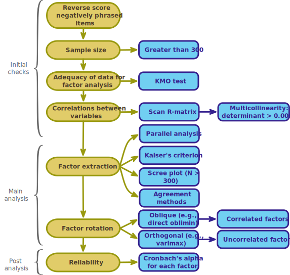

<html lang="en">

```{r setup, include=FALSE}
knitr::opts_chunk$set(
	echo = TRUE,
	message = FALSE,
	warning = FALSE
)
options(knitr.kable.NA = '')

#necessary to render tutorial correctly
library(learnr) 
library(htmltools)
#easystats
library(datawizard)
library(correlation)
library(insight)
library(parameters)
library(performance)
library(see)
#tidyverse
library(dplyr)
library(ggplot2)
library(tidyr)
#non tidyverse/easystats
library(GPArotation)
library(psych)
#students don't use
library(knitr)

source("./www/discovr_helpers.R")

# Read data files needed for the tutorial
raq_tib <- discovr::raq
# create global objects
raq_items <- raq_tib |> dplyr::select(-id) |>  reverse(select = "raq_03", range = c(1, 5)) # reverse item 3
raq_poly <- correlation(raq_items, method = "polychoric") # create the correlations
raq_poly_mtx <- as.matrix(raq_poly)
raq_fa <- raq_fa <- factor_analysis(x = raq_poly_mtx, n_obs = 2571, n = 4)
raq_fit <- model_performance(raq_fa)
raq_sum <- summary(raq_fa)
raq_omg <- item_omega(raq_items, n = 4, poly_cor = TRUE)
omg_fit <- model_performance(raq_omg)
omg_psych <- get_model(raq_omg, model = "model")
```


# discovr exploratory factor analysis (EFA)


```{r, child = "./docs/intro.Rmd"}

```

## Packages {data-progressive=FALSE}

```{r, child = "./docs/packages.Rmd"}

```


## Data

```{r, child = "./docs/data.Rmd"}

```

## Fitting models

```{r, child = "./docs/fit_fa_models.Rmd"}

```


## `r user_visor()` An `r rproj()`-induced anxiety example  [(B)]{.lbl}

Factor analysis is used frequently to develop questionnaires. A lot of students become very stressed about `r rproj()`. Imagine that I wanted to design a questionnaire to measure a trait that I termed '`r rproj()` anxiety'. I devised a questionnaire to measure various aspects of students' anxiety towards learning `r rproj()` and statistics, the RAQ. I generated questions based on interviews with anxious and non-anxious students and came up with 23 possible questions to include. Each question was a statement followed by a five-point Likert scale: *strongly disagree* = 1, *disagree* = 2, *neither agree nor disagree* = 3, *agree* = 4 and *strongly agree* = 5. I wanted to know whether anxiety about `r rproj()` could be broken down into specific forms of anxiety. In other words, what latent variables contribute to anxiety about learning or using `r rproj()`? 

The questions in the RAQ are as follows:

1. `raq_01`: *Statistics make me cry*
2. `raq_02`: *My friends will think I'm stupid for not being able to cope with `r rproj()`*
3. `raq_03`: *Standard deviations excite me*
4. `raq_04`: *I dream that Pearson is attacking me with correlation coefficients*
5. `raq_05`: *I don't understand statistics*
6. `raq_06`: *I have little experience of computers*
7. `raq_07`: *All computers hate me*
8. `raq_08`: *I have never been good at mathematics*
9. `raq_09`: *My friends are better at statistics than me*
10. `raq_10`: *Computers are useful only for playing games*
11. `raq_11`: *I did badly at mathematics at school*
12. `raq_12`: *People try to tell you that `r rproj()` makes statistics easier to understand but it doesn't*
13. `raq_13`: *I worry that I will cause irreparable damage because of my incompetence with computers*
14. `raq_14`: *Computers have minds of their own and deliberately go wrong whenever I use them*
15. `raq_15`: *Computers are out to get me*
16. `raq_16`: *I weep openly at the mention of central tendency*
17. `raq_17`: *I slip into a coma whenever I see an equation*
18. `raq_18`: *R always crashes when I try to use it*
19. `raq_19`: *Everybody looks at me when I use `r rproj()`*
20. `raq_20`: *I can't sleep for thoughts of eigenvectors*
21. `raq_21`: *I wake up under my duvet thinking that I am trapped under a normal distribution*
22. `raq_22`: *My friends are better at `r rproj()` than I am*
23. `raq_23`: *If I am good at statistics people will think I am a nerd*

With a little help from a few lecturer friends I collected 2571 completed questionnaires. The data are in [raq_tib]{.alt}. We can still broadly follow our usual 5-step process for fitting models (Figure 2), but Figure 3 shows the specific workflow we'll work through.


<figure>

<figcaption>Figure 3: Workflow for Exploratory factor Analysis (EFA).</figcaption>
</figure>

## `r bmu()` Step 1: summarize [(A)]{.lbl}

<div class="stepbox">
  `r step()` **Step 1**

Get your data into `r rproj()` and pre-process using [tidyverse]{.pkg} packages or the [datawizard]{.pkg} package from [easystats]{.pkg}.
</div>

#### `r alien()` Alien coding challenge

View the data in [raq_tib]{.alt}.

```{r raq_tib, exercise = TRUE, exercise.lines = 2}

```

```{r raq_tib-solution}
raq_tib
```

Note that there are 24 variables:

* `id`: a character variable (note the `<chr>` under the name) containing the participant ID.
* Twenty three variables labelled from `raq_01` to `raq_23` that are all numeric (note the `<dbl>` under the name) that contain the responses to the 23 questions on the questionnaire.


As we've seen, the data has a variable `id` containing the participant ID. We won't want this variable in the analyses we do. We can use `select()` to remove it each time we don't need it, but it will save a lot of repetitious code if we store a version of the data that contains only the scores from the RAQ items. 

#### `r alien()` Alien coding challenge

Use the code box to create an object called [raq_items]{.alt} that contains only the questionnaire item variables. Inspect this new object and note that the [id]{.alt} variable has gone.

```{r raq_items, exercise = TRUE, exercise.lines = 4}
             
```

```{r raq_items-solution}
raq_items <- raq_tib |> 
  dplyr::select(-id)
raq_items
```

We will use this new object, [raq_items]{.alt}, for the remainder of the tutorial.

### `r bmu()` Reverse score items  [(B)]{.lbl}

All our items except one are statements that reflect anxiety or uncertainty about the topic. For example, endorsing items such as *I don't understand statistics*, *Statistics make me cry*, *My friends are better at statistics than me* and *All computers hate me* is consistent with having a lack of confidence or some anxiety over aspects of learning `r rproj()`. Strongly agreeing with items phrased in this way indicates anxiety and would garner the maximum score of 5 for that item, and in general, the more a person endorses these items, the more anxious they probably are, and the higher their score will be.

Item 3 (`raq_03`) is different, it’s what’s known as a [reverse phrased item]{.kt} because its sentiment is the opposite to what you wish to measure. It is good to include items that are reverse phrased to reduce response bias (it keeps respondents on their toes); however, these items need to be scored in the opposite direction to be consistent with the bulk of items.On the RAQ, the item `Standard deviations excite me’ is reverse-phrased because endorsing this item implies confidence or enthusiasm about statistics. We therefore want to re-score this item so it is consistent with other items. That is, we want someone scoring the maximum of 5 on this item to get a score of the minimum of 1 (because for other items 1 represents low anxiety).

In terms of factor analysis it doesn’t matter whether we reverse score items, all that it affects is the sign of the factor/component loading, but there are benefits to doing it at the very beginning of the workflow:

1. Having done it, you can forget about reverse scoring and focus on the fact that all correlations and factor loadings should be positive if the items are consistent with your theory.
2. You don’t have the cognitive load of having to think about which items are reverse-phrased when you interpret parts of your analysis because every item has been scored such that a high score represents more of the construct you’re measuring.
3. You don’t run the risk of ‘forgetting’ whether you have reverse scored items for the parts of the analysis where it matters. The answer is always ‘Yes, I reverse scored when I loaded and processed the raw data’.
4. There’s a much lower risk of reverse scoring your already reverse-scored items so that they’re no longer reverse scored. Trust me, it happens.

To reverse score items we can use the `reverse()` function from [datawizard]{.pkg} (Patil et al., 2022), which takes the general form:

```{r eval = FALSE}
reversed_tib <- reverse(x = my_tibble,
        select = c("variable_1", "variable_2", ..., "variable_n" ),
        range = c(min, max))
```

in which you replace [reversed_tib]{.alt} with the name you want to assign to the reverse-scored data (you can use the same name as the existing data to write over it with the reverse scored version), and [my_tibble]{.alt} with the name of your data. The [select]{.alt} argument is used to select the variables that you want to reverse score, and range is used to define the end points of the scale. By default, the function tries to work these out from the data, but I think it’s safest to be explicit. For these data we had a response scale from 1 to 5 so we’d replace [min]{.alt} with 1 and [max]{.alt} with 5.


#### `r robot()` Code example

To reverse score item 3 we use this code

```{r eval = FALSE}
raq_items <- raq_items |>
  reverse(select = "raq_03", range = c(1, 5))
```

This creates a new version of `raq_items` by piping the existing version into `reverse()` and instructing it to reverse score the variable `raq_03`.

#### `r alien()` Alien coding challenge

Add code from the example to reverse-score `raq_03`.

```{r raq_item}
raq_items <- raq_tib |> 
  dplyr::select(-id)
```


```{r reverse_score, exercise = TRUE, exercise.lines = 9, exercise.setup = "raq_item"}
# inspect the original data (look at raq_03)
raq_items
# add code to reverse score raq_03 and inspect the new version of the data

```

```{r reverse_score-solution}
# inspect the original data (look at raq_03)
raq_items
# add code to reverse score raq_03
raq_items <- raq_items |>
  reverse(select = "raq_03", range = c(1, 5))
# inspect the new version of the data
raq_items
```

Compare scores on `raq_03` in the two versions of the dataset.

### `r user_visor()` Are your data suitable?  [(B)]{.lbl}

A useful first step is to look at the correlations between variables. There are essentially two potential problems: (1) correlations that are not high enough; and (2) correlations that are too high.

#### `r robot()` Code example


In `discovr_07` we met the `correlation()` from [correlation]{.pkg}, we can use this to produce a correlation matrix for the 23 RAQ items. However, because our items use Likert style scales it is more appropriate to look at something called the [polychoric correlation]{.kt} rather than the Pearson correlation coefficient. We can obtain polychoric correlations by using the argument [method = "polychoric"]{.alt} within `correlation()`. For example,

```{r eval = FALSE}
raq_poly <- correlation(raq_items, method = "polychoric")
```

stores the polychoric correlations in an object called [raq_poly]{.alt}.

To store the information as a matrix of correlations called [raq_poly_mtx]{.alt}, that we will use later, we can pass the object we just created into `as.matrix()`

```{r eval = FALSE}
raq_poly_mtx <- as.matrix(raq_poly)
```

We can view the correlations by putting the object into `summary()` and then (for a nicely rendered version with rounded values) piping into `display()`:

```{r eval = FALSE}
summary(raq_poly) |> 
  display(stars = FALSE)
```

The argument [stars = FALSE]{.alt} removes annoying (to me) asterisks indicating significance.


#### `r alien()` Alien coding challenge

Create an object called [raq_poly]{.alt} that contains the polychoric correlations for the 23 RAQ items, then create a matrix of these correlations and store them as [raq_poly_mtx]{.alt}. View [raq_poly]{.alt} using `summary()`.


```{r r_matrix, exercise = TRUE, exercise.lines = 4}

```

```{r r_matrix-solution}
raq_poly <- correlation(raq_items, method = "polychoric") # create the correlations
raq_poly_mtx <- as.matrix(raq_poly) # store as a matrix
summary(raq_poly) |> 
  display(stars = FALSE) # display them
```


#### `r robot()` Code example

Staring at all of those numbers can make your eyes hurt. Instead we can create a plot by piping the summary of the correlation object into `plot()`, which creates a [ggplot2]{.pkg} object so we can augment it with the usual syntax. In this case I applied `theme_minimal()`

```{r eval = FALSE}
summary(raq_poly) |> 
  plot(stars = FALSE) +
  theme_minimal()
```


#### `r alien()` Alien coding challenge

Use the code box to visualise the correlation matrix using `plot()`.

```{r corplot, exercise = TRUE, exercise.lines = 4, fig.height=10, fig.width=9}
             
```

```{r corplot-solution}
summary(raq_poly) |> 
  plot(stars = FALSE) +
  theme_minimal()
```

We can visually scan the correlation matrix and look for correlations between about -0.3 and +0.3, which might be considered low. For a given item you need to look both down the column for that item and across the corresponding row. For example, for item `raq_07`, the row reveals coefficients of 0.18, 0.25, 0.22, ... 0.31, 0.18, 0.28, whereas the column reveals correlation coefficients of 0.12, 0.28, 0.14, 0.18, 0.4, and 0.5. None of the 22 coefficients are below 0.1 and 12 are greater than about 0.2. In fact, no variables have consistently tiny relationships with everything else. Also, note that even though `raq_03` (standard deviations excite me) is reverse-phrased, the correlations with other items are positive (not negative like you might expect); this is because we reverse-scored the item when we loaded the data!

### `r user_visor()` Bartlett's test and the KMO statistics  [(B)]{.lbl}

If you want an objective, but pointless, test of whether correlations (overall) are too small then you can test whether the correlation matrix resembles an identity matrix using [Bartlett's test of sphericity]{.kt}. It's testing a pretty extreme scenario and because significance depends on sample size, and in factor analysis sample sizes are very large, the test will nearly always be significant. As such, it’s not a useful test (although in the unlikely event that it is non-significant you certainly have a big problem). 

The general suitability of the data can be assessed by the really badly-named [Kaiser–Meyer–Olkin (KMO) measure of sampling adequacy]{.kt}, which does **not** measure the adequacy of sample **size**. The KMO measure is a value between 0 and 1 indicating the general adequacy of the data for factor analysis. A value of 0 indicates diffusion in the pattern of correlations (bad), whereas a value close to 1 indicates that patterns of correlations are relatively compact and so factor analysis should yield distinct and reliable factors. Kaiser and Rice (1974) provided appealing guidelines, especially if you like the letter M:

- Marvellous: values in the 0.90s
- Meritorious: values in the 0.80s
- Middling: values in the 0.70s
- Mediocre: values in the 0.60s
- Miserable: values in the 0.50s 

Values smaller than 0.5 should lead you either to collect more data or to rethink which variables to include.

#### `r robot()` Code example

We can obtain the Bartlett and KMO statistics by placing our raw data ([raq_items]{.alt}) into the `check_factorstructure()` function from the [performance]{.pkg} package within [easystats]{.pkg}:

```{r, eval = F}
check_factorstructure(raq_items)
```

#### `r alien()` Alien coding challenge

Use the code box to get the Bartlett and KMO statistics.

```{r bartlett, exercise = TRUE, exercise.lines = 4}
             
```

```{r bartlett-solution}
check_factorstructure(raq_items)
```


```{r, echo = F}
raq_fs <- check_factorstructure(raq_items)
```

As expected, given the huge sample size, Bartlett's test is highly significant, $\chi^2$(`r report_value(raq_fs$sphericity$dof, digits = 0)`) = `r report_value(raq_fs$sphericity$chisq)`, `r report_p(raq_fs$sphericity$p)`. This significant value only really tells us that we don’t have a massive problem. We could have non-massive problems though. On the plus side, you’ve learnt how to conduct a largely pointless test.

The KMO statistic ([Overall MSA]{.alt}) is `r report_value(raq_fs$KMO$MSA)`, which is well above the minimum criterion of 0.5 and falls into the range of marvellous. The KMO values for individual variables range from `r report_value(min(raq_fs$KMO$MSA_variable))` to `r report_value(max(raq_fs$KMO$MSA_variable))`. All values are, therefore, well above 0.5, which is good news.

<div class="infobox">
  `r info()` **Information**

If you find variables with KMO values below 0.5 then consider excluding them from the analysis (or run the analysis with and without that variable and note the difference). Removal of a variable affects the KMO statistics, so if you plan to remove a variable be sure to re-examine the KMO for the correlation matrix that has the variable removed.
</div>

## `r bmu()` Step 2: Visualize [(A)]{.lbl}

<div class="stepbox">
  `r step()` **Step 2**

Visualise the data using the [ggplot2]{.pkg} package from [tidyverse]{.pkg}.
</div>


Normality isn't a requirement of factor analysis, but in scale-construction, you might want to see the distributions of your items to check that people use the full range of responses on each item. A histogram of each item would be useful.

#### `r robot()` Code example

Our data are in messy format (each item occupies a column) so to get a plot of all items we need to first make the data tidy. We can plot histograms of the items using this code to organise the data in tidy format:

```{r eval = FALSE}
raq_tidy_tib <- raq_items |>
  pivot_longer(
    cols = raq_01:raq_23,
    names_to = "Item",
    values_to = "Response"
  ) |> 
  mutate(
    Item = gsub("raq_", "RAQ ", Item)
  )
```


We’ve used `pivot_longer()` before (`discovr_06`) so I will note only that the code creates an object called [raq_tidy_tib]{.alt} containing a variable called `Item`, which identifies to which item a score belongs (`raq_01`, `raq_02` etc.) and one called `Response`, which contains each participants response to each item. The code within `mutate()` is optional: it tidies up the item names by using `gsub()` to replace the pattern ["raq_"]{.alt} with the pattern ["RAQ "]{.alt} (note the space at the end), which has the effect of changing `raq_01` to `RAQ 01` (and so on for the other items). This will make the labelling of the plot nicer. 

To plot the histograms we can then execute:

```{r eval = FALSE}
ggplot(raq_tidy_tib, aes(Response)) +
  geom_histogram(binwidth = 1, fill = "#CC6677", colour = "#882255", alpha = 0.5) +
  labs(y = "Frequency") +
  facet_wrap(~ Item, ncol = 6) +
  theme_minimal()
```

This code takes the tibble that we just creates and plots the variable `Response` on the *x*-axis. I’ve used `geom_histogram()` to plot the frequencies of this variable and, because responses had to be integers (1, 2, 3, 4 or 5), I’ve set the [binwidth]{.alt} to 1. I’ve also set the fill and lines to nice colours (fill = "#CC6677", colour = "#882255"), added a *y*-axis label, organised the plots by the variable `Item` across 6 columns, and applied my favourite theme.

#### `r alien()` Alien coding challenge

Use the code above to plot histograms of the RAQ items.

```{r hists, exercise = TRUE, exercise.lines = 20}

```

```{r hists-hint-1}
# make a tidy version of the data
raq_tidy_tib <- raq_items |>
  pivot_longer(
    cols = raq_01:raq_23,
    names_to = "Item",
    values_to = "Response"
  ) |> 
  mutate(
    Item = gsub("raq_", "RAQ ", Item)
  )
# create the plot
ggplot(raq_tidy_tib, aes(Response)) +
  geom_histogram(binwidth = 1, fill = "#CC6677", colour = "#882255", alpha = 0.5) +
  labs(y = "Frequency") +
  facet_wrap(~ Item, ncol = 6) +
  theme_minimal()
```


The resulting plot shows that items have very similar distributions. This is because the data are simulated – you won’t be so lucky. The distributions are all slightly skewed: scores are typically clustered above the midpoint of the scale indicating a tendency for people to respond to items with scores at the higher end of the scale (i.e. the end of the scale indicating anxiety!).


## `r user_visor()` Step 3: Fit the model [(B)]{.lbl}
### `r user_visor()` Factor extraction [(B)]{.lbl}

To determine how many factors we should extract, we can use the `psych::fa.parallel()` function to run parallel analysis. This function has a lot of arguments, the ones most likely to be of use to you are

* [n.obs]{.alt}. If you run the analysis from the correlation matrix then you need to tell the function the sample size on which these correlations are based (e.g., [n.obs = 2571]{.alt}).
* [fm = "minres"]{.alt} There are various methods of factor analysis. By default the `psych` package uses minimum residual ([minres]{.alt}), which is basically the ordinary least squares (OLS) that you'll be familiar with from the tutorials on the linear model. There are other methods though such as principal axes ([pa]{.alt}), alpha factoring ([alpha]{.alt}), weighted least squares [wls]{.alt}, minimum rank ([minrank]{.alt}), or maximum likelihood ([ml]{.alt}). Match this option to the one you're going to use in the main factor analysis.
* [fa = "both"]{.alt}. By default the function will tell you the number of factors to extract based on factor analysis but also the  number of components (like factors, but different) to extract based on a related technique called principal component analysis (PCA). In the interests of de-cluttering the output, we can change this option to [fa = "fa"]{.alt} so we see only the number of factors to extract (and not the number of components). It's useful to look at both methods.
* [use = "pairwise"]{.alt}. By default missing data are handled by using all complete pairwise observations to calculate the correlation coefficients between variables. Therefore, if a case is missing a value on, say item `raq_22`, that case will only be excluded when computing the correlation coefficients that directly involve `raq_22`. This default is sensible, because the other options are [everything]{.alt} (this result in missing values in the correlation matrix so not a good idea), [all.obs]{.alt} (throws up an error alerting you to missing values and doesn't compute the correlations), [complete.obs]{.alt} (deletes cases that have missing values for any item from the computation of all correlations - also known as listwise deletion, which is rarely, if ever, a good idea).
* [cor]{.alt}. By default the parallel analysis assumes you want to compute (or are providing) Pearson correlation coefficients ([cor = "cor"]{.alt}). However, with ordinal indicator variables (e.g. Likert scales) you'd want polychoric correlations ([cor = "poly"]{.alt}), and for binary indicators tetrachoric correlations ([cor = "tet"]{.alt}). If you have a mix of variables types then [cor = "mixed"]{.alt} will use a mixture of coefficients.

#### `r robot()` Code example

You can feed your tibble containing the item data from the questionnaire into the `fa.parallel()` function. All of the default settings are fine for our purposes except that we need to use polychoric correlations. We do this by including the [cor = "poly"]{.alt} argument.

```{r, eval = F}
psych::fa.parallel(raq_items, cor = "poly")
```

Alternatively, given that we have already computed the polychoric correlations and stored them in [raq_poly_mtx]{.alt}, it's faster to apply the function directly to this correlation matrix and specify the sample size with [n.obs = 2571]{.alt}.

```{r, eval = F}
psych::fa.parallel(raq_poly_mtx, n.obs = 2571)
```

#### `r alien()` Alien coding challenge

Use the code box to run a parallel analysis with the default settings but specifying [fa = "fa"]{.alt}. How many factors should be extracted?

```{r parallel, exercise = TRUE, exercise.lines = 4}
         
```

```{r parallel-solution}
# Choose one of
# Using the raw data
psych::fa.parallel(raq_items, fa = "fa", cor = "poly")

# Using the correlation matrix (faster)
psych::fa.parallel(raq_poly_mtx, n.obs = 2571, fa = "fa")
```

In a parallel analysis each eigenvalue (which represents the size of the factor) is compared against an eigenvalue for the corresponding factor in many randomly generated data sets that have the same characteristics as the data being analysed. In doing so, each eigenvalue is compared to an eigenvalue from a data set that has no underlying factors. This is a bit like asking whether our observed factor is bigger than a non-existing factor. Factors that are bigger than their 'random' counterparts are retained. 

In the scree plot, each factor is plotted on the *x*-axis with its corresponding eigenvalue on the *y*-axis. The observed eigenvalues for each factor are shown as blue triangles connected by a blue line to form the characteristic 'scree' shape. The red dotted line shows the corresponding line from randomly generated datasets. Given we want to keep factors that have eigen values larger than we'd expect in data that has no underlying factors, we want to keep factors that have triangles (eigenvalues) that fall above the red line. In this case, the first four factors have eigenvalues larger than their counterparts from random data. The output also contains a handy message confirming that we should extract 4 factors.

#### `r alien()` Alien coding challenge

Repeat the parallel analysis but this time using principal components to compute the eigenvalues.

```{r pa_pc, exercise = TRUE, exercise.lines = 4}
             
```

```{r pa_pc-solution}
# Choose one of
# Using the raw data
psych::fa.parallel(raq_items, fa = "pc", cor = "poly")

# Using the correlation matrix (faster)
psych::fa.parallel(raq_poly_mtx, n.obs = 2571, fa = "pc")
```

```{r quiz_pa, echo = FALSE}
quiz(caption = "Parallel analysis Quiz",
     question("Based on the parallel analysis that used principal components to compute the eiegenvalues, how many factors should be extracted?",
    answer("4", correct = T, message = "Yes, fortunately this analysis agrees with the parallel analysis based on eigenvalues from factor analysis."),
    answer("5", message = "Look at how many cpomonents have eigen values above the red line."),
    answer("3", message = "Look at how many cpomonents have eigen values above the red line"),
    answer("2", message = "Look at how many cpomonents have eigen values above the red line"),
    random_answer_order = TRUE,
    allow_retry = T
    )
)
```


### `r user_visor()` Factor analysis [(B)]{.lbl}

To run the factor analysis we use the `factor_analysis()` function from the [parameters]{.pkg} package, which is actually a simplified version of the `fa()` function from the [psych]{.pkg} package. The function takes this general format (I'm including only the arguments you're most likely to use) 

```{r, eval = F}
my_fa_object <- factor_analysis(x = my_tibble,
                          n_obs = NA,
                          n = "auto",
                          fm = "minres",
                          rotation = "oblimin",
                          scores = "regression",
                          standardize = FALSE,
                          use = "pairwise",
                          cor = "cor",
                          max.iter = 50
                          )
```


In which you replace [my_fa_object]{.alt} with the name you want to give your factor analysis object, and [my_tibble]{.alt} with the name of your data. The main arguments are:

- [n_obs]{.alt}. As with parallel analysis, if we run the factor analysis from the correlation matrix we must tell the function the sample size on which the correlations are based ([n_obs = 2571]{.alt}). When we have missing data and the correlations are based on different numbers of cases, we can supply a matrix containing the pairwise sample sizes. 
- [n = "auto"]{.alt}: the number of factors to extract. By default it determines this automatically. I’d always recommend making this decision yourself rather than letting an algorithm decide
- [fm = "minres"]{.alt}: the method of factor analysis (see the previous section for the options, but we can leave the default alone.
- [rotation = "oblimin"]{.alt}: the method of factor rotation. The default is an oblique rotation method called [oblimin]{.alt}, which is fine. You can choose a different oblique rotation by replacing [oblimin]{.alt} with one of [Promax]{.alt}, [promax]{.alt}, [simplimax]{.alt}, [bentlerQ]{.alt}, [geominQ]{.alt}, [biquartimin]{.alt} and [cluster]{.alt}. If you need an orthogonal rotation, then use [rotate = "varimax"]{.alt} or replace [varimax]{.alt} with one of [quartimax]{.alt}, [bentlerT]{.alt}, [equamax]{.alt}, [varimin]{.alt}, [geominT]{.alt} and [bifactor]{.alt}. If you don't want to rotate the solution, use [rotate = "none"]{.alt}.
- [scores = "regression"]{.alt}: the method for computing factor scores. By default the [regression]{.alt} method is used, but because we should (other things being equal) use oblique rotation, we should change this argument to [scores = "tenBerge"]{.alt}.
- [standardized = FALSE]{.alt}: This argument determines whether to standardize scores before conducting the analysis. In factor analysis we work from the correlation matrix anyway so this isn’t necessary, and standardizing has undesirable effects for polychoric correlations so the default of [FALSE]{.alt} is sensible and we can omit this argument
* [max.iter = 50]{.alt}: factor analysis works using an iterative process. By default the function allows `r rproj()` to search for an optimal solution 50 times. This number is fine in most cases but if you get an error message about convergence then try increasing this value.
* [use = "pairwise"]{.alt}: this argument determines how missing values are treated. The default of excluding cases pairwise is the most sensible of the available options.
* [cor = "cor"]{.alt}: This argument determines how correlation coefficients are computed from the raw data and was described in the previous section. Because the RAQ uses Likert scale data we should change this to [cor = "poly"]{.alt} if supplying the raw data to the function (but we will use the matrix of polychoric correlations).

#### `r robot()` Code example

As with parallel analysis we can feed the raw data into the function (remembering to set [cor = "poly"]{.alt} so that the analysis is based on the polychoric correlations), or we can feed in the correlation matrix and sample size ([n.obs = 2571]{.alt})

For the RAQ data, we could use the following code, which leaves a lot of the default settings alone, to create an object [raq_fa]{.alt}:

```{r, eval = F}
raq_fa <- factor_analysis(x = raq_items,
                    n = 4,
                    scores = "tenBerge",
                    cor = "poly")

```

Using the correlation matrix instead of the raw data we'd get:

```{r, eval = F}
raq_fa <- factor_analysis(x = raq_poly_mtx,
                          n_obs = 2571,
                          n = 4)
```

<div class="tip">
  `r cat_space()` **Tip**

If you want to save factor scores the function needs to the raw scores to compute the so you can't use a correlation matrix as input; this is why [scores = "tenBerge"]{.alt} is omitted from the example code that uses [raq_poly_mtx]{.alt}.

</div>

#### `r alien()` Alien coding challenge

Use the code box to create the object [raq_fa]{.alt} using the code above and then inspect it.

```{r raq_fa, exercise = TRUE, exercise.lines = 8}
             
```

```{r raq_fa-solution}
# Use either (but not both)
# From the raw data
raq_fa <- factor_analysis(x = raq_items, n = 4, scores = "tenBerge", cor = "poly")

# From the correlation matrix
raq_fa <-factor_analysis(x = raq_poly_mtx, n_obs = 2571, n = 4) 
```

<div class="bug">
  `r bug()` **De-bug**

This code won't appear to have done anything but it has created the model and stored it as [raq_fa]{.alt}. Before we interpret it we need to evaluate the model.

</div>

## `r user_visor()` Step 4: Evaluate the model [(B)]{.lbl}

<div class="stepbox">
  `r step()` **Step 4**

Evaluate the model using a small number of functions from the [performance]{.pkg} package from [easystats]{.pkg}. Specially, we evaluate

- How well the model fits the data
- Whether the underlying assumptions of the model are met. If not, we refit the model using robust methods (see Figure 3).
 
</div>

As with any models we can get fit statistics by placing our model within `model_performance()`.

<div class="infobox">
  `r info()` **Fit indices**

Good fit is (probably) indicated by

* A combination of TLI > 0.96 and RMSR < 0.06
* A combination of RMSEA < 0.05 and RMSR < 0.09 

</div>

#### `r alien()` Alien coding challenge

Use the code box below to get fit statistics for the final model.

```{r mod_fit, exercise = TRUE, exercise.lines = 4}
          
```


```{r mod_fit-solution}
model_performance(raq_fa) |> 
  display()
```

The chi-square statistic for the model is `r report_fit(raq_fit, report = "chi")`. We want this statistic to be non-significant but our value is highly significant; however, with a sample size of 2571, a significant result is not surprising because even small deviations from a good fit will be significant.

The RMSEA is `r report_fit(raq_fit, report = "rmsea")`, TLI is `r value_from_ez(raq_fit, value = "TLI")`, and RMSR is `r value_from_ez(raq_fit, value = "RMSR")`. We need to look for a combination of  TLI > 0.96 and RMSR < 0.06 and a combined rule of RMSEA < 0.05 and RMSR < 0.09. With the caveat that universal cut-offs need to be taken with a pinch of salt, it’s reasonable to conclude that the model has excellent fit.

#### `r alien()` Alien coding challenge

With factor analysis models, we can't use the `check_model()` function but we can use `check_residuals()` (also from [performance]{.pkg}) to do some basic residual checks. Basically, in factor analysis, we want residuals to be close to 0 and ideally, we want most values to fall within ±0.05. If we look at the absolute values of residuals (i.e. ignore the plus or minus sign) we want few residuals to be greater than 0.05.

```{r mod_chk, exercise = TRUE, exercise.lines = 4}
          
```


```{r mod_chk-solution}
check_residuals(raq_fa)
```


We are told that the residuals are normally distributed, but also that there are 0 residuals (0%) that are greater than 0.05. There are no hard-and-fast rules about what proportion of residuals should be below 0.05; however, if more than 50% are greater than 0.05 you probably have grounds for concern; 0% (as we have here) is ideal. 


## `r user_visor()` Step 5: Interpret the model [(B)]{.lbl}

<div class="stepbox">
  `r step()` **Step 5**

Interpret the model

- Interpret the values that define the model (the [parameter estimates]{.alt}) using the [parameters]{.pkg} package from [easystats]{.pkg}.
- Make specific predictions from our model using the [modelbased]{.pkg} package from [easystats]{.pkg}.
 
</div>

### `r user_visor()` Model summary [(B)]{.lbl}

#### `r robot()` Code example

Reassured that the model is a decent fit, let’s look at some summary information about the model using:

```{r eval = FALSE}
summary(raq_fa) |> 
  display()
```

#### `r alien()` Alien coding challenge

Use the code box to get summary statistics for our model.

```{r sum_fa, exercise = TRUE, exercise.lines = 4, }

```

```{r sum_fa-solution}
summary(raq_fa) |> 
  display()
```


Note that the factors are labelled [MR1]{.opt}, [MR2]{.opt}, [MR3]{.opt} and [MR4]{.opt}. We are given some information about how much variance each factor accounts for. We see, for example, from [Variance Explained]{.opt} that MR1 accounts for `r value_from_ez(raq_sum, value = "MR1", row = 2)` (`r percent_from_ez(raq_sum, value = "MR1", row = 2)`) of the overall variance and MR2 accounts for `r value_from_ez(raq_sum, value = "MR2", row = 2)` (`r percent_from_ez(raq_sum, value = "MR2", row = 2)`) of the variance and so on.

The [Variance Explained (Cumulative)]{.opt} is the proportion of variance explained cumulatively by the factors. So, cumulatively, MR1 accounts for `r value_from_ez(raq_sum, value = "MR1", row = 2)` (`r percent_from_ez(raq_sum, value = "MR1", row = 2)`) of the overall variance and MR1 and MR2 together account for `r value_from_ez(raq_sum, value = "MR1", row = 2)` + `r value_from_ez(raq_sum, value = "MR2", row = 2)` = `r value_from_ez(raq_sum, value = "MR2", row = 3)` of the variance (`r percent_from_ez(raq_sum, value = "MR2", row = 3)`). All four factors in combination explain `r value_from_ez(raq_sum, value = "MR3", row = 3)` (`r percent_from_ez(raq_sum, value = "MR3", row = 3)`) of the overall variance.

The [Variance Explained (Proportion)]{.opt} is the proportion of the explained variance, that is explained by each factor. So, of the `r percent_from_ez(raq_sum, value = "MR3", row = 3)` of variance accounted for, `r value_from_ez(raq_sum, value = "MR1", row = 4)` ( `r percent_from_ez(raq_sum, value = "MR1", row = 4)`) is attributable to MR1, `r value_from_ez(raq_sum, value = "MR2", row = 4)` ( `r percent_from_ez(raq_sum, value = "MR2", row = 4)`), `r value_from_ez(raq_sum, value = "MR4", row = 4)` ( `r percent_from_ez(raq_sum, value = "MR4", row = 4)`) and `r value_from_ez(raq_sum, value = "MR3", row = 4)` ( `r percent_from_ez(raq_sum, value = "MR3", row = 4)`) to MR3. For these data the variance explained is fairly evenly distributed across the factors (MR1 explains about a third of the variance but the other three each explain around 21-24% of the variance).

The [Factor Correlations]{.opt} are all non-zero indicating that factors are correlated (and oblique rotation was appropriate). It also tells us the degree to which factors are correlated. All of the factors positively, and fairly strongly, correlate with each other. In other words, the latent constructs represented by the factors are related.


### `r user_visor()` 2.6.11.	Interpreting factors  [(B)]{.lbl}

To interpret the factor analysis we look at the factor loadings for each question on each factor to see which items load most heavily onto which factors. 

#### `r robot()` Code example

We can view these loadings by placing our model into `display()` in which we can set some useful arguments:

```{r eval = FALSE}
my_fa_object |> 
  display(sort = FALSE, threshold = NULL)
```

In which [my_fa_object]{.alt} is the factor analysis object containing the factor loadings. There are two useful arguments:

- By setting [sort = TRUE]{.alt} (it is [FALSE]{.alt} by default) we sort the items by their factor loadings
- We can set  [threshold]{.alt} to a value above which we show values. By default all factor loadings are shown [threshold = NULL]{.alt}, and to see loadings above a particular threshold (between 0 and 1) we can set the value of the threshold we want; for example, [threshold = 0.2]{.alt} will display only factor loadings above 0.2.

#### `r alien()` Alien coding challenge

Use the code box to sort the the factor loadings and display only those greater than 0.2. Round to 2 decimal places using `display()` (Remember that earlier we saved the factor analysis object as [raq_fa]{.alt}.)

```{r mod_params, exercise = TRUE, exercise.lines = 4}
             
```

```{r mod_params-solution}
raq_fa |> 
  display(threshold = 0.2, sort = TRUE)
```

This makes it much easier to see the patterns in the questions that load onto the same factors. The questions that load highly on [MR1]{.alt} seem to be items that relate to **Fear of computers**:

* `raq_05`: *I don't understand statistics*
* `raq_06`: *I have little experience of computers*
* `raq_07`: *All computers hate me*
* `raq_10`: *Computers are useful only for playing games*
* `raq_13`: *I worry that I will cause irreparable damage because of my incompetence with computers*
* `raq_14`: *Computers have minds of their own and deliberately go wrong whenever I use them*
* `raq_15`: *Computers are out to get me*
* `raq_18`: *R always crashes when I try to use it*

Note that `raq_05` also loads highly onto [MR4]{.alt}.

The items that load highly on [MR2]{.alt} seem to relate to **Fear of peer/social evaluation**:

* `raq_02`: *My friends will think I'm stupid for not being able to cope with `r rproj()`*
* `raq_09`: *My friends are better at statistics than me*
* `raq_19`: *Everybody looks at me when I use `r rproj()`*
* `raq_22`: *My friends are better at `r rproj()` than I am*
* `raq_23`: *If I am good at statistics people will think I am a nerd*

The items that load highly on [MR4]{.alt} seem to relate to **Fear of statistics**:

* `raq_01`: *Statistics make me cry*
* `raq_03`: *Standard deviations excite me*
* `raq_04`: *I dream that Pearson is attacking me with correlation coefficients*
* `raq_05`: *I don't understand statistics*
* `raq_12`: *People try to tell you that `r rproj()` makes statistics easier to understand but it doesn't*
* `raq_16`: *I weep openly at the mention of central tendency*
* `raq_20`: *I can't sleep for thoughts of eigenvectors*
* `raq_21`: *I wake up under my duvet thinking that I am trapped under a normal distribution*

The items that load highly on [MR3]{.alt} seem to relate to **Fear of mathematics**:

* `raq_08`: *I have never been good at mathematics*
* `raq_11`: *I did badly at mathematics at school*
* `raq_17`: *I slip into a coma whenever I see an equation*

This analysis seems to reveal that the questionnaire is composed of four subscales:

1. Fear of statistics
2. Fear of computers
3. Fear of maths
4. Fear of negative peer evaluation.

There are two possibilities here. The first is that the RAQ failed to measure what it set out to (namely, `r rproj()` anxiety) but instead measures related constructs. The second is that these four constructs are sub-components of `r rproj()` anxiety; however, the factor analysis does not indicate which of these possibilities is true.

## `r user_visor()` Reliability analysis [(B)]{.lbl}
### `r bmu()` McDonald's $\omega_t$ and $\omega_h$ [(B)]{.lbl}

If the items are all scored in the same direction then we can select the variables on a particular subscale and pipe them into the `item_omega()` functions from the [performance]{.pkg} (which uses the [psych]{.alt} package under the hood). This function has the following general format

```{r, eval = F}
my_omg <- item_omega(x = my_tibble,
                     n = "auto",
                     rotation = "oblimin",
                     factor_method = "minres",
                     poly_cor = FALSE)
```

In which [my_omg]{.alt} is the name you want to give to the object that stores the results, and [my_tibble]{.alt} is the name of your data.

#### `r robot()` Code example

To compute omega you need to reconstruct the original factor analysis so many of the arguments will be familiar and you set them to however they were set for your factor analysis. For example, we extracted 4 factors so we’d use [n = 4]{.alt}, we used the minres methods with oblimin rotation so we’d use the defaults of [factor_method = "minres"]{.alt} and [rotation = "oblimin"]{.alt}, and because we use polychoric correlations we need to include [poly_cor = TRUE]{.alt}.

Putting this all together we can get omega for the RAQ by executing

```{r eval = FALSE}
raq_omg <- item_omega(raq_items, n = 4, poly_cor = TRUE)
```

To view the factor loadings we place this model into `model_parameters()` and use `display()` to view them (and optionally suppress loadings)

```{r eval = FALSE}
model_parameters(raq_omg) |> 
  display()
```

To get fit statistics we put the model into `model_performance()`:

```{r eval = FALSE}
model_performance(raq_omg) |> 
  display()
```

To see the measures of reliability themselves we put the model into `summary()`:

```{r eval = FALSE}
summary(raq_omg) |> 
  display()
```

#### `r alien()` Alien coding challenge

Use the code box to run a reliability analysis on the RAQ and view the factor loadings.

```{r omega, exercise = TRUE, exercise.lines = 6}
             
```

```{r omega-solution}
raq_omg <- item_omega(raq_items, n = 4, poly_cor = TRUE)
# view loadings
model_parameters(raq_omg) |> 
  display()
```


The column labelled [g]{.opt} shows the loading of each item on the general factor. This column should be inspected before anything else because both $\omega_h$ and $\omega_t$ are based on a model with a common factor. If any items load poorly to this general factor then a common factor model isn't appropriate. Also, remember that $\omega_h$ uses the communalities for each item with only the general factor so it is based on these loadings. All items here have loadings with the general factor far enough away from zero that we might consider a general factor model to be appropriate. The columns labelled [F1*]{.opt} to [F4*]{.opt} show the factor loadings for each item on the four factors that we asked to be extracted. Note that the values don't match those from the main factor analysis (because this model also includes a general factor) but the patterns of item loadings to factors do.


#### `r alien()` Alien coding challenge

Use the code box to view the fit statistics for [raq_omg]{.alt}.

```{r omega_fit, exercise = TRUE, exercise.lines = 5}
             
```

```{r omega_fit-solution}
# view fit statistics
model_performance(raq_omg) |> 
  display()
```


We get two lots of model fit statistics. The first set are for the model that has four factors and repeat the information from the original EFA. The chi-square statistic is significant, `r report_fit(omg_fit, report = "chi")`, a bad thing but unsurprising given the sample size, the RMSR = `r value_from_ez(omg_fit, value = "RMSR", row = 1)` and `r report_fit(omg_fit, report = "rmsea")`. Next, we get the same information but for a model that contains only the general factor (and not the four sub-factors). The fit gets worse as shown by (1) a larger and more significant chi-square, `r report_fit(omg_fit, report = "chi", row = 2)`; (2) a larger RMSR = `r value_from_ez(omg_fit, value = "RMSR", row = 2)`; and (3) a larger `r report_fit(omg_fit, report = "rmsea", row = 2)`. This tells us that the model that characterises the RAQ in terms of four-factors is a better fit of the data than a model that characterises it as a single factor.

#### `r alien()` Alien coding challenge

Use the code box to view the reliability statistics for [raq_omg]{.alt}

```{r omega_coef, exercise = TRUE, exercise.lines = 5}
             
```

```{r omega_coef-solution}
# view reliability estimates
summary(raq_omg) |> 
  display()
```


For reliability estimates themselves, the table labelled [Omega Statistics]{.opt} shows the reliability for the general factor, which include Cronbach's $\alpha$  = `r report_value(omg_psych$alpha)`, $\omega_h$ = `r report_value(omg_psych$omega_h)` and $\omega_t$ = `r report_value(omg_psych$omega.tot)`. Cronbach’s $\alpha$ should not be interpreted because we know that this scale is not unidimensional. $\omega_h$ is a gauge of the extent to which items reflect a single construct and this value (`r report_value(omg_psych$omega_h)`) suggests that to some extent they do, but there is still a lot of variance in the general factor that is unexplained. $\omega_t$ is the total reliability and `r report_value(omg_psych$omega.tot)` is a high value suggesting the scores are reliable (i.e., the scale is reliable in this sample). 

In the table labelled [Omega Coefficients]{.opt} we get the $\omega_t$ (labelled [Omega (total)]{.opt}) and $\omega_h$ (labelled [Omega hierarchical]{.opt}) for the general factor (column [g]{.opt}) and for the subfactors. The values for the sub-factors are particularly relevant for $\omega_t$ because it represents the total reliability of the scores from each underlying sub-scale. For anxiety related to computers (F1) we have $\omega_t$ = `r report_value(omg_psych$omega.group$total[2])`, for anxiety around peer or social evaluation (F2) $\omega_t$ = `r report_value(omg_psych$omega.group$total[3])`, for anxiety around statistics (F3) $\omega_t$ = `r report_value(omg_psych$omega.group$total[4])`, and for anxiety around maths (F4) $\omega_t$ = `r report_value(omg_psych$omega.group$total[5])`. Basically scores from each subscale are reliable but somewhat less so for anxiety around statistics.


<div class="infobox">
  
  
  **A message from Mae Jemstone:**
  
Mae was burnt out. She thought the tutorial writing was over. 'Just one term, then you can rest' they had said. Not for the first time, they had lied. She raised her weary body and stared at her screen. It made her feel anxious. She couldn't do it any more, she hadn't the strength. 'Who will believe me?' She thought. People depend on me, I'm not allowed to show weakness. But how can I find the will? She remembered the box, the box from the Senza and very slowly her fingers started to type.

</div>


## Resources/References {data-progressive=FALSE}

```{r, child = "./docs/resources.Rmd"}

```


### References
