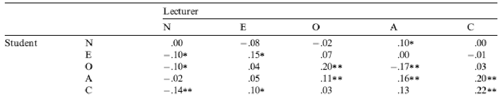

```{r, include = FALSE}
knitr::opts_chunk$set(
  collapse = TRUE,
  comment = "#>",
  warning = FALSE,
  message = FALSE
)
```

```{r setup, echo = F}
library(magrittr)
library(dplyr)
library(ggplot2)
chamorro_tib <- discovr::chamorro_premuzic
```


***

This document may contain abridged sections from *Discovering Statistics Using R and RStudio* by [Andy Field](https://www.discoveringstatistics.com/) so there are some copyright considerations, but the material is offered under a [Creative Commons Attribution-NonCommercial-NoDerivatives 4.0 International License](http://creativecommons.org/licenses/by-nc-nd/4.0/). Basically you can use this material for teaching and non-profit activities but please do not meddle with it or claim it as your own work.

***

## Why do you like your lecturers?

We can run this analysis by loading the file and just pretty much selecting everything in the variable list and running a Pearson correlation.

### Load the file

```{r, eval = FALSE}
library(tidyverse)
chamorro_tib <- readr::read_csv("../data/chamorro_premuzic.csv") %>% 
  dplyr::mutate(
    sex = forcats::as_factor(sex)
  )
```

Alternative, load the data directly from the `discovr` package:

```{r, eval=FALSE}
chamorro_tib <- discovr::chamorro_premuzic
```

### Obtain correlations

To get the correlations using `correlation()` (note I have set `p_adjust = "none"` because they didn't correct *p*-values for multiple tests in the paper):

```{r}
chamorro_r <- chamorro_tib %>% 
  dplyr::select(-c(age, sex)) %>%
  correlation::correlation(p_adjust = "none")

chamorro_r
```


This looks pretty horrendous, but there are a lot of correlations that we don’t need. We’re interested only in the correlations between students’ personality and what they want in lecturers. We’re not interested in how their own five personality traits correlate with each other (i.e. if a student is neurotic are they conscientious too?). Let's focus in on these correlations by using filter and applying the function `grepl()`, which returns TRUE if it finds an extression. Within `filter()` we ask for cases where the pattern "stu" is found for the variable `Parameter1` (this is what `grepl("stu", Parameter1) == TRUE` does) **and** where the pattern "lec" is found for the variable `Parameter2` (this is what `grepl("lec", Parameter2) == TRUE` does). This has the effect of returning the 25 correlations between student personality traits and those desired in lecturers. I round of the code by rounding the values to two decimal places to match the paper:

```{r}
chamorro_r %>% 
  dplyr::filter(grepl("stu", Parameter1) == TRUE & grepl("lec", Parameter2)) %>% 
  dplyr::mutate_if(
    vars(is.numeric(.)),
    list(~round(., 2))
  )
```

These values replicate the values reported in the original research paper (part of the authors’ table is below so you can see how they reported these values – match these values to the values in your output):


 

As for what we can conclude, well, neurotic students tend to want agreeable lecturers, $r = .10$, $p = .041$; extroverted students tend to want extroverted lecturers, $r = .15$, $p = .010$; students who are open to experience tend to want lecturers who are open to experience, $r = .20$, $p < .001$, and don't want agreeable lecturers, $r = -.16$, $p < .001$; agreeable students want every sort of lecturer apart from neurotic. Finally, conscientious students tend to want conscientious lecturers, $r = .22$, $p < .001$, and extroverted ones, $r = .10$, $p = .09$ (note that the authors report the one-tailed *p*-value), but don't want neurotic ones, $r = -.14$, $p = .005$.