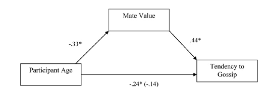

```{r, include = FALSE}
knitr::opts_chunk$set(
  collapse = TRUE,
  comment = "#>",
  warning = FALSE,
  message = FALSE
)
```

```{r setup, echo = FALSE}
library(magrittr)
library(dplyr)
library(ggplot2)

massar_tib <- discovr::massar_2012

```


***
This document may contain abridged sections from *Discovering Statistics Using R and RStudio* by [Andy Field](https://www.discoveringstatistics.com/) so there are some copyright considerations, but the material is offered under a [Creative Commons Attribution-NonCommercial-NoDerivatives 4.0 International License](http://creativecommons.org/licenses/by-nc-nd/4.0/). Basically you can use this material for teaching and non-profit activities but please do not meddle with it or claim it as your own work.
***


## Load the file

```{r, eval = FALSE}
massar_tib <- readr::read_csv("../data/massar_2012.csv")
```

Alternative, load the data directly from the `discovr` package:

```{r, eval=FALSE}
massar_tib <- discovr::massar_2012
```

## Solution using Baron and Kenny's method

Baron and Kenny suggested that mediation is tested through three linear models:

1. A linear model predicting the outcome (**gossip**) from the predictor variable (**age**).
2. A linear model predicting the mediator (**mate_value**) from the predictor variable (**age**).
3. A linear model predicting the outcome (**gossip**) from both the predictor variable (**age**) and the mediator (**mate_value**).

These models test the four conditions of mediation: (1) the predictor variable (**age**) must significantly predict the outcome variable (**gossip**) in model 1; (2) the predictor variable (**age**) must significantly predict the mediator (**mate_value**) in model 2; (3) the mediator (**mate_value**) must significantly predict the outcome (**gossip**) variable in model 3; and (4) the predictor variable (**age**) must predict the outcome variable (**gossip**) less strongly in model 3 than in model 1.

The paper reports standardized betas so I've used the `parameters` package to summarize the models using standardized coefficients.

### Model 1

```{r}
m1 <- lm(gossip ~ age, data = massar_tib)

parameters::model_parameters(m1, standardize = "refit") 
```

Model 1 indicates that the first condition of mediation was met, in that participant age was a significant predictor of the tendency to gossip, $t\text{(80)} = -2.59$, $p = .011$.

```{r}
m2 <- lm(mate_value ~ age, data = massar_tib)
parameters::model_parameters(m2, standardize = "refit") 
```

Model 2 shows that the second condition of mediation was met: participant age was a significant predictor of mate value, $t\text{(79)} = -3.67$, $p < .001$.

```{r}
m3 <- lm(gossip ~ age + mate_value, data = massar_tib)
parameters::model_parameters(m3, standardize = "refit") 
```

Model 3 shows that the third condition of mediation has been met: mate value significantly predicted the tendency to gossip while adjusting for participant age, $t\text{(78)} = 3.59$, $p < .001$. The fourth condition of mediation has also been met: the parameter estimate  between participant age and tendency to gossip decreased substantially when adjusting for mate value, in fact it is no longer significant, $t\text{(78)} = -1.28$, $p  = 0.21$. Therefore, we can conclude that the author's prediction is supported, and the relationship between participant age and tendency to gossip is mediated by mate value.



## Solution using `lavaan`

```{r}

massar_mod <- 'gossip ~ c*age + b*mate_value
                   mate_value ~ a*age

                   indirect_effect := a*b
                   total_effect := c + (a*b)
                   '

massar_fit <- lavaan::sem(massar_mod, data = massar_tib, missing = "FIML", estimator = "MLR")


broom::tidy(massar_fit, conf.int = TRUE) %>%
  dplyr::mutate_if(
    vars(is.numeric(.)),
    list(~round(., 3))
  )
```

The output shows that age significantly predicts mate value, $b = -0.03\text{, } t = -3.64\text{, } p < .001$. We can see that while age does not significantly predict tendency to gossip with mate value in the model, $b = -0.01\text{, } t = -1.36\text{, } p = .17$, mate value does significantly predict tendency to gossip, $b = 0.45\text{, } t = 3.26\text{, } p = .0001$. The negative *b* for age tells us that as age increases, tendency to gossip declines (and vice versa), but the positive *b* for mate value indicates that as mate value increases, tendency to gossip increases also. These relationships are in the predicted direction.

The total effect shows that when mate value is not in the model, age significantly predicts tendency to gossip, $b = -0.02\text{, } t = -2.89\text{, } p = .004$. Finally, the indirect effect of age on gossip is significant, $b = -0.012\text{, 95% CI} [-0.022, -0.0001] \text{, } t = -2.21\text{, } p = .027$. Put another way, mate value is a significant mediator of the relationship between age and tendency to gossip.
